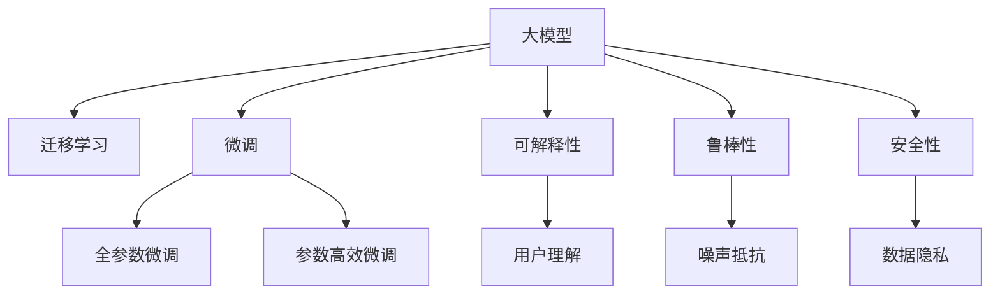

                 

# AI大模型创业：如何应对未来市场挑战？

## 1. 背景介绍

### 1.1 问题由来
在人工智能(AI)技术不断演进的今天，大模型（Large Model）凭借其在大规模数据上训练出的强大能力，逐渐成为AI创业公司竞争的核心。大模型不仅在诸如自然语言处理(NLP)、图像识别、推荐系统等领域展现出显著的优越性，还能通过迁移学习、微调等方式，被灵活应用到各类垂直领域，驱动业务创新。

然而，大模型的商业化应用仍面临诸多挑战。首先，构建大模型需要大量的算力和数据，这对创业公司来说无疑是一大笔投入。其次，大模型在推广应用过程中，如何保证模型的鲁棒性、安全性和可解释性，也是一大难题。此外，如何将大模型的潜力转化为实际的产品竞争力，亦需精心设计和考量。

本文将聚焦于AI大模型创业公司如何应对这些市场挑战，从模型构建、技术选型、业务部署等多个维度，探索成功的路径和方法。

### 1.2 问题核心关键点
1. **算力和数据**：大模型训练和应用所需的大量算力、数据和人力资源，如何高效利用，是创业公司的重要课题。
2. **模型鲁棒性**：如何确保大模型在实际场景下的鲁棒性和泛化能力，避免过拟合等问题。
3. **安全性与隐私保护**：确保大模型及其应用场景中的数据安全、隐私保护，避免模型被滥用或侵犯用户隐私。
4. **可解释性与用户体验**：如何提升模型的可解释性，提供更好的用户体验，增强用户信任。
5. **业务适配与部署**：如何将大模型灵活适配到各种业务场景中，高效部署，实现商业化落地。

解决这些核心关键点，才能在大模型创业的道路上行稳致远。

## 2. 核心概念与联系

### 2.1 核心概念概述

大模型创业的成功，离不开对核心概念的深刻理解。这里将介绍几个关键概念，并展示它们之间的联系：

1. **大模型（Large Model）**：指的是通过大规模数据集训练的复杂模型，如BERT、GPT-3等。大模型能够捕捉到丰富的语言特征和语义关系，在NLP等领域展现出显著的性能优势。

2. **迁移学习（Transfer Learning）**：指利用预训练模型的知识，对特定任务进行微调，以适应新场景，提高模型性能。

3. **微调（Fine-Tuning）**：针对特定任务，通过有监督学习，调整大模型的部分参数，以实现最优性能。

4. **可解释性（Explainability）**：指模型输出结果的可理解性，能够向用户展示其决策依据，增强用户信任。

5. **鲁棒性（Robustness）**：模型在面临噪声、数据变化等情况时，仍能保持稳定性能。

6. **安全性（Security）**：确保模型不被恶意利用，数据隐私得到保护，避免模型被攻击或滥用。

这些概念通过Mermaid流程图展示其联系，如下：



大模型通过迁移学习获取任务知识，然后通过微调适应特定场景，提高性能。在业务部署时，需注重可解释性和鲁棒性，同时确保数据安全和隐私保护。

## 3. 核心算法原理 & 具体操作步骤
### 3.1 算法原理概述

大模型创业的核心算法原理主要是迁移学习和微调。大模型通过在大规模无标签数据上进行预训练，获取通用的语言或图像表示。迁移学习通过在大模型基础上进行微调，利用已有知识加速特定任务的学习，提升模型性能。微调则是针对特定任务，通过有监督学习，进一步优化大模型，以适应任务需求。

### 3.2 算法步骤详解

以下是基于迁移学习和微调的大模型创业具体操作步骤：

1. **模型选择与数据准备**：选择合适的大模型作为初始化参数，准备任务所需的数据集，并将其划分为训练集、验证集和测试集。

2. **模型适配与损失函数设计**：根据任务类型，设计任务的适配层和损失函数。例如，对于分类任务，可采用交叉熵损失函数。

3. **微调超参数设置**：确定学习率、批大小、迭代次数等超参数。同时，设置正则化技术，如L2正则、Dropout等，以避免过拟合。

4. **训练与评估**：使用准备好的数据集进行梯度下降训练。在训练过程中，周期性在验证集上评估模型性能，并在测试集上最终评估模型效果。

5. **模型部署与优化**：将训练好的模型部署到实际应用中，并根据业务需求进行优化，如模型压缩、推理加速等。

### 3.3 算法优缺点

基于迁移学习和微调的大模型创业方法具有以下优点：

- **效率高**：利用已有知识加速特定任务学习，减少从头训练所需的成本和时间。
- **效果显著**：在特定任务上，微调后的模型通常能够取得较优性能。

同时，也存在一些缺点：

- **数据依赖**：微调依赖于任务相关的标注数据，获取高质量标注数据成本较高。
- **泛化能力有限**：当任务与预训练数据的分布差异较大时，微调的性能提升有限。
- **可解释性不足**：模型决策过程缺乏可解释性，难以调试和优化。

## 4. 数学模型和公式 & 详细讲解 & 举例说明

### 4.1 数学模型构建

假设大模型为 $M_\theta$，任务损失函数为 $L$。微调的目标是最小化损失函数 $L$，得到最优参数 $\theta^*$：

$$
\theta^* = \arg\min_\theta L(M_\theta)
$$

常见损失函数包括交叉熵损失、均方误差等。

### 4.2 公式推导过程

以二分类任务为例，假设模型 $M_\theta$ 的输出为 $\hat{y} = M_\theta(x)$，真实标签为 $y \in \{0,1\}$。则二分类交叉熵损失函数为：

$$
L(\theta) = -\frac{1}{N} \sum_{i=1}^N [y_i \log \hat{y_i} + (1-y_i) \log (1-\hat{y_i})]
$$

其梯度为：

$$
\frac{\partial L(\theta)}{\partial \theta_k} = -\frac{1}{N} \sum_{i=1}^N \left(\frac{y_i}{\hat{y_i}} - \frac{1-y_i}{1-\hat{y_i}}\right) \frac{\partial M_\theta(x_i)}{\partial \theta_k}
$$

其中，$\frac{\partial M_\theta(x_i)}{\partial \theta_k}$ 可通过自动微分技术得到。

### 4.3 案例分析与讲解

以情感分析为例，假设输入文本为“I love this movie”，模型输出为 $\hat{y} = 0.9$，真实标签 $y = 1$。则计算得到的损失为：

$$
L(\theta) = -\frac{1}{N} [1 \log 0.9 + 0 \log (1-0.9)] = -0.099
$$

## 5. 项目实践：代码实例和详细解释说明

### 5.1 开发环境搭建

开发环境搭建分为以下几个步骤：

1. **选择开发语言和框架**：Python和TensorFlow/PyTorch是目前常用的AI开发工具。

2. **安装相关库**：安装TensorFlow或PyTorch，以及模型适配层和损失函数库。

3. **配置环境**：设置GPU使用，确保模型能够高效训练和推理。

### 5.2 源代码详细实现

以下是使用TensorFlow对BERT模型进行情感分析微调的代码实现：

```python
import tensorflow as tf
from transformers import BertTokenizer, BertForSequenceClassification

# 加载数据集和分词器
tokenizer = BertTokenizer.from_pretrained('bert-base-cased')
train_data, dev_data, test_data = load_data()

# 定义模型
model = BertForSequenceClassification.from_pretrained('bert-base-cased', num_labels=2)

# 定义损失函数
loss_fn = tf.keras.losses.SparseCategoricalCrossentropy(from_logits=True)

# 定义优化器
optimizer = tf.keras.optimizers.Adam()

# 训练模型
for epoch in range(EPOCHS):
    train_loss = train(model, optimizer, loss_fn, train_data)
    dev_loss = evaluate(model, dev_data, loss_fn)
    if dev_loss < best_dev_loss:
        best_dev_loss = dev_loss
        save_model(model)

def train(model, optimizer, loss_fn, data):
    total_loss = 0.0
    for x, y in data:
        with tf.GradientTape() as tape:
            logits = model(x)
            loss = loss_fn(y, logits)
        grads = tape.gradient(loss, model.trainable_variables)
        optimizer.apply_gradients(zip(grads, model.trainable_variables))
        total_loss += loss.numpy()
    return total_loss / len(data)

def evaluate(model, data, loss_fn):
    total_loss = 0.0
    total_correct = 0
    for x, y in data:
        logits = model(x)
        loss = loss_fn(y, logits)
        total_loss += loss.numpy()
        preds = tf.argmax(logits, axis=1).numpy()
        total_correct += (preds == y).sum()
    return total_loss / len(data), total_correct / len(data)
```

### 5.3 代码解读与分析

代码主要分为以下几个部分：

1. **数据加载与分词器加载**：使用BertTokenizer对文本进行分词，准备输入数据。

2. **模型定义与损失函数选择**：使用BertForSequenceClassification定义情感分析模型，并使用SparseCategoricalCrossentropy作为损失函数。

3. **优化器与模型训练**：定义Adam优化器，进行梯度下降训练，并在每个epoch计算损失和评估指标。

4. **模型评估与保存**：在验证集上评估模型性能，保存最佳模型。

## 6. 实际应用场景

### 6.1 智能客服系统

智能客服系统是大模型创业的重要应用场景。通过微调大模型，客服系统可以自动理解和回答用户问题，提升用户体验。例如，某电商平台使用微调后的BERT模型，构建了智能客服系统，在处理用户咨询时，系统能够快速响应，并提供准确的答案。

### 6.2 金融舆情监测

金融行业需要实时监测舆情变化，预测市场趋势。基于大模型的舆情监测系统，可以自动分析金融新闻、评论等文本，识别情感倾向和主题变化，帮助金融机构提前应对风险。

### 6.3 个性化推荐系统

个性化推荐系统通过微调大模型，能够更好地理解用户兴趣，提供精准推荐。例如，某视频平台使用BERT模型微调，构建了个性化推荐系统，大幅提高了用户满意度和留存率。

### 6.4 未来应用展望

未来，大模型创业在更多领域将展现其潜力。例如，医疗领域的疾病预测、健康管理，教育领域的个性化学习，零售领域的商品推荐，都将受益于大模型的应用。同时，随着AI技术的发展，大模型创业也将迎来新的机遇和挑战，需要不断创新和优化。

## 7. 工具和资源推荐

### 7.1 学习资源推荐

1. **TensorFlow官方文档**：全面介绍了TensorFlow的使用和模型训练。
2. **Transformers库文档**：提供了预训练模型的使用和微调示例。
3. **Kaggle竞赛平台**：通过参加NLP相关的竞赛，积累实际应用经验。
4. **ArXiv预印本网站**：最新研究论文和代码的来源。

### 7.2 开发工具推荐

1. **Jupyter Notebook**：数据处理和模型训练的首选工具。
2. **Google Colab**：免费提供GPU算力的在线平台。
3. **TensorBoard**：可视化模型训练过程，监控模型性能。
4. **ModelOptimization Toolkit**：优化模型推理速度和内存占用。

### 7.3 相关论文推荐

1. **BERT论文**：提出了BERT模型，通过掩码语言模型和下一句预测任务进行预训练。
2. **GPT-3论文**：展示了GPT-3模型在语言理解、生成、翻译等方面的优越性能。
3. **Transformers论文**：介绍了Transformer架构及其应用。

## 8. 总结：未来发展趋势与挑战

### 8.1 研究成果总结

大模型创业已经取得显著进展，特别是在自然语言处理、图像识别等领域。未来，大模型将朝着更大规模、更高性能、更广泛应用的方向发展。

### 8.2 未来发展趋势

1. **模型规模化**：大模型的参数量将不断增加，能够处理更复杂的任务。
2. **微调方法多样化**：出现更多参数高效微调方法，提升微调效率。
3. **跨领域融合**：多模态学习成为趋势，结合视觉、听觉等多模态数据，提升模型泛化能力。
4. **可解释性与透明性**：增强模型的可解释性，提供决策依据。
5. **自动化与智能化**：自动化的超参数优化和模型训练，智能化的模型管理。

### 8.3 面临的挑战

1. **数据与算力成本**：构建和维护大模型需要大量数据和算力资源。
2. **模型鲁棒性与泛化能力**：模型在实际应用中的表现不稳定。
3. **隐私与安全**：保护用户隐私，避免模型被滥用。
4. **可解释性与透明度**：模型决策缺乏透明性和可解释性。
5. **市场竞争**：AI领域竞争激烈，如何保持市场竞争力。

### 8.4 研究展望

未来，大模型创业需要关注以下几个方面：

1. **无监督学习**：减少对标注数据的依赖，利用自监督学习提升模型性能。
2. **跨领域迁移**：提升模型在不同领域之间的迁移能力，增强模型的通用性。
3. **多模态融合**：结合视觉、听觉等多模态数据，提升模型的泛化能力。
4. **可解释性与透明性**：增强模型的可解释性，提升用户信任度。
5. **自动化与智能化**：实现自动化的超参数优化和模型训练，智能化的模型管理。

## 9. 附录：常见问题与解答

**Q1: 大模型微调是否需要大规模标注数据？**

A: 不是必需的。可以利用无监督学习或半监督学习进行微调，减少对标注数据的依赖。

**Q2: 如何提高模型鲁棒性？**

A: 使用数据增强、对抗训练、正则化等技术，提升模型在各种场景下的鲁棒性。

**Q3: 如何提升模型可解释性？**

A: 引入可解释性技术，如LIME、SHAP等，提供决策依据。

**Q4: 如何优化模型部署？**

A: 使用模型压缩、推理加速等技术，提升模型在实际应用中的性能和效率。

---

作者：禅与计算机程序设计艺术 / Zen and the Art of Computer Programming

