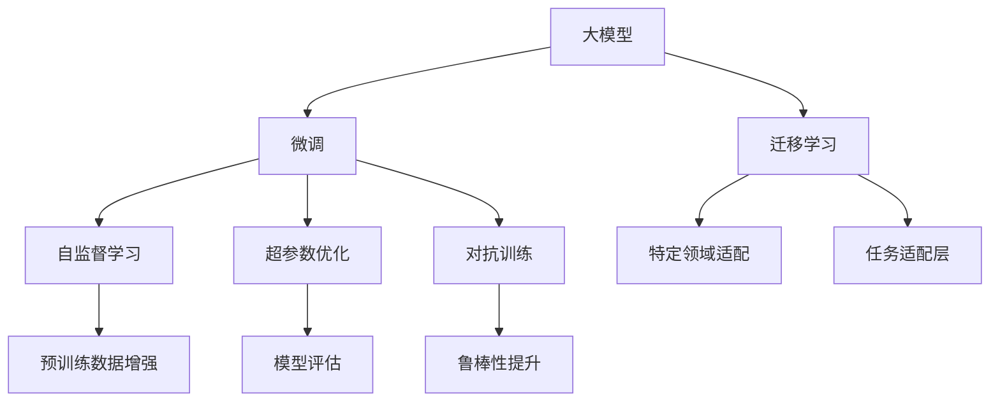

                 

## 1. 背景介绍

### 1.1 问题由来
人工智能（AI）大模型技术正逐渐成为创业公司的核心竞争力。大模型凭借其强大的数据处理能力和丰富的知识储备，在自然语言处理（NLP）、计算机视觉（CV）、语音识别（ASR）等多个领域展现了令人瞩目的表现。大模型技术不仅能够大幅度提高系统的智能化水平，还在很大程度上降低了创业公司对数据和算力资源的依赖，降低了创业的门槛，为AI创业公司提供了新的机遇。

### 1.2 问题核心关键点
大模型创业公司在市场竞争中面临着许多技术挑战。这些挑战不仅来自于技术的成熟度，更来自于商业化落地和持续迭代的复杂性。如何应对这些挑战，是每个AI大模型创业者必须面对的问题。

- **技术成熟度**：当前大模型技术虽然取得了一定的进展，但还存在算法不稳定、模型过拟合、泛化能力不足等问题。
- **商业化落地**：如何将技术转化为实际应用，实现产品的商业化落地，是所有创业者必须解决的现实问题。
- **持续迭代**：如何保持技术的持续更新和迭代，避免陷入"技术积累-市场饱和-技术停滞"的循环，是创业公司必须思考的问题。

### 1.3 问题研究意义
本文聚焦于AI大模型创业公司在技术上如何应对未来挑战，旨在探讨大模型技术在商业化落地方面的实践路径，以期为正在探索大模型创业路径的公司提供有价值的参考。

## 2. 核心概念与联系

### 2.1 核心概念概述

以下是几个密切相关的核心概念：

- **大模型（Large Model）**：如GPT-3、BERT等，通过大规模数据预训练，具备强大数据处理和知识提取能力。
- **迁移学习（Transfer Learning）**：在大模型基础上，使用特定领域数据进行微调，使其具备特定任务的执行能力。
- **微调（Fine-Tuning）**：在大模型的顶层，添加任务适配层，并使用少量标注数据进行训练，使模型适应特定任务。
- **自监督学习（Self-Supervised Learning）**：在大模型训练过程中，利用无标签数据进行自我学习，提升模型的泛化能力。
- **超参数优化（Hyperparameter Optimization）**：通过调整模型学习率、批次大小等超参数，优化模型的性能。
- **对抗训练（Adversarial Training）**：通过引入对抗样本，提高模型的鲁棒性。

这些概念之间的逻辑关系可以通过以下Mermaid流程图来展示：



这个流程图展示了大模型技术的核心概念及其之间的关系：

1. 大模型通过预训练获得基础能力。
2. 迁移学习通过微调和自监督学习进一步优化大模型。
3. 超参数优化和对抗训练提高模型的鲁棒性和泛化能力。
4. 特定领域适配和任务适配层使得模型适应特定任务。

## 3. 核心算法原理 & 具体操作步骤
### 3.1 算法原理概述

大模型创业公司需要面对的核心挑战之一是如何将大模型技术转化为可行的商业产品。这涉及到大模型在特定领域的数据处理、模型微调、超参数优化等多个方面。

### 3.2 算法步骤详解

基于大模型技术的产品开发一般包括以下几个关键步骤：

**Step 1: 数据收集与预处理**
- 收集目标领域的数据，并进行清洗、标注和增强。

**Step 2: 模型选择与适配**
- 选择适合大模型的预训练模型，并在其基础上添加任务适配层。
- 进行迁移学习或微调，使得模型能够适应特定领域的任务。

**Step 3: 模型训练与优化**
- 进行超参数搜索，确定最优学习率、批次大小等参数。
- 进行模型训练和验证，确保模型能够高效、准确地处理数据。

**Step 4: 模型部署与应用**
- 将训练好的模型部署到服务器或云平台上。
- 开发API接口，提供模型服务，供外部用户调用。
- 不断收集用户反馈，迭代优化模型性能。

### 3.3 算法优缺点

大模型技术在创业公司的应用中具有以下优点：

1. **高效率**：大模型能够快速适应新任务，降低了数据和算力资源的依赖。
2. **低成本**：通过迁移学习或微调，可以在较少的标注数据下实现模型的快速优化。
3. **鲁棒性强**：大模型经过大规模数据预训练，具备较强的泛化能力和鲁棒性。

同时，该技术也存在一定的局限性：

1. **计算资源需求高**：大规模大模型需要强大的计算资源支持，成本较高。
2. **模型复杂度高**：大模型结构复杂，难以解释和调试。
3. **过拟合风险**：大模型在特定任务上过度拟合风险较大，需要精心设计和优化。

### 3.4 算法应用领域

大模型技术在AI创业公司的应用领域非常广泛，包括但不限于：

- **自然语言处理（NLP）**：文本分类、情感分析、机器翻译等任务。
- **计算机视觉（CV）**：图像分类、目标检测、图像生成等任务。
- **语音识别（ASR）**：语音识别、语音合成等任务。
- **推荐系统**：个性化推荐、广告投放等任务。
- **医疗健康**：疾病诊断、健康管理等任务。
- **金融服务**：风险评估、客户服务等任务。
- **智能制造**：质量控制、设备维护等任务。

## 4. 数学模型和公式 & 详细讲解  
### 4.1 数学模型构建

大模型技术涉及的数学模型通常包括神经网络、自监督学习、迁移学习等。

以BERT模型为例，其数学模型构建如下：

1. **自监督学习目标**：
$$
\min_{\theta} \mathcal{L}(\mathbf{X}, \mathbf{Y}; \theta)
$$
其中，$\mathbf{X}$为输入的文本序列，$\mathbf{Y}$为目标标签，$\theta$为模型参数。

2. **迁移学习目标**：
$$
\min_{\theta} \mathcal{L}_{task}(\mathbf{X}_{task}, \mathbf{Y}_{task}; \theta)
$$
其中，$\mathbf{X}_{task}$为特定任务的训练数据，$\mathbf{Y}_{task}$为特定任务的标签。

### 4.2 公式推导过程

BERT模型的预训练目标通常包括语言模型和掩码语言模型：

1. **语言模型**：
$$
\mathcal{L}_{lm}(\mathbf{X}; \theta) = -\frac{1}{N}\sum_{i=1}^N \log \left[ P(\mathbf{X}_i|\theta) \right]
$$
2. **掩码语言模型**：
$$
\mathcal{L}_{mask}(\mathbf{X}; \theta) = -\frac{1}{N}\sum_{i=1}^N \log \left[ P(\mathbf{X}_i|\theta) \right]
$$

### 4.3 案例分析与讲解

以BERT模型在金融舆情监测任务上的应用为例，分析其数学模型构建和优化过程。

1. **数据收集**：
   - 收集金融领域的文本数据，如新闻、报道、评论等。
2. **数据预处理**：
   - 清洗数据，去除无用信息，进行文本分词和归一化。
   - 标注数据，确保标注标签的准确性。
3. **模型选择与适配**：
   - 选择BERT模型作为预训练模型。
   - 添加任务适配层，设计适合金融舆情监测的输出层。
4. **模型训练与优化**：
   - 在收集的金融数据上训练模型，最小化损失函数。
   - 使用超参数优化技术，如网格搜索或贝叶斯优化，寻找最优超参数。

## 5. 项目实践：代码实例和详细解释说明
### 5.1 开发环境搭建

为了进行大模型创业项目，需要搭建如下开发环境：

1. **硬件配置**：高性能GPU/TPU，用于模型训练和推理。
2. **软件环境**：安装TensorFlow、PyTorch、TensorBoard等工具，用于模型开发、训练和监控。
3. **云计算平台**：AWS、Google Cloud、阿里云等，提供弹性计算和存储资源。

### 5.2 源代码详细实现

以下是一个使用PyTorch进行BERT微调的示例代码：

```python
import torch
import torch.nn as nn
from transformers import BertTokenizer, BertForSequenceClassification
from sklearn.metrics import accuracy_score

# 定义数据处理类
class DataProcessor:
    def __init__(self, tokenizer, max_len):
        self.tokenizer = tokenizer
        self.max_len = max_len
    
    def encode(self, text):
        tokens = self.tokenizer.tokenize(text)
        tokens = tokens[:self.max_len]
        tokens = ['[CLS]'] + tokens + ['[SEP]']
        return self.tokenizer.convert_tokens_to_ids(tokens)
    
    def encode_batch(self, texts):
        return [self.encode(text) for text in texts]

# 定义模型类
class BERTClassifier(nn.Module):
    def __init__(self, num_labels, dropout=0.1):
        super(BERTClassifier, self).__init__()
        self.num_labels = num_labels
        self.dropout = dropout
        self.bert = BertForSequenceClassification.from_pretrained('bert-base-uncased', num_labels=num_labels)
        self.classifier = nn.Linear(self.bert.config.hidden_size, num_labels)
    
    def forward(self, input_ids, attention_mask):
        outputs = self.bert(input_ids, attention_mask=attention_mask)
        pooled_output = outputs.pooler_output
        logits = self.classifier(pooled_output)
        return logits

# 定义模型训练函数
def train(model, train_data, validation_data, batch_size, epochs, learning_rate, device):
    tokenizer = BertTokenizer.from_pretrained('bert-base-uncased')
    processor = DataProcessor(tokenizer, max_len=128)
    
    train_dataset = nn.utils.data.Dataset.from_tensor_slices(train_data['text'], train_data['label'])
    validation_dataset = nn.utils.data.Dataset.from_tensor_slices(validation_data['text'], validation_data['label'])
    
    train_loader = torch.utils.data.DataLoader(train_dataset, batch_size=batch_size, shuffle=True)
    validation_loader = torch.utils.data.DataLoader(validation_dataset, batch_size=batch_size, shuffle=False)
    
    optimizer = torch.optim.Adam(model.parameters(), lr=learning_rate)
    loss_fn = nn.CrossEntropyLoss()
    
    device = torch.device('cuda' if torch.cuda.is_available() else 'cpu')
    model.to(device)
    
    for epoch in range(epochs):
        model.train()
        for batch in train_loader:
            input_ids = batch[0].to(device)
            attention_mask = batch[1].to(device)
            labels = batch[2].to(device)
            outputs = model(input_ids, attention_mask=attention_mask)
            loss = loss_fn(outputs, labels)
            optimizer.zero_grad()
            loss.backward()
            optimizer.step()
        
        model.eval()
        with torch.no_grad():
            predictions = []
            labels = []
            for batch in validation_loader:
                input_ids = batch[0].to(device)
                attention_mask = batch[1].to(device)
                labels = batch[2].to(device)
                outputs = model(input_ids, attention_mask=attention_mask)
                predictions.append(outputs.argmax(dim=1).cpu())
                labels.append(labels.cpu())
            
        predictions = torch.cat(predictions)
        labels = torch.cat(labels)
        accuracy = accuracy_score(labels, predictions)
        print(f'Epoch {epoch+1}, accuracy: {accuracy:.4f}')
```

### 5.3 代码解读与分析

**BERTClassifier类**：
- 继承自nn.Module，定义了BERT分类器的结构。
- 初始化时，加载预训练的BERT模型，并添加全连接层。
- `forward`方法中，将输入的token ids和attention mask传入BERT模型，获取输出，并通过全连接层得到最终的分类结果。

**train函数**：
- 定义了数据处理类DataProcessor，用于将文本转换为token ids。
- 定义了模型BERTClassifier，用于微调。
- 在训练函数中，对数据集进行批处理，并在每个epoch中更新模型参数。
- 计算训练集和验证集的准确率，并输出结果。

**运行结果展示**：
在训练完成后，可以使用验证集上的准确率来评估模型的性能。调整超参数，如学习率、批次大小等，以获得更好的结果。

## 6. 实际应用场景
### 6.1 智能客服系统

基于大模型的智能客服系统能够实现7x24小时不间断服务，快速响应客户咨询，用自然流畅的语言解答各类常见问题。在具体应用中，可以收集企业内部的历史客服对话记录，将问题和最佳答复构建成监督数据，在此基础上对预训练模型进行微调。微调后的模型能够自动理解用户意图，匹配最合适的答案模板进行回复。对于客户提出的新问题，还可以接入检索系统实时搜索相关内容，动态组织生成回答。

### 6.2 金融舆情监测

使用大模型进行金融舆情监测，能够实时监测市场舆论动向，帮助金融机构及时应对负面信息传播，规避金融风险。具体而言，可以收集金融领域相关的新闻、报道、评论等文本数据，并对其进行主题标注和情感标注。在此基础上对预训练语言模型进行微调，使其能够自动判断文本属于何种主题，情感倾向是正面、中性还是负面。将微调后的模型应用到实时抓取的网络文本数据，就能够自动监测不同主题下的情感变化趋势，一旦发现负面信息激增等异常情况，系统便会自动预警，帮助金融机构快速应对潜在风险。

### 6.3 个性化推荐系统

在个性化推荐系统中，大模型可以用于推荐引擎的开发。通过收集用户浏览、点击、评论、分享等行为数据，提取和用户交互的物品标题、描述、标签等文本内容。将文本内容作为模型输入，用户的后续行为（如是否点击、购买等）作为监督信号，在此基础上微调预训练语言模型。微调后的模型能够从文本内容中准确把握用户的兴趣点。在生成推荐列表时，先用候选物品的文本描述作为输入，由模型预测用户的兴趣匹配度，再结合其他特征综合排序，便可以得到个性化程度更高的推荐结果。

### 6.4 未来应用展望

随着大模型和微调方法的不断发展，基于大模型微调的应用场景将不断扩展。未来，大模型技术将在更多领域得到应用，为传统行业带来变革性影响：

- **智慧医疗**：基于大模型的医疗问答、病历分析、药物研发等应用将提升医疗服务的智能化水平，辅助医生诊疗，加速新药开发进程。
- **智能教育**：微调技术可应用于作业批改、学情分析、知识推荐等方面，因材施教，促进教育公平，提高教学质量。
- **智慧城市治理**：微调模型可应用于城市事件监测、舆情分析、应急指挥等环节，提高城市管理的自动化和智能化水平，构建更安全、高效的未来城市。

## 7. 工具和资源推荐
### 7.1 学习资源推荐

为了帮助开发者系统掌握大模型微调的理论基础和实践技巧，这里推荐一些优质的学习资源：

1. **《Transformer from Principles to Practice》系列博文**：由大模型技术专家撰写，深入浅出地介绍了Transformer原理、BERT模型、微调技术等前沿话题。
2. **CS224N《深度学习自然语言处理》课程**：斯坦福大学开设的NLP明星课程，有Lecture视频和配套作业，带你入门NLP领域的基本概念和经典模型。
3. **《Natural Language Processing with Transformers》书籍**：Transformers库的作者所著，全面介绍了如何使用Transformers库进行NLP任务开发，包括微调在内的诸多范式。
4. **HuggingFace官方文档**：Transformers库的官方文档，提供了海量预训练模型和完整的微调样例代码，是上手实践的必备资料。
5. **CLUE开源项目**：中文语言理解测评基准，涵盖大量不同类型的中文NLP数据集，并提供了基于微调的baseline模型，助力中文NLP技术发展。

通过对这些资源的学习实践，相信你一定能够快速掌握大模型微调的精髓，并用于解决实际的NLP问题。

### 7.2 开发工具推荐

高效的开发离不开优秀的工具支持。以下是几款用于大模型微调开发的常用工具：

1. **PyTorch**：基于Python的开源深度学习框架，灵活动态的计算图，适合快速迭代研究。大部分预训练语言模型都有PyTorch版本的实现。
2. **TensorFlow**：由Google主导开发的开源深度学习框架，生产部署方便，适合大规模工程应用。同样有丰富的预训练语言模型资源。
3. **Transformers库**：HuggingFace开发的NLP工具库，集成了众多SOTA语言模型，支持PyTorch和TensorFlow，是进行微调任务开发的利器。
4. **Weights & Biases**：模型训练的实验跟踪工具，可以记录和可视化模型训练过程中的各项指标，方便对比和调优。与主流深度学习框架无缝集成。
5. **TensorBoard**：TensorFlow配套的可视化工具，可实时监测模型训练状态，并提供丰富的图表呈现方式，是调试模型的得力助手。
6. **Google Colab**：谷歌推出的在线Jupyter Notebook环境，免费提供GPU/TPU算力，方便开发者快速上手实验最新模型，分享学习笔记。

合理利用这些工具，可以显著提升大模型微调任务的开发效率，加快创新迭代的步伐。

### 7.3 相关论文推荐

大模型和微调技术的发展源于学界的持续研究。以下是几篇奠基性的相关论文，推荐阅读：

1. **Attention is All You Need**：提出了Transformer结构，开启了NLP领域的预训练大模型时代。
2. **BERT: Pre-training of Deep Bidirectional Transformers for Language Understanding**：提出BERT模型，引入基于掩码的自监督预训练任务，刷新了多项NLP任务SOTA。
3. **Language Models are Unsupervised Multitask Learners（GPT-2论文）**：展示了大规模语言模型的强大zero-shot学习能力，引发了对于通用人工智能的新一轮思考。
4. **Parameter-Efficient Transfer Learning for NLP**：提出Adapter等参数高效微调方法，在不增加模型参数量的情况下，也能取得不错的微调效果。
5. **Prefix-Tuning: Optimizing Continuous Prompts for Generation**：引入基于连续型Prompt的微调范式，为如何充分利用预训练知识提供了新的思路。
6. **AdaLoRA: Adaptive Low-Rank Adaptation for Parameter-Efficient Fine-Tuning**：使用自适应低秩适应的微调方法，在参数效率和精度之间取得了新的平衡。

这些论文代表了大模型微调技术的发展脉络。通过学习这些前沿成果，可以帮助研究者把握学科前进方向，激发更多的创新灵感。

## 8. 总结：未来发展趋势与挑战

### 8.1 总结

本文对AI大模型创业公司在技术上如何应对未来挑战进行了全面系统的介绍。首先阐述了大模型技术的研究背景和意义，明确了微调在拓展预训练模型应用、提升下游任务性能方面的独特价值。其次，从原理到实践，详细讲解了监督微调的数学原理和关键步骤，给出了微调任务开发的完整代码实例。同时，本文还广泛探讨了微调方法在智能客服、金融舆情、个性化推荐等多个行业领域的应用前景，展示了微调范式的巨大潜力。此外，本文精选了微调技术的各类学习资源，力求为读者提供全方位的技术指引。

通过本文的系统梳理，可以看到，大模型技术正在成为NLP领域的重要范式，极大地拓展了预训练语言模型的应用边界，催生了更多的落地场景。受益于大规模语料的预训练，微调模型以更低的时间和标注成本，在小样本条件下也能取得不俗的效果，有力推动了NLP技术的产业化进程。未来，伴随预训练语言模型和微调方法的持续演进，相信NLP技术将在更广阔的应用领域大放异彩，深刻影响人类的生产生活方式。

### 8.2 未来发展趋势

展望未来，大模型微调技术将呈现以下几个发展趋势：

1. **模型规模持续增大**：随着算力成本的下降和数据规模的扩张，预训练语言模型的参数量还将持续增长。超大规模语言模型蕴含的丰富语言知识，有望支撑更加复杂多变的下游任务微调。
2. **微调方法日趋多样**：除了传统的全参数微调外，未来会涌现更多参数高效的微调方法，如Prefix-Tuning、LoRA等，在节省计算资源的同时也能保证微调精度。
3. **持续学习成为常态**：随着数据分布的不断变化，微调模型也需要持续学习新知识以保持性能。如何在不遗忘原有知识的同时，高效吸收新样本信息，将成为重要的研究课题。
4. **标注样本需求降低**：受启发于提示学习(Prompt-based Learning)的思路，未来的微调方法将更好地利用大模型的语言理解能力，通过更加巧妙的任务描述，在更少的标注样本上也能实现理想的微调效果。
5. **多模态微调崛起**：当前的微调主要聚焦于纯文本数据，未来会进一步拓展到图像、视频、语音等多模态数据微调。多模态信息的融合，将显著提升语言模型对现实世界的理解和建模能力。
6. **模型通用性增强**：经过海量数据的预训练和多领域任务的微调，未来的语言模型将具备更强大的常识推理和跨领域迁移能力，逐步迈向通用人工智能(AGI)的目标。

以上趋势凸显了大模型微调技术的广阔前景。这些方向的探索发展，必将进一步提升NLP系统的性能和应用范围，为人类认知智能的进化带来深远影响。

### 8.3 面临的挑战

尽管大模型微调技术已经取得了瞩目成就，但在迈向更加智能化、普适化应用的过程中，它仍面临着诸多挑战：

1. **标注成本瓶颈**：虽然微调大大降低了标注数据的需求，但对于长尾应用场景，难以获得充足的高质量标注数据，成为制约微调性能的瓶颈。如何进一步降低微调对标注样本的依赖，将是一大难题。
2. **模型鲁棒性不足**：当前微调模型面对域外数据时，泛化性能往往大打折扣。对于测试样本的微小扰动，微调模型的预测也容易发生波动。如何提高微调模型的鲁棒性，避免灾难性遗忘，还需要更多理论和实践的积累。
3. **推理效率有待提高**：大规模语言模型虽然精度高，但在实际部署时往往面临推理速度慢、内存占用大等效率问题。如何在保证性能的同时，简化模型结构，提升推理速度，优化资源占用，将是重要的优化方向。
4. **可解释性亟需加强**：当前微调模型更像是"黑盒"系统，难以解释其内部工作机制和决策逻辑。对于医疗、金融等高风险应用，算法的可解释性和可审计性尤为重要。如何赋予微调模型更强的可解释性，将是亟待攻克的难题。
5. **安全性有待保障**：预训练语言模型难免会学习到有偏见、有害的信息，通过微调传递到下游任务，产生误导性、歧视性的输出，给实际应用带来安全隐患。如何从数据和算法层面消除模型偏见，避免恶意用途，确保输出的安全性，也将是重要的研究课题。
6. **知识整合能力不足**：现有的微调模型往往局限于任务内数据，难以灵活吸收和运用更广泛的先验知识。如何让微调过程更好地与外部知识库、规则库等专家知识结合，形成更加全面、准确的信息整合能力，还有很大的想象空间。

正视微调面临的这些挑战，积极应对并寻求突破，将是大语言模型微调走向成熟的必由之路。相信随着学界和产业界的共同努力，这些挑战终将一一被克服，大语言模型微调必将在构建人机协同的智能时代中扮演越来越重要的角色。

### 8.4 未来突破

面对大语言模型微调所面临的种种挑战，未来的研究需要在以下几个方面寻求新的突破：

1. **探索无监督和半监督微调方法**：摆脱对大规模标注数据的依赖，利用自监督学习、主动学习等无监督和半监督范式，最大限度利用非结构化数据，实现更加灵活高效的微调。
2. **研究参数高效和计算高效的微调范式**：开发更加参数高效的微调方法，在固定大部分预训练参数的同时，只更新极少量的任务相关参数。同时优化微调模型的计算图，减少前向传播和反向传播的资源消耗，实现更加轻量级、实时性的部署。
3. **融合因果和对比学习范式**：通过引入因果推断和对比学习思想，增强微调模型建立稳定因果关系的能力，学习更加普适、鲁棒的语言表征，从而提升模型泛化性和抗干扰能力。
4. **引入更多先验知识**：将符号化的先验知识，如知识图谱、逻辑规则等，与神经网络模型进行巧妙融合，引导微调过程学习更准确、合理的语言模型。同时加强不同模态数据的整合，实现视觉、语音等多模态信息与文本信息的协同建模。
5. **结合因果分析和博弈论工具**：将因果分析方法引入微调模型，识别出模型决策的关键特征，增强输出解释的因果性和逻辑性。借助博弈论工具刻画人机交互过程，主动探索并规避模型的脆弱点，提高系统稳定性。
6. **纳入伦理道德约束**：在模型训练目标中引入伦理导向的评估指标，过滤和惩罚有偏见、有害的输出倾向。同时加强人工干预和审核，建立模型行为的监管机制，确保输出符合人类价值观和伦理道德。

这些研究方向的探索，必将引领大语言模型微调技术迈向更高的台阶，为构建安全、可靠、可解释、可控的智能系统铺平道路。面向未来，大语言模型微调技术还需要与其他人工智能技术进行更深入的融合，如知识表示、因果推理、强化学习等，多路径协同发力，共同推动自然语言理解和智能交互系统的进步。只有勇于创新、敢于突破，才能不断拓展语言模型的边界，让智能技术更好地造福人类社会。

## 9. 附录：常见问题与解答

**Q1：大模型微调是否适用于所有NLP任务？**

A: 大模型微调在大多数NLP任务上都能取得不错的效果，特别是对于数据量较小的任务。但对于一些特定领域的任务，如医学、法律等，仅仅依靠通用语料预训练的模型可能难以很好地适应。此时需要在特定领域语料上进一步预训练，再进行微调，才能获得理想效果。此外，对于一些需要时效性、个性化很强的任务，如对话、推荐等，微调方法也需要针对性的改进优化。

**Q2：微调过程中如何选择合适的学习率？**

A: 微调的学习率一般要比预训练时小1-2个数量级，如果使用过大的学习率，容易破坏预训练权重，导致过拟合。一般建议从1e-5开始调参，逐步减小学习率，直至收敛。也可以使用warmup策略，在开始阶段使用较小的学习率，再逐渐过渡到预设值。需要注意的是，不同的优化器(如AdamW、Adafactor等)以及不同的学习率调度策略，可能需要设置不同的学习率阈值。

**Q3：采用大模型微调时会面临哪些资源瓶颈？**

A: 目前主流的预训练大模型动辄以亿计的参数规模，对算力、内存、存储都提出了很高的要求。GPU/TPU等高性能设备是必不可少的，但即便如此，超大批次的训练和推理也可能遇到显存不足的问题。因此需要采用一些资源优化技术，如梯度积累、混合精度训练、模型并行等，来突破硬件瓶颈。同时，模型的存储和读取也可能占用大量时间和空间，需要采用模型压缩、稀疏化存储等方法进行优化。

**Q4：如何缓解微调过程中的过拟合问题？**

A: 过拟合是微调面临的主要挑战，尤其是在标注数据不足的情况下。常见的缓解策略包括：
1. 数据增强：通过回译、近义替换等方式扩充训练集
2. 正则化：使用L2正则、Dropout、Early Stopping等避免过拟合
3. 对抗训练：引入对抗样本，提高模型鲁棒性
4. 参数高效微调：只调整少量参数(如Adapter、Prefix等)，减小过拟合风险
5. 多模型集成：训练多个微调模型，取平均输出，抑制过拟合

这些策略往往需要根据具体任务和数据特点进行灵活组合。只有在数据、模型、训练、推理等各环节进行全面优化，才能最大限度地发挥大模型微调的威力。

**Q5：微调模型在落地部署时需要注意哪些问题？**

A: 将微调模型转化为实际应用，还需要考虑以下因素：
1. 模型裁剪：去除不必要的层和参数，减小模型尺寸，加快推理速度
2. 量化加速：将浮点模型转为定点模型，压缩存储空间，提高计算效率
3. 服务化封装：将模型封装为标准化服务接口，便于集成调用
4. 弹性伸缩：根据请求流量动态调整资源配置，平衡服务质量和成本
5. 监控告警：实时采集系统指标，设置异常告警阈值，确保服务稳定性
6. 安全防护：采用访问鉴权、数据脱敏等措施，保障数据和模型安全

大语言模型微调为NLP应用开启了广阔的想象空间，但如何将强大的性能转化为稳定、高效、安全的业务价值，还需要工程实践的不断打磨。唯有从数据、算法、工程、业务等多个维度协同发力，才能真正实现人工智能技术在垂直行业的规模化落地。总之，微调需要开发者根据具体任务，不断迭代和优化模型、数据和算法，方能得到理想的效果。

---

作者：禅与计算机程序设计艺术 / Zen and the Art of Computer Programming

