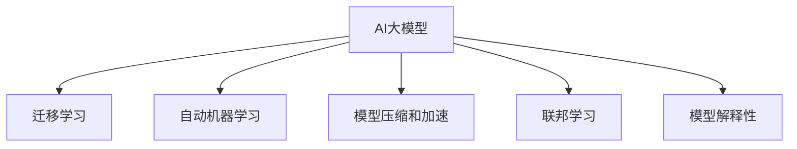
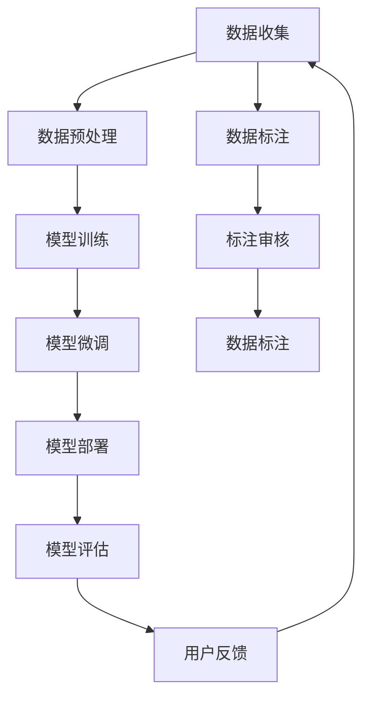

                 

## 1. 背景介绍

### 1.1 问题由来
近年来，人工智能(AI)大模型在科技界掀起了一股热潮。这些模型在语言理解、图像识别、自然语言处理(NLP)等领域展现了前所未有的性能，极大地推动了AI技术的发展。然而，尽管AI大模型在学术和工业界取得了许多突破，但在商业化应用中，仍面临着诸多挑战。

### 1.2 问题核心关键点
大模型创业的主要挑战包括：

- **数据获取和标注**：高质量的数据是训练大模型的基础，但获取和标注大量数据成本高昂且耗时。
- **算力和存储**：大模型通常拥有数十亿甚至百亿个参数，训练和存储这些参数需要大量算力和存储空间。
- **模型部署和维护**：部署和维护大规模模型需要考虑数据加载、模型推理、资源管理、安全性等问题。
- **隐私和伦理**：大模型需要处理大量用户数据，如何保护用户隐私和数据安全是一个重要挑战。
- **模型优化和调优**：如何在大规模模型中找到最优参数组合，提升模型性能，仍需深入研究和优化。
- **商业化和落地应用**：如何将AI大模型转化为实际商业产品，提升用户体验和业务价值，仍需不断探索和改进。

本文将探讨这些核心挑战，并提出相应的解决方案。

## 2. 核心概念与联系

### 2.1 核心概念概述

在探讨大模型创业的挑战之前，首先需要理解以下几个核心概念：

- **AI大模型**：通常指通过大规模深度学习模型进行训练得到的模型，如BERT、GPT-3等。这些模型具有强大的学习能力，能够在特定领域或任务中取得卓越表现。
- **迁移学习**：指在大模型基础上，通过微调或改编，将其迁移到新的任务或数据集上，提升模型性能。
- **自动机器学习(AutoML)**：指自动化地进行模型训练、调参、模型选择等过程，降低人工智能模型开发和部署的门槛。
- **模型压缩和加速**：通过量化、剪枝、蒸馏等技术，降低模型的大小和计算复杂度，提升模型部署和推理速度。
- **联邦学习**：指在不共享数据的前提下，多个客户端通过本地模型更新，协同训练出一个全局模型，保护数据隐私。
- **模型解释性**：指对AI模型的决策过程进行解释，增强其透明度和可信度。

这些概念相互关联，共同构成了大模型创业的技术体系。下面通过一个Mermaid流程图来展示这些概念之间的联系：



### 2.2 核心概念原理和架构的 Mermaid 流程图



这个流程图展示了AI大模型创业的基本流程，从数据收集、预处理、模型训练、微调、部署、评估和反馈的闭环过程。

## 3. 核心算法原理 & 具体操作步骤

### 3.1 算法原理概述

AI大模型创业的核心在于如何高效地构建、优化、部署和管理这些大模型，以应对现实世界中的各种挑战。其算法原理可以分为以下几个关键步骤：

1. **数据获取和标注**：收集高质量的数据，并进行标注，用于训练和验证模型。
2. **模型训练和微调**：在大规模数据集上进行模型训练，并在特定任务上微调，提升模型性能。
3. **模型压缩和加速**：通过量化、剪枝、蒸馏等技术，减小模型大小，提升推理速度。
4. **模型部署和管理**：将模型部署到生产环境，并进行监控和管理，确保模型可靠运行。
5. **隐私和伦理保护**：采用联邦学习、差分隐私等技术，保护用户隐私和数据安全。

### 3.2 算法步骤详解

#### 3.2.1 数据获取和标注

数据是AI大模型的基础。高质量的数据可以提升模型性能，但获取和标注大量数据成本高昂且耗时。以下是一些数据获取和标注的常用方法：

- **爬虫技术**：利用爬虫技术从互联网中收集数据。
- **API接口**：利用第三方API接口获取数据。
- **公开数据集**：利用公开数据集进行模型训练。
- **众包标注**：利用众包平台进行数据标注。
- **合成数据**：利用生成对抗网络(GAN)等技术生成合成数据。

数据获取后，需要进行预处理，包括数据清洗、归一化、采样等步骤。预处理的质量直接影响模型的性能，因此需要谨慎处理。

#### 3.2.2 模型训练和微调

模型训练和微调是大模型创业的核心环节。以下是一些常用的技术和方法：

- **迁移学习**：利用预训练模型的通用知识，通过微调提升模型在特定任务上的性能。
- **自动机器学习**：利用自动机器学习工具，自动化地进行模型训练和调参。
- **分布式训练**：利用分布式计算框架，加速模型训练过程。
- **超参数调优**：利用网格搜索、贝叶斯优化等方法，找到最优超参数组合。
- **模型压缩和加速**：利用量化、剪枝、蒸馏等技术，减小模型大小，提升推理速度。

#### 3.2.3 模型部署和管理

模型部署和管理是大模型创业的重要环节。以下是一些常用的技术和方法：

- **容器化部署**：将模型封装为容器，便于部署和管理。
- **自动化编排**：利用编排工具，自动化地进行模型部署和资源调度。
- **监控和告警**：利用监控工具，实时监测模型运行状态，设置告警阈值。
- **弹性伸缩**：根据流量变化，动态调整资源配置，平衡成本和性能。
- **版本控制**：对模型进行版本管理，确保模型的可追溯性和可复现性。

#### 3.2.4 隐私和伦理保护

隐私和伦理保护是大模型创业中不可忽视的重要环节。以下是一些常用的技术和方法：

- **联邦学习**：在不共享数据的前提下，多个客户端通过本地模型更新，协同训练出一个全局模型。
- **差分隐私**：在数据处理过程中添加噪声，保护用户隐私。
- **透明和可解释性**：利用模型解释性技术，增强模型的透明度和可信度。
- **数据脱敏**：在数据处理过程中进行脱敏处理，保护用户隐私。
- **伦理审查**：定期进行伦理审查，确保模型的合规性和公平性。

### 3.3 算法优缺点

AI大模型创业的算法具有以下优点：

- **高效性**：利用大规模数据和分布式计算，可以大大加速模型训练过程。
- **泛化性**：通过迁移学习和自动机器学习，可以在少量标注数据下取得较好的性能。
- **可扩展性**：通过模型压缩和加速，可以减小模型大小，提升推理速度，便于部署和管理。
- **隐私保护**：利用联邦学习和差分隐私等技术，可以在不共享数据的前提下进行模型训练。

同时，这些算法也存在一些缺点：

- **数据依赖**：高质量数据获取和标注成本高昂，数据质量直接影响模型性能。
- **资源消耗**：大规模模型需要大量算力和存储空间，训练和推理成本较高。
- **模型复杂性**：大规模模型结构复杂，训练和调优过程繁琐。
- **安全风险**：模型可能存在安全漏洞，如对抗样本攻击等，需要额外防范。
- **解释性不足**：一些模型黑盒特性较强，难以解释其决策过程。

### 3.4 算法应用领域

AI大模型创业的算法广泛应用于以下几个领域：

- **智能推荐**：利用推荐模型为用户推荐商品、内容等。
- **金融风控**：利用风险模型进行信用评估、欺诈检测等。
- **医疗诊断**：利用医疗模型进行疾病预测、病理分析等。
- **自动驾驶**：利用感知模型进行环境理解、路径规划等。
- **智能客服**：利用对话模型进行自然语言处理和用户交互。
- **智慧城市**：利用模型进行交通管理、安防监控等。

## 4. 数学模型和公式 & 详细讲解 & 举例说明

### 4.1 数学模型构建

大模型创业的数学模型主要包括以下几个方面：

- **数据表示**：将数据转换为模型可处理的格式。
- **损失函数**：定义模型训练的目标函数，通常为交叉熵、均方误差等。
- **优化器**：利用优化算法最小化损失函数，如梯度下降、Adam等。
- **超参数**：如学习率、批大小、迭代次数等，需要手动调整。
- **评估指标**：如准确率、召回率、F1分数等，用于衡量模型性能。

### 4.2 公式推导过程

以一个简单的二分类问题为例，说明模型的训练过程。假设模型为 $f(x;\theta)$，其中 $x$ 为输入特征，$\theta$ 为模型参数，$y$ 为标签。

- **损失函数**：
  $$
  \mathcal{L}(\theta) = -\frac{1}{N}\sum_{i=1}^N \log f(x_i; \theta)^{y_i} (1 - f(x_i; \theta)^{1-y_i})
  $$

- **梯度下降算法**：
  $$
  \theta_{t+1} = \theta_t - \eta \nabla_{\theta} \mathcal{L}(\theta_t)
  $$

- **超参数**：
  - **学习率**：控制模型参数更新的步长，通常为 $0.001$ 到 $0.01$。
  - **批大小**：每次训练使用的样本数，通常为 $64$ 到 $128$。
  - **迭代次数**：模型训练的轮数，通常为 $10$ 到 $100$。

### 4.3 案例分析与讲解

以智能推荐系统为例，分析大模型创业的数学模型构建和应用。假设系统有 $N$ 个用户和 $M$ 个商品，每个用户 $u_i$ 对商品 $i$ 的评分 $r_i$ 可以看作是模型 $f(x_i; \theta)$ 的输出，其中 $x_i$ 为商品特征，$\theta$ 为模型参数。

- **数据表示**：将商品特征和用户评分表示为向量，输入模型进行预测。
- **损失函数**：通常使用均方误差损失，表示预测值与真实值之间的差异。
- **优化器**：利用Adam等优化算法最小化损失函数，更新模型参数。
- **超参数**：调整学习率、批大小和迭代次数等，找到最优参数组合。
- **评估指标**：利用准确率、召回率和F1分数等指标，评估模型性能。

## 5. 项目实践：代码实例和详细解释说明

### 5.1 开发环境搭建

要进行AI大模型创业的实践，需要搭建一个完整的开发环境。以下是一些建议：

- **Python环境**：使用Anaconda或Miniconda等工具，创建独立的Python环境，安装所需的依赖包。
- **深度学习框架**：安装TensorFlow、PyTorch等深度学习框架，进行模型训练和推理。
- **模型库**：安装TensorFlow Hub、Keras等模型库，提供预训练模型和工具。
- **分布式计算**：使用Horovod、Dask等工具，进行分布式训练。
- **容器化**：使用Docker等工具，将模型封装为容器，便于部署和管理。

### 5.2 源代码详细实现

以一个简单的二分类问题为例，说明大模型的训练过程。

#### 5.2.1 数据预处理

```python
import pandas as pd
import numpy as np
from sklearn.model_selection import train_test_split
from sklearn.preprocessing import StandardScaler

# 读取数据
data = pd.read_csv('data.csv')

# 分割数据集
X = data.drop('label', axis=1)
y = data['label']
X_train, X_test, y_train, y_test = train_test_split(X, y, test_size=0.2, random_state=42)

# 标准化数据
scaler = StandardScaler()
X_train = scaler.fit_transform(X_train)
X_test = scaler.transform(X_test)
```

#### 5.2.2 模型训练

```python
import tensorflow as tf
from tensorflow.keras.models import Sequential
from tensorflow.keras.layers import Dense

# 定义模型
model = Sequential()
model.add(Dense(64, activation='relu', input_shape=(X_train.shape[1],)))
model.add(Dense(1, activation='sigmoid'))

# 编译模型
model.compile(optimizer=tf.keras.optimizers.Adam(0.01), loss='binary_crossentropy', metrics=['accuracy'])

# 训练模型
model.fit(X_train, y_train, epochs=10, batch_size=32, validation_data=(X_test, y_test))
```

#### 5.2.3 模型评估

```python
# 评估模型
loss, accuracy = model.evaluate(X_test, y_test)
print('Test loss:', loss)
print('Test accuracy:', accuracy)
```

### 5.3 代码解读与分析

以上代码展示了从数据预处理、模型训练到模型评估的全过程。其中：

- **数据预处理**：将数据标准化，减少特征之间的差异，提升模型训练效果。
- **模型定义**：使用Keras定义二分类模型，包含一个隐藏层和一个输出层。
- **模型编译**：指定优化器、损失函数和评估指标，准备模型训练。
- **模型训练**：使用训练集数据进行模型训练，设置迭代次数和批大小。
- **模型评估**：使用测试集数据评估模型性能，输出损失和准确率。

## 6. 实际应用场景

### 6.1 智能推荐系统

智能推荐系统是大模型创业的重要应用场景。推荐系统通过分析用户行为数据，预测用户偏好，为用户推荐商品、内容等。以下是一个简单的推荐系统示例：

```python
import tensorflow as tf
import numpy as np

# 定义推荐模型
class RecommendationModel(tf.keras.Model):
    def __init__(self, num_users, num_items, embed_size):
        super(RecommendationModel, self).__init__()
        self.num_users = num_users
        self.num_items = num_items
        self.embed_size = embed_size
        
        self.user_embeddings = tf.Variable(tf.random.normal([num_users, embed_size]))
        self.item_embeddings = tf.Variable(tf.random.normal([num_items, embed_size]))
        
        self.intermediate = tf.keras.layers.Dense(128, activation='relu')
        self.final = tf.keras.layers.Dense(1, activation='sigmoid')
        
    def call(self, user_ids, item_ids):
        user_embeddings = tf.nn.embedding_lookup(self.user_embeddings, user_ids)
        item_embeddings = tf.nn.embedding_lookup(self.item_embeddings, item_ids)
        
        concatenated = tf.concat([user_embeddings, item_embeddings], axis=1)
        intermediate = self.intermediate(concatenated)
        output = self.final(intermediate)
        
        return output

# 创建模型
model = RecommendationModel(num_users=1000, num_items=1000, embed_size=64)

# 训练模型
model.compile(optimizer=tf.keras.optimizers.Adam(0.01), loss='binary_crossentropy', metrics=['accuracy'])
model.fit(user_ids_train, item_ids_train, epochs=10, batch_size=32, validation_data=(user_ids_test, item_ids_test))
```

### 6.2 金融风控

金融风控是大模型创业的另一个重要应用场景。风控系统通过分析用户行为数据，预测用户信用风险，进行信用评估和欺诈检测。以下是一个简单的金融风控模型示例：

```python
import tensorflow as tf
import numpy as np

# 定义风控模型
class CreditRiskModel(tf.keras.Model):
    def __init__(self, num_features, embed_size):
        super(CreditRiskModel, self).__init__()
        self.num_features = num_features
        self.embed_size = embed_size
        
        self.embeddings = tf.keras.layers.Embedding(num_features, embed_size)
        self.intermediate = tf.keras.layers.Dense(128, activation='relu')
        self.final = tf.keras.layers.Dense(1, activation='sigmoid')
        
    def call(self, inputs):
        embeddings = self.embeddings(inputs)
        intermediate = self.intermediate(embeddings)
        output = self.final(intermediate)
        
        return output

# 创建模型
model = CreditRiskModel(num_features=100, embed_size=64)

# 训练模型
model.compile(optimizer=tf.keras.optimizers.Adam(0.01), loss='binary_crossentropy', metrics=['accuracy'])
model.fit(X_train, y_train, epochs=10, batch_size=32, validation_data=(X_test, y_test))
```

### 6.3 医疗诊断

医疗诊断是大模型创业的另一个重要应用场景。医疗模型通过分析病人的病情数据，预测疾病风险，进行病理分析等。以下是一个简单的医疗诊断模型示例：

```python
import tensorflow as tf
import numpy as np

# 定义医疗模型
class MedicalModel(tf.keras.Model):
    def __init__(self, num_features, embed_size):
        super(MedicalModel, self).__init__()
        self.num_features = num_features
        self.embed_size = embed_size
        
        self.embeddings = tf.keras.layers.Embedding(num_features, embed_size)
        self.intermediate = tf.keras.layers.Dense(128, activation='relu')
        self.final = tf.keras.layers.Dense(1, activation='sigmoid')
        
    def call(self, inputs):
        embeddings = self.embeddings(inputs)
        intermediate = self.intermediate(embeddings)
        output = self.final(intermediate)
        
        return output

# 创建模型
model = MedicalModel(num_features=100, embed_size=64)

# 训练模型
model.compile(optimizer=tf.keras.optimizers.Adam(0.01), loss='binary_crossentropy', metrics=['accuracy'])
model.fit(X_train, y_train, epochs=10, batch_size=32, validation_data=(X_test, y_test))
```

## 7. 工具和资源推荐

### 7.1 学习资源推荐

为了帮助开发者系统掌握AI大模型创业的理论基础和实践技巧，这里推荐一些优质的学习资源：

1. **Deep Learning Specialization**：由Andrew Ng等人讲授的深度学习专项课程，涵盖从神经网络基础到深度学习应用的全面内容。
2. **TensorFlow官方文档**：提供了丰富的API文档和示例代码，是进行深度学习开发的重要参考。
3. **PyTorch官方文档**：提供了详细的API文档和示例代码，支持多种深度学习框架。
4. **Keras官方文档**：提供了简单易用的API接口，适合快速上手深度学习开发。
5. **TensorFlow Hub**：提供了预训练模型和工具库，方便模型训练和推理。
6. **AutoML**：提供了自动机器学习工具，降低模型开发门槛。

### 7.2 开发工具推荐

高效的开发离不开优秀的工具支持。以下是几款用于AI大模型创业开发的常用工具：

1. **Anaconda**：用于创建和管理Python环境，支持虚拟环境、包管理等功能。
2. **Jupyter Notebook**：支持交互式编程和数据可视化，方便快速迭代开发。
3. **TensorBoard**：提供了模型训练和推理的可视化工具，方便监控和调试。
4. **TensorFlow Serving**：提供了模型部署和管理工具，支持分布式部署和弹性伸缩。
5. **Dask**：提供了分布式计算框架，支持大规模数据处理和模型训练。
6. **Horovod**：提供了分布式训练工具，支持多机多卡训练，提升训练速度。

### 7.3 相关论文推荐

AI大模型创业的研究源于学界的持续探索。以下是几篇奠基性的相关论文，推荐阅读：

1. **Deep Learning**：由Ian Goodfellow等人撰写的深度学习经典教材，详细介绍了深度学习的基本概念和算法。
2. **TensorFlow**：由Martín Abadi等人发表的TensorFlow论文，介绍了TensorFlow的设计思想和核心技术。
3. **Keras**：由François Chollet撰写的Keras论文，介绍了Keras的设计思想和核心功能。
4. **AutoML**：由Gershom Hafner等人发表的AutoML论文，介绍了自动机器学习的基本概念和算法。
5. **Model Compression**：由Yanghao Li等人发表的模型压缩论文，介绍了模型压缩的基本方法和技术。
6. **Federated Learning**：由Jonathan E. Katz等人发表的联邦学习论文，介绍了联邦学习的基本概念和算法。

这些论文代表了大模型创业的研究进展，通过学习这些前沿成果，可以帮助研究者把握学科前进方向，激发更多的创新灵感。

## 8. 总结：未来发展趋势与挑战

### 8.1 研究成果总结

AI大模型创业的研究已经取得了显著进展，主要体现在以下几个方面：

- **模型训练**：通过迁移学习和自动机器学习，可以在少量标注数据下取得较好的性能。
- **模型压缩和加速**：通过量化、剪枝、蒸馏等技术，减小模型大小，提升推理速度。
- **模型部署和管理**：通过容器化和分布式计算，实现高效模型部署和管理。
- **隐私和伦理保护**：通过联邦学习和差分隐私等技术，保护用户隐私和数据安全。
- **模型解释性**：通过模型解释性技术，增强模型的透明度和可信度。

### 8.2 未来发展趋势

展望未来，AI大模型创业将呈现以下几个发展趋势：

1. **自动化和智能化**：利用自动化机器学习工具，提升模型训练和调优的效率，降低开发门槛。
2. **模型压缩和加速**：通过模型压缩和加速技术，提升模型的部署和推理速度。
3. **多模态融合**：将视觉、语音、文本等模态信息进行融合，提升模型的理解和生成能力。
4. **联邦学习和隐私保护**：在不共享数据的前提下，协同训练全局模型，保护用户隐私和数据安全。
5. **模型解释性**：利用模型解释性技术，增强模型的透明度和可信度。
6. **伦理和社会责任**：关注模型的社会影响和伦理问题，确保模型的公平性和安全性。

### 8.3 面临的挑战

尽管AI大模型创业已经取得了许多进展，但仍面临一些挑战：

1. **数据获取和标注**：高质量数据获取和标注成本高昂，数据质量直接影响模型性能。
2. **资源消耗**：大规模模型需要大量算力和存储空间，训练和推理成本较高。
3. **模型复杂性**：大规模模型结构复杂，训练和调优过程繁琐。
4. **安全风险**：模型可能存在安全漏洞，如对抗样本攻击等，需要额外防范。
5. **解释性不足**：一些模型黑盒特性较强，难以解释其决策过程。
6. **伦理问题**：模型可能存在偏见和歧视，需要关注模型的社会影响和伦理问题。

### 8.4 研究展望

为了应对这些挑战，未来的研究需要在以下几个方面进行突破：

1. **高效数据获取和标注**：探索无监督和半监督学习，利用自动化标注和合成数据等方法，降低对标注数据的依赖。
2. **模型压缩和加速**：开发更加高效和轻量级的模型压缩和加速技术，提升模型的部署和推理速度。
3. **多模态融合**：利用多模态融合技术，提升模型的理解和生成能力。
4. **联邦学习和隐私保护**：利用联邦学习技术，在不共享数据的前提下协同训练全局模型。
5. **模型解释性**：利用模型解释性技术，增强模型的透明度和可信度。
6. **伦理和社会责任**：关注模型的社会影响和伦理问题，确保模型的公平性和安全性。

## 9. 附录：常见问题与解答

**Q1: 什么是AI大模型？**

A: AI大模型通常指通过大规模深度学习模型进行训练得到的模型，如BERT、GPT-3等。这些模型具有强大的学习能力，能够在特定领域或任务中取得卓越表现。

**Q2: 如何构建AI大模型？**

A: 构建AI大模型通常需要以下几个步骤：
1. 数据收集和标注：收集高质量的数据，并进行标注。
2. 模型训练：在大规模数据集上进行模型训练。
3. 模型微调：在特定任务上进行微调，提升模型性能。
4. 模型压缩和加速：通过量化、剪枝、蒸馏等技术，减小模型大小，提升推理速度。
5. 模型部署和管理：将模型部署到生产环境，并进行监控和管理。

**Q3: 什么是迁移学习？**

A: 迁移学习是指在大模型基础上，通过微调或改编，将其迁移到新的任务或数据集上，提升模型性能。通过迁移学习，可以利用预训练模型的通用知识，快速适应新任务，提升模型性能。

**Q4: 什么是模型压缩和加速？**

A: 模型压缩和加速是指通过量化、剪枝、蒸馏等技术，减小模型大小，提升推理速度。这些技术可以降低模型的计算复杂度，提升模型的部署和推理效率。

**Q5: 什么是联邦学习？**

A: 联邦学习是一种分布式机器学习技术，在不共享数据的前提下，多个客户端通过本地模型更新，协同训练出一个全局模型。联邦学习可以在保护用户隐私的前提下，提升模型性能。

**Q6: 什么是差分隐私？**

A: 差分隐私是一种数据隐私保护技术，在数据处理过程中添加噪声，保护用户隐私。差分隐私可以在不泄露个体信息的前提下，保护数据隐私。

**Q7: 什么是模型解释性？**

A: 模型解释性是指对AI模型的决策过程进行解释，增强其透明度和可信度。模型解释性技术可以帮助理解模型的内部工作机制，提高模型的可信度和公平性。

通过这些问题的解答，可以更好地理解AI大模型创业的各个方面，为未来的研究和应用提供指导。

---

作者：禅与计算机程序设计艺术 / Zen and the Art of Computer Programming

