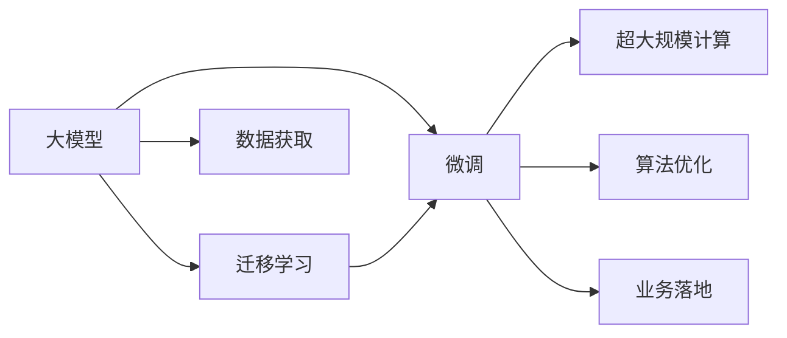

                 

# AI大模型创业：如何应对未来挑战？

## 1. 背景介绍

在过去的十年里，人工智能（AI）特别是大模型（如BERT、GPT等）在自然语言处理（NLP）和计算机视觉等领域取得了令人瞩目的进展。这些模型通过在大规模无标签数据上预训练，赋予了机器在自然语言理解和生成、图像分类、语音识别等方面的强大能力。大模型的应用场景遍及医疗、金融、教育、交通等多个领域，给各行各业带来了前所未有的变革。

然而，随着大模型技术的不断发展，市场竞争日益激烈，未来创业者和从业者将面临越来越多的挑战。这些挑战不仅来源于技术的快速发展，还包括数据获取、模型部署、业务落地等多个方面。本文将深入探讨这些挑战，并给出相应的应对策略。

## 2. 核心概念与联系

### 2.1 核心概念概述

为了更好地理解如何应对未来挑战，本节将介绍几个关键概念及其之间的联系：

- **大模型（Large Model）**：通过在大规模数据集上预训练，具备强大的自然语言理解与生成、图像识别等能力的人工智能模型。
- **迁移学习（Transfer Learning）**：将在大规模数据集上预训练的模型知识迁移到特定任务上，以提升模型在该任务上的表现。
- **微调（Fine-tuning）**：基于迁移学习，在特定任务数据集上对预训练模型进行微调，进一步提升模型在该任务上的表现。
- **超大规模计算（Hyperscale Computing）**：指使用大规模集群、GPU/TPU等高性能设备，支持大模型的高效训练和推理。
- **算法优化（Algorithm Optimization）**：包括模型压缩、量化、剪枝等技术，用于降低大模型在内存、存储和计算上的资源需求。
- **业务落地（Business Adoption）**：将AI技术应用于实际业务场景，提升企业运营效率、降低成本、增加收入。

这些概念通过一个Mermaid流程图表示如下：



在这个图中，数据获取是大模型创业的起点，迁移学习与微调是提升模型性能的关键技术，超大规模计算与算法优化保证了模型的高效运行，而业务落地则是大模型技术商业化的核心。

## 3. 核心算法原理 & 具体操作步骤

### 3.1 算法原理概述

大模型的核心算法原理包括自监督预训练、迁移学习、微调等。这些技术共同构成了大模型从数据到模型、再到应用的全流程。

- **自监督预训练**：使用无标签数据，通过自我预测、掩码语言建模等任务，学习模型的语言或视觉表征。
- **迁移学习**：利用预训练模型在特定任务上进行微调，使模型在该任务上表现更优。
- **微调**：基于迁移学习，在特定任务数据集上进一步优化模型，提升模型在该任务上的准确性。

### 3.2 算法步骤详解

1. **数据获取**：收集大模型所需的数据集，如大规模无标签文本、图像、视频等。
2. **自监督预训练**：使用预训练任务训练大模型，如语言模型的掩码语言建模、图像的自动编码器等。
3. **迁移学习**：在特定任务上，使用有标签数据对大模型进行微调，提升模型在该任务上的表现。
4. **业务落地**：将微调后的模型部署到实际业务场景中，实现应用。

### 3.3 算法优缺点

**优点**：
- **高效性**：通过迁移学习，利用预训练模型的高效特征提取能力，可以大大缩短模型训练时间。
- **泛化能力强**：迁移学习使模型能够在多种任务上表现良好。
- **可扩展性**：大模型支持多种任务，可以灵活扩展到不同应用领域。

**缺点**：
- **数据依赖**：迁移学习依赖大量标注数据，获取和处理成本较高。
- **模型复杂性**：大模型结构复杂，部署和维护难度大。
- **计算资源需求高**：训练和推理大模型需要高性能计算资源。

### 3.4 算法应用领域

大模型技术广泛应用于以下几个领域：

- **自然语言处理**：包括文本分类、情感分析、机器翻译、文本生成等任务。
- **计算机视觉**：如图像分类、目标检测、图像生成、图像分割等。
- **语音识别**：如语音转文本、语音合成、说话人识别等。
- **医疗健康**：如疾病诊断、基因序列分析、医学图像识别等。
- **金融风控**：如信用评分、欺诈检测、市场分析等。
- **智能交通**：如自动驾驶、交通流量分析等。

## 4. 数学模型和公式 & 详细讲解 & 举例说明

### 4.1 数学模型构建

大模型的数学模型可以形式化为：
$$
\theta = \text{argmin}_{\theta} \sum_{i=1}^N \mathcal{L}(\theta, x_i, y_i)
$$
其中，$\theta$ 是模型参数，$\mathcal{L}$ 是损失函数，$x_i$ 是输入，$y_i$ 是输出。

### 4.2 公式推导过程

以自然语言处理中的情感分类为例，假设模型采用BiLSTM和softmax输出，情感分类问题的损失函数为交叉熵损失：
$$
\mathcal{L}(\theta) = -\frac{1}{N} \sum_{i=1}^N \sum_{k=1}^K y_{ik} \log \hat{y}_{ik}
$$
其中，$y_{ik}$ 是样本 $i$ 中第 $k$ 个情感分类的真实标签，$\hat{y}_{ik}$ 是模型预测的概率。

### 4.3 案例分析与讲解

以BERT模型为例，BERT的预训练任务包括掩码语言建模和下一句预测。在掩码语言建模任务中，模型尝试预测输入序列中缺失的词语，即：
$$
\hat{y} = \text{softmax}(\text{BERT}(x) W + b)
$$
其中，$x$ 是输入序列，$W$ 和 $b$ 是softmax层的权重和偏置。

## 5. 项目实践：代码实例和详细解释说明

### 5.1 开发环境搭建

在进行大模型创业的实践中，需要搭建一个高效、灵活的开发环境。以下是一个基本的Python开发环境搭建步骤：

1. 安装Anaconda：
   ```
   conda create -n pytorch-env python=3.8
   conda activate pytorch-env
   ```

2. 安装必要的Python包：
   ```
   pip install torch torchvision torchaudio transformers scipy pandas numpy
   ```

3. 安装GPU加速包：
   ```
   pip install torch-cuda torch-distributed
   ```

4. 安装Docker：
   ```
   curl -sSL https://get.docker.com | sh
   ```

5. 安装Jupyter Notebook：
   ```
   pip install jupyter notebook
   ```

### 5.2 源代码详细实现

以下是一个使用BERT模型进行情感分类的Python代码示例：

```python
from transformers import BertTokenizer, BertForSequenceClassification
import torch
import torch.nn as nn

# 初始化模型和分词器
model = BertForSequenceClassification.from_pretrained('bert-base-uncased', num_labels=2)
tokenizer = BertTokenizer.from_pretrained('bert-base-uncased')

# 定义模型和损失函数
def forward(x):
    x = model(x)
    return x

# 训练模型
device = torch.device("cuda" if torch.cuda.is_available() else "cpu")
model.to(device)
optimizer = torch.optim.Adam(model.parameters(), lr=2e-5)

for epoch in range(epochs):
    total_loss = 0
    for batch in train_dataloader:
        inputs = batch['input_ids'].to(device)
        labels = batch['labels'].to(device)
        outputs = model(inputs)
        loss = nn.CrossEntropyLoss()(outputs, labels)
        loss.backward()
        optimizer.step()
        total_loss += loss.item()

    train_loss = total_loss / len(train_dataloader)
    print(f"Epoch {epoch+1}, train loss: {train_loss:.3f}")

# 评估模型
with torch.no_grad():
    correct = 0
    total = 0
    for batch in test_dataloader:
        inputs = batch['input_ids'].to(device)
        labels = batch['labels'].to(device)
        outputs = model(inputs)
        _, predicted = torch.max(outputs, 1)
        total += labels.size(0)
        correct += (predicted == labels).sum().item()

    test_accuracy = correct / total * 100
    print(f"Test accuracy: {test_accuracy:.2f}%")
```

### 5.3 代码解读与分析

代码中，我们使用了Hugging Face的Transformer库，简化了模型和分词器的搭建过程。训练过程中，我们使用了Adam优化器和交叉熵损失函数。

## 6. 实际应用场景

### 6.1 金融风控

在大数据和AI技术的推动下，金融风控领域逐渐实现了智能化和自动化。例如，利用大模型对信用卡申请人的行为数据进行分析，可以判断其还款能力和信用风险，实现智能审核和自动化审批。

### 6.2 医疗健康

在医疗领域，大模型可以帮助医生进行疾病诊断、基因序列分析、医学图像识别等。例如，通过分析患者的历史记录和症状，大模型可以给出疾病预测和诊疗建议。

### 6.3 智能交通

在智能交通领域，大模型可以应用于自动驾驶、交通流量分析等。例如，通过分析摄像头和传感器的数据，大模型可以实时识别交通状况，优化交通信号控制。

## 7. 工具和资源推荐

### 7.1 学习资源推荐

为了帮助大模型创业者深入学习相关技术，以下是一些优质的学习资源：

1. 《深度学习》课程：斯坦福大学Andrew Ng教授开设的Coursera课程，系统讲解深度学习基础和应用。
2. 《自然语言处理》课程：Coursera上的Coursera和edX上的自然语言处理课程，涵盖NLP的各个方面。
3. 《Python for Data Science》课程：DataCamp上的Python编程课程，帮助开发者掌握数据科学和机器学习的基础知识。
4. 《TensorFlow实战》书籍：Google开源的TensorFlow框架的实战教程，涵盖深度学习模型的搭建和优化。
5. 《Transformers实战》书籍：Hugging Face官方推出的Transformer库实战教程，帮助开发者利用该库进行NLP任务的开发。

### 7.2 开发工具推荐

以下是几款常用的大模型开发工具：

1. PyTorch：由Facebook开发的深度学习框架，支持动态图和静态图，广泛用于AI开发。
2. TensorFlow：Google开源的深度学习框架，支持分布式训练和部署。
3. Hugging Face Transformers：自然语言处理工具库，提供了多种预训练模型和模型微调接口。
4. Amazon SageMaker：AWS提供的AI开发平台，支持模型训练、部署和监控。
5. Google Cloud AI Platform：Google提供的AI开发和部署平台，支持GPU和TPU加速。

### 7.3 相关论文推荐

以下是几篇具有影响力的相关论文：

1. Attention is All You Need（NeurIPS 2017）：提出Transformer模型，奠定了大模型的基础。
2. BERT: Pre-training of Deep Bidirectional Transformers for Language Understanding（arXiv 2018）：提出BERT模型，提升了语言模型的预训练能力。
3. GPT-3: Language Models are Unsupervised Multitask Learners（arXiv 2020）：推出GPT-3模型，展示了超大规模语言模型的潜力和应用前景。
4. ALBERT: A Lite BERT for Self-supervised Learning of Language Representations（arXiv 2019）：提出ALBERT模型，提高了语言模型的训练效率。
5. XLM: Generalized Cross-lingual Language Model Pretraining（arXiv 2019）：提出XLM模型，提升了多语言模型的跨语言迁移能力。

## 8. 总结：未来发展趋势与挑战

### 8.1 总结

本文深入探讨了基于大模型的AI创业面临的挑战及其应对策略。通过理解大模型的核心算法原理、操作步骤，以及实际应用场景，我们可以更好地应对未来的各种挑战。

### 8.2 未来发展趋势

未来大模型的发展趋势包括：

1. **多模态融合**：将自然语言处理、计算机视觉、语音识别等多模态信息融合，提升模型的综合感知能力。
2. **弱监督和无监督学习**：减少对标注数据的依赖，利用弱监督和无监督学习提升模型性能。
3. **端到端训练**：利用端到端训练技术，减少手动设计的中间层，提高模型效率。
4. **模型压缩与优化**：通过模型压缩和优化技术，降低模型资源需求，实现高效推理。
5. **业务智能**：将大模型应用于企业决策、市场营销、客户服务等领域，提升业务智能化水平。

### 8.3 面临的挑战

大模型创业面临的挑战包括：

1. **数据获取与标注**：获取高质量的数据和标注是模型训练的基石，但成本较高且耗时。
2. **计算资源**：训练大模型需要高性能计算资源，硬件投入较大。
3. **模型复杂性**：大模型结构复杂，部署和维护难度大。
4. **应用落地**：模型需要在实际业务场景中稳定运行，面对业务复杂性和多样性，模型的适用性需要进一步验证。
5. **伦理与安全**：大模型可能涉及个人隐私和数据安全，需要制定严格的伦理和安全措施。

### 8.4 研究展望

未来的研究展望包括：

1. **弱监督学习**：通过利用少样本数据进行模型训练，提升模型的泛化能力。
2. **自监督学习**：通过自监督学习任务提升模型的特征提取能力。
3. **跨领域迁移学习**：研究模型的跨领域迁移能力，拓展应用场景。
4. **多任务学习**：将多个任务整合到一个模型中，提升模型的综合性能。
5. **分布式训练**：研究分布式训练算法，提升模型训练效率。

## 9. 附录：常见问题与解答

**Q1：如何有效管理大模型的训练和推理资源？**

A：通过分布式训练、模型压缩、量化等技术，可以有效管理大模型的训练和推理资源。

**Q2：大模型的推理速度如何提升？**

A：采用模型压缩、剪枝、量化等技术，降低模型的内存占用和计算复杂度，提升推理速度。

**Q3：如何保障大模型的数据隐私和安全？**

A：采用差分隐私、联邦学习等技术，保护用户隐私。同时，进行严格的模型和数据审计，确保模型输出符合伦理和安全要求。

**Q4：如何提高大模型的跨领域迁移能力？**

A：通过多任务学习和跨领域迁移学习，提升模型在不同领域的适应性。

**Q5：如何评估大模型的性能？**

A：使用标准评估指标，如准确率、召回率、F1值等，评估模型在不同任务上的表现。

---

作者：禅与计算机程序设计艺术 / Zen and the Art of Computer Programming

