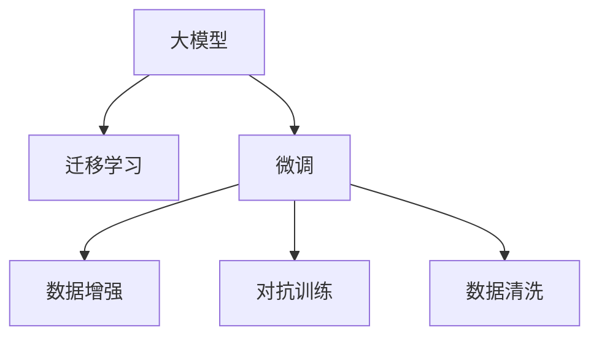

                 

# AI大模型创业：如何应对未来数据挑战？

## 1. 背景介绍

在过去十年中，人工智能（AI）和大数据技术飞速发展，成为引领全球科技创新的重要驱动力。特别是在自然语言处理（NLP）和计算机视觉（CV）领域，大模型如BERT、GPT等取得了前所未有的突破，展示了AI技术的巨大潜力。然而，AI大模型创业也面临严峻的数据挑战，如何高效利用数据、优化数据质量，成为创业公司成功与否的关键。

### 1.1 数据的重要性
数据是AI大模型的“粮食”。在大模型的训练过程中，海量的数据是其成长的基础。然而，数据的质量、多样性、实时性直接影响模型的性能和应用效果。对于AI创业公司来说，如何获取、存储、处理和利用数据，成为核心竞争力之一。

### 1.2 数据挑战的现状
当前，AI大模型数据挑战主要集中在以下几个方面：
- **数据获取难**：高质量、标注完整的数据集稀缺，数据收集和标注成本高。
- **数据不平衡**：不同任务和领域的数据分布不均衡，训练模型时容易过拟合。
- **数据隐私保护**：用户数据隐私保护法规严格，数据收集和使用受到限制。
- **数据标注不一致**：数据标注标准不一，不同标注结果差异大，影响模型泛化能力。

## 2. 核心概念与联系

### 2.1 核心概念概述

为了更好地理解AI大模型创业中如何应对数据挑战，本节将介绍几个关键概念：

- **大模型**：指经过大规模预训练的深度学习模型，如BERT、GPT-3等。通过在海量数据上预训练，大模型可以学习到丰富的语言和图像知识。
- **迁移学习**：通过将模型从一个任务迁移到另一个相关任务，利用已有的知识加速新任务学习的过程。
- **微调(Fine-tuning)**：在大模型的基础上，通过少量标注数据调整模型参数，以适应新任务。
- **数据增强**：通过对现有数据进行扩充和变换，提升模型的泛化能力。
- **对抗训练**：通过引入对抗样本，提升模型的鲁棒性和泛化能力。
- **数据清洗**：去除噪声和异常值，提升数据质量。

### 2.2 核心概念联系

这些核心概念之间存在紧密联系，共同构成了AI大模型创业中数据处理的框架：

1. **大模型**：是迁移学习和微调的基础，提供通用的语言或图像表示。
2. **迁移学习**：利用大模型的通用知识，加速特定任务的学习。
3. **微调**：针对特定任务，对大模型进行局部调整，适应新任务需求。
4. **数据增强**：通过增加数据多样性，提升模型的泛化能力。
5. **对抗训练**：通过增强模型的鲁棒性，提升其泛化性能。
6. **数据清洗**：确保数据质量，提升模型训练效果。

这些概念通过图的形式展现，帮助理解它们之间的逻辑联系：



## 3. 核心算法原理 & 具体操作步骤

### 3.1 算法原理概述

AI大模型创业中，数据挑战主要通过迁移学习和微调等技术来解决。以下是对其核心原理的详细解释：

**迁移学习**：指利用大模型在某个任务上学习到的知识，迁移到另一个相关任务上，以达到加速学习的目的。例如，在预训练BERT模型上进行微调，使其在特定领域（如医疗）下的性能提升。

**微调**：指在大模型的基础上，通过少量标注数据调整模型参数，以适应新任务。例如，在医疗数据集上微调BERT模型，使其能够准确诊断疾病。

### 3.2 算法步骤详解

以下是基于迁移学习和微调的核心步骤：

1. **准备数据**：
   - 收集数据：从公共数据集、合作机构、自有数据库等渠道获取数据。
   - 数据清洗：处理缺失值、异常值、重复数据等，确保数据质量。
   - 数据增强：通过扩充数据集、变换数据形式等方式，提升数据多样性。

2. **选择模型**：
   - 根据任务需求选择合适的预训练模型，如BERT、GPT等。
   - 下载并加载模型，进行必要的初始化。

3. **微调模型**：
   - 设计任务适配层：根据任务类型（如分类、生成、匹配等），添加相应的输出层和损失函数。
   - 设置微调超参数：选择合适的优化算法、学习率、批大小等。
   - 开始微调：利用标注数据，通过反向传播更新模型参数，最小化损失函数。

4. **评估和优化**：
   - 在验证集上评估模型性能，通过早停等策略避免过拟合。
   - 调整模型结构或参数，优化模型表现。
   - 重新训练模型，直到达到满意的性能。

### 3.3 算法优缺点

**优点**：
- **效率高**：利用大模型已有知识，微调过程可大幅减少训练时间和成本。
- **泛化能力强**：预训练模型在多种任务上具备通用性，泛化能力更强。
- **适应性强**：微调过程可以根据具体任务需求进行调整，灵活性高。

**缺点**：
- **数据依赖强**：微调依赖标注数据，数据质量直接影响模型性能。
- **过拟合风险**：标注数据较少时，容易过拟合。
- **资源消耗高**：大模型训练和微调资源需求高，硬件设备成本大。

### 3.4 算法应用领域

AI大模型在多个领域具有广泛应用，例如：

- **自然语言处理(NLP)**：文本分类、情感分析、机器翻译、命名实体识别等。
- **计算机视觉(CV)**：图像分类、目标检测、图像生成等。
- **医疗健康**：疾病诊断、医学影像分析、电子病历分析等。
- **金融领域**：信用评分、风险评估、舆情分析等。
- **智能制造**：工业检测、质量控制、设备预测维护等。
- **智慧城市**：交通管理、安防监控、环境监测等。

## 4. 数学模型和公式 & 详细讲解 & 举例说明

### 4.1 数学模型构建

在AI大模型创业中，数据处理和微调过程可以通过数学模型进行严格建模和优化。以下是一个典型的数学模型构建过程：

设模型参数为 $\theta$，训练数据为 $D=\{(x_i,y_i)\}_{i=1}^N$，其中 $x_i$ 为输入，$y_i$ 为标签。

微调的目标是最小化经验风险：

$$
\mathcal{L}(\theta) = \frac{1}{N}\sum_{i=1}^N \ell(M_{\theta}(x_i),y_i)
$$

其中 $\ell$ 为损失函数，常见有交叉熵损失、均方误差损失等。

### 4.2 公式推导过程

以分类任务为例，推导微调模型的损失函数和梯度计算公式。

假设模型输出为 $M_{\theta}(x_i)$，真实标签为 $y_i \in \{0,1\}$，则二分类交叉熵损失函数为：

$$
\ell(M_{\theta}(x_i),y_i) = -y_i\log M_{\theta}(x_i) - (1-y_i)\log (1-M_{\theta}(x_i))
$$

将损失函数代入经验风险公式，得：

$$
\mathcal{L}(\theta) = -\frac{1}{N}\sum_{i=1}^N [y_i\log M_{\theta}(x_i)+(1-y_i)\log(1-M_{\theta}(x_i))]
$$

根据链式法则，损失函数对参数 $\theta$ 的梯度为：

$$
\nabla_{\theta}\mathcal{L}(\theta) = -\frac{1}{N}\sum_{i=1}^N \frac{\partial \ell(M_{\theta}(x_i),y_i)}{\partial \theta}
$$

代入上述损失函数，得：

$$
\nabla_{\theta}\mathcal{L}(\theta) = -\frac{1}{N}\sum_{i=1}^N \left(\frac{y_i}{M_{\theta}(x_i)}-\frac{1-y_i}{1-M_{\theta}(x_i)}\right) \frac{\partial M_{\theta}(x_i)}{\partial \theta}
$$

其中 $\frac{\partial M_{\theta}(x_i)}{\partial \theta}$ 可通过反向传播算法计算。

### 4.3 案例分析与讲解

以下通过一个简单的二分类任务，详细讲解微调模型的实现步骤：

**步骤1：准备数据**
假设数据集 $D=\{(x_i,y_i)\}_{i=1}^N$，其中 $x_i$ 为文本，$y_i \in \{0,1\}$。

**步骤2：选择模型**
选择预训练模型 BERT，下载并加载。

**步骤3：设计任务适配层**
添加一个线性分类器作为输出层，使用交叉熵损失函数。

**步骤4：设置微调超参数**
选择合适的优化算法（如 Adam），设置学习率、批大小等。

**步骤5：开始微调**
利用标注数据 $D$，通过反向传播更新模型参数，最小化损失函数。

**步骤6：评估和优化**
在验证集上评估模型性能，通过早停等策略避免过拟合，调整模型结构或参数。

## 5. 项目实践：代码实例和详细解释说明

### 5.1 开发环境搭建

在进行微调实践前，我们需要准备好开发环境。以下是使用Python进行PyTorch开发的环境配置流程：

1. 安装Anaconda：从官网下载并安装Anaconda，用于创建独立的Python环境。

2. 创建并激活虚拟环境：
```bash
conda create -n pytorch-env python=3.8 
conda activate pytorch-env
```

3. 安装PyTorch：根据CUDA版本，从官网获取对应的安装命令。例如：
```bash
conda install pytorch torchvision torchaudio cudatoolkit=11.1 -c pytorch -c conda-forge
```

4. 安装Transformers库：
```bash
pip install transformers
```

5. 安装各类工具包：
```bash
pip install numpy pandas scikit-learn matplotlib tqdm jupyter notebook ipython
```

完成上述步骤后，即可在`pytorch-env`环境中开始微调实践。

### 5.2 源代码详细实现

以下是一个简单的文本分类任务的微调代码实现：

**步骤1：准备数据**
```python
from transformers import BertTokenizer
from torch.utils.data import Dataset
import torch

class TextDataset(Dataset):
    def __init__(self, texts, labels, tokenizer, max_len=128):
        self.texts = texts
        self.labels = labels
        self.tokenizer = tokenizer
        self.max_len = max_len
        
    def __len__(self):
        return len(self.texts)
    
    def __getitem__(self, item):
        text = self.texts[item]
        label = self.labels[item]
        
        encoding = self.tokenizer(text, return_tensors='pt', max_length=self.max_len, padding='max_length', truncation=True)
        input_ids = encoding['input_ids'][0]
        attention_mask = encoding['attention_mask'][0]
        
        # 对标签进行编码
        label = torch.tensor(label, dtype=torch.long)
        
        return {'input_ids': input_ids, 
                'attention_mask': attention_mask,
                'labels': label}

# 数据集划分
train_dataset = TextDataset(train_texts, train_labels, tokenizer)
dev_dataset = TextDataset(dev_texts, dev_labels, tokenizer)
test_dataset = TextDataset(test_texts, test_labels, tokenizer)
```

**步骤2：选择模型**
```python
from transformers import BertForSequenceClassification

model = BertForSequenceClassification.from_pretrained('bert-base-cased', num_labels=2)
```

**步骤3：设计任务适配层**
```python
model.classifier = torch.nn.Linear(model.config.hidden_size, 2)
```

**步骤4：设置微调超参数**
```python
optimizer = Adam(model.parameters(), lr=2e-5)
```

**步骤5：开始微调**
```python
epochs = 5
batch_size = 16

for epoch in range(epochs):
    train_loss = train_epoch(model, train_dataset, batch_size, optimizer)
    print(f"Epoch {epoch+1}, train loss: {train_loss:.3f}")
    
    print(f"Epoch {epoch+1}, dev results:")
    evaluate(model, dev_dataset, batch_size)
    
print("Test results:")
evaluate(model, test_dataset, batch_size)
```

### 5.3 代码解读与分析

**步骤1：准备数据**
通过定义 `TextDataset` 类，将文本和标签转换为模型输入和输出所需的格式。

**步骤2：选择模型**
使用 `BertForSequenceClassification` 类加载预训练的BERT模型，并设置分类器层数为2。

**步骤3：设计任务适配层**
在模型顶层添加一个线性分类器，输出2个类别。

**步骤4：设置微调超参数**
使用 Adam 优化器，设置学习率为2e-5。

**步骤5：开始微调**
在训练集上训练，输出训练集损失，并在验证集和测试集上评估模型性能。

## 6. 实际应用场景

### 6.1 智能客服系统

基于AI大模型的微调技术，可以应用于智能客服系统的构建。传统客服系统需要大量人工客服，高峰期响应慢，且服务质量难以保证。使用微调后的客服模型，可以实现7x24小时不间断服务，快速响应客户咨询，用自然流畅的语言解答各类问题。

在技术实现上，可以收集企业内部历史客服对话记录，将问题和最佳答复构建成监督数据，在此基础上对预训练客服模型进行微调。微调后的客服模型能够自动理解用户意图，匹配最合适的答案模板进行回复。对于客户提出的新问题，还可以接入检索系统实时搜索相关内容，动态组织生成回答。

### 6.2 金融舆情监测

金融机构需要实时监测市场舆论动向，以便及时应对负面信息传播，规避金融风险。传统人工监测方式成本高、效率低，难以应对网络时代海量信息爆发的挑战。基于AI大模型微调的文本分类和情感分析技术，为金融舆情监测提供了新的解决方案。

具体而言，可以收集金融领域相关的新闻、报道、评论等文本数据，并对其进行主题标注和情感标注。在此基础上对预训练语言模型进行微调，使其能够自动判断文本属于何种主题，情感倾向是正面、中性还是负面。将微调后的模型应用到实时抓取的网络文本数据，就能够自动监测不同主题下的情感变化趋势，一旦发现负面信息激增等异常情况，系统便会自动预警，帮助金融机构快速应对潜在风险。

### 6.3 个性化推荐系统

当前的推荐系统往往只依赖用户的历史行为数据进行物品推荐，无法深入理解用户的真实兴趣偏好。基于AI大模型微调技术，个性化推荐系统可以更好地挖掘用户行为背后的语义信息，从而提供更精准、多样的推荐内容。

在实践中，可以收集用户浏览、点击、评论、分享等行为数据，提取和用户交互的物品标题、描述、标签等文本内容。将文本内容作为模型输入，用户的后续行为（如是否点击、购买等）作为监督信号，在此基础上微调预训练语言模型。微调后的模型能够从文本内容中准确把握用户的兴趣点。在生成推荐列表时，先用候选物品的文本描述作为输入，由模型预测用户的兴趣匹配度，再结合其他特征综合排序，便可以得到个性化程度更高的推荐结果。

### 6.4 未来应用展望

随着AI大模型和微调技术的不断发展，基于微调范式将在更多领域得到应用，为传统行业带来变革性影响。

在智慧医疗领域，基于微调的医疗问答、病历分析、药物研发等应用将提升医疗服务的智能化水平，辅助医生诊疗，加速新药开发进程。

在智能教育领域，微调技术可应用于作业批改、学情分析、知识推荐等方面，因材施教，促进教育公平，提高教学质量。

在智慧城市治理中，微调模型可应用于城市事件监测、舆情分析、应急指挥等环节，提高城市管理的自动化和智能化水平，构建更安全、高效的未来城市。

此外，在企业生产、社会治理、文娱传媒等众多领域，基于大模型微调的人工智能应用也将不断涌现，为经济社会发展注入新的动力。相信随着技术的日益成熟，微调方法将成为人工智能落地应用的重要范式，推动人工智能技术在垂直行业的规模化落地。

## 7. 工具和资源推荐

### 7.1 学习资源推荐

为了帮助开发者系统掌握AI大模型微调的理论基础和实践技巧，这里推荐一些优质的学习资源：

1. 《Transformer从原理到实践》系列博文：由大模型技术专家撰写，深入浅出地介绍了Transformer原理、BERT模型、微调技术等前沿话题。

2. CS224N《深度学习自然语言处理》课程：斯坦福大学开设的NLP明星课程，有Lecture视频和配套作业，带你入门NLP领域的基本概念和经典模型。

3. 《Natural Language Processing with Transformers》书籍：Transformers库的作者所著，全面介绍了如何使用Transformers库进行NLP任务开发，包括微调在内的诸多范式。

4. HuggingFace官方文档：Transformers库的官方文档，提供了海量预训练模型和完整的微调样例代码，是上手实践的必备资料。

5. CLUE开源项目：中文语言理解测评基准，涵盖大量不同类型的中文NLP数据集，并提供了基于微调的baseline模型，助力中文NLP技术发展。

通过对这些资源的学习实践，相信你一定能够快速掌握AI大模型微调的精髓，并用于解决实际的NLP问题。

### 7.2 开发工具推荐

高效的开发离不开优秀的工具支持。以下是几款用于AI大模型微调开发的常用工具：

1. PyTorch：基于Python的开源深度学习框架，灵活动态的计算图，适合快速迭代研究。大部分预训练语言模型都有PyTorch版本的实现。

2. TensorFlow：由Google主导开发的开源深度学习框架，生产部署方便，适合大规模工程应用。同样有丰富的预训练语言模型资源。

3. Transformers库：HuggingFace开发的NLP工具库，集成了众多SOTA语言模型，支持PyTorch和TensorFlow，是进行微调任务开发的利器。

4. Weights & Biases：模型训练的实验跟踪工具，可以记录和可视化模型训练过程中的各项指标，方便对比和调优。与主流深度学习框架无缝集成。

5. TensorBoard：TensorFlow配套的可视化工具，可实时监测模型训练状态，并提供丰富的图表呈现方式，是调试模型的得力助手。

6. Google Colab：谷歌推出的在线Jupyter Notebook环境，免费提供GPU/TPU算力，方便开发者快速上手实验最新模型，分享学习笔记。

合理利用这些工具，可以显著提升AI大模型微调任务的开发效率，加快创新迭代的步伐。

### 7.3 相关论文推荐

AI大模型和微调技术的发展源于学界的持续研究。以下是几篇奠基性的相关论文，推荐阅读：

1. Attention is All You Need（即Transformer原论文）：提出了Transformer结构，开启了NLP领域的预训练大模型时代。

2. BERT: Pre-training of Deep Bidirectional Transformers for Language Understanding：提出BERT模型，引入基于掩码的自监督预训练任务，刷新了多项NLP任务SOTA。

3. Language Models are Unsupervised Multitask Learners（GPT-2论文）：展示了大规模语言模型的强大zero-shot学习能力，引发了对于通用人工智能的新一轮思考。

4. Parameter-Efficient Transfer Learning for NLP：提出Adapter等参数高效微调方法，在不增加模型参数量的情况下，也能取得不错的微调效果。

5. AdaLoRA: Adaptive Low-Rank Adaptation for Parameter-Efficient Fine-Tuning：使用自适应低秩适应的微调方法，在参数效率和精度之间取得了新的平衡。

6. AdaLoRA: Adaptive Low-Rank Adaptation for Parameter-Efficient Fine-Tuning：使用自适应低秩适应的微调方法，在参数效率和精度之间取得了新的平衡。

这些论文代表了大模型微调技术的发展脉络。通过学习这些前沿成果，可以帮助研究者把握学科前进方向，激发更多的创新灵感。

## 8. 总结：未来发展趋势与挑战

### 8.1 总结

本文对基于AI大模型的微调技术进行了全面系统的介绍。首先阐述了AI大模型在数据处理中的重要性，详细讲解了迁移学习和微调等技术原理，并通过代码实例展示了微调的具体实现步骤。接着，探讨了AI大模型在多个领域的应用，展示了其广泛的市场前景。最后，总结了未来发展趋势和面临的挑战，提出了相应的应对策略。

通过本文的系统梳理，可以看到，AI大模型微调技术正在成为NLP领域的重要范式，极大地拓展了预训练语言模型的应用边界，催生了更多的落地场景。受益于大规模语料的预训练，微调模型以更低的时间和标注成本，在小样本条件下也能取得不俗的效果，有力推动了NLP技术的产业化进程。未来，伴随预训练语言模型和微调方法的持续演进，相信NLP技术将在更广阔的应用领域大放异彩，深刻影响人类的生产生活方式。

### 8.2 未来发展趋势

展望未来，AI大模型微调技术将呈现以下几个发展趋势：

1. **模型规模持续增大**：随着算力成本的下降和数据规模的扩张，预训练语言模型的参数量还将持续增长。超大规模语言模型蕴含的丰富语言知识，有望支撑更加复杂多变的下游任务微调。

2. **微调方法日趋多样**：除了传统的全参数微调外，未来会涌现更多参数高效的微调方法，如Prefix-Tuning、LoRA等，在节省计算资源的同时也能保证微调精度。

3. **持续学习成为常态**：随着数据分布的不断变化，微调模型也需要持续学习新知识以保持性能。如何在不遗忘原有知识的同时，高效吸收新样本信息，将成为重要的研究课题。

4. **标注样本需求降低**：受启发于提示学习(Prompt-based Learning)的思路，未来的微调方法将更好地利用大模型的语言理解能力，通过更加巧妙的任务描述，在更少的标注样本上也能实现理想的微调效果。

5. **多模态微调崛起**：当前的微调主要聚焦于纯文本数据，未来会进一步拓展到图像、视频、语音等多模态数据微调。多模态信息的融合，将显著提升语言模型对现实世界的理解和建模能力。

6. **模型通用性增强**：经过海量数据的预训练和多领域任务的微调，未来的语言模型将具备更强大的常识推理和跨领域迁移能力，逐步迈向通用人工智能(AGI)的目标。

以上趋势凸显了大模型微调技术的广阔前景。这些方向的探索发展，必将进一步提升AI大模型的性能和应用范围，为构建人机协同的智能时代中扮演越来越重要的角色。

### 8.3 面临的挑战

尽管AI大模型微调技术已经取得了瞩目成就，但在迈向更加智能化、普适化应用的过程中，它仍面临着诸多挑战：

1. **标注成本瓶颈**：高质量、标注完整的数据集稀缺，数据收集和标注成本高。如何进一步降低微调对标注样本的依赖，将是一大难题。

2. **模型鲁棒性不足**：不同任务和领域的数据分布不均衡，训练模型时容易过拟合。如何在标注数据不足的情况下，提升模型的泛化能力？

3. **推理效率有待提高**：大模型虽然精度高，但在实际部署时往往面临推理速度慢、内存占用大等效率问题。如何在保证性能的同时，简化模型结构，提升推理速度？

4. **可解释性亟需加强**：AI大模型通常缺乏可解释性，难以解释其内部工作机制和决策逻辑。如何赋予模型更强的可解释性，将是亟待攻克的难题。

5. **安全性有待保障**：AI大模型可能会学习到有偏见、有害的信息，如何从数据和算法层面消除模型偏见，避免恶意用途，确保输出的安全性？

6. **知识整合能力不足**：现有的微调模型往往局限于任务内数据，难以灵活吸收和运用更广泛的先验知识。如何让微调过程更好地与外部知识库、规则库等专家知识结合，形成更加全面、准确的信息整合能力？

正视AI大模型微调面临的这些挑战，积极应对并寻求突破，将是大模型微调走向成熟的必由之路。相信随着学界和产业界的共同努力，这些挑战终将一一被克服，AI大模型微调必将在构建安全、可靠、可解释、可控的智能系统铺平道路。

### 8.4 研究展望

未来，AI大模型微调技术需要在以下几个方面进行更多的研究：

1. **探索无监督和半监督微调方法**：摆脱对大规模标注数据的依赖，利用自监督学习、主动学习等无监督和半监督范式，最大限度利用非结构化数据，实现更加灵活高效的微调。

2. **研究参数高效和计算高效的微调范式**：开发更加参数高效的微调方法，在固定大部分预训练参数的同时，只更新极少量的任务相关参数。同时优化微调模型的计算图，减少前向传播和反向传播的资源消耗，实现更加轻量级、实时性的部署。

3. **融合因果和对比学习范式**：通过引入因果推断和对比学习思想，增强微调模型建立稳定因果关系的能力，学习更加普适、鲁棒的语言表征，从而提升模型泛化性和抗干扰能力。

4. **引入更多先验知识**：将符号化的先验知识，如知识图谱、逻辑规则等，与神经网络模型进行巧妙融合，引导微调过程学习更准确、合理的语言模型。同时加强不同模态数据的整合，实现视觉、语音等多模态信息与文本信息的协同建模。

5. **结合因果分析和博弈论工具**：将因果分析方法引入微调模型，识别出模型决策的关键特征，增强输出解释的因果性和逻辑性。借助博弈论工具刻画人机交互过程，主动探索并规避模型的脆弱点，提高系统稳定性。

6. **纳入伦理道德约束**：在模型训练目标中引入伦理导向的评估指标，过滤和惩罚有偏见、有害的输出倾向。同时加强人工干预和审核，建立模型行为的监管机制，确保输出符合人类价值观和伦理道德。

这些研究方向的探索，必将引领AI大模型微调技术迈向更高的台阶，为构建安全、可靠、可解释、可控的智能系统铺平道路。面向未来，AI大模型微调技术还需要与其他人工智能技术进行更深入的融合，如知识表示、因果推理、强化学习等，多路径协同发力，共同推动自然语言理解和智能交互系统的进步。只有勇于创新、敢于突破，才能不断拓展AI大模型的边界，让智能技术更好地造福人类社会。

## 9. 附录：常见问题与解答

**Q1：AI大模型微调是否适用于所有NLP任务？**

A: AI大模型微调在大多数NLP任务上都能取得不错的效果，特别是对于数据量较小的任务。但对于一些特定领域的任务，如医学、法律等，仅仅依靠通用语料预训练的模型可能难以很好地适应。此时需要在特定领域语料上进一步预训练，再进行微调，才能获得理想效果。此外，对于一些需要时效性、个性化很强的任务，如对话、推荐等，微调方法也需要针对性的改进优化。

**Q2：微调过程中如何选择合适的学习率？**

A: 微调的学习率一般要比预训练时小1-2个数量级，如果使用过大的学习率，容易破坏预训练权重，导致过拟合。一般建议从1e-5开始调参，逐步减小学习率，直至收敛。也可以使用warmup策略，在开始阶段使用较小的学习率，再逐渐过渡到预设值。需要注意的是，不同的优化器(如AdamW、Adafactor等)以及不同的学习率调度策略，可能需要设置不同的学习率阈值。

**Q3：采用AI大模型微调时会面临哪些资源瓶颈？**

A: 目前主流的预训练大模型动辄以亿计的参数规模，对算力、内存、存储都提出了很高的要求。GPU/TPU等高性能设备是必不可少的，但即便如此，超大批次的训练和推理也可能遇到显存不足的问题。因此需要采用一些资源优化技术，如梯度积累、混合精度训练、模型并行等，来突破硬件瓶颈。同时，模型的存储和读取也可能占用大量时间和空间，需要采用模型压缩、稀疏化存储等方法进行优化。

**Q4：如何缓解微调过程中的过拟合问题？**

A: 过拟合是微调面临的主要挑战，尤其是在标注数据不足的情况下。常见的缓解策略包括：
1. 数据增强：通过回译、近义替换等方式扩充训练集
2. 正则化：使用L2正则、Dropout、Early Stopping等避免过拟合
3. 对抗训练：引入对抗样本，提高模型鲁棒性
4. 参数高效微调：只调整少量参数(如Adapter、Prefix等)，减小过拟合风险
5. 多模型集成：训练多个微调模型，取平均输出，抑制过拟合

这些策略往往需要根据具体任务和数据特点进行灵活组合。只有在数据、模型、训练、推理等各环节进行全面优化，才能最大限度地发挥AI大模型微调的威力。

**Q5：微调模型在落地部署时需要注意哪些问题？**

A: 将微调模型转化为实际应用，还需要考虑以下因素：
1. 模型裁剪：去除不必要的层和参数，减小模型尺寸，加快推理速度
2. 量化加速：将浮点模型转为定点模型，压缩存储空间，提高计算效率
3. 服务化封装：将模型封装为标准化服务接口，便于集成调用
4. 弹性伸缩：根据请求流量动态调整资源配置，平衡服务质量和成本
5. 监控告警：实时采集系统指标，设置异常告警阈值，确保服务稳定性
6. 安全防护：采用访问鉴权、数据脱敏等措施，保障数据和模型安全

AI大模型微调为NLP应用开启了广阔的想象空间，但如何将强大的性能转化为稳定、高效、安全的业务价值，还需要工程实践的不断打磨。唯有从数据、算法、工程、业务等多个维度协同发力，才能真正实现人工智能技术在垂直行业的规模化落地。总之，微调需要开发者根据具体任务，不断迭代和优化模型、数据和算法，方能得到理想的效果。

---

作者：禅与计算机程序设计艺术 / Zen and the Art of Computer Programming

