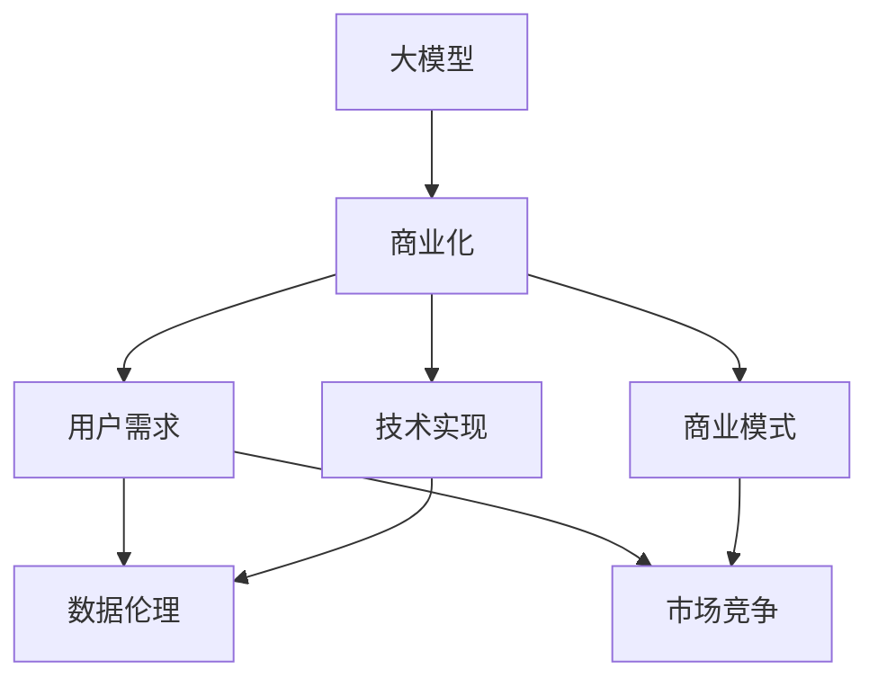

                 

# AI大模型创业：如何应对未来用户需求？

> 关键词：AI大模型,创业,用户需求,人工智能应用,商业模式,创新驱动

## 1. 背景介绍

### 1.1 问题由来

在人工智能（AI）飞速发展的今天，大模型技术正逐步成为引领行业变革的关键因素。尤其是像OpenAI的GPT-4、Google的BERT等通用大模型的出现，极大地推动了自然语言处理（NLP）、计算机视觉、语音识别等多个领域的发展。然而，尽管大模型技术在科研和商业应用上取得了显著成效，但其在商业化过程中的推广和应用仍然面临诸多挑战，特别是如何有效应对未来用户需求的变化。

### 1.2 问题核心关键点

在未来AI大模型的创业过程中，以下几个问题尤为关键：

1. **用户需求理解**：如何准确捕捉用户的真实需求，构建真正满足用户痛点的解决方案？
2. **技术实现**：如何将大模型技术与实际应用场景无缝结合，优化性能，提升用户体验？
3. **商业模式**：如何在保持技术领先的同时，构建可持续的商业模型？
4. **数据伦理**：如何确保模型训练和使用过程中遵循数据伦理和隐私保护规范？
5. **市场竞争**：在竞争激烈的市场中，如何通过技术创新和差异化策略脱颖而出？

理解并解决这些问题，是AI大模型创业成功的关键。本文将从用户需求理解、技术实现、商业模式、数据伦理和市场竞争五个维度展开探讨，提供一份系统的创业指南。

## 2. 核心概念与联系

### 2.1 核心概念概述

为了深入探讨AI大模型创业的各个方面，本节将介绍几个核心概念及其相互联系：

- **大模型（Large Model）**：指那些具有亿级参数的深度学习模型，如GPT、BERT等，能够进行复杂的自然语言理解和生成。
- **商业化（Commercialization）**：将AI大模型技术转化为市场产品和服务的过程，包括技术转化、市场推广、产品上线等。
- **用户需求（User Demand）**：用户在实际使用过程中所提出的各种需求，包括功能需求、性能需求、安全性需求等。
- **技术实现（Technical Implementation）**：通过编程、算法优化、模型训练等技术手段，将大模型应用于实际场景的过程。
- **商业模式（Business Model）**：如何通过产品、服务、合作等形式，实现商业价值的循环，包括产品定价、市场策略、合作模式等。
- **数据伦理（Data Ethics）**：在数据收集、处理、使用过程中遵循的一系列伦理准则，包括隐私保护、公平性、透明度等。
- **市场竞争（Market Competition）**：在AI大模型领域，各公司和团队间的竞争策略和技术较量，包括技术优势、市场份额、客户忠诚度等。

这些概念通过以下Mermaid流程图进行展现：



该流程图展示了这些核心概念之间的关系：大模型技术需要通过商业化转化为实际产品，并结合用户需求、技术实现、商业模式、数据伦理和市场竞争等多方面因素，形成完整的创业生态。

## 3. 核心算法原理 & 具体操作步骤

### 3.1 算法原理概述

AI大模型的商业化过程，本质上是通过将大模型技术转化为可市场化的产品和服务，满足用户需求，并通过优化商业模式和技术实现，在市场竞争中保持优势。这一过程需要遵循以下几个基本原理：

1. **用户体验优先**：技术实现过程中始终以提升用户体验为核心目标，确保产品具备易用性、高效性和可靠性。
2. **数据驱动决策**：通过收集用户反馈和市场数据，驱动产品迭代和优化，确保产品能够持续满足用户需求。
3. **灵活商业模式**：探索多样化商业模式，如SaaS、API、订阅服务等，以适应不同用户和市场的需求。
4. **严格遵循数据伦理**：在数据处理和模型使用过程中，严格遵守隐私保护、公平性、透明度等伦理准则，确保用户信任。
5. **差异化竞争策略**：通过技术创新和差异化服务，在市场竞争中形成竞争优势，满足用户独特需求。

### 3.2 算法步骤详解

AI大模型商业化的一般步骤包括：

**Step 1: 用户需求调研**
- 通过问卷调查、用户访谈、数据分析等方式，深入了解目标用户的需求、痛点和期望，建立用户画像。
- 收集用户反馈和市场数据，评估需求满足度和市场潜力。

**Step 2: 产品设计与开发**
- 根据调研结果，设计产品功能和架构，进行技术选型和需求实现。
- 进行原型开发和用户测试，收集反馈意见，不断优化产品设计。

**Step 3: 模型训练与优化**
- 选择合适的预训练模型，并针对具体任务进行微调。
- 优化模型参数和结构，提升模型性能和效率。
- 进行对抗训练和正则化，提高模型鲁棒性和泛化能力。

**Step 4: 商业模式与定价**
- 根据市场调研结果，制定合理的定价策略和商业模式。
- 设计营销策略，提升产品市场渗透率。

**Step 5: 数据安全与隐私保护**
- 设计数据安全体系，确保数据在传输、存储和使用过程中的安全。
- 遵循隐私保护法规，如GDPR、CCPA等，保障用户隐私。

**Step 6: 市场推广与客户服务**
- 通过多种渠道推广产品，如社交媒体、官网、技术论坛等。
- 建立客户服务体系，提供技术支持、用户培训等服务。

**Step 7: 持续迭代与优化**
- 根据用户反馈和市场变化，持续进行产品迭代和优化。
- 关注新趋势和技术，保持产品竞争力。

### 3.3 算法优缺点

AI大模型商业化具备以下优点：

1. **技术领先性**：通过大模型技术的引入，可以显著提升产品性能，满足用户对高性能和智能化的需求。
2. **用户体验改善**：大模型技术的引入，使得产品能够更好地理解用户需求，提供更加个性化和智能化的服务。
3. **市场潜力大**：大模型技术具备强大的市场潜力，应用场景广泛，能够覆盖更多用户和行业。

同时，也存在一些缺点：

1. **成本高**：大模型训练和商业化成本较高，需要大量计算资源和人力资源。
2. **数据依赖性高**：大模型训练依赖高质量的数据集，数据获取和处理成本较高。
3. **技术复杂**：大模型技术实现复杂，涉及多种技术和算法，需要具备一定的技术积累和团队实力。
4. **用户需求多变**：用户需求多样且不断变化，需要持续关注市场动态，及时调整产品策略。

### 3.4 算法应用领域

AI大模型商业化技术在多个领域都有广泛应用，包括：

- **智能客服**：通过大模型技术实现智能问答和自动回复，提高客户服务效率和质量。
- **金融风控**：利用大模型进行信用评估、欺诈检测、风险管理等，提升金融安全性和效率。
- **医疗健康**：使用大模型进行疾病诊断、医疗咨询、健康管理等，提升医疗服务质量和效率。
- **教育培训**：利用大模型进行个性化教学、智能评估、内容推荐等，提升教育培训效果。
- **市场营销**：通过大模型进行市场分析、用户画像、广告投放等，提升市场营销效果。

## 4. 数学模型和公式 & 详细讲解 & 举例说明

### 4.1 数学模型构建

在AI大模型商业化过程中，数学模型构建是核心步骤之一。通过构建合适的数学模型，可以更好地理解和预测用户需求，优化产品设计。

假设用户需求可以通过一系列特征向量 $x = (x_1, x_2, ..., x_n)$ 来表示，其中 $x_i$ 表示第 $i$ 个特征。用户满意度可以通过以下数学模型进行预测：

$$
\text{满意度} = f(x; \theta)
$$

其中 $f$ 为预测函数，$\theta$ 为模型参数，通过优化算法进行训练。

### 4.2 公式推导过程

以用户满意度预测模型为例，公式推导过程如下：

1. **特征选择**：选择与用户满意度相关的特征，如用户活跃度、使用时长、评价反馈等。
2. **模型选择**：选择合适的模型，如线性回归、决策树、随机森林等。
3. **数据准备**：准备训练数据集，并进行数据清洗和特征工程。
4. **模型训练**：使用优化算法（如梯度下降）进行模型训练，优化模型参数。
5. **模型评估**：在测试集上评估模型性能，选择最优模型。

### 4.3 案例分析与讲解

假设我们开发了一款基于大模型的智能客服系统，目标是预测用户满意度。在模型构建过程中，我们选择了用户活跃度、使用时长、评价反馈三个特征，模型选择了线性回归模型。数据准备阶段，我们收集了10000个历史用户数据，并进行特征工程，最终用于模型训练。通过梯度下降算法进行模型训练，最终得到用户满意度的预测模型。

## 5. 项目实践：代码实例和详细解释说明

### 5.1 开发环境搭建

进行AI大模型的商业化开发，需要搭建合适的开发环境。以下是一个简单的开发环境搭建流程：

1. **安装Python和相关库**：确保Python 3.x版本，并使用pip安装必要的库，如TensorFlow、Keras、Scikit-Learn等。
2. **数据准备**：准备训练数据集，并进行数据清洗和特征工程。
3. **环境配置**：配置GPU资源，确保训练和推理过程中能够高效运行。

### 5.2 源代码详细实现

以下是一个基于TensorFlow实现用户满意度预测模型的代码示例：

```python
import tensorflow as tf
from sklearn.preprocessing import StandardScaler
from sklearn.model_selection import train_test_split
from sklearn.metrics import mean_squared_error

# 数据准备
data = load_data()
X_train, X_test, y_train, y_test = train_test_split(X, y, test_size=0.2, random_state=42)

# 特征工程
scaler = StandardScaler()
X_train = scaler.fit_transform(X_train)
X_test = scaler.transform(X_test)

# 模型构建
model = tf.keras.Sequential([
    tf.keras.layers.Dense(64, activation='relu', input_shape=(X_train.shape[1],)),
    tf.keras.layers.Dense(1)
])

# 模型训练
model.compile(optimizer=tf.keras.optimizers.Adam(0.001), loss='mse')
model.fit(X_train, y_train, epochs=10, batch_size=32, validation_data=(X_test, y_test))

# 模型评估
y_pred = model.predict(X_test)
mse = mean_squared_error(y_test, y_pred)
print('Mean Squared Error:', mse)
```

### 5.3 代码解读与分析

以上代码实现了一个简单的用户满意度预测模型。具体解读如下：

1. **数据准备**：使用sklearn库加载数据，并进行特征工程，确保数据质量。
2. **模型构建**：使用TensorFlow构建线性回归模型，包含一个隐藏层和一个输出层。
3. **模型训练**：使用Adam优化算法，进行模型训练，并设定评估指标为均方误差。
4. **模型评估**：在测试集上评估模型性能，输出均方误差。

## 6. 实际应用场景

### 6.1 智能客服系统

智能客服系统是大模型商业化的一个重要应用场景。通过使用大模型进行语义理解，可以大幅提升客服效率和用户体验。

- **技术实现**：构建基于BERT等大模型的语义理解模型，能够自动理解用户意图，进行快速回复。
- **用户需求理解**：通过自然语言处理技术，了解用户真实需求，提供个性化服务。
- **商业模式**：提供API接口，客户可以定制化服务，按需付费。
- **数据伦理**：确保用户数据隐私安全，遵循数据保护法规。
- **市场竞争**：通过持续优化和迭代，保持技术领先性，提升市场占有率。

### 6.2 金融风控

金融风控是大模型商业化的另一个重要领域。通过使用大模型进行信用评估、欺诈检测等，可以大幅提升金融服务质量。

- **技术实现**：构建基于大模型的信用评估和欺诈检测模型，能够实时分析用户行为，识别潜在风险。
- **用户需求理解**：通过分析用户行为数据，了解用户信用风险和欺诈行为。
- **商业模式**：提供SaaS服务，金融机构可以定制化服务，按需付费。
- **数据伦理**：确保用户数据隐私安全，遵循数据保护法规。
- **市场竞争**：通过持续优化和迭代，保持技术领先性，提升市场占有率。

### 6.3 医疗健康

医疗健康领域是大模型商业化的新兴应用场景。通过使用大模型进行疾病诊断、医疗咨询等，可以大幅提升医疗服务质量。

- **技术实现**：构建基于大模型的疾病诊断和医疗咨询模型，能够提供准确的健康建议和诊断。
- **用户需求理解**：通过分析用户健康数据，了解用户健康状况和需求。
- **商业模式**：提供在线咨询和健康管理服务，用户按需付费。
- **数据伦理**：确保用户数据隐私安全，遵循数据保护法规。
- **市场竞争**：通过持续优化和迭代，保持技术领先性，提升市场占有率。

## 7. 工具和资源推荐

### 7.1 学习资源推荐

为了帮助开发者系统掌握AI大模型商业化的相关技术，这里推荐一些优质的学习资源：

1. **TensorFlow官方文档**：官方文档提供了全面的API和开发指南，是学习TensorFlow的好资源。
2. **Keras官方文档**：Keras是一个高层次的神经网络API，易于上手，适合初学者和进阶开发者。
3. **Deep Learning Specialization**：由Andrew Ng教授开设的深度学习课程，涵盖多种AI技术，包括大模型商业化。
4. **Transformers官方文档**：提供了大量的预训练模型和微调样例，适合快速上手大模型商业化。
5. **Coursera上的机器学习和深度学习课程**：提供了系统化的机器学习和深度学习知识，适合系统学习。

### 7.2 开发工具推荐

开发大模型商业化产品，需要选择合适的开发工具。以下是几款常用的工具：

1. **Jupyter Notebook**：Python开发中常用的交互式开发环境，适合快速原型开发和实验。
2. **Google Colab**：Google提供的免费Jupyter Notebook环境，适合初学者和开发人员。
3. **PyCharm**：一款强大的Python开发IDE，提供代码补全、调试等功能，适合开发大模型商业化产品。
4. **Git**：版本控制系统，适合协作开发和代码管理。
5. **Docker**：容器化技术，适合部署和管理大模型商业化产品。

### 7.3 相关论文推荐

大模型商业化技术的发展离不开相关论文的支持。以下是几篇重要的相关论文，推荐阅读：

1. **Attention is All You Need**：提出Transformer模型，奠定了大模型商业化的基础。
2. **BERT: Pre-training of Deep Bidirectional Transformers for Language Understanding**：提出BERT模型，展示了大模型在NLP任务上的强大能力。
3. **Towards a General Intelligence with AI Models**：探讨了通用人工智能的目标和路径，对大模型商业化具有指导意义。
4. **An Introduction to Deep Learning for Natural Language Processing**：介绍了深度学习在NLP中的应用，包括大模型商业化。
5. **A Survey on Deep Learning for Personalization**：回顾了深度学习在个性化推荐领域的应用，对大模型商业化有参考价值。

## 8. 总结：未来发展趋势与挑战

### 8.1 研究成果总结

通过本文的介绍，可以系统了解AI大模型商业化的基本原理和操作步骤。在用户需求理解、技术实现、商业模式、数据伦理和市场竞争等多个方面，提供了全面指导。希望开发者能够借鉴这些经验，提升AI大模型商业化的成功率。

### 8.2 未来发展趋势

未来AI大模型商业化技术将呈现以下几个发展趋势：

1. **数据驱动决策**：通过大数据和机器学习，优化产品设计和用户体验。
2. **个性化推荐**：利用大模型技术，提供更加个性化的产品和服务。
3. **智能客服**：通过自然语言处理和大模型技术，提升客服效率和用户满意度。
4. **金融风控**：利用大模型技术，进行信用评估、欺诈检测等，提升金融服务质量。
5. **医疗健康**：利用大模型技术，进行疾病诊断、医疗咨询等，提升医疗服务质量。
6. **教育培训**：利用大模型技术，进行个性化教学、智能评估等，提升教育培训效果。

### 8.3 面临的挑战

尽管AI大模型商业化技术在不断进步，但在推广应用过程中仍面临诸多挑战：

1. **数据获取和处理**：高质量数据获取和处理成本高，影响模型训练效果。
2. **技术实现复杂**：大模型技术实现复杂，需要一定的技术积累和团队实力。
3. **用户需求多变**：用户需求多样且不断变化，需要持续关注市场动态，及时调整产品策略。
4. **数据隐私和安全**：用户数据隐私和安全问题，需要严格遵循隐私保护法规。
5. **市场竞争激烈**：市场竞争激烈，需要持续创新和差异化策略。

### 8.4 研究展望

未来AI大模型商业化技术需要不断突破以下挑战：

1. **高效数据处理**：通过数据增强和模型优化，提高数据处理效率。
2. **智能决策系统**：构建基于大模型的智能决策系统，提升产品智能化水平。
3. **多模态融合**：融合视觉、语音、文本等多模态信息，提升用户体验和产品功能。
4. **个性化推荐系统**：构建高效的个性化推荐系统，提升用户满意度和黏性。
5. **自动化部署**：通过自动化部署技术，提升产品部署效率和稳定性。

## 9. 附录：常见问题与解答

**Q1：AI大模型商业化过程中如何处理数据隐私问题？**

A: 处理数据隐私问题需要遵循以下几个原则：

1. **数据最小化**：只收集和处理必要的数据，减少数据泄露风险。
2. **数据匿名化**：对数据进行匿名化处理，避免数据被识别和关联。
3. **数据加密**：对数据进行加密处理，确保数据在传输和存储过程中的安全。
4. **合规遵循**：遵循数据保护法规，如GDPR、CCPA等，确保用户数据隐私。
5. **用户授权**：在收集用户数据前，获取用户授权，明确告知数据用途。

**Q2：AI大模型商业化过程中如何提高用户满意度？**

A: 提高用户满意度需要从多个方面入手：

1. **用户需求理解**：深入了解用户需求和痛点，提供个性化服务。
2. **技术实现优化**：优化产品功能和技术性能，提升用户体验。
3. **客户服务提升**：建立良好的客户服务体系，提供及时的技术支持和用户培训。
4. **产品迭代和改进**：根据用户反馈和市场变化，持续进行产品迭代和优化。
5. **市场推广和宣传**：通过多种渠道推广产品，提升品牌影响力和用户认知。

**Q3：AI大模型商业化过程中如何保持技术领先性？**

A: 保持技术领先性需要以下几个步骤：

1. **持续创新**：持续关注AI技术发展，进行技术创新和改进。
2. **团队建设**：组建一支高水平的技术团队，吸引和培养顶尖人才。
3. **合作与交流**：与行业内外的技术团队进行合作和交流，吸取最新技术和经验。
4. **研发投入**：持续投入研发资金，进行技术研究和产品开发。
5. **市场调研**：深入了解市场需求和用户痛点，调整产品策略和技术路线。

---

作者：禅与计算机程序设计艺术 / Zen and the Art of Computer Programming

