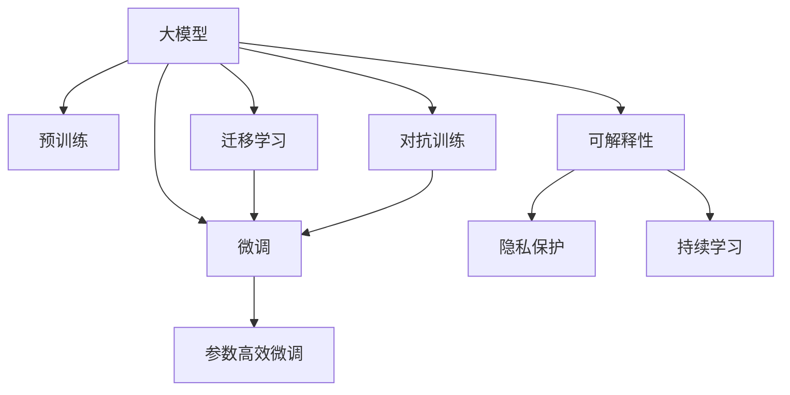

                 

# AI大模型创业：如何应对未来行业发展趋势？

## 1. 背景介绍

### 1.1 问题由来
随着人工智能技术的快速发展，大模型（Large Model）在各个行业的应用变得越来越广泛，从自然语言处理（NLP）、计算机视觉（CV）到推荐系统（Recommendation System）等领域，大模型的广泛应用极大地提升了相关产品的性能和用户体验。同时，随着高性能计算资源的不断增加，大模型可以包含更多的参数和更大的规模，使其具备更加强大的建模能力。

然而，大模型在创业和落地应用过程中也面临诸多挑战，包括数据获取、模型训练、推理部署、安全性、可解释性等问题。面对未来行业发展趋势，AI大模型创业者必须提前预见并应对这些挑战，才能实现可持续发展。

### 1.2 问题核心关键点
未来行业发展趋势主要包括以下几个方面：
- **数据需求增加**：随着大模型规模的扩大，对于数据的需求也在不断增加，高质量、多样化的数据源成为企业的重要资源。
- **技术迭代加速**：AI技术的快速发展促使创业者需要不断学习新技术，以保持竞争力。
- **模型部署成本**：高性能的AI模型需要强大的硬件支持，高额的部署和运维成本成为创业企业面临的重大挑战。
- **数据隐私与安全**：用户数据隐私保护和模型安全问题亟需解决。
- **可解释性与透明性**：提升模型的可解释性和透明性，以满足监管合规和用户体验需求。

## 2. 核心概念与联系

### 2.1 核心概念概述
- **大模型（Large Model）**：指包含大量参数的深度学习模型，如BERT、GPT-3等，通过大规模预训练学习通用知识，并具备强大的泛化能力。
- **预训练（Pre-training）**：指在大规模无标签数据上训练大模型，使其具备通用的表示能力。
- **微调（Fine-tuning）**：在大模型基础上，使用特定任务的有标签数据进行有监督学习，优化模型在该任务上的性能。
- **迁移学习（Transfer Learning）**：利用预训练模型的知识进行迁移，以提升特定任务的表现。
- **参数高效微调（Parameter-Efficient Fine-tuning, PEFT）**：仅更新部分参数，避免过拟合和提高模型效率。
- **可解释性（Explainability）**：提升模型的可解释性，使其决策过程透明可理解。
- **隐私保护（Privacy Protection）**：保护用户数据隐私，确保数据使用的合法性和安全性。

这些核心概念构成了AI大模型创业的基础，通过对这些概念的理解和应用，创业者可以更好地应对未来的行业发展趋势。

### 2.2 核心概念原理和架构的 Mermaid 流程图



这个流程图展示了AI大模型创业中的核心概念及其相互关系：

1. 大模型通过预训练获得基础能力。
2. 微调在大模型的基础上，针对特定任务进行优化，提升模型性能。
3. 迁移学习利用预训练模型知识进行跨任务迁移，提升泛化能力。
4. 可解释性提升模型的透明度和可信度，满足合规要求。
5. 隐私保护确保数据使用的合法性和用户隐私安全。
6. 对抗训练增强模型鲁棒性，提升泛化性能。

## 3. 核心算法原理 & 具体操作步骤

### 3.1 算法原理概述

AI大模型的创业过程中，核心算法主要分为预训练、微调和迁移学习三个阶段：

1. **预训练**：在无标签数据上训练大模型，使其具备通用的表示能力。
2. **微调**：在有标签数据上，使用预训练模型进行有监督学习，优化模型性能。
3. **迁移学习**：将预训练模型知识迁移到特定任务上，提升模型泛化能力。

这些算法原理为大模型创业提供了理论基础，帮助企业利用大模型提升产品性能和用户体验。

### 3.2 算法步骤详解

#### 3.2.1 预训练步骤
1. 数据准备：收集大规模无标签数据，并对其进行预处理，如清洗、去重、标准化等。
2. 模型选择：选择合适的预训练模型（如BERT、GPT-3等），并配置合适的超参数，如学习率、批大小等。
3. 训练过程：在大规模无标签数据上使用自监督学习任务进行预训练，如语言建模、掩码语言模型等。
4. 评估与优化：在验证集上评估模型性能，根据评估结果调整模型参数和训练策略，优化模型效果。

#### 3.2.2 微调步骤
1. 数据准备：收集目标任务的标注数据，并进行预处理，如分词、标记等。
2. 模型选择：选择预训练模型作为初始化参数，配置合适的微调参数，如学习率、批大小等。
3. 任务适配：根据目标任务，设计合适的输出层和损失函数，如分类任务使用交叉熵损失，生成任务使用负对数似然损失等。
4. 训练过程：在标注数据上使用微调模型进行有监督学习，优化模型性能。
5. 评估与优化：在验证集上评估模型性能，根据评估结果调整模型参数和训练策略，优化模型效果。

#### 3.2.3 迁移学习步骤
1. 数据准备：收集目标任务的标注数据，并进行预处理。
2. 模型选择：选择预训练模型作为初始化参数，配置合适的迁移学习参数，如学习率、批大小等。
3. 任务适配：根据目标任务，设计合适的输出层和损失函数。
4. 训练过程：在标注数据上使用迁移学习模型进行有监督学习，优化模型性能。
5. 评估与优化：在验证集上评估模型性能，根据评估结果调整模型参数和训练策略，优化模型效果。

### 3.3 算法优缺点

#### 3.3.1 优点
1. **泛化能力强**：通过预训练和微调，大模型能够学习到广泛的通用知识，并应用于特定任务，具备较强的泛化能力。
2. **效率高**：在大规模数据上预训练和微调，能够显著提升模型性能，缩短开发周期。
3. **易于迁移**：利用迁移学习，大模型能够快速适应新任务，减少从头开发的工作量。

#### 3.3.2 缺点
1. **数据需求高**：预训练和微调需要大量数据，获取高质量标注数据成本高。
2. **计算资源需求大**：大模型训练和推理需要高性能硬件支持，硬件成本高。
3. **可解释性差**：大模型通常被视为"黑盒"模型，其内部决策过程难以解释。

### 3.4 算法应用领域

AI大模型在多个领域都有广泛应用，包括但不限于：

- **自然语言处理（NLP）**：如文本分类、情感分析、机器翻译、对话系统等。
- **计算机视觉（CV）**：如图像分类、目标检测、图像生成、图像分割等。
- **推荐系统（Recommendation System）**：如商品推荐、用户画像生成、内容推荐等。
- **金融科技（FinTech）**：如信用评分、欺诈检测、情感分析等。
- **医疗健康（Healthcare）**：如疾病诊断、患者管理、医学知识图谱等。

这些领域的应用展示了AI大模型在实际生产中的广泛价值和巨大潜力。

## 4. 数学模型和公式 & 详细讲解 & 举例说明

### 4.1 数学模型构建

AI大模型的数学模型通常包括以下几个部分：

- **输入层**：输入数据经过预处理后，转化为模型所需的向量表示。
- **编码器（Encoder）**：对输入向量进行编码，学习到高层次的特征表示。
- **任务适配层**：根据具体任务，设计合适的输出层和损失函数，如分类任务使用交叉熵损失，生成任务使用负对数似然损失等。

### 4.2 公式推导过程

以BERT模型为例，其预训练过程和微调过程的公式推导如下：

#### 预训练过程
BERT模型的预训练任务包括掩码语言模型（Masked Language Model, MLM）和下一句预测（Next Sentence Prediction, NSP）。

- **掩码语言模型**：输入向量被掩盖一部分单词，模型需要预测被掩盖的单词。
- **下一句预测**：两个句子作为输入，模型需要预测它们是否为连续的下一句。

##### 掩码语言模型
设输入向量为 $x_i$，掩码后的向量为 $x_i^{\prime}$，掩码后的向量预测结果为 $\hat{x}_i^{\prime}$，则掩码语言模型的损失函数为：
$$
\mathcal{L}_{MLM} = -\sum_{i=1}^N \sum_{j=1}^{m} \log\hat{x}_i^{\prime}_j
$$
其中 $N$ 为输入序列的总数，$m$ 为掩码的比例。

##### 下一句预测
设两个输入向量分别为 $x_i$ 和 $x_j$，模型预测它们是否为连续的下一句，预测结果为 $y_{ij}$，则下一句预测的损失函数为：
$$
\mathcal{L}_{NSP} = -\sum_{i=1}^N \sum_{j=i+1}^{N} \log(y_{ij})
$$

#### 微调过程
以分类任务为例，设输入向量为 $x$，模型输出为 $\hat{y}$，真实标签为 $y$，则分类任务的损失函数为：
$$
\mathcal{L} = -\frac{1}{N}\sum_{i=1}^N \sum_{k=1}^{K} y_k \log(\hat{y}_k)
$$
其中 $N$ 为样本数，$K$ 为分类数。

### 4.3 案例分析与讲解

以图像分类任务为例，分析BERT模型在该任务上的微调过程：

- **输入层**：输入图像经过预处理（如归一化、裁剪、缩放等）后，转化为向量表示。
- **编码器**：使用预训练的BERT模型对图像向量进行编码，得到高层次的特征表示。
- **任务适配层**：设计多分类任务的输出层，并使用交叉熵损失函数。
- **训练过程**：在有标签数据集上使用微调模型进行有监督学习，优化模型性能。
- **评估与优化**：在验证集上评估模型性能，根据评估结果调整模型参数和训练策略，优化模型效果。

## 5. 项目实践：代码实例和详细解释说明

### 5.1 开发环境搭建

AI大模型的开发环境通常需要高性能的计算资源和丰富的软件支持。以下是一个基于PyTorch的开发环境配置流程：

1. 安装Anaconda：
   ```bash
   conda install anaconda
   ```

2. 创建虚拟环境：
   ```bash
   conda create -n ai_env python=3.8
   conda activate ai_env
   ```

3. 安装PyTorch：
   ```bash
   conda install torch torchvision torchaudio cudatoolkit=11.1 -c pytorch -c conda-forge
   ```

4. 安装Transformers库：
   ```bash
   pip install transformers
   ```

5. 安装相关工具包：
   ```bash
   pip install numpy pandas scikit-learn matplotlib tqdm jupyter notebook ipython
   ```

完成上述步骤后，即可在`ai_env`环境中开始AI大模型的开发实践。

### 5.2 源代码详细实现

以下是一个使用PyTorch和Transformers库进行图像分类任务微调的代码示例：

```python
from transformers import BertModel, BertTokenizer, AdamW
import torch
import numpy as np

# 加载预训练模型和分词器
model = BertModel.from_pretrained('bert-base-uncased')
tokenizer = BertTokenizer.from_pretrained('bert-base-uncased')

# 定义损失函数和优化器
loss_fn = torch.nn.CrossEntropyLoss()
optimizer = AdamW(model.parameters(), lr=2e-5)

# 加载数据集并进行预处理
# ...

# 定义微调函数
def fine_tune(model, dataloader, optimizer, num_epochs, batch_size):
    model.train()
    for epoch in range(num_epochs):
        for batch in dataloader:
            input_ids = batch['input_ids']
            attention_mask = batch['attention_mask']
            labels = batch['labels']
            
            outputs = model(input_ids, attention_mask=attention_mask, labels=labels)
            loss = loss_fn(outputs, labels)
            
            optimizer.zero_grad()
            loss.backward()
            optimizer.step()
            
    model.eval()
    # ...

# 执行微调
fine_tune(model, dataloader, optimizer, num_epochs=5, batch_size=32)
```

### 5.3 代码解读与分析

- **数据预处理**：将图像数据转化为向量表示，并进行归一化处理。
- **模型选择**：选择预训练的BERT模型作为初始化参数。
- **任务适配层**：设计多分类任务的输出层，并使用交叉熵损失函数。
- **训练过程**：在有标签数据集上使用微调模型进行有监督学习，优化模型性能。
- **评估与优化**：在验证集上评估模型性能，根据评估结果调整模型参数和训练策略，优化模型效果。

## 6. 实际应用场景

### 6.1 智能客服系统

基于AI大模型的智能客服系统可以通过微调提升客户咨询体验和问题解决效率。收集企业内部的历史客服对话记录，将问题和最佳答复构建成监督数据，在此基础上对预训练模型进行微调。微调后的对话模型能够自动理解用户意图，匹配最合适的答案模板进行回复。对于客户提出的新问题，还可以接入检索系统实时搜索相关内容，动态组织生成回答。

### 6.2 金融舆情监测

金融机构需要实时监测市场舆论动向，以便及时应对负面信息传播，规避金融风险。收集金融领域相关的新闻、报道、评论等文本数据，并对其进行主题标注和情感标注。在此基础上对预训练语言模型进行微调，使其能够自动判断文本属于何种主题，情感倾向是正面、中性还是负面。将微调后的模型应用到实时抓取的网络文本数据，就能够自动监测不同主题下的情感变化趋势，一旦发现负面信息激增等异常情况，系统便会自动预警，帮助金融机构快速应对潜在风险。

### 6.3 个性化推荐系统

当前的推荐系统往往只依赖用户的历史行为数据进行物品推荐，无法深入理解用户的真实兴趣偏好。基于AI大模型的个性化推荐系统可以更好地挖掘用户行为背后的语义信息，从而提供更精准、多样的推荐内容。收集用户浏览、点击、评论、分享等行为数据，提取和用户交互的物品标题、描述、标签等文本内容。将文本内容作为模型输入，用户的后续行为（如是否点击、购买等）作为监督信号，在此基础上微调预训练语言模型。微调后的模型能够从文本内容中准确把握用户的兴趣点。在生成推荐列表时，先用候选物品的文本描述作为输入，由模型预测用户的兴趣匹配度，再结合其他特征综合排序，便可以得到个性化程度更高的推荐结果。

### 6.4 未来应用展望

随着AI大模型的不断发展，未来在更多领域将迎来新的突破。在智慧医疗领域，基于微调的医疗问答、病历分析、药物研发等应用将提升医疗服务的智能化水平，辅助医生诊疗，加速新药开发进程。在智能教育领域，微调技术可应用于作业批改、学情分析、知识推荐等方面，因材施教，促进教育公平，提高教学质量。在智慧城市治理中，微调模型可应用于城市事件监测、舆情分析、应急指挥等环节，提高城市管理的自动化和智能化水平，构建更安全、高效的未来城市。此外，在企业生产、社会治理、文娱传媒等众多领域，基于大模型微调的人工智能应用也将不断涌现，为经济社会发展注入新的动力。

## 7. 工具和资源推荐

### 7.1 学习资源推荐

为了帮助开发者系统掌握AI大模型的微调理论和实践技巧，这里推荐一些优质的学习资源：

1. 《Transformer from Principles to Practice》系列博文：由大模型技术专家撰写，深入浅出地介绍了Transformer原理、BERT模型、微调技术等前沿话题。
2. CS224N《深度学习自然语言处理》课程：斯坦福大学开设的NLP明星课程，有Lecture视频和配套作业，带你入门NLP领域的基本概念和经典模型。
3. 《Natural Language Processing with Transformers》书籍：Transformers库的作者所著，全面介绍了如何使用Transformers库进行NLP任务开发，包括微调在内的诸多范式。
4. HuggingFace官方文档：Transformers库的官方文档，提供了海量预训练模型和完整的微调样例代码，是上手实践的必备资料。
5. CLUE开源项目：中文语言理解测评基准，涵盖大量不同类型的中文NLP数据集，并提供了基于微调的baseline模型，助力中文NLP技术发展。

通过对这些资源的学习实践，相信你一定能够快速掌握AI大模型的微调精髓，并用于解决实际的NLP问题。

### 7.2 开发工具推荐

高效的开发离不开优秀的工具支持。以下是几款用于AI大模型微调开发的常用工具：

1. PyTorch：基于Python的开源深度学习框架，灵活动态的计算图，适合快速迭代研究。大部分预训练语言模型都有PyTorch版本的实现。
2. TensorFlow：由Google主导开发的开源深度学习框架，生产部署方便，适合大规模工程应用。同样有丰富的预训练语言模型资源。
3. Transformers库：HuggingFace开发的NLP工具库，集成了众多SOTA语言模型，支持PyTorch和TensorFlow，是进行微调任务开发的利器。
4. Weights & Biases：模型训练的实验跟踪工具，可以记录和可视化模型训练过程中的各项指标，方便对比和调优。与主流深度学习框架无缝集成。
5. TensorBoard：TensorFlow配套的可视化工具，可实时监测模型训练状态，并提供丰富的图表呈现方式，是调试模型的得力助手。
6. Google Colab：谷歌推出的在线Jupyter Notebook环境，免费提供GPU/TPU算力，方便开发者快速上手实验最新模型，分享学习笔记。

合理利用这些工具，可以显著提升AI大模型微调任务的开发效率，加快创新迭代的步伐。

### 7.3 相关论文推荐

AI大模型和微调技术的发展源于学界的持续研究。以下是几篇奠基性的相关论文，推荐阅读：

1. Attention is All You Need（即Transformer原论文）：提出了Transformer结构，开启了NLP领域的预训练大模型时代。
2. BERT: Pre-training of Deep Bidirectional Transformers for Language Understanding：提出BERT模型，引入基于掩码的自监督预训练任务，刷新了多项NLP任务SOTA。
3. Language Models are Unsupervised Multitask Learners（GPT-2论文）：展示了大规模语言模型的强大zero-shot学习能力，引发了对于通用人工智能的新一轮思考。
4. Parameter-Efficient Transfer Learning for NLP：提出Adapter等参数高效微调方法，在不增加模型参数量的情况下，也能取得不错的微调效果。
5. Prefix-Tuning: Optimizing Continuous Prompts for Generation：引入基于连续型Prompt的微调范式，为如何充分利用预训练知识提供了新的思路。
6. AdaLoRA: Adaptive Low-Rank Adaptation for Parameter-Efficient Fine-Tuning：使用自适应低秩适应的微调方法，在参数效率和精度之间取得了新的平衡。

这些论文代表了大模型微调技术的发展脉络。通过学习这些前沿成果，可以帮助研究者把握学科前进方向，激发更多的创新灵感。

## 8. 总结：未来发展趋势与挑战

### 8.1 总结

本文对AI大模型的微调方法进行了全面系统的介绍。首先阐述了AI大模型和微调技术的研究背景和意义，明确了微调在拓展预训练模型应用、提升下游任务性能方面的独特价值。其次，从原理到实践，详细讲解了微调的数学原理和关键步骤，给出了微调任务开发的完整代码实例。同时，本文还广泛探讨了微调方法在智能客服、金融舆情、个性化推荐等多个行业领域的应用前景，展示了微调范式的巨大潜力。此外，本文精选了微调技术的各类学习资源，力求为读者提供全方位的技术指引。

通过本文的系统梳理，可以看到，AI大模型的微调技术正在成为NLP领域的重要范式，极大地拓展了预训练语言模型的应用边界，催生了更多的落地场景。受益于大规模语料的预训练，微调模型以更低的时间和标注成本，在小样本条件下也能取得不错的效果，有力推动了NLP技术的产业化进程。未来，伴随预训练语言模型和微调方法的持续演进，相信NLP技术将在更广阔的应用领域大放异彩，深刻影响人类的生产生活方式。

### 8.2 未来发展趋势

展望未来，AI大模型微调技术将呈现以下几个发展趋势：

1. **模型规模持续增大**：随着算力成本的下降和数据规模的扩张，预训练语言模型的参数量还将持续增长。超大规模语言模型蕴含的丰富语言知识，有望支撑更加复杂多变的下游任务微调。
2. **技术迭代加速**：AI技术的快速发展促使创业者需要不断学习新技术，以保持竞争力。
3. **模型部署成本降低**：随着硬件成本的下降，高性能的AI模型将更易部署，降低运维成本。
4. **数据隐私与安全**：用户数据隐私保护和模型安全问题亟需解决，监管法规的不断完善将进一步推动隐私保护技术的发展。
5. **可解释性增强**：提升模型的可解释性和透明性，以满足监管合规和用户体验需求。
6. **多模态融合**：将符号化的先验知识，如知识图谱、逻辑规则等，与神经网络模型进行巧妙融合，提升模型的泛化能力和鲁棒性。

以上趋势凸显了AI大模型微调技术的广阔前景。这些方向的探索发展，必将进一步提升AI模型的性能和应用范围，为人类认知智能的进化带来深远影响。

### 8.3 面临的挑战

尽管AI大模型微调技术已经取得了瞩目成就，但在迈向更加智能化、普适化应用的过程中，它仍面临着诸多挑战：

1. **数据需求瓶颈**：尽管微调能够降低标注成本，但对于长尾应用场景，高质量标注数据的获取仍然是瓶颈。如何进一步降低微调对标注样本的依赖，将是一大难题。
2. **模型鲁棒性不足**：当前微调模型面对域外数据时，泛化性能往往大打折扣。对于测试样本的微小扰动，微调模型的预测也容易发生波动。如何提高微调模型的鲁棒性，避免灾难性遗忘，还需要更多理论和实践的积累。
3. **推理效率低**：大模型虽然精度高，但在实际部署时往往面临推理速度慢、内存占用大等效率问题。如何在保证性能的同时，简化模型结构，提升推理速度，优化资源占用，将是重要的优化方向。
4. **可解释性差**：当前微调模型更像是"黑盒"系统，难以解释其内部工作机制和决策逻辑。对于医疗、金融等高风险应用，算法的可解释性和可审计性尤为重要。如何赋予微调模型更强的可解释性，将是亟待攻克的难题。
5. **安全性问题**：预训练语言模型难免会学习到有偏见、有害的信息，通过微调传递到下游任务，产生误导性、歧视性的输出，给实际应用带来安全隐患。如何从数据和算法层面消除模型偏见，避免恶意用途，确保输出的安全性，也将是重要的研究课题。

### 8.4 未来突破

面对AI大模型微调所面临的种种挑战，未来的研究需要在以下几个方面寻求新的突破：

1. **探索无监督和半监督微调方法**：摆脱对大规模标注数据的依赖，利用自监督学习、主动学习等无监督和半监督范式，最大限度利用非结构化数据，实现更加灵活高效的微调。
2. **研究参数高效和计算高效的微调范式**：开发更加参数高效的微调方法，在固定大部分预训练参数的同时，只更新极少量的任务相关参数。同时优化微调模型的计算图，减少前向传播和反向传播的资源消耗，实现更加轻量级、实时性的部署。
3. **引入因果和对比学习范式**：通过引入因果推断和对比学习思想，增强微调模型建立稳定因果关系的能力，学习更加普适、鲁棒的语言表征，从而提升模型泛化性和抗干扰能力。
4. **结合因果分析和博弈论工具**：将因果分析方法引入微调模型，识别出模型决策的关键特征，增强输出解释的因果性和逻辑性。借助博弈论工具刻画人机交互过程，主动探索并规避模型的脆弱点，提高系统稳定性。
5. **纳入伦理道德约束**：在模型训练目标中引入伦理导向的评估指标，过滤和惩罚有偏见、有害的输出倾向。同时加强人工干预和审核，建立模型行为的监管机制，确保输出符合人类价值观和伦理道德。

这些研究方向的探索，必将引领AI大模型微调技术迈向更高的台阶，为构建安全、可靠、可解释、可控的智能系统铺平道路。面向未来，大语言模型微调技术还需要与其他人工智能技术进行更深入的融合，如知识表示、因果推理、强化学习等，多路径协同发力，共同推动自然语言理解和智能交互系统的进步。只有勇于创新、敢于突破，才能不断拓展语言模型的边界，让智能技术更好地造福人类社会。

## 9. 附录：常见问题与解答

**Q1: AI大模型微调需要哪些硬件资源？**

A: AI大模型的微调通常需要高性能的计算资源，包括GPU/TPU等高性能硬件，以支持大规模模型的训练和推理。此外，还需要充足的内存和存储空间来存储模型参数和数据集。

**Q2: AI大模型的微调过程中，如何降低对标注数据的需求？**

A: 通过无监督学习和自监督学习等方法，可以在少量标注数据的情况下，利用未标注数据进行模型预训练和微调，从而降低对标注数据的依赖。例如，使用掩码语言模型、自编码器等自监督任务进行预训练，通过基于上下文的信息抽取等任务进行微调。

**Q3: AI大模型微调如何提升模型的泛化能力？**

A: 引入因果推断和对比学习等方法，可以增强模型的泛化能力。因果推断可以帮助模型建立稳定的因果关系，学习更加普适的语言表征。对比学习可以提升模型对相似和相关信息的感知能力，从而提高模型的泛化性能。

**Q4: AI大模型的可解释性如何提升？**

A: 通过引入可解释性模型和解释性技术，如知识图谱、符号逻辑推理等，可以提升AI大模型的可解释性。这些技术可以帮助用户理解模型的内部决策过程，提高模型的可信度。

**Q5: AI大模型的安全性如何保障？**

A: 通过数据隐私保护技术和模型安全技术，如差分隐私、对抗训练等，可以保障AI大模型的安全性。这些技术可以帮助保护用户数据隐私，防止模型被恶意利用。

这些回答展示了AI大模型微调在不同场景下的实际应用和潜在挑战，希望能为创业者提供有价值的参考。通过不断探索和优化，相信AI大模型微调技术将不断突破，为人工智能领域的创新和应用带来新的可能性。

