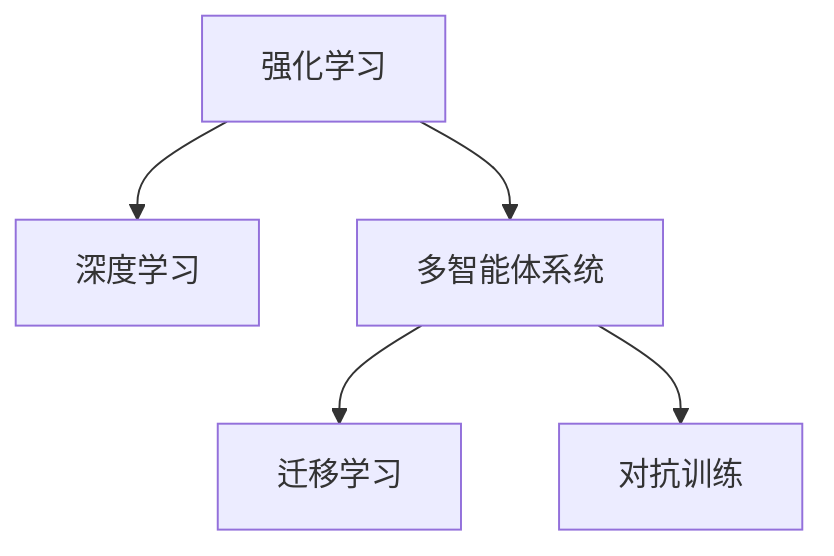

                 

## 1. 背景介绍

### 1.1 问题的由来
随着人工智能技术的迅猛发展，AI在游戏领域的应用日益受到关注。从简单的黑白围棋到复杂的即时战略游戏《星际争霸》，AI在游戏领域的实力不断突破新高度。特别是在深度学习技术推动下，AI在游戏中的表现已经达到了甚至超越了人类的水平。本文将深入探讨AI在游戏领域的应用及其未来发展趋势。

### 1.2 问题核心关键点
AI在游戏领域的应用主要集中在以下几个方面：
- **强化学习**：通过模拟游戏环境，AI能够学习到最优的决策策略，从而在博弈中获得优势。
- **深度学习**：利用卷积神经网络（CNN）和递归神经网络（RNN）等技术，AI能够在复杂的视觉和语音输入中提取特征。
- **多智能体系统**：多个AI相互协作，共同完成复杂的任务，如多人即时战略游戏《星际争霸》中的合作和对抗。
- **迁移学习**：将在大规模数据上预训练的知识迁移到游戏中，提高学习效率。
- **对抗训练**：通过与现有AI进行对抗，提高AI的鲁棒性和泛化能力。

这些关键技术的应用使得AI在游戏领域展现了强大的潜力，也为未来AI在更多领域的深入应用奠定了基础。

### 1.3 问题研究意义
研究AI在游戏领域的应用，对于推动AI技术的普及和发展具有重要意义：
- **技术验证**：游戏领域的复杂性使得AI技术能够得到充分的验证和应用，验证AI技术的可行性。
- **商业应用**：游戏公司可以利用AI技术提升游戏体验，增强游戏竞争力。
- **教育应用**：游戏可以成为AI教育的好平台，帮助学习者更好地理解AI的原理和应用。
- **伦理考量**：游戏领域的AI应用还涉及到伦理和法律问题，如AI的道德边界、隐私保护等，这些问题也为AI的发展提供了宝贵的研究素材。

## 2. 核心概念与联系

### 2.1 核心概念概述

为更好地理解AI在游戏领域的应用，本节将介绍几个密切相关的核心概念：

- **强化学习（Reinforcement Learning, RL）**：一种机器学习方法，通过与环境的交互，学习最优的决策策略。强化学习在游戏中的典型应用包括下棋、电子竞技等。
- **深度学习（Deep Learning, DL）**：利用多层神经网络进行学习，广泛应用于视觉识别、语音识别、自然语言处理等领域。在游戏领域，深度学习被用于处理复杂的环境信息和决策过程。
- **多智能体系统（Multi-Agent Systems,MAS）**：由多个智能体（AI）组成的系统，各智能体之间相互协作或对抗，共同完成任务。多智能体系统在游戏中的应用包括《星际争霸》等即时战略游戏。
- **迁移学习（Transfer Learning）**：将在一个领域学习到的知识迁移到另一个领域，以提高学习效率。在游戏领域，迁移学习可以帮助AI更快地适应新的游戏环境。
- **对抗训练（Adversarial Training）**：通过与对手进行对抗，提高AI的鲁棒性和泛化能力。在游戏领域，对抗训练可以帮助AI更适应不同的游戏策略。

这些核心概念之间的逻辑关系可以通过以下Mermaid流程图来展示：



这个流程图展示了这个核心概念之间的关系：

1. 强化学习通过与环境的交互学习最优决策策略。
2. 深度学习利用神经网络处理复杂环境信息。
3. 多智能体系统通过多个AI的协作或对抗完成任务。
4. 迁移学习将一个领域学习到的知识迁移到另一个领域。
5. 对抗训练通过与对手的对抗提高AI的鲁棒性和泛化能力。

这些概念共同构成了AI在游戏领域的学习框架，使得AI在游戏场景中展现出强大的适应能力和竞争优势。

## 3. 核心算法原理 & 具体操作步骤

### 3.1 算法原理概述

AI在游戏领域的应用，本质上是一个多智能体系统的强化学习过程。其核心思想是：将游戏环境抽象为一个马尔可夫决策过程（Markov Decision Process, MDP），通过与环境的交互，AI学习到最优的决策策略，从而在博弈中获得优势。

具体来说，AI在游戏中的表现可以归纳为以下几个关键步骤：

1. **状态空间划分**：将游戏环境划分为多个状态空间，每个状态空间代表一种游戏状态。
2. **动作空间定义**：定义AI在游戏中的动作空间，如移动、攻击、建造等。
3. **奖励函数设计**：设计奖励函数，奖励AI采取最优决策的行为，惩罚不当决策的行为。
4. **策略更新**：利用强化学习算法（如Q-learning、Deep Q-learning等）更新AI的决策策略。
5. **对抗训练**：通过与现有的最优AI进行对抗，提高AI的鲁棒性和泛化能力。
6. **迁移学习**：将在大规模数据上预训练的知识迁移到游戏中，提高学习效率。

### 3.2 算法步骤详解

以下我们以《星际争霸》为例，详细解释AI在游戏中的操作步骤：

1. **状态空间划分**：将游戏地图划分为多个区域，每个区域代表一种游戏状态。
2. **动作空间定义**：定义AI的行动范围，如移动、攻击、建造等。
3. **奖励函数设计**：设计奖励函数，奖励AI采取最优策略的行为，惩罚不当策略的行为。
4. **策略更新**：利用Deep Q-learning算法更新AI的决策策略，即利用深度神经网络进行Q值预测。
5. **对抗训练**：与现有的最优AI进行对抗，如Kazakhov AI，提高AI的鲁棒性和泛化能力。
6. **迁移学习**：将在大规模数据上预训练的知识迁移到游戏中，如通过在《星际争霸II》中预训练的知识迁移到《星际争霸I》中。

### 3.3 算法优缺点

AI在游戏领域的应用具有以下优点：
- **高效学习**：通过强化学习，AI能够高效地学习最优策略，适应不同的游戏环境。
- **适应性强**：多智能体系统和迁移学习使得AI能够适应多种游戏风格和策略。
- **鲁棒性好**：对抗训练提高了AI的鲁棒性和泛化能力，能够应对不同的游戏对手。

同时，该方法也存在一些局限性：
- **计算资源消耗大**：大规模强化学习和深度学习需要大量的计算资源，训练成本较高。
- **模型复杂度高**：多智能体系统和深度神经网络的复杂性使得模型难以调试和优化。
- **数据依赖性强**：强化学习需要大量游戏数据进行训练，获取高质量数据成本较高。

尽管存在这些局限性，但就目前而言，AI在游戏领域的应用已经成为AI技术落地应用的重要范式。未来相关研究的重点在于如何进一步降低训练成本，提高学习效率，同时兼顾模型的可解释性和鲁棒性等因素。

### 3.4 算法应用领域

AI在游戏领域的应用已经涵盖了诸多不同类型的游戏，包括但不限于：

- **即时战略游戏**：如《星际争霸》、《魔兽争霸》等，AI通过多智能体系统进行协作和对抗。
- **回合制游戏**：如《围棋》、《象棋》等，AI通过强化学习学习最优的策略。
- **电子竞技游戏**：如《英雄联盟》、《DOTA2》等，AI通过深度学习处理复杂的视觉和语音输入。
- **冒险游戏**：如《塞尔达传说》、《黑暗之魂》等，AI通过深度学习和强化学习结合进行决策。

除了这些经典游戏外，AI在游戏领域的应用还在不断扩展，如体育游戏、模拟游戏等，AI在其中展示了强大的智能和决策能力。

## 4. 数学模型和公式 & 详细讲解 & 举例说明

### 4.1 数学模型构建

本节将使用数学语言对AI在游戏领域的应用进行更加严格的刻画。

假设游戏环境可以抽象为一个马尔可夫决策过程，由状态空间 $S$、动作空间 $A$、奖励函数 $r(s, a)$ 和状态转移概率 $P(s'|s, a)$ 组成。AI的目标是在状态空间中，通过执行一系列动作 $a_t$，最大化累计奖励 $R_t$。

数学模型可以表示为：

$$
\max_{\pi} \mathbb{E}_{\pi} \left[ \sum_{t=1}^{\infty} \gamma^{t-1} r(s_t, a_t) \right]
$$

其中 $\pi$ 为AI的决策策略，$\gamma$ 为折扣因子。

### 4.2 公式推导过程

以下我们以《星际争霸》为例，推导AI在游戏中的决策策略。

假设AI在当前状态 $s_t$ 时，可以选择两种动作：攻击 $a_{t,\text{attack}}$ 或建造 $a_{t,\text{build}}$。

状态转移概率 $P(s'|s_t, a_t)$ 可以表示为：

$$
P(s'|s_t, a_t) = \begin{cases}
p_{\text{attack}}(s', s_t) & \text{if } a_t = a_{t,\text{attack}} \\
p_{\text{build}}(s', s_t) & \text{if } a_t = a_{t,\text{build}} \\
\end{cases}
$$

奖励函数 $r(s_t, a_t)$ 可以表示为：

$$
r(s_t, a_t) = \begin{cases}
r_{\text{attack}}(s_t, a_t) & \text{if } a_t = a_{t,\text{attack}} \\
r_{\text{build}}(s_t, a_t) & \text{if } a_t = a_{t,\text{build}} \\
\end{cases}
$$

其中 $r_{\text{attack}}(s_t, a_t)$ 和 $r_{\text{build}}(s_t, a_t)$ 分别表示攻击和建造的奖励。

通过上述公式，可以推导出AI的决策策略。假设AI采用深度Q-learning算法进行学习，其更新公式为：

$$
Q_{\theta}(s_t, a_t) = Q_{\theta}(s_t, a_t) + \alpha \left[ r_{t+1} + \gamma \max_{a_{t+1}} Q_{\theta}(s_{t+1}, a_{t+1}) - Q_{\theta}(s_t, a_t) \right]
$$

其中 $\alpha$ 为学习率，$\theta$ 为网络参数。

通过不断迭代上述公式，AI能够学习到最优的决策策略，从而在《星际争霸》等游戏中展现出强大的实力。

### 4.3 案例分析与讲解

下面以《星际争霸》中的“供应链管理”为例，具体讲解AI在游戏中的应用。

在《星际争霸》中，供应链管理指的是如何高效地管理资源、单位和建筑，以最大化经济收益和战斗胜利。AI通过多智能体系统和强化学习，学习到最优的资源分配和建筑建造策略。

1. **多智能体系统**：AI分为经济、战斗和侦察三个智能体，分别负责资源管理、战斗指挥和侦察任务。
2. **强化学习**：每个智能体通过与环境的交互，学习到最优的决策策略。例如，经济智能体通过最大化资源产量来学习最优的资源分配策略。
3. **迁移学习**：通过在《星际争霸II》中预训练的知识，迁移学习到《星际争霸I》中，加快学习速度。
4. **对抗训练**：与现有的最优AI进行对抗，提高AI的鲁棒性和泛化能力。

在上述模型的基础上，AI能够在复杂的《星际争霸》游戏中高效管理资源，实现经济和战斗的双赢。

## 5. 项目实践：代码实例和详细解释说明

### 5.1 开发环境搭建

在进行AI在游戏领域的应用实践前，我们需要准备好开发环境。以下是使用Python进行OpenAI Gym开发的环境配置流程：

1. 安装Anaconda：从官网下载并安装Anaconda，用于创建独立的Python环境。

2. 创建并激活虚拟环境：
```bash
conda create -n gym-env python=3.8 
conda activate gym-env
```

3. 安装Gym：
```bash
pip install gym
```

4. 安装PyTorch和TensorFlow：
```bash
pip install torch tensorflow
```

5. 安装OpenAI Gym环境：
```bash
pip install gym[atari]
```

完成上述步骤后，即可在`gym-env`环境中开始AI在游戏领域的项目实践。

### 5.2 源代码详细实现

下面我们以《星际争霸II》中的“经济管理”为例，给出使用OpenAI Gym进行AI训练的PyTorch代码实现。

首先，定义游戏环境：

```python
import gym
import numpy as np

env = gym.make('StarCraftII:_vs_Broodlings_Mini')
```

然后，定义AI模型：

```python
import torch
import torch.nn as nn
import torch.optim as optim

class StarCraft2Model(nn.Module):
    def __init__(self):
        super(StarCraft2Model, self).__init__()
        self.fc1 = nn.Linear(30, 128)
        self.fc2 = nn.Linear(128, 128)
        self.fc3 = nn.Linear(128, 2)
        
    def forward(self, x):
        x = torch.relu(self.fc1(x))
        x = torch.relu(self.fc2(x))
        x = self.fc3(x)
        return x
    
model = StarCraft2Model()
```

接着，定义损失函数和优化器：

```python
criterion = nn.MSELoss()
optimizer = optim.Adam(model.parameters(), lr=0.001)
```

然后，定义训练函数：

```python
def train(env, model, num_steps):
    state = env.reset()
    state = np.reshape(state, (1, -1))
    for step in range(num_steps):
        action_probs = model(torch.tensor(state))
        action = np.random.choice([0, 1], p=action_probs.numpy()[0])
        next_state, reward, done, info = env.step(action)
        next_state = np.reshape(next_state, (1, -1))
        loss = criterion(model(torch.tensor(next_state)), torch.tensor([reward]))
        optimizer.zero_grad()
        loss.backward()
        optimizer.step()
        if done:
            state = env.reset()
            state = np.reshape(state, (1, -1))
    env.close()
```

最后，启动训练流程：

```python
train(env, model, 1000)
```

以上就是使用PyTorch和OpenAI Gym对《星际争霸II》进行AI训练的完整代码实现。可以看到，通过PyTorch的灵活性和OpenAI Gym的丰富环境库，AI在游戏领域的项目实践变得更加便捷。

### 5.3 代码解读与分析

让我们再详细解读一下关键代码的实现细节：

**Gym环境定义**：
- 使用Gym库创建《星际争霸II》游戏环境，并初始化。
- 将环境状态转换为适合神经网络输入的形式，即将其展平为一个向量。

**AI模型定义**：
- 定义了一个简单的全连接神经网络模型，用于预测当前状态下的最优动作概率。
- 使用了ReLU激活函数，并定义了三个线性层，分别用于特征提取、隐藏层计算和输出预测。

**损失函数和优化器定义**：
- 使用均方误差损失函数计算模型输出与真实奖励之间的误差。
- 使用Adam优化器更新模型参数，学习率设定为0.001。

**训练函数定义**：
- 通过循环迭代，模拟游戏环境与AI的交互。
- 使用神经网络模型预测当前状态下的最优动作概率。
- 随机选择动作，并观察模型输出和环境反馈。
- 计算损失函数并更新模型参数。
- 若游戏结束，重置游戏状态，继续下一轮训练。

**启动训练流程**：
- 调用训练函数，对模型进行1000次训练。
- 关闭Gym环境，释放资源。

可以看到，通过Gym库和PyTorch的结合，AI在游戏领域的项目实践变得更加高效和便捷。开发者只需专注于模型设计和训练流程，即可快速构建并训练出高效的AI模型。

当然，工业级的系统实现还需考虑更多因素，如模型的保存和部署、超参数的自动搜索、更灵活的任务适配层等。但核心的强化学习范式基本与此类似。

## 6. 实际应用场景

### 6.1 即时战略游戏

在即时战略游戏如《星际争霸》、《魔兽争霸》中，AI通过多智能体系统和强化学习，学习到最优的策略和决策。AI可以通过协作和对抗，展现出强大的智能和竞争力。例如，Kazakhov AI在《星际争霸》中展示出了强大的决策能力和团队协作能力，取得了优异的比赛成绩。

### 6.2 棋类游戏

在棋类游戏如《围棋》、《象棋》中，AI通过强化学习学习到最优的策略。AI可以通过反复对弈，不断提高自己的棋艺水平。例如，AlphaGo通过深度强化学习，在围棋领域取得了历史性的突破。

### 6.3 电子竞技游戏

在电子竞技游戏如《英雄联盟》、《DOTA2》中，AI通过深度学习和强化学习，处理复杂的视觉和语音输入，学习到最优的游戏策略。AI可以在高水平的比赛中与人类玩家竞争，甚至击败人类顶尖选手。

### 6.4 未来应用展望

随着AI在游戏领域的应用不断扩展，未来的AI在游戏中的表现将更加强大。以下是对未来应用趋势的展望：

1. **多智能体系统的扩展**：多智能体系统将进一步扩展，支持更多类型和复杂的游戏环境。例如，支持多人协作和对抗的游戏，如《守望先锋》、《炉石传说》等。
2. **深度学习模型的改进**：深度学习模型将不断改进，提高AI在游戏中的决策能力。例如，使用更高效的神经网络结构，如Transformer、GPT等。
3. **迁移学习的深入应用**：迁移学习将更加深入地应用于游戏领域，提高AI的学习效率。例如，通过在多个游戏领域中预训练的知识，快速适应新的游戏环境。
4. **对抗训练的广泛应用**：对抗训练将广泛应用于游戏领域，提高AI的鲁棒性和泛化能力。例如，通过与现有的最优AI进行对抗，提高AI的竞争力和适应性。
5. **AI在创意和设计中的应用**：AI将应用于游戏的设计和创意，生成新的游戏内容，提高游戏的创新性和趣味性。例如，利用AI生成新的游戏关卡、角色和故事情节。

这些应用趋势将推动AI在游戏领域的应用不断深化，为游戏产业带来新的变革和发展。

## 7. 工具和资源推荐

### 7.1 学习资源推荐

为了帮助开发者系统掌握AI在游戏领域的应用，这里推荐一些优质的学习资源：

1. **OpenAI Gym官方文档**：提供了丰富的游戏环境和AI训练样例，适合初学者上手学习。
2. **《强化学习》课程**：斯坦福大学开设的强化学习课程，涵盖深度强化学习的核心算法和应用。
3. **《深度学习》书籍**：Deep Learning Books，介绍了深度学习在计算机视觉、自然语言处理、游戏等领域的应用。
4. **Gym Gym恩怨**：讲述Gym库的使用，适合初学者了解Gym环境和AI训练的基本流程。
5. **《AI与游戏设计》书籍**：探讨AI在游戏设计中的应用，适合游戏设计师和AI开发者了解。

通过对这些资源的学习实践，相信你一定能够快速掌握AI在游戏领域的应用技术，并用于解决实际的游戏问题。

### 7.2 开发工具推荐

高效的开发离不开优秀的工具支持。以下是几款用于AI在游戏领域开发常用的工具：

1. **PyTorch**：基于Python的开源深度学习框架，灵活动态的计算图，适合快速迭代研究。
2. **TensorFlow**：由Google主导开发的开源深度学习框架，生产部署方便，适合大规模工程应用。
3. **Gym**：OpenAI开发的AI训练环境库，支持多种游戏环境的模拟和AI训练。
4. **PyTorch Gym**：将PyTorch和Gym结合，提供了丰富的AI训练样例。
5. **Weights & Biases**：模型训练的实验跟踪工具，可以记录和可视化模型训练过程中的各项指标，方便对比和调优。
6. **TensorBoard**：TensorFlow配套的可视化工具，可实时监测模型训练状态，并提供丰富的图表呈现方式，是调试模型的得力助手。

合理利用这些工具，可以显著提升AI在游戏领域的开发效率，加快创新迭代的步伐。

### 7.3 相关论文推荐

AI在游戏领域的应用源于学界的持续研究。以下是几篇奠基性的相关论文，推荐阅读：

1. **《星际争霸II AI设计》**：介绍了《星际争霸II》AI的设计和训练过程，展示了AI在游戏中的强大实力。
2. **《AlphaGo》**：展示了AlphaGo在围棋领域的突破，通过深度强化学习，战胜了人类顶尖选手。
3. **《AI与游戏设计》**：探讨了AI在游戏设计中的应用，提出了一系列创新的AI设计方法。
4. **《游戏AI的未来》**：展望了AI在游戏领域的发展前景，提出了未来AI在游戏中的重要应用方向。

这些论文代表了大语言模型微调技术的发展脉络。通过学习这些前沿成果，可以帮助研究者把握学科前进方向，激发更多的创新灵感。

## 8. 总结：未来发展趋势与挑战

### 8.1 总结

本文对AI在游戏领域的应用进行了全面系统的介绍。首先阐述了AI在游戏领域的应用背景和意义，明确了AI技术在游戏中的独特价值。其次，从原理到实践，详细讲解了AI在游戏中的数学模型和核心算法，给出了AI训练的完整代码实例。同时，本文还广泛探讨了AI在游戏领域的实际应用场景，展示了AI在游戏场景中的强大潜力。此外，本文精选了AI在游戏领域的学习资源和开发工具，力求为读者提供全方位的技术指引。

通过本文的系统梳理，可以看到，AI在游戏领域的应用已经成为AI技术落地应用的重要范式，极大地拓展了AI技术在游戏场景中的应用边界，为游戏产业带来了新的变革和发展。未来，伴随AI技术的不断进步，AI在游戏领域的深入应用将更加广泛，为游戏产业带来更加深刻的影响。

### 8.2 未来发展趋势

展望未来，AI在游戏领域的应用将呈现以下几个发展趋势：

1. **多智能体系统的扩展**：多智能体系统将进一步扩展，支持更多类型和复杂的游戏环境。例如，支持多人协作和对抗的游戏，如《守望先锋》、《炉石传说》等。
2. **深度学习模型的改进**：深度学习模型将不断改进，提高AI在游戏中的决策能力。例如，使用更高效的神经网络结构，如Transformer、GPT等。
3. **迁移学习的深入应用**：迁移学习将更加深入地应用于游戏领域，提高AI的学习效率。例如，通过在多个游戏领域中预训练的知识，快速适应新的游戏环境。
4. **对抗训练的广泛应用**：对抗训练将广泛应用于游戏领域，提高AI的鲁棒性和泛化能力。例如，通过与现有的最优AI进行对抗，提高AI的竞争力和适应性。
5. **AI在创意和设计中的应用**：AI将应用于游戏的设计和创意，生成新的游戏内容，提高游戏的创新性和趣味性。例如，利用AI生成新的游戏关卡、角色和故事情节。

这些趋势凸显了AI在游戏领域的应用前景，为游戏产业带来了新的创新和机会。

### 8.3 面临的挑战

尽管AI在游戏领域的应用已经取得了瞩目成就，但在迈向更加智能化、普适化应用的过程中，它仍面临着诸多挑战：

1. **计算资源消耗大**：大规模强化学习和深度学习需要大量的计算资源，训练成本较高。
2. **模型复杂度高**：多智能体系统和深度神经网络的复杂性使得模型难以调试和优化。
3. **数据依赖性强**：强化学习需要大量游戏数据进行训练，获取高质量数据成本较高。
4. **伦理和法律问题**：AI在游戏中的应用涉及伦理和法律问题，如AI的道德边界、隐私保护等。

尽管存在这些挑战，但通过不断优化算法和工具，AI在游戏领域的应用将不断突破新的瓶颈，为游戏产业带来更加广阔的前景。

### 8.4 研究展望

面对AI在游戏领域的应用挑战，未来的研究需要在以下几个方面寻求新的突破：

1. **算法优化**：开发更加高效、鲁棒的强化学习算法，降低计算成本，提高模型性能。
2. **工具和框架**：开发更灵活、易用的AI训练工具和框架，支持多种游戏环境的模拟和AI训练。
3. **伦理和法律研究**：研究AI在游戏应用中的伦理和法律问题，确保AI的道德边界和隐私保护。
4. **跨学科合作**：加强与游戏设计师、心理学家等跨学科合作，提升AI在游戏设计中的创意和趣味性。

这些研究方向的探索，将引领AI在游戏领域的深入应用，为游戏产业带来更加深刻的影响。

## 9. 附录：常见问题与解答

**Q1：AI在游戏中的应用是否会削弱人类的游戏体验？**

A: AI在游戏中的应用，虽然在决策能力和智能化程度上显著提升，但在游戏体验方面，AI仍然无法完全替代人类玩家的情感和创意。AI可以增强游戏的挑战性和趣味性，但无法完全取代人类的游戏体验。人类玩家通过与AI的交互，可以体验到更丰富的游戏乐趣，提升游戏体验。

**Q2：AI在游戏中的应用是否存在伦理和法律问题？**

A: AI在游戏中的应用，确实涉及一些伦理和法律问题，如AI的道德边界、隐私保护等。例如，AI生成的内容是否侵犯了创作者的版权，AI在决策过程中是否存在偏见等。这些问题需要游戏开发者和AI研究人员共同关注，制定相关的伦理和法律规范，确保AI的应用符合人类价值观和社会规范。

**Q3：AI在游戏中的应用是否会导致游戏失去平衡？**

A: 虽然AI在游戏中的应用能够提高游戏的智能水平，但在平衡性方面，游戏开发者需要注意合理设计游戏规则和AI策略。例如，AI的决策能力和策略应当与人类玩家相当，否则容易导致游戏失去平衡，影响游戏的趣味性和公平性。因此，游戏开发者需要在AI的智能和游戏平衡性之间找到最佳平衡点。

**Q4：AI在游戏中的应用是否会取代人类游戏设计师？**

A: AI在游戏中的应用，可以辅助人类游戏设计师，提高设计的效率和创意性。AI可以通过数据分析和模拟，提供游戏设计的建议和优化方案，帮助设计师更好地理解玩家需求和游戏设计。但AI无法完全取代人类设计师的创意和情感体验，人类设计师在游戏设计中的重要性仍然不可替代。

这些问题的探讨，将有助于游戏开发者和AI研究人员更好地理解和应用AI在游戏领域中的潜力，为游戏产业带来更加广阔的发展空间。

---

作者：禅与计算机程序设计艺术 / Zen and the Art of Computer Programming

