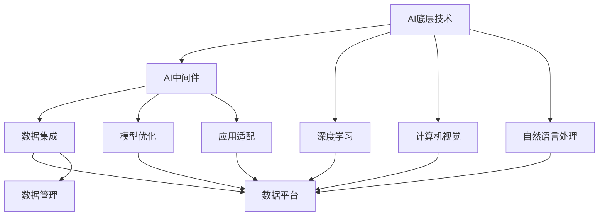
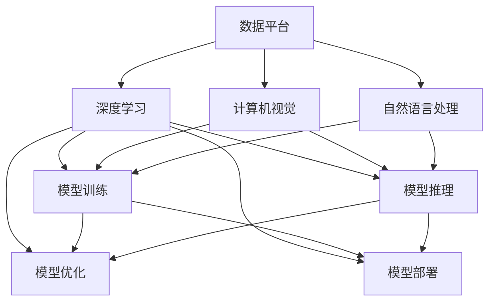

                 

## 1. 背景介绍

### 1.1 问题由来
在当前的技术环境中，AI领域的底层创新体系正面临空前复杂和动态多变的挑战。随着深度学习、计算机视觉、自然语言处理等技术的迅猛发展，AI技术已经渗透到各行各业，从自动驾驶、智能推荐、医疗诊断到金融风控、智慧城市等领域，AI正逐步成为推动各行各业数字化转型的核心驱动力。

然而，AI底层创新体系的构建并不是一件易事。它需要全面整合算法、数据、硬件、应用等多个维度的技术资源，同时还需要在技术研发、产品迭代、市场推广、用户反馈等多个环节中持续优化，才能实现从基础研究到应用落地的无缝衔接。

### 1.2 问题核心关键点
构建AI底层创新体系的核心关键点主要包括以下几点：
- **技术集成**：将多源异构数据、多种算法模型和各类硬件设备有效集成，形成高效协同的技术体系。
- **数据驱动**：以大规模高质量数据为基石，驱动模型训练和优化，提升模型性能。
- **算法创新**：通过算法模型的持续迭代和创新，实现性能和效率的不断提升。
- **应用适配**：针对不同行业和场景，开发适配性强、性能优异的应用解决方案。
- **协同优化**：在技术体系构建过程中，需要各环节协同工作，从需求分析到模型训练，再到系统部署，每个环节都是相互依存的，共同构成一个完整的闭环。

## 2. 核心概念与联系

### 2.1 核心概念概述

为深入理解AI底层创新体系的构建，我们先简要介绍几个核心概念：

- **AI底层技术**：指的是AI系统中最基础的技术组件，包括深度学习算法、计算机视觉、自然语言处理等核心技术，以及数据处理、模型训练、推理部署等工具链。
- **AI中间件**：是连接底层技术与上层应用的桥梁，包括数据集成、模型优化、应用适配等技术，实现技术资源的高效整合和应用场景的灵活适配。
- **AI应用系统**：是指基于底层技术和中间件构建的实际应用系统，如智能推荐、自动驾驶、智能客服等。
- **AI生态系统**：是围绕AI技术构建的整个产业生态，包括技术提供商、应用开发者、行业用户等多方利益相关者。

这些核心概念之间的逻辑关系可以通过以下Mermaid流程图来展示：



这个流程图展示了几类关键技术的相互作用和集成关系，以及如何通过中间件实现技术资源的有效整合，构建完整的AI应用系统。

### 2.2 核心概念原理和架构

在AI底层创新体系的构建中，以下几个核心概念原理和架构尤为重要：

- **深度学习算法**：深度学习算法通过多层神经网络对数据进行复杂非线性拟合，学习数据的抽象特征表示，是AI技术的重要基础。
- **计算机视觉**：计算机视觉通过图像处理、模式识别等技术，实现对视觉数据的理解和处理，广泛应用在图像识别、视频分析、智能监控等领域。
- **自然语言处理**：自然语言处理通过文本处理、语言模型等技术，实现对自然语言的理解和生成，广泛应用在机器翻译、智能客服、语音识别等领域。
- **数据平台**：数据平台通过数据存储、计算、管理等技术，为数据驱动的AI系统提供数据支撑，是AI系统构建的基础设施。
- **中间件技术**：中间件技术通过数据集成、模型优化、应用适配等技术，实现底层技术与上层应用的无缝衔接，提升AI系统的灵活性和扩展性。

这些核心概念在AI底层创新体系中相互依赖，共同构成了一个完整的技术架构，如图：



这个架构图展示了数据、模型、中间件等技术资源如何协同工作，共同构建AI应用系统。

## 3. 核心算法原理 & 具体操作步骤

### 3.1 算法原理概述

构建AI底层创新体系的核心算法原理主要包括深度学习算法、计算机视觉、自然语言处理等技术。这些技术通过模型训练、特征提取、数据增强等手段，从原始数据中学习到复杂的特征表示，用于解决各类AI问题。

以深度学习算法为例，其基本原理是通过多层神经网络对数据进行非线性拟合，学习到数据的抽象特征表示。其核心步骤如下：

1. **数据预处理**：对原始数据进行清洗、归一化、分词、标注等处理，转化为模型可以接受的形式。
2. **模型构建**：选择合适的神经网络结构，并根据任务需求设置网络参数。
3. **模型训练**：使用标注数据对模型进行训练，最小化模型预测与真实标签之间的差异，得到最优模型参数。
4. **模型评估**：使用测试数据对训练好的模型进行评估，计算模型性能指标，如准确率、召回率、F1值等。
5. **模型优化**：根据模型评估结果，对模型参数进行调整，提升模型性能。
6. **模型部署**：将训练好的模型部署到实际应用中，进行推理计算。

### 3.2 算法步骤详解

以下以深度学习算法为例，详细讲解其操作步骤：

#### 3.2.1 数据预处理

数据预处理是深度学习算法中至关重要的一步。其主要包括数据清洗、归一化、分词、标注等操作，将原始数据转化为模型可以接受的形式。

1. **数据清洗**：去除数据中的噪声、缺失值、异常值等，保证数据的质量。
2. **数据归一化**：对数据进行标准化或归一化处理，缩小数据范围，避免数值过大或过小导致的梯度消失或梯度爆炸问题。
3. **分词处理**：将文本数据转换为数字形式，方便模型处理。常用的分词方法包括基于规则的分词、基于统计的分词、基于深度学习的分词等。
4. **标注处理**：对数据进行标注，如将文本分类任务中的文本和标签进行对应。

#### 3.2.2 模型构建

模型构建是深度学习算法的核心步骤。其主要包括以下几个环节：

1. **网络结构设计**：选择合适的神经网络结构，如全连接网络、卷积神经网络、循环神经网络等。
2. **参数设置**：根据任务需求，设置网络参数，如神经元数量、激活函数、优化器等。
3. **损失函数选择**：选择合适的损失函数，如交叉熵损失、均方误差损失等，用于衡量模型预测与真实标签之间的差异。
4. **优化器选择**：选择合适的优化器，如Adam、SGD等，用于更新模型参数，最小化损失函数。

#### 3.2.3 模型训练

模型训练是深度学习算法的核心环节。其主要包括以下几个步骤：

1. **数据批处理**：将数据划分为批次，在每个批次上对模型进行训练。
2. **前向传播**：将输入数据送入模型，计算模型输出。
3. **反向传播**：计算模型输出与真实标签之间的差异，通过反向传播算法计算参数梯度。
4. **参数更新**：根据梯度信息，使用优化器更新模型参数。
5. **迭代训练**：重复以上步骤，直到模型收敛或达到预设轮数。

#### 3.2.4 模型评估

模型评估是深度学习算法的重要环节。其主要包括以下几个步骤：

1. **数据划分为训练集和测试集**：将数据集划分为训练集和测试集，用于模型训练和评估。
2. **模型预测**：使用测试集对模型进行预测，计算模型输出。
3. **损失计算**：计算模型输出与真实标签之间的差异，得到损失值。
4. **性能评估**：根据损失值和测试集标签，计算模型性能指标，如准确率、召回率、F1值等。

#### 3.2.5 模型优化

模型优化是深度学习算法的最后一步。其主要包括以下几个步骤：

1. **参数调整**：根据模型评估结果，调整模型参数，如学习率、网络结构等。
2. **模型融合**：使用集成学习方法，将多个模型进行融合，提升模型性能。
3. **超参数调整**：根据模型评估结果，调整超参数，如学习率、批大小、迭代轮数等。

#### 3.2.6 模型部署

模型部署是将训练好的模型应用于实际应用中的关键环节。其主要包括以下几个步骤：

1. **模型压缩**：对模型进行压缩，减少模型大小和计算量。
2. **模型优化**：对模型进行优化，提高推理速度和资源利用率。
3. **模型部署**：将优化后的模型部署到实际应用中，进行推理计算。
4. **模型监控**：实时监控模型性能，及时调整模型参数，保证模型稳定运行。

### 3.3 算法优缺点

深度学习算法在构建AI底层创新体系中具有以下优点：

1. **高精度**：深度学习算法能够学习到数据的复杂特征表示，具有高精度。
2. **自动化**：深度学习算法能够自动进行特征提取和模型优化，减少人工干预。
3. **通用性**：深度学习算法能够处理多种类型的任务，如图像识别、语音识别、自然语言处理等。

同时，深度学习算法也存在一些缺点：

1. **数据依赖**：深度学习算法需要大量标注数据进行训练，数据获取成本高。
2. **模型复杂**：深度学习模型参数量巨大，训练和推理耗时较长。
3. **过拟合风险**：深度学习算法容易过拟合，需要大量的正则化技术。

## 4. 数学模型和公式 & 详细讲解  
### 4.1 数学模型构建

深度学习算法的主要数学模型包括多层神经网络、反向传播算法、损失函数等。以下以多层神经网络为例，详细讲解其数学模型构建。

假设有一个包含$m$个神经元、$n$个输入特征、$p$个输出的三层神经网络。其输入层到隐层、隐层到输出层的权重分别为$W_1$和$W_2$，隐层的偏置向量为$b_1$，输出层的偏置向量为$b_2$。

设输入数据为$x$，输出数据为$y$，模型输出为$h$。则深度学习算法的数学模型可以表示为：

$$
h = g(z_1) = g(W_1x + b_1)
$$

$$
y = g(z_2) = g(W_2h + b_2)
$$

其中$g$为激活函数，如Sigmoid函数、ReLU函数等。

### 4.2 公式推导过程

以多层神经网络为例，推导其反向传播算法的公式。

设神经网络的前向传播输出为$h_1$，隐层输出为$h$，输出层输出为$y$。则前向传播过程可以表示为：

$$
h_1 = g(z_1) = g(W_1x + b_1)
$$

$$
h = g(z_2) = g(W_2h_1 + b_2)
$$

$$
y = g(z_3) = g(W_3h + b_3)
$$

其中$W_1, W_2, W_3$为网络权重，$b_1, b_2, b_3$为偏置向量。

神经网络的后向传播算法用于计算每个参数的梯度。其公式可以表示为：

$$
\frac{\partial C}{\partial W_3} = \frac{\partial C}{\partial y} \frac{\partial y}{\partial z_3} \frac{\partial z_3}{\partial h}
$$

$$
\frac{\partial C}{\partial W_2} = \frac{\partial C}{\partial y} \frac{\partial y}{\partial z_2} \frac{\partial z_2}{\partial h_1}
$$

$$
\frac{\partial C}{\partial W_1} = \frac{\partial C}{\partial y} \frac{\partial y}{\partial z_1} \frac{\partial z_1}{\partial x}
$$

其中$C$为损失函数，$\frac{\partial y}{\partial z_3}$为输出层的梯度，$\frac{\partial z_3}{\partial h}$为隐层的梯度，以此类推。

### 4.3 案例分析与讲解

以手写数字识别任务为例，展示深度学习算法的应用。

假设有一组手写数字图像，每张图像大小为$28 \times 28$像素，包含10个类别。将图像转换为向量表示，作为输入数据$x$。通过多层神经网络，将图像转换为输出向量$y$，用于表示数字类别。

首先，将图像转换为向量表示，作为输入数据$x$：

$$
x = \begin{bmatrix}
x_1 \\
x_2 \\
\vdots \\
x_{784}
\end{bmatrix}
$$

然后，将$x$送入神经网络中，通过多层神经网络处理后，得到输出向量$y$：

$$
y = g(z_3) = g(W_3h + b_3)
$$

其中$W_3$为输出层权重，$b_3$为输出层偏置向量。

最后，使用损失函数计算模型预测与真实标签之间的差异，通过反向传播算法更新网络参数，最小化损失函数，得到最优模型参数。

## 5. 项目实践：代码实例和详细解释说明

### 5.1 开发环境搭建

在进行深度学习算法项目实践前，我们需要准备好开发环境。以下是使用Python进行PyTorch开发的环境配置流程：

1. 安装Anaconda：从官网下载并安装Anaconda，用于创建独立的Python环境。

2. 创建并激活虚拟环境：
```bash
conda create -n pytorch-env python=3.8 
conda activate pytorch-env
```

3. 安装PyTorch：根据CUDA版本，从官网获取对应的安装命令。例如：
```bash
conda install pytorch torchvision torchaudio cudatoolkit=11.1 -c pytorch -c conda-forge
```

4. 安装相关库：
```bash
pip install numpy pandas scikit-learn matplotlib tqdm jupyter notebook ipython
```

完成上述步骤后，即可在`pytorch-env`环境中开始深度学习算法实践。

### 5.2 源代码详细实现

以下是一个使用PyTorch实现手写数字识别任务的深度学习算法示例代码：

```python
import torch
import torch.nn as nn
import torch.optim as optim
from torchvision import datasets, transforms
from torch.utils.data import DataLoader

# 定义网络结构
class Net(nn.Module):
    def __init__(self):
        super(Net, self).__init__()
        self.fc1 = nn.Linear(784, 500)
        self.fc2 = nn.Linear(500, 10)
    
    def forward(self, x):
        x = x.view(-1, 28 * 28)
        x = torch.relu(self.fc1(x))
        x = torch.softmax(self.fc2(x), dim=1)
        return x

# 定义训练函数
def train(model, device, train_loader, optimizer, epoch):
    model.train()
    for batch_idx, (data, target) in enumerate(train_loader):
        data, target = data.to(device), target.to(device)
        optimizer.zero_grad()
        output = model(data)
        loss = nn.CrossEntropyLoss()(output, target)
        loss.backward()
        optimizer.step()
        if batch_idx % 100 == 0:
            print('Train Epoch: {} [{}/{} ({:.0f}%)]\tLoss: {:.6f}'.format(
                epoch, batch_idx * len(data), len(train_loader.dataset),
                100. * batch_idx / len(train_loader), loss.item()))

# 定义测试函数
def test(model, device, test_loader):
    model.eval()
    test_loss = 0
    correct = 0
    with torch.no_grad():
        for data, target in test_loader:
            data, target = data.to(device), target.to(device)
            output = model(data)
            test_loss += nn.CrossEntropyLoss()(output, target).item()
            pred = output.argmax(dim=1, keepdim=True)
            correct += pred.eq(target.view_as(pred)).sum().item()

    test_loss /= len(test_loader.dataset)
    print('Test set: Average loss: {:.4f}, Accuracy: {}/{} ({:.0f}%)\n'.format(
        test_loss, correct, len(test_loader.dataset),
        100. * correct / len(test_loader.dataset)))

# 加载数据集
train_dataset = datasets.MNIST(root='./data', train=True, transform=transforms.ToTensor(), download=True)
test_dataset = datasets.MNIST(root='./data', train=False, transform=transforms.ToTensor(), download=True)
train_loader = DataLoader(train_dataset, batch_size=64, shuffle=True)
test_loader = DataLoader(test_dataset, batch_size=1000, shuffle=False)

# 定义模型和优化器
device = torch.device('cuda' if torch.cuda.is_available() else 'cpu')
model = Net().to(device)
optimizer = optim.Adam(model.parameters(), lr=0.001)

# 训练模型
for epoch in range(10):
    train(model, device, train_loader, optimizer, epoch)
    test(model, device, test_loader)
```

### 5.3 代码解读与分析

让我们再详细解读一下关键代码的实现细节：

**Net类**：
- `__init__`方法：定义神经网络的结构，包括全连接层和激活函数。
- `forward`方法：实现前向传播，将输入数据通过网络进行计算，得到输出。

**train函数**：
- `train_loader`：使用PyTorch的DataLoader将数据集划分为批次，进行迭代训练。
- `optimizer`：定义优化器，如AdamW、SGD等，用于更新模型参数。
- `loss`：计算模型输出与真实标签之间的差异，得到损失值。
- `loss.backward()`：计算参数梯度。
- `optimizer.step()`：根据梯度信息，使用优化器更新模型参数。

**test函数**：
- `test_loader`：使用PyTorch的DataLoader将测试集划分为批次，进行迭代测试。
- `correct`：计算模型预测与真实标签之间的差异，得到正确预测数量。

**训练流程**：
- 定义总的轮数，开始循环迭代
- 在每个轮数内，先进行训练，输出平均损失和正确率
- 在测试集上评估模型性能，输出测试损失和正确率

可以看到，PyTorch配合深度学习算法，使得深度学习项目的代码实现变得简洁高效。开发者可以将更多精力放在数据处理、模型改进等高层逻辑上，而不必过多关注底层的实现细节。

当然，工业级的系统实现还需考虑更多因素，如模型的保存和部署、超参数的自动搜索、更灵活的任务适配层等。但核心的算法范式基本与此类似。

## 6. 实际应用场景

### 6.1 智能推荐系统

智能推荐系统是深度学习算法的一个重要应用场景。通过分析用户的历史行为数据和当前需求，推荐系统能够智能地推荐用户可能感兴趣的商品、文章、视频等内容。

在技术实现上，可以收集用户浏览、点击、购买等行为数据，提取和用户交互的物品特征，如标题、价格、评分等。将物品特征作为模型输入，用户的后续行为（如是否点击、购买等）作为监督信号，在此基础上训练深度学习模型。训练好的模型能够根据用户的当前需求，生成推荐列表，优化用户体验。

### 6.2 医疗诊断系统

医疗诊断系统是深度学习算法的另一个重要应用场景。通过分析患者的症状和历史数据，诊断系统能够智能地诊断疾病、推荐治疗方案。

在技术实现上，可以收集患者的症状、检查结果、病历等数据，提取和患者健康相关的特征。将特征作为模型输入，医生的诊断结果作为监督信号，在此基础上训练深度学习模型。训练好的模型能够根据患者的当前症状，生成诊断报告和治疗方案，提高医疗诊断的效率和准确性。

### 6.3 智能客服系统

智能客服系统是深度学习算法在自然语言处理领域的应用。通过分析用户的语言描述，客服系统能够智能地回答用户的问题，提供优质的服务体验。

在技术实现上，可以收集用户的咨询记录，将问题-答案对作为监督数据，在此基础上训练深度学习模型。训练好的模型能够根据用户的咨询描述，生成最佳的回复，提高客服系统的自动化水平和用户体验。

### 6.4 未来应用展望

随着深度学习算法的不断进步，其应用场景将更加广泛和深入。未来，深度学习算法将在更多领域得到应用，为各行各业带来新的变革：

- **智慧医疗**：通过深度学习算法，实现对患者健康数据的分析和挖掘，提高诊断和治疗的准确性。
- **自动驾驶**：通过深度学习算法，实现对车辆环境的感知和决策，提高驾驶安全和舒适度。
- **智能家居**：通过深度学习算法，实现对家庭环境的感知和控制，提高家庭生活的智能化水平。
- **金融风控**：通过深度学习算法，实现对金融数据的分析和预测，提高风险管理的效率和准确性。

## 7. 工具和资源推荐

### 7.1 学习资源推荐

为了帮助开发者系统掌握深度学习算法的理论基础和实践技巧，这里推荐一些优质的学习资源：

1. 《深度学习》书籍：Ian Goodfellow等著，全面介绍了深度学习算法的原理和应用。
2. CS231n《Convolutional Neural Networks for Visual Recognition》课程：斯坦福大学开设的计算机视觉课程，有Lecture视频和配套作业，带你入门计算机视觉技术。
3. CS224n《Natural Language Processing with Deep Learning》课程：斯坦福大学开设的自然语言处理课程，有Lecture视频和配套作业，带你入门自然语言处理技术。
4. TensorFlow官方文档：TensorFlow的官方文档，提供了海量深度学习模型的实现代码，是上手实践的必备资料。
5. PyTorch官方文档：PyTorch的官方文档，提供了丰富的深度学习算法和工具，是上手实践的必备资料。

通过对这些资源的学习实践，相信你一定能够快速掌握深度学习算法的精髓，并用于解决实际的AI问题。

### 7.2 开发工具推荐

高效的开发离不开优秀的工具支持。以下是几款用于深度学习算法开发的常用工具：

1. PyTorch：基于Python的开源深度学习框架，灵活动态的计算图，适合快速迭代研究。大部分深度学习模型都有PyTorch版本的实现。
2. TensorFlow：由Google主导开发的开源深度学习框架，生产部署方便，适合大规模工程应用。同样有丰富的深度学习模型资源。
3. Keras：高层次深度学习框架，提供了简单易用的API，适合快速原型开发。
4. JAX：基于NumPy的深度学习框架，支持自动微分和分布式计算，适合高性能计算和研究。
5. Scikit-learn：基于Python的机器学习库，提供了丰富的算法和工具，适合数据处理和特征工程。

合理利用这些工具，可以显著提升深度学习算法项目的开发效率，加快创新迭代的步伐。

### 7.3 相关论文推荐

深度学习算法在AI领域的发展源于学界的持续研究。以下是几篇奠基性的相关论文，推荐阅读：

1. 《ImageNet Classification with Deep Convolutional Neural Networks》：Hinton等，提出使用卷积神经网络进行图像分类任务，刷新了多项NLP任务SOTA。
2. 《Learning Phrases from Pixels》：Denton等，提出使用卷积神经网络进行文本生成任务，展示了深度学习在自然语言处理中的应用。
3. 《Neural Machine Translation by Jointly Learning to Align and Translate》：Sutskever等，提出使用循环神经网络进行机器翻译任务，刷新了机器翻译任务的SOTA。
4. 《Attention is All You Need》：Vaswani等，提出使用Transformer结构进行文本生成任务，展示了深度学习在自然语言处理中的应用。
5. 《A Few Simple Rules for the Emerging NLP Era》：Devlin等，提出使用BERT模型进行文本分类任务，展示了深度学习在自然语言处理中的应用。

这些论文代表了大深度学习算法的进步。通过学习这些前沿成果，可以帮助研究者把握学科前进方向，激发更多的创新灵感。

## 8. 总结：未来发展趋势与挑战

### 8.1 总结

本文对深度学习算法在构建AI底层创新体系中的应用进行了全面系统的介绍。首先阐述了深度学习算法的研究背景和意义，明确了其在AI底层创新体系构建中的核心作用。其次，从原理到实践，详细讲解了深度学习算法的数学原理和关键步骤，给出了深度学习算法项目开发的完整代码实例。同时，本文还广泛探讨了深度学习算法在智能推荐、医疗诊断、智能客服等多个行业领域的应用前景，展示了深度学习算法技术的广泛适用性。

通过本文的系统梳理，可以看到，深度学习算法在AI底层创新体系的构建中发挥了至关重要的作用。其高精度、自动化、通用性等优势，使得深度学习算法在各个应用领域都能发挥出显著的性能优势。未来，随着深度学习算法的不断进步，其在AI底层创新体系的构建中将发挥更加重要的作用，推动AI技术向更深层次发展。

### 8.2 未来发展趋势

展望未来，深度学习算法将呈现以下几个发展趋势：

1. **模型规模持续增大**：随着算力成本的下降和数据规模的扩张，深度学习模型的参数量还将持续增长。超大模型蕴含的丰富知识，有望支撑更加复杂多变的下游任务。
2. **多模态融合**：深度学习算法将与计算机视觉、自然语言处理等多种模态技术结合，实现多模态信息的协同建模，提升模型的泛化能力和鲁棒性。
3. **自监督学习**：深度学习算法将利用无监督学习技术，从非标注数据中学习到更多的知识，降低对标注数据的依赖。
4. **模型压缩和优化**：深度学习算法将不断优化模型结构，压缩模型参数，提高模型的推理速度和资源利用率。
5. **联邦学习**：深度学习算法将利用联邦学习技术，实现跨设备、跨机构的数据共享和模型协作，提升模型的通用性和可解释性。

这些趋势展示了深度学习算法在AI底层创新体系构建中的巨大潜力，预示着深度学习算法技术将迎来更加广泛的应用和深远的影响。

### 8.3 面临的挑战

尽管深度学习算法在AI底层创新体系的构建中具有显著的优势，但在其发展的过程中，也面临诸多挑战：

1. **数据依赖**：深度学习算法需要大量的标注数据进行训练，数据获取成本高，且数据分布的局限性可能导致模型的泛化能力不足。
2. **模型复杂**：深度学习模型的参数量巨大，训练和推理耗时较长，需要大量的计算资源和存储资源。
3. **过拟合风险**：深度学习算法容易过拟合，需要大量的正则化技术，降低模型的泛化能力。
4. **模型解释性**：深度学习算法缺乏可解释性，难以解释模型的内部决策过程，影响模型的可信度和应用范围。
5. **数据隐私和安全**：深度学习算法在应用过程中，需要处理大量的用户数据，数据隐私和安全问题亟需解决。

这些挑战需要深度学习算法研究者在技术、应用、伦理等多个维度上进行持续探索和改进，才能使深度学习算法在AI底层创新体系构建中发挥更大的作用。

### 8.4 研究展望

面对深度学习算法所面临的挑战，未来的研究需要在以下几个方面寻求新的突破：

1. **数据高效利用**：研究如何从非标注数据中高效利用知识，降低对标注数据的依赖，提高深度学习算法的泛化能力。
2. **模型高效压缩**：研究如何优化深度学习算法的模型结构，压缩模型参数，提高模型的推理速度和资源利用率。
3. **模型解释性提升**：研究如何提高深度学习算法的可解释性，解释模型的内部决策过程，提高模型的可信度和应用范围。
4. **隐私和安全保护**：研究如何保护深度学习算法的数据隐私和安全，避免数据泄露和滥用。
5. **跨模态协同建模**：研究如何实现计算机视觉、自然语言处理等多种模态信息的协同建模，提升深度学习算法的泛化能力和鲁棒性。

这些研究方向展示了深度学习算法在未来发展的广阔前景，预示着深度学习算法在AI底层创新体系构建中将发挥更大的作用，推动AI技术向更深层次发展。

## 9. 附录：常见问题与解答

**Q1：深度学习算法在AI底层创新体系中的作用是什么？**

A: 深度学习算法是AI底层创新体系中的核心技术之一。其主要作用包括：
1. **特征提取**：深度学习算法能够学习到数据的复杂特征表示，用于构建高效的数据表示。
2. **模型优化**：深度学习算法能够通过模型训练和优化，提升模型的泛化能力和性能。
3. **任务适配**：深度学习算法能够适配不同的任务和应用场景，提升模型的灵活性和扩展性。
4. **系统集成**：深度学习算法能够与其他技术和工具协同工作，构建完整的AI应用系统。

**Q2：深度学习算法在实际应用中需要注意哪些问题？**

A: 深度学习算法在实际应用中需要注意以下问题：
1. **数据获取**：深度学习算法需要大量的标注数据进行训练，数据获取成本高，且数据分布的局限性可能导致模型的泛化能力不足。
2. **模型复杂**：深度学习模型的参数量巨大，训练和推理耗时较长，需要大量的计算资源和存储资源。
3. **过拟合风险**：深度学习算法容易过拟合，需要大量的正则化技术，降低模型的泛化能力。
4. **模型解释性**：深度学习算法缺乏可解释性，难以解释模型的内部决策过程，影响模型的可信度和应用范围。
5. **数据隐私和安全**：深度学习算法在应用过程中，需要处理大量的用户数据，数据隐私和安全问题亟需解决。

**Q3：如何提高深度学习算法的泛化能力？**

A: 提高深度学习算法的泛化能力，需要从以下几个方面入手：
1. **数据增强**：通过数据增强技术，扩充训练集，提升模型的泛化能力。
2. **正则化技术**：通过正则化技术，如L2正则、Dropout等，避免模型的过拟合。
3. **模型压缩**：通过模型压缩技术，如剪枝、量化等，降低模型复杂度，提高模型的泛化能力。
4. **多模态融合**：通过多模态融合技术，提升模型的泛化能力和鲁棒性。
5. **联邦学习**：通过联邦学习技术，实现跨设备、跨机构的数据共享和模型协作，提高模型的泛化能力和可解释性。

**Q4：如何提升深度学习算法的推理速度和资源利用率？**

A: 提升深度学习算法的推理速度和资源利用率，需要从以下几个方面入手：
1. **模型压缩**：通过模型压缩技术，如剪枝、量化等，降低模型复杂度，提高模型的推理速度和资源利用率。
2. **模型优化**：通过模型优化技术，如动态计算图、模型并行等，提升模型的推理速度和资源利用率。
3. **硬件加速**：通过硬件加速技术，如GPU、TPU等，提升模型的推理速度和资源利用率。
4. **分布式计算**：通过分布式计算技术，实现跨节点的模型推理，提高模型的推理速度和资源利用率。

**Q5：如何提高深度学习算法的可解释性？**

A: 提高深度学习算法的可解释性，需要从以下几个方面入手：
1. **模型解释技术**：通过模型解释技术，如梯度热图、注意力机制等，解释模型的内部决策过程。
2. **可视化技术**：通过可视化技术，如特征可视化、决策可视化等，展示模型的内部机制和决策路径。
3. **规则嵌入**：通过规则嵌入技术，将符号化的先验知识与神经网络模型结合，提升模型的可解释性。
4. **交互式解释**：通过交互式解释技术，如可解释模型API、交互式解释界面等，提高用户对模型的理解和信任。

---

作者：禅与计算机程序设计艺术 / Zen and the Art of Computer Programming

