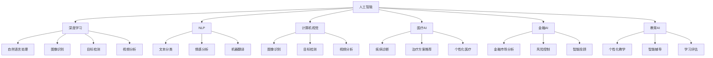

                 

# AI技术在不同领域的应用

> 关键词：人工智能,深度学习,自然语言处理,NLP,机器学习,图像识别,医疗AI,金融AI,教育AI

## 1. 背景介绍

### 1.1 问题由来
随着人工智能技术的迅猛发展，AI技术已经渗透到各个领域，包括自然语言处理（NLP）、计算机视觉、医疗、金融、教育等。这些AI技术的应用，正在改变各行各业的运作方式，提高生产效率，创造新的价值。

AI技术的广泛应用，主要得益于深度学习技术的突破。深度学习模型通过多层神经网络结构，能够从数据中自动学习特征表示，从而实现复杂的模式识别和预测任务。在大规模数据集上预训练深度学习模型，再结合小规模数据进行微调，已成为当前AI应用的主流范式。

本文将系统介绍AI技术在多个领域的应用，探讨其在不同场景下的技术原理和实施策略。通过深入分析，我们希望能为AI技术在不同领域的落地提供有益的参考。

## 2. 核心概念与联系

### 2.1 核心概念概述

为更好地理解AI技术在不同领域的应用，本节将介绍几个密切相关的核心概念：

- 人工智能（AI）：通过模拟人类智能行为，使计算机系统能够自主地执行复杂任务的技术。
- 深度学习（Deep Learning）：一种基于多层神经网络的机器学习技术，通过自动学习特征表示，实现高维数据的有效建模和预测。
- 自然语言处理（NLP）：研究如何使计算机理解和处理人类语言的技术。包括文本分类、情感分析、机器翻译等任务。
- 机器学习（Machine Learning）：通过数据训练模型，使模型能够自动学习特征和模式的技术。
- 计算机视觉（CV）：研究如何使计算机识别和理解视觉数据的领域，包括图像识别、目标检测、视频分析等。
- 医疗AI：通过AI技术在医疗领域的应用，包括疾病诊断、治疗方案推荐、个性化医疗等。
- 金融AI：利用AI技术进行金融市场分析、风险控制、智能投顾等。
- 教育AI：通过AI技术改善教育效果，包括个性化教学、智能辅导、学习评估等。

这些核心概念之间的逻辑关系可以通过以下Mermaid流程图来展示：



这个流程图展示了大语言模型的核心概念及其之间的关系：

1. 人工智能通过深度学习、NLP、计算机视觉等技术，实现各种复杂的智能任务。
2. 深度学习在NLP、计算机视觉、医疗AI、金融AI、教育AI等众多领域中得到广泛应用，成为AI技术的核心驱动力。
3. 各领域的AI应用通过模型微调、迁移学习等方法，实现对通用预训练模型的进一步定制，提升应用效果。
4. AI技术通过集成多个领域的知识，形成更为全面、高效的智能解决方案。

## 3. 核心算法原理 & 具体操作步骤

### 3.1 算法原理概述

AI技术在各个领域的应用，主要依赖于深度学习模型的训练和优化。深度学习模型通常采用多层神经网络结构，通过自动学习特征表示，实现对复杂数据的有效建模和预测。在实际应用中，模型需要在特定任务上进行微调，以适配不同的应用场景。

基于深度学习的AI应用，主要分为以下几个步骤：

1. **数据准备**：收集、标注和处理数据集，供模型训练和评估使用。
2. **模型选择**：选择合适的深度学习模型，如卷积神经网络（CNN）、循环神经网络（RNN）、Transformer等。
3. **模型训练**：使用训练数据集，对模型进行前向传播和反向传播，更新模型参数。
4. **模型评估**：使用测试数据集，评估模型性能，进行必要的调整和优化。
5. **模型部署**：将训练好的模型部署到实际应用系统中，进行实时推理和预测。

### 3.2 算法步骤详解

以自然语言处理（NLP）为例，下面详细介绍基于深度学习的NLP模型的训练和微调过程：

**Step 1: 数据准备**

1. **数据收集**：从互联网上爬取大量的文本数据，作为模型的训练样本。
2. **数据标注**：对收集到的文本进行标注，将其分为训练集、验证集和测试集。标注内容根据任务需求而定，如词性标注、命名实体识别、情感分析等。
3. **数据预处理**：对文本数据进行清洗、分词、去除停用词等预处理操作。

**Step 2: 模型选择**

1. **选择预训练模型**：选择一个通用的预训练语言模型，如BERT、GPT等。
2. **设计任务适配器**：根据具体任务，设计相应的输出层和损失函数。如对于情感分析任务，可以添加输出层和交叉熵损失函数。
3. **模型初始化**：使用预训练模型的权重作为模型初始化参数。

**Step 3: 模型训练**

1. **设置超参数**：如学习率、批大小、迭代轮数等。
2. **前向传播**：将输入数据输入模型，计算模型输出。
3. **计算损失函数**：根据模型输出和真实标签，计算损失函数。
4. **反向传播**：计算损失函数对模型参数的梯度。
5. **参数更新**：使用梯度下降等优化算法，更新模型参数。

**Step 4: 模型评估**

1. **测试集评估**：在测试集上评估模型性能，如准确率、召回率、F1值等。
2. **调整超参数**：根据测试集评估结果，调整超参数，如学习率、批大小等。
3. **模型保存**：保存训练好的模型，以便后续使用。

**Step 5: 模型部署**

1. **模型加载**：在实际应用系统中加载训练好的模型。
2. **数据输入**：将待处理的数据输入模型。
3. **模型推理**：对输入数据进行推理，输出预测结果。

### 3.3 算法优缺点

基于深度学习的AI应用具有以下优点：

1. **高效性**：深度学习模型能够自动学习特征表示，无需人工设计特征，提高建模效率。
2. **泛化能力**：深度学习模型在大规模数据集上进行预训练，能够学习到通用的特征表示，具有较好的泛化能力。
3. **可解释性**：部分深度学习模型具有较好的可解释性，能够提供特征图等可视化信息，帮助理解模型决策过程。

但同时，这些算法也存在一些局限性：

1. **计算资源需求高**：深度学习模型通常需要大量的计算资源进行训练和推理。
2. **模型复杂度高**：深度学习模型结构复杂，容易过拟合，需要进行适当的正则化。
3. **数据依赖性**：深度学习模型对数据质量和标注样本数量要求较高，数据不足时效果不佳。
4. **可解释性不足**：部分深度学习模型难以解释其内部工作机制，导致应用场景中的黑箱问题。

### 3.4 算法应用领域

AI技术在各个领域的应用非常广泛，以下列举了几个典型应用领域：

**医疗AI**：通过AI技术进行疾病诊断、治疗方案推荐、影像识别等，改善医疗服务质量，提高诊疗效率。

**金融AI**：利用AI技术进行金融市场分析、风险控制、智能投顾等，优化投资决策，降低风险。

**教育AI**：通过AI技术实现个性化教学、智能辅导、学习评估等，提升教学效果，促进教育公平。

**自动驾驶**：利用AI技术实现车辆自主导航、路径规划等，提升交通安全和驾驶效率。

**工业智能**：通过AI技术进行工业生产线优化、设备故障预测、质量检测等，提升生产效率，降低成本。

**智能客服**：利用AI技术实现自然语言处理和情感分析，提供智能客服和智能推荐，提升用户体验。

这些AI技术在不同领域的应用，展示了AI技术的强大潜力和广泛应用前景。

## 4. 数学模型和公式 & 详细讲解 & 举例说明

### 4.1 数学模型构建

以自然语言处理（NLP）为例，下面详细介绍基于深度学习的NLP模型的数学模型构建。

**Step 1: 数据表示**

1. **文本表示**：将文本数据转换为数字向量表示，通常使用词嵌入（Word Embedding）技术。
2. **标签表示**：将标注数据转换为数字标签，用于训练模型的监督信号。

**Step 2: 模型构建**

1. **输入层**：将文本向量作为输入，输入层通常为Embedding层。
2. **隐藏层**：通常使用多层神经网络结构，如RNN、LSTM、Transformer等。
3. **输出层**：根据具体任务设计输出层，如分类任务使用Softmax层，回归任务使用线性层。
4. **损失函数**：根据具体任务设计损失函数，如交叉熵损失、均方误差损失等。

**Step 3: 参数更新**

1. **前向传播**：将输入数据输入模型，计算模型输出。
2. **损失函数计算**：根据模型输出和真实标签，计算损失函数。
3. **反向传播**：计算损失函数对模型参数的梯度。
4. **参数更新**：使用梯度下降等优化算法，更新模型参数。

### 4.2 公式推导过程

以情感分析任务为例，下面详细介绍基于深度学习的情感分析模型的公式推导过程。

假设模型输入为文本序列 $x=\{x_1, x_2, \dots, x_n\}$，每个词的向量表示为 $x_i$。模型输出为情感类别 $y$。

**Step 1: 输入表示**

1. **词嵌入**：将每个词 $x_i$ 转换为词向量 $v_i \in \mathbb{R}^d$。
2. **输入层**：将词向量序列 $V=\{v_1, v_2, \dots, v_n\}$ 输入到Embedding层，输出文本向量表示 $X \in \mathbb{R}^{n \times d}$。

**Step 2: 模型构建**

1. **隐藏层**：使用多层神经网络结构，如RNN或Transformer，对文本向量 $X$ 进行处理。
2. **输出层**：使用Softmax层对隐藏层输出进行分类，得到情感类别概率 $P(y|X)$。

**Step 3: 损失函数**

1. **交叉熵损失函数**：定义交叉熵损失函数为：
   $$
   \mathcal{L} = -\frac{1}{n} \sum_{i=1}^n \log P(y_i|X)
   $$

**Step 4: 参数更新**

1. **前向传播**：将文本向量 $X$ 输入到隐藏层，得到隐藏层输出 $H$。
2. **损失函数计算**：根据情感类别 $y$ 计算损失函数 $\mathcal{L}$。
3. **反向传播**：计算损失函数对模型参数的梯度。
4. **参数更新**：使用梯度下降等优化算法，更新模型参数。

### 4.3 案例分析与讲解

以图像分类任务为例，下面详细介绍基于深度学习的图像分类模型的案例分析与讲解。

假设模型输入为图像 $x$，图像像素表示为 $x_i$。模型输出为图像类别 $y$。

**Step 1: 数据准备**

1. **数据收集**：收集大量图像数据，并对其进行标注。
2. **数据预处理**：对图像数据进行预处理，如缩放、归一化等。

**Step 2: 模型选择**

1. **选择预训练模型**：选择一个通用的预训练图像模型，如ResNet、Inception等。
2. **设计任务适配器**：根据具体任务，设计相应的输出层和损失函数。如对于图像分类任务，可以添加输出层和交叉熵损失函数。
3. **模型初始化**：使用预训练模型的权重作为模型初始化参数。

**Step 3: 模型训练**

1. **设置超参数**：如学习率、批大小、迭代轮数等。
2. **前向传播**：将输入图像 $x$ 输入到模型，计算模型输出。
3. **计算损失函数**：根据模型输出和真实标签，计算损失函数。
4. **反向传播**：计算损失函数对模型参数的梯度。
5. **参数更新**：使用梯度下降等优化算法，更新模型参数。

**Step 4: 模型评估**

1. **测试集评估**：在测试集上评估模型性能，如准确率、召回率、F1值等。
2. **调整超参数**：根据测试集评估结果，调整超参数，如学习率、批大小等。
3. **模型保存**：保存训练好的模型，以便后续使用。

**Step 5: 模型部署**

1. **模型加载**：在实际应用系统中加载训练好的模型。
2. **数据输入**：将待处理的数据输入模型。
3. **模型推理**：对输入数据进行推理，输出预测结果。

## 5. 项目实践：代码实例和详细解释说明

### 5.1 开发环境搭建

在进行AI应用开发前，我们需要准备好开发环境。以下是使用Python进行TensorFlow开发的环境配置流程：

1. 安装Anaconda：从官网下载并安装Anaconda，用于创建独立的Python环境。

2. 创建并激活虚拟环境：
```bash
conda create -n tf-env python=3.8 
conda activate tf-env
```

3. 安装TensorFlow：根据CUDA版本，从官网获取对应的安装命令。例如：
```bash
conda install tensorflow tensorflow-cpu -c tf -c conda-forge
```

4. 安装各类工具包：
```bash
pip install numpy pandas scikit-learn matplotlib tqdm jupyter notebook ipython
```

完成上述步骤后，即可在`tf-env`环境中开始AI应用开发。

### 5.2 源代码详细实现

下面我们以图像分类任务为例，给出使用TensorFlow对ResNet模型进行图像分类的PyTorch代码实现。

首先，定义图像分类任务的数据处理函数：

```python
import tensorflow as tf
from tensorflow.keras.datasets import cifar10

(x_train, y_train), (x_test, y_test) = cifar10.load_data()

def preprocess_data(data):
    data = tf.cast(data, tf.float32) / 255.0
    data = tf.reshape(data, [32, 32, 3])
    return data

x_train = preprocess_data(x_train)
x_test = preprocess_data(x_test)
```

然后，定义模型和优化器：

```python
from tensorflow.keras import layers

model = layers.Conv2D(32, (3, 3), activation='relu', padding='same')(tf.keras.Input(shape=(32, 32, 3)))
model = layers.MaxPooling2D((2, 2), strides=(2, 2))(model)
model = layers.Conv2D(64, (3, 3), activation='relu', padding='same')(model)
model = layers.MaxPooling2D((2, 2), strides=(2, 2))(model)
model = layers.Flatten()(model)
model = layers.Dense(10, activation='softmax')(model)

optimizer = tf.keras.optimizers.Adam(learning_rate=0.001)
```

接着，定义训练和评估函数：

```python
def train_model(model, x_train, y_train, x_test, y_test):
    model.compile(optimizer=optimizer, loss='categorical_crossentropy', metrics=['accuracy'])
    model.fit(x_train, y_train, epochs=10, validation_data=(x_test, y_test))
    model.evaluate(x_test, y_test)

train_model(model, x_train, y_train, x_test, y_test)
```

以上就是使用TensorFlow对ResNet模型进行图像分类的完整代码实现。可以看到，得益于TensorFlow的强大封装，我们可以用相对简洁的代码完成图像分类的开发。

### 5.3 代码解读与分析

让我们再详细解读一下关键代码的实现细节：

**数据处理函数preprocess_data**：
- 将输入数据转换为浮点型，并归一化到[0, 1]之间。
- 将图像数据转换为[32, 32, 3]的形状，与ResNet模型输入形状一致。

**模型定义**：
- 使用卷积层和池化层构建卷积神经网络模型，输出层使用softmax层进行分类。
- 优化器使用Adam优化器，学习率设定为0.001。

**训练和评估函数train_model**：
- 使用compile方法定义模型训练的优化器、损失函数和评估指标。
- 使用fit方法进行模型训练，并使用evaluate方法在测试集上进行评估。

**训练流程**：
- 在训练集上进行10轮训练，并在测试集上进行评估。
- 根据评估结果输出训练集的准确率。

可以看到，TensorFlow配合深度学习框架，使得图像分类的代码实现变得简洁高效。开发者可以将更多精力放在数据处理、模型改进等高层逻辑上，而不必过多关注底层的实现细节。

当然，工业级的系统实现还需考虑更多因素，如模型的保存和部署、超参数的自动搜索、更灵活的任务适配层等。但核心的AI应用开发流程基本与此类似。

## 6. 实际应用场景

### 6.1 智能客服系统

基于AI技术的智能客服系统，能够自动处理客户咨询，提升服务效率和客户满意度。具体实现上，可以收集企业内部的历史客服对话记录，构建监督数据集，并在此基础上对预训练语言模型进行微调。微调后的模型能够自动理解用户意图，匹配最合适的答案模板进行回复。对于客户提出的新问题，还可以接入检索系统实时搜索相关内容，动态组织生成回答。如此构建的智能客服系统，能大幅提升客户咨询体验和问题解决效率。

### 6.2 金融舆情监测

金融机构需要实时监测市场舆论动向，以便及时应对负面信息传播，规避金融风险。基于AI技术的文本分类和情感分析技术，为金融舆情监测提供了新的解决方案。具体而言，可以收集金融领域相关的新闻、报道、评论等文本数据，并对其进行主题标注和情感标注。在此基础上对预训练语言模型进行微调，使其能够自动判断文本属于何种主题，情感倾向是正面、中性还是负面。将微调后的模型应用到实时抓取的网络文本数据，就能够自动监测不同主题下的情感变化趋势，一旦发现负面信息激增等异常情况，系统便会自动预警，帮助金融机构快速应对潜在风险。

### 6.3 个性化推荐系统

当前的推荐系统往往只依赖用户的历史行为数据进行物品推荐，无法深入理解用户的真实兴趣偏好。基于AI技术的个性化推荐系统，可以更好地挖掘用户行为背后的语义信息，从而提供更精准、多样的推荐内容。具体而言，可以收集用户浏览、点击、评论、分享等行为数据，提取和用户交互的物品标题、描述、标签等文本内容。将文本内容作为模型输入，用户的后续行为（如是否点击、购买等）作为监督信号，在此基础上微调预训练语言模型。微调后的模型能够从文本内容中准确把握用户的兴趣点。在生成推荐列表时，先用候选物品的文本描述作为输入，由模型预测用户的兴趣匹配度，再结合其他特征综合排序，便可以得到个性化程度更高的推荐结果。

### 6.4 未来应用展望

随着AI技术的不断发展，未来AI技术在各个领域的应用将更加广泛和深入。以下列举了几个未来应用展望：

1. **智能家居**：通过AI技术实现家居设备的智能化控制，如智能音箱、智能门锁等。
2. **工业物联网**：通过AI技术实现工业设备的远程监控和维护，提升生产效率。
3. **智慧城市**：通过AI技术实现城市交通、环境、能源等方面的智能化管理，提升城市管理水平。
4. **农业智能化**：通过AI技术实现农作物识别、病虫害监测、精准农业等，提升农业生产效率。

AI技术的发展将深刻影响各行各业的运作方式，推动社会向智能化、自动化方向发展。未来，AI技术将更加普及，与人类生活和工作方式深度融合，创造更多的价值。

## 7. 工具和资源推荐

### 7.1 学习资源推荐

为了帮助开发者系统掌握AI技术的应用，这里推荐一些优质的学习资源：

1. Coursera《深度学习专项课程》：由斯坦福大学Andrew Ng教授主讲的深度学习课程，系统介绍深度学习的基本概念和算法。
2. Udacity《深度学习纳米学位》：涵盖深度学习算法、计算机视觉、自然语言处理等内容的高级课程。
3. DeepLearning.ai《深度学习基石》：Andrew Ng教授的深度学习课程，适合入门学习者。
4. arXiv论文库：收集了最新、最前沿的AI研究论文，是了解AI技术最新进展的重要来源。
5. GitHub代码库：收集了海量的AI项目代码，适合学习和实践。

通过对这些资源的学习实践，相信你一定能够快速掌握AI技术的精髓，并用于解决实际问题。

### 7.2 开发工具推荐

高效的开发离不开优秀的工具支持。以下是几款用于AI应用开发的常用工具：

1. TensorFlow：由Google主导开发的深度学习框架，支持分布式计算，适合大规模模型训练。
2. PyTorch：由Facebook开发的深度学习框架，支持动态图，适合快速迭代开发。
3. Jupyter Notebook：开源的交互式编程环境，支持代码实时调试和展示，方便开发者记录实验结果。
4. Visual Studio Code：支持AI开发环境的IDE，支持自动补全、代码调试等功能。
5. Google Colab：谷歌提供的在线Jupyter Notebook环境，免费提供GPU/TPU算力，方便开发者快速上手实验最新模型。

合理利用这些工具，可以显著提升AI应用开发的效率，加快创新迭代的步伐。

### 7.3 相关论文推荐

AI技术的发展离不开学界的持续研究。以下是几篇奠基性的相关论文，推荐阅读：

1. AlexNet：ImageNet大规模视觉识别竞赛的冠军模型，引入了卷积神经网络结构，开启了计算机视觉的深度学习时代。
2. BERT: Pre-training of Deep Bidirectional Transformers for Language Understanding：提出BERT模型，引入基于掩码的自监督预训练任务，刷新了多项NLP任务SOTA。
3. Inception：Google提出的卷积神经网络结构，实现了在大规模视觉识别任务上的SOTA性能。
4. GPT-2：OpenAI提出的语言模型，展示了大语言模型在自然语言生成任务上的强大能力。
5. AlphaGo：DeepMind提出的围棋AI，通过深度强化学习，在围棋领域超越了人类顶尖水平。

这些论文代表了大语言模型和深度学习技术的发展脉络。通过学习这些前沿成果，可以帮助研究者把握学科前进方向，激发更多的创新灵感。

## 8. 总结：未来发展趋势与挑战

### 8.1 总结

本文对AI技术在多个领域的应用进行了全面系统的介绍。首先阐述了AI技术的背景和意义，明确了深度学习在AI应用中的核心地位。其次，从原理到实践，详细讲解了深度学习模型的训练和优化过程，给出了具体的代码实例。同时，本文还广泛探讨了AI技术在NLP、计算机视觉、医疗AI、金融AI、教育AI等各个领域的应用，展示了AI技术的强大潜力和广泛应用前景。

通过对这些资源的学习实践，相信你一定能够快速掌握AI技术的精髓，并用于解决实际问题。

### 8.2 未来发展趋势

展望未来，AI技术的发展将呈现以下几个趋势：

1. **深度学习模型的不断演进**：未来的深度学习模型将更加复杂和强大，能够处理更加复杂的任务。
2. **跨领域知识融合**：AI技术将与其他学科的知识进行更深入的融合，如计算机视觉与自然语言处理的结合，提升综合应用效果。
3. **智能设备的普及**：随着智能设备的普及，AI技术将更加深入人类生活的各个方面。
4. **联邦学习和隐私保护**：为了保护用户隐私，未来的AI应用将更多地采用联邦学习和差分隐私等技术，实现分布式训练。
5. **可解释性和透明性**：未来的AI应用将更加注重可解释性和透明性，提高系统可信度和安全性。
6. **人机协同智能**：未来的AI应用将更加注重人机协同，提升系统的智能水平和用户体验。

这些趋势将推动AI技术向更广泛、更深层次的应用方向发展，为各行各业带来新的变革。

### 8.3 面临的挑战

尽管AI技术已经取得了显著进展，但在实际应用中也面临诸多挑战：

1. **数据质量和标注成本**：高质量的数据和标注成本高昂，是AI应用中的主要瓶颈。
2. **模型复杂度和计算资源**：深度学习模型通常结构复杂，对计算资源要求较高。
3. **可解释性和透明性不足**：部分AI模型难以解释其内部工作机制，导致应用场景中的黑箱问题。
4. **隐私和安全问题**：AI应用中存在数据泄露和隐私侵犯的风险，需要采取有效的保护措施。
5. **伦理和社会影响**：AI技术可能带来伦理和社会影响，需要制定相应的规范和标准。

这些挑战需要学界和产业界的共同努力，逐步克服并解决。

### 8.4 研究展望

未来的AI研究需要在以下几个方面进行深入探索：

1. **新算法的研发**：开发新的深度学习算法，提升模型性能和效率。
2. **跨领域应用**：将AI技术应用于更多领域，提升各个行业的智能化水平。
3. **模型压缩和优化**：优化深度学习模型，减少计算资源消耗，提高模型效率。
4. **伦理和安全性**：制定AI技术的伦理规范，确保其应用安全性。
5. **跨学科合作**：与其他学科进行深度合作，推动AI技术的不断突破。

这些研究方向将引领AI技术的发展，推动其应用更加深入和广泛。

## 9. 附录：常见问题与解答

**Q1: 深度学习模型的训练和优化有哪些常见方法？**

A: 深度学习模型的训练和优化方法主要包括：

1. **梯度下降**：常用的优化算法，通过计算损失函数对参数的梯度，更新模型参数。
2. **随机梯度下降**：在每个批次上计算梯度，可以加速模型训练，但可能导致收敛不稳定。
3. **Adam优化器**：结合动量法和自适应学习率，具有较好的收敛速度和稳定性。
4. **学习率调度**：根据训练进展，调整学习率，如学习率衰减、学习率跳跃等。
5. **正则化**：通过L1正则、L2正则、Dropout等方法，避免过拟合。

这些方法需要根据具体任务和数据特点进行灵活组合。

**Q2: 深度学习模型的超参数有哪些？**

A: 深度学习模型的超参数主要包括：

1. **学习率**：控制模型参数更新的步长，影响模型收敛速度和精度。
2. **批大小**：每个批次的样本数，影响模型收敛速度和内存消耗。
3. **迭代轮数**：模型训练的轮数，影响模型的泛化能力和精度。
4. **正则化系数**：控制正则化项的权重，影响模型泛化能力和过拟合风险。
5. **模型结构**：神经网络层数、每层节点数、激活函数等，影响模型复杂度和效果。

这些超参数需要根据具体任务和数据特点进行合理设置。

**Q3: 深度学习模型在实际应用中需要注意哪些问题？**

A: 深度学习模型在实际应用中需要注意以下问题：

1. **数据质量和标注成本**：高质量的数据和标注成本高昂，需要投入大量资源。
2. **模型复杂度和计算资源**：深度学习模型通常结构复杂，对计算资源要求较高。
3. **可解释性和透明性不足**：部分深度学习模型难以解释其内部工作机制，导致应用场景中的黑箱问题。
4. **隐私和安全问题**：AI应用中存在数据泄露和隐私侵犯的风险，需要采取有效的保护措施。
5. **伦理和社会影响**：AI技术可能带来伦理和社会影响，需要制定相应的规范和标准。

这些问题需要学界和产业界的共同努力，逐步解决。

**Q4: 如何提高深度学习模型的泛化能力？**

A: 提高深度学习模型的泛化能力，可以从以下几个方面入手：

1. **数据增强**：通过数据增强技术，扩充训练集，提高模型泛化能力。
2. **正则化**：使用L1正则、L2正则、Dropout等方法，避免过拟合。
3. **提前停止**：在验证集上监测模型性能，一旦性能不再提升，即停止训练，避免过拟合。
4. **模型集成**：通过集成多个模型的预测结果，提升模型的泛化能力。
5. **迁移学习**：使用预训练模型进行迁移学习，提升模型的泛化能力。

这些方法需要根据具体任务和数据特点进行灵活组合。

**Q5: 如何优化深度学习模型的计算效率？**

A: 优化深度学习模型的计算效率，可以从以下几个方面入手：

1. **模型压缩**：通过量化、剪枝、参数共享等方法，减小模型参数量，提升计算效率。
2. **分布式计算**：使用分布式计算框架，加速模型训练和推理。
3. **模型优化器**：选择高效的模型优化器，如Adam、Adagrad等，提高模型训练速度。
4. **硬件加速**：使用GPU、TPU等硬件加速设备，提高模型计算效率。
5. **代码优化**：优化代码实现，减少计算量，提高模型效率。

这些方法需要根据具体任务和数据特点进行灵活组合。

---

作者：禅与计算机程序设计艺术 / Zen and the Art of Computer Programming

