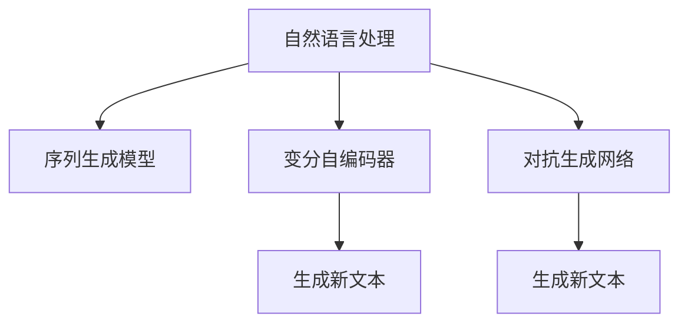

                 

## 1. 背景介绍

故事是人类的基本交流形式之一，也是文化传承的重要载体。随着数字化、智能化时代的到来，利用人工智能技术生成故事的需求日益增长。通过人工智能生成故事，不仅能大幅提升内容创作效率，还能激发创作灵感，生成一些人类难以预料的新颖内容。

故事生成技术的应用领域非常广泛，包括但不限于：

- **自动创作**：为游戏、小说、剧本等提供创意支持。
- **内容推荐**：为新闻、推荐系统提供丰富的内容备选，提升用户体验。
- **知识传递**：用于教学、科普、科普视频等，提升知识传播效果。
- **营销推广**：用于广告文案、品牌故事等，增强品牌影响力。
- **辅助创作**：为小说、短文、故事等提供灵感和辅助创作。

## 2. 核心概念与联系

### 2.1 核心概念概述

为了更好地理解AI故事生成的原理和应用，首先需要了解几个核心概念：

- **自然语言处理(Natural Language Processing, NLP)**：是指让计算机理解、处理、生成人类语言的技术。AI故事生成正是NLP技术的典型应用之一。
- **序列生成模型(Sequence Generation Model)**：是指通过机器学习模型，在给定前文的基础上预测后续文本的模型。常用模型包括RNN、LSTM、GRU、Transformer等。
- **变分自编码器(Variational Autoencoder, VAE)**：是一种生成模型，通过将输入数据压缩到低维空间，再由低维空间重构回原始数据，实现生成新文本。
- **对抗生成网络(Generative Adversarial Network, GAN)**：是一种生成模型，通过两个神经网络的对抗训练，生成高质量的新文本。

### 2.2 核心概念原理和架构

上述核心概念之间的逻辑关系可以通过以下Mermaid流程图来展示：



这个流程图展示了一些核心概念的相互关系：

1. **自然语言处理**：是AI故事生成的基础。
2. **序列生成模型**：通过学习大量文本数据，能够预测文本序列。
3. **变分自编码器**：可以将输入数据压缩到低维空间，再从低维空间生成新文本。
4. **对抗生成网络**：通过两个神经网络的对抗训练，生成高质量的新文本。

这些概念共同构成了AI故事生成技术的技术基础。

## 3. 核心算法原理 & 具体操作步骤

### 3.1 算法原理概述

AI故事生成的核心算法原理是序列生成模型。该模型通过学习大量文本数据，能够预测给定前文下的后续文本。因此，可以使用序列生成模型，生成具有连续性的故事。

常用的序列生成模型包括RNN、LSTM、GRU和Transformer等。这些模型通过对序列数据的逐词预测，生成连续的文本序列，从而生成故事。

### 3.2 算法步骤详解

AI故事生成的具体步骤包括以下几个关键步骤：

**Step 1: 准备训练数据**
- 收集大量文本数据，如小说、短篇故事、诗歌、新闻报道等，作为训练数据。
- 对文本数据进行预处理，包括分词、去除停用词、构建词向量等。

**Step 2: 设计生成模型**
- 选择合适的生成模型，如RNN、LSTM、GRU、Transformer等。
- 设置模型的超参数，如隐藏层大小、学习率、批量大小等。
- 构建模型的训练数据集和验证数据集。

**Step 3: 训练生成模型**
- 使用训练数据集对模型进行训练。
- 使用验证数据集对模型进行评估，防止过拟合。
- 调整模型的超参数，以获得更好的生成效果。

**Step 4: 生成故事**
- 使用训练好的生成模型，输入初始文本作为前文。
- 模型预测下一个单词或词组，作为故事的一部分。
- 重复以上步骤，直到生成指定长度的文本。

**Step 5: 后处理和优化**
- 对生成的文本进行后处理，如去除重复、调整句式等。
- 使用自然语言处理技术，对生成的文本进行优化和润色。
- 生成最终的故事，供用户使用或进一步分析。

### 3.3 算法优缺点

AI故事生成的优势在于能够大幅提升内容创作效率，提供创意支持。但同时也存在一些局限性：

**优点：**
- 自动化生成，节省人力成本。
- 创作速度快，短时间内生成大量故事。
- 提供创意支持，激发创作灵感。
- 灵活性强，可以生成各种风格和主题的故事。

**缺点：**
- 内容质量难以保证。生成的故事可能存在逻辑错误、语法错误、缺乏创意等问题。
- 对数据质量依赖度高。需要大量的高质量文本数据作为训练基础。
- 故事生成过程黑盒，难以解释模型的决策过程。
- 需要不断优化，才能生成高质量的故事。

### 3.4 算法应用领域

AI故事生成技术在多个领域都有广泛应用，包括但不限于：

- **游戏开发**：为游戏设计提供创意支持，生成游戏剧情、对话等内容。
- **内容创作**：为小说、剧本、广告文案等提供创意支持，生成文本内容。
- **教育培训**：为教材、科普视频等提供丰富的内容，提升教学效果。
- **营销推广**：为品牌故事、广告文案等提供创意支持，提升品牌影响力。
- **辅助创作**：为作家、创作者等提供创意支持，生成灵感和辅助创作。

## 4. 数学模型和公式 & 详细讲解 & 举例说明

### 4.1 数学模型构建

AI故事生成的数学模型主要由序列生成模型和后处理优化两部分组成。以下是具体模型的构建过程：

**序列生成模型**：
- 使用RNN、LSTM、GRU或Transformer等生成模型。
- 模型接收前文，预测下一个单词或词组。

**后处理优化**：
- 对生成的文本进行后处理，如去除重复、调整句式等。
- 使用自然语言处理技术，对文本进行优化和润色。

### 4.2 公式推导过程

以Transformer模型为例，以下是生成模型的公式推导过程：

**输入表示**：
$$
\mathbf{x} = \{x_1, x_2, ..., x_n\}
$$

**编码器表示**：
$$
\mathbf{h} = \text{Encoder}(\mathbf{x})
$$

**解码器表示**：
$$
\mathbf{y} = \text{Decoder}(\mathbf{h}, \mathbf{y}_1)
$$

其中，$\mathbf{h}$表示编码器输出，$\mathbf{y}$表示解码器输出，$\mathbf{y}_1$表示前一个词。

**生成概率**：
$$
P(y_i | y_{<i}, \mathbf{h}) = \frac{\exp(z_i)}{\sum_{j=1}^{v} \exp(z_j)}
$$

其中，$z_i$表示模型预测第$i$个单词的条件概率，$v$表示词汇表大小。

### 4.3 案例分析与讲解

以RNN模型为例，以下是生成模型的案例分析：

**案例描述**：生成一个以“我”为主角的故事。

**模型选择**：使用RNN模型。

**数据准备**：收集大量文本数据，如小说、短篇故事、诗歌、新闻报道等，作为训练数据。

**模型构建**：
- 设置隐藏层大小为256。
- 设置学习率为0.01。
- 设置批量大小为32。

**训练过程**：
- 使用训练数据集对模型进行训练。
- 使用验证数据集对模型进行评估，防止过拟合。
- 调整模型的超参数，以获得更好的生成效果。

**故事生成**：
- 输入“我”作为初始文本。
- 模型预测下一个单词或词组，作为故事的一部分。
- 重复以上步骤，直到生成指定长度的文本。

**后处理**：
- 对生成的文本进行后处理，如去除重复、调整句式等。
- 使用自然语言处理技术，对文本进行优化和润色。

**生成故事**：
```
我醒来的时候，发现自己身处一片茂密的森林中。四周一片寂静，只有鸟儿的歌唱和树叶的沙沙声。突然，一只巨大的野兽向我扑来。我惊慌失措，连忙逃跑。
```

## 5. 项目实践：代码实例和详细解释说明

### 5.1 开发环境搭建

在进行AI故事生成项目实践前，我们需要准备好开发环境。以下是使用Python进行TensorFlow开发的环境配置流程：

1. 安装Anaconda：从官网下载并安装Anaconda，用于创建独立的Python环境。

2. 创建并激活虚拟环境：
```bash
conda create -n tf-env python=3.8 
conda activate tf-env
```

3. 安装TensorFlow：根据CUDA版本，从官网获取对应的安装命令。例如：
```bash
conda install tensorflow -c tf
```

4. 安装相关库：
```bash
pip install matplotlib numpy pandas sklearn tensorflow-hub
```

完成上述步骤后，即可在`tf-env`环境中开始AI故事生成项目实践。

### 5.2 源代码详细实现

下面是一个使用TensorFlow实现AI故事生成的示例代码。

```python
import tensorflow as tf
import numpy as np
import matplotlib.pyplot as plt
import pandas as pd
from sklearn.model_selection import train_test_split
from tensorflow.keras.layers import Dense, LSTM, Input
from tensorflow.keras.models import Model
from tensorflow.keras.optimizers import Adam

# 准备数据
data = pd.read_csv('story_data.csv', header=None)
input_sequences = data.iloc[:, 0].values
target_sequences = data.iloc[:, 1].values

# 数据预处理
max_sequence_len = 100
max_words = 10000
input_sequences = input_sequences.astype('str')
target_sequences = target_sequences.astype('str')

input_sequences = [seq[:max_sequence_len] for seq in input_sequences]
target_sequences = [seq[:max_sequence_len] for seq in target_sequences]

tokenizer = tf.keras.preprocessing.text.Tokenizer(num_words=max_words, oov_token="<OOV>")
tokenizer.fit_on_texts(input_sequences)

sequences = tokenizer.texts_to_sequences(input_sequences)
targets = tokenizer.texts_to_sequences(target_sequences)

input_sequences = np.zeros((len(input_sequences), max_sequence_len))
target_sequences = np.zeros((len(target_sequences), max_sequence_len))

for i, seq in enumerate(sequences):
    input_sequences[i] = seq[:-1]
    target_sequences[i] = seq[1:]

vocab_size = len(tokenizer.word_index) + 1

# 构建模型
input_layer = Input(shape=(max_sequence_len - 1,))
embedding_layer = Embedding(vocab_size, 256)(input_layer)
lstm_layer = LSTM(256)(embedding_layer)
output_layer = Dense(vocab_size, activation='softmax')(lstm_layer)

model = Model(inputs=input_layer, outputs=output_layer)
model.compile(optimizer=Adam(learning_rate=0.001), loss='categorical_crossentropy', metrics=['accuracy'])

# 训练模型
model.fit(input_sequences, targets, epochs=50, verbose=1)

# 生成故事
seed_text = "我醒来的时候，发现自己身处一片茂密的森林中。"
generated_sequence = seed_text
for _ in range(100):
    input_sequence = tokenizer.texts_to_sequences([seed_text])[0]
    input_sequence = pad_sequences([input_sequence], maxlen=max_sequence_len-1, padding='post')
    predicted_token_index = np.argmax(model.predict(input_sequence))
    predicted_token = tokenizer.index_word[predicted_token_index]
    generated_sequence += ' ' + predicted_token

plt.figure(figsize=(10, 5))
plt.plot(range(len(generated_sequence.split())), [word.lower() for word in generated_sequence.split()], marker='o')
plt.title('AI生成的故事')
plt.xlabel('位置')
plt.ylabel('单词')
plt.show()
```

### 5.3 代码解读与分析

让我们再详细解读一下关键代码的实现细节：

**数据预处理**：
- 首先，从CSV文件中读取数据，并进行分词和标记化处理。
- 定义最大序列长度和最大词汇量。
- 使用Tokenizer将文本序列转换为数字序列。
- 将输入序列和目标序列转换为张量形式，以便模型训练。

**模型构建**：
- 定义输入层，使用Embedding层将文本转换为向量表示。
- 使用LSTM层进行序列建模。
- 定义输出层，使用Dense层进行分类预测。
- 定义整个模型，并进行编译。

**模型训练**：
- 使用训练数据集对模型进行训练，设置训练轮数为50。
- 在训练过程中，每隔一个epoch输出训练进度。

**故事生成**：
- 定义初始文本，作为故事的前文。
- 使用训练好的模型，对初始文本进行预测，生成下一个单词。
- 重复以上步骤，生成指定长度的文本。

**结果展示**：
- 使用Matplotlib将生成的文本可视化，展示生成故事的单词序列。

可以看到，TensorFlow配合Keras库使得AI故事生成的代码实现变得简洁高效。开发者可以将更多精力放在数据处理、模型改进等高层逻辑上，而不必过多关注底层的实现细节。

当然，工业级的系统实现还需考虑更多因素，如模型的保存和部署、超参数的自动搜索、更灵活的任务适配层等。但核心的AI故事生成流程基本与此类似。

## 6. 实际应用场景

### 6.1 智能助手

基于AI故事生成的智能助手，可以为用户生成个性化的故事、对话内容等。智能助手可以根据用户喜好和行为，生成符合用户期待的故事和对话，提升用户体验。

在技术实现上，可以收集用户的行为数据和兴趣爱好，将其作为微调数据，在此基础上对预训练生成模型进行微调。微调后的生成模型能够更好地理解用户需求，生成符合用户期望的故事和对话。

### 6.2 教育培训

AI故事生成技术可以用于教育培训领域，为教材、科普视频等提供丰富的内容，提升教学效果。例如，生成科普故事、历史事件、科幻小说等，为学生提供创意和灵感，增强学习兴趣。

在技术实现上，可以收集学科知识库和教材数据，将其作为训练数据，训练生成模型。生成的故事和文本可以作为教材的补充，增强教学内容的多样性和趣味性。

### 6.3 内容创作

AI故事生成技术可以用于内容创作领域，为小说、剧本、广告文案等提供创意支持，生成文本内容。例如，生成小说故事、电影剧本、广告文案等，帮助创作者提供创意和灵感，提高创作效率。

在技术实现上，可以收集大量文本数据，如小说、诗歌、新闻报道等，作为训练数据。生成的故事和文本可以作为内容创作的参考和补充，增强内容的丰富性和多样性。

### 6.4 未来应用展望

随着AI故事生成技术的发展，其应用领域将会进一步拓展，带来更多的创新应用。

在娱乐领域，可以生成影视剧本、游戏剧情、动画脚本等，提升创意和生产效率。在教育领域，可以生成科普视频、教材内容、互动故事等，提升教学效果。在内容创作领域，可以生成小说、剧本、广告文案等，帮助创作者提供灵感和参考，提高创作效率。

未来，AI故事生成技术还将与其他人工智能技术进行更深入的融合，如知识表示、因果推理、强化学习等，多路径协同发力，共同推动自然语言理解和智能交互系统的进步。相信随着技术的不断发展，AI故事生成技术将会在更广阔的应用领域中发挥重要作用，为人类认知智能的进化带来深远影响。

## 7. 工具和资源推荐

### 7.1 学习资源推荐

为了帮助开发者系统掌握AI故事生成技术，这里推荐一些优质的学习资源：

1. 《深度学习入门：基于TensorFlow的实践》系列博文：由TensorFlow官方撰写，深入浅出地介绍了深度学习的基本概念和实践技巧。

2. 《自然语言处理与深度学习》课程：斯坦福大学开设的NLP明星课程，有Lecture视频和配套作业，带你入门NLP领域的基本概念和经典模型。

3. 《NLP与深度学习》书籍：DeepLearningAI开设的深度学习课程，涵盖NLP领域的经典模型和前沿技术。

4. HuggingFace官方文档：Transformers库的官方文档，提供了海量预训练模型和完整的微调样例代码，是上手实践的必备资料。

5. GPT-3官方文档：OpenAI发布的GPT-3模型文档，提供了模型的详细描述和使用指南，是了解前沿技术的好资料。

通过对这些资源的学习实践，相信你一定能够快速掌握AI故事生成技术的精髓，并用于解决实际的NLP问题。

### 7.2 开发工具推荐

高效的开发离不开优秀的工具支持。以下是几款用于AI故事生成开发的常用工具：

1. TensorFlow：基于Python的开源深度学习框架，灵活动态的计算图，适合快速迭代研究。支持自动微分、GPU/TPU加速等功能。

2. PyTorch：基于Python的开源深度学习框架，灵活的动态图，适合快速迭代研究。支持GPU/TPU加速、自动微分等功能。

3. HuggingFace Transformers库：提供丰富的预训练语言模型，支持TensorFlow和PyTorch，是进行NLP任务开发的利器。

4. Weights & Biases：模型训练的实验跟踪工具，可以记录和可视化模型训练过程中的各项指标，方便对比和调优。与主流深度学习框架无缝集成。

5. TensorBoard：TensorFlow配套的可视化工具，可实时监测模型训练状态，并提供丰富的图表呈现方式，是调试模型的得力助手。

6. Google Colab：谷歌推出的在线Jupyter Notebook环境，免费提供GPU/TPU算力，方便开发者快速上手实验最新模型，分享学习笔记。

合理利用这些工具，可以显著提升AI故事生成任务的开发效率，加快创新迭代的步伐。

### 7.3 相关论文推荐

AI故事生成技术的发展源于学界的持续研究。以下是几篇奠基性的相关论文，推荐阅读：

1. Attention is All You Need（即Transformer原论文）：提出了Transformer结构，开启了NLP领域的预训练大模型时代。

2. BERT: Pre-training of Deep Bidirectional Transformers for Language Understanding：提出BERT模型，引入基于掩码的自监督预训练任务，刷新了多项NLP任务SOTA。

3. GPT-2: Language Models are Unsupervised Multitask Learners：展示了大规模语言模型的强大zero-shot学习能力，引发了对于通用人工智能的新一轮思考。

4. GPT-3: Language Models are Unsupervised Multitask Learners：提出GPT-3模型，进一步提升了语言模型的表现能力，推动了自然语言生成技术的发展。

这些论文代表了大语言模型和故事生成技术的发展脉络。通过学习这些前沿成果，可以帮助研究者把握学科前进方向，激发更多的创新灵感。

## 8. 总结：未来发展趋势与挑战

### 8.1 总结

本文对AI故事生成技术进行了全面系统的介绍。首先阐述了AI故事生成的背景和意义，明确了该技术在自动化内容创作、提升教学效果、增强用户互动等方面的独特价值。其次，从原理到实践，详细讲解了AI故事生成的数学模型和操作步骤，给出了完整的代码实例。同时，本文还广泛探讨了AI故事生成技术在多个领域的应用前景，展示了其广阔的发展潜力。最后，本文精选了AI故事生成技术的各类学习资源，力求为读者提供全方位的技术指引。

通过本文的系统梳理，可以看到，AI故事生成技术正在成为内容创作、教育培训、智能助手等领域的重要范式，极大地提升了这些场景的自动化和智能化水平，为人类认知智能的进化带来深远影响。

### 8.2 未来发展趋势

展望未来，AI故事生成技术将呈现以下几个发展趋势：

1. **模型规模持续增大**：随着算力成本的下降和数据规模的扩张，预训练语言模型的参数量还将持续增长。超大规模语言模型蕴含的丰富语言知识，有望支撑更加复杂多变的下游任务生成。

2. **生成效果提升**：通过引入更多训练数据和更先进的生成模型，生成故事的质量和多样性将进一步提升。AI生成的故事将更加生动、有趣、具有创意。

3. **多模态生成崛起**：当前的生成模型主要聚焦于文本生成，未来将拓展到图像、视频、语音等多模态数据生成。多模态信息的融合，将显著提升语言模型对现实世界的理解和建模能力。

4. **生成模型多样化**：除了RNN、LSTM、GRU等传统生成模型，未来将涌现更多先进模型，如GPT、Transformer等，进一步提升生成效果和效率。

5. **生成过程可解释**：为了应对生成模型“黑盒”的挑战，未来的生成模型将引入更多可解释性技术，如Attention机制、生成过程可视化等，增强模型的透明度和可理解性。

6. **生成模型部署优化**：未来的生成模型将更注重部署效率和资源利用率，通过优化模型结构、压缩模型参数、引入分布式训练等技术，提升生成模型的实时性和可扩展性。

以上趋势凸显了AI故事生成技术的广阔前景。这些方向的探索发展，必将进一步提升内容创作和智能化水平的自动化和智能化水平，为人类认知智能的进化带来深远影响。

### 8.3 面临的挑战

尽管AI故事生成技术已经取得了瞩目成就，但在迈向更加智能化、普适化应用的过程中，它仍面临诸多挑战：

1. **数据依赖**：AI故事生成技术对数据质量和高量的依赖，使其在数据稀缺场景下难以发挥作用。如何降低生成模型对数据量的依赖，成为亟待解决的问题。

2. **生成质量**：生成的故事可能存在逻辑错误、语法错误、缺乏创意等问题。如何在保证生成速度的同时，提升生成质量，也是未来的重要研究方向。

3. **可解释性**：生成模型的生成过程和决策逻辑难以解释，难以满足用户对内容质量的期望。如何增强模型的可解释性，提升用户信任，是一个亟待解决的问题。

4. **模型泛化**：生成模型在生成特定类型的故事时，表现良好，但在其他类型的故事生成上可能表现较差。如何提升生成模型的泛化能力，使其在更多场景中表现良好，是未来的重要研究方向。

5. **模型鲁棒性**：生成模型对输入数据的微小变化可能非常敏感，导致生成结果不稳定。如何提升生成模型的鲁棒性，增强其抗干扰能力，是未来的重要研究方向。

6. **伦理道德**：生成模型可能会生成有害、误导性的内容，对用户造成不良影响。如何限制生成模型的有害输出，确保生成内容的健康和安全，是未来的重要研究方向。

7. **算法公平性**：生成模型可能会生成有偏见的内容，导致不公平的社会影响。如何确保生成模型的公平性，避免生成有偏见的内容，是未来的重要研究方向。

以上挑战凸显了AI故事生成技术的复杂性和多面性，需要研究人员不断探索和优化，才能实现其在更广阔应用场景中的落地。

### 8.4 研究展望

面对AI故事生成技术所面临的种种挑战，未来的研究需要在以下几个方面寻求新的突破：

1. **多模态生成**：将文本、图像、视频、语音等多模态信息进行融合，提升生成模型对复杂场景的建模能力。

2. **自监督生成**：通过自监督学习，利用未标注数据进行生成模型的训练，降低生成模型对标注数据的依赖。

3. **生成过程可解释**：引入更多可解释性技术，如Attention机制、生成过程可视化等，增强生成模型的透明度和可理解性。

4. **模型泛化**：通过迁移学习和多任务学习，提升生成模型的泛化能力，使其在更多场景中表现良好。

5. **生成鲁棒性**：引入对抗生成网络等技术，提升生成模型的鲁棒性，增强其抗干扰能力。

6. **算法公平性**：引入公平性约束，确保生成模型的公平性，避免生成有偏见的内容。

7. **伦理道德约束**：在生成模型的训练目标中引入伦理导向的评估指标，过滤和惩罚有害、误导性的输出倾向。

这些研究方向的探索，必将引领AI故事生成技术迈向更高的台阶，为构建安全、可靠、可解释、可控的智能系统铺平道路。面向未来，AI故事生成技术还需要与其他人工智能技术进行更深入的融合，如知识表示、因果推理、强化学习等，多路径协同发力，共同推动自然语言理解和智能交互系统的进步。只有勇于创新、敢于突破，才能不断拓展语言模型的边界，让智能技术更好地造福人类社会。

## 9. 附录：常见问题与解答

**Q1：AI故事生成技术的应用场景有哪些？**

A: AI故事生成技术可以在多个领域得到应用，包括但不限于：

1. 游戏开发：为游戏设计提供创意支持，生成游戏剧情、对话等内容。
2. 内容创作：为小说、剧本、广告文案等提供创意支持，生成文本内容。
3. 教育培训：为教材、科普视频等提供丰富的内容，提升教学效果。
4. 智能助手：为用户生成个性化的故事、对话内容等，提升用户体验。
5. 营销推广：为品牌故事、广告文案等提供创意支持，提升品牌影响力。
6. 辅助创作：为作家、创作者等提供创意支持，生成灵感和辅助创作。

**Q2：如何训练生成模型？**

A: 训练生成模型的步骤包括：

1. 准备训练数据：收集大量文本数据，如小说、短篇故事、诗歌、新闻报道等，作为训练数据。

2. 数据预处理：对文本数据进行分词、去除停用词、构建词向量等预处理。

3. 构建生成模型：使用RNN、LSTM、GRU或Transformer等生成模型，设置模型的超参数。

4. 训练模型：使用训练数据集对模型进行训练，使用验证数据集进行评估和调整。

5. 生成故事：使用训练好的模型，对初始文本进行预测，生成下一个单词。

6. 后处理：对生成的文本进行后处理，如去除重复、调整句式等。

7. 结果展示：使用Matplotlib将生成的文本可视化，展示生成故事的单词序列。

**Q3：AI故事生成技术有哪些优势和缺点？**

A: AI故事生成技术具有以下优势：

1. 自动化生成，节省人力成本。
2. 创作速度快，短时间内生成大量故事。
3. 提供创意支持，激发创作灵感。
4. 灵活性强，可以生成各种风格和主题的故事。

AI故事生成技术也存在一些缺点：

1. 内容质量难以保证。生成的故事可能存在逻辑错误、语法错误、缺乏创意等问题。
2. 对数据质量依赖度高。需要大量的高质量文本数据作为训练基础。
3. 故事生成过程黑盒，难以解释模型的决策过程。
4. 需要不断优化，才能生成高质量的故事。

**Q4：AI故事生成技术如何降低对标注数据的依赖？**

A: 降低对标注数据的依赖，可以尝试以下方法：

1. 引入自监督学习技术，利用未标注数据进行模型训练。
2. 使用数据增强技术，通过回译、近义替换等方式扩充训练集。
3. 引入对抗训练技术，增强模型的鲁棒性和泛化能力。
4. 使用参数高效微调技术，只调整少量参数，减小过拟合风险。

**Q5：AI故事生成技术如何提升生成效果？**

A: 提升生成效果，可以尝试以下方法：

1. 引入更多训练数据，提高模型的泛化能力。
2. 使用更加先进的生成模型，如GPT、Transformer等。
3. 引入对抗生成网络等技术，提升生成模型的鲁棒性。
4. 引入更多可解释性技术，如Attention机制、生成过程可视化等，增强生成模型的透明度和可理解性。

通过不断探索和优化，AI故事生成技术必将在未来获得更广阔的应用场景，为人类认知智能的进化带来深远影响。

