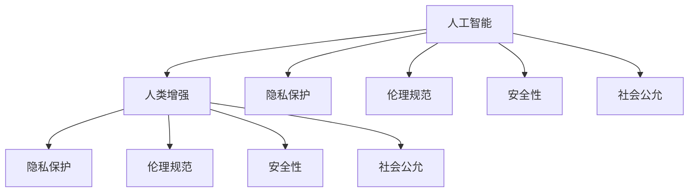

                 

# AI时代的人类增强：道德考虑与身体增强的未来发展策略分析

## 1. 背景介绍

随着人工智能(AI)技术的飞速发展，它正在成为人类增强的主要手段之一。AI不仅可以提高工作效率，改善生活质量，还能帮助人们克服身体和认知的局限。然而，AI时代的人类增强也带来了诸多道德和伦理问题。本文将探讨AI技术如何改变人类，并提出应对这些问题的未来发展策略。

### 1.1 人类增强概述

人类增强主要是指通过技术手段提高人类在体力、智力、感知等方面的能力，以更好地应对复杂多变的挑战。AI技术在这方面展示了巨大的潜力，主要通过以下方式实现人类增强：

- **身体增强**：通过机器人、仿生装置等技术，提高人类的体力、灵活性、耐力等。
- **认知增强**：通过AI辅助诊断、信息检索、决策支持等技术，提升人类的学习、决策、记忆等能力。
- **感知增强**：通过增强现实(AR)、虚拟现实(VR)、智能穿戴设备等技术，增强人类的视觉、听觉、触觉等感官体验。

### 1.2 道德与伦理问题

尽管AI技术在人类增强方面展现了巨大潜力，但其带来的道德和伦理问题也愈发凸显：

- **隐私侵犯**：大量个人信息被收集、存储和分析，可能被滥用或泄露，侵犯隐私权。
- **技术依赖**：过度依赖技术可能削弱人类自身的能力，降低对环境和变化的适应性。
- **伦理风险**：AI技术可能带有偏见、歧视，甚至被用于不道德目的，如网络攻击、欺诈等。
- **安全风险**：技术故障、恶意攻击可能导致人身安全受到威胁。
- **社会不公**：AI技术的普及可能导致资源不均，加剧社会不平等。

## 2. 核心概念与联系

### 2.1 核心概念概述

为更好地理解AI时代的人类增强及其道德伦理问题，本节将介绍几个核心概念及其相互关系：

- **人工智能**：以计算机算法和计算模型为代表的技术手段，模拟、延伸和扩展人类的智能。
- **人类增强**：通过AI技术提高人类在体力、智力、感知等方面的能力，增强人类适应环境和应对复杂问题的能力。
- **隐私保护**：保护个人信息不被未经授权的访问、使用或泄露，保障个人隐私权。
- **伦理规范**：指导AI技术开发、应用和治理的道德标准，包括公平、透明、责任等原则。
- **安全性**：保障AI系统免受攻击、故障和人为错误，保护用户和系统的安全。
- **社会公允**：通过公平分配AI技术带来的收益和机会，缩小社会不平等，促进社会公平。

这些核心概念之间的逻辑关系可以通过以下Mermaid流程图来展示：



这个流程图展示了这个系统的核心概念及其之间的关系：

1. AI技术为人类增强提供支持，带来了隐私保护、伦理规范、安全性和社会公允等道德伦理问题。
2. 隐私保护、伦理规范、安全性和社会公允是保障AI技术健康发展的重要因素。
3. AI技术通过各种应用场景实现人类增强，并同时面临这些道德伦理问题。

## 3. 核心算法原理 & 具体操作步骤

### 3.1 算法原理概述

AI时代的人类增强涉及多个领域，包括机器学习、计算机视觉、自然语言处理等。以下是核心算法的概述：

- **机器学习算法**：通过数据训练模型，使其能够根据输入预测输出，广泛应用于认知增强和感知增强。
- **计算机视觉算法**：用于图像和视频处理，如识别、跟踪和增强现实，支持身体增强和感知增强。
- **自然语言处理算法**：用于文本信息处理，如语音识别、翻译、信息检索，支持认知增强和感知增强。

### 3.2 算法步骤详解

AI时代的人类增强涉及多个步骤，包括数据收集、模型训练、应用部署等。以下是详细的操作步骤：

**Step 1: 数据收集**
- 收集人类增强应用场景所需的数据，如人体姿态、语音信号、生物信号等。
- 确保数据的隐私和伦理合规，避免侵犯个人隐私。

**Step 2: 模型训练**
- 选择合适的算法和模型，如卷积神经网络(CNN)、循环神经网络(RNN)、注意力机制等。
- 训练模型，使其能够准确预测和生成输出。
- 使用合适的优化器和损失函数，调整模型参数。

**Step 3: 应用部署**
- 将训练好的模型部署到实际应用场景中，如智能穿戴设备、机器人、增强现实系统等。
- 通过API接口、交互界面等，与用户进行交互。

**Step 4: 持续优化**
- 收集用户反馈和系统数据，评估模型的性能和效果。
- 根据反馈和数据，不断优化模型和算法，提升用户体验。

### 3.3 算法优缺点

AI时代的人类增强技术具有以下优点：
- **高效性**：通过AI算法，能够在短时间内处理大量数据，提供快速响应。
- **普适性**：AI技术可以应用于多种场景，满足不同用户的需求。
- **可扩展性**：AI算法可以不断迭代和优化，支持功能扩展和新应用。

但这些技术也存在一些缺点：
- **依赖数据**：需要大量的高质量数据进行训练，数据采集和标注成本高。
- **技术复杂性**：AI技术开发和维护需要专业知识，开发周期长。
- **伦理风险**：AI技术可能带有偏见，存在伦理和道德风险。
- **安全性风险**：系统可能受到攻击和故障，存在安全隐患。

### 3.4 算法应用领域

AI技术在人类增强中的应用领域非常广泛，以下是几个主要领域：

- **医疗**：AI辅助诊断、智能监测、远程医疗等，提高医疗服务的效率和质量。
- **教育**：个性化学习、智能辅导、教育游戏等，提升学习效果和体验。
- **运动**：智能健身、康复训练、运动监测等，帮助人们保持健康和提高体能。
- **娱乐**：虚拟现实、增强现实、游戏等，提升娱乐体验和社交互动。
- **交通**：自动驾驶、智能导航、智慧城市等，提高交通效率和安全性。

## 4. 数学模型和公式 & 详细讲解 & 举例说明

### 4.1 数学模型构建

本节将使用数学语言对AI时代的人类增强系统进行更加严格的刻画。

假设有一个基于计算机视觉的增强现实系统，用于提升用户的感知体验。系统输入为用户的眼睛图像，输出为增强后的虚拟图像。可以构建以下数学模型：

设输入图像为 $x \in \mathbb{R}^n$，输出图像为 $y \in \mathbb{R}^m$。则系统可以表示为：

$$
y = f(x; \theta)
$$

其中 $f$ 为增强函数， $\theta$ 为模型参数，通过训练得到。

### 4.2 公式推导过程

在增强现实系统中，可以采用卷积神经网络(CNN)来实现增强功能。CNN由多个卷积层、池化层和全连接层组成，可以自动提取输入图像的特征，并生成输出图像。

设输入图像大小为 $H \times W \times C$，输出图像大小为 $H' \times W' \times C'$。则CNN模型可以表示为：

$$
y = f(x; \theta) = h^{L} \circ h^{L-1} \circ \cdots \circ h^1(x; \theta)
$$

其中 $h^l$ 为第 $l$ 层的卷积和激活函数。

以第 $l$ 层为例，设输入特征图大小为 $H_{l-1} \times W_{l-1} \times C_{l-1}$，卷积核大小为 $k \times k$，步长为 $s$。则卷积运算可以表示为：

$$
f^{(l)}(x) = \max\limits_{k} \sum_{i,j} \max\limits_{c} w^{(l)}_{k,c} * x^{(l-1)}(i,j,c)
$$

其中 $*$ 表示卷积运算，$w^{(l)}_{k,c}$ 为卷积核权重。

### 4.3 案例分析与讲解

下面以智能健身系统为例，分析AI增强人类增强的具体应用。

**智能健身系统**：

- **数据收集**：通过智能穿戴设备收集用户的运动数据，如步数、心率、姿势等。
- **模型训练**：使用CNN等算法训练模型，预测用户运动状态和心率变化。
- **应用部署**：通过手机APP或智能穿戴设备，向用户提供个性化的运动建议和健康监测。
- **持续优化**：根据用户反馈，不断优化模型和算法，提升系统性能。

## 5. 项目实践：代码实例和详细解释说明

### 5.1 开发环境搭建

在进行AI增强项目开发前，需要准备好开发环境。以下是使用Python进行TensorFlow开发的环境配置流程：

1. 安装Anaconda：从官网下载并安装Anaconda，用于创建独立的Python环境。

2. 创建并激活虚拟环境：
```bash
conda create -n tf-env python=3.8 
conda activate tf-env
```

3. 安装TensorFlow：根据CUDA版本，从官网获取对应的安装命令。例如：
```bash
conda install tensorflow -c conda-forge
```

4. 安装相关库：
```bash
pip install numpy pandas matplotlib scikit-learn
```

5. 安装GPU驱动和CUDA工具包：
```bash
conda install -c conda-forge nvidia-cuda-11.1 libnccl-gpu cudatoolkit=11.1
```

6. 安装GPU版TensorFlow：
```bash
pip install tensorflow-gpu
```

完成上述步骤后，即可在`tf-env`环境中开始项目开发。

### 5.2 源代码详细实现

下面以智能健身系统为例，给出使用TensorFlow进行模型开发的代码实现。

```python
import tensorflow as tf
from tensorflow.keras.layers import Conv2D, MaxPooling2D, Flatten, Dense, Dropout
from tensorflow.keras.models import Sequential
from tensorflow.keras.optimizers import Adam

# 构建模型
model = Sequential()
model.add(Conv2D(32, kernel_size=(3, 3), activation='relu', input_shape=(None, None, 3)))
model.add(MaxPooling2D(pool_size=(2, 2)))
model.add(Conv2D(64, kernel_size=(3, 3), activation='relu'))
model.add(MaxPooling2D(pool_size=(2, 2)))
model.add(Flatten())
model.add(Dense(128, activation='relu'))
model.add(Dropout(0.5))
model.add(Dense(1, activation='sigmoid'))

# 编译模型
model.compile(optimizer=Adam(learning_rate=0.001),
              loss='binary_crossentropy',
              metrics=['accuracy'])

# 训练模型
model.fit(X_train, y_train, epochs=10, validation_data=(X_val, y_val))

# 评估模型
model.evaluate(X_test, y_test)
```

### 5.3 代码解读与分析

让我们再详细解读一下关键代码的实现细节：

**模型构建**：
- 使用Keras API构建卷积神经网络模型，包括卷积层、池化层、全连接层和Dropout层。
- 使用Conv2D和MaxPooling2D层实现卷积和池化操作，提取输入图像的特征。
- 使用Dense层和Dropout层进行全连接和正则化，输出预测结果。

**模型编译**：
- 使用Adam优化器和二元交叉熵损失函数，进行模型编译。
- 设置学习率为0.001，训练10个epoch。

**模型训练**：
- 使用fit方法进行模型训练，传入训练数据和验证数据。

**模型评估**：
- 使用evaluate方法评估模型在测试数据上的性能，输出准确率和损失值。

## 6. 实际应用场景

### 6.1 医疗应用

在医疗领域，AI增强技术可以显著提高诊断和治疗的准确性和效率。例如：

- **影像增强**：使用AI算法对医学影像进行增强和分析，如X光、CT、MRI等，提高疾病诊断的准确性。
- **智能诊断**：通过深度学习算法训练模型，自动分析患者的病历和影像数据，提供诊断建议和治疗方案。
- **远程医疗**：利用AI技术进行远程医疗咨询，实现医生和患者的远程互动和病情监测。

### 6.2 教育应用

在教育领域，AI增强技术可以提供个性化的学习体验和智能辅导。例如：

- **个性化学习**：根据学生的学习进度和偏好，提供个性化的学习材料和课程推荐。
- **智能辅导**：通过AI技术进行作业批改、解题指导、语言纠正等，提升学习效果。
- **虚拟教师**：利用自然语言处理和计算机视觉技术，构建虚拟教师，提供互动式学习体验。

### 6.3 运动应用

在运动领域，AI增强技术可以提供智能健身和康复训练。例如：

- **智能健身**：通过智能穿戴设备收集运动数据，分析用户的健康状态，提供个性化的运动建议和健身计划。
- **康复训练**：利用AI技术进行运动姿势纠正和康复效果评估，提升康复训练的效果和效率。
- **运动监测**：通过AI算法分析运动数据，监测用户的运动状态和健康指标，预防运动损伤。

### 6.4 娱乐应用

在娱乐领域，AI增强技术可以提供沉浸式的娱乐体验和社交互动。例如：

- **虚拟现实**：利用增强现实技术，构建虚拟现实场景，提供沉浸式的游戏和互动体验。
- **增强现实**：通过智能穿戴设备，提供增强现实的导航和信息提示，提升用户的感知体验。
- **智能游戏**：利用AI算法，实现游戏角色的智能化和互动化，提供更丰富的游戏体验。

## 7. 工具和资源推荐

### 7.1 学习资源推荐

为了帮助开发者系统掌握AI技术及其在人类增强中的应用，这里推荐一些优质的学习资源：

1. **TensorFlow官方文档**：提供了TensorFlow的全面介绍和详细使用指南，是学习TensorFlow的必备资料。

2. **Deep Learning Specialization课程**：由Andrew Ng教授开设的Coursera课程，涵盖深度学习的基本概念和核心算法。

3. **PyTorch官方文档**：提供了PyTorch的全面介绍和详细使用指南，是学习PyTorch的必备资料。

4. **Kaggle数据竞赛**：通过参加数据竞赛，提升数据处理和机器学习的能力，积累实战经验。

5. **AI博客和论坛**：如Towards Data Science、KDnuggets、Reddit等，可以获取最新的AI技术和应用案例，学习他人经验。

通过这些资源的学习实践，相信你一定能够快速掌握AI技术及其在人类增强中的应用，并用于解决实际的AI问题。

### 7.2 开发工具推荐

高效的开发离不开优秀的工具支持。以下是几款用于AI开发和人类增强开发的常用工具：

1. **PyTorch**：基于Python的开源深度学习框架，灵活动态的计算图，适合快速迭代研究。

2. **TensorFlow**：由Google主导开发的开源深度学习框架，生产部署方便，适合大规模工程应用。

3. **Keras**：基于TensorFlow的高级API，提供简单易用的接口，适合快速构建和训练模型。

4. **PyTorch Lightning**：封装了PyTorch的模型构建、训练和部署过程，简化开发流程。

5. **Jupyter Notebook**：轻量级的开发环境，支持代码编写、数据处理和结果展示。

6. **Google Colab**：谷歌提供的在线Jupyter Notebook环境，免费提供GPU/TPU算力，方便开发者快速上手实验。

合理利用这些工具，可以显著提升AI开发和人类增强开发的效率，加快创新迭代的步伐。

### 7.3 相关论文推荐

AI技术和人类增强领域的研究成果丰硕，以下是几篇奠基性的相关论文，推荐阅读：

1. **ImageNet分类挑战赛**：由DeepMind提出的图像识别算法，通过多层次卷积神经网络，提升了图像分类的准确率。

2. **AlphaGo**：DeepMind开发的围棋人工智能，通过深度强化学习算法，战胜了世界围棋冠军。

3. **BERT预训练模型**：Google开发的自然语言处理模型，通过大规模语料预训练，提升了文本处理的性能。

4. **GPT-3语言模型**：OpenAI发布的自然语言处理模型，通过大规模预训练和微调，提升了语言理解和生成的能力。

这些论文代表了大规模AI技术的发展脉络。通过学习这些前沿成果，可以帮助研究者把握学科前进方向，激发更多的创新灵感。

## 8. 总结：未来发展趋势与挑战

### 8.1 研究成果总结

本文对AI时代的人类增强及其道德伦理问题进行了全面系统的介绍。首先阐述了AI技术在人类增强中的应用前景，明确了AI技术在提升人类体力、智力、感知等方面的潜力。其次，从原理到实践，详细讲解了AI技术的核心算法和操作步骤，给出了具体的代码实现。同时，本文还探讨了AI技术在医疗、教育、运动、娱乐等多个领域的应用场景，展示了AI技术的应用前景。

通过本文的系统梳理，可以看到，AI技术在人类增强方面展示了巨大的潜力，但同时也面临着隐私保护、伦理规范、安全性等诸多挑战。未来，需要从技术、伦理、法律等多个维度进行全面治理，才能确保AI技术在人类增强领域的健康发展。

### 8.2 未来发展趋势

展望未来，AI技术在人类增强领域将呈现以下几个发展趋势：

1. **多模态增强**：AI技术将支持多种感官增强，如视觉、听觉、触觉等，实现更全面的感知增强。
2. **个性化增强**：基于大数据和AI技术，实现更加个性化的增强效果，提升用户体验。
3. **协同增强**：AI技术将与人类协同工作，实现更加智能化的增强效果，如人机协同训练、智能代理等。
4. **伦理规范**：AI技术将在开发和应用过程中引入伦理规范，确保技术公正、透明、负责任。
5. **隐私保护**：AI技术将加强隐私保护，确保用户数据安全，防止数据滥用。

### 8.3 面临的挑战

尽管AI技术在人类增强方面展示了巨大的潜力，但在迈向更加智能化、普适化应用的过程中，它仍面临着诸多挑战：

1. **数据隐私**：大规模数据收集和处理带来了隐私风险，需要采取严格的隐私保护措施。
2. **伦理风险**：AI技术可能带有偏见和歧视，需要引入伦理规范进行指导。
3. **安全性风险**：AI系统可能受到攻击和故障，需要加强安全性保护。
4. **资源消耗**：AI技术需要大量的计算资源，可能带来高昂的成本。
5. **公平性问题**：AI技术可能加剧社会不平等，需要确保技术公平。

### 8.4 研究展望

面对AI技术在人类增强领域面临的诸多挑战，未来的研究需要在以下几个方面寻求新的突破：

1. **隐私保护技术**：开发更加高效、安全的隐私保护算法，确保用户数据安全。
2. **公平性和伦理性**：引入伦理规范和公平性原则，指导AI技术开发和应用。
3. **安全性技术**：开发更加鲁棒、安全的AI系统，防止攻击和故障。
4. **资源优化**：优化AI技术的计算和存储效率，降低成本。
5. **人机协同**：探索人机协同增强的方法，实现更高效、智能化的增强效果。

这些研究方向的探索，将引领AI技术在人类增强领域迈向更高的台阶，为人类提供更加智能、公平、安全的增强体验。

## 9. 附录：常见问题与解答

**Q1：AI技术如何提升人类的体力、智力、感知等能力？**

A: AI技术通过多种方式提升人类的能力，主要包括以下几个方面：

- **体力**：通过智能穿戴设备监测和分析运动数据，提供个性化的运动建议和健身计划，帮助人们保持健康和提高体能。
- **智力**：通过AI辅助诊断、智能辅导、信息检索等技术，提升学习效果和决策能力。
- **感知**：通过增强现实、虚拟现实技术，增强用户的视觉、听觉、触觉等感官体验。

**Q2：AI技术在医疗领域的应用有哪些？**

A: AI技术在医疗领域的应用非常广泛，主要包括以下几个方面：

- **影像增强**：通过AI算法对医学影像进行增强和分析，提高疾病诊断的准确性。
- **智能诊断**：通过深度学习算法训练模型，自动分析患者的病历和影像数据，提供诊断建议和治疗方案。
- **远程医疗**：利用AI技术进行远程医疗咨询，实现医生和患者的远程互动和病情监测。

**Q3：AI技术在教育领域的应用有哪些？**

A: AI技术在教育领域的应用主要包括以下几个方面：

- **个性化学习**：根据学生的学习进度和偏好，提供个性化的学习材料和课程推荐。
- **智能辅导**：通过AI技术进行作业批改、解题指导、语言纠正等，提升学习效果。
- **虚拟教师**：利用自然语言处理和计算机视觉技术，构建虚拟教师，提供互动式学习体验。

**Q4：AI技术在运动领域的应用有哪些？**

A: AI技术在运动领域的应用主要包括以下几个方面：

- **智能健身**：通过智能穿戴设备收集运动数据，分析用户的健康状态，提供个性化的运动建议和健身计划。
- **康复训练**：利用AI技术进行运动姿势纠正和康复效果评估，提升康复训练的效果和效率。
- **运动监测**：通过AI算法分析运动数据，监测用户的运动状态和健康指标，预防运动损伤。

**Q5：AI技术在娱乐领域的应用有哪些？**

A: AI技术在娱乐领域的应用主要包括以下几个方面：

- **虚拟现实**：利用增强现实技术，构建虚拟现实场景，提供沉浸式的游戏和互动体验。
- **增强现实**：通过智能穿戴设备，提供增强现实的导航和信息提示，提升用户的感知体验。
- **智能游戏**：利用AI算法，实现游戏角色的智能化和互动化，提供更丰富的游戏体验。

---

作者：禅与计算机程序设计艺术 / Zen and the Art of Computer Programming

