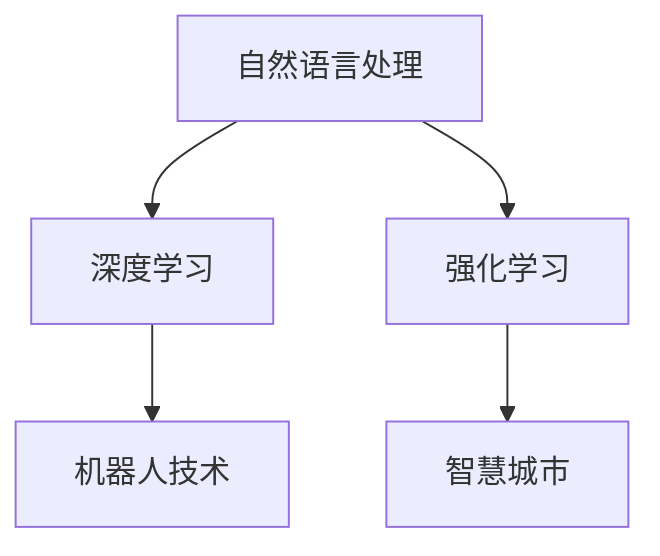

                 

# AI智能体与数字世界的交互

> 关键词：AI智能体,数字世界,交互,自然语言处理,深度学习,强化学习,机器人,智慧城市

## 1. 背景介绍

### 1.1 问题由来

随着人工智能技术的发展，AI智能体在数字世界中扮演着越来越重要的角色。从简单的聊天机器人到复杂的智能推荐系统，从自主导航的自动驾驶车辆到协同决策的智慧城市，AI智能体正在逐步改变人类与数字世界的互动方式。然而，AI智能体如何更自然、更智能地与人类沟通，如何从数字世界提取有用信息，如何根据环境变化自主决策，仍然是一个亟待解决的重要问题。

### 1.2 问题核心关键点

AI智能体的核心目标是通过与数字世界的交互，理解人类的需求，提供合适的响应，并根据环境变化进行自主决策。这一过程涉及多个子问题：

- **自然语言处理(NLP)**：AI智能体需要理解自然语言，识别意图，提取关键信息。
- **深度学习与强化学习**：AI智能体需要学习数据背后的规律，通过不断迭代优化性能。
- **机器人技术与智慧城市**：AI智能体需要结合传感器和执行器，在实际环境中进行导航、监控、决策等任务。

本研究聚焦于如何构建一个能够智能理解人类需求、自主决策的AI智能体，以期在数字世界与人类之间建立更紧密的交互桥梁。

## 2. 核心概念与联系

### 2.1 核心概念概述

为更好地理解AI智能体与数字世界交互的原理，本节将介绍几个关键概念：

- **自然语言处理(NLP)**：旨在使计算机理解、解释、生成自然语言，是AI智能体理解人类需求的基础。
- **深度学习**：通过多层次的神经网络模型，从数据中学习到高级抽象特征，实现对复杂问题的建模。
- **强化学习(Reinforcement Learning, RL)**：通过与环境的交互，AI智能体学习最优决策策略，在多变的环境中保持高效稳定。
- **机器人技术(Robotics)**：将AI智能体的决策能力应用于物理机器人，实现具体的动作执行和环境交互。
- **智慧城市(Smart City)**：利用AI智能体进行城市管理、公共安全、交通优化等，提升城市运行效率和居民生活质量。

这些核心概念之间的逻辑关系可以通过以下Mermaid流程图来展示：



这个流程图展示了一系列核心概念的联系：自然语言处理使AI智能体能够理解人类语言，深度学习从大规模数据中学习到高级特征，强化学习使其能够自主决策，而机器人技术将决策能力应用于物理世界，智慧城市则展示了AI智能体的广泛应用场景。

## 3. 核心算法原理 & 具体操作步骤
### 3.1 算法原理概述

AI智能体与数字世界交互的核心算法包括自然语言处理、深度学习和强化学习。这些算法的原理与操作流程如下：

- **自然语言处理**：通过分词、句法分析、语义理解等技术，将自然语言转换为机器可处理的结构化信息。常用的NLP技术包括词向量表示、Transformer模型、BERT模型等。
- **深度学习**：通过多层神经网络，学习数据中的特征表示。常用的深度学习模型包括卷积神经网络(CNN)、循环神经网络(RNN)、长短期记忆网络(LSTM)、Transformer模型等。
- **强化学习**：通过与环境的交互，AI智能体学习最优决策策略。常用的强化学习算法包括Q-learning、策略梯度方法、Actor-Critic等。

### 3.2 算法步骤详解

AI智能体与数字世界交互的具体操作步骤如下：

**Step 1: 数据收集与预处理**
- 收集数字世界中与任务相关的数据，如日志、文本、图像、视频等。
- 对数据进行清洗、标注、分块等预处理操作，确保数据的质量和可用性。

**Step 2: 模型训练与微调**
- 使用自然语言处理和深度学习技术对数据进行特征提取和建模。
- 根据训练集数据，使用强化学习算法优化模型的决策策略。
- 根据微调数据，对模型进行参数优化，提升其在特定任务上的性能。

**Step 3: 环境模拟与评估**
- 在数字世界中进行环境模拟，评估AI智能体的决策效果。
- 使用各种指标评估模型的性能，如准确率、召回率、F1-score、AUC等。

**Step 4: 部署与优化**
- 将训练好的AI智能体部署到实际环境中，进行实景测试。
- 根据测试结果，不断优化模型参数，提高智能体的表现。

### 3.3 算法优缺点

AI智能体与数字世界交互的算法具有以下优点：

- **强大的学习能力**：通过深度学习模型和强化学习算法，AI智能体可以从大量数据中学习到复杂的规律和决策策略。
- **灵活的适应性**：AI智能体能够根据环境变化调整决策策略，适应多变的数字世界。
- **高效率的决策过程**：通过深度学习模型的快速计算能力，AI智能体能够在极短时间内完成复杂的决策任务。

同时，该算法也存在一些局限性：

- **对数据质量依赖高**：模型的训练效果很大程度上取决于数据的质量和数量，获取高质量数据需要大量人力物力。
- **模型的可解释性差**：深度学习模型通常是"黑盒"系统，难以解释其内部工作机制。
- **对抗攻击敏感**：AI智能体在面对恶意攻击时，可能出现性能下降甚至崩溃。
- **计算资源需求大**：深度学习模型的训练和推理需要大量的计算资源，对硬件配置要求高。

尽管存在这些局限性，但就目前而言，AI智能体与数字世界交互的算法仍是大规模应用的首选。未来相关研究的重点在于如何进一步降低对数据的依赖，提高模型的可解释性和安全性，同时优化计算资源的使用。

### 3.4 算法应用领域

AI智能体与数字世界交互的算法在多个领域得到了广泛应用，包括但不限于：

- **智能客服**：通过自然语言处理和深度学习技术，AI客服能够理解并回答用户问题，提升用户体验。
- **医疗诊断**：利用强化学习算法，AI智能体能够从影像和病历数据中学习，辅助医生进行疾病诊断和治疗。
- **金融分析**：通过深度学习模型，AI智能体能够从大量金融数据中提取规律，进行风险评估和投资策略优化。
- **自动驾驶**：结合传感器数据和深度学习模型，AI智能体能够实现自主导航和避障决策，提升行车安全性。
- **智慧城市**：利用AI智能体进行城市管理、交通优化、公共安全等，提升城市运行效率和居民生活质量。

这些应用展示了AI智能体与数字世界交互的广阔前景，也表明了该技术在各行各业中的重要地位。

## 4. 数学模型和公式 & 详细讲解 & 举例说明
### 4.1 数学模型构建

AI智能体与数字世界交互的核心数学模型包括自然语言处理、深度学习和强化学习的数学模型。以下以Transformer模型和Q-learning算法为例，详细讲解这些模型的构建过程。

**Transformer模型**：
Transformer模型是一种基于自注意力机制的神经网络模型，用于处理序列数据。其核心思想是将输入序列通过多头自注意力机制和前馈神经网络进行处理，得到输出序列。Transformer模型的数学表达式如下：

$$
y = \text{Softmax}\left(\text{MultiHeadDotProduct}(Q, K, V)\right)
$$

其中，$Q$、$K$、$V$分别为查询向量、键向量和值向量，$\text{MultiHeadDotProduct}$表示多头自注意力机制，$\text{Softmax}$表示注意力权重计算。

**Q-learning算法**：
Q-learning算法是一种基于模型无关的强化学习算法，用于学习最优决策策略。其核心思想是通过Q值表记录每个状态-动作对的价值，通过贝尔曼方程更新Q值表。Q-learning算法的数学表达式如下：

$$
Q(s, a) \leftarrow (1-\alpha)Q(s, a)+\alpha(r+\gamma \max Q(s', a'))
$$

其中，$s$、$a$、$s'$、$a'$分别为当前状态、当前动作、下一个状态、下一个动作，$r$为即时奖励，$\gamma$为折扣因子，$\alpha$为学习率。

### 4.2 公式推导过程

以Transformer模型为例，推导其注意力机制的具体过程。

Transformer模型中的多头自注意力机制由以下几个步骤构成：
1. 对输入序列进行线性变换，得到查询向量、键向量和值向量。
2. 计算查询向量与键向量的点积，得到一个注意力权重矩阵。
3. 对注意力权重进行归一化，得到注意力分布。
4. 将注意力分布与值向量进行线性变换，得到输出向量。

具体的数学推导如下：

$$
Q = W_Q \cdot X, \quad K = W_K \cdot X, \quad V = W_V \cdot X
$$

$$
\text{Attention}(Q, K, V) = \text{Softmax}\left(\frac{Q \cdot K^T}{\sqrt{d_k}}\right) \cdot V
$$

其中，$d_k$为键向量的维度，$W_Q$、$W_K$、$W_V$为线性变换矩阵。

### 4.3 案例分析与讲解

以智能客服系统的构建为例，详细讲解如何利用AI智能体与数字世界交互。

假设一个在线客服系统，客服机器人通过自然语言处理技术理解用户输入的文本，通过深度学习模型预测用户意图，利用强化学习算法优化回答策略，从而提供精准的服务。具体流程如下：

1. **数据收集**：收集用户的历史聊天记录和常见问题，标注意图和答案。
2. **模型训练**：使用深度学习模型进行意图识别和答案生成，使用强化学习算法优化回答策略。
3. **交互测试**：将训练好的模型部署到实际环境中，与用户进行交互测试。
4. **模型优化**：根据测试结果，不断调整模型参数，提升系统的性能。

## 5. 项目实践：代码实例和详细解释说明
### 5.1 开发环境搭建

在进行AI智能体与数字世界交互的项目实践前，我们需要准备好开发环境。以下是使用Python进行TensorFlow和Keras开发的环境配置流程：

1. 安装Anaconda：从官网下载并安装Anaconda，用于创建独立的Python环境。

2. 创建并激活虚拟环境：
```bash
conda create -n tf-env python=3.8 
conda activate tf-env
```

3. 安装TensorFlow：从官网获取对应的安装命令。例如：
```bash
conda install tensorflow tensorflow==2.6
```

4. 安装Keras：
```bash
pip install keras==2.4.3
```

5. 安装各类工具包：
```bash
pip install numpy pandas scikit-learn matplotlib tqdm jupyter notebook ipython
```

完成上述步骤后，即可在`tf-env`环境中开始项目实践。

### 5.2 源代码详细实现

下面我们以智能客服系统的构建为例，给出使用TensorFlow和Keras对深度学习模型进行训练和优化的PyTorch代码实现。

首先，定义模型的输入和输出：

```python
import tensorflow as tf
from tensorflow.keras.layers import Input, LSTM, Dense, Embedding
from tensorflow.keras.models import Model

# 定义模型输入
input_layer = Input(shape=(MAX_SEQUENCE_LENGTH,), dtype='int32')

# 定义Embedding层
embedding_layer = Embedding(VOCAB_SIZE, EMBEDDING_DIM, input_length=MAX_SEQUENCE_LENGTH)(input_layer)

# 定义LSTM层
lstm_layer = LSTM(LSTM_UNITS, dropout=0.2, recurrent_dropout=0.2)(embedding_layer)

# 定义全连接层
dense_layer = Dense(OUTPUT_SIZE, activation='softmax')(lstm_layer)

# 定义模型输出
output_layer = Dense(NUM_CLASSES, activation='softmax')(dense_layer)

# 构建模型
model = Model(inputs=input_layer, outputs=output_layer)

# 编译模型
model.compile(loss='categorical_crossentropy', optimizer='adam', metrics=['accuracy'])
```

然后，定义训练和评估函数：

```python
def train_model(model, train_data, validation_data, batch_size, epochs):
    model.fit(train_data, train_labels, validation_data=validation_data, batch_size=batch_size, epochs=epochs, verbose=1)

def evaluate_model(model, test_data, batch_size):
    test_loss, test_acc = model.evaluate(test_data, test_labels, batch_size=batch_size)
    print(f'Test loss: {test_loss:.4f}')
    print(f'Test accuracy: {test_acc:.4f}')
```

接着，启动训练流程并在测试集上评估：

```python
# 加载训练数据和测试数据
train_data, train_labels, test_data, test_labels = ...

# 定义模型参数
EMBEDDING_DIM = ...
LSTM_UNITS = ...
NUM_CLASSES = ...
OUTPUT_SIZE = ...

# 定义批量大小和训练轮数
BATCH_SIZE = ...
EPOCHS = ...

# 训练模型
train_model(model, train_data, train_labels, BATCH_SIZE, EPOCHS)

# 在测试集上评估模型
evaluate_model(model, test_data, BATCH_SIZE)
```

以上就是使用TensorFlow和Keras构建和训练智能客服系统模型的完整代码实现。可以看到，TensorFlow和Keras提供了强大的API支持，使得模型的定义和训练变得简单易懂。

### 5.3 代码解读与分析

让我们再详细解读一下关键代码的实现细节：

**Model定义**：
- 使用Keras的`Input`函数定义输入层。
- 使用`Embedding`层将输入的整数序列转换为稠密向量。
- 使用`LSTM`层进行序列建模，输出隐藏状态。
- 使用`Dense`层进行分类，输出概率分布。
- 定义模型的输入和输出，并通过`Model`函数构建模型。
- 使用`compile`函数编译模型，指定损失函数、优化器和评估指标。

**训练函数**：
- 使用`fit`函数进行模型训练，指定训练数据、标签、批量大小和训练轮数。
- 使用`evaluate`函数在测试集上评估模型性能。

**训练流程**：
- 加载训练数据和测试数据。
- 定义模型参数和批量大小、训练轮数。
- 调用训练函数进行模型训练。
- 调用评估函数在测试集上评估模型性能。

可以看到，TensorFlow和Keras使得深度学习模型的构建和训练变得高效便捷，开发者可以更多地关注算法和模型的设计。

## 6. 实际应用场景
### 6.1 智能客服系统

智能客服系统是AI智能体与数字世界交互的典型应用之一。通过自然语言处理和深度学习技术，客服机器人能够理解用户输入，生成准确的回答，从而提升用户体验。

具体而言，可以收集企业内部的历史客服对话记录，将问题和最佳答复构建成监督数据，在此基础上对深度学习模型进行训练。训练好的模型部署到实际环境中，即可与用户进行交互，提供精准的服务。

### 6.2 医疗诊断系统

医疗诊断系统利用AI智能体与数字世界交互的算法，从影像和病历数据中学习，辅助医生进行疾病诊断和治疗。

具体而言，可以收集医疗影像和病历数据，标注疾病类型和诊断结果。利用深度学习模型学习影像特征和病历文本，使用强化学习算法优化诊断策略。训练好的模型部署到实际环境中，即可对新病历进行诊断，提升诊疗效率和准确性。

### 6.3 金融分析系统

金融分析系统利用AI智能体与数字世界交互的算法，从大量金融数据中提取规律，进行风险评估和投资策略优化。

具体而言，可以收集股票、期货等金融数据，标注涨跌和交易量等关键信息。利用深度学习模型学习数据特征，使用强化学习算法优化交易策略。训练好的模型部署到实际环境中，即可对市场走势进行预测，制定投资策略，提升投资回报率。

### 6.4 自动驾驶系统

自动驾驶系统结合传感器数据和AI智能体与数字世界交互的算法，实现自主导航和避障决策。

具体而言，可以安装各种传感器（如激光雷达、摄像头、GPS等），收集车辆周围的环境数据。利用深度学习模型学习环境特征，使用强化学习算法优化驾驶策略。训练好的模型部署到实际环境中，即可进行自主导航和避障决策，提升行车安全性。

## 7. 工具和资源推荐
### 7.1 学习资源推荐

为了帮助开发者系统掌握AI智能体与数字世界交互的理论基础和实践技巧，这里推荐一些优质的学习资源：

1. 《深度学习》书籍：Ian Goodfellow等人所著，全面介绍了深度学习的基础理论和经典模型。
2. 《强化学习基础》书籍：Richard S. Sutton和Andrew G. Barto所著，深入浅出地介绍了强化学习的基本概念和算法。
3. 《自然语言处理综论》书籍：Daniel Jurafsky和James H. Martin所著，介绍了自然语言处理的各个方面。
4. Coursera《深度学习专项课程》：由斯坦福大学开设，涵盖深度学习的基础和应用。
5. Udacity《深度学习纳米学位》：结合理论和实践，教授深度学习和强化学习。
6. Kaggle平台：提供大量数据集和竞赛，可以用于实践AI智能体与数字世界交互的算法。

通过对这些资源的学习实践，相信你一定能够快速掌握AI智能体与数字世界交互的精髓，并用于解决实际的NLP问题。
###  7.2 开发工具推荐

高效的开发离不开优秀的工具支持。以下是几款用于AI智能体与数字世界交互开发的常用工具：

1. TensorFlow：由Google主导开发的开源深度学习框架，生产部署方便，适合大规模工程应用。
2. PyTorch：基于Python的开源深度学习框架，灵活的计算图，适合快速迭代研究。
3. Keras：高级神经网络API，提供简洁的API接口，适合快速搭建和训练深度学习模型。
4. Jupyter Notebook：用于编写和分享代码，支持多种编程语言和数据格式。
5. TensorBoard：TensorFlow配套的可视化工具，可实时监测模型训练状态，提供丰富的图表呈现方式。
6. Weights & Biases：实验跟踪工具，可以记录和可视化模型训练过程中的各项指标，方便对比和调优。

合理利用这些工具，可以显著提升AI智能体与数字世界交互任务的开发效率，加快创新迭代的步伐。

### 7.3 相关论文推荐

AI智能体与数字世界交互的发展源于学界的持续研究。以下是几篇奠基性的相关论文，推荐阅读：

1. Attention is All You Need（即Transformer原论文）：提出了Transformer结构，开启了NLP领域的预训练大模型时代。
2. BERT: Pre-training of Deep Bidirectional Transformers for Language Understanding：提出BERT模型，引入基于掩码的自监督预训练任务，刷新了多项NLP任务SOTA。
3. Deep Q-Networks for Humanoid Baseball Playing：通过Q-learning算法实现了深度强化学习在游戏中的应用。
4. Playing Atari with Deep Reinforcement Learning：使用深度Q网络实现了深度强化学习在环境互动中的应用。
5. Policy Distillation：通过模型迁移，实现了深度强化学习在复杂环境中的应用。

这些论文代表了大语言模型微调技术的发展脉络。通过学习这些前沿成果，可以帮助研究者把握学科前进方向，激发更多的创新灵感。

## 8. 总结：未来发展趋势与挑战
### 8.1 总结

本文对AI智能体与数字世界交互的算法进行了全面系统的介绍。首先阐述了AI智能体与数字世界交互的研究背景和意义，明确了其在理解人类需求、自主决策等方面的独特价值。其次，从原理到实践，详细讲解了自然语言处理、深度学习和强化学习的数学模型和操作步骤，给出了AI智能体与数字世界交互的完整代码实例。同时，本文还广泛探讨了AI智能体在智能客服、医疗诊断、金融分析、自动驾驶等众多领域的应用前景，展示了AI智能体的广泛应用场景。此外，本文精选了AI智能体与数字世界交互的各类学习资源，力求为读者提供全方位的技术指引。

通过本文的系统梳理，可以看到，AI智能体与数字世界交互的算法正在成为NLP领域的重要范式，极大地拓展了AI智能体的应用边界，催生了更多的落地场景。受益于大规模语料的预训练，AI智能体在理解人类语言、自主决策等方面的性能得到了显著提升，推动了自然语言处理技术的产业化进程。未来，伴随预训练语言模型和强化学习方法的持续演进，相信AI智能体将会在更多领域发挥重要作用，为人类认知智能的进化带来深远影响。

### 8.2 未来发展趋势

展望未来，AI智能体与数字世界交互技术将呈现以下几个发展趋势：

1. **模型规模持续增大**：随着算力成本的下降和数据规模的扩张，AI智能体的模型参数量还将持续增长。超大规模AI智能体蕴含的丰富知识，有望支撑更加复杂多变的交互任务。

2. **多模态交互崛起**：AI智能体将不仅仅处理文本数据，还将拓展到图像、视频、语音等多模态数据。多模态信息的融合，将显著提升AI智能体的感知和决策能力。

3. **AI智能体生态系统构建**：AI智能体将与各种应用场景和环境互动，形成智能生态系统。通过系统优化，实现更高效、更稳定的交互效果。

4. **跨领域知识迁移**：AI智能体将在不同领域之间进行知识迁移，提升其通用性和适应性。通过知识图谱、逻辑规则等外脑机制，AI智能体将具备更全面的知识库。

5. **可解释性和透明性增强**：AI智能体的决策过程将更加透明可解释，用户可以理解其决策依据，提升信任度。

6. **伦理道德和安全考量**：AI智能体将引入伦理导向和安全性约束，确保其行为符合社会道德和法律法规。

以上趋势凸显了AI智能体与数字世界交互技术的广阔前景。这些方向的探索发展，必将进一步提升AI智能体的性能和应用范围，为构建智能人机交互系统铺平道路。

### 8.3 面临的挑战

尽管AI智能体与数字世界交互技术已经取得了瞩目成就，但在迈向更加智能化、普适化应用的过程中，它仍面临着诸多挑战：

1. **数据质量和数量瓶颈**：AI智能体的训练效果很大程度上取决于数据的质量和数量，获取高质量数据需要大量人力物力。如何在有限数据下进行高效训练，是未来需要解决的问题。

2. **模型的可解释性差**：深度学习模型通常是"黑盒"系统，难以解释其内部工作机制。如何赋予AI智能体更强的可解释性，将是亟待攻克的难题。

3. **对抗攻击敏感**：AI智能体在面对恶意攻击时，可能出现性能下降甚至崩溃。如何提升AI智能体的鲁棒性，避免对抗攻击，将是未来的研究重点。

4. **计算资源需求大**：深度学习模型的训练和推理需要大量的计算资源，对硬件配置要求高。如何优化资源使用，提升模型训练和推理效率，是实际应用中亟待解决的问题。

5. **伦理道德和安全问题**：AI智能体在处理敏感信息时，可能面临隐私泄露和伦理道德问题。如何确保数据隐私和行为合规，将是未来需要考虑的重要问题。

6. **跨领域知识迁移难度大**：AI智能体在不同的领域之间进行知识迁移时，可能面临知识表示不一致的问题。如何构建通用的知识库，实现跨领域知识的有效迁移，是未来需要解决的问题。

正视AI智能体与数字世界交互面临的这些挑战，积极应对并寻求突破，将是大规模应用的关键。相信随着学界和产业界的共同努力，这些挑战终将一一被克服，AI智能体将会在更多领域发挥重要作用。

### 8.4 研究展望

面对AI智能体与数字世界交互所面临的种种挑战，未来的研究需要在以下几个方面寻求新的突破：

1. **探索无监督和半监督学习算法**：摆脱对大规模标注数据的依赖，利用自监督学习、主动学习等无监督和半监督范式，最大限度利用非结构化数据，实现更加灵活高效的交互。

2. **开发参数高效的交互算法**：开发更加参数高效的算法，在固定大部分预训练参数的同时，只更新极少量的任务相关参数。同时优化计算图，减少前向传播和反向传播的资源消耗。

3. **引入因果学习和对比学习**：通过引入因果推断和对比学习思想，增强AI智能体建立稳定因果关系的能力，学习更加普适、鲁棒的知识表示。

4. **结合知识图谱和符号化知识**：将符号化的先验知识，如知识图谱、逻辑规则等，与神经网络模型进行巧妙融合，引导AI智能体学习更准确、合理的知识表示。

5. **引入伦理导向和安全性约束**：在模型训练目标中引入伦理导向的评估指标，过滤和惩罚有害的输出倾向。加强人工干预和审核，建立模型行为的监管机制，确保输出符合人类价值观和伦理道德。

这些研究方向将引领AI智能体与数字世界交互技术迈向更高的台阶，为构建智能人机交互系统提供新的突破。只有勇于创新、敢于突破，才能不断拓展AI智能体的边界，让智能技术更好地造福人类社会。

## 9. 附录：常见问题与解答

**Q1：如何构建一个高效的AI智能体交互系统？**

A: 构建高效的AI智能体交互系统需要考虑多个方面：

1. **选择合适的算法和模型**：根据具体任务选择合适的自然语言处理、深度学习和强化学习算法，以及适合的模型结构。

2. **收集和处理数据**：收集与任务相关的数据，进行清洗、标注、分块等预处理操作，确保数据的质量和可用性。

3. **模型训练和优化**：使用训练集数据对模型进行训练，使用验证集数据进行调参和优化，确保模型的性能。

4. **部署和测试**：将训练好的模型部署到实际环境中，进行实景测试，根据测试结果不断优化模型参数。

5. **系统集成和优化**：将AI智能体与各种应用场景和环境互动，实现多模态数据融合和知识迁移，提升系统的整体性能。

**Q2：AI智能体在面对恶意攻击时，如何提升鲁棒性？**

A: 提升AI智能体的鲁棒性可以从以下几个方面入手：

1. **数据增强**：通过对训练数据进行扩充，增加模型的泛化能力，降低对抗攻击的影响。

2. **正则化和对抗训练**：使用正则化技术和对抗样本进行训练，提高模型的鲁棒性。

3. **模型裁剪和压缩**：对模型进行裁剪和压缩，减小模型的规模，降低对抗攻击的风险。

4. **可解释性分析**：通过可解释性技术，分析模型的决策过程，找到潜在的脆弱点，进行针对性的改进。

5. **多模型集成**：通过集成多个模型，提高系统的鲁棒性，降低单点攻击的风险。

这些措施可以有效地提升AI智能体的鲁棒性，使其在面对恶意攻击时仍能保持高性能。

**Q3：如何在有限数据下进行高效训练？**

A: 在有限数据下进行高效训练可以从以下几个方面入手：

1. **数据增强**：通过对训练数据进行扩充，增加数据的多样性，提升模型的泛化能力。

2. **自监督学习**：利用无标签数据进行预训练，增强模型的表示能力，提高模型的性能。

3. **迁移学习**：利用其他领域的数据进行迁移学习，提高模型的泛化能力。

4. **模型裁剪和压缩**：对模型进行裁剪和压缩，减小模型的规模，降低计算资源的消耗。

5. **主动学习**：通过主动选择样本来进行训练，提高数据利用率，提升模型的性能。

这些措施可以在有限数据下进行高效训练，提升模型的性能和鲁棒性。

**Q4：如何提升AI智能体的可解释性？**

A: 提升AI智能体的可解释性可以从以下几个方面入手：

1. **可解释性技术**：使用可解释性技术，如梯度归因、层级可解释性、因果推断等，分析模型的决策过程，提高可解释性。

2. **符号化知识**：将符号化的先验知识，如知识图谱、逻辑规则等，与神经网络模型进行融合，提高模型的可解释性。

3. **多模型集成**：通过集成多个模型，提高系统的鲁棒性和可解释性，降低单点攻击的风险。

4. **用户反馈**：通过用户反馈，不断改进模型的决策过程，提高可解释性和用户满意度。

这些措施可以提升AI智能体的可解释性，使其决策过程更加透明、可理解。

**Q5：如何构建跨领域的AI智能体？**

A: 构建跨领域的AI智能体需要考虑多个方面：

1. **跨领域数据收集**：收集不同领域的标注数据，进行统一预处理和标注，构建通用的数据集。

2. **知识图谱和符号化知识**：引入知识图谱、逻辑规则等符号化知识，构建通用的知识库，实现跨领域知识迁移。

3. **多模态数据融合**：利用多模态数据融合技术，提升AI智能体在多领域环境中的感知和决策能力。

4. **模型迁移和优化**：通过迁移学习、多任务学习等技术，实现模型在不同领域之间的迁移和优化，提高AI智能体的泛化能力。

5. **领域自适应算法**：开发领域自适应算法，提升AI智能体在不同领域中的适应能力，实现跨领域的交互。

这些措施可以构建跨领域的AI智能体，使其在多个领域中发挥作用。

---

作者：禅与计算机程序设计艺术 / Zen and the Art of Computer Programming

