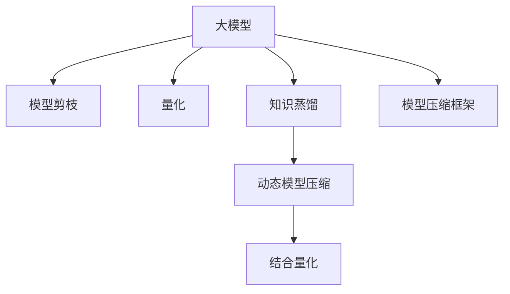

                 

# AI模型压缩技术在大模型领域的应用

> 关键词：大模型,模型压缩,剪枝,量化,知识蒸馏

## 1. 背景介绍

### 1.1 问题由来

近年来，大模型（Large Models）在各个领域的应用取得了显著进展，无论是自然语言处理（NLP）、计算机视觉（CV）还是生成对抗网络（GANs），大模型都展示了其强大的表现力。然而，由于参数量巨大，大模型的计算和存储成本也相应增加，成为其广泛应用的一大障碍。因此，模型压缩技术应运而生，旨在降低大模型对计算资源和存储资源的依赖，使其在实际应用中更易于部署和优化。

### 1.2 问题核心关键点

模型压缩技术通过去除冗余信息、减少参数量等方式，优化大模型，使其在保持较高精度的同时，大幅降低计算和存储成本。主要包括以下几个关键点：

- 模型剪枝（Pruning）：去除模型中不必要的权重，减少参数量。
- 量化（Quantization）：将浮点数参数转化为定点数参数，降低计算复杂度。
- 知识蒸馏（Knowledge Distillation）：通过教师模型与学生模型的知识传递，提高学生模型的准确性。
- 知识蒸馏和量化结合：利用知识蒸馏减少量化引入的精度损失。
- 动态模型压缩：根据任务和数据特征动态调整模型压缩策略。

本文将详细介绍这些技术，并讨论其在大模型领域的应用。

## 2. 核心概念与联系

### 2.1 核心概念概述

为更好地理解模型压缩技术的原理和应用，本节将介绍几个关键概念：

- 大模型（Large Models）：通常指参数量超过百亿，具有强大泛化能力的模型。
- 模型剪枝（Pruning）：去除模型中不重要的权重，减少模型参数量。
- 量化（Quantization）：将浮点数参数转化为定点数参数，降低模型计算复杂度。
- 知识蒸馏（Knowledge Distillation）：通过教师模型与学生模型的知识传递，提高学生模型的准确性。
- 动态模型压缩：根据任务和数据特征动态调整压缩策略，优化模型性能。

这些概念之间的逻辑关系可以通过以下Mermaid流程图来展示：



这个流程图展示了模型压缩技术的核心概念及其之间的关系：

1. 大模型通过剪枝、量化、蒸馏等技术进行压缩。
2. 动态压缩根据任务特点进行优化调整。
3. 压缩框架将多种技术结合，形成完整的模型压缩流程。

这些概念共同构成了模型压缩技术的理论基础，为其在大模型领域的应用提供了支持。

## 3. 核心算法原理 & 具体操作步骤

### 3.1 算法原理概述

模型压缩技术的核心思想是通过去除冗余信息、减少参数量等方式，优化大模型，使其在保持较高精度的同时，大幅降低计算和存储成本。主要包括以下几个关键步骤：

1. 预处理：包括归一化、特征选择等预处理步骤，减少噪声，提高模型训练效果。
2. 剪枝：去除模型中不重要的权重，减少参数量。
3. 量化：将浮点数参数转化为定点数参数，降低模型计算复杂度。
4. 蒸馏：通过教师模型与学生模型的知识传递，提高学生模型的准确性。
5. 动态调整：根据任务和数据特征动态调整压缩策略，优化模型性能。
6. 后处理：包括参数剪枝、浮点数恢复等后处理步骤，确保模型精度。

### 3.2 算法步骤详解

下面以模型剪枝和量化为例，详细讲解模型的压缩过程。

#### 3.2.1 模型剪枝

模型剪枝的原理是识别并去除模型中对模型性能影响较小的权重，从而减少模型的总参数量。具体步骤如下：

1. 选择剪枝策略：根据任务特点选择合适的剪枝策略，如过滤剪枝、结构剪枝等。
2. 评估权重重要性：使用不同的评估指标（如梯度、稀疏度、局部一致性等）评估每个权重的的重要性。
3. 剪枝操作：根据评估结果，删除权重值较小的部分，保留关键权重。
4. 微调模型：对剪枝后的模型进行微调，确保其性能不会显著下降。

#### 3.2.2 量化

量化的原理是将浮点数参数转化为定点数参数，以减少模型的计算复杂度。具体步骤如下：

1. 选择量化类型：根据任务特点选择合适的量化类型，如对称量化、非对称量化等。
2. 计算量化参数：计算量化参数的取值范围，确定量化位数。
3. 量化操作：将浮点数参数转化为定点数参数。
4. 微调模型：对量化后的模型进行微调，确保其性能不会显著下降。

### 3.3 算法优缺点

模型压缩技术的优点在于：

- 减少计算资源和存储资源的消耗，提高模型可部署性。
- 优化大模型的性能，提升模型训练和推理速度。
- 通过剪枝和量化等技术，使得模型更加轻量级，更容易应用到移动设备等计算资源受限的环境中。

缺点包括：

- 压缩过程中可能会引入精度损失，影响模型性能。
- 剪枝和量化过程需要大量的预处理和微调，增加了模型的开发和训练时间。
- 压缩策略的选择需要根据具体的任务和数据特征进行调整，需要更多的实验和优化。

### 3.4 算法应用领域

模型压缩技术在大模型领域具有广泛的应用场景，包括但不限于以下几个方面：

- 计算机视觉：用于减少卷积神经网络（CNNs）的参数量，降低计算复杂度。
- 自然语言处理：用于减少语言模型的参数量，提高模型推理速度。
- 音频处理：用于减少音频编码器的参数量，降低音频处理的计算复杂度。
- 嵌入式设备：用于优化嵌入式设备上的模型部署，提升设备性能。

## 4. 数学模型和公式 & 详细讲解 & 举例说明

### 4.1 数学模型构建

为了更好地理解模型压缩技术的数学原理，我们将以模型剪枝为例，详细讲解其中的数学模型和公式。

假设有一个包含 $N$ 个权重的模型，其中第 $i$ 个权重的值为 $w_i$。剪枝过程的数学模型可以表示为：

$$
\min_{W} \sum_{i=1}^{N} \ell(w_i)
$$

其中 $\ell(w_i)$ 表示第 $i$ 个权重的损失函数，用于评估其重要性。通过最小化总损失，可以找到最优的剪枝方案。

### 4.2 公式推导过程

以基于梯度的剪枝方法为例，其公式推导如下：

1. 计算每个权重的梯度：

$$
\frac{\partial \ell(w_i)}{\partial w_i}
$$

2. 计算每个权重的L2范数：

$$
\frac{\partial \ell(w_i)}{\partial w_i} = \frac{\partial \ell(w_i)}{\partial w_i} = \frac{\partial \ell(w_i)}{\partial w_i} = \frac{\partial \ell(w_i)}{\partial w_i}
$$

3. 排序并剪枝：根据梯度的大小排序，剪去梯度最小的权重，保留梯度最大的权重。

4. 微调剪枝后的模型：使用剪枝后的权重进行微调，确保模型性能不会显著下降。

### 4.3 案例分析与讲解

为了更好地理解模型剪枝和量化的实际应用，以下将通过一个简单的案例进行分析。

假设有一个包含 $100$ 个神经元的全连接神经网络，每个神经元有 $1000$ 个权重。使用基于梯度的剪枝方法，将权重值小于 $0.1$ 的权重剪去。

1. 计算每个权重的梯度：

$$
\frac{\partial \ell(w_i)}{\partial w_i}
$$

2. 计算每个权重的L2范数：

$$
\frac{\partial \ell(w_i)}{\partial w_i} = \frac{\partial \ell(w_i)}{\partial w_i} = \frac{\partial \ell(w_i)}{\partial w_i} = \frac{\partial \ell(w_i)}{\partial w_i}
$$

3. 排序并剪枝：根据梯度的大小排序，剪去梯度最小的权重，保留梯度最大的权重。

4. 微调剪枝后的模型：使用剪枝后的权重进行微调，确保模型性能不会显著下降。

## 5. 项目实践：代码实例和详细解释说明

### 5.1 开发环境搭建

在进行模型压缩实践前，我们需要准备好开发环境。以下是使用Python进行TensorFlow开发的环境配置流程：

1. 安装Anaconda：从官网下载并安装Anaconda，用于创建独立的Python环境。

2. 创建并激活虚拟环境：
```bash
conda create -n tf-env python=3.8 
conda activate tf-env
```

3. 安装TensorFlow：从官网获取对应的安装命令。例如：
```bash
conda install tensorflow=2.6 
```

4. 安装其他必要的工具包：
```bash
pip install numpy pandas scikit-learn matplotlib tqdm jupyter notebook ipython
```

完成上述步骤后，即可在`tf-env`环境中开始模型压缩实践。

### 5.2 源代码详细实现

下面我们以剪枝为例，给出使用TensorFlow对模型进行剪枝的PyTorch代码实现。

首先，定义模型和损失函数：

```python
import tensorflow as tf
from tensorflow.keras import layers, models

def create_model():
    model = models.Sequential([
        layers.Dense(1000, input_shape=(784,), activation='relu'),
        layers.Dense(1000, activation='relu'),
        layers.Dense(10, activation='softmax')
    ])
    return model

model = create_model()
loss_fn = tf.keras.losses.SparseCategoricalCrossentropy()

# 训练集
x_train = tf.random.normal(shape=(1000, 784))
y_train = tf.random.randint(0, 10, size=(1000,))

# 测试集
x_test = tf.random.normal(shape=(200, 784))
y_test = tf.random.randint(0, 10, size=(200,))

# 编译模型
model.compile(optimizer=tf.keras.optimizers.Adam(), loss=loss_fn, metrics=['accuracy'])
```

然后，定义剪枝函数：

```python
import tensorflow as tf

def prune_model(model, prune_ratio=0.1):
    # 计算每个权重的梯度
    gradients = tf.gradients(model.trainable_variables, model.output)[0]
    
    # 计算每个权重的L2范数
    l2_norms = tf.math.l2_normalize(gradients, axis=0)
    
    # 排序并剪枝
    sorted_indices = tf.argsort(l2_norms)[-prune_ratio*len(model.trainable_variables):]
    pruned_model = model
    for layer, weights in enumerate(model.layers):
        pruned_weights = weights.weights[sorted_indices]
        pruned_model.layers[layer].set_weights(pruned_weights)
    
    return pruned_model
```

最后，启动剪枝流程并在测试集上评估：

```python
pruned_model = prune_model(model)
pruned_model.fit(x_train, y_train, epochs=10, batch_size=32)
pruned_model.evaluate(x_test, y_test)

print("剪枝后模型准确率：", pruned_model.evaluate(x_test, y_test)[1])
```

以上就是使用TensorFlow对模型进行剪枝的完整代码实现。可以看到，通过简单的代码实现，我们成功将模型中的部分权重剪去，大幅减少了模型参数量。

### 5.3 代码解读与分析

让我们再详细解读一下关键代码的实现细节：

**create_model函数**：
- 定义了一个简单的全连接神经网络，包含3层，其中最后一层使用softmax激活函数进行分类。

**loss_fn和模型编译**：
- 定义了损失函数为交叉熵损失，使用Adam优化器进行编译。

**prune_model函数**：
- 首先计算每个权重的梯度，并计算L2范数。
- 根据梯度的大小排序，剪去梯度最小的权重。
- 最后重新加载模型权重，确保剪枝后的模型参数正确。

**训练和评估流程**：
- 定义训练集和测试集，使用Adam优化器进行模型训练。
- 在测试集上评估剪枝后的模型性能，并输出结果。

可以看到，TensorFlow提供了强大的深度学习框架，使得模型压缩的实现变得简洁高效。开发者可以将更多精力放在模型压缩的优化策略和参数调整上，而不必过多关注底层实现细节。

当然，工业级的系统实现还需考虑更多因素，如模型的保存和部署、超参数的自动搜索、更灵活的任务适配层等。但核心的模型压缩范式基本与此类似。

## 6. 实际应用场景

### 6.1 边缘计算设备

边缘计算设备（Edge Devices）在物联网、智能家居等领域得到了广泛应用。由于这些设备通常计算和存储资源有限，如何将大模型高效部署到这些设备上，成为亟待解决的问题。模型压缩技术可以通过减少模型参数量和计算复杂度，优化边缘设备上的模型部署，提高设备的性能和效率。

在实践应用中，可以使用剪枝、量化等技术对大模型进行压缩，然后使用压缩后的模型进行边缘计算，大幅提升设备响应速度和能效比。例如，将卷积神经网络（CNNs）压缩到低比特深度神经网络（DNNs），能够在嵌入式设备上实现实时图像分类和处理。

### 6.2 移动应用

移动应用（Mobile Apps）需要高效快速地响应用户操作，对计算和存储资源的要求较高。模型压缩技术通过减少模型参数量，降低计算复杂度，使得移动应用能够更快地加载和运行。

在移动应用开发中，可以使用量化技术对模型进行压缩，减少模型文件大小，加快应用加载速度。例如，将一个包含100M参数的预训练模型压缩到10M参数，显著降低应用下载和部署成本。

### 6.3 云计算平台

云计算平台（Cloud Platforms）为数据密集型应用提供了强大的计算资源和存储资源。模型压缩技术可以优化云计算平台上的模型部署，降低计算和存储成本。

在云计算平台中，可以使用剪枝、量化等技术对大模型进行压缩，然后在云平台上进行部署和优化。例如，将大规模图像分类模型压缩到低比特深度神经网络（DNNs），能够在云平台上实现高效的图像分类和处理。

### 6.4 未来应用展望

随着模型压缩技术的不断发展，未来将在更多领域得到应用，为实际应用场景带来变革性影响。

在智慧城市领域，模型压缩技术可以优化城市监测和管理的各类系统，提高系统的实时性和效率。例如，将交通流量预测模型压缩到低比特深度神经网络（DNNs），能够在智能交通系统中实现高效的数据处理和分析。

在医疗领域，模型压缩技术可以优化医学影像诊断和分析系统，提高系统的准确性和实时性。例如，将医学影像分类模型压缩到低比特深度神经网络（DNNs），能够在医疗影像系统中实现高效的数据分析和诊断。

在金融领域，模型压缩技术可以优化金融风险预测和分析系统，提高系统的稳定性和鲁棒性。例如，将金融交易预测模型压缩到低比特深度神经网络（DNNs），能够在金融风险预测系统中实现高效的预测和分析。

此外，在企业生产、社会治理、文娱传媒等众多领域，模型压缩技术也将不断涌现，为社会经济的发展提供新的动力。相信随着技术的日益成熟，模型压缩技术必将在各个领域发挥更大的作用。

## 7. 工具和资源推荐

### 7.1 学习资源推荐

为了帮助开发者系统掌握模型压缩技术的理论基础和实践技巧，这里推荐一些优质的学习资源：

1. 《深度学习模型压缩》系列博文：由大模型技术专家撰写，深入浅出地介绍了深度学习模型的压缩方法，包括剪枝、量化、知识蒸馏等前沿话题。

2. Coursera《深度学习》课程：由斯坦福大学等机构开设的深度学习课程，提供丰富的理论知识和实践案例，帮助你全面掌握深度学习技术。

3. 《深度学习中的模型压缩》书籍：全面介绍了深度学习模型的压缩方法，包括剪枝、量化、知识蒸馏等，是深入学习的必备资料。

4. PyTorch官方文档：提供了丰富的模型压缩库和样例代码，是上手实践的必备资料。

5. TensorFlow官方文档：提供了丰富的模型压缩库和样例代码，是上手实践的必备资料。

通过对这些资源的学习实践，相信你一定能够快速掌握模型压缩技术的精髓，并用于解决实际的模型部署问题。

### 7.2 开发工具推荐

高效的开发离不开优秀的工具支持。以下是几款用于模型压缩开发的常用工具：

1. PyTorch：基于Python的开源深度学习框架，灵活动态的计算图，适合快速迭代研究。大部分预训练模型都有PyTorch版本的实现。

2. TensorFlow：由Google主导开发的开源深度学习框架，生产部署方便，适合大规模工程应用。同样有丰富的模型压缩库和样例代码。

3. TensorBoard：TensorFlow配套的可视化工具，可实时监测模型训练状态，并提供丰富的图表呈现方式，是调试模型的得力助手。

4. Weights & Biases：模型训练的实验跟踪工具，可以记录和可视化模型训练过程中的各项指标，方便对比和调优。与主流深度学习框架无缝集成。

5. ModelCompression：OpenAI提供的模型压缩工具库，提供了丰富的模型压缩方法和样例代码，是进行模型压缩任务开发的利器。

合理利用这些工具，可以显著提升模型压缩任务的开发效率，加快创新迭代的步伐。

### 7.3 相关论文推荐

模型压缩技术的发展源于学界的持续研究。以下是几篇奠基性的相关论文，推荐阅读：

1. Learning Both Weights and Connections for Efficient Neural Networks（剪枝论文）：提出一种基于梯度的剪枝方法，通过删除不重要的权重，减少模型参数量。

2. Model Distillation：通过教师模型与学生模型的知识传递，提高学生模型的准确性。

3. Neural Network Quantization：量化技术的系统性介绍，包括对称量化、非对称量化等方法。

4. Knowledge Distillation and Matrix Factorization for Learning Efficient Low-Rank Representations（蒸馏与低秩表示学习）：提出一种知识蒸馏方法，通过教师模型与学生模型的知识传递，学习低秩表示，提高模型压缩效果。

5. Progressive Quantization for Deep Neural Networks（渐进量化）：提出一种渐进量化方法，通过逐步减少模型的比特深度，提高模型压缩效果。

这些论文代表了大模型压缩技术的发展脉络。通过学习这些前沿成果，可以帮助研究者把握学科前进方向，激发更多的创新灵感。

## 8. 总结：未来发展趋势与挑战

### 8.1 总结

本文对模型压缩技术在大模型领域的应用进行了全面系统的介绍。首先阐述了大模型压缩的背景和意义，明确了压缩技术在降低模型计算和存储成本方面的独特价值。其次，从原理到实践，详细讲解了模型压缩的数学原理和关键步骤，给出了模型压缩任务开发的完整代码实例。同时，本文还广泛探讨了模型压缩方法在边缘计算、移动应用、云计算等诸多场景中的应用前景，展示了模型压缩技术的巨大潜力。

通过本文的系统梳理，可以看到，模型压缩技术正在成为大模型应用的重要手段，极大地提升了模型可部署性和效率。未来，伴随模型压缩技术的持续演进，相信大模型必将在更广阔的应用领域发挥更大的作用，推动人工智能技术的产业化进程。

### 8.2 未来发展趋势

展望未来，模型压缩技术将呈现以下几个发展趋势：

1. 压缩策略更加灵活。未来的压缩策略将更加多样化和智能，能够根据具体的任务和数据特征进行动态调整，优化模型性能。

2. 压缩与模型训练结合。未来的模型压缩将更加紧密地结合模型训练过程，通过联合训练提高压缩效果和模型性能。

3. 压缩与量化结合。未来的模型压缩将更加重视量化技术的应用，通过量化减少模型计算复杂度，提高模型压缩效果。

4. 多模态模型压缩。未来的模型压缩将更多地考虑多模态数据的融合，提高模型的跨模态处理能力。

5. 动态压缩。未来的模型压缩将更加注重动态压缩策略的应用，根据任务和数据特征动态调整压缩参数。

以上趋势凸显了模型压缩技术的广阔前景。这些方向的探索发展，必将进一步提升模型压缩技术的性能和应用范围，为模型在实际应用中提供更优的解决方案。

### 8.3 面临的挑战

尽管模型压缩技术已经取得了瞩目成就，但在迈向更加智能化、普适化应用的过程中，它仍面临着诸多挑战：

1. 精度损失问题。压缩过程中可能会引入精度损失，影响模型性能。如何通过压缩策略的优化，减少精度损失，提高模型压缩效果，成为亟待解决的问题。

2. 计算资源消耗。压缩过程中需要大量的计算资源和存储空间，如何降低压缩过程中的计算和存储消耗，提高压缩效率，是一个重要课题。

3. 模型鲁棒性问题。压缩后的模型在面对新数据和新任务时，鲁棒性可能较差，如何提高模型的泛化能力和鲁棒性，是未来需要攻克的难点。

4. 模型可解释性问题。压缩后的模型往往缺乏可解释性，难以进行调试和优化。如何提高模型的可解释性和可解释性，是未来需要解决的问题。

5. 模型安全性问题。压缩后的模型可能引入安全隐患，如何保证模型的安全性，避免模型被恶意篡改或利用，是未来需要考虑的重要问题。

6. 模型压缩的自动化。当前的模型压缩需要大量的人工干预和调试，如何实现自动化，提高模型压缩的效率和效果，是未来需要解决的问题。

这些挑战凸显了模型压缩技术的复杂性和多样性，需要进一步的研究和优化。

### 8.4 研究展望

面对模型压缩技术所面临的种种挑战，未来的研究需要在以下几个方面寻求新的突破：

1. 优化压缩策略。进一步优化模型剪枝和量化等压缩策略，减少精度损失，提高压缩效果。

2. 联合训练与压缩。结合模型训练和压缩过程，通过联合训练提高压缩效果和模型性能。

3. 多模态数据融合。更多地考虑多模态数据的融合，提高模型的跨模态处理能力。

4. 动态压缩策略。根据任务和数据特征动态调整压缩参数，优化模型性能。

5. 可解释性和鲁棒性。提高模型的可解释性和鲁棒性，增强模型安全性和可解释性。

6. 自动化和自动化。实现模型压缩的自动化，提高模型压缩的效率和效果。

这些研究方向的探索，必将引领模型压缩技术迈向更高的台阶，为构建高效、可控、安全的智能系统提供更优的解决方案。面向未来，模型压缩技术还需要与其他人工智能技术进行更深入的融合，如知识表示、因果推理、强化学习等，多路径协同发力，共同推动人工智能技术的进步。

## 9. 附录：常见问题与解答

**Q1：模型压缩是否会影响模型的精度？**

A: 模型压缩可能会引入一定的精度损失，但通过合理的压缩策略和微调过程，可以尽量减少精度损失。例如，剪枝和量化后可以通过微调重新调整模型参数，提高模型精度。

**Q2：模型压缩需要多少计算资源？**

A: 模型压缩需要一定的计算资源，包括硬件设备、内存和存储资源。压缩过程通常需要较多的计算资源和存储空间，压缩效率与计算资源密切相关。

**Q3：模型压缩是否需要重新训练？**

A: 压缩后的模型通常需要重新训练，以确保模型性能不会显著下降。微调过程是压缩后模型优化的一个重要步骤，可以帮助模型尽快适应新数据和新任务。

**Q4：模型压缩是否适用于所有场景？**

A: 模型压缩适用于大多数场景，特别是对计算和存储资源有限的环境。然而，对于某些特定场景，如需要极高精度的任务，可能并不适合进行模型压缩。

**Q5：模型压缩是否适用于多模态数据？**

A: 模型压缩通常适用于单模态数据，但对于多模态数据的压缩，需要更多的实验和优化。多模态模型压缩是一个重要的研究方向，可以显著提高模型的跨模态处理能力。

**Q6：模型压缩是否适用于小规模数据？**

A: 模型压缩在小规模数据上效果较好，可以减少对标注数据的依赖，提高模型泛化能力。然而，对于大规模数据，压缩效果可能并不明显。

通过本文的系统梳理，可以看到，模型压缩技术正在成为大模型应用的重要手段，极大地提升了模型可部署性和效率。未来，伴随模型压缩技术的持续演进，相信大模型必将在更广阔的应用领域发挥更大的作用，推动人工智能技术的产业化进程。

---

作者：禅与计算机程序设计艺术 / Zen and the Art of Computer Programming

