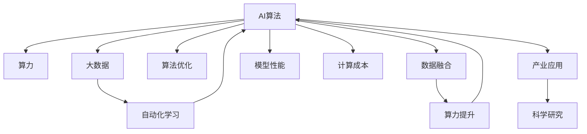

                 

## 1. 背景介绍

### 1.1 问题由来
在过去十年中，人工智能(AI)、算法、算力与大数据这四大元素，共同推动了AI技术的飞速发展，从学术界到工业界，从理论研究到实际应用，都受益于这四大元素的深度融合。人工智能算法通过对数据的高效处理，在大规模数据的基础上，通过计算力驱动，不断优化和提升模型的性能。

大算力提供了强有力的计算支持，使复杂的算法能够在合理的时间内完成训练和推理，为深度学习提供了可能。同时，算力还能够支撑分布式计算，拓展算法的并行性，进一步提升效率。大数据则为算法的训练提供了丰富的数据资源，使得算法能够在大规模数据上进行泛化训练，提升模型的泛化能力。

这三者紧密结合，互相促进，形成了良性循环，推动了人工智能技术的深度发展，让AI技术在各个领域得到广泛应用，如自然语言处理、计算机视觉、语音识别、自动驾驶、推荐系统等。然而，如何更好地将算法、算力与大数据结合，充分发挥各自优势，仍然是当前研究的一个热点问题。

### 1.2 问题核心关键点
AI算法、算力与大数据的结合，是指在AI模型训练和推理过程中，如何更高效、更智能地使用这三者。核心在于算法、算力和大数据之间的协同作用，以及如何通过优化算法和提升算力，更好地利用大数据。

1. **算法优化**：选择和优化合适的算法，使其能够高效地处理大数据，并从中提取有价值的信息。
2. **算力提升**：通过优化计算架构，提高算力，使得大规模计算任务能够在合理的时间内完成。
3. **数据融合**：通过数据清洗、数据增强、数据融合等技术，使大数据更好地服务于算法的训练和推理。
4. **自动化与自动化学习**：结合机器学习与自动化技术，提高算法的自适应能力和鲁棒性。

### 1.3 问题研究意义
研究AI算法、算力与大数据的结合，具有重要的学术和实践意义：

1. **提高模型性能**：通过优化算法和提升算力，能够更好地利用大数据，提高模型的性能和泛化能力。
2. **降低计算成本**：通过算法优化和算力提升，可以更高效地处理大数据，降低计算成本，提升计算效率。
3. **推动产业应用**：AI技术在大规模数据和强大算力的支持下，能够更好地服务于各个产业领域，提升产业效率和竞争力。
4. **促进科学研究**：深度学习和大数据结合，为科学研究提供了强有力的计算支持，推动了多学科的交叉研究。

## 2. 核心概念与联系

### 2.1 核心概念概述

为了更好地理解AI算法、算力与大数据的结合，本节将介绍几个密切相关的核心概念：

- **AI算法**：包括深度学习、卷积神经网络(CNN)、循环神经网络(RNN)、生成对抗网络(GAN)等，用于处理、分析和预测数据。
- **算力**：指的是计算机系统能够执行的计算能力，包括CPU、GPU、TPU等计算资源，以及并行计算能力。
- **大数据**：指的是大规模、多源、异构的数据集，能够提供丰富的样本和信息，支持AI模型的训练和优化。
- **自动化学习**：利用机器学习算法，自动优化模型的超参数、网络结构等，提高模型的训练效率和性能。

这些核心概念之间的逻辑关系可以通过以下Mermaid流程图来展示：



这个流程图展示了大数据、AI算法、算力与自动化学习之间的相互作用关系：

1. 大数据为AI算法提供了丰富的数据资源。
2. 算力支持了AI算法的训练和推理，提升计算效率。
3. 自动化学习通过优化算法和提升算力，进一步提高模型的性能和效率。
4. 优化后的算法和大规模算力结合，提升了模型的性能和泛化能力。

这些核心概念共同构成了AI算法、算力与大数据结合的框架，使其能够更好地处理和分析大数据，提升模型性能，服务产业发展。

## 3. 核心算法原理 & 具体操作步骤
### 3.1 算法原理概述

AI算法、算力与大数据的结合，本质上是通过算法和大数据进行高效训练，并在算力支持下进行高性能推理，以提升模型性能。其核心思想是：

1. **算法优化**：选择或设计合适的AI算法，使其能够高效处理大规模数据。
2. **数据融合**：通过数据清洗、数据增强等技术，提高大数据的质量和多样性，支持算法的训练和推理。
3. **算力提升**：通过优化计算架构，提高算力，使得算法能够在合理的时间内完成训练和推理。

### 3.2 算法步骤详解

基于AI算法、算力与大数据结合的范式，AI模型训练和推理的一般流程如下：

**Step 1: 数据预处理**
- 收集、清洗和整合大数据，提取特征，进行数据增强和转换。
- 将大数据划分为训练集、验证集和测试集。

**Step 2: 模型选择与设计**
- 根据任务需求，选择或设计合适的AI算法，如深度学习、CNN、RNN、GAN等。
- 设计模型架构，包括层数、网络结构、激活函数等。

**Step 3: 模型训练**
- 在算力支持下，对模型进行训练，利用大数据进行迭代优化。
- 定期在验证集上评估模型性能，防止过拟合。

**Step 4: 模型优化**
- 根据验证集的表现，调整模型参数和结构，提升模型性能。
- 应用自动化学习技术，自动优化超参数。

**Step 5: 模型部署**
- 将训练好的模型部署到目标环境，进行推理和预测。
- 应用算力提升技术，加速推理速度。

### 3.3 算法优缺点

AI算法、算力与大数据结合的方法具有以下优点：
1. **高效处理大数据**：能够高效处理大规模数据，提取有用的特征。
2. **提升模型性能**：通过优化算法和提升算力，提升模型的性能和泛化能力。
3. **降低计算成本**：优化算法和提升算力，降低计算成本，提高计算效率。
4. **促进产业应用**：在强大的计算支持下，AI技术能够更好地服务于各个产业领域，提升产业效率和竞争力。

同时，该方法也存在一些局限性：
1. **数据质量问题**：数据质量直接影响到模型性能，数据清洗和增强难度较大。
2. **算法选择困难**：算法选择不当可能导致模型性能不佳。
3. **算力成本高**：大规模算力成本较高，需要高性能计算资源。
4. **自动化学习复杂**：自动化学习需要大量的实验和调整，难以完全自动化。

尽管存在这些局限性，但就目前而言，AI算法、算力与大数据结合仍然是AI技术发展的核心范式。未来相关研究的重点在于如何进一步降低计算成本，提升算力，优化算法，以及更好地利用大数据。

### 3.4 算法应用领域

AI算法、算力与大数据结合的方法在多个领域得到了广泛应用：

1. **自然语言处理(NLP)**：如机器翻译、情感分析、文本分类、命名实体识别等。使用大规模语料库进行预训练，通过优化算法和提升算力，提升模型的性能。
2. **计算机视觉(CV)**：如图像识别、物体检测、人脸识别等。利用大数据进行模型训练，通过优化算法和提升算力，实现高效的图像处理和分析。
3. **语音识别**：如自动语音识别(ASR)、语音合成(TTS)等。使用大规模语音数据进行模型训练，通过优化算法和提升算力，实现高效的语音处理和识别。
4. **自动驾驶**：如车道保持、物体检测、自动泊车等。利用大数据进行模型训练，通过优化算法和提升算力，实现高精度和高可靠性的自动驾驶技术。
5. **推荐系统**：如电商推荐、新闻推荐等。利用用户行为数据进行模型训练，通过优化算法和提升算力，实现个性化的推荐服务。

这些应用领域展示了AI算法、算力与大数据结合的强大潜力，推动了各行各业的智能化进程。

## 4. 数学模型和公式 & 详细讲解 & 举例说明

### 4.1 数学模型构建

为了更好地理解AI算法、算力与大数据结合的数学原理，本节将介绍几个核心的数学模型：

- **线性回归模型**：用于处理线性关系的数据，表达式为 $y=\theta^T x + b$，其中 $\theta$ 为模型参数，$x$ 为输入特征，$y$ 为输出。
- **卷积神经网络(CNN)**：用于处理图像数据，表达式为 $y=f(\theta(x))$，其中 $f$ 为卷积运算，$\theta$ 为网络参数。
- **生成对抗网络(GAN)**：用于生成新数据，表达式为 $y=G(x)$，其中 $G$ 为生成器网络，$x$ 为随机噪声。

### 4.2 公式推导过程

以下是几个核心数学模型的推导过程：

**线性回归模型**：
- 假设数据集为 $\{(x_i, y_i)\}_{i=1}^N$，其中 $x_i \in \mathbb{R}^d$，$y_i \in \mathbb{R}$。
- 模型的损失函数为 $J(\theta)=\frac{1}{2N}\sum_{i=1}^N (y_i - \theta^T x_i)^2$。
- 利用梯度下降算法，最小化损失函数，得到 $\theta$ 的更新公式为 $\theta \leftarrow \theta - \eta \nabla_{\theta} J(\theta)$，其中 $\eta$ 为学习率，$\nabla_{\theta} J(\theta)$ 为损失函数的梯度。

**卷积神经网络(CNN)**：
- 假设图像数据为 $x_{i,j,k}$，其中 $i$ 为行，$j$ 为列，$k$ 为通道数。
- 卷积层的输出为 $y_{i,j,k}=f(\theta(x_{i,j,k}))$，其中 $f$ 为卷积运算，$\theta$ 为卷积核参数。
- 池化层的输出为 $z_{i,j,k}=\max_{l} y_{i,j,l}$，其中 $l$ 为通道数。
- 全连接层的输出为 $y=\theta^T z$，其中 $\theta$ 为全连接层参数。

**生成对抗网络(GAN)**：
- 假设生成器的输入为 $z \in \mathbb{R}^d$，输出为 $y=\theta_G(z)$，其中 $\theta_G$ 为生成器网络参数。
- 假设判别器的输入为 $x \in \mathbb{R}^d$，输出为 $y=\theta_D(x)$，其中 $\theta_D$ 为判别器网络参数。
- 生成器和判别器的损失函数分别为 $J_G=E_{z}[\log D(G(z))]$ 和 $J_D=-E_{x}[\log D(x)]+E_{z}[\log (1-D(G(z)))]$。
- 通过最小化生成器的损失函数和最大化判别器的损失函数，训练生成器和判别器，使生成器能够生成高质量的伪数据。

### 4.3 案例分析与讲解

**案例1: 图像分类**
- 使用大规模图像数据进行预训练，如ImageNet数据集。
- 选择卷积神经网络模型，如ResNet、Inception等。
- 在算力支持下，对模型进行训练，利用数据增强技术，提升模型的泛化能力。
- 应用GPU加速，提高训练速度，在目标设备上部署模型，实现高效的图像分类。

**案例2: 语音识别**
- 使用大规模语音数据进行预训练，如LibriSpeech数据集。
- 选择循环神经网络模型，如LSTM、GRU等。
- 在算力支持下，对模型进行训练，利用回声消除、谱减法等技术，提升模型的鲁棒性。
- 应用GPU加速，提高训练速度，在目标设备上部署模型，实现高效的语音识别。

## 5. 项目实践：代码实例和详细解释说明

### 5.1 开发环境搭建

在进行AI算法、算力与大数据结合的实践前，我们需要准备好开发环境。以下是使用Python进行TensorFlow开发的环境配置流程：

1. 安装Anaconda：从官网下载并安装Anaconda，用于创建独立的Python环境。

2. 创建并激活虚拟环境：
```bash
conda create -n tensorflow-env python=3.8 
conda activate tensorflow-env
```

3. 安装TensorFlow：根据CUDA版本，从官网获取对应的安装命令。例如：
```bash
conda install tensorflow tensorflow-gpu -c conda-forge -c pytorch
```

4. 安装各类工具包：
```bash
pip install numpy pandas scikit-learn matplotlib tqdm jupyter notebook ipython
```

完成上述步骤后，即可在`tensorflow-env`环境中开始实践。

### 5.2 源代码详细实现

这里我们以图像分类任务为例，给出使用TensorFlow进行卷积神经网络模型训练的代码实现。

首先，定义数据处理函数：

```python
import tensorflow as tf
from tensorflow.keras.preprocessing.image import ImageDataGenerator

def data_generator(batch_size, train_dir, val_dir):
    train_datagen = ImageDataGenerator(rescale=1./255, shear_range=0.2, zoom_range=0.2, horizontal_flip=True)
    val_datagen = ImageDataGenerator(rescale=1./255)
    
    train_generator = train_datagen.flow_from_directory(train_dir, target_size=(224, 224), batch_size=batch_size, class_mode='categorical')
    val_generator = val_datagen.flow_from_directory(val_dir, target_size=(224, 224), batch_size=batch_size, class_mode='categorical')
    
    return train_generator, val_generator
```

然后，定义模型和优化器：

```python
from tensorflow.keras import Model
from tensorflow.keras.layers import Conv2D, MaxPooling2D, Flatten, Dense, GlobalAveragePooling2D

def build_model(input_shape):
    x = Conv2D(32, (3, 3), activation='relu', padding='same')(input)
    x = MaxPooling2D((2, 2))(x)
    x = Conv2D(64, (3, 3), activation='relu', padding='same')(x)
    x = MaxPooling2D((2, 2))(x)
    x = Conv2D(128, (3, 3), activation='relu', padding='same')(x)
    x = MaxPooling2D((2, 2))(x)
    x = Conv2D(256, (3, 3), activation='relu', padding='same')(x)
    x = MaxPooling2D((2, 2))(x)
    x = GlobalAveragePooling2D()(x)
    x = Dense(128, activation='relu')(x)
    x = Dense(10, activation='softmax')(x)
    
    model = Model(inputs=input, outputs=x)
    return model

def compile_model(model):
    model.compile(optimizer=tf.keras.optimizers.Adam(learning_rate=0.001), loss='categorical_crossentropy', metrics=['accuracy'])
    return model
```

接着，定义训练和评估函数：

```python
import os

def train_model(model, train_generator, val_generator, epochs):
    model.fit(train_generator, validation_data=val_generator, epochs=epochs, callbacks=[EarlyStopping(patience=3)])
    
def evaluate_model(model, val_generator):
    val_loss, val_acc = model.evaluate(val_generator)
    print(f"Validation loss: {val_loss:.4f}, Validation accuracy: {val_acc:.4f}")
```

最后，启动训练流程并在验证集上评估：

```python
train_dir = 'train_dir'
val_dir = 'val_dir'
batch_size = 32
epochs = 10

train_generator, val_generator = data_generator(batch_size, train_dir, val_dir)

model = build_model(input_shape=(224, 224, 3))
model = compile_model(model)

train_model(model, train_generator, val_generator, epochs)

evaluate_model(model, val_generator)
```

以上就是使用TensorFlow进行卷积神经网络图像分类任务的完整代码实现。可以看到，得益于TensorFlow的强大封装，我们可以用相对简洁的代码完成模型的构建和训练。

### 5.3 代码解读与分析

让我们再详细解读一下关键代码的实现细节：

**data_generator函数**：
- 定义数据增强器，进行数据预处理，包括缩放、平移、翻转等。
- 使用ImageDataGenerator生成批量数据，按类别进行划分。
- 返回训练集和验证集的生成器，供模型训练和推理使用。

**build_model函数**：
- 定义卷积神经网络模型，包括卷积层、池化层、全连接层等。
- 将模型编译，指定优化器、损失函数和评估指标。
- 返回构建好的模型。

**train_model函数**：
- 使用模型训练函数，在训练集上进行迭代训练。
- 应用EarlyStopping回调，防止模型过拟合。
- 在验证集上评估模型性能。

**evaluate_model函数**：
- 在验证集上进行模型评估，输出损失和精度。

**训练流程**：
- 定义训练集和验证集的目录。
- 定义训练和验证集的批处理大小。
- 定义训练轮数。
- 生成训练集和验证集的生成器。
- 构建模型，编译模型。
- 训练模型，并在验证集上评估。

可以看到，TensorFlow配合Keras框架使得卷积神经网络模型的构建和训练代码实现变得简洁高效。开发者可以将更多精力放在模型设计、参数调优等高层逻辑上，而不必过多关注底层的实现细节。

当然，工业级的系统实现还需考虑更多因素，如模型的保存和部署、超参数的自动搜索、更灵活的任务适配层等。但核心的微调范式基本与此类似。

## 6. 实际应用场景
### 6.1 智能医疗
在智能医疗领域，AI算法、算力与大数据的结合具有广阔的应用前景。通过AI技术，医疗数据能够被更高效地分析和利用，从而提升医疗服务质量和效率。

具体而言，可以利用大规模医疗影像数据进行模型预训练，使用卷积神经网络进行图像分类、物体检测等任务。例如，在X光、CT等影像数据上，通过模型训练，可以实现病灶的自动检测和分割，辅助医生进行诊断。同时，结合自然语言处理技术，可以实现病历信息的自动标注和理解，提升诊断的准确性和效率。

### 6.2 智能制造
在智能制造领域，AI算法、算力与大数据的结合也有着广泛的应用。通过AI技术，可以优化生产流程，提升生产效率和质量。

具体而言，可以利用机器学习和大数据分析技术，对生产数据进行建模和分析，预测生产中的异常情况，及时进行调整和优化。例如，在工厂中，通过传感器采集的生产数据，结合时间序列分析模型，可以预测设备故障，提前进行维护，减少停机时间。同时，结合图像识别技术，可以实现对产品质量的自动检测和分类，提升生产线的智能化水平。

### 6.3 智能交通
在智能交通领域，AI算法、算力与大数据的结合也有着巨大的应用潜力。通过AI技术，可以实现交通流的优化和预测，提升交通系统的效率和安全性。

具体而言，可以利用历史交通数据进行模型训练，结合卷积神经网络和循环神经网络，实现交通流量的预测和优化。例如，通过视频监控数据和传感器数据，结合物体检测和行为分析技术，可以实现对交通违规行为的自动识别和处理。同时，结合路径规划和动态调度算法，可以实现智能导航和交通流控制，提升交通系统的整体效率。

### 6.4 未来应用展望
随着AI算法、算力与大数据的不断演进，基于这些技术的AI应用将逐渐渗透到更多的领域，推动各行各业的智能化进程。未来，我们期待以下发展趋势：

1. **多模态融合**：通过融合图像、语音、文本等多种数据源，提升AI模型的性能和泛化能力。
2. **自适应学习**：利用自动化学习技术，动态调整模型参数和结构，适应数据分布的变化。
3. **边缘计算**：将AI算法部署在边缘设备上，减少数据传输和计算延迟，提高应用效率。
4. **联邦学习**：通过联邦学习技术，保护数据隐私，实现分布式数据训练和模型更新。
5. **跨领域迁移**：将模型在多个领域之间进行迁移，提升模型在不同场景下的泛化能力。

## 7. 工具和资源推荐
### 7.1 学习资源推荐

为了帮助开发者系统掌握AI算法、算力与大数据的结合的理论基础和实践技巧，这里推荐一些优质的学习资源：

1. **《深度学习》书籍**：由Ian Goodfellow等撰写，全面介绍了深度学习的基本概念和核心算法，是深度学习领域的经典教材。
2. **CS231n《卷积神经网络》课程**：斯坦福大学开设的计算机视觉课程，涵盖图像分类、物体检测等核心内容，是计算机视觉领域的入门课程。
3. **TensorFlow官方文档**：TensorFlow的官方文档，提供了丰富的模型库和应用示例，是TensorFlow学习的必备资源。
4. **Kaggle竞赛平台**：Kaggle提供了大量的数据集和竞赛任务，可以帮助开发者实践和提升AI算法。
5. **Coursera深度学习课程**：Coursera提供了多个深度学习课程，包括入门、进阶和应用等，适合不同层次的学习者。

通过对这些资源的学习实践，相信你一定能够快速掌握AI算法、算力与大数据结合的精髓，并用于解决实际的AI问题。
###  7.2 开发工具推荐

高效的开发离不开优秀的工具支持。以下是几款用于AI算法、算力与大数据结合开发的常用工具：

1. TensorFlow：由Google主导开发的深度学习框架，支持分布式计算和自动微分，是深度学习开发的常用工具。
2. PyTorch：由Facebook主导开发的深度学习框架，灵活高效，适合研究和实验。
3. Keras：基于TensorFlow的高级API，提供了便捷的模型构建和训练接口，适合快速原型开发。
4. Jupyter Notebook：开源的交互式编程环境，支持多种语言和库的集成，是数据科学和AI开发的常用工具。
5. Visual Studio Code：轻量级的开发工具，支持代码编辑、调试和版本控制，是开发人员的常用工具。

合理利用这些工具，可以显著提升AI算法、算力与大数据结合任务的开发效率，加快创新迭代的步伐。

### 7.3 相关论文推荐

AI算法、算力与大数据结合的研究源于学界的持续探索。以下是几篇奠基性的相关论文，推荐阅读：

1. **《深度学习》书籍**：由Ian Goodfellow等撰写，全面介绍了深度学习的基本概念和核心算法，是深度学习领域的经典教材。
2. **《卷积神经网络》书籍**：由Giotto et al.撰写，详细介绍了卷积神经网络的核心算法和应用，是计算机视觉领域的经典教材。
3. **《生成对抗网络》论文**：由Goodfellow et al.撰写，提出生成对抗网络(GAN)，用于生成高质量的伪数据，是生成模型领域的经典论文。

这些论文代表了大数据、AI算法、算力结合的研究进展，通过学习这些前沿成果，可以帮助研究者把握学科前进方向，激发更多的创新灵感。

## 8. 总结：未来发展趋势与挑战

### 8.1 总结

本文对AI算法、算力与大数据的结合进行了全面系统的介绍。首先阐述了AI算法、算力与大数据结合的研究背景和意义，明确了算法、算力和大数据三者之间的协同作用，以及如何通过优化算法和提升算力，更好地利用大数据。其次，从原理到实践，详细讲解了AI算法、算力与大数据结合的数学原理和关键步骤，给出了AI模型训练和推理的完整代码实例。同时，本文还广泛探讨了AI算法、算力与大数据结合在医疗、制造、交通等多个领域的应用前景，展示了其广阔的发展潜力。此外，本文精选了AI算法、算力与大数据结合的学习资源，力求为读者提供全方位的技术指引。

通过本文的系统梳理，可以看到，AI算法、算力与大数据结合是推动AI技术发展的核心范式，能够高效处理和分析大数据，提升模型性能和泛化能力。未来，该技术将在更多领域得到应用，推动各行各业的智能化进程。

### 8.2 未来发展趋势

展望未来，AI算法、算力与大数据的结合将呈现以下几个发展趋势：

1. **超大规模模型**：随着计算能力的提升，未来AI模型将会变得更加庞大，参数量将进一步增大，从而提升模型的泛化能力和性能。
2. **分布式计算**：未来的AI模型将越来越多地依赖分布式计算架构，通过多机协同，提升计算效率和模型训练速度。
3. **自适应学习**：利用自动化学习技术，动态调整模型参数和结构，提高模型的泛化能力和鲁棒性。
4. **多模态融合**：结合图像、语音、文本等多种数据源，提升AI模型的性能和泛化能力。
5. **联邦学习**：利用联邦学习技术，保护数据隐私，实现分布式数据训练和模型更新。

这些趋势凸显了AI算法、算力与大数据结合技术的强大潜力，推动了AI技术的发展和应用。

### 8.3 面临的挑战

尽管AI算法、算力与大数据的结合技术已经取得了显著进展，但在迈向更加智能化、普适化应用的过程中，仍面临诸多挑战：

1. **数据质量和获取难度**：数据质量和获取难度直接影响到模型性能，高质量数据的获取成本较高。
2. **算法选择困难**：算法选择不当可能导致模型性能不佳。
3. **计算资源成本高**：大规模算力成本较高，需要高性能计算资源。
4. **模型可解释性不足**：当前AI模型通常缺乏可解释性，难以对其决策过程进行分析和调试。
5. **模型安全性问题**：AI模型可能受到恶意攻击，存在安全隐患。

尽管存在这些挑战，但未来的研究将继续推动AI算法、算力与大数据结合技术的进步，解决这些问题，并进一步推动AI技术的应用和发展。

### 8.4 研究展望

面向未来，AI算法、算力与大数据结合技术的研究将在以下几个方面寻求新的突破：

1. **数据增强和预处理**：探索更高效的数据增强和预处理方法，提升数据质量和多样性。
2. **模型压缩与优化**：开发更高效、更轻量级的模型压缩与优化技术，提升模型的计算效率。
3. **自动化学习技术**：结合自动化学习技术，提高模型的自适应能力和鲁棒性。
4. **多模态数据融合**：研究多模态数据的融合方法，提升模型的泛化能力和性能。
5. **联邦学习与隐私保护**：研究联邦学习技术，保护数据隐私，实现分布式数据训练和模型更新。

这些研究方向的探索，必将引领AI算法、算力与大数据结合技术迈向更高的台阶，为构建安全、可靠、可解释、可控的智能系统铺平道路。面向未来，AI算法、算力与大数据结合技术还需要与其他AI技术进行更深入的融合，如知识表示、因果推理、强化学习等，多路径协同发力，共同推动自然语言理解和智能交互系统的进步。只有勇于创新、敢于突破，才能不断拓展AI技术的边界，让智能技术更好地造福人类社会。

## 9. 附录：常见问题与解答

**Q1: AI算法、算力与大数据的结合是否适用于所有AI任务？**

A: AI算法、算力与大数据的结合适用于大多数AI任务，特别是在数据量较大的场景下。但对于一些特定领域的任务，如医学、法律等，仅仅依靠通用语料预训练的模型可能难以很好地适应。此时需要在特定领域语料上进一步预训练，再进行微调，才能获得理想效果。此外，对于一些需要时效性、个性化很强的任务，如对话、推荐等，AI算法、算力与大数据结合方法也需要针对性的改进优化。

**Q2: 如何在AI算法、算力与大数据结合的过程中降低计算成本？**

A: 在AI算法、算力与大数据结合的过程中，降低计算成本可以从以下几个方面入手：
1. **算法优化**：选择或设计合适的AI算法，使其能够高效处理大规模数据。
2. **数据压缩**：通过数据压缩技术，减小数据量，降低存储和传输成本。
3. **模型压缩**：开发更高效、更轻量级的模型压缩与优化技术，提升模型的计算效率。
4. **分布式计算**：利用分布式计算架构，提升计算效率，降低单台设备的计算负担。
5. **云计算**：利用云计算服务，按需获取计算资源，降低计算成本。

**Q3: 如何提高AI算法、算力与大数据结合的模型鲁棒性？**

A: 提高AI算法、算力与大数据结合的模型鲁棒性可以从以下几个方面入手：
1. **数据增强**：通过数据增强技术，丰富数据集的多样性，提升模型的泛化能力。
2. **正则化**：使用L2正则、Dropout等正则化技术，防止模型过拟合。
3. **对抗训练**：引入对抗样本，提高模型的鲁棒性，避免模型在对抗攻击下失效。
4. **模型集成**：通过模型集成技术，结合多个模型的预测结果，提升模型的鲁棒性。

这些策略往往需要根据具体任务和数据特点进行灵活组合。只有在数据、算法、训练、推理等各环节进行全面优化，才能最大限度地发挥AI算法、算力与大数据结合的威力。

**Q4: 如何提高AI算法、算力与大数据结合的模型可解释性？**

A: 提高AI算法、算力与大数据结合的模型可解释性可以从以下几个方面入手：
1. **特征可视化**：通过特征可视化技术，展示模型的决策过程和特征重要性。
2. **模型可解释框架**：使用可解释框架，如LIME、SHAP等，生成模型的解释报告。
3. **模型融合**：结合符号化的先验知识，如知识图谱、逻辑规则等，提升模型的可解释性。

这些方法能够帮助开发者更好地理解模型的决策过程，提升模型的可解释性和可审计性。

**Q5: 如何保障AI算法、算力与大数据结合的模型安全性？**

A: 保障AI算法、算力与大数据结合的模型安全性可以从以下几个方面入手：
1. **数据隐私保护**：使用数据隐私保护技术，如差分隐私、联邦学习等，保护用户隐私。
2. **模型鲁棒性**：提高模型的鲁棒性，防止模型在对抗攻击下失效。
3. **模型审查**：定期审查和评估模型，确保模型的安全性。
4. **模型审计**：通过模型审计技术，发现和修复模型的潜在漏洞。

这些措施能够保障模型的安全性，防止模型被恶意利用。

---

作者：禅与计算机程序设计艺术 / Zen and the Art of Computer Programming

