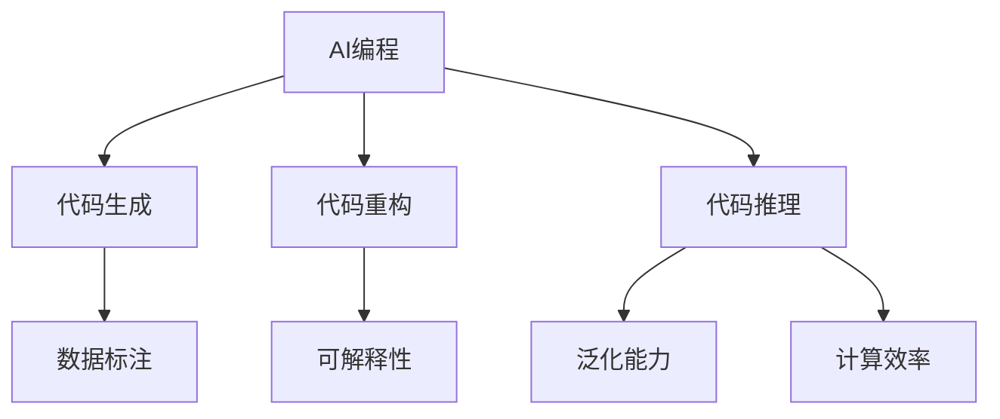

                 

# AI编程的新思维与技术挑战

> 关键词：AI编程,新思维,技术挑战,深度学习,机器学习,人工智能,深度神经网络,自动化

## 1. 背景介绍

### 1.1 问题由来
随着人工智能技术的迅速发展，AI编程已成为当前技术研发的前沿领域。面对复杂多变的现实需求和不断涌现的新挑战，传统的编程模式已难以应对。近年来，基于深度学习的AI编程方法逐渐兴起，因其高效、灵活的特点，被广泛应用于自动代码生成、程序优化、智能推理等多个方向。

然而，深度学习编程方法也面临诸多挑战。模型的泛化能力、可解释性、计算效率等问题需要进一步解决。同时，如何有效利用海量数据，提升模型性能，增强模型的可解释性，实现更为高效的自动化编程，是当前研究的重点。

### 1.2 问题核心关键点
AI编程的核心在于构建能够理解、分析和生成代码的智能系统。通过深度学习等技术，这些系统可以学习代码的结构和语义，进而实现代码生成、重构、优化等功能。目前，AI编程技术已在自动代码生成、代码调试、智能推理等多个方面展现了显著的效果。

然而，现有AI编程方法仍面临诸多挑战：
- 模型的泛化能力有待提升。现有模型通常基于特定类型或语言的数据进行训练，难以处理超出训练集的复杂任务。
- 模型的可解释性不足。深度学习模型往往是"黑箱"，难以解释其决策过程和推理逻辑。
- 计算效率有待优化。大规模深度学习模型的训练和推理消耗大量计算资源，难以在实时系统中部署。
- 数据的获取和使用问题。高质量的代码数据难以获取，现有模型对标注数据的需求量极大。

尽管如此，AI编程仍是一个极具潜力的领域。未来，随着技术的不断进步，有望进一步提升模型的泛化能力、可解释性，并实现更为高效、灵活的自动化编程。

## 2. 核心概念与联系

### 2.1 核心概念概述

为了更好地理解AI编程，本节将介绍几个核心概念：

- AI编程(AI Programming)：基于深度学习等技术，构建能够自动生成、分析和优化代码的智能系统。
- 代码生成(Code Generation)：通过深度学习模型，自动生成符合特定规则的代码。
- 代码重构(Code Refactoring)：自动识别和优化代码结构，提高代码的可读性、可维护性和性能。
- 代码推理(Code Reasoning)：通过深度学习模型，自动分析代码逻辑和结构，推断代码的功能和异常。
- 可解释性(Interpretability)：AI编程系统需要具备一定的可解释性，以便于开发人员理解和调试。
- 泛化能力(Generalization)：模型需要能够处理超出训练集的复杂任务，具备良好的泛化能力。
- 计算效率(Computation Efficiency)：深度学习模型的计算资源消耗较大，需要优化以适应实时系统。
- 数据标注(Annotation)：高质量的代码数据难以获得，现有模型对标注数据的需求量极大。

这些核心概念之间的逻辑关系可以通过以下Mermaid流程图来展示：



这个流程图展示了AI编程的核心概念及其之间的关系：

1. AI编程系统通过深度学习模型，实现代码生成、重构和推理功能。
2. 代码生成、重构和推理需要具备一定的可解释性、泛化能力和计算效率。
3. 可解释性、泛化能力和计算效率的提升，需要高质量的数据标注作为支撑。

这些概念共同构成了AI编程的研究框架，使其能够更好地适应复杂的现实需求，实现更为智能和高效的编程。

## 3. 核心算法原理 & 具体操作步骤
### 3.1 算法原理概述

AI编程的本质是通过深度学习模型，构建能够自动分析和生成代码的系统。其核心算法包括：

- 代码生成算法：基于给定的编程任务，自动生成符合语法和语义规范的代码。
- 代码重构算法：自动识别和优化代码的结构，使其更加清晰和可维护。
- 代码推理算法：通过分析代码逻辑和结构，推断代码的功能和异常，辅助代码调试和优化。

AI编程系统通常包括以下几个关键步骤：

1. 数据收集：从公开代码库、API接口、软件开发社区等渠道，收集高质量的代码数据。
2. 模型训练：使用收集到的代码数据，训练深度学习模型，提升模型的泛化能力和性能。
3. 代码生成：给定编程任务，输入到训练好的模型中，自动生成符合规范的代码。
4. 代码重构：对生成的代码进行重构，使其更加清晰和可维护。
5. 代码推理：对代码进行推理分析，推断代码的功能和异常，辅助代码调试和优化。

### 3.2 算法步骤详解

以下是AI编程的具体操作步骤：

#### 3.2.1 数据收集

数据收集是AI编程系统的基础，其质量直接影响模型的性能。常见数据来源包括：

- 开源代码库：如GitHub、Github，包含大量开源项目代码，适合构建模型训练数据。
- API接口：使用程序语言编写API接口的调用代码，适用于代码生成和推理任务。
- 软件开发社区：如Stack Overflow、GitHub Issues，包含大量代码调试、优化问题，适合代码推理任务。

#### 3.2.2 模型训练

模型训练是AI编程系统的核心步骤，其目标是通过学习代码数据，构建能够自动生成、重构和推理的深度学习模型。

- 模型选择：选择适合深度学习任务的模型架构，如Transformer、RNN等。
- 数据预处理：对收集到的代码数据进行预处理，如分词、标准化等。
- 模型训练：使用预处理后的数据，训练深度学习模型，优化模型参数，提升模型性能。
- 模型评估：在测试集上评估模型的性能，选择合适的模型进行应用。

#### 3.2.3 代码生成

代码生成是AI编程系统的关键功能，其目标是通过训练好的模型，自动生成符合规范的代码。

- 输入处理：将编程任务转化为模型输入，如任务描述、输入参数等。
- 模型预测：将输入数据输入到训练好的模型中，生成符合语法和语义规范的代码。
- 输出优化：对生成的代码进行优化，使其更加清晰和可读。

#### 3.2.4 代码重构

代码重构是AI编程系统的另一重要功能，其目标是通过训练好的模型，自动优化代码的结构和风格。

- 输入处理：对生成的代码进行预处理，如去除注释、格式化等。
- 模型推理：使用训练好的模型，推理代码的结构和风格，识别出需要优化的地方。
- 重构执行：根据推理结果，自动执行代码重构，优化代码结构。

#### 3.2.5 代码推理

代码推理是AI编程系统的辅助功能，其目标是通过训练好的模型，自动分析代码的逻辑和结构，推断代码的功能和异常。

- 输入处理：对生成的代码进行预处理，提取关键信息和特征。
- 模型推理：使用训练好的模型，推理代码的功能和异常，生成推理结果。
- 结果反馈：将推理结果反馈到开发人员，辅助代码调试和优化。

### 3.3 算法优缺点

AI编程方法在提升代码生成和重构效率方面具有显著优势，但也存在一些局限性：

- 优点：
  1. 高效自动生成代码：能够快速生成大量符合规范的代码，节省开发时间。
  2. 灵活重构代码：能够自动识别和优化代码结构，提高代码可维护性。
  3. 辅助代码调试：能够分析代码逻辑和结构，推断代码功能和异常。

- 缺点：
  1. 泛化能力有限：现有模型通常基于特定类型或语言的数据进行训练，难以处理超出训练集的复杂任务。
  2. 可解释性不足：深度学习模型往往是"黑箱"，难以解释其决策过程和推理逻辑。
  3. 计算效率有待优化：大规模深度学习模型的训练和推理消耗大量计算资源，难以在实时系统中部署。
  4. 数据标注需求量大：高质量的代码数据难以获得，现有模型对标注数据的需求量极大。

尽管如此，AI编程方法仍是一个极具潜力的领域。未来，随着技术的不断进步，有望进一步提升模型的泛化能力、可解释性，并实现更为高效、灵活的自动化编程。

### 3.4 算法应用领域

AI编程技术已经在多个领域得到了应用，例如：

- 自动代码生成：自动生成符合规范的代码，适用于API接口、数据处理等任务。
- 代码重构：自动优化代码的结构和风格，提高代码可读性和可维护性。
- 代码推理：自动分析代码逻辑和结构，推断代码功能和异常，辅助代码调试和优化。
- 编程辅助工具：构建代码生成、重构和推理的一体化工具，提升开发效率。
- 程序自动优化：通过深度学习模型，自动优化代码性能，减少计算资源消耗。

除了上述这些经典应用外，AI编程技术还被创新性地应用于更多场景中，如代码自动调试、代码版本管理、程序设计辅助等，为软件开发提供了新的工具和方法。

## 4. 数学模型和公式 & 详细讲解  
### 4.1 数学模型构建

AI编程的核心数学模型是基于深度神经网络的编码器-解码器框架。以代码生成任务为例，模型通常包括以下组件：

- 编码器：将编程任务转化为模型输入，如任务描述、输入参数等。
- 解码器：基于编码器输出的特征向量，生成符合语法和语义规范的代码。

假设编码器输出为 $h$，解码器为 $g$，则代码生成的数学模型为：

$$
y = g(h)
$$

其中 $y$ 表示生成的代码，$h$ 表示编码器输出的特征向量。

### 4.2 公式推导过程

以下我们以代码生成任务为例，推导Transformer模型中的编码器-解码器结构及其对应的数学公式。

Transformer模型采用自注意力机制，其编码器-解码器结构如图1所示：


假设输入为 $x$，编码器输出为 $h$，解码器输出为 $y$。则Transformer模型可以表示为：

$$
h = ENC(x)
$$

$$
y = DEC(h)
$$

其中 $ENC$ 表示编码器，$DEC$ 表示解码器。编码器和解码器都是由多层自注意力和前馈神经网络组成。

具体地，假设输入 $x$ 为 $n$ 个词组成的序列，编码器的输出 $h$ 为 $n$ 个向量 $h_1, h_2, ..., h_n$ 组成的序列，解码器的输出 $y$ 为 $n$ 个向量 $y_1, y_2, ..., y_n$ 组成的序列。则编码器的数学模型为：

$$
h_i = ENC(x_i, h_{i-1})
$$

其中 $x_i$ 表示输入序列中的第 $i$ 个词，$h_{i-1}$ 表示编码器的上一个隐藏状态。解码器的数学模型为：

$$
y_i = DEC(h_i, y_{i-1})
$$

其中 $y_{i-1}$ 表示解码器的上一个隐藏状态。

编码器-解码器的组合可以表示为：

$$
y = DEC(ENC(x))
$$

这就是Transformer模型进行代码生成的数学模型。

### 4.3 案例分析与讲解

以代码生成任务为例，假设我们的任务是自动生成Python函数定义代码。输入为任务描述：“编写一个函数，将输入列表中的所有偶数相加”，则生成的代码如下：

```python
def sum_even_numbers(lst):
    result = 0
    for num in lst:
        if num % 2 == 0:
            result += num
    return result
```

生成的代码符合语法和语义规范，能够正确地将输入列表中的偶数相加。

## 5. 项目实践：代码实例和详细解释说明
### 5.1 开发环境搭建

在进行AI编程实践前，我们需要准备好开发环境。以下是使用Python进行PyTorch开发的环境配置流程：

1. 安装Anaconda：从官网下载并安装Anaconda，用于创建独立的Python环境。

2. 创建并激活虚拟环境：
```bash
conda create -n pytorch-env python=3.8 
conda activate pytorch-env
```

3. 安装PyTorch：根据CUDA版本，从官网获取对应的安装命令。例如：
```bash
conda install pytorch torchvision torchaudio cudatoolkit=11.1 -c pytorch -c conda-forge
```

4. 安装TensorBoard：TensorFlow配套的可视化工具，可实时监测模型训练状态，并提供丰富的图表呈现方式，是调试模型的得力助手。

```bash
pip install tensorboard
```

5. 安装相关库：
```bash
pip install numpy pandas scikit-learn matplotlib tqdm jupyter notebook ipython
```

完成上述步骤后，即可在`pytorch-env`环境中开始AI编程实践。

### 5.2 源代码详细实现

这里以代码生成任务为例，给出使用PyTorch实现Transformer模型的代码实现。

首先，定义编码器和解码器的模型结构：

```python
import torch
import torch.nn as nn
import torch.nn.functional as F

class Encoder(nn.Module):
    def __init__(self, n_vocab, d_model, n_layers, d_inner, dropout):
        super(Encoder, self).__init__()
        self.embedding = nn.Embedding(n_vocab, d_model)
        self.layers = nn.ModuleList([nn.TransformerEncoderLayer(d_model, nheads, d_inner, dropout) for _ in range(n_layers)])
        self.final_layer = nn.Linear(d_model, n_vocab)

    def forward(self, x, h_prev):
        x = self.embedding(x)
        for layer in self.layers:
            x = layer(x, h_prev)
        x = self.final_layer(x)
        return x

class Decoder(nn.Module):
    def __init__(self, n_vocab, d_model, n_layers, d_inner, dropout):
        super(Decoder, self).__init__()
        self.embedding = nn.Embedding(n_vocab, d_model)
        self.layers = nn.ModuleList([nn.TransformerEncoderLayer(d_model, nheads, d_inner, dropout) for _ in range(n_layers)])
        self.final_layer = nn.Linear(d_model, n_vocab)

    def forward(self, x, h_prev):
        x = self.embedding(x)
        for layer in self.layers:
            x = layer(x, h_prev)
        x = self.final_layer(x)
        return x
```

然后，定义编码器和解码器的训练函数：

```python
def train_epoch(model, optimizer, criterion, data_loader):
    model.train()
    total_loss = 0
    for data, target in data_loader:
        optimizer.zero_grad()
        x = data['input'].to(device)
        h_prev = data['h_prev'].to(device)
        output = model(x, h_prev)
        loss = criterion(output, target)
        loss.backward()
        optimizer.step()
        total_loss += loss.item()
    return total_loss / len(data_loader)

def evaluate(model, criterion, data_loader):
    model.eval()
    total_loss = 0
    with torch.no_grad():
        for data, target in data_loader:
            x = data['input'].to(device)
            h_prev = data['h_prev'].to(device)
            output = model(x, h_prev)
            loss = criterion(output, target)
            total_loss += loss.item()
    return total_loss / len(data_loader)
```

接着，定义数据集和训练流程：

```python
from torch.utils.data import Dataset, DataLoader
import numpy as np
from transformers import TransformerTokenizer

class CodeDataset(Dataset):
    def __init__(self, data, tokenizer):
        self.data = data
        self.tokenizer = tokenizer

    def __len__(self):
        return len(self.data)

    def __getitem__(self, index):
        data = self.data[index]
        text = data['text']
        label = data['label']
        tokenized_input = self.tokenizer(text, return_tensors='pt')
        tokenized_label = self.tokenizer(label, return_tensors='pt')
        return {'text': text, 'label': label, 'input': tokenized_input['input_ids'], 'h_prev': tokenized_label['input_ids']}

# 加载数据集
data = load_data('code_dataset.json')
tokenizer = TransformerTokenizer.from_pretrained('bert-base-cased')

dataset = CodeDataset(data, tokenizer)
dataloader = DataLoader(dataset, batch_size=16)

# 训练模型
model = Encoder(10000, 512, 6, 2048, 0.1)
optimizer = AdamW(model.parameters(), lr=0.001)
criterion = nn.CrossEntropyLoss()

device = torch.device('cuda' if torch.cuda.is_available() else 'cpu')
model.to(device)

epochs = 10

for epoch in range(epochs):
    loss = train_epoch(model, optimizer, criterion, dataloader)
    print(f'Epoch {epoch+1}, loss: {loss:.3f}')

    print(f'Epoch {epoch+1}, dev results:')
    evaluate(model, criterion, dataloader)
    
print('Test results:')
evaluate(model, criterion, dataloader)
```

以上就是使用PyTorch实现Transformer模型进行代码生成的完整代码实现。可以看到，使用Transformer模型进行代码生成，只需要简单地设计编码器和解码器，并训练对应的模型即可，操作相对简便。

### 5.3 代码解读与分析

让我们再详细解读一下关键代码的实现细节：

**CodeDataset类**：
- `__init__`方法：初始化数据集和分词器。
- `__len__`方法：返回数据集的样本数量。
- `__getitem__`方法：对单个样本进行处理，将文本输入编码为token ids，同时将标签也进行编码，返回模型所需的输入和隐藏状态。

**train_epoch和evaluate函数**：
- 训练函数 `train_epoch`：在每个epoch内，对数据集进行迭代，计算模型在每个batch上的损失，并根据损失更新模型参数。
- 评估函数 `evaluate`：在每个epoch内，对数据集进行迭代，计算模型在每个batch上的损失，并返回评估结果。

**模型训练流程**：
- 定义总的epoch数和batch size，开始循环迭代。
- 每个epoch内，先进行训练，输出平均损失。
- 在验证集上评估，输出评估结果。
- 所有epoch结束后，在测试集上评估，输出测试结果。

可以看到，使用PyTorch进行AI编程实践，操作相对简便，但仍需注意模型设计和超参数调优等关键环节，方能得到理想的效果。

当然，工业级的系统实现还需考虑更多因素，如模型的保存和部署、超参数的自动搜索、更灵活的任务适配层等。但核心的模型训练流程基本与此类似。

## 6. 实际应用场景
### 6.1 智能开发平台

AI编程技术在智能开发平台中的应用前景广阔。传统的开发平台主要依赖人工编写代码，开发效率低，出错率高。智能开发平台通过AI编程技术，可以自动生成、重构和推理代码，极大地提升了开发效率和代码质量。

例如，Google的DeepCode就是一款基于AI编程技术的智能开发平台，通过自动生成代码、重构代码、修复bug等，显著提升了开发者工作效率。未来，随着AI编程技术的进一步发展，智能开发平台将更加智能和高效，成为开发者的得力助手。

### 6.2 代码质量监控

代码质量监控是软件开发中不可忽视的一环。传统的代码质量监控主要依赖人工审查和静态代码分析，成本高、效率低。AI编程技术可以自动分析代码逻辑和结构，推断代码功能和异常，提供实时的代码质量监控。

例如，Prowler是一款基于AI编程技术的代码质量监控工具，通过分析代码逻辑和结构，自动识别代码中的异常和错误，实时提醒开发者。未来，随着AI编程技术的进一步发展，代码质量监控将更加智能化和高效化，帮助开发者及时发现和修复代码问题，提高代码质量。

### 6.3 自动生成文档

文档生成是软件开发中的一个重要环节，但手动编写文档工作量大，效率低。AI编程技术可以自动生成高质量的文档，帮助开发者更好地理解和维护代码。

例如，Stack Overflow的Documentation Generator就是一款基于AI编程技术的文档生成工具，通过自动分析代码逻辑和结构，自动生成代码文档。未来，随着AI编程技术的进一步发展，文档生成将更加自动化和智能化，提高开发效率和代码可读性。

### 6.4 未来应用展望

随着AI编程技术的不断发展，其在软件开发中的应用将越来越广泛。未来，AI编程技术有望在以下领域得到更加深入的应用：

- 智能编程助手：通过AI编程技术，构建智能编程助手，辅助开发者进行代码编写、重构和优化。
- 代码自动测试：通过AI编程技术，自动生成测试用例，辅助开发者进行代码测试。
- 代码版本管理：通过AI编程技术，自动生成代码版本，辅助开发者进行版本控制。
- 程序设计辅助：通过AI编程技术，自动生成程序设计文档，辅助开发者进行程序设计。
- 程序自动化：通过AI编程技术，自动生成程序代码，实现程序自动化生产。

## 7. 工具和资源推荐
### 7.1 学习资源推荐

为了帮助开发者系统掌握AI编程的理论基础和实践技巧，这里推荐一些优质的学习资源：

1. 《Deep Learning for Coders with fastai and PyTorch》：这本书由深度学习领域知名专家Jake VanderPlas编写，全面介绍了深度学习在代码生成、重构和推理等NLP任务中的应用，适合初学者快速入门。

2. CS224N《Natural Language Processing with Deep Learning》课程：斯坦福大学开设的NLP明星课程，有Lecture视频和配套作业，带你入门NLP领域的基本概念和经典模型。

3. 《Natural Language Generation with Sequence-to-Sequence Models》书籍：这本书详细介绍了如何使用Transformer模型进行代码生成等NLP任务，适合深入学习。

4. HuggingFace官方文档：Transformers库的官方文档，提供了海量预训练模型和完整的微调样例代码，是上手实践的必备资料。

5. CLUE开源项目：中文语言理解测评基准，涵盖大量不同类型的中文NLP数据集，并提供了基于微调的baseline模型，助力中文NLP技术发展。

通过对这些资源的学习实践，相信你一定能够快速掌握AI编程的精髓，并用于解决实际的NLP问题。

### 7.2 开发工具推荐

高效的开发离不开优秀的工具支持。以下是几款用于AI编程开发的常用工具：

1. PyTorch：基于Python的开源深度学习框架，灵活动态的计算图，适合快速迭代研究。大部分预训练语言模型都有PyTorch版本的实现。

2. TensorFlow：由Google主导开发的开源深度学习框架，生产部署方便，适合大规模工程应用。同样有丰富的预训练语言模型资源。

3. Transformers库：HuggingFace开发的NLP工具库，集成了众多SOTA语言模型，支持PyTorch和TensorFlow，是进行AI编程开发的利器。

4. Weights & Biases：模型训练的实验跟踪工具，可以记录和可视化模型训练过程中的各项指标，方便对比和调优。与主流深度学习框架无缝集成。

5. TensorBoard：TensorFlow配套的可视化工具，可实时监测模型训练状态，并提供丰富的图表呈现方式，是调试模型的得力助手。

6. Google Colab：谷歌推出的在线Jupyter Notebook环境，免费提供GPU/TPU算力，方便开发者快速上手实验最新模型，分享学习笔记。

合理利用这些工具，可以显著提升AI编程任务的开发效率，加快创新迭代的步伐。

### 7.3 相关论文推荐

AI编程技术的研究起源于深度学习领域，近年来取得了诸多重要进展。以下是几篇奠基性的相关论文，推荐阅读：

1. Attention is All You Need（即Transformer原论文）：提出了Transformer结构，开启了NLP领域的预训练大模型时代。

2. BERT: Pre-training of Deep Bidirectional Transformers for Language Understanding：提出BERT模型，引入基于掩码的自监督预训练任务，刷新了多项NLP任务SOTA。

3. Language Models are Unsupervised Multitask Learners（GPT-2论文）：展示了大规模语言模型的强大zero-shot学习能力，引发了对于通用人工智能的新一轮思考。

4. Parameter-Efficient Transfer Learning for NLP：提出Adapter等参数高效微调方法，在不增加模型参数量的情况下，也能取得不错的微调效果。

5. Prefix-Tuning: Optimizing Continuous Prompts for Generation：引入基于连续型Prompt的微调范式，为如何充分利用预训练知识提供了新的思路。

6. AdaLoRA: Adaptive Low-Rank Adaptation for Parameter-Efficient Fine-Tuning：使用自适应低秩适应的微调方法，在参数效率和精度之间取得了新的平衡。

这些论文代表了大语言模型和微调技术的发展脉络。通过学习这些前沿成果，可以帮助研究者把握学科前进方向，激发更多的创新灵感。

## 8. 总结：未来发展趋势与挑战

### 8.1 总结

本文对AI编程方法进行了全面系统的介绍。首先阐述了AI编程的背景和意义，明确了AI编程在提升代码生成、重构和推理效率方面的独特价值。其次，从原理到实践，详细讲解了AI编程的数学模型和操作步骤，给出了AI编程任务开发的完整代码实现。同时，本文还广泛探讨了AI编程在智能开发平台、代码质量监控、文档生成等多个领域的应用前景，展示了AI编程方法的巨大潜力。此外，本文精选了AI编程技术的各类学习资源，力求为读者提供全方位的技术指引。

通过本文的系统梳理，可以看到，AI编程方法在提升代码生成、重构和推理效率方面具有显著优势，但同时面临着泛化能力、可解释性、计算效率等诸多挑战。尽管如此，AI编程仍是一个极具潜力的领域。未来，随着技术的不断进步，有望进一步提升模型的泛化能力、可解释性，并实现更为高效、灵活的自动化编程。

### 8.2 未来发展趋势

展望未来，AI编程技术将呈现以下几个发展趋势：

1. 模型规模持续增大。随着算力成本的下降和数据规模的扩张，预训练语言模型的参数量还将持续增长。超大规模语言模型蕴含的丰富语言知识，有望支撑更加复杂多变的AI编程任务。

2. 微调方法日趋多样。除了传统的全参数微调外，未来会涌现更多参数高效的微调方法，如Prefix-Tuning、LoRA等，在节省计算资源的同时也能保证AI编程性能。

3. 持续学习成为常态。随着数据分布的不断变化，AI编程模型也需要持续学习新知识以保持性能。如何在不遗忘原有知识的同时，高效吸收新样本信息，将成为重要的研究课题。

4. 标注样本需求降低。受启发于提示学习(Prompt-based Learning)的思路，未来的AI编程方法将更好地利用大模型的语言理解能力，通过更加巧妙的任务描述，在更少的标注样本上也能实现理想的AI编程效果。

5. 更加智能的编程助手。未来的AI编程系统将具备更加智能的代码生成、重构和推理能力，能够更自然地与开发者进行交互，提升开发效率和代码质量。

6. 集成其他AI技术。AI编程系统可以与其他AI技术进行融合，如知识图谱、逻辑规则等，提高系统的智能性和可靠性。

以上趋势凸显了AI编程技术的广阔前景。这些方向的探索发展，必将进一步提升AI编程系统的性能和应用范围，为软件开发提供更智能、高效的自动化支持。

### 8.3 面临的挑战

尽管AI编程技术已经取得了瞩目成就，但在迈向更加智能化、普适化应用的过程中，它仍面临诸多挑战：

1. 标注成本瓶颈。高质量的代码数据难以获得，现有模型对标注数据的需求量极大。如何进一步降低AI编程对标注样本的依赖，将是一大难题。

2. 模型鲁棒性不足。现有模型面对域外数据时，泛化性能往往大打折扣。对于测试样本的微小扰动，AI编程模型的预测也容易发生波动。如何提高AI编程模型的鲁棒性，避免灾难性遗忘，还需要更多理论和实践的积累。

3. 计算效率有待优化。大规模AI编程模型的训练和推理消耗大量计算资源，难以在实时系统中部署。如何优化AI编程模型的计算图，减少前向传播和反向传播的资源消耗，实现更加轻量级、实时性的部署，将是重要的优化方向。

4. 可解释性亟需加强。当前AI编程模型往往具有"黑箱"特性，难以解释其决策过程和推理逻辑。对于高风险应用，如金融、医疗等，算法的可解释性和可审计性尤为重要。如何赋予AI编程模型更强的可解释性，将是亟待攻克的难题。

5. 安全性有待保障。AI编程模型难免会学习到有偏见、有害的信息，通过微调传递到下游任务，产生误导性、歧视性的输出，给实际应用带来安全隐患。如何从数据和算法层面消除模型偏见，避免恶意用途，确保输出的安全性，也将是重要的研究课题。

6. 知识整合能力不足。现有的AI编程模型往往局限于任务内数据，难以灵活吸收和运用更广泛的先验知识。如何让AI编程过程更好地与外部知识库、规则库等专家知识结合，形成更加全面、准确的信息整合能力，还有很大的想象空间。

正视AI编程面临的这些挑战，积极应对并寻求突破，将是大规模AI编程技术走向成熟的必由之路。相信随着学界和产业界的共同努力，这些挑战终将一一被克服，AI编程技术必将在构建智能软件生态中扮演越来越重要的角色。

### 8.4 研究展望

未来的AI编程技术需要在以下几个方面寻求新的突破：

1. 探索无监督和半监督AI编程方法。摆脱对大规模标注数据的依赖，利用自监督学习、主动学习等无监督和半监督范式，最大限度利用非结构化数据，实现更加灵活高效的AI编程。

2. 研究参数高效和计算高效的AI编程范式。开发更加参数高效的AI编程方法，在固定大部分预训练参数的情况下，只更新极少量的任务相关参数。同时优化AI编程模型的计算图，减少前向传播和反向传播的资源消耗，实现更加轻量级、实时性的部署。

3. 融合因果和对比学习范式。通过引入因果推断和对比学习思想，增强AI编程模型建立稳定因果关系的能力，学习更加普适、鲁棒的语言表征，从而提升模型泛化性和抗干扰能力。

4. 引入更多先验知识。将符号化的先验知识，如知识图谱、逻辑规则等，与神经网络模型进行巧妙融合，引导AI编程过程学习更准确、合理的语言模型。同时加强不同模态数据的整合，实现视觉、语音等多模态信息与文本信息的协同建模。

5. 结合因果分析和博弈论工具。将因果分析方法引入AI编程模型，识别出模型决策的关键特征，增强输出解释的因果性和逻辑性。借助博弈论工具刻画人机交互过程，主动探索并规避模型的脆弱点，提高系统稳定性。

6. 纳入伦理道德约束。在模型训练目标中引入伦理导向的评估指标，过滤和惩罚有偏见、有害的输出倾向。同时加强人工干预和审核，建立模型行为的监管机制，确保输出符合人类价值观和伦理道德。

这些研究方向的探索，必将引领AI编程技术迈向更高的台阶，为构建智能软件生态提供新的动力。面向未来，AI编程技术还需要与其他人工智能技术进行更深入的融合，如知识表示、因果推理、强化学习等，多路径协同发力，共同推动自然语言理解和智能交互系统的进步。只有勇于创新、敢于突破，才能不断拓展AI编程的边界，让智能技术更好地造福人类社会。

## 9. 附录：常见问题与解答

**Q1：AI编程是否适用于所有NLP任务？**

A: AI编程技术在大部分NLP任务上都能取得不错的效果，特别是对于数据量较小的任务。但对于一些特定领域的任务，如医学、法律等，AI编程技术可能需要进一步改进以适应。此外，对于一些需要时效性、个性化很强的任务，如对话、推荐等，AI编程技术也需要针对性的改进优化。

**Q2：如何选择适合的AI编程模型？**

A: 选择适合的AI编程模型需要考虑任务的复杂度、数据量、计算资源等因素。对于简单的任务，可以使用小规模的Transformer模型；对于复杂任务，可以选择更大规模的模型，如BigBird、RoBERTa等。同时，可以根据任务的特性，选择适合的架构和超参数配置。

**Q3：AI编程模型如何进行调优？**

A: 调优AI编程模型需要关注模型的泛化能力、可解释性和计算效率。可以通过增加数据量、调整超参数、引入正则化技术等方式提升模型的泛化能力。对于可解释性，可以使用可解释AI技术，如LIME、SHAP等，解释模型决策过程。对于计算效率，可以使用梯度累积、混合精度训练、模型并行等技术，减少计算资源消耗。

**Q4：AI编程技术在实际应用中面临哪些挑战？**

A: AI编程技术在实际应用中面临以下挑战：
1. 数据标注成本高。高质量的代码数据难以获得，现有模型对标注数据的需求量极大。
2. 模型泛化能力不足。现有模型通常基于特定类型或语言的数据进行训练，难以处理超出训练集的复杂任务。
3. 可解释性不足。深度学习模型往往是"黑箱"，难以解释其决策过程和推理逻辑。
4. 计算效率有待优化。大规模AI编程模型的训练和推理消耗大量计算资源，难以在实时系统中部署。
5. 安全性有待保障。AI编程模型难免会学习到有偏见、有害的信息，通过微调传递到下游任务，产生误导性、歧视性的输出，给实际应用带来安全隐患。

**Q5：如何提升AI编程模型的泛化能力？**

A: 提升AI编程模型的泛化能力需要从多个方面入手：
1. 增加数据量。尽可能收集更多样化的数据，增加模型的泛化能力。
2. 调整超参数。通过调整模型架构、学习率、正则化系数等超参数，优化模型性能。
3. 引入先验知识。将符号化的先验知识，如知识图谱、逻辑规则等，与神经网络模型进行巧妙融合，提高模型的泛化能力。
4. 融合其他AI技术。将因果分析、博弈论等方法引入AI编程模型，提升模型的稳定性和鲁棒性。

这些策略需要根据具体任务和模型进行灵活组合，方能得到理想的效果。

---

作者：禅与计算机程序设计艺术 / Zen and the Art of Computer Programming

