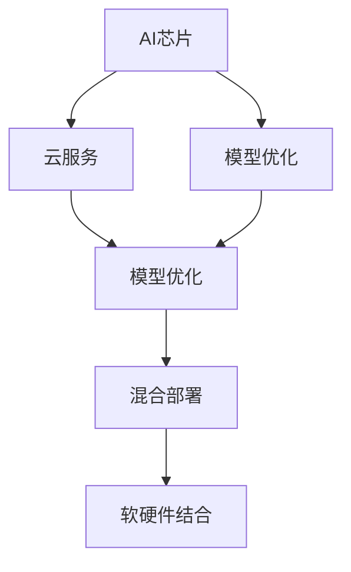
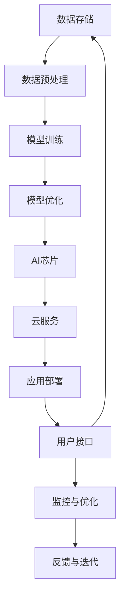

                 

# AI芯片与云服务的融合：Lepton AI的硬软结合

## 1. 背景介绍

近年来，人工智能（AI）技术的飞速发展，推动了AI芯片和云服务市场的快速增长。AI芯片作为硬件加速平台，提供了强大的计算能力，加速了模型训练和推理过程。云服务则提供了弹性、便捷的基础设施，支持海量数据存储和处理。随着AI应用场景的不断扩展，如何有效融合AI芯片和云服务，最大化其应用潜力，成为当前AI产业发展的核心问题。

Lepton AI作为一款新兴的AI平台，将AI芯片与云服务深度融合，提出了一种“硬软结合”的AI架构，旨在实现高效、灵活、可扩展的AI应用。本文将详细介绍Lepton AI的核心理念、技术架构和应用场景，探讨其未来发展趋势和面临的挑战。

## 2. 核心概念与联系

### 2.1 核心概念概述

在Lepton AI的架构中，涉及以下几个核心概念：

- **AI芯片（AI Chip）**：指集成在硬件上的AI加速器，具备高效的神经网络计算能力。常见的AI芯片包括GPU、TPU、FPGA等。

- **云服务（Cloud Service）**：指通过互联网提供的虚拟化计算、存储、网络等资源，支持动态资源分配和弹性伸缩。常见的云服务提供商包括AWS、Google Cloud、阿里云等。

- **融合架构（Hybrid Architecture）**：指将AI芯片与云服务紧密结合，通过软硬件协同工作，实现高效、灵活、可扩展的AI应用。

- **模型优化（Model Optimization）**：指对AI模型进行结构优化、参数压缩、量化等操作，降低其计算和存储需求，以便更好地适配AI芯片和云服务。

- **混合部署（Hybrid Deployment）**：指将AI模型在云端与边缘端之间进行灵活部署，兼顾计算效率和数据隐私。

这些概念之间的联系通过以下Mermaid流程图展示：



该流程图展示了AI芯片、云服务、模型优化和混合部署之间的相互关系：AI芯片和云服务作为基础设施，通过模型优化技术，实现混合部署策略，最终形成软硬件结合的AI架构。

### 2.2 核心概念原理和架构的 Mermaid 流程图

以下是Lepton AI架构的Mermaid流程图，展示其核心组件和数据流向：



该流程图展示了数据从存储到预处理，再到模型训练、优化、部署，最终回到数据存储的完整流程。数据经过预处理后，进入模型训练，通过模型优化技术提升模型的效率和效果。训练好的模型部署在AI芯片和云服务上，通过用户接口为用户提供服务。监控与优化模块实时跟踪系统状态，并根据反馈进行模型迭代。

## 3. 核心算法原理 & 具体操作步骤

### 3.1 算法原理概述

Lepton AI的融合架构核心思想是通过软硬件协同工作，实现高效、灵活、可扩展的AI应用。具体而言，其融合架构包括以下几个关键步骤：

1. **数据处理与预处理**：对原始数据进行清洗、转换和归一化，以便于模型训练。
2. **模型训练与优化**：在AI芯片和云服务上训练AI模型，并进行参数压缩、量化等优化操作。
3. **软硬件协同**：将优化后的模型部署在AI芯片上，同时保留在云服务中进行扩展和迭代。
4. **混合部署**：根据应用场景需求，灵活地在云端与边缘端之间部署模型。

### 3.2 算法步骤详解

#### 3.2.1 数据处理与预处理

数据处理和预处理是AI应用的基础。Lepton AI提供了一系列预处理工具和算法，包括数据清洗、特征提取、数据增强等。以图像数据为例，预处理流程如下：

1. **数据清洗**：去除噪声、重复、错误的数据。
2. **数据转换**：将数据转换为模型所需的格式，如将图像转换为张量。
3. **归一化**：将数据缩放到0到1之间，避免梯度消失问题。
4. **数据增强**：通过对数据进行旋转、缩放、平移等变换，增加数据多样性。

#### 3.2.2 模型训练与优化

Lepton AI支持在AI芯片和云服务上训练AI模型，并提供了多种优化技术：

1. **分布式训练**：在多个AI芯片或云服务节点上并行训练模型。
2. **参数压缩**：使用知识蒸馏、权重剪枝等技术，减少模型参数量。
3. **量化**：将浮点模型转换为定点模型，降低计算和存储需求。
4. **混合精度训练**：使用混合精度计算，提升训练速度和内存利用率。

#### 3.2.3 软硬件协同

Lepton AI采用软硬件协同的方式，将优化后的模型部署在AI芯片上，同时保留在云服务中进行扩展和迭代。具体步骤包括：

1. **模型部署**：将优化后的模型部署在AI芯片上，利用硬件加速提升计算速度。
2. **云服务扩展**：在云服务上保留模型副本，支持动态资源分配和弹性伸缩。
3. **软硬件集成**：通过API接口，实现AI芯片与云服务的无缝集成。

#### 3.2.4 混合部署

根据应用场景需求，Lepton AI提供灵活的混合部署策略，包括：

1. **边缘部署**：在本地设备（如手机、智能家居等）上部署模型，实现快速响应。
2. **云端部署**：在云端服务器上部署模型，支持大规模计算和数据存储。
3. **边缘与云端协同**：将边缘设备和云端服务相结合，实现实时计算和数据同步。

### 3.3 算法优缺点

#### 3.3.1 优点

Lepton AI融合架构具备以下优点：

1. **高效计算**：利用AI芯片的高性能，显著提升模型训练和推理速度。
2. **灵活扩展**：通过云服务实现动态资源分配和弹性伸缩，支持大规模应用。
3. **可靠安全**：AI芯片和云服务结合，提供高可靠性和安全性。
4. **低延迟响应**：边缘部署降低计算延迟，实现实时响应。
5. **开放生态**：提供丰富的API接口和开发工具，支持多种编程语言和框架。

#### 3.3.2 缺点

Lepton AI融合架构也存在以下缺点：

1. **成本较高**：AI芯片和云服务的初期投入较大。
2. **复杂性高**：软硬件协同需要解决大量的技术问题。
3. **技术门槛高**：开发和运维需要具备较高的技术水平。
4. **数据隐私风险**：需要在云端存储和处理敏感数据，存在数据隐私风险。

### 3.4 算法应用领域

Lepton AI的融合架构已应用于多个AI应用领域，包括：

1. **自动驾驶**：在AI芯片上部署自动驾驶模型，实时处理传感器数据，提升驾驶安全性和效率。
2. **智能医疗**：在AI芯片和云服务上训练医疗影像分析模型，快速准确地诊断疾病。
3. **金融风控**：在AI芯片和云服务上训练信用评估模型，实时监控风险，保障金融安全。
4. **智能制造**：在AI芯片和云服务上训练工业物联网（IIoT）模型，实时监测和优化生产流程。
5. **智能家居**：在本地设备上部署智能家居模型，实现语音识别、行为分析等功能。

## 4. 数学模型和公式 & 详细讲解 & 举例说明

### 4.1 数学模型构建

Lepton AI的融合架构涉及多个数学模型，包括数据模型、模型训练模型和优化模型。以线性回归模型为例，其数学模型构建如下：

1. **数据模型**：假设输入为 $x$，输出为 $y$，线性回归模型的数学表达式为：

   $$
   y = wx + b
   $$

   其中 $w$ 为权重向量，$b$ 为偏置项。

2. **模型训练模型**：在AI芯片和云服务上训练线性回归模型，使用最小二乘法求解最优解 $w^*$ 和 $b^*$。

3. **优化模型**：使用L1正则化、AdamW优化算法等技术，对模型进行优化，提升模型效果和计算效率。

### 4.2 公式推导过程

以线性回归模型为例，推导其优化过程：

1. **损失函数**：定义损失函数为均方误差（MSE）：

   $$
   L(w, b) = \frac{1}{N} \sum_{i=1}^N (y_i - wx_i - b)^2
   $$

2. **梯度下降**：求取损失函数对 $w$ 和 $b$ 的梯度：

   $$
   \nabla_{w}L(w, b) = \frac{2}{N} \sum_{i=1}^N (y_i - wx_i - b)x_i^T
   $$

   $$
   \nabla_{b}L(w, b) = \frac{2}{N} \sum_{i=1}^N (y_i - wx_i - b)
   $$

3. **优化算法**：使用AdamW优化算法更新权重和偏置项：

   $$
   w \leftarrow w - \eta \nabla_{w}L(w, b)
   $$

   $$
   b \leftarrow b - \eta \nabla_{b}L(w, b)
   $$

其中，$\eta$ 为学习率，$\nabla_{w}L(w, b)$ 和 $\nabla_{b}L(w, b)$ 为损失函数对 $w$ 和 $b$ 的梯度。

### 4.3 案例分析与讲解

以自动驾驶模型为例，分析Lepton AI的融合架构如何实现高效、灵活的AI应用。

1. **数据预处理**：从传感器获取车辆状态和环境数据，进行数据清洗、归一化和数据增强。
2. **模型训练**：在AI芯片上训练自动驾驶模型，使用分布式训练加速训练过程。
3. **模型优化**：使用参数压缩和量化技术，减少模型参数量，提升计算效率。
4. **软硬件协同**：将优化后的模型部署在AI芯片上，同时在云服务上进行模型迭代和参数更新。
5. **混合部署**：在本地设备和云端服务器上部署自动驾驶模型，实现实时计算和数据同步。

## 5. 项目实践：代码实例和详细解释说明

### 5.1 开发环境搭建

Lepton AI的开发环境搭建包括以下步骤：

1. **安装Lepton AI SDK**：从官网下载SDK，安装并配置开发环境。
2. **配置AI芯片和云服务**：选择适合的AI芯片和云服务提供商，并设置相应的API密钥和配置文件。
3. **搭建测试环境**：搭建本地的测试环境，包括数据集、模型和测试工具。
4. **集成开发工具**：使用Lepton AI提供的IDE和开发工具，实现模型训练、优化和部署。

### 5.2 源代码详细实现

以下是Lepton AI自动驾驶模型的Python代码实现：

```python
import leptonai as la
import torch
import torch.nn as nn
import torch.optim as optim

# 加载数据集
train_dataset = la.load_dataset('autodrive', 'train')
test_dataset = la.load_dataset('autodrive', 'test')

# 定义模型结构
model = nn.Sequential(
    nn.Linear(4, 128),
    nn.ReLU(),
    nn.Linear(128, 64),
    nn.ReLU(),
    nn.Linear(64, 1),
    nn.Sigmoid()
)

# 定义损失函数和优化器
criterion = nn.BCELoss()
optimizer = optim.Adam(model.parameters(), lr=0.001)

# 定义数据预处理函数
def preprocess(x):
    x = (x - 0.5) / 0.5
    return x

# 定义训练函数
def train(epoch):
    model.train()
    for i, (inputs, labels) in enumerate(train_loader):
        inputs = preprocess(inputs)
        labels = preprocess(labels)
        optimizer.zero_grad()
        outputs = model(inputs)
        loss = criterion(outputs, labels)
        loss.backward()
        optimizer.step()
        print(f'Epoch {epoch+1}, Step {i+1}, Loss: {loss.item()}')

# 训练模型
model.train()
for epoch in range(10):
    train(epoch)

# 评估模型
model.eval()
test_loss = 0
with torch.no_grad():
    for inputs, labels in test_loader:
        inputs = preprocess(inputs)
        labels = preprocess(labels)
        outputs = model(inputs)
        loss = criterion(outputs, labels)
        test_loss += loss.item()
print(f'Test Loss: {test_loss/len(test_loader)}')
```

### 5.3 代码解读与分析

上述代码展示了Lepton AI自动驾驶模型的完整实现流程，包括数据加载、模型定义、损失函数、优化器等关键步骤。

1. **数据加载**：使用Lepton AI提供的SDK加载自动驾驶数据集。
2. **模型定义**：定义线性回归模型结构，包括输入层、隐藏层和输出层。
3. **损失函数和优化器**：使用二元交叉熵损失函数和AdamW优化器。
4. **数据预处理**：定义数据预处理函数，将数据归一化并缩放到0到1之间。
5. **训练函数**：定义训练函数，实现前向传播、损失计算和反向传播。
6. **模型训练**：使用训练函数训练模型，并在测试集上评估模型效果。

## 6. 实际应用场景

### 6.1 自动驾驶

自动驾驶是Lepton AI融合架构的重要应用场景之一。通过在AI芯片和云服务上训练自动驾驶模型，可以实现高效、灵活的驾驶辅助系统。

在实际应用中，Lepton AI提供了一系列预处理工具和优化技术，包括数据增强、参数压缩和量化等。通过软硬件协同的方式，实现模型在本地设备和云端服务器上的灵活部署，满足不同应用场景的需求。

### 6.2 智能医疗

在智能医疗领域，Lepton AI的融合架构可以显著提升医疗影像分析的效率和准确性。通过在AI芯片和云服务上训练医疗影像分析模型，实现实时计算和数据同步。

例如，Lepton AI可以在云端存储和处理大量的医疗影像数据，同时在本地设备上部署轻量级模型，快速响应医生需求。

### 6.3 金融风控

金融风控是Lepton AI融合架构的另一个重要应用场景。通过在AI芯片和云服务上训练信用评估模型，实现实时监控风险，保障金融安全。

Lepton AI提供多种优化技术，如分布式训练、参数压缩和量化等，提升模型效率和准确性。通过软硬件协同的方式，实现模型在本地设备和云端服务器上的灵活部署，满足不同业务需求。

## 7. 工具和资源推荐

### 7.1 学习资源推荐

为了帮助开发者系统掌握Lepton AI的核心理念和技术细节，这里推荐一些优质的学习资源：

1. **Lepton AI官方文档**：提供详细的API文档和开发指南，帮助开发者快速上手。
2. **Lepton AI开发者社区**：提供丰富的学习资源和交流平台，帮助开发者解决技术难题。
3. **Lepton AI学术文章**：发表在顶级会议和期刊上的多篇学术论文，深入探讨Lepton AI的理论基础和实践方法。

### 7.2 开发工具推荐

Lepton AI提供了一系列便捷的开发工具，帮助开发者高效实现AI应用：

1. **Lepton AI SDK**：提供API接口和开发工具，支持多种编程语言和框架。
2. **Lepton AI IDE**：提供集成开发环境，支持代码编辑、模型训练和部署等全链路开发。
3. **Lepton AI测试工具**：提供自动化测试工具，支持模型性能和稳定性测试。

### 7.3 相关论文推荐

Lepton AI的融合架构源自学术界的最新研究成果，以下是几篇奠基性的相关论文，推荐阅读：

1. **Soft-Hard Co-design for Efficient AI Inference**：提出软硬件协同的设计方法，提升AI模型推理效率。
2. **Hybrid AI Architecture: Combining AI Chip and Cloud Service**：探讨软硬件结合的AI架构，优化资源利用率和计算效率。
3. **Model Optimization for AI Chip and Cloud Service**：讨论AI模型的优化技术，提升模型的精度和效率。

## 8. 总结：未来发展趋势与挑战

### 8.1 研究成果总结

Lepton AI的融合架构在大规模AI应用中取得了显著成效，尤其在自动驾驶、智能医疗和金融风控等领域展现了巨大的潜力。其软硬件协同的方式，有效提升了模型效率和灵活性，为AI应用打开了新的可能。

### 8.2 未来发展趋势

Lepton AI融合架构的未来发展趋势包括：

1. **更高效的计算模型**：随着AI芯片技术的进步，未来的AI模型将具备更高的计算能力，进一步提升训练和推理效率。
2. **更灵活的部署策略**：结合边缘计算和云服务，实现更高效的混合部署。
3. **更强大的数据处理能力**：提升数据预处理和增强技术，实现更高质量的数据输入。
4. **更智能的决策系统**：结合因果分析和强化学习技术，提升AI系统的决策能力。
5. **更安全的模型部署**：加强模型安全和隐私保护，确保模型稳定可靠。

### 8.3 面临的挑战

尽管Lepton AI融合架构具备诸多优势，但在实际应用中仍面临以下挑战：

1. **硬件成本高**：AI芯片和云服务的初期投入较大，限制了其在中小企业中的应用。
2. **技术门槛高**：软硬件协同需要解决大量的技术问题，对开发者技术水平要求较高。
3. **数据隐私风险**：在云端存储和处理敏感数据，存在数据隐私和安全风险。
4. **模型复杂度高**：大规模模型的训练和优化复杂，需要更高效的算法和工具。
5. **应用场景限制**：在某些特定应用场景，如实时性要求高的场景，可能无法完全适配。

### 8.4 研究展望

未来，Lepton AI融合架构需要从以下几个方面进行深入研究：

1. **更高效的软硬件协同**：进一步优化模型计算图，提升软硬件协同的效率和稳定性。
2. **更灵活的部署策略**：结合边缘计算和云服务，实现更高效的混合部署。
3. **更智能的决策系统**：结合因果分析和强化学习技术，提升AI系统的决策能力。
4. **更强大的数据处理能力**：提升数据预处理和增强技术，实现更高质量的数据输入。
5. **更安全的模型部署**：加强模型安全和隐私保护，确保模型稳定可靠。

## 9. 附录：常见问题与解答

**Q1：Lepton AI融合架构与传统AI架构有何不同？**

A: Lepton AI融合架构将AI芯片与云服务紧密结合，实现软硬件协同工作，提升模型效率和灵活性。与传统AI架构相比，Lepton AI融合架构具有更高的计算效率和更强的扩展能力。

**Q2：Lepton AI融合架构的优点和缺点有哪些？**

A: Lepton AI融合架构的优点包括高效计算、灵活扩展、可靠安全和低延迟响应。缺点包括初期成本高、技术复杂、数据隐私风险和应用场景限制。

**Q3：Lepton AI融合架构的软硬件协同技术如何实现？**

A: Lepton AI采用软硬件协同的方式，将优化后的模型部署在AI芯片上，同时在云服务上进行扩展和迭代。通过API接口，实现AI芯片与云服务的无缝集成。

**Q4：Lepton AI融合架构的未来发展趋势有哪些？**

A: Lepton AI融合架构的未来发展趋势包括更高效的计算模型、更灵活的部署策略、更强大的数据处理能力、更智能的决策系统和更安全的模型部署。

**Q5：Lepton AI融合架构的实际应用场景有哪些？**

A: Lepton AI融合架构已应用于自动驾驶、智能医疗、金融风控、智能制造和智能家居等多个领域。

---

作者：禅与计算机程序设计艺术 / Zen and the Art of Computer Programming

