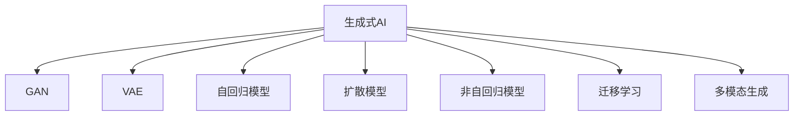

                 

# AI赋能：生成式AI如何改变我们的未来？

## 1. 背景介绍

### 1.1 问题由来

在过去的十年里，人工智能（AI）迅速从学术研究走向实际应用，极大地影响了各行各业。生成式AI（Generative AI）作为AI领域的一支新锐力量，通过生成新的数据、内容、图像、视频等多模态信息，正逐渐改变着我们的未来。

生成式AI主要分为两大类：基于规则的生成式AI和基于数据驱动的生成式AI。前者依赖于手写的规则，如规则引擎、专家系统等；后者则是通过机器学习（ML）和深度学习（DL）等技术，从数据中学习生成模式。

从数据驱动的生成式AI来看，早期的方法如隐马尔可夫模型（HMM）和条件随机场（CRF）等，虽然在语言模型、语音生成、图像处理等领域取得了一定的成功，但在大规模数据集上的表现和实际应用效果均不如人意。而基于神经网络的生成式AI，如生成对抗网络（GAN）和变分自编码器（VAE）等，其生成效果逐渐得到广泛认可。

### 1.2 问题核心关键点

生成式AI的核心在于如何通过深度学习模型，高效生成符合特定规则、分布或风格的新数据。这一过程主要包括以下关键步骤：

- **数据收集**：从不同来源收集大量样本数据。
- **模型训练**：利用收集到的数据对深度学习模型进行训练，学习数据的生成规律。
- **生成验证**：生成的新数据需要经过验证，确保与原始数据分布一致，且符合预期要求。
- **部署应用**：将训练好的模型部署到实际应用场景中，进行数据生成。

生成式AI的应用领域十分广泛，从内容创作、娱乐游戏、医疗保健到自动驾驶、个性化推荐等，都在逐步受益于生成式AI的强大能力。生成式AI不仅能够提升用户体验，还能降低成本、提高效率，为传统行业带来变革性的提升。

## 2. 核心概念与联系

### 2.1 核心概念概述

为更好地理解生成式AI的原理，本节将介绍几个关键概念：

- **生成式AI**：通过深度学习模型，生成与原始数据分布一致的新数据。常见的生成模型包括GAN、VAE、自回归模型等。
- **生成对抗网络（GAN）**：由生成器和判别器两个部分组成，通过对抗训练，生成高质量的新数据。
- **变分自编码器（VAE）**：通过编码器和解码器的变分推断，实现数据的生成与重构。
- **自回归模型**：如循环神经网络（RNN）、长短期记忆网络（LSTM）、Transformer等，能够生成有序序列数据。
- **扩散模型**：如扩散概率模型（DDPM）、非自回归模型等，能够高效生成高分辨率图像。
- **非自回归模型**：如变分自编码器（VAE）、标准化自回归模型等，能够生成结构化数据。
- **迁移学习**：将预训练模型应用于新任务，提升模型在新任务上的性能。
- **多模态生成**：通过融合多种数据源，生成更全面、丰富的多模态数据。

这些核心概念之间的逻辑关系可以通过以下Mermaid流程图来展示：



这个流程图展示了生成式AI的主要组成部分及其相互关系：

1. 生成式AI通过多种模型和技术生成新数据。
2. GAN、VAE等模型通过对抗或推断训练生成高质量数据。
3. 自回归模型能够生成有序序列数据。
4. 扩散模型能够高效生成高分辨率图像。
5. 迁移学习能够将预训练模型应用于新任务。
6. 多模态生成能够融合多种数据源生成丰富数据。

这些概念共同构成了生成式AI的生态系统，使其能够应对各类复杂的数据生成任务。

## 3. 核心算法原理 & 具体操作步骤
### 3.1 算法原理概述

生成式AI的算法原理主要基于深度学习模型，通过学习数据的生成分布，实现新数据的生成。以下是几种常见的生成模型及其原理概述：

- **生成对抗网络（GAN）**：由生成器（Generative Network）和判别器（Discriminative Network）两个部分组成，通过对抗训练，生成高质量的新数据。
- **变分自编码器（VAE）**：通过编码器和解码器的变分推断，实现数据的生成与重构。
- **自回归模型**：如循环神经网络（RNN）、长短期记忆网络（LSTM）、Transformer等，能够生成有序序列数据。
- **扩散模型**：如扩散概率模型（DDPM）、非自回归模型等，能够高效生成高分辨率图像。

### 3.2 算法步骤详解

以GAN为例，其核心步骤如下：

**Step 1: 准备数据集**
- 收集与任务相关的数据集，包括训练集和测试集。
- 将数据集分为正样本和负样本。

**Step 2: 搭建生成器和判别器**
- 使用PyTorch、TensorFlow等深度学习框架搭建生成器和判别器。
- 生成器通过噪声输入生成样本，判别器判断样本是否真实。
- 初始化模型参数。

**Step 3: 对抗训练**
- 在每次迭代中，生成器生成样本，判别器判断样本真伪，并给出判别分数。
- 根据判别器的输出，生成器调整生成策略，判别器调整判断能力。
- 逐步提升生成器生成样本的质量，降低判别器的误判率。

**Step 4: 评估和调整**
- 在测试集上评估生成器的生成质量，调整模型参数。
- 使用Wasserstein距离、Inception Score等指标评估生成质量。
- 根据评估结果，迭代优化生成器。

### 3.3 算法优缺点

生成式AI的主要优点包括：

- **生成效果逼真**：生成的数据质量高，分布与原始数据一致。
- **应用广泛**：可用于内容创作、图像生成、视频合成等领域。
- **自动化生成**：能够自动生成大量数据，减少人工标注成本。

同时，生成式AI也存在一些局限性：

- **训练复杂**：模型训练过程需要大量计算资源和时间。
- **数据依赖**：生成效果依赖于训练数据的质量和多样性。
- **生成多样性**：生成的数据可能存在多样性不足的问题。

### 3.4 算法应用领域

生成式AI在多个领域得到了广泛应用，主要包括：

- **内容创作**：如文章、音乐、视频等生成，提升内容创作效率。
- **医疗影像**：生成医学影像数据，辅助疾病诊断。
- **艺术设计**：生成艺术品、建筑设计等，拓宽创意表达空间。
- **智能游戏**：生成游戏内容，提升游戏体验。
- **个性化推荐**：生成用户行为数据，提升个性化推荐效果。
- **虚拟现实**：生成虚拟场景、角色等，构建沉浸式体验。
- **自动驾驶**：生成仿真数据，辅助自动驾驶算法训练。

## 4. 数学模型和公式 & 详细讲解  
### 4.1 数学模型构建

以GAN为例，其核心数学模型包括生成器（$G$）和判别器（$D$），以及损失函数和优化器。

假设$G$为生成器，$D$为判别器，$x$为真实样本，$z$为噪声，$G(z)$为生成样本，$y$为标签。则GAN的优化目标函数为：

$$
\min_{G}\max_{D} \mathbb{E}_{x}\log D(x) + \mathbb{E}_{z}\log (1 - D(G(z)))
$$

其中，$\log$为对数函数，$\mathbb{E}$为期望运算。

GAN的损失函数通常包括两个部分：生成器的损失和判别器的损失。生成器的损失为：

$$
\mathcal{L}_G = -\mathbb{E}_{z}\log D(G(z))
$$

判别器的损失为：

$$
\mathcal{L}_D = -\mathbb{E}_{x}\log D(x) - \mathbb{E}_{z}\log (1 - D(G(z)))
$$

在实际应用中，为了提高生成效果，通常会在生成器和判别器中加入正则化项，如L2正则化、Dropout等，以防止过拟合。

### 4.2 公式推导过程

以GAN为例，其核心推导过程如下：

1. **生成器损失函数推导**：生成器$G$的输出为$G(z)$，判别器$D$的输出为$D(G(z))$。为了使生成的数据尽可能逼近真实数据，生成器的目标是最小化判别器对生成数据的误判率，即最大化$D(G(z))$。因此生成器的损失函数为：

   $$
   \mathcal{L}_G = -\mathbb{E}_{z}\log D(G(z))
   $$

2. **判别器损失函数推导**：判别器$D$的输出为$D(x)$和$D(G(z))$。为了使判别器能够正确区分真实数据和生成数据，判别器的目标是最小化对真实数据的误判率，最大化对生成数据的误判率，即最大化$\log D(x)$，最小化$\log (1 - D(G(z)))$。因此判别器的损失函数为：

   $$
   \mathcal{L}_D = -\mathbb{E}_{x}\log D(x) - \mathbb{E}_{z}\log (1 - D(G(z)))
   $$

3. **联合优化**：为了最大化生成器的损失，最小化判别器的损失，GAN的联合优化目标函数为：

   $$
   \min_{G}\max_{D} \mathbb{E}_{x}\log D(x) + \mathbb{E}_{z}\log (1 - D(G(z)))
   $$

### 4.3 案例分析与讲解

以ImageNet上生成式AI的应用为例，探讨GAN在图像生成中的表现：

**步骤1：准备数据集**
- 收集ImageNet数据集，进行预处理，包括缩放、裁剪、标准化等。
- 将数据集分为训练集和测试集。

**步骤2：搭建生成器和判别器**
- 使用PyTorch框架搭建生成器和判别器，定义网络结构。
- 初始化模型参数，并进行小批量随机梯度下降（SGD）训练。

**步骤3：对抗训练**
- 在每次迭代中，生成器生成图像，判别器判断图像真伪，并给出判别分数。
- 根据判别器的输出，生成器调整生成策略，判别器调整判断能力。
- 逐步提升生成器生成图像的质量，降低判别器的误判率。

**步骤4：评估和调整**
- 在测试集上评估生成图像的质量，使用Inception Score等指标。
- 根据评估结果，调整模型参数，优化生成器。

最终，生成的图像质量逼近真实图像，可用于图像生成、图像增强、虚拟现实等领域。

## 5. 项目实践：代码实例和详细解释说明
### 5.1 开发环境搭建

在进行生成式AI的开发实践中，需要准备相应的开发环境。以下是使用Python进行PyTorch开发的环境配置流程：

1. 安装Anaconda：从官网下载并安装Anaconda，用于创建独立的Python环境。

2. 创建并激活虚拟环境：
```bash
conda create -n pytorch-env python=3.8 
conda activate pytorch-env
```

3. 安装PyTorch：根据CUDA版本，从官网获取对应的安装命令。例如：
```bash
conda install pytorch torchvision torchaudio cudatoolkit=11.1 -c pytorch -c conda-forge
```

4. 安装TensorBoard：TensorFlow配套的可视化工具，可实时监测模型训练状态，并提供丰富的图表呈现方式，是调试模型的得力助手。

5. 安装Weights & Biases：模型训练的实验跟踪工具，可以记录和可视化模型训练过程中的各项指标，方便对比和调优。

6. 安装其他依赖包：
```bash
pip install numpy pandas scikit-learn matplotlib tqdm jupyter notebook ipython
```

完成上述步骤后，即可在`pytorch-env`环境中开始生成式AI的实践。

### 5.2 源代码详细实现

这里我们以GAN生成手写数字为例，给出使用PyTorch实现的手写数字生成代码。

首先，定义生成器和判别器的结构：

```python
import torch.nn as nn
import torch.nn.functional as F

class Generator(nn.Module):
    def __init__(self, input_dim, output_dim):
        super(Generator, self).__init__()
        self.fc1 = nn.Linear(input_dim, 256)
        self.fc2 = nn.Linear(256, 256)
        self.fc3 = nn.Linear(256, output_dim)
    
    def forward(self, x):
        x = F.relu(self.fc1(x))
        x = F.relu(self.fc2(x))
        return F.tanh(self.fc3(x))

class Discriminator(nn.Module):
    def __init__(self, input_dim):
        super(Discriminator, self).__init__()
        self.fc1 = nn.Linear(input_dim, 256)
        self.fc2 = nn.Linear(256, 256)
        self.fc3 = nn.Linear(256, 1)
    
    def forward(self, x):
        x = F.relu(self.fc1(x))
        x = F.relu(self.fc2(x))
        return self.fc3(x)
```

然后，定义损失函数和优化器：

```python
from torch.optim import Adam

def generator_loss(D, G, x, z):
    x = D(x)
    g = G(z)
    d_g = D(g)
    d = D(x)
    return -torch.mean(torch.log(d) + torch.log(1 - d_g))

def discriminator_loss(D, G, x, z):
    x = D(x)
    g = G(z)
    d_x = D(x)
    d_g = D(g)
    return -torch.mean(torch.log(d_x) + torch.log(1 - d_g))

generator = Generator(input_dim, output_dim)
discriminator = Discriminator(input_dim)

G_optimizer = Adam(generator.parameters(), lr=0.0002)
D_optimizer = Adam(discriminator.parameters(), lr=0.0002)
```

接着，定义训练和评估函数：

```python
def train(G, D, G_optimizer, D_optimizer, train_loader):
    for epoch in range(num_epochs):
        for (x, _) in train_loader:
            G_optimizer.zero_grad()
            D_optimizer.zero_grad()
            
            z = torch.randn(batch_size, input_dim)
            g = G(z)
            d_g = D(g)
            
            x = D(x)
            d_x = D(x)
            
            G_loss = generator_loss(D, G, x, z)
            D_loss = discriminator_loss(D, G, x, z)
            
            G_loss.backward()
            D_loss.backward()
            
            G_optimizer.step()
            D_optimizer.step()

def evaluate(G, D, test_loader):
    with torch.no_grad():
        g = G(torch.randn(batch_size, input_dim))
        d_g = D(g)
        d_x = D(test_loader.dataset.data)
    
    g_loss = generator_loss(D, G, d_x, torch.randn(batch_size, input_dim))
    d_loss = discriminator_loss(D, G, d_x, torch.randn(batch_size, input_dim))
    
    return g_loss.item(), d_loss.item()
```

最后，启动训练流程并在测试集上评估：

```python
num_epochs = 100
batch_size = 64

for epoch in range(num_epochs):
    train(G, D, G_optimizer, D_optimizer, train_loader)
    g_loss, d_loss = evaluate(G, D, test_loader)
    print(f"Epoch {epoch+1}, g_loss: {g_loss:.3f}, d_loss: {d_loss:.3f}")
```

以上就是使用PyTorch实现手写数字生成的完整代码。可以看到，使用PyTorch和TensorFlow等深度学习框架，生成式AI的实现变得相对简单和高效。

### 5.3 代码解读与分析

让我们再详细解读一下关键代码的实现细节：

**Generator类**：
- `__init__`方法：定义生成器的输入和输出维度。
- `forward`方法：实现生成器的前向传播过程。

**Discriminator类**：
- `__init__`方法：定义判别器的输入维度。
- `forward`方法：实现判别器的前向传播过程。

**train函数**：
- 每次迭代中，生成器生成图像，判别器判断图像真伪，并给出判别分数。
- 根据判别器的输出，生成器和判别器调整模型参数。
- 逐步提升生成器生成图像的质量，降低判别器的误判率。

**evaluate函数**：
- 在测试集上评估生成图像的质量，使用Inception Score等指标。
- 根据评估结果，调整模型参数，优化生成器。

## 6. 实际应用场景
### 6.1 内容创作

生成式AI在内容创作中的应用广泛，如文章生成、音乐生成、视频生成等。通过训练GAN等生成模型，可以实现自动生成高质量的文本、音乐、图像等内容，极大地提升内容创作的效率和创新性。

在实际应用中，可以将不同领域的文本、音乐、图像等数据进行预处理，构建生成模型，进行自动创作。例如，在文章生成方面，可以使用Transformer等自回归模型，基于预训练的语料库进行文本生成。

### 6.2 图像生成

生成式AI在图像生成中的应用也十分广泛，如艺术创作、游戏设计、广告设计等。通过训练GAN等生成模型，可以实现自动生成高分辨率、风格多样的图像，大大提升艺术创作和设计的效率和多样性。

在实际应用中，可以使用GAN等生成模型，结合图像分类、物体检测等技术，实现自动化的图像生成。例如，在游戏设计中，可以使用GAN生成游戏角色、场景等，提升游戏体验。

### 6.3 医疗影像

生成式AI在医疗影像中的应用也在逐渐拓展，如医学影像重建、疾病模拟等。通过训练GAN等生成模型，可以实现自动生成高分辨率、高精度的医学影像，辅助疾病诊断和治疗。

在实际应用中，可以将医学影像数据进行预处理，构建生成模型，进行自动化的医学影像生成。例如，在医学影像重建方面，可以使用GAN等生成模型，生成高精度的医学影像，辅助疾病诊断和治疗。

## 7. 工具和资源推荐
### 7.1 学习资源推荐

为了帮助开发者系统掌握生成式AI的理论基础和实践技巧，这里推荐一些优质的学习资源：

1. 《深度学习》系列书籍：由Ian Goodfellow等人撰写，系统介绍了深度学习的基本原理和应用，涵盖了生成式AI的基础知识。
2. 《Generative Adversarial Networks》论文：GAN的原始论文，介绍了GAN的基本原理和应用，是理解GAN的必读之作。
3. 《VAE: Auto-Encoding Variational Bayes》论文：VAE的原始论文，介绍了VAE的基本原理和应用，是理解VAE的重要参考资料。
4. 《Natural Language Processing with Transformers》书籍：Transformers库的作者所著，全面介绍了如何使用Transformers库进行NLP任务开发，包括生成式AI的应用。
5. 《Generative AI》在线课程：由Coursera平台提供，系统介绍了生成式AI的基本原理和应用，适合入门学习者。

通过对这些资源的学习实践，相信你一定能够快速掌握生成式AI的精髓，并用于解决实际的AI问题。

### 7.2 开发工具推荐

高效的开发离不开优秀的工具支持。以下是几款用于生成式AI开发的工具：

1. PyTorch：基于Python的开源深度学习框架，灵活性高，适合快速迭代研究。
2. TensorFlow：由Google主导开发的开源深度学习框架，生产部署方便，适合大规模工程应用。
3. Transformers库：HuggingFace开发的NLP工具库，集成了多种SOTA语言模型，支持PyTorch和TensorFlow，是进行生成式AI开发的利器。
4. Weights & Biases：模型训练的实验跟踪工具，可以记录和可视化模型训练过程中的各项指标，方便对比和调优。
5. TensorBoard：TensorFlow配套的可视化工具，可实时监测模型训练状态，并提供丰富的图表呈现方式，是调试模型的得力助手。
6. Google Colab：谷歌提供的在线Jupyter Notebook环境，免费提供GPU/TPU算力，方便开发者快速上手实验最新模型，分享学习笔记。

合理利用这些工具，可以显著提升生成式AI的开发效率，加快创新迭代的步伐。

### 7.3 相关论文推荐

生成式AI的研究始于深度学习，涉及多种前沿技术，如生成对抗网络（GAN）、变分自编码器（VAE）、自回归模型等。以下是几篇奠基性的相关论文，推荐阅读：

1. Generative Adversarial Nets（GAN的原始论文）：由Ian Goodfellow等人撰写，介绍了GAN的基本原理和应用，是理解GAN的必读之作。
2. VAE: Auto-Encoding Variational Bayes（VAE的原始论文）：由Diederik P. Kingma等人撰写，介绍了VAE的基本原理和应用，是理解VAE的重要参考资料。
3. Attention is All You Need（Transformer的原始论文）：由Ashish Vaswani等人撰写，介绍了Transformer的结构和应用，是理解自回归模型的基础。
4. Generative Adversarial Text to Image Synthesis（GAN在图像生成中的应用论文）：由Tinghui Zhou等人撰写，介绍了GAN在图像生成中的应用，是理解GAN在图像生成中的应用的重要参考资料。
5. Text Generation with Transformer-based Denoising Pre-training（Transformer在文本生成中的应用论文）：由Chen Qian等人撰写，介绍了Transformer在文本生成中的应用，是理解Transformer在文本生成中的应用的重要参考资料。

这些论文代表了大语言模型微调技术的发展脉络。通过学习这些前沿成果，可以帮助研究者把握学科前进方向，激发更多的创新灵感。

## 8. 总结：未来发展趋势与挑战

### 8.1 总结

本文对生成式AI进行了全面系统的介绍。首先阐述了生成式AI的研究背景和意义，明确了生成式AI在内容创作、图像生成、医疗影像等领域的独特价值。其次，从原理到实践，详细讲解了生成对抗网络（GAN）、变分自编码器（VAE）等生成模型，以及其核心算法步骤和优缺点。

生成式AI的应用前景广阔，不仅能够提升内容创作、图像生成、医疗影像等领域的工作效率和创新性，还能为艺术创作、游戏设计、疾病模拟等带来新的突破。生成式AI将引领AI技术向更加智能化、普适化方向发展，推动智能时代的到来。

### 8.2 未来发展趋势

展望未来，生成式AI将呈现以下几个发展趋势：

1. **生成效果逼真**：随着生成模型和训练技术的进步，生成的数据将更加逼真，分布与真实数据更加一致。
2. **生成效率提升**：通过优化模型结构和训练策略，生成效率将得到显著提升，支持实时生成和更快速的应用。
3. **多模态生成**：通过融合多种数据源，生成更全面、丰富的多模态数据，提升AI系统的智能水平。
4. **生成多样性增强**：生成模型将具备更强的多样性生成能力，支持更多样化的内容创作和应用场景。
5. **跨领域应用拓展**：生成式AI将在更多领域得到应用，如金融、法律、教育等，带来广泛的技术变革。
6. **生成技术融合**：生成式AI将与其他AI技术，如强化学习、因果推理等进行融合，提升系统的智能水平。

### 8.3 面临的挑战

尽管生成式AI取得了瞩目成就，但在迈向更加智能化、普适化应用的过程中，仍面临诸多挑战：

1. **数据依赖**：生成效果依赖于训练数据的质量和多样性，数据收集和预处理需要大量时间和成本。
2. **模型鲁棒性不足**：生成的数据可能存在多样性不足的问题，模型泛化性能有待提升。
3. **生成多样性**：生成的数据可能存在多样性不足的问题，模型泛化性能有待提升。
4. **伦理道德**：生成的数据可能存在偏见、有害信息等问题，需要加强伦理道德约束。
5. **安全性**：生成的数据可能存在安全漏洞，需要加强安全防护措施。
6. **计算资源**：生成式AI需要大量的计算资源，如GPU/TPU等，设备成本较高。

### 8.4 研究展望

面对生成式AI面临的挑战，未来的研究需要在以下几个方面寻求新的突破：

1. **无监督和半监督学习**：摆脱对大规模标注数据的依赖，利用自监督学习、主动学习等方法，最大限度利用非结构化数据，实现更加灵活高效的生成。
2. **多模态生成**：通过融合多种数据源，生成更全面、丰富的多模态数据，提升AI系统的智能水平。
3. **跨领域应用拓展**：生成式AI将在更多领域得到应用，如金融、法律、教育等，带来广泛的技术变革。
4. **生成技术融合**：生成式AI将与其他AI技术，如强化学习、因果推理等进行融合，提升系统的智能水平。
5. **安全性与伦理**：加强生成数据的伦理道德约束，防止有害信息传播，提升系统的安全性。
6. **计算资源优化**：优化生成模型的计算图，减少前向传播和反向传播的资源消耗，实现更加轻量级、实时性的部署。

这些研究方向的探索，必将引领生成式AI技术迈向更高的台阶，为构建安全、可靠、可解释、可控的智能系统铺平道路。面向未来，生成式AI需要与其他AI技术进行更深入的融合，共同推动自然语言理解和智能交互系统的进步。只有勇于创新、敢于突破，才能不断拓展生成式AI的边界，让智能技术更好地造福人类社会。

## 9. 附录：常见问题与解答

**Q1：生成式AI的应用场景有哪些？**

A: 生成式AI的应用场景十分广泛，主要包括内容创作、图像生成、医疗影像、艺术设计、游戏设计、个性化推荐、虚拟现实、自动驾驶等。

**Q2：如何评估生成式AI的生成效果？**

A: 评估生成式AI的生成效果可以从多个维度进行，如Inception Score、FID、Fréchet Inception Distance等。这些指标可以综合评价生成数据的质量、多样性和逼真度。

**Q3：生成式AI在训练过程中如何避免过拟合？**

A: 生成式AI在训练过程中，为了避免过拟合，可以采用正则化技术，如L2正则化、Dropout等，还可以采用对抗训练、数据增强等方法，提升模型的泛化性能。

**Q4：生成式AI在实际应用中需要注意哪些问题？**

A: 生成式AI在实际应用中，需要注意数据质量、模型鲁棒性、伦理道德、安全性等问题。同时，生成式AI需要与其他AI技术进行融合，提升系统的智能水平。

**Q5：如何优化生成式AI的训练效率？**

A: 优化生成式AI的训练效率可以从多个方面进行，如优化模型结构、使用更高效的训练算法、增加数据多样性、采用分布式训练等。

通过对这些问题的解答，相信读者对生成式AI的原理、应用和实践有了更全面的了解。希望本文能够为读者提供有价值的参考，助力生成式AI技术的不断发展和创新。

---

作者：禅与计算机程序设计艺术 / Zen and the Art of Computer Programming

