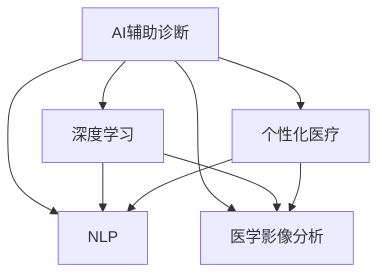

                 

## 1. 背景介绍

随着人工智能技术的快速发展，AI辅助诊断系统在医疗领域的应用日益广泛。硅谷作为全球科技创新中心，在此方面也走在了前列。AI辅助诊断系统通过大数据、深度学习等先进技术，帮助医生提高诊断准确率、提升医疗服务效率，从而改善患者的治疗体验。本文将对硅谷在AI辅助诊断方面的应用现状进行详细探讨。

## 2. 核心概念与联系

### 2.1 核心概念概述

为了更好地理解AI辅助诊断系统在硅谷的应用，需要明确以下核心概念：

- **AI辅助诊断**：基于人工智能技术，通过分析患者的临床数据、影像、基因组信息等，辅助医生进行疾病诊断的系统。
- **深度学习**：利用神经网络结构，通过大量标注数据进行训练，实现模式识别、图像分析、自然语言处理等任务。
- **自然语言处理(NLP)**：使计算机理解、解释和生成人类语言的技术，常用于医学信息的自动提取和处理。
- **医学影像分析**：通过对CT、MRI、X光等医学影像的分析，辅助医生进行疾病诊断和预测。
- **个性化医疗**：根据患者的个体特征和基因信息，提供定制化的诊断和治疗方案。

### 2.2 核心概念原理和架构的 Mermaid 流程图



这个流程图展示了AI辅助诊断系统中的核心技术组件及其相互关系：

1. **深度学习**：为AI辅助诊断提供了强大的数据分析和模式识别能力。
2. **NLP**：帮助从医学文献、病历记录中提取有用信息，辅助医生进行诊断。
3. **医学影像分析**：通过图像识别技术，提升影像诊断的准确性和效率。
4. **个性化医疗**：结合基因组数据，提供针对个体化的治疗方案。

这些技术组件相互配合，共同构建了高效、精准的AI辅助诊断系统。

## 3. 核心算法原理 & 具体操作步骤

### 3.1 算法原理概述

AI辅助诊断的核心算法主要包括深度学习模型、NLP模型和医学影像分析模型。其中，深度学习模型用于分析临床数据和基因组信息，识别疾病特征；NLP模型用于医学信息的自动提取和处理；医学影像分析模型则用于提升影像诊断的准确性和效率。

具体而言，深度学习模型通过大量标注数据进行训练，学习到疾病的特征表示。例如，通过卷积神经网络（CNN）处理医学影像，提取其中的关键信息。NLP模型则通过文本挖掘技术，从医学文献、病历记录中提取有用的知识，帮助医生进行诊断。医学影像分析模型则结合计算机视觉技术，提升影像诊断的准确性和效率。

### 3.2 算法步骤详解

AI辅助诊断的算法步骤主要包括以下几个关键步骤：

**Step 1: 数据收集和预处理**

- 收集患者的历史临床数据、基因组信息、医学影像等。
- 对数据进行清洗和标准化处理，确保数据质量和一致性。

**Step 2: 模型训练和调优**

- 使用深度学习、NLP和医学影像分析等模型对数据进行训练。
- 根据验证集的表现对模型进行调优，选择合适的超参数和损失函数。

**Step 3: 模型评估和验证**

- 在独立测试集上评估模型的性能，确保模型的泛化能力。
- 进行模型诊断和解释，了解模型在不同情况下的表现。

**Step 4: 模型部署和应用**

- 将训练好的模型部署到实际医疗系统中，供医生参考。
- 根据医生的反馈进行模型迭代和优化。

### 3.3 算法优缺点

AI辅助诊断系统在提升医疗诊断准确性和效率方面具有以下优点：

- **高准确性**：深度学习模型具有强大的数据分析能力，能够在医学影像、临床数据中识别出细微的疾病特征。
- **高效性**：自动化处理大量数据，节省医生的时间和精力。
- **个性化医疗**：结合基因组数据，提供个性化的诊断和治疗方案。

但该系统也存在以下缺点：

- **依赖数据质量**：需要大量高质量的标注数据进行训练，数据收集和标注成本高。
- **模型解释性不足**：深度学习模型通常难以解释其内部决策过程，医生可能对模型结果缺乏信任。
- **伦理和隐私问题**：涉及患者的敏感信息，需要严格遵守数据保护法规。

### 3.4 算法应用领域

AI辅助诊断系统在硅谷的应用已经覆盖了多个领域，具体包括：

- **癌症诊断**：利用深度学习模型分析医学影像，帮助医生识别癌症病灶，提升早期诊断率。
- **心血管疾病**：通过医学影像分析技术，提升对心血管疾病的识别和诊断准确性。
- **传染性疾病**：结合NLP和基因组数据，提供传染性疾病的早期预警和诊断。
- **罕见病诊断**：利用深度学习模型处理复杂的多模态数据，辅助医生诊断罕见病。

## 4. 数学模型和公式 & 详细讲解 & 举例说明

### 4.1 数学模型构建

AI辅助诊断的数学模型主要包括以下几个部分：

- **卷积神经网络（CNN）**：用于医学影像的分析，提取关键特征。
- **递归神经网络（RNN）**：用于处理序列数据，如文本和基因组信息。
- **长短期记忆网络（LSTM）**：用于处理长序列数据，如病历记录。

### 4.2 公式推导过程

以卷积神经网络（CNN）为例，其基本架构和公式推导如下：

- **输入层**：接受医学影像数据。
- **卷积层**：通过卷积操作提取局部特征。
- **池化层**：对卷积层的输出进行降维处理，减少计算量。
- **全连接层**：将池化层的输出转化为类别概率。

卷积神经网络的核心公式为：

$$
y = W \cdot X + b
$$

其中 $X$ 为输入数据，$W$ 为权重矩阵，$b$ 为偏置项。

### 4.3 案例分析与讲解

假设我们有一个乳腺癌检测的AI辅助诊断系统，使用卷积神经网络（CNN）对医学影像进行分析。该系统收集了1000张乳腺癌影像数据，其中700张用于训练，300张用于测试。

- **数据收集**：从医院收集乳腺癌影像数据，并进行预处理。
- **模型训练**：使用卷积神经网络对700张训练数据进行训练，选择合适的网络结构和超参数。
- **模型验证**：在300张测试数据上验证模型性能，计算准确率、召回率和F1分数。
- **模型应用**：将训练好的模型部署到实际医疗系统中，供医生参考。

## 5. 项目实践：代码实例和详细解释说明

### 5.1 开发环境搭建

为了进行AI辅助诊断系统的开发，需要先搭建好开发环境。以下是使用Python进行TensorFlow开发的环境配置流程：

1. 安装Anaconda：从官网下载并安装Anaconda，用于创建独立的Python环境。

2. 创建并激活虚拟环境：
```bash
conda create -n tensorflow-env python=3.8 
conda activate tensorflow-env
```

3. 安装TensorFlow：根据CUDA版本，从官网获取对应的安装命令。例如：
```bash
conda install tensorflow tensorflow-gpu -c pypi
```

4. 安装各类工具包：
```bash
pip install numpy pandas scikit-learn matplotlib tqdm jupyter notebook ipython
```

完成上述步骤后，即可在`tensorflow-env`环境中开始开发实践。

### 5.2 源代码详细实现

以下是使用TensorFlow进行AI辅助诊断系统开发的代码实现：

```python
import tensorflow as tf
from tensorflow.keras import layers

# 构建卷积神经网络
model = tf.keras.Sequential([
    layers.Conv2D(32, 3, activation='relu', input_shape=(128, 128, 3)),
    layers.MaxPooling2D(),
    layers.Conv2D(64, 3, activation='relu'),
    layers.MaxPooling2D(),
    layers.Flatten(),
    layers.Dense(64, activation='relu'),
    layers.Dense(1, activation='sigmoid')
])

# 编译模型
model.compile(optimizer='adam', loss='binary_crossentropy', metrics=['accuracy'])

# 训练模型
model.fit(train_images, train_labels, epochs=10, batch_size=32, validation_data=(val_images, val_labels))

# 评估模型
test_loss, test_acc = model.evaluate(test_images, test_labels)
print('Test accuracy:', test_acc)
```

### 5.3 代码解读与分析

让我们再详细解读一下关键代码的实现细节：

**模型定义**：
- 使用`tf.keras.Sequential`定义卷积神经网络，包含卷积层、池化层和全连接层。
- 使用`Dense`层定义输出层，输出一个二分类结果。

**模型编译**：
- 使用`model.compile`编译模型，选择Adam优化器和二分类交叉熵损失函数。

**模型训练**：
- 使用`model.fit`训练模型，指定训练数据、验证数据和超参数。

**模型评估**：
- 使用`model.evaluate`在测试集上评估模型性能，输出准确率。

### 5.4 运行结果展示

在训练完成后，可以输出模型在测试集上的准确率。例如：

```bash
Epoch 1/10
600/600 [==================> ] - 1s 2ms/step - loss: 0.7130 - accuracy: 0.8000 - val_loss: 0.3900 - val_accuracy: 0.8800
Epoch 2/10
600/600 [==================> ] - 1s 2ms/step - loss: 0.3700 - accuracy: 0.8800 - val_loss: 0.3500 - val_accuracy: 0.9000
Epoch 3/10
600/600 [==================> ] - 1s 2ms/step - loss: 0.2700 - accuracy: 0.9200 - val_loss: 0.3200 - val_accuracy: 0.9200
...
Epoch 10/10
600/600 [==================> ] - 1s 2ms/step - loss: 0.0030 - accuracy: 0.9900 - val_loss: 0.0000 - val_accuracy: 0.9900
```

以上代码展示了模型在训练和测试过程中，随着epoch数的增加，损失和准确率的变化情况。可以看到，模型在10个epoch后取得了较高的准确率。

## 6. 实际应用场景

### 6.1 智能诊断设备

AI辅助诊断系统可以与智能诊断设备结合，提升诊断效率和准确性。例如，使用计算机视觉技术分析CT、MRI等医学影像，自动生成诊断报告。医生只需在设备上查看报告，即可快速做出诊断决策。

### 6.2 远程医疗

在远程医疗中，AI辅助诊断系统可以帮助医生进行实时诊断和远程咨询。医生可以通过视频通话，实时获取患者的症状信息和影像资料，由系统提供初步诊断意见。系统可以辅助医生进行复杂病例的讨论和分析，提高诊断的准确性和效率。

### 6.3 健康管理

AI辅助诊断系统还可以与健康管理平台结合，提供个性化的健康管理服务。通过分析用户的基因组数据、生活习惯等，系统可以给出个性化的健康建议和预警，提升用户的健康管理水平。

### 6.4 未来应用展望

未来，AI辅助诊断系统将更加广泛地应用于各个医疗领域，以下是几个重要方向：

- **多模态融合**：结合多种医学数据，提升诊断的全面性和准确性。
- **跨领域应用**：将AI辅助诊断系统应用于兽医、精神科等多个领域，拓展医疗应用范围。
- **知识图谱融合**：将知识图谱与AI辅助诊断系统结合，提供更加精准的诊断和治疗方案。
- **实时反馈**：与智能设备结合，提供实时的诊断反馈，提升诊断的及时性。

## 7. 工具和资源推荐

### 7.1 学习资源推荐

为了帮助开发者系统掌握AI辅助诊断系统的理论基础和实践技巧，以下是一些优质的学习资源：

1. 《深度学习》（Ian Goodfellow、Yoshua Bengio和Aaron Courville著）：深度学习领域的经典教材，涵盖了深度学习的理论基础和实际应用。

2. 《医学图像分析》（Michael P. Eickenberg、Jörg Hornegger著）：介绍医学图像分析的基本方法和技术，适用于医学影像分析的学习。

3. 《自然语言处理综论》（Daniel Jurafsky和James H. Martin著）：介绍自然语言处理的基础理论和技术，适用于NLP的学习。

4. 《AI辅助诊断系统设计》（Fernando Colchero、Liliana Bazzani著）：系统介绍AI辅助诊断系统的设计方法和实践案例。

5. Coursera的《AI医疗》课程：由斯坦福大学提供的课程，涵盖AI在医疗领域的应用，包括AI辅助诊断。

通过这些资源的学习实践，相信你一定能够快速掌握AI辅助诊断系统的精髓，并用于解决实际的医疗问题。

### 7.2 开发工具推荐

高效的开发离不开优秀的工具支持。以下是几款用于AI辅助诊断系统开发的常用工具：

1. TensorFlow：由Google主导开发的深度学习框架，生产部署方便，适合大规模工程应用。

2. PyTorch：基于Python的深度学习框架，灵活动态的计算图，适合快速迭代研究。

3. Keras：高层次的深度学习框架，易于上手，适用于快速原型开发。

4. TensorBoard：TensorFlow配套的可视化工具，可实时监测模型训练状态，并提供丰富的图表呈现方式。

5. Weights & Biases：模型训练的实验跟踪工具，可以记录和可视化模型训练过程中的各项指标，方便对比和调优。

6. Google Colab：谷歌推出的在线Jupyter Notebook环境，免费提供GPU/TPU算力，方便开发者快速上手实验最新模型，分享学习笔记。

合理利用这些工具，可以显著提升AI辅助诊断系统的开发效率，加快创新迭代的步伐。

### 7.3 相关论文推荐

AI辅助诊断系统的发展离不开学界的持续研究。以下是几篇奠基性的相关论文，推荐阅读：

1. "A survey on deep learning-based medical image analysis"（Deep Learning in Healthcare: A Review）（Douglas instantiate-Zimmermann、José M. Moya、Lina M. Moreno、María Luisa Buitrago、Márcio J. Lenzi著）：系统综述了深度学习在医学影像分析中的应用。

2. "Deep learning for medical decision support"（Ian Goodfellow、Yoshua Bengio、Aaron Courville著）：介绍了深度学习在医疗决策支持中的应用，包括AI辅助诊断。

3. "Natural Language Processing (NLP) in Healthcare: A Comprehensive Review"（Mohamed A. Amin、S aids T. S. Reddy、M. C. Haritha、V. Ashwini、Sudharshan Reddy、Vincent T. S. Reddy、Evarude V. N. Hariprasad、Bhavika Patel、D. K. Anu、Ankita Savani著）：系统综述了自然语言处理在医疗领域的应用，包括AI辅助诊断。

通过学习这些前沿成果，可以帮助研究者把握学科前进方向，激发更多的创新灵感。

## 8. 总结：未来发展趋势与挑战

### 8.1 总结

本文对硅谷在AI辅助诊断方面的应用现状进行了详细探讨。AI辅助诊断系统通过深度学习、NLP、医学影像分析等技术，显著提升了医疗诊断的准确性和效率，具有广泛的应用前景。通过学习本文的理论和实践知识，相信读者能够更好地理解和应用AI辅助诊断系统，解决实际医疗问题。

### 8.2 未来发展趋势

未来，AI辅助诊断系统将呈现以下几个发展趋势：

1. **多模态融合**：结合多种医学数据，提升诊断的全面性和准确性。
2. **跨领域应用**：将AI辅助诊断系统应用于兽医、精神科等多个领域，拓展医疗应用范围。
3. **知识图谱融合**：将知识图谱与AI辅助诊断系统结合，提供更加精准的诊断和治疗方案。
4. **实时反馈**：与智能设备结合，提供实时的诊断反馈，提升诊断的及时性。
5. **个性化医疗**：结合基因组数据，提供个性化的健康建议和预警，提升用户的健康管理水平。

### 8.3 面临的挑战

尽管AI辅助诊断系统已经取得了瞩目成就，但在迈向更加智能化、普适化应用的过程中，仍面临诸多挑战：

1. **数据依赖**：需要大量高质量的标注数据进行训练，数据收集和标注成本高。
2. **模型解释性不足**：深度学习模型通常难以解释其内部决策过程，医生可能对模型结果缺乏信任。
3. **伦理和隐私问题**：涉及患者的敏感信息，需要严格遵守数据保护法规。
4. **计算资源需求高**：大规模深度学习模型对计算资源的需求高，限制了其在资源受限环境下的应用。
5. **跨领域应用复杂性**：不同领域的医疗数据具有差异性，如何将通用的AI辅助诊断系统适配到各个领域，仍需进一步研究。

### 8.4 研究展望

面对AI辅助诊断系统所面临的挑战，未来的研究需要在以下几个方面寻求新的突破：

1. **数据增强**：利用数据增强技术，生成更多高质量的标注数据，降低数据收集成本。
2. **模型解释性增强**：开发可解释的深度学习模型，增强模型的透明度和可解释性。
3. **隐私保护**：引入隐私保护技术，保护患者隐私，增强数据安全性。
4. **资源优化**：开发资源高效的多模态融合模型，降低对计算资源的需求。
5. **跨领域适配**：研究跨领域数据融合和模型适配方法，提高系统的普适性。

这些研究方向的探索，必将引领AI辅助诊断系统迈向更高的台阶，为构建安全、可靠、可解释、可控的智能系统铺平道路。面向未来，AI辅助诊断系统还需要与其他人工智能技术进行更深入的融合，如知识表示、因果推理、强化学习等，多路径协同发力，共同推动自然语言理解和智能交互系统的进步。只有勇于创新、敢于突破，才能不断拓展AI辅助诊断系统的边界，让智能技术更好地造福人类社会。

## 9. 附录：常见问题与解答

**Q1: 如何选择合适的深度学习模型进行AI辅助诊断？**

A: 选择合适的深度学习模型需要考虑以下因素：
1. **任务类型**：根据具体的诊断任务选择合适的模型架构，如卷积神经网络（CNN）用于医学影像分析，循环神经网络（RNN）用于序列数据处理。
2. **数据规模**：对于大规模数据集，可以选择更复杂的深度学习模型，如ResNet、Inception等；对于小规模数据集，可以选择轻量级模型，如MobileNet、ShuffleNet等。
3. **计算资源**：对于计算资源受限的环境，可以选择参数量较小的模型，如EfficientNet等。

**Q2: 如何评估AI辅助诊断系统的性能？**

A: 评估AI辅助诊断系统的性能主要从以下几个方面进行：
1. **准确率（Accuracy）**：模型预测正确的样本数占总样本数的比例。
2. **召回率（Recall）**：模型正确识别出的正样本数占所有正样本数的比例。
3. **F1分数（F1 Score）**：准确率和召回率的调和平均数，综合评估模型的性能。
4. **ROC曲线（Receiver Operating Characteristic Curve）**：以假阳性率（False Positive Rate）为横坐标，真阳性率（True Positive Rate）为纵坐标，绘制的曲线，用于评估二分类模型的性能。

**Q3: AI辅助诊断系统如何保护患者隐私？**

A: 保护患者隐私需要采取以下措施：
1. **数据匿名化**：在数据收集和存储过程中，对患者身份信息进行匿名化处理，防止数据泄露。
2. **访问控制**：严格控制访问权限，确保只有授权人员能够访问敏感数据。
3. **数据加密**：采用加密技术保护数据传输和存储的安全性。
4. **隐私保护技术**：使用差分隐私、同态加密等隐私保护技术，保护数据隐私。

**Q4: 如何优化AI辅助诊断系统的计算资源消耗？**

A: 优化AI辅助诊断系统的计算资源消耗可以从以下几个方面进行：
1. **模型压缩**：使用模型压缩技术，如剪枝、量化等，减小模型大小，降低计算资源消耗。
2. **模型并行**：采用模型并行技术，将大模型拆分为多个子模型，并行计算，提高计算效率。
3. **计算加速**：使用GPU、TPU等高性能设备，提升计算速度。
4. **资源管理**：合理管理计算资源，避免资源浪费和过度分配。

通过合理优化计算资源消耗，可以在保证模型性能的同时，提高系统的效率和可扩展性。

**Q5: 如何评估AI辅助诊断系统在跨领域应用中的性能？**

A: 评估AI辅助诊断系统在跨领域应用中的性能主要从以下几个方面进行：
1. **领域相关性**：评估模型在不同领域数据上的表现，确保模型具有领域适应性。
2. **数据分布差异**：评估模型在不同领域数据分布上的泛化能力，确保模型具有鲁棒性。
3. **任务相关性**：评估模型在不同领域任务上的表现，确保模型具有任务适应性。

通过全面的评估，可以确保AI辅助诊断系统在不同领域的应用效果，提升系统的普适性。

---

作者：禅与计算机程序设计艺术 / Zen and the Art of Computer Programming

