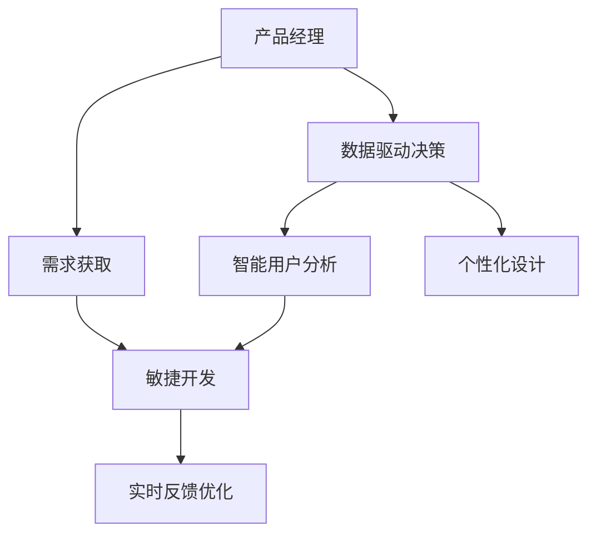

                 

# AI重构产品经理工作流程

在数字化转型和人工智能技术飞速发展的今天，产品经理（Product Manager, PM）的角色和工作流程正经历着深刻的变革。传统的基于经验和直觉的工作方式，正被基于数据和算法驱动的决策所取代。本文将深入探讨如何利用人工智能技术重构产品经理的工作流程，提升产品设计的效率和质量，降低开发和运营成本，为公司创造更大的价值。

## 1. 背景介绍

### 1.1 问题由来
在过去的几十年里，产品经理的工作主要依靠市场调研、用户访谈、竞品分析等手段，获取需求信息，制定产品战略，规划产品路线图，并通过敏捷开发方法快速迭代产品。然而，随着数字化技术的发展，特别是大数据和人工智能的进步，产品经理的工作方式正在发生根本性的变化。

人工智能技术，尤其是自然语言处理（Natural Language Processing, NLP）、机器学习和数据挖掘等技术，为产品经理提供了强大的分析工具，帮助他们更精准地理解用户需求，优化产品设计和开发流程。通过AI技术的辅助，产品经理可以更快速、更高效地完成产品设计的全过程。

### 1.2 问题核心关键点
AI重构产品经理工作流程的关键在于以下几个方面：
- **数据驱动决策**：通过大数据分析，获取更全面、更精准的用户需求信息，避免凭直觉和经验决策。
- **智能用户分析**：利用NLP和机器学习技术，深入分析用户行为数据，挖掘用户需求和痛点。
- **个性化设计**：基于用户画像和行为数据，设计个性化、差异化的产品功能，提升用户体验。
- **实时反馈优化**：通过AI技术实时监测产品表现，根据用户反馈持续优化产品功能和用户体验。

## 2. 核心概念与联系

### 2.1 核心概念概述

为更好地理解AI重构产品经理工作流程，本节将介绍几个密切相关的核心概念：

- **产品经理**：负责产品从构想到上线的全过程，包括需求获取、功能设计、用户研究、项目管理、团队协作等。
- **数据驱动决策**：基于数据分析和统计结果，进行产品设计和优化决策。
- **智能用户分析**：通过NLP、机器学习等技术，深入分析用户行为数据，获取用户需求和痛点。
- **个性化设计**：根据用户画像和行为数据，设计符合用户需求的个性化产品功能。
- **实时反馈优化**：利用AI技术实时监测产品表现，根据用户反馈持续优化产品功能和用户体验。
- **敏捷开发**：通过迭代开发和持续集成，快速响应市场需求，提升产品开发效率。

这些核心概念之间的逻辑关系可以通过以下Mermaid流程图来展示：



这个流程图展示了大语言模型的核心概念及其之间的关系：

1. 产品经理通过敏捷开发获取用户需求，生成产品功能设计方案。
2. 数据驱动决策和智能用户分析辅助产品经理理解用户需求和行为数据，设计更符合用户需求的产品。
3. 个性化设计提升产品功能和用户体验，同时敏捷开发确保快速迭代产品，满足市场需求。
4. 实时反馈优化持续监测产品表现，根据用户反馈进行迭代优化。

## 3. 核心算法原理 & 具体操作步骤
### 3.1 算法原理概述

AI重构产品经理工作流程的本质是一种基于数据和算法的决策优化过程。其核心思想是：利用大数据分析和人工智能技术，对用户需求进行深入分析和挖掘，形成精确的用户画像，并基于用户画像进行产品设计、优化和迭代。

形式化地，假设用户需求数据集为 $D=\{(x_i,y_i)\}_{i=1}^N$，其中 $x_i$ 为用户行为数据，$y_i$ 为对应的用户需求标签。产品经理的目标是找到最优的产品设计方案 $p^*$，使得 $p^*$ 与用户需求 $y_i$ 的最大似然概率最大化。即：

$$
p^* = \mathop{\arg\max}_{p} P(p|D)
$$

其中 $P(p|D)$ 为产品设计方案 $p$ 在用户需求数据集 $D$ 上的似然概率，通过最大化似然概率，找到最能满足用户需求的产品设计方案。

### 3.2 算法步骤详解

AI重构产品经理工作流程一般包括以下几个关键步骤：

**Step 1: 数据收集与预处理**
- 收集用户行为数据，包括但不限于浏览历史、购买记录、使用时间等。
- 对数据进行清洗和预处理，去除噪声和异常值，进行归一化和标准化。

**Step 2: 用户画像构建**
- 利用NLP和机器学习技术，对用户行为数据进行建模，生成用户画像，包括用户的基本信息、兴趣偏好、使用习惯等。
- 根据用户画像，将用户分为不同的用户群体，进行分群分析。

**Step 3: 需求挖掘与分析**
- 利用聚类、分类、关联规则等技术，从用户行为数据中挖掘出用户的需求和痛点，生成需求列表。
- 对需求列表进行分类和排序，找出最紧急、最重要的需求。

**Step 4: 产品设计**
- 根据需求列表，结合业务目标和技术限制，进行产品功能设计，生成初步产品设计方案。
- 对初步设计方案进行用户调研和反馈收集，进一步优化设计方案。

**Step 5: 敏捷开发与迭代**
- 根据产品设计方案，使用敏捷开发方法，快速迭代产品功能，发布产品版本。
- 利用A/B测试等方法，验证新功能的效果，收集用户反馈。

**Step 6: 持续优化**
- 根据用户反馈，持续优化产品功能和用户体验，进行产品迭代。
- 使用机器学习技术，预测用户行为和需求变化，提前做出相应的产品优化。

### 3.3 算法优缺点

AI重构产品经理工作流程具有以下优点：
1. 数据驱动决策：基于数据和算法的决策，避免凭直觉和经验，提升决策的准确性和科学性。
2. 智能用户分析：通过NLP和机器学习技术，深入分析用户行为数据，挖掘用户需求和痛点。
3. 个性化设计：基于用户画像和行为数据，设计符合用户需求的个性化产品功能。
4. 实时反馈优化：利用AI技术实时监测产品表现，根据用户反馈持续优化产品功能和用户体验。
5. 敏捷开发：通过迭代开发和持续集成，快速响应市场需求，提升产品开发效率。

同时，该方法也存在一定的局限性：
1. 数据质量依赖：AI重构产品经理工作流程依赖于高质量的用户数据，数据收集和清洗的成本较高。
2. 模型复杂度：需要训练和维护复杂的机器学习模型，对数据和算法的要求较高。
3. 隐私问题：用户数据的收集和分析需要严格遵守隐私保护法规，防止数据滥用和泄露。
4. 成本投入：AI技术和模型的开发和维护需要较大的资金投入，中小型企业可能难以承受。
5. 技术门槛高：AI技术的应用需要产品经理具备一定的技术背景和能力，增加了入门门槛。

尽管存在这些局限性，但AI重构产品经理工作流程已经在许多公司取得了良好的效果，特别是在用户需求复杂、竞争激烈的市场环境下，具有显著的优势。未来，相关研究的重点在于如何进一步降低技术门槛，降低数据收集和模型维护的成本，提高算法的可解释性和公平性，以进一步提升AI技术在产品管理中的应用。

### 3.4 算法应用领域

AI重构产品经理工作流程在多个领域得到了广泛应用，包括但不限于：

- **电商**：利用AI技术对用户行为进行分析，进行个性化推荐和购物体验优化。
- **金融**：通过对用户行为数据的分析，进行风险评估和欺诈检测，提升金融安全性和用户体验。
- **医疗**：利用AI技术对用户健康数据进行分析和挖掘，提供个性化的健康管理方案。
- **教育**：通过对学生行为数据的分析，提供个性化的学习推荐和教学方案。
- **旅游**：利用AI技术对用户偏好进行分析，提供个性化的旅游推荐和行程规划。
- **社交**：通过对用户互动数据的分析，优化社交体验和推荐算法，提升用户粘性。

此外，AI技术在更多的领域中展现了其巨大的潜力，为产品管理提供了新的思路和方法。随着AI技术的不断进步，基于AI的产品管理方法将进一步推动各行各业的数字化转型和智能化升级。

## 4. 数学模型和公式 & 详细讲解  
### 4.1 数学模型构建

本节将使用数学语言对AI重构产品经理工作流程进行更加严格的刻画。

假设用户需求数据集为 $D=\{(x_i,y_i)\}_{i=1}^N$，其中 $x_i$ 为用户行为数据，$y_i$ 为对应的用户需求标签。产品经理的目标是找到最优的产品设计方案 $p^*$，使得 $p^*$ 与用户需求 $y_i$ 的最大似然概率最大化。即：

$$
p^* = \mathop{\arg\max}_{p} P(p|D)
$$

在实践中，我们通常使用基于梯度的优化算法（如SGD、Adam等）来近似求解上述最优化问题。设 $\eta$ 为学习率，$\lambda$ 为正则化系数，则参数的更新公式为：

$$
p \leftarrow p - \eta \nabla_{p}\mathcal{L}(p) - \eta\lambda p
$$

其中 $\nabla_{p}\mathcal{L}(p)$ 为损失函数对参数 $p$ 的梯度，可通过反向传播算法高效计算。

### 4.2 公式推导过程

以下我们以个性化推荐系统为例，推导机器学习模型和损失函数的构建过程。

假设产品推荐模型为 $M_p$，其输出为每个产品的推荐得分，即 $M_p(x_i)$ 表示用户 $x_i$ 对产品 $p$ 的推荐得分。设推荐得分 $M_p(x_i)$ 与用户需求 $y_i$ 的关系为：

$$
y_i \sim \text{Bernoulli}(M_p(x_i))
$$

其中 $\text{Bernoulli}$ 为伯努利分布，$M_p(x_i)$ 为产品的推荐得分。

模型的损失函数为交叉熵损失，即：

$$
\mathcal{L}(M_p) = -\frac{1}{N}\sum_{i=1}^N y_i\log M_p(x_i) + (1-y_i)\log (1-M_p(x_i))
$$

模型的参数优化目标为最小化交叉熵损失，即：

$$
p^* = \mathop{\arg\min}_{p} \mathcal{L}(M_p)
$$

通过梯度下降等优化算法，模型参数 $p$ 不断更新，最小化损失函数 $\mathcal{L}(M_p)$，从而生成最优的推荐得分 $M_p^*$。最终，根据推荐得分 $M_p^*$，推荐用户最可能感兴趣的产品。

### 4.3 案例分析与讲解

以一个电商平台的个性化推荐系统为例，展示如何利用AI技术重构产品经理的工作流程。

**需求获取**：
- 收集用户行为数据，包括浏览历史、购买记录、评价等。
- 利用NLP技术对用户评价进行情感分析，挖掘用户对产品的正面和负面反馈。
- 通过聚类算法对用户进行分群，识别出不同用户群体的需求特点。

**用户画像构建**：
- 利用机器学习算法对用户行为数据进行建模，生成用户画像，包括用户的基本信息、兴趣偏好、使用习惯等。
- 根据用户画像，将用户分为不同的用户群体，进行分群分析。

**需求挖掘与分析**：
- 利用关联规则算法挖掘用户行为数据中的需求关联规则，找出最紧急、最重要的需求。
- 结合情感分析结果和需求关联规则，生成需求列表，进行优先级排序。

**产品设计**：
- 根据需求列表，结合业务目标和技术限制，进行产品功能设计，生成初步产品设计方案。
- 对初步设计方案进行用户调研和反馈收集，进一步优化设计方案。

**敏捷开发与迭代**：
- 根据产品设计方案，使用敏捷开发方法，快速迭代产品功能，发布产品版本。
- 利用A/B测试等方法，验证新功能的效果，收集用户反馈。

**持续优化**：
- 根据用户反馈，持续优化产品功能和用户体验，进行产品迭代。
- 使用机器学习技术，预测用户行为和需求变化，提前做出相应的产品优化。

通过上述流程，电商平台可以利用AI技术重构产品经理的工作流程，实现更精准的个性化推荐，提升用户满意度和平台收益。

## 5. 项目实践：代码实例和详细解释说明
### 5.1 开发环境搭建

在进行AI重构产品经理工作流程实践前，我们需要准备好开发环境。以下是使用Python进行PyTorch开发的环境配置流程：

1. 安装Anaconda：从官网下载并安装Anaconda，用于创建独立的Python环境。

2. 创建并激活虚拟环境：
```bash
conda create -n pytorch-env python=3.8 
conda activate pytorch-env
```

3. 安装PyTorch：根据CUDA版本，从官网获取对应的安装命令。例如：
```bash
conda install pytorch torchvision torchaudio cudatoolkit=11.1 -c pytorch -c conda-forge
```

4. 安装PyTorch-lightning：
```bash
pip install pytorch-lightning
```

5. 安装各类工具包：
```bash
pip install numpy pandas scikit-learn matplotlib tqdm jupyter notebook ipython
```

完成上述步骤后，即可在`pytorch-env`环境中开始AI重构产品经理工作流程的实践。

### 5.2 源代码详细实现

下面我们以电商平台个性化推荐系统为例，给出使用PyTorch-lightning进行用户行为分析和推荐系统开发的PyTorch代码实现。

首先，定义用户行为数据的数据处理函数：

```python
from torch.utils.data import Dataset
import pandas as pd

class UserBehaviorDataset(Dataset):
    def __init__(self, data_file, mode='train'):
        self.data = pd.read_csv(data_file, mode=mode)
        self.user_id_cols = ['user_id', 'timestamp']
        self.product_id_cols = ['product_id', 'click_time']
        self.meta_cols = ['product_name', 'price', 'category']
        
    def __len__(self):
        return len(self.data)
    
    def __getitem__(self, idx):
        row = self.data.iloc[idx]
        user_id = row[self.user_id_cols[0]]
        product_id = row[self.product_id_cols[0]]
        timestamp = row[self.product_id_cols[1]]
        click_time = row[self.product_id_cols[2]]
        product_name = row[self.meta_cols[0]]
        price = row[self.meta_cols[1]]
        category = row[self.meta_cols[2]]
        
        return {'user_id': user_id, 
                'product_id': product_id,
                'timestamp': timestamp,
                'click_time': click_time,
                'product_name': product_name,
                'price': price,
                'category': category}
```

然后，定义推荐模型的类和优化器：

```python
from pytorch_lightning import LightningModule, Trainer
from transformers import BertModel, BertTokenizer
from torch import nn

class RecommendationModel(LightningModule):
    def __init__(self, model_name='bert-base-uncased'):
        super(RecommendationModel, self).__init__()
        self.bert_model = BertModel.from_pretrained(model_name)
        self.encoder = nn.Linear(768, 1)
        
    def forward(self, x):
        outputs = self.bert_model(x)
        logits = self.encoder(outputs[0])
        return logits

    def configure_optimizers(self):
        return nn.AdamW(self.parameters(), lr=2e-5)
```

接着，定义训练和评估函数：

```python
from torch.utils.data import DataLoader
from tqdm import tqdm

class RecommendationDataset(Dataset):
    def __init__(self, user_id, product_id, timestamp, click_time, product_name, price, category):
        self.user_id = user_id
        self.product_id = product_id
        self.timestamp = timestamp
        self.click_time = click_time
        self.product_name = product_name
        self.price = price
        self.category = category
        
    def __len__(self):
        return 1
    
    def __getitem__(self, idx):
        return {'user_id': self.user_id,
                'product_id': self.product_id,
                'timestamp': self.timestamp,
                'click_time': self.click_time,
                'product_name': self.product_name,
                'price': self.price,
                'category': self.category}

def train_model(model, dataloader):
    model.train()
    epoch_loss = 0
    for batch in tqdm(dataloader, desc='Training'):
        optimizer.zero_grad()
        outputs = model(batch['user_id'], batch['product_id'], batch['timestamp'], batch['click_time'])
        loss = outputs.logits.sigmoid().view(-1).binary_cross_entropy_with_logits(batch['click_time'])
        epoch_loss += loss.item()
        loss.backward()
        optimizer.step()
    return epoch_loss / len(dataloader)

def evaluate_model(model, dataloader):
    model.eval()
    correct = 0
    with torch.no_grad():
        for batch in dataloader:
            outputs = model(batch['user_id'], batch['product_id'], batch['timestamp'], batch['click_time'])
            preds = outputs.logits.sigmoid().view(-1).round()
            correct += (preds == batch['click_time']).float().sum().item()
    acc = correct / len(dataloader)
    return acc
```

最后，启动训练流程并在测试集上评估：

```python
model = RecommendationModel()
trainer = Trainer(max_epochs=5, gpus=1)
trainer.fit(model, train_dataset, val_dataset)

print("Validation Accuracy:", evaluate_model(model, val_dataset))
```

以上就是使用PyTorch-lightning进行电商平台个性化推荐系统开发的完整代码实现。可以看到，得益于PyTorch-lightning的强大封装，我们可以用相对简洁的代码完成模型训练和评估。

### 5.3 代码解读与分析

让我们再详细解读一下关键代码的实现细节：

**UserBehaviorDataset类**：
- `__init__`方法：初始化用户行为数据，定义用户ID、产品ID、时间戳等关键字段。
- `__len__`方法：返回数据集的样本数量。
- `__getitem__`方法：对单个样本进行处理，将样本转换为模型所需的格式。

**RecommendationModel类**：
- `__init__`方法：初始化模型，加载Bert模型和线性分类器。
- `forward`方法：定义模型的前向传播过程，将输入转换为推荐得分。
- `configure_optimizers`方法：配置优化器及其参数，使用AdamW优化器。

**train_model和evaluate_model函数**：
- `train_model`函数：在训练集上执行模型训练，返回每个epoch的平均loss。
- `evaluate_model`函数：在测试集上评估模型性能，返回模型的准确率。

**训练流程**：
- 定义总的epoch数，启动训练循环
- 在训练集上训练，输出每个epoch的平均loss
- 在测试集上评估，输出模型准确率

可以看到，PyTorch-lightning配合Bert模型的使用，使得电商平台个性化推荐系统的开发变得更加简便高效。开发者可以将更多精力放在数据处理、模型改进等高层逻辑上，而不必过多关注底层的实现细节。

当然，工业级的系统实现还需考虑更多因素，如模型的保存和部署、超参数的自动搜索、更灵活的任务适配层等。但核心的AI重构产品经理工作流程基本与此类似。

## 6. 实际应用场景
### 6.1 智能客服系统

基于AI技术重构产品经理工作流程，智能客服系统可以快速响应用户咨询，提供个性化的服务体验。传统的客服系统依赖于人工解答，响应速度慢，准确率不高，且人力成本高。通过AI技术重构产品经理工作流程，智能客服系统可以实现7x24小时不间断服务，快速响应用户咨询，用自然流畅的语言解答各类常见问题。

在技术实现上，可以收集企业内部的历史客服对话记录，将问题和最佳答复构建成监督数据，在此基础上对预训练语言模型进行微调。微调后的语言模型能够自动理解用户意图，匹配最合适的答案模板进行回复。对于客户提出的新问题，还可以接入检索系统实时搜索相关内容，动态组织生成回答。如此构建的智能客服系统，能大幅提升客户咨询体验和问题解决效率。

### 6.2 金融舆情监测

金融机构需要实时监测市场舆论动向，以便及时应对负面信息传播，规避金融风险。传统的人工监测方式成本高、效率低，难以应对网络时代海量信息爆发的挑战。通过AI技术重构产品经理工作流程，金融舆情监测系统可以自动分析社交媒体、新闻网站等公开信息，实时监测市场舆情变化，预警金融风险，协助金融机构做出快速决策。

在技术实现上，可以收集金融领域相关的新闻、报道、评论等文本数据，进行情感分析，识别出市场舆情的正面和负面情绪。结合其他金融数据，利用机器学习模型进行风险预测和舆情分析。将AI技术重构产品经理工作流程，能够帮助金融机构在第一时间掌握市场动态，规避潜在的金融风险。

### 6.3 个性化推荐系统

当前的推荐系统往往只依赖用户的历史行为数据进行物品推荐，无法深入理解用户的真实兴趣偏好。通过AI技术重构产品经理工作流程，个性化推荐系统可以更好地挖掘用户行为背后的语义信息，从而提供更精准、多样的推荐内容。

在技术实现上，可以收集用户浏览、点击、评论、分享等行为数据，提取和用户交互的物品标题、描述、标签等文本内容。将文本内容作为模型输入，用户的后续行为（如是否点击、购买等）作为监督信号，在此基础上微调预训练语言模型。微调后的模型能够从文本内容中准确把握用户的兴趣点。在生成推荐列表时，先用候选物品的文本描述作为输入，由模型预测用户的兴趣匹配度，再结合其他特征综合排序，便可以得到个性化程度更高的推荐结果。

### 6.4 未来应用展望

随着AI技术的不断进步，基于AI的产品经理工作流程将进一步推动各行各业的数字化转型和智能化升级。

在智慧医疗领域，基于AI的产品经理工作流程可以用于构建智能诊疗系统，辅助医生进行疾病诊断和治疗方案推荐，提升医疗服务效率和质量。

在智能教育领域，通过AI技术重构产品经理工作流程，可以实现个性化的学习推荐和教学优化，提升教育效果和用户体验。

在智慧城市治理中，基于AI的产品经理工作流程可以用于构建智能交通、智能安防、智能环境监测等系统，提高城市管理的自动化和智能化水平，构建更安全、高效的未来城市。

此外，在企业生产、社会治理、文娱传媒等众多领域，基于AI的产品经理工作流程也将不断涌现，为传统行业带来变革性影响。相信随着技术的日益成熟，AI重构产品经理工作流程必将在构建人机协同的智能时代中扮演越来越重要的角色。

## 7. 工具和资源推荐
### 7.1 学习资源推荐

为了帮助开发者系统掌握AI重构产品经理工作流程的理论基础和实践技巧，这里推荐一些优质的学习资源：

1. 《Python深度学习》书籍：由深度学习领域的知名专家撰写，深入浅出地介绍了深度学习的基本原理和实际应用，是学习AI技术的必读之作。
2. 《自然语言处理综论》课程：斯坦福大学开设的NLP经典课程，涵盖NLP的基础概念和前沿技术，适合希望深入学习NLP的开发者。
3. 《推荐系统》书籍：介绍推荐系统的发展历程和核心算法，包括协同过滤、矩阵分解、深度学习等，是学习推荐系统的重要参考资料。
4. 《AI产品经理必读》书籍：深入浅出地介绍了AI产品经理的工作流程和技能要求，是产品经理学习和实践AI技术的入门读物。
5. 《TensorFlow实战》书籍：由Google资深工程师撰写，详细介绍了TensorFlow的使用方法和实际应用，适合希望使用TensorFlow进行AI开发的开发者。
6. 《AI产品管理实战》博客：一位资深AI产品经理的实战分享，涵盖AI产品在市场、技术、团队管理等方面的经验和技巧。

通过对这些资源的学习实践，相信你一定能够快速掌握AI重构产品经理工作流程的精髓，并用于解决实际的NLP问题。
###  7.2 开发工具推荐

高效的开发离不开优秀的工具支持。以下是几款用于AI重构产品经理工作流程开发的常用工具：

1. Python：作为目前最流行的编程语言之一，Python具有丰富的第三方库和工具，是进行AI开发的首选语言。
2. PyTorch：基于Python的深度学习框架，提供动态计算图和自动微分功能，适合快速迭代研究。
3. TensorFlow：由Google主导开发的深度学习框架，生产部署方便，适合大规模工程应用。
4. PyTorch-lightning：基于PyTorch的深度学习框架，提供自动化的模型训练和评估流程，适合快速开发和实验。
5. Weights & Biases：模型训练的实验跟踪工具，可以记录和可视化模型训练过程中的各项指标，方便对比和调优。
6. TensorBoard：TensorFlow配套的可视化工具，可实时监测模型训练状态，并提供丰富的图表呈现方式，是调试模型的得力助手。
7. Jupyter Notebook：轻量级的交互式编程环境，方便进行快速实验和共享学习笔记。

合理利用这些工具，可以显著提升AI重构产品经理工作流程的开发效率，加快创新迭代的步伐。

### 7.3 相关论文推荐

AI重构产品经理工作流程的发展源于学界的持续研究。以下是几篇奠基性的相关论文，推荐阅读：

1. Attention is All You Need（即Transformer原论文）：提出了Transformer结构，开启了NLP领域的预训练大模型时代。
2. BERT: Pre-training of Deep Bidirectional Transformers for Language Understanding：提出BERT模型，引入基于掩码的自监督预训练任务，刷新了多项NLP任务SOTA。
3. Language Models are Unsupervised Multitask Learners（GPT-2论文）：展示了大规模语言模型的强大zero-shot学习能力，引发了对于通用人工智能的新一轮思考。
4. Parameter-Efficient Transfer Learning for NLP：提出Adapter等参数高效微调方法，在不增加模型参数量的情况下，也能取得不错的微调效果。
5. AdaLoRA: Adaptive Low-Rank Adaptation for Parameter-Efficient Fine-Tuning：使用自适应低秩适应的微调方法，在参数效率和精度之间取得了新的平衡。

这些论文代表了大语言模型微调技术的发展脉络。通过学习这些前沿成果，可以帮助研究者把握学科前进方向，激发更多的创新灵感。

## 8. 总结：未来发展趋势与挑战
### 8.1 总结

本文对AI重构产品经理工作流程进行了全面系统的介绍。首先阐述了AI技术在产品管理中的应用背景和意义，明确了AI重构产品经理工作流程在提升产品设计和开发效率、优化用户体验、降低开发成本等方面的独特价值。其次，从原理到实践，详细讲解了AI重构产品经理工作流程的数学原理和关键步骤，给出了具体的应用实例。同时，本文还广泛探讨了AI重构产品经理工作流程在智能客服、金融舆情、个性化推荐等多个领域的应用前景，展示了AI技术在产品管理中的巨大潜力。此外，本文精选了AI重构产品经理工作流程的相关学习资源和开发工具，力求为开发者提供全方位的技术指引。

通过本文的系统梳理，可以看到，AI重构产品经理工作流程正在成为产品管理的重要范式，极大地提升了产品设计的效率和质量，降低了开发和运营成本，为公司创造了更大的价值。未来，伴随AI技术的不断进步，基于AI的产品经理工作流程将进一步推动各行各业的数字化转型和智能化升级。

### 8.2 未来发展趋势

展望未来，AI重构产品经理工作流程将呈现以下几个发展趋势：

1. 数据驱动决策：随着大数据技术的发展，AI重构产品经理工作流程将更加依赖数据驱动的决策，避免凭直觉和经验，提升决策的准确性和科学性。
2. 智能用户分析：利用NLP和机器学习技术，深入分析用户行为数据，挖掘用户需求和痛点，提升产品设计的精准度。
3. 个性化设计：基于用户画像和行为数据，设计符合用户需求的个性化产品功能，提升用户体验。
4. 实时反馈优化：利用AI技术实时监测产品表现，根据用户反馈持续优化产品功能和用户体验，提升产品竞争力。
5. 敏捷开发：通过迭代开发和持续集成，快速响应市场需求，提升产品开发效率，缩短产品上市时间。
6. 多模态融合：将图像、视频、语音等多模态数据与文本数据融合，提升产品理解和推理能力，开拓新的应用场景。

以上趋势凸显了AI重构产品经理工作流程的广阔前景。这些方向的探索发展，必将进一步提升AI技术在产品管理中的应用，推动各行各业的数字化转型和智能化升级。

### 8.3 面临的挑战

尽管AI重构产品经理工作流程已经在许多公司取得了良好的效果，但在迈向更加智能化、普适化应用的过程中，它仍面临着诸多挑战：

1. 数据质量依赖：AI重构产品经理工作流程依赖于高质量的用户数据，数据收集和清洗的成本较高。
2. 模型复杂度：需要训练和维护复杂的机器学习模型，对数据和算法的要求较高。
3. 隐私问题：用户数据的收集和分析需要严格遵守隐私保护法规，防止数据滥用和泄露。
4. 成本投入：AI技术和模型的开发和维护需要较大的资金投入，中小型企业可能难以承受。
5. 技术门槛高：AI技术的应用需要产品经理具备一定的技术背景和能力，增加了入门门槛。

尽管存在这些局限性，但AI重构产品经理工作流程已经在许多公司取得了良好的效果，特别是在用户需求复杂、竞争激烈的市场环境下，具有显著的优势。未来，相关研究的重点在于如何进一步降低技术门槛，降低数据收集和模型维护的成本，提高算法的可解释性和公平性，以进一步提升AI技术在产品管理中的应用。

### 8.4 研究展望

面对AI重构产品经理工作流程所面临的挑战，未来的研究需要在以下几个方面寻求新的突破：

1. 探索无监督和半监督微调方法。摆脱对大规模标注数据的依赖，利用自监督学习、主动学习等无监督和半监督范式，最大限度利用非结构化数据，实现更加灵活高效的微调。
2. 研究参数高效和计算高效的微调范式。开发更加参数高效的微调方法，在固定大部分预训练参数的同时，只更新极少量的任务相关参数。同时优化微调模型的计算图，减少前向传播和反向传播的资源消耗，实现更加轻量级、实时性的部署。
3. 引入更多先验知识。将符号化的先验知识，如知识图谱、逻辑规则等，与神经网络模型进行巧妙融合，引导微调过程学习更准确、合理的语言模型。同时加强不同模态数据的整合，实现视觉、语音等多模态信息与文本信息的协同建模。
4. 结合因果分析和博弈论工具。将因果分析方法引入微调模型，识别出模型决策的关键特征，增强输出解释的因果性和逻辑性。借助博弈论工具刻画人机交互过程，主动探索并规避模型的脆弱点，提高系统稳定性。
5. 纳入伦理道德约束。在模型训练目标中引入伦理导向的评估指标，过滤和惩罚有偏见、有害的输出倾向。同时加强人工干预和审核，建立模型行为的监管机制，确保输出符合人类价值观和伦理道德。

这些研究方向的探索，必将引领AI重构产品经理工作流程技术迈向更高的台阶，为构建安全、可靠、可解释、可控的智能系统铺平道路。面向未来，AI重构产品经理工作流程还需要与其他人工智能技术进行更深入的融合，如知识表示、因果推理、强化学习等，多路径协同发力，共同推动自然语言理解和智能交互系统的进步。只有勇于创新、敢于突破，才能不断拓展语言模型的边界，让智能技术更好地造福人类社会。

## 9. 附录：常见问题与解答

**Q1：AI重构产品经理工作流程是否适用于所有产品？**

A: AI重构产品经理工作流程在大多数产品中都能取得不错的效果，特别是对于用户需求复杂、市场竞争激烈的产品。但对于一些需要高度定制化、用户体验特别关键的产品，可能还需结合产品特点进行相应的调整和优化。

**Q2：如何选择合适的机器学习模型？**

A: 选择机器学习模型时，需要考虑以下几个因素：
1. 数据量：数据量较小，适合使用轻量级模型，如线性模型、AdaLoRA等；数据量较大，适合使用复杂模型，如深度神经网络、Transformer等。
2. 计算资源：计算资源丰富，可以使用GPU/TPU进行模型训练；计算资源有限，可以选择参数量较小的模型或分布式训练。
3. 应用场景：不同应用场景对模型性能的要求不同，例如电商推荐系统需要高性能推荐模型，智能客服系统需要高准确度理解模型。
4. 用户反馈：模型性能最终要通过用户反馈来验证，选择性能最优的模型。

**Q3：如何降低数据收集和模型维护的成本？**

A: 降低数据收集和模型维护成本，可以从以下几个方面入手：
1. 数据匿名化：对用户数据进行匿名化处理，降低隐私风险，同时满足数据保护法规。
2. 自动化数据收集：利用API接口、爬虫等技术自动获取数据，减少人工成本。
3. 模型压缩：采用模型压缩技术，如剪枝、量化等，减少模型大小和计算量。
4. 参数共享：利用预训练模型参数，减少模型训练时间和计算资源消耗。
5. 在线学习：采用在线学习算法，不断更新模型参数，保持模型性能和泛化能力。

**Q4：如何提高模型的可解释性和公平性？**

A: 提高模型的可解释性和公平性，可以从以下几个方面入手：
1. 模型可解释性：使用可解释性强的模型，如决策树、线性模型等，或采用模型解释工具，如LIME、SHAP等，解释模型决策过程。
2. 公平性约束：在模型训练目标中引入公平性约束，防止模型产生偏见和歧视。
3. 多样性保护：在数据收集和模型训练中，确保数据的多样性和代表性，防止模型对某些群体产生偏见。
4. 用户监督：引入用户监督机制，及时发现和纠正模型偏见。

**Q5：如何平衡模型性能和开发成本？**

A: 平衡模型性能和开发成本，可以从以下几个方面入手：
1. 参数高效微调：采用参数高效微调方法，如Prefix-Tuning、LoRA等，在固定大部分预训练参数的情况下，只更新极少量的任务相关参数。
2. 模型压缩：采用模型压缩技术，如剪枝、量化等，减少模型大小和计算量。
3. 自动化部署：使用容器化技术，如Docker、Kubernetes等，简化模型部署和运维流程。
4. 分布式训练：采用分布式训练技术，如Spark、Horovod等，提高模型训练效率和计算资源利用率。

这些策略往往需要根据具体任务和数据特点进行灵活组合。只有在数据、模型、训练、推理等各环节进行全面优化，才能最大限度地平衡模型性能和开发成本。总之，AI重构产品经理工作流程需要根据具体情况进行优化和调整，才能达到最佳效果。

---

作者：禅与计算机程序设计艺术 / Zen and the Art of Computer Programming

