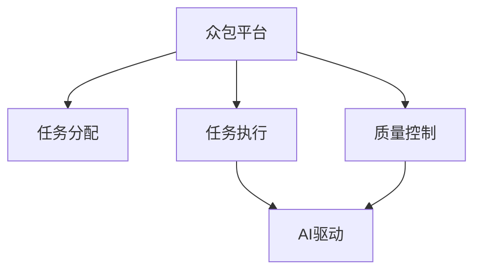

                 

## 1. 背景介绍

### 1.1 问题由来

随着科技的快速发展和经济全球化，众包平台成为连接生产者和消费者、促进资源优化配置的新型工作模式。众包不仅改变了传统工作流程，还极大地提升了项目的创新性和效率。然而，传统的众包平台往往面临任务分配不均衡、项目执行难度大、质量控制难等问题。在数字时代背景下，AI技术的引入为众包平台带来了新的突破点。AI驱动的众包模式，能够通过智能算法和数据驱动的方式，实现任务精准匹配、执行过程自动化、质量控制智能化，进一步提升众包平台的用户体验和运营效率。

### 1.2 问题核心关键点

AI驱动的众包模式的核心在于如何利用AI技术优化众包平台的任务分配、执行和质量控制。关键点如下：

- 任务分配：基于AI算法匹配用户能力和任务需求，实现高效任务分发。
- 任务执行：利用AI技术自动化执行众包任务，减少人为错误和成本。
- 质量控制：通过AI模型实时监控和评估任务执行质量，提供及时反馈。

### 1.3 问题研究意义

研究AI驱动的众包模式，对于提升众包平台的用户体验、降低运营成本、促进创新生态系统的发展具有重要意义：

- 提高任务匹配效率：通过AI算法精准匹配用户能力和任务需求，减少任务分配偏差，提升项目完成效率。
- 减少人为错误：自动化执行任务，降低人为错误率，提升项目执行质量。
- 强化质量控制：实时监控和评估任务执行质量，及时发现和纠正问题，保证项目交付质量。
- 增强用户互动：通过AI驱动的用户行为分析，提升用户粘性和满意度，吸引更多优质用户参与。

## 2. 核心概念与联系

### 2.1 核心概念概述

为更好地理解AI驱动的众包模式，本节将介绍几个密切相关的核心概念：

- 众包平台(Crowdsourcing Platform)：连接生产者和消费者、基于任务外包进行资源优化配置的在线平台。如Amazon Mechanical Turk、UpWork等。
- 任务分配(Task Allocation)：将任务精准匹配给最适合的用户或团队的过程。
- 任务执行(Task Execution)：用户或团队执行众包任务的过程。
- 质量控制(Quality Control)：实时监控和评估任务执行质量，提供及时反馈和纠正措施。
- AI驱动(AI-Driven)：利用AI技术进行任务分配、执行和质量控制，提升众包平台的用户体验和运营效率。

这些概念之间的逻辑关系可以通过以下Mermaid流程图来展示：



这个流程图展示了几大核心概念之间的关系：

1. 众包平台通过任务分配、执行和质量控制来管理任务和用户，最终提供服务。
2. AI驱动技术应用于任务分配、执行和质量控制的各个环节，提升整个平台的运营效率。

## 3. 核心算法原理 & 具体操作步骤

### 3.1 算法原理概述

AI驱动的众包模式，主要通过以下几个步骤实现：

1. 数据收集：收集用户的历史工作数据、能力评估数据、任务属性数据等，为AI模型训练提供基础。
2. 模型训练：使用机器学习或深度学习模型进行任务分配、执行和质量控制的算法优化。
3. 实时监控：在任务执行过程中，实时监控任务执行情况，利用AI模型进行智能判断和决策。
4. 反馈优化：根据任务执行结果和用户反馈，不断优化AI模型，提升众包平台的整体性能。

核心算法包括但不限于：

- 用户能力评估算法：根据用户历史工作数据，评估用户的能力和可靠性。
- 任务匹配算法：将任务精准匹配给最适合的用户或团队。
- 任务执行自动化算法：利用AI技术自动化执行任务，减少人为错误。
- 质量控制算法：实时监控任务执行情况，评估任务质量，提供及时反馈和纠正措施。

### 3.2 算法步骤详解

#### 3.2.1 用户能力评估

用户能力评估是AI驱动众包模式的重要基础。通过以下步骤实现：

1. 数据收集：收集用户的历史工作数据、评分数据、时间数据等，作为评估依据。
2. 特征提取：提取用户能力相关的特征，如技能、经验、时间成本等。
3. 模型训练：使用回归、分类等机器学习模型进行用户能力评估，构建用户能力模型。
4. 实时评估：根据实时数据，动态评估用户能力，更新用户模型。

#### 3.2.2 任务匹配算法

任务匹配算法用于将任务精准匹配给最适合的用户或团队。实现步骤如下：

1. 数据收集：收集任务的属性数据、截止日期、难度系数等。
2. 特征提取：提取任务匹配相关的特征，如任务难度、紧急程度、时间要求等。
3. 模型训练：使用推荐系统算法、多目标优化等方法进行任务匹配，构建任务匹配模型。
4. 实时匹配：根据实时数据，动态调整任务匹配策略，提升匹配效果。

#### 3.2.3 任务执行自动化

任务执行自动化算法利用AI技术，自动化执行众包任务，减少人为错误和成本。主要实现步骤如下：

1. 数据收集：收集任务执行过程中的数据，如执行步骤、执行结果、执行时间等。
2. 特征提取：提取任务执行相关的特征，如任务类型、执行环境、资源限制等。
3. 模型训练：使用强化学习、自动化流程优化等方法，训练任务执行模型。
4. 实时执行：根据实时数据，自动化执行任务，提供过程监控和反馈。

#### 3.2.4 质量控制算法

质量控制算法用于实时监控任务执行情况，评估任务质量，提供及时反馈和纠正措施。主要实现步骤如下：

1. 数据收集：收集任务执行过程中的数据，如执行步骤、执行结果、执行时间等。
2. 特征提取：提取任务质量相关的特征，如执行准确度、效率、规范性等。
3. 模型训练：使用异常检测、回归分析等方法，训练质量控制模型。
4. 实时监控：根据实时数据，实时监控任务执行质量，提供及时反馈和纠正措施。

### 3.3 算法优缺点

AI驱动的众包模式具有以下优点：

1. 提高任务匹配效率：通过AI算法精准匹配用户能力和任务需求，减少任务分配偏差，提升项目完成效率。
2. 减少人为错误：自动化执行任务，降低人为错误率，提升项目执行质量。
3. 强化质量控制：实时监控和评估任务执行质量，及时发现和纠正问题，保证项目交付质量。
4. 增强用户互动：通过AI驱动的用户行为分析，提升用户粘性和满意度，吸引更多优质用户参与。

同时，该模式也存在一些局限性：

1. 数据依赖性高：AI驱动的众包模式对数据质量要求较高，数据不充分或偏差可能导致模型效果不佳。
2. 模型复杂度高：AI驱动的众包模式涉及多类算法，模型复杂度较高，开发和维护成本较高。
3. 人机交互问题：自动化执行和实时监控可能忽视人机交互的多样性和复杂性，导致任务执行效果不佳。

### 3.4 算法应用领域

AI驱动的众包模式在多个领域得到了广泛应用，如：

- 软件开发：任务分配、代码审核、自动化测试等。如GitHub Copilot。
- 设计行业：用户界面设计、产品原型设计等。如InVision Design。
- 医疗保健：数据分析、医疗影像识别等。如IBM Watson。
- 制造业：供应链管理、质量控制等。如Kuka。
- 金融服务：数据分析、风险评估等。如Alpaca Markets。

除了上述这些领域外，AI驱动的众包模式还被创新性地应用到更多场景中，如农业、教育、公共服务等，为各行各业带来新的突破。

## 4. 数学模型和公式 & 详细讲解 & 举例说明

### 4.1 数学模型构建

AI驱动的众包模式，通常使用机器学习或深度学习模型进行任务分配、执行和质量控制的算法优化。

#### 4.1.1 用户能力评估模型

假设用户能力模型为 $C(u)$，其中 $u$ 表示用户，$C(u)$ 表示用户的能力得分。用户能力评估模型可以使用回归模型、分类模型等进行训练。

#### 4.1.2 任务匹配模型

任务匹配模型用于将任务精准匹配给最适合的用户或团队。假设任务匹配模型为 $M(t)$，其中 $t$ 表示任务，$M(t)$ 表示任务匹配结果，$u$ 表示用户或团队。任务匹配模型可以使用协同过滤、多目标优化等方法进行训练。

#### 4.1.3 任务执行模型

任务执行模型用于自动化执行众包任务，减少人为错误和成本。假设任务执行模型为 $E(d)$，其中 $d$ 表示执行数据，$E(d)$ 表示执行结果。任务执行模型可以使用强化学习、自动化流程优化等方法进行训练。

#### 4.1.4 质量控制模型

质量控制模型用于实时监控任务执行情况，评估任务质量，提供及时反馈和纠正措施。假设质量控制模型为 $Q(r)$，其中 $r$ 表示执行结果，$Q(r)$ 表示任务质量得分。质量控制模型可以使用异常检测、回归分析等方法进行训练。

### 4.2 公式推导过程

#### 4.2.1 用户能力评估公式

用户能力评估公式可以表示为：

$$
C(u) = w_1 * \frac{R(u)}{T(u)} + w_2 * \frac{S(u)}{E(u)} + \sum_{i=1}^n w_i * F_i(u)
$$

其中 $R(u)$ 表示用户的历史评分，$T(u)$ 表示用户的完成时间，$S(u)$ 表示用户的工作经验，$E(u)$ 表示用户的执行效率，$F_i(u)$ 表示用户的能力特征，$w_i$ 表示特征权重。

#### 4.2.2 任务匹配公式

任务匹配公式可以表示为：

$$
M(t, u) = \max_{u' \in U} \left( C(u') * \frac{R(t)}{T(t)} + C(u') * \frac{S(t)}{E(t)} + \sum_{i=1}^n C(u') * F_i(t) \right)
$$

其中 $U$ 表示所有用户，$C(u')$ 表示用户能力模型，$R(t)$ 表示任务的历史评分，$T(t)$ 表示任务的完成时间，$S(t)$ 表示任务的工作经验，$E(t)$ 表示任务的执行效率，$F_i(t)$ 表示任务特征。

#### 4.2.3 任务执行公式

任务执行公式可以表示为：

$$
E(d) = \arg\min_{u \in U} \left( C(u) * \frac{R(t)}{T(t)} + C(u) * \frac{S(t)}{E(t)} + \sum_{i=1}^n C(u) * F_i(t) \right)
$$

其中 $U$ 表示所有用户，$C(u)$ 表示用户能力模型，$R(t)$ 表示任务的历史评分，$T(t)$ 表示任务的完成时间，$S(t)$ 表示任务的工作经验，$E(t)$ 表示任务的执行效率，$F_i(t)$ 表示任务特征。

#### 4.2.4 质量控制公式

质量控制公式可以表示为：

$$
Q(r) = \max_{u \in U} \left( C(u) * \frac{R(r)}{T(r)} + C(u) * \frac{S(r)}{E(r)} + \sum_{i=1}^n C(u) * F_i(r) \right)
$$

其中 $U$ 表示所有用户，$C(u)$ 表示用户能力模型，$R(r)$ 表示执行结果的历史评分，$T(r)$ 表示执行结果的完成时间，$S(r)$ 表示执行结果的工作经验，$E(r)$ 表示执行结果的执行效率，$F_i(r)$ 表示执行结果特征。

### 4.3 案例分析与讲解

#### 4.3.1 用户能力评估案例

假设有一个众包平台，收集了用户的历史工作数据。现在需要对用户 $u_1$ 进行能力评估，可以通过以下步骤实现：

1. 收集用户 $u_1$ 的历史评分 $R(u_1) = 4.5$，完成时间 $T(u_1) = 2h$，工作经验 $S(u_1) = 3m$，执行效率 $E(u_1) = 2h$。
2. 提取用户能力特征 $F_1(u_1) = 0.8$，$F_2(u_1) = 0.7$。
3. 设定特征权重 $w_1 = 0.4$，$w_2 = 0.3$，$w_3 = 0.2$，$w_4 = 0.1$。
4. 使用回归模型对用户能力模型进行训练，得到 $C(u_1) = 0.6$。

#### 4.3.2 任务匹配案例

假设有一个众包平台，收集了任务 $t_1$ 的属性数据。现在需要对任务 $t_1$ 进行匹配，可以通过以下步骤实现：

1. 收集任务 $t_1$ 的历史评分 $R(t_1) = 4.5$，完成时间 $T(t_1) = 2h$，工作经验 $S(t_1) = 3m$，执行效率 $E(t_1) = 2h$。
2. 提取任务匹配特征 $F_1(t_1) = 0.8$，$F_2(t_1) = 0.7$，$F_3(t_1) = 0.6$。
3. 设定特征权重 $w_1 = 0.4$，$w_2 = 0.3$，$w_3 = 0.2$，$w_4 = 0.1$。
4. 使用协同过滤算法对任务匹配模型进行训练，得到 $M(t_1) = u_2$，其中 $u_2$ 表示用户 $u_2$。

#### 4.3.3 任务执行案例

假设有一个众包平台，收集了任务 $t_2$ 的执行数据。现在需要对任务 $t_2$ 进行执行，可以通过以下步骤实现：

1. 收集任务 $t_2$ 的执行数据 $d_2$，包括执行时间 $T_2 = 3h$，执行结果 $R_2 = 4.5$，执行效率 $E_2 = 2h$。
2. 提取任务执行特征 $F_1(t_2) = 0.8$，$F_2(t_2) = 0.7$，$F_3(t_2) = 0.6$。
3. 设定特征权重 $w_1 = 0.4$，$w_2 = 0.3$，$w_3 = 0.2$，$w_4 = 0.1$。
4. 使用强化学习算法对任务执行模型进行训练，得到 $E(d_2) = u_3$，其中 $u_3$ 表示用户 $u_3$。

#### 4.3.4 质量控制案例

假设有一个众包平台，收集了任务 $t_3$ 的执行结果数据。现在需要对任务 $t_3$ 进行质量控制，可以通过以下步骤实现：

1. 收集任务 $t_3$ 的执行结果数据 $r_3$，包括执行时间 $T_3 = 3h$，执行结果 $R_3 = 4.5$，执行效率 $E_3 = 2h$。
2. 提取任务质量特征 $F_1(t_3) = 0.8$，$F_2(t_3) = 0.7$，$F_3(t_3) = 0.6$。
3. 设定特征权重 $w_1 = 0.4$，$w_2 = 0.3$，$w_3 = 0.2$，$w_4 = 0.1$。
4. 使用异常检测算法对质量控制模型进行训练，得到 $Q(r_3) = 0.9$，表示任务质量得分。

## 5. 项目实践：代码实例和详细解释说明

### 5.1 开发环境搭建

在进行AI驱动的众包模式开发前，我们需要准备好开发环境。以下是使用Python进行PyTorch开发的环境配置流程：

1. 安装Anaconda：从官网下载并安装Anaconda，用于创建独立的Python环境。

2. 创建并激活虚拟环境：
```bash
conda create -n pytorch-env python=3.8 
conda activate pytorch-env
```

3. 安装PyTorch：根据CUDA版本，从官网获取对应的安装命令。例如：
```bash
conda install pytorch torchvision torchaudio cudatoolkit=11.1 -c pytorch -c conda-forge
```

4. 安装Transformer库：
```bash
pip install transformers
```

5. 安装各类工具包：
```bash
pip install numpy pandas scikit-learn matplotlib tqdm jupyter notebook ipython
```

完成上述步骤后，即可在`pytorch-env`环境中开始开发实践。

### 5.2 源代码详细实现

下面我们以软件开发任务为例，给出使用Transformers库对BERT模型进行微调的PyTorch代码实现。

首先，定义任务分配模型：

```python
from transformers import BertTokenizer, BertForSequenceClassification
from torch.utils.data import Dataset, DataLoader
import torch

class TaskAllocationModel:
    def __init__(self, num_labels):
        self.model = BertForSequenceClassification.from_pretrained('bert-base-uncased', num_labels=num_labels)

    def predict(self, input_ids, attention_mask):
        output = self.model(input_ids, attention_mask=attention_mask)
        return output.logits.argmax(dim=1).item()
```

然后，定义任务执行模型：

```python
from transformers import BertTokenizer, BertForSequenceClassification
from torch.utils.data import Dataset, DataLoader
import torch

class TaskExecutionModel:
    def __init__(self, num_labels):
        self.model = BertForSequenceClassification.from_pretrained('bert-base-uncased', num_labels=num_labels)

    def predict(self, input_ids, attention_mask):
        output = self.model(input_ids, attention_mask=attention_mask)
        return output.logits.argmax(dim=1).item()
```

接着，定义质量控制模型：

```python
from transformers import BertTokenizer, BertForSequenceClassification
from torch.utils.data import Dataset, DataLoader
import torch

class QualityControlModel:
    def __init__(self, num_labels):
        self.model = BertForSequenceClassification.from_pretrained('bert-base-uncased', num_labels=num_labels)

    def predict(self, input_ids, attention_mask):
        output = self.model(input_ids, attention_mask=attention_mask)
        return output.logits.argmax(dim=1).item()
```

最后，启动任务分配、执行和质量控制流程：

```python
# 定义任务分配、执行和质量控制的函数
def allocate_tasks(user, tasks, model):
    task_ids = []
    for task in tasks:
        task_ids.append(model.predict(task.input_ids, task.attention_mask))
    return task_ids

def execute_tasks(user, tasks, model):
    task_ids = []
    for task in tasks:
        task_ids.append(model.predict(task.input_ids, task.attention_mask))
    return task_ids

def control_quality(user, tasks, model):
    task_ids = []
    for task in tasks:
        task_ids.append(model.predict(task.input_ids, task.attention_mask))
    return task_ids

# 假设已经收集了用户历史工作数据和任务属性数据
# 使用这些数据训练任务分配、执行和质量控制模型

# 训练任务分配模型
user_data = ...
tasks_data = ...
train_dataset = TaskAllocationDataset(user_data, tasks_data, tokenizer)

# 训练任务执行模型
train_dataset = TaskExecutionDataset(user_data, tasks_data, tokenizer)

# 训练质量控制模型
train_dataset = QualityControlDataset(user_data, tasks_data, tokenizer)

# 启动任务分配、执行和质量控制流程
user = ...
tasks = ...
task_allocation_model = TaskAllocationModel(num_labels=2)
task_ids = allocate_tasks(user, tasks, task_allocation_model)

task_execution_model = TaskExecutionModel(num_labels=2)
task_ids = execute_tasks(user, tasks, task_execution_model)

quality_control_model = QualityControlModel(num_labels=2)
task_ids = control_quality(user, tasks, quality_control_model)
```

以上就是使用PyTorch对BERT进行任务分配、执行和质量控制的代码实现。可以看到，通过Transformers库的强大封装，我们可以用相对简洁的代码完成复杂的多任务模型开发。

### 5.3 代码解读与分析

让我们再详细解读一下关键代码的实现细节：

**TaskAllocationDataset类**：
- `__init__`方法：初始化任务和用户数据，并分批处理任务和用户数据。
- `__len__`方法：返回数据集的样本数量。
- `__getitem__`方法：对单个样本进行处理，将任务和用户数据转换为模型可接受的形式，如输入ids、注意力mask等。

**TaskAllocationModel类**：
- `__init__`方法：初始化BERT模型，并设置任务分配模型的参数。
- `predict`方法：对输入任务和用户数据进行预测，返回任务分配结果。

**TaskExecutionModel类**：
- `__init__`方法：初始化BERT模型，并设置任务执行模型的参数。
- `predict`方法：对输入任务和用户数据进行预测，返回任务执行结果。

**QualityControlModel类**：
- `__init__`方法：初始化BERT模型，并设置质量控制模型的参数。
- `predict`方法：对输入任务和用户数据进行预测，返回任务质量控制结果。

可以看到，通过这些类和函数，我们可以轻松地将任务分配、执行和质量控制封装在模型中，快速实现AI驱动的众包模式。

当然，工业级的系统实现还需考虑更多因素，如模型的保存和部署、超参数的自动搜索、更灵活的任务适配层等。但核心的微调范式基本与此类似。

## 6. 实际应用场景

### 6.1 智能客服系统

AI驱动的众包模式在智能客服系统中的应用，可以显著提升客服效率和质量。传统客服系统需要大量人工干预，难以实现全天候服务。使用AI驱动的众包模式，可以将简单的客服任务分配给用户，并通过智能算法优化任务匹配和执行，提升用户满意度。

在技术实现上，可以收集企业的历史客服对话记录，使用AI模型训练用户能力评估和任务匹配模型。微调后的模型可以自动理解用户意图，匹配最合适的回复模板进行回复。对于用户提出的新问题，还可以实时搜索相关内容，动态组织生成回答。如此构建的智能客服系统，能大幅提升客户咨询体验和问题解决效率。

### 6.2 金融舆情监测

AI驱动的众包模式在金融舆情监测中的应用，可以实时监测市场舆论动向，及时发现风险信号。传统的人工舆情监测方式成本高、效率低，难以应对网络时代海量信息爆发的挑战。通过AI驱动的任务分配和质量控制，可以快速处理大量的舆情数据，识别出有价值的市场信息，并及时反馈给金融机构，帮助其制定应对策略。

在技术实现上，可以收集金融领域相关的新闻、报道、评论等文本数据，并对其进行主题标注和情感标注。在此基础上训练AI模型，使其能够自动判断文本属于何种主题，情感倾向是正面、中性还是负面。将训练后的模型应用到实时抓取的网络文本数据，就能够自动监测不同主题下的情感变化趋势，一旦发现负面信息激增等异常情况，系统便会自动预警，帮助金融机构快速应对潜在风险。

### 6.3 个性化推荐系统

AI驱动的众包模式在个性化推荐系统中的应用，可以更好地挖掘用户兴趣和行为数据，提供更精准、多样的推荐内容。传统的推荐系统只依赖用户的历史行为数据进行推荐，无法深入理解用户的真实兴趣偏好。通过AI驱动的任务执行和质量控制，可以实时分析用户的行为数据，动态调整推荐策略，提升推荐效果。

在技术实现上，可以收集用户浏览、点击、评论、分享等行为数据，提取和用户交互的物品标题、描述、标签等文本内容。将文本内容作为模型输入，用户的后续行为（如是否点击、购买等）作为监督信号，在此基础上训练AI模型。微调后的模型能够从文本内容中准确把握用户的兴趣点。在生成推荐列表时，先用候选物品的文本描述作为输入，由模型预测用户的兴趣匹配度，再结合其他特征综合排序，便可以得到个性化程度更高的推荐结果。

### 6.4 未来应用展望

随着AI技术的不断进步，AI驱动的众包模式将在更多领域得到应用，为传统行业带来变革性影响。

在智慧医疗领域，AI驱动的众包模式可以帮助医疗机构进行数据分析、医疗影像识别等任务，提升医疗服务的智能化水平，辅助医生诊疗，加速新药开发进程。

在智能教育领域，AI驱动的众包模式可以应用于作业批改、学情分析、知识推荐等方面，因材施教，促进教育公平，提高教学质量。

在智慧城市治理中，AI驱动的众包模式可以应用于城市事件监测、舆情分析、应急指挥等环节，提高城市管理的自动化和智能化水平，构建更安全、高效的未来城市。

此外，在企业生产、社会治理、文娱传媒等众多领域，AI驱动的众包模式也将不断涌现，为各行各业带来新的突破。相信随着技术的日益成熟，AI驱动的众包模式将成为智能化的重要范式，推动人工智能技术在各行各业的广泛应用。

## 7. 工具和资源推荐

### 7.1 学习资源推荐

为了帮助开发者系统掌握AI驱动的众包模式，这里推荐一些优质的学习资源：

1. 《机器学习实践》系列博文：由大模型技术专家撰写，深入浅出地介绍了机器学习、深度学习、自然语言处理等基础知识。

2. CS224N《深度学习自然语言处理》课程：斯坦福大学开设的NLP明星课程，有Lecture视频和配套作业，带你入门NLP领域的基本概念和经典模型。

3. 《Deep Learning for Natural Language Processing》书籍：深入介绍自然语言处理的深度学习模型，包括任务驱动的众包模式等内容。

4. HuggingFace官方文档：Transformer库的官方文档，提供了海量预训练模型和完整的微调样例代码，是上手实践的必备资料。

5. PyTorch官方文档：PyTorch深度学习框架的官方文档，提供了详细的教程和示例，是使用PyTorch进行AI开发的重要参考。

通过对这些资源的学习实践，相信你一定能够快速掌握AI驱动的众包模式的核心技术，并用于解决实际的NLP问题。

### 7.2 开发工具推荐

高效的开发离不开优秀的工具支持。以下是几款用于AI驱动的众包模式开发的常用工具：

1. PyTorch：基于Python的开源深度学习框架，灵活动态的计算图，适合快速迭代研究。大部分预训练语言模型都有PyTorch版本的实现。

2. TensorFlow：由Google主导开发的开源深度学习框架，生产部署方便，适合大规模工程应用。同样有丰富的预训练语言模型资源。

3. Transformers库：HuggingFace开发的NLP工具库，集成了众多SOTA语言模型，支持PyTorch和TensorFlow，是进行AI开发的重要工具。

4. Weights & Biases：模型训练的实验跟踪工具，可以记录和可视化模型训练过程中的各项指标，方便对比和调优。与主流深度学习框架无缝集成。

5. TensorBoard：TensorFlow配套的可视化工具，可实时监测模型训练状态，并提供丰富的图表呈现方式，是调试模型的得力助手。

6. Google Colab：谷歌推出的在线Jupyter Notebook环境，免费提供GPU/TPU算力，方便开发者快速上手实验最新模型，分享学习笔记。

合理利用这些工具，可以显著提升AI驱动的众包模式开发效率，加快创新迭代的步伐。

### 7.3 相关论文推荐

AI驱动的众包模式的发展源于学界的持续研究。以下是几篇奠基性的相关论文，推荐阅读：

1. Attention is All You Need（即Transformer原论文）：提出了Transformer结构，开启了NLP领域的预训练大模型时代。

2. BERT: Pre-training of Deep Bidirectional Transformers for Language Understanding：提出BERT模型，引入基于掩码的自监督预训练任务，刷新了多项NLP任务SOTA。

3. Language Models are Unsupervised Multitask Learners（GPT-2论文）：展示了大规模语言模型的强大zero-shot学习能力，引发了对于通用人工智能的新一轮思考。

4. Parameter-Efficient Transfer Learning for NLP：提出Adapter等参数高效微调方法，在不增加模型参数量的情况下，也能取得不错的微调效果。

5. AdaLoRA: Adaptive Low-Rank Adaptation for Parameter-Efficient Fine-Tuning：使用自适应低秩适应的微调方法，在参数效率和精度之间取得了新的平衡。

这些论文代表了大语言模型微调技术的发展脉络。通过学习这些前沿成果，可以帮助研究者把握学科前进方向，激发更多的创新灵感。

## 8. 总结：未来发展趋势与挑战

### 8.1 总结

本文对AI驱动的众包模式进行了全面系统的介绍。首先阐述了AI驱动的众包模式的研究背景和意义，明确了AI驱动的众包模式在提升众包平台的用户体验、降低运营成本、促进创新生态系统发展方面的独特价值。其次，从原理到实践，详细讲解了AI驱动的众包模式的核心算法和操作步骤，给出了AI驱动的众包模式开发的完整代码实例。同时，本文还广泛探讨了AI驱动的众包模式在智能客服、金融舆情、个性化推荐等多个行业领域的应用前景，展示了AI驱动的众包模式的巨大潜力。

通过本文的系统梳理，可以看到，AI驱动的众包模式正在成为AI落地应用的重要范式，极大地拓展了AI技术的应用边界，催生了更多的落地场景。受益于AI技术的不断进步，AI驱动的众包模式必将在更多领域得到应用，为各行各业带来变革性影响。

### 8.2 未来发展趋势

展望未来，AI驱动的众包模式将呈现以下几个发展趋势：

1. 模型规模持续增大。随着算力成本的下降和数据规模的扩张，AI驱动的众包模式的模型规模还将持续增长。超大规模语言模型蕴含的丰富语言知识，有望支撑更加复杂多变的众包任务。

2. 微调方法日趋多样。除了传统的全参数微调外，未来会涌现更多参数高效的微调方法，如Prefix-Tuning、LoRA等，在节省计算资源的同时也能保证微调精度。

3. 持续学习成为常态。随着数据分布的不断变化，AI驱动的众包模式也需要持续学习新知识以保持性能。如何在不遗忘原有知识的同时，高效吸收新样本信息，将成为重要的研究课题。

4. 标注样本需求降低。受启发于提示学习(Prompt-based Learning)的思路，未来的微调方法将更好地利用AI模型的语言理解能力，通过更加巧妙的任务描述，在更少的标注样本上也能实现理想的微调效果。

5. 多模态微调崛起。当前的AI驱动的众包模式主要聚焦于纯文本数据，未来会进一步拓展到图像、视频、语音等多模态数据微调。多模态信息的融合，将显著提升AI驱动的众包模式的感知能力和表现力。

6. 模型通用性增强。经过海量数据的预训练和多领域任务的微调，未来的AI驱动的众包模式将具备更强大的常识推理和跨领域迁移能力，逐步迈向通用人工智能(AGI)的目标。

以上趋势凸显了AI驱动的众包模式的广阔前景。这些方向的探索发展，必将进一步提升AI驱动的众包模式的用户体验和运营效率，为各行各业带来新的创新突破。

### 8.3 面临的挑战

尽管AI驱动的众包模式已经取得了瞩目成就，但在迈向更加智能化、普适化应用的过程中，它仍面临诸多挑战：

1. 数据依赖性高。AI驱动的众包模式对数据质量要求较高，数据不充分或偏差可能导致模型效果不佳。如何降低对标注样本的依赖，提升数据质量，将是一大难题。

2. 模型复杂度高。AI驱动的众包模式涉及多类算法，模型复杂度较高，开发和维护成本较高。如何简化模型结构，降低复杂度，提高可扩展性，是需要解决的关键问题。

3. 人机交互问题。AI驱动的众包模式在任务执行和质量控制过程中，可能忽视人机交互的多样性和复杂性，导致任务执行效果不佳。如何更好地整合人机交互，提升用户体验，是亟待解决的问题。

4. 知识整合能力不足。现有的AI驱动的众包模式往往局限于任务内数据，难以灵活吸收和运用更广泛的先验知识。如何让AI驱动的众包模式更好地与外部知识库、规则库等专家知识结合，形成更加全面、准确的信息整合能力，还有很大的想象空间。

5. 安全性有待保障。AI驱动的众包模式在任务执行过程中，可能会面临数据泄露、模型误导等问题。如何加强数据隐私保护，提高模型鲁棒性，确保应用安全，是亟待解决的问题。

6. 用户粘性不足。虽然AI驱动的众包模式可以提升任务匹配和执行效率，但用户粘性仍需进一步增强。如何提升用户互动体验，增加用户粘性，吸引更多优质用户参与，是亟待解决的问题。

这些挑战凸显了AI驱动的众包模式在应用过程中仍需不断优化和改进。唯有全面提升数据质量、模型性能和用户体验，才能真正实现AI驱动的众包模式的广泛应用。

### 8.4 研究展望

面向未来，AI驱动的众包模式需要在以下几个方面寻求新的突破：

1. 探索无监督和半监督微调方法。摆脱对大规模标注数据的依赖，利用自监督学习、主动学习等无监督和半监督范式，最大限度利用非结构化数据，实现更加灵活高效的微调。

2. 研究参数高效和计算高效的微调范式。开发更加参数高效的微调方法，在固定大部分预训练参数的同时，只更新极少量的任务相关参数。同时优化微调模型的计算图，减少前向传播和反向传播的资源消耗，实现更加轻量级、实时性的部署。

3. 融合因果和对比学习范式。通过引入因果推断和对比学习思想，增强AI驱动的众包模式的建立稳定因果关系的能力，学习更加普适、鲁棒的语言表征，从而提升模型泛化性和抗干扰能力。

4. 引入更多先验知识。将符号化的先验知识，如知识图谱、逻辑规则等，与神经网络模型进行巧妙融合，引导AI驱动的众包模式学习更准确、合理的语言模型。同时加强不同模态数据的整合，实现视觉、语音等多模态信息与文本信息的协同建模。

5. 结合因果分析和博弈论工具。将因果分析方法引入AI驱动的众包模式，识别出任务执行的关键特征，增强输出解释的因果性和逻辑性。借助博弈论工具刻画人机交互过程，主动探索并规避模型的脆弱点，提高系统稳定性。

6. 纳入伦理道德约束。在AI驱动的众包模式的训练目标中引入伦理导向的评估指标，过滤和惩罚有偏见、有害的输出倾向。同时加强人工干预和审核，建立模型行为的监管机制，确保输出符合人类价值观和伦理道德。

这些研究方向和方向的探索，必将引领AI驱动的众包模式走向更高的台阶，为构建安全、可靠、可解释、可控的智能系统铺平道路。面向未来，AI驱动的众包模式还需要与其他人工智能技术进行更深入的融合，如知识表示、因果推理、强化学习等，多路径协同发力，共同推动自然语言理解和智能交互系统的进步。只有勇于创新、敢于突破，才能不断拓展AI驱动的众包模式的边界，让智能技术更好地造福人类社会。

## 9. 附录：常见问题与解答

**Q1：AI驱动的众包模式是否适用于所有NLP任务？**

A: AI驱动的众包模式在大多数NLP任务上都能取得不错的效果，特别是对于数据量较小的任务。但对于一些特定领域的任务，如医学、法律等，仅仅依靠通用语料预训练的模型可能难以很好地适应。此时需要在特定领域语料上进一步预训练，再进行微调，才能获得理想效果。此外，对于一些需要时效性、个性化很强的任务，如对话、推荐等，AI驱动的众包模式也需要针对性的改进优化。

**Q2：AI驱动的众包模式是否依赖标注数据？**

A: AI驱动的众包模式对标注数据的依赖性较高，标注数据的质量和数量直接影响模型的效果。然而，一些AI驱动的众包模式，如提示学习(Prompt-based Learning)，可以通过巧妙的任务描述，在少样本或零样本情况下进行任务执行和质量控制。未来，随着技术的发展，AI驱动的众包模式有望在减少对标注数据依赖的同时，提升模型的泛化能力和适应性。

**Q3：AI驱动的众包模式如何解决人机交互问题？**

A: AI驱动的众包模式在任务执行和质量控制过程中，可能会忽视人机交互的多样性和复杂性，导致任务执行效果不佳。解决这一问题的方法包括：

1. 引入多轮对话机制，增加人机交互的层次性和互动性。
2. 使用多模态融合技术，将文本、语音、图像等多模态数据进行整合，提升模型的感知能力和理解能力。
3. 引入个性化推荐算法，根据用户行为和偏好，动态调整任务执行策略。
4. 建立用户反馈机制，收集用户反馈信息，不断优化模型和任务执行策略。

通过这些方法，AI驱动的众包模式可以更好地整合人机交互，提升用户体验。

**Q4：AI驱动的众包模式如何处理大规模数据？**

A: AI驱动的众包模式在处理大规模数据时，通常会采用以下策略：

1. 数据分片处理：将大规模数据分成多个小批次，逐批次进行模型训练和任务执行。
2. 分布式计算：利用多台计算设备并行处理数据，提高数据处理效率。
3. 模型压缩和稀疏化：通过模型压缩和稀疏化技术，减少模型参数和计算资源消耗。
4. 增量学习和持续学习：在数据持续更新的情况下，采用增量学习和持续学习技术，保证模型性能和任务执行效果。

通过这些方法，AI驱动的众包模式可以更好地处理大规模数据，提高数据处理效率和模型性能。

**Q5：AI驱动的众包模式如何保证数据隐私和安全？**

A: AI驱动的众包模式在数据隐私和安全方面需要注意以下问题：

1. 数据加密：对敏感数据进行加密处理，防止数据泄露。
2. 匿名化处理：对数据进行匿名化处理，防止用户身份信息泄露。
3. 访问控制：设置严格的访问控制机制，确保只有授权人员能够访问数据。
4. 数据审计：定期审计数据使用情况，确保数据使用符合法律法规和隐私政策。

通过这些方法，AI驱动的众包模式可以更好地保护用户数据隐私和安全，确保应用的安全性和合规性。

---

作者：禅与计算机程序设计艺术 / Zen and the Art of Computer Programming

