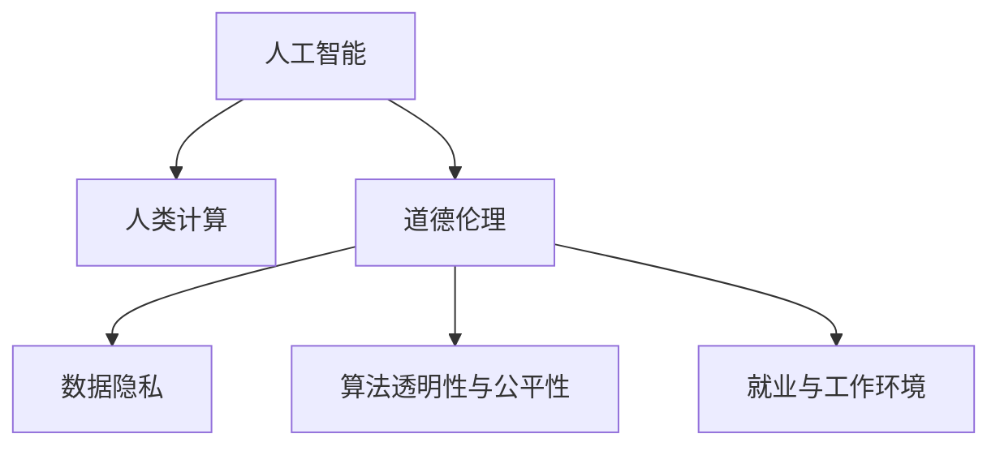

                 

# AI驱动的创新：人类计算在商业中的道德考虑因素

> 关键词：人工智能,商业应用,道德伦理,计算公平,数据隐私,算法透明性

## 1. 背景介绍

### 1.1 问题由来

随着人工智能（AI）技术在商业领域的深入应用，人类计算的广泛使用已经成为了推动商业创新的重要力量。从自动化流程优化、智能客户服务到精准市场分析，AI驱动的决策和流程改正在众多领域带来了前所未有的变革。然而，这种广泛应用的同时也带来了诸多道德和伦理问题，这些问题不仅影响着企业的商业决策，还直接关系到公众的利益和信任。

### 1.2 问题核心关键点

当前，人类计算在商业应用中面临的主要道德伦理问题包括但不限于：

1. **数据隐私与安全**：如何保护用户数据隐私不被滥用，是企业必须面对的首要道德问题。用户数据的收集、存储和处理必须遵守法律法规，防止数据泄露和滥用。
2. **算法透明性与公平性**：算法的决策过程必须透明，避免黑箱操作。同时，算法应保持公平，不应因种族、性别、年龄等个人特征而产生歧视。
3. **就业与工作环境**：自动化和机器人技术的应用可能导致部分岗位的消失，如何平衡人类劳动与AI辅助之间的关系，以及如何为被影响的员工提供支持与再培训，是一个重要议题。
4. **信息与知识垄断**：大型科技公司通过数据和算法优势，可能形成信息与知识垄断，影响市场公平竞争。如何确保信息共享和公平竞争，是政策制定者和企业都需思考的问题。
5. **社会与环境影响**：AI技术在提高生产效率的同时，也可能加剧资源消耗和环境破坏，如何平衡经济效益与环境保护，是一个必须认真考虑的问题。

这些问题不仅需要技术上的解决方案，更需要伦理道德层面的深思熟虑。本文将从这些关键点出发，探讨如何在人类计算的商业应用中，找到技术创新与道德伦理之间的平衡。

## 2. 核心概念与联系

### 2.1 核心概念概述

为更好地理解人类计算在商业中的道德伦理问题，本节将介绍几个密切相关的核心概念：

- **人工智能（AI）**：一种通过算法和模型，使计算机系统具备类似人类智能的技术。AI技术包括机器学习、深度学习、自然语言处理等多种形式，广泛应用于商业领域。
- **人类计算**：利用计算机和AI技术，进行复杂的计算和决策过程，辅助或替代人类的工作。人类计算在商业中包括但不限于数据分析、决策支持、流程优化、客户服务等。
- **道德伦理**：关于行为的正确与错误、好的与坏的判断标准，在AI和人类计算领域，指涉及技术应用对个体、社会和环境影响的价值判断和规范约束。
- **数据隐私**：个人数据的收集、存储、处理和使用过程中，保护个人隐私不被滥用。
- **算法透明性与公平性**：算法的决策过程应透明，无偏见，避免因算法设计或数据偏差导致的歧视或不公。
- **就业与工作环境**：AI技术对劳动市场的影响，包括就业机会的增减、劳动力的结构变化等。

这些概念之间的逻辑关系可以通过以下Mermaid流程图来展示：



这个流程图展示出人类计算在商业中，与人工智能技术、道德伦理等概念之间的内在联系。

## 3. 核心算法原理 & 具体操作步骤
### 3.1 算法原理概述

在人类计算的商业应用中，道德伦理问题往往与AI算法的决策过程密切相关。因此，理解算法的原理是解决这些道德伦理问题的关键。

以推荐系统为例，其核心算法原理基于协同过滤和协同预测。推荐系统通过分析用户行为数据（如浏览历史、购买记录等），预测用户可能感兴趣的商品或服务，从而提供个性化的推荐。这一过程看似无害，但若用户数据被滥用，或推荐算法存在偏见，可能导致严重后果。

因此，在进行算法设计和应用时，需要考虑以下道德伦理问题：

- **数据隐私**：如何保护用户数据不被滥用，同时利用数据进行推荐。
- **算法透明性**：推荐算法的决策过程应透明，用户应能够理解其推荐逻辑。
- **公平性**：算法应无偏见，不因用户的个人特征（如性别、年龄等）而产生歧视。

### 3.2 算法步骤详解

基于协同过滤和协同预测的推荐系统主要包含以下步骤：

1. **数据收集与预处理**：收集用户行为数据，并进行清洗和预处理，去除噪声和异常数据。
2. **相似度计算**：计算用户间的相似度，找到与目标用户兴趣相似的其他用户。
3. **协同预测**：利用相似用户的历史行为数据，预测目标用户可能感兴趣的商品或服务。
4. **推荐排序**：对预测结果进行排序，将最符合用户兴趣的商品或服务推荐给用户。

### 3.3 算法优缺点

基于协同过滤和协同预测的推荐系统具有以下优点：

- **个性化推荐**：能够提供个性化的商品或服务推荐，提升用户体验。
- **效率高**：算法计算简单，推理速度快，适合大规模应用。

但同时也存在一些缺点：

- **冷启动问题**：新用户或未被覆盖的商品难以进行推荐。
- **数据依赖性强**：算法依赖于用户行为数据，数据质量直接影响推荐效果。
- **隐私风险**：收集和存储用户行为数据，可能带来隐私泄露风险。
- **算法偏见**：若数据存在偏见或算法设计不当，可能导致推荐结果不公平。

### 3.4 算法应用领域

基于协同过滤和协同预测的推荐系统已经在电商、社交媒体、视频流媒体等多个领域得到了广泛应用，成为提升用户体验的重要手段。例如：

- **电商平台**：利用用户浏览和购买记录，推荐相关商品，提高转化率和销售额。
- **社交媒体**：推荐用户感兴趣的内容，增加用户粘性和互动。
- **视频流媒体**：推荐用户可能感兴趣的视频内容，提升用户观看时长和满意度。

此外，推荐系统还被应用于个性化广告、内容推荐、金融产品推荐等多个领域，显著提升了各行业的商业价值。

## 4. 数学模型和公式 & 详细讲解 & 举例说明

### 4.1 数学模型构建

在推荐系统中，常用的数学模型包括矩阵分解、基于深度学习的模型（如神经协同过滤）等。这里以矩阵分解为例，构建推荐系统的数学模型。

设用户集为 $U=\{u_1,u_2,\cdots,u_n\}$，物品集为 $V=\{v_1,v_2,\cdots,v_m\}$，用户对物品的评分矩阵为 $R \in \mathbb{R}^{n \times m}$。矩阵分解的目标是将 $R$ 分解为两个低维矩阵 $P \in \mathbb{R}^{n \times k}$ 和 $Q \in \mathbb{R}^{k \times m}$ 的乘积，即 $R \approx PQ$。其中 $P$ 和 $Q$ 分别表示用户和物品的潜在特征向量。

### 4.2 公式推导过程

矩阵分解的推导过程如下：

设用户 $u_i$ 和物品 $v_j$ 的评分分别为 $r_{ij} \in R$，用户 $u_i$ 和物品 $v_j$ 的潜在特征向量分别为 $\overrightarrow{p_i} \in \mathbb{R}^{k}$ 和 $\overrightarrow{q_j} \in \mathbb{R}^{k}$。根据矩阵乘法，可以得到：

$$
\overrightarrow{r_{ij}} = \overrightarrow{p_i} \cdot \overrightarrow{q_j}
$$

对于任意用户 $u_i$ 和物品 $v_j$，假设其评分向量 $R_{i,j} \in \mathbb{R}^{k}$ 为：

$$
R_{i,j} = \overrightarrow{p_i} \cdot \overrightarrow{q_j}
$$

设 $R_{i,j} = \left[\begin{matrix}r_{i,1}, r_{i,2}, \cdots, r_{i,m}\end{matrix}\right]$，则：

$$
R \approx PQ = \left[\begin{matrix}P \cdot q_1 & P \cdot q_2 & \cdots & P \cdot q_m\end{matrix}\right]
$$

其中 $q_1, q_2, \cdots, q_m$ 为物品的潜在特征向量。

### 4.3 案例分析与讲解

在电商推荐系统中，可以使用上述矩阵分解模型进行推荐。假设用户 $u_i$ 对物品 $v_j$ 的评分 $r_{ij} \in R$，将评分矩阵 $R$ 分解为 $P$ 和 $Q$，则用户 $u_i$ 对物品 $v_j$ 的预测评分 $r_{ij}^{pred}$ 为：

$$
r_{ij}^{pred} = \overrightarrow{p_i} \cdot \overrightarrow{q_j}
$$

模型训练时，优化目标为：

$$
\min_{P, Q} ||R - PQ||_F^2
$$

其中 $||.||_F$ 表示矩阵的Frobenius范数。通过最小化矩阵分解误差，可以优化用户和物品的潜在特征向量 $P$ 和 $Q$，从而得到更准确的推荐结果。

## 5. 项目实践：代码实例和详细解释说明
### 5.1 开发环境搭建

在进行推荐系统开发前，我们需要准备好开发环境。以下是使用Python进行TensorFlow开发的环境配置流程：

1. 安装Anaconda：从官网下载并安装Anaconda，用于创建独立的Python环境。

2. 创建并激活虚拟环境：
```bash
conda create -n tf-env python=3.8 
conda activate tf-env
```

3. 安装TensorFlow：根据CUDA版本，从官网获取对应的安装命令。例如：
```bash
conda install tensorflow -c pytorch -c conda-forge
```

4. 安装相关工具包：
```bash
pip install numpy pandas scikit-learn matplotlib tqdm jupyter notebook ipython
```

完成上述步骤后，即可在`tf-env`环境中开始推荐系统开发。

### 5.2 源代码详细实现

这里我们以一个简单的协同过滤推荐系统为例，给出使用TensorFlow进行开发的PyTorch代码实现。

首先，定义推荐系统类：

```python
import tensorflow as tf

class RecommendationSystem:
    def __init__(self, n_users, n_items, n_factors):
        self.n_users = n_users
        self.n_items = n_items
        self.n_factors = n_factors
        self.user_factors = tf.Variable(tf.random.normal([n_users, n_factors]))
        self.item_factors = tf.Variable(tf.random.normal([n_items, n_factors]))
        self.rating_matrix = tf.Variable(tf.random.normal([n_users, n_items]))

    def predict_ratings(self, user_factors, item_factors):
        return tf.matmul(user_factors, item_factors)

    def loss_function(self):
        pred_ratings = self.predict_ratings(self.user_factors, self.item_factors)
        return tf.reduce_mean(tf.square(pred_ratings - self.rating_matrix))

    def train(self, learning_rate, num_epochs):
        optimizer = tf.keras.optimizers.Adam(learning_rate)
        for epoch in range(num_epochs):
            with tf.GradientTape() as tape:
                loss = self.loss_function()
            gradients = tape.gradient(loss, [self.user_factors, self.item_factors, self.rating_matrix])
            optimizer.apply_gradients(zip(gradients, [self.user_factors, self.item_factors, self.rating_matrix]))
            print(f"Epoch {epoch+1}, Loss: {loss:.4f}")
```

然后，定义训练函数：

```python
def train_model(model, learning_rate, num_epochs):
    model.train(learning_rate, num_epochs)
```

最后，启动训练流程：

```python
# 设置参数
n_users = 10000
n_items = 5000
n_factors = 10
learning_rate = 1e-3
num_epochs = 100

# 创建模型
model = RecommendationSystem(n_users, n_items, n_factors)

# 训练模型
train_model(model, learning_rate, num_epochs)
```

以上就是使用TensorFlow进行推荐系统开发的完整代码实现。可以看到，TensorFlow提供了强大的深度学习框架，使得推荐系统模型的开发和训练变得简洁高效。

### 5.3 代码解读与分析

让我们再详细解读一下关键代码的实现细节：

**RecommendationSystem类**：
- `__init__`方法：初始化用户数、物品数和因子数，以及用户和物品的潜在特征向量。
- `predict_ratings`方法：计算用户和物品的潜在特征向量乘积，得到预测评分。
- `loss_function`方法：计算预测评分与真实评分之间的均方误差。
- `train`方法：通过优化算法更新模型参数，最小化损失函数。

**训练函数train_model**：
- 使用Adam优化器，进行指定次数的训练迭代。
- 每次迭代时，计算损失函数并反向传播更新模型参数。
- 输出每次迭代的损失值。

**训练流程**：
- 设置模型参数。
- 创建推荐系统模型。
- 调用训练函数进行模型训练。

可以看到，TensorFlow提供了强大的深度学习框架，使得推荐系统模型的开发和训练变得简洁高效。开发者可以将更多精力放在模型改进、数据处理等高层逻辑上，而不必过多关注底层的实现细节。

当然，工业级的系统实现还需考虑更多因素，如模型的保存和部署、超参数的自动搜索、更灵活的任务适配层等。但核心的推荐算法基本与此类似。

## 6. 实际应用场景
### 6.1 电商推荐系统

基于协同过滤的推荐系统在电商推荐中得到了广泛应用。传统电商推荐系统主要依赖于用户历史购买记录和浏览行为，推荐相关商品，提升用户购物体验。但随着数据和算法的进步，推荐系统逐渐加入了个性化、动态调整等因素，如基于内容的推荐、社交推荐、实时推荐等，进一步提升了推荐效果。

在技术实现上，可以收集用户的历史行为数据，构建用户行为矩阵。在训练过程中，模型通过学习用户和物品的潜在特征向量，预测用户对未购买商品或未浏览网页的评分。结合评分排序，即可生成推荐列表。

### 6.2 内容推荐系统

内容推荐系统广泛应用在新闻、视频、音乐等多个领域，为用户推荐其可能感兴趣的内容。推荐系统通过分析用户的浏览历史、点赞行为等数据，预测用户对内容的评分。结合评分排序，即可生成个性化推荐列表。

在技术实现上，可以将内容看作物品，用户的评分视为行为数据。通过协同过滤或深度学习模型，预测用户对内容的评分，进而生成推荐列表。内容推荐系统能够显著提升用户的内容消费体验，增加平台的用户粘性。

### 6.3 金融推荐系统

金融领域中，推荐系统可以用于推荐投资组合、股票、基金等金融产品，帮助用户进行投资决策。推荐系统通过分析用户的投资偏好、风险承受能力等数据，预测用户对不同金融产品的评分。结合评分排序，即可生成推荐列表。

在技术实现上，可以将金融产品看作物品，用户的投资行为视为行为数据。通过协同过滤或深度学习模型，预测用户对不同金融产品的评分，进而生成推荐列表。金融推荐系统能够帮助用户更准确地进行投资决策，提升投资收益。

### 6.4 未来应用展望

随着推荐系统的不断演进，未来的应用场景将更加多样和广泛。除了电商、内容、金融等领域，推荐系统还被应用于医疗、教育、城市管理等多个垂直行业，为这些行业带来深度赋能。

在医疗领域，推荐系统可以用于推荐治疗方案、药物组合、医疗咨询等，帮助医生和患者进行医疗决策。在教育领域，推荐系统可以用于推荐课程、教材、辅导等，提升教学效果和学习效率。在城市管理领域，推荐系统可以用于推荐路线、服务、事件等，优化城市交通和管理。

未来，随着推荐系统的技术成熟和应用普及，其在更多垂直行业的应用前景将更加广阔，为各行各业带来深远的影响。

## 7. 工具和资源推荐
### 7.1 学习资源推荐

为了帮助开发者系统掌握推荐系统的理论基础和实践技巧，这里推荐一些优质的学习资源：

1. 《推荐系统实践》系列博文：由大模型技术专家撰写，深入浅出地介绍了推荐系统的基本概念、算法原理和实现技巧。

2. CS229《机器学习》课程：斯坦福大学开设的机器学习明星课程，有Lecture视频和配套作业，带你入门推荐系统领域的核心算法和经典模型。

3. 《推荐系统算法》书籍：推荐系统的经典著作，全面介绍了各种推荐算法的设计和应用，是推荐系统开发的必备参考资料。

4. TensorFlow官方文档：TensorFlow的官方文档，提供了丰富的推荐系统算法和应用样例，是学习和实践推荐系统的重要资源。

5. KDD Cup竞赛数据集：KDD Cup推荐系统竞赛，汇集了大量推荐系统数据集和经典模型，是研究推荐系统的重要数据源。

通过对这些资源的学习实践，相信你一定能够快速掌握推荐系统的精髓，并用于解决实际的推荐问题。

### 7.2 开发工具推荐

高效的开发离不开优秀的工具支持。以下是几款用于推荐系统开发的常用工具：

1. TensorFlow：由Google主导开发的深度学习框架，生产部署方便，适合大规模工程应用。
2. PyTorch：基于Python的开源深度学习框架，灵活动态的计算图，适合快速迭代研究。
3. Apache Mahout：Apache基金会推出的推荐系统框架，提供了多种推荐算法和工具，支持大规模数据处理。
4. Scikit-learn：Python的数据科学库，提供了多种机器学习算法，支持快速原型设计和模型评估。
5. Apache Spark：基于内存计算的分布式数据处理框架，适合大规模数据集的处理和分析。

合理利用这些工具，可以显著提升推荐系统的开发效率，加快创新迭代的步伐。

### 7.3 相关论文推荐

推荐系统的研究和应用领域已经非常广泛，以下是几篇奠基性的相关论文，推荐阅读：

1. BPR: Bayesian Personalized Ranking from Casual Impressions：提出BPR算法，为协同过滤推荐系统提供了重要的数学基础。
2. Collaborative Filtering for Implicit Feedback Datasets：提出SVD分解算法，解决了稀疏矩阵的协同过滤问题。
3. Matrix Factorization Techniques for Recommender Systems：全面综述了矩阵分解在推荐系统中的应用，是推荐系统算法的重要参考资料。
4. Deep Personalized Recommendation using Embeddings: A Multi-layer Approach：提出深度学习模型用于推荐系统，显著提升了推荐效果。
5. Deep Collaborative Filtering：结合深度学习与协同过滤，进一步提升了推荐系统的性能和泛化能力。

这些论文代表了大模型推荐系统的发展脉络。通过学习这些前沿成果，可以帮助研究者把握学科前进方向，激发更多的创新灵感。

## 8. 总结：未来发展趋势与挑战
### 8.1 总结

本文对基于协同过滤的推荐系统进行了全面系统的介绍。首先阐述了推荐系统在商业领域的应用，明确了推荐系统对用户个性化需求的满足和商业价值的提升。其次，从原理到实践，详细讲解了协同过滤的数学模型和关键步骤，给出了推荐系统开发的完整代码实例。同时，本文还广泛探讨了推荐系统在电商、内容、金融等多个领域的应用前景，展示了推荐系统的巨大潜力。

通过本文的系统梳理，可以看到，基于协同过滤的推荐系统已经在多个领域得到了广泛应用，显著提升了用户的体验和商业价值。未来，伴随推荐系统的不断演进，其在更多垂直行业的应用前景将更加广阔，为各行各业带来深远的影响。

### 8.2 未来发展趋势

展望未来，推荐系统将呈现以下几个发展趋势：

1. **个性化推荐**：随着数据收集和算法的进步，推荐系统将能够提供更加精准的个性化推荐，满足用户的多样化需求。
2. **实时推荐**：利用实时数据流处理技术，推荐系统能够实现动态调整和实时推荐，提升用户体验。
3. **跨领域推荐**：推荐系统将能够跨领域、跨平台进行推荐，提升跨平台的用户体验。
4. **多模态推荐**：结合文本、图像、视频等多模态数据，推荐系统能够提供更加丰富的推荐内容。
5. **情感分析**：利用情感分析技术，推荐系统能够根据用户的情感状态进行推荐，提升推荐效果。

这些趋势凸显了推荐系统的广阔前景。这些方向的探索发展，必将进一步提升推荐系统的性能和应用范围，为各行各业带来深远的影响。

### 8.3 面临的挑战

尽管推荐系统已经取得了瞩目成就，但在迈向更加智能化、普适化应用的过程中，它仍面临着诸多挑战：

1. **数据质量与多样性**：推荐系统的性能高度依赖于数据质量，如何获取高质量、多样化的数据，是系统发展的重要挑战。
2. **用户隐私与数据安全**：用户数据的安全性和隐私保护，是推荐系统面临的重大挑战。如何在保护用户隐私的前提下，利用数据进行推荐，需要更多技术和政策上的保障。
3. **算法透明性与公平性**：推荐算法的透明性和公平性，是推荐系统必须面对的问题。如何在算法设计和应用中确保透明性和公平性，是未来研究的重要方向。
4. **算法复杂性与效率**：推荐系统的复杂性不断增加，如何在保证推荐效果的同时，提高算法的效率，是系统优化的重要目标。
5. **技术可解释性与用户信任**：推荐系统的黑箱操作使得用户难以理解和信任其推荐结果，如何提升算法的可解释性，增强用户信任，是推荐系统发展的重要课题。

这些挑战凸显了推荐系统的复杂性和多样性，需要研究者和技术开发者共同努力，寻找解决之道。

### 8.4 研究展望

面对推荐系统面临的这些挑战，未来的研究需要在以下几个方面寻求新的突破：

1. **数据采集与预处理**：研究高效、可扩展的数据采集和预处理技术，获取高质量、多样化的用户行为数据。
2. **算法优化与泛化**：开发高效的推荐算法，提高系统的复杂性和效率，同时提升算法的泛化能力。
3. **隐私保护与数据安全**：研究隐私保护技术，确保用户数据的安全性和隐私保护，同时满足商业价值的需求。
4. **算法透明性与公平性**：研究透明性、公平性强的推荐算法，确保算法的可解释性和无偏见性。
5. **跨领域与多模态推荐**：研究跨领域、多模态的推荐方法，提升推荐系统的多样性和灵活性。

这些研究方向将为推荐系统的可持续发展提供理论和技术支持，推动推荐系统技术的发展和应用。总之，推荐系统作为人工智能技术的重要应用，将会在未来不断拓展其应用范围和影响深度，为各行业带来更多的创新和价值。

## 9. 附录：常见问题与解答

**Q1：推荐系统如何保护用户数据隐私？**

A: 推荐系统在保护用户数据隐私方面主要采取以下措施：

1. **匿名化处理**：对用户数据进行匿名化处理，去除可能识别用户身份的信息。
2. **加密存储**：对用户数据进行加密存储，防止数据泄露和非法访问。
3. **访问控制**：对用户数据的访问进行严格的权限控制，确保只有授权人员可以访问。
4. **数据脱敏**：对用户数据进行数据脱敏处理，如去除敏感信息、模糊处理等。

这些措施可以在很大程度上保护用户数据隐私，但也需要结合法律法规和技术手段进行综合应用。

**Q2：推荐系统的算法透明性如何实现？**

A: 推荐系统的算法透明性主要通过以下几种方式实现：

1. **模型解释与可视化**：利用模型解释和可视化技术，如LIME、SHAP等，展示推荐算法的工作机制和决策过程。
2. **特征重要性分析**：通过特征重要性分析，如特征贡献度分析、特征分布分析等，展示用户行为数据对推荐结果的影响。
3. **开放API与透明度报告**：提供开放API接口和透明度报告，使用户能够获取推荐系统的相关信息和反馈。

这些措施可以帮助用户理解推荐算法的决策过程，提高算法的透明性和用户信任度。

**Q3：推荐系统如何实现公平性？**

A: 推荐系统的公平性主要通过以下几种方式实现：

1. **数据预处理**：在数据预处理阶段，去除数据中的偏见信息，如性别、年龄、地域等。
2. **算法设计**：设计公平性强的推荐算法，如鲁棒性算法、对抗性算法等。
3. **多样化推荐**：在推荐过程中，对不同特征的用户进行多样化推荐，避免算法偏见。
4. **用户反馈机制**：建立用户反馈机制，及时发现和纠正推荐过程中的不公平现象。

这些措施可以在一定程度上实现推荐系统的公平性，但也需要结合具体应用场景进行综合应用。

**Q4：推荐系统如何提高算法的效率？**

A: 推荐系统的算法效率主要通过以下几种方式实现：

1. **模型压缩**：对模型进行压缩，减少参数量和计算复杂度，提高推理速度。
2. **硬件加速**：利用GPU、TPU等硬件加速设备，提高计算效率。
3. **分布式计算**：利用分布式计算技术，提高算法的可扩展性和计算效率。
4. **算法优化**：优化推荐算法的设计和实现，提高算法的效率和泛化能力。

这些措施可以在很大程度上提高推荐系统的效率，满足实际应用的需求。

**Q5：推荐系统的技术可解释性如何实现？**

A: 推荐系统的技术可解释性主要通过以下几种方式实现：

1. **模型解释与可视化**：利用模型解释和可视化技术，展示推荐算法的工作机制和决策过程。
2. **特征重要性分析**：通过特征重要性分析，展示用户行为数据对推荐结果的影响。
3. **用户反馈机制**：建立用户反馈机制，及时发现和纠正推荐过程中的问题，提高系统的可解释性。

这些措施可以帮助用户理解推荐算法的决策过程，提高算法的可解释性和用户信任度。

---

作者：禅与计算机程序设计艺术 / Zen and the Art of Computer Programming

