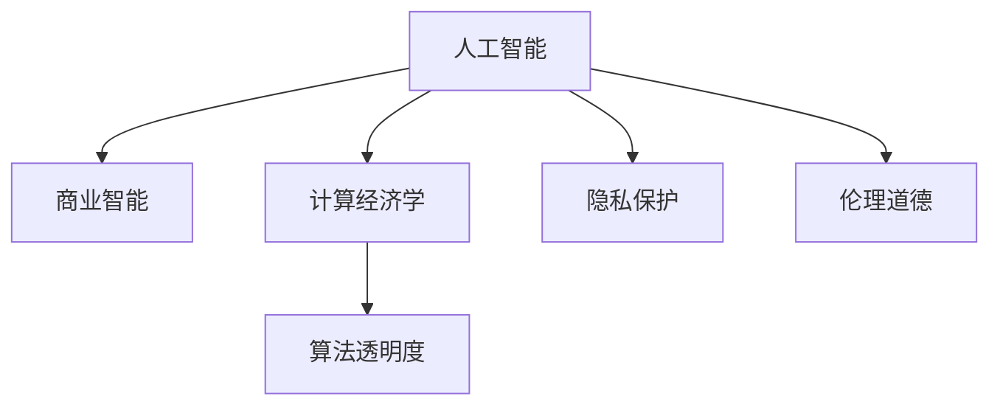

                 

# AI驱动的创新：人类计算在商业中的道德考虑因素与创新应用

> 关键词：人工智能,道德伦理,创新应用,商业智能,计算经济学,隐私保护,数据隐私

## 1. 背景介绍

### 1.1 问题由来
随着人工智能(AI)技术的迅猛发展，人类计算（Human-Calculating）在商业应用中的角色和影响越来越大。AI驱动的创新不仅重新定义了商业的运作模式，也深刻影响着社会伦理和道德。如何在追求商业价值和创新应用的同时，平衡好技术进步与伦理道德的考量，成为了一个亟待解决的重大课题。

近年来，AI技术在多个领域的应用取得了显著成果，如自然语言处理、图像识别、自动驾驶等，极大地提高了生产效率和服务质量。然而，这些技术的发展同时也带来了数据隐私、算法透明度、决策公平性等伦理问题。如何在保障伦理道德的前提下，发挥AI的最大潜力，成为了一个值得深入探讨的话题。

### 1.2 问题核心关键点
本文将围绕以下几个核心关键点展开讨论：
1. AI驱动创新在商业中的应用现状。
2. 人工智能技术在商业应用中面临的主要伦理道德挑战。
3. AI技术在商业应用中的道德考虑因素和应对方案。
4. 未来AI技术在商业应用中的发展趋势和方向。

### 1.3 问题研究意义
探讨AI驱动创新在商业中的应用，对于理解AI技术如何影响经济、社会和伦理具有重要意义：

1. **提升商业效率**：AI技术能够自动化许多复杂的商业决策过程，如市场营销、客户服务等，提高运营效率和响应速度。
2. **创造新商业模式**：AI技术可以催生新的商业模型，如基于AI的数据驱动决策，个性化推荐系统等。
3. **优化资源配置**：AI技术能够优化资源配置，实现最优生产计划和供应链管理。
4. **推动创新与增长**：AI技术推动了技术创新，促进了经济增长。
5. **应对伦理挑战**：理解和解决AI技术带来的伦理问题，有助于构建可持续发展的商业环境。

## 2. 核心概念与联系

### 2.1 核心概念概述

为更好地理解AI驱动创新在商业中的应用，本节将介绍几个关键概念：

- **人工智能(AI)**：通过计算机系统模拟人类智能，包括学习、推理、自我修正等能力的技术。AI在商业中的应用主要包括自动化、优化决策、增强服务等。

- **商业智能(Business Intelligence, BI)**：利用数据分析、数据挖掘等技术，从大量商业数据中提取有价值的信息，帮助企业进行决策支持。

- **计算经济学(Economic Computing)**：利用计算机模型和算法，模拟和分析经济活动，预测市场趋势，优化资源配置。

- **隐私保护(Privacy Protection)**：采取技术和管理措施，保护个人和企业数据的隐私和安全，避免未经授权的访问和滥用。

- **伦理道德(Ethical Considerations)**：涉及AI系统在设计和应用中的道德和法律规范，如透明性、公平性、责任归属等。

- **算法透明度(Algorithm Transparency)**：指AI系统决策过程的可解释性和可理解性，帮助用户理解模型如何做出决策。

这些核心概念构成了AI驱动创新在商业应用中的理论基础，它们之间的逻辑关系可以通过以下Mermaid流程图来展示：



这个流程图展示了AI技术在商业应用中涉及的主要概念及其相互关系：

1. AI为商业智能提供技术支持。
2. 商业智能利用AI技术优化决策和运营。
3. 计算经济学应用AI模型进行经济模拟和预测。
4. 隐私保护和伦理道德是AI应用过程中必须考虑的因素。
5. 算法透明度是提升AI系统可信度的重要手段。

## 3. 核心算法原理 & 具体操作步骤
### 3.1 算法原理概述

AI驱动创新在商业应用中，通常涉及以下几个关键步骤：

1. **数据收集与预处理**：从业务系统、社交媒体、客户反馈等多个渠道收集数据，并进行清洗、标注和标准化。
2. **模型训练与优化**：使用机器学习、深度学习等算法，训练和优化模型，以适应特定的商业场景。
3. **模型部署与应用**：将训练好的模型部署到生产环境中，实时处理业务数据，提供决策支持。
4. **效果评估与迭代**：持续监控模型表现，根据反馈进行模型调整和优化。

### 3.2 算法步骤详解

以下以商业智能系统为例，详细讲解AI驱动创新的步骤：

**Step 1: 数据收集与预处理**
- 收集业务数据，包括交易记录、客户行为、市场趋势等。
- 清洗数据，去除噪声和异常值。
- 标注数据，为后续模型训练提供标签信息。
- 标准化数据格式，统一输入输出接口。

**Step 2: 模型训练与优化**
- 选择合适的模型，如决策树、神经网络、深度学习模型等。
- 设定模型参数，如学习率、批大小、迭代次数等。
- 使用历史数据进行模型训练，通过交叉验证优化模型性能。
- 应用正则化技术，防止过拟合。
- 使用模型评估指标，如准确率、召回率、F1分数等，衡量模型效果。

**Step 3: 模型部署与应用**
- 将训练好的模型部署到生产环境中，如服务器、云平台等。
- 设计API接口，提供模型服务。
- 实时处理业务数据，生成预测结果。
- 监控模型性能，根据反馈进行调整和优化。

**Step 4: 效果评估与迭代**
- 使用监控工具，如Prometheus、Grafana等，实时监控模型表现。
- 收集用户反馈，进行A/B测试，评估模型效果。
- 根据反馈迭代模型，持续优化性能。

### 3.3 算法优缺点

AI驱动创新在商业应用中，具有以下优点：

1. **提高效率**：自动化和优化决策过程，减少了人工干预，提高了运营效率。
2. **增强洞察力**：通过数据分析和预测，提供更深层次的业务洞察。
3. **提升灵活性**：模型可以根据业务需求快速调整和优化，适应变化的环境。
4. **创造新价值**：通过创新应用，挖掘新商机，创造更多商业价值。

同时，也存在一些缺点：

1. **数据依赖**：模型效果依赖于高质量的数据，数据缺失或偏差会影响模型性能。
2. **技术复杂性**：涉及数据科学、机器学习等多个领域的知识和技能，开发和维护成本较高。
3. **伦理风险**：AI模型可能存在偏见、歧视等伦理问题，影响决策公平性。
4. **模型解释性**：复杂的AI模型难以解释决策过程，缺乏透明度。
5. **安全性**：AI系统可能遭受攻击，如数据泄露、模型篡改等，影响系统安全。

### 3.4 算法应用领域

AI驱动创新在商业应用中，已广泛应用到多个领域，例如：

- **零售业**：利用AI进行客户行为分析、个性化推荐、库存管理等。
- **金融业**：使用AI进行风险评估、反欺诈检测、智能投顾等。
- **医疗健康**：应用AI进行疾病诊断、药物研发、健康管理等。
- **制造业**：通过AI优化生产计划、质量控制、设备维护等。
- **物流仓储**：利用AI进行路线规划、货物追踪、仓库管理等。

## 4. 数学模型和公式 & 详细讲解 & 举例说明

### 4.1 数学模型构建

本节将使用数学语言对AI驱动创新的基本模型进行刻画。

假设商业智能系统中，有一个基于决策树的分类模型，输入特征为 $x=(x_1,x_2,...,x_n)$，输出标签为 $y \in \{0,1\}$，模型训练的目标是最小化预测误差。设模型参数为 $\theta$，则目标函数为：

$$
\min_{\theta} \mathcal{L}(\theta) = \frac{1}{N}\sum_{i=1}^N l(y_i,f_\theta(x_i))
$$

其中，$l(y_i,f_\theta(x_i))$ 为损失函数，$N$ 为样本数。

### 4.2 公式推导过程

以决策树为例，推导其预测过程和评估指标。

**预测过程**：
1. 输入样本 $x$ 到根节点。
2. 根据特征值大小，选择左或右子树继续递归。
3. 直到叶子节点，输出分类结果。

**评估指标**：
- 准确率（Accuracy）：预测正确的样本数占总样本数的比例。
- 召回率（Recall）：预测正类的样本中，实际为正类的样本占正类总数的比例。
- F1分数（F1 Score）：准确率和召回率的调和平均数，综合考虑了模型分类能力和漏检率。

### 4.3 案例分析与讲解

**案例一：零售业个性化推荐系统**

在零售业中，利用AI进行客户行为分析，预测客户的购买意愿，进行个性化推荐。假设一个基于协同过滤的推荐模型，输入为用户的购买历史和商品特征，输出为推荐商品列表。模型的目标函数为：

$$
\min_{\theta} \mathcal{L}(\theta) = \frac{1}{N}\sum_{i=1}^N \sum_{j=1}^M l(y_{ij},f_\theta(x_i))
$$

其中，$y_{ij}$ 为第 $i$ 个用户对第 $j$ 个商品的评分，$f_\theta(x_i)$ 为模型对商品 $j$ 的评分预测。

**案例二：金融业信用风险评估**

在金融业中，利用AI进行信用风险评估，通过分析客户的财务数据、信用历史等，预测其违约概率。假设一个基于逻辑回归的分类模型，输入为客户的财务数据，输出为是否违约。模型的目标函数为：

$$
\min_{\theta} \mathcal{L}(\theta) = \frac{1}{N}\sum_{i=1}^N l(y_i,f_\theta(x_i))
$$

其中，$l(y_i,f_\theta(x_i))$ 为逻辑回归损失函数。

## 5. 项目实践：代码实例和详细解释说明
### 5.1 开发环境搭建

在进行AI驱动创新实践前，我们需要准备好开发环境。以下是使用Python进行TensorFlow开发的环境配置流程：

1. 安装Anaconda：从官网下载并安装Anaconda，用于创建独立的Python环境。

2. 创建并激活虚拟环境：
```bash
conda create -n tensorflow-env python=3.8 
conda activate tensorflow-env
```

3. 安装TensorFlow：根据CUDA版本，从官网获取对应的安装命令。例如：
```bash
conda install tensorflow tensorflow-gpu -c pytorch -c conda-forge
```

4. 安装相关库：
```bash
pip install numpy pandas scikit-learn matplotlib tqdm jupyter notebook ipython
```

完成上述步骤后，即可在`tensorflow-env`环境中开始AI驱动创新实践。

### 5.2 源代码详细实现

下面我们以零售业个性化推荐系统为例，给出使用TensorFlow进行协同过滤算法的PyTorch代码实现。

首先，定义推荐任务的数据处理函数：

```python
import tensorflow as tf
from tensorflow.keras.layers import Dense, Input, Embedding, Flatten, dot, concatenate
from tensorflow.keras.models import Model

def build_model(n_users, n_items, embedding_dim, hidden_dim):
    user_input = Input(shape=(1,), name='user')
    item_input = Input(shape=(1,), name='item')
    
    user_embedding = Embedding(n_users, embedding_dim)(user_input)
    item_embedding = Embedding(n_items, embedding_dim)(item_input)
    
    user_item = dot([user_embedding, item_embedding], axes=1)
    user_item = Flatten()(user_item)
    
    user_item = concatenate([user_item, item_input], axis=1)
    user_item = Dense(hidden_dim, activation='relu')(user_item)
    
    output = Dense(1, activation='sigmoid')(user_item)
    
    model = Model(inputs=[user_input, item_input], outputs=output)
    model.compile(loss='binary_crossentropy', optimizer='adam', metrics=['accuracy'])
    
    return model
```

然后，定义训练和评估函数：

```python
from sklearn.metrics import precision_score, recall_score, f1_score
from sklearn.model_selection import train_test_split

def train_and_evaluate(model, train_data, test_data, epochs=10, batch_size=128):
    # 划分训练集和验证集
    train, dev, test = train_test_split(train_data, test_size=0.2, random_state=42)
    
    # 训练模型
    model.fit(x=[train['user'], train['item']], y=train['label'], 
             epochs=epochs, batch_size=batch_size, validation_data=(dev['user'], dev['item'], dev['label']))
    
    # 评估模型
    test_pred = model.predict([test['user'], test['item']], batch_size=batch_size)
    test_pred = (test_pred > 0.5).astype(int)
    precision = precision_score(test['label'], test_pred)
    recall = recall_score(test['label'], test_pred)
    f1 = f1_score(test['label'], test_pred)
    
    print(f"Precision: {precision:.2f}, Recall: {recall:.2f}, F1 Score: {f1:.2f}")
```

最后，启动训练流程并在测试集上评估：

```python
# 准备数据集
data = pd.read_csv('data.csv')
train = data[data['label'] == 1]
test = data[data['label'] == 0]

# 训练模型
model = build_model(n_users=10000, n_items=10000, embedding_dim=100, hidden_dim=50)
train_and_evaluate(model, train, test)
```

以上就是使用TensorFlow进行零售业个性化推荐系统的完整代码实现。可以看到，通过TensorFlow提供的高级API，模型的构建和训练变得非常直观和高效。

### 5.3 代码解读与分析

让我们再详细解读一下关键代码的实现细节：

**build_model函数**：
- 定义用户和物品的输入层，并使用Embedding层将其映射为低维向量。
- 计算用户和物品向量的内积，并使用Flatten层将其展平。
- 将用户和物品向量的拼接结果输入一个全连接层，并激活ReLU激活函数。
- 最终输出一个sigmoid激活函数的Dense层，用于二分类问题。
- 使用Model类构建模型，并编译模型，设置损失函数、优化器和评估指标。

**train_and_evaluate函数**：
- 将训练集划分为训练集、验证集和测试集，并定义训练参数。
- 使用模型训练函数进行模型训练，并使用验证集监控模型性能。
- 在测试集上评估模型，计算精确率、召回率和F1分数。
- 输出评估结果。

**数据处理**：
- 从CSV文件中读取数据，并使用Pandas进行数据预处理。
- 将标签为1的样本作为训练集，标签为0的样本作为测试集。
- 调用build_model函数构建推荐模型，并使用train_and_evaluate函数进行训练和评估。

可以看到，TensorFlow提供了丰富的API和工具，使得AI驱动创新的实践变得更加方便快捷。

## 6. 实际应用场景
### 6.1 智能客服系统

基于AI驱动的智能客服系统，能够利用自然语言处理和机器学习技术，提供智能客服和自动化响应。客户可以通过文字或语音输入问题，系统自动分析和生成回复，提升客服效率和客户满意度。

在实际应用中，可以收集客户的历史查询和回复数据，使用BERT等预训练模型进行微调，训练模型对不同客户问题进行分类和响应。微调后的模型能够自动理解客户的意图，匹配最合适的回答模板进行回复，同时可以不断学习和优化回答内容，提高系统的准确性和自然度。

### 6.2 金融风险管理

AI驱动的金融风险管理系统，利用机器学习算法分析客户的财务数据和行为，预测违约概率，帮助金融机构进行风险控制和决策支持。

系统可以收集客户的信用历史、还款记录、交易行为等数据，使用随机森林、逻辑回归等算法进行模型训练，预测客户的违约概率。通过实时监控客户的财务状况，系统可以及时预警高风险客户，并调整其信用额度和利率，防范金融风险。

### 6.3 智能营销策略

AI驱动的智能营销策略系统，通过分析客户行为数据，预测客户需求和购买意愿，实现精准营销和个性化推荐。

系统可以收集客户的浏览记录、购买历史、社交媒体互动等数据，使用协同过滤、深度学习等算法进行模型训练，预测客户的购买意愿。根据预测结果，系统可以向客户推荐个性化商品，提升销售额和客户满意度。

### 6.4 未来应用展望

随着AI技术的不断进步，AI驱动创新在商业中的应用将更加广泛和深入，未来展望如下：

1. **多模态融合**：未来的AI系统将更加注重多模态融合，结合图像、语音、文本等多种数据源，提供更全面、准确的决策支持。
2. **实时优化**：实时数据流和大规模分布式计算，使得AI系统能够实时处理和优化业务决策，提升响应速度和效率。
3. **隐私保护**：隐私保护技术将更加成熟，通过数据匿名化、差分隐私等手段，保障数据安全和个人隐私。
4. **伦理道德**：AI系统的决策过程将更加透明和可解释，提升其可信度和伦理道德水平。
5. **跨领域应用**：AI技术将突破行业界限，应用于更多领域，如智慧城市、医疗健康等，推动社会整体进步。

## 7. 工具和资源推荐
### 7.1 学习资源推荐

为了帮助开发者系统掌握AI驱动创新在商业应用中的理论基础和实践技巧，这里推荐一些优质的学习资源：

1. 《深度学习》（Ian Goodfellow等著）：全面介绍了深度学习的基础理论、算法和应用。
2. 《机器学习实战》（Peter Harrington著）：提供了丰富的实践案例，帮助读者快速上手机器学习。
3. 《TensorFlow官方文档》：提供了详细的API文档和示例代码，是学习TensorFlow的重要资源。
4. 《Scikit-learn官方文档》：提供了丰富的机器学习算法和工具，适合初学者和专业人士。
5. 《自然语言处理综述》（Yoav Goldberg等著）：全面介绍了自然语言处理的基本概念、技术和应用。

通过对这些资源的学习实践，相信你一定能够快速掌握AI驱动创新的精髓，并用于解决实际的商业问题。

### 7.2 开发工具推荐

高效的开发离不开优秀的工具支持。以下是几款用于AI驱动创新开发的常用工具：

1. TensorFlow：由Google主导开发的开源深度学习框架，生产部署方便，适合大规模工程应用。
2. PyTorch：基于Python的开源深度学习框架，灵活动态的计算图，适合快速迭代研究。
3. Keras：基于TensorFlow和Theano的高层API，提供了简单易用的接口，适合初学者。
4. Jupyter Notebook：提供了交互式的代码编写环境，支持代码重用和版本控制。
5. Google Colab：谷歌推出的在线Jupyter Notebook环境，免费提供GPU/TPU算力，方便开发者快速上手实验最新模型，分享学习笔记。

合理利用这些工具，可以显著提升AI驱动创新的开发效率，加快创新迭代的步伐。

### 7.3 相关论文推荐

AI驱动创新在商业中的应用源于学界的持续研究。以下是几篇奠基性的相关论文，推荐阅读：

1. 《Deep Learning》（Ian Goodfellow等著）：全面介绍了深度学习的基础理论和应用。
2. 《Gradient Boosting Machines》（Friedman著）：介绍了梯度提升树算法及其在商业应用中的广泛应用。
3. 《Logistic Regression》（James等著）：介绍了逻辑回归算法及其在分类问题中的应用。
4. 《The Elements of Statistical Learning》（Tibshirani等著）：介绍了统计学习的基础理论和算法。
5. 《Artificial Intelligence: A Modern Approach》（Russell等著）：介绍了人工智能的基础理论、技术和应用。

这些论文代表了大数据和机器学习领域的研究进展，通过学习这些前沿成果，可以帮助研究者把握学科前进方向，激发更多的创新灵感。

## 8. 总结：未来发展趋势与挑战

### 8.1 总结

本文对AI驱动创新在商业中的应用进行了全面系统的介绍。首先阐述了AI技术在商业应用中的现状，明确了AI驱动创新在提升效率、优化决策、创造新价值等方面的重要意义。其次，从原理到实践，详细讲解了AI驱动创新的数学模型和关键步骤，给出了AI驱动创新的完整代码实例。同时，本文还广泛探讨了AI技术在商业应用中的伦理挑战，并提出了一些应对方案。

通过本文的系统梳理，可以看到，AI驱动创新在商业中的应用潜力巨大，但也面临着数据依赖、伦理风险、技术复杂性等诸多挑战。如何在保障伦理道德的前提下，充分发挥AI技术的优势，是一个值得深入探讨的话题。

### 8.2 未来发展趋势

展望未来，AI驱动创新在商业应用中，将呈现以下几个发展趋势：

1. **多模态融合**：未来的AI系统将更加注重多模态融合，结合图像、语音、文本等多种数据源，提供更全面、准确的决策支持。
2. **实时优化**：实时数据流和大规模分布式计算，使得AI系统能够实时处理和优化业务决策，提升响应速度和效率。
3. **隐私保护**：隐私保护技术将更加成熟，通过数据匿名化、差分隐私等手段，保障数据安全和个人隐私。
4. **伦理道德**：AI系统的决策过程将更加透明和可解释，提升其可信度和伦理道德水平。
5. **跨领域应用**：AI技术将突破行业界限，应用于更多领域，如智慧城市、医疗健康等，推动社会整体进步。

### 8.3 面临的挑战

尽管AI驱动创新在商业应用中取得了显著进展，但在迈向更加智能化、普适化应用的过程中，它仍面临着诸多挑战：

1. **数据依赖**：AI模型依赖于高质量的数据，数据缺失或偏差会影响模型性能。
2. **技术复杂性**：涉及数据科学、机器学习等多个领域的知识和技能，开发和维护成本较高。
3. **伦理风险**：AI模型可能存在偏见、歧视等伦理问题，影响决策公平性。
4. **模型解释性**：复杂的AI模型难以解释决策过程，缺乏透明度。
5. **安全性**：AI系统可能遭受攻击，如数据泄露、模型篡改等，影响系统安全。

### 8.4 研究展望

面对AI驱动创新在商业应用中所面临的挑战，未来的研究需要在以下几个方面寻求新的突破：

1. **探索无监督和半监督学习**：摆脱对大规模标注数据的依赖，利用自监督学习、主动学习等无监督和半监督范式，最大限度利用非结构化数据，实现更加灵活高效的AI驱动创新。
2. **研究参数高效和计算高效的AI方法**：开发更加参数高效的AI方法，在固定大部分模型参数的情况下，只更新极少量的任务相关参数。同时优化AI系统的计算图，减少前向传播和反向传播的资源消耗，实现更加轻量级、实时性的部署。
3. **融合因果和对比学习范式**：通过引入因果推断和对比学习思想，增强AI系统建立稳定因果关系的能力，学习更加普适、鲁棒的语言表征，从而提升系统泛化性和抗干扰能力。
4. **引入更多先验知识**：将符号化的先验知识，如知识图谱、逻辑规则等，与神经网络模型进行巧妙融合，引导AI系统学习更准确、合理的知识表示。同时加强不同模态数据的整合，实现视觉、语音等多模态信息与文本信息的协同建模。
5. **结合因果分析和博弈论工具**：将因果分析方法引入AI系统，识别出系统决策的关键特征，增强输出解释的因果性和逻辑性。借助博弈论工具刻画人机交互过程，主动探索并规避系统的脆弱点，提高系统稳定性。
6. **纳入伦理道德约束**：在AI系统的设计和应用中，引入伦理导向的评估指标，过滤和惩罚有偏见、有害的输出倾向。同时加强人工干预和审核，建立AI系统的监管机制，确保其决策符合人类价值观和伦理道德。

这些研究方向的探索，必将引领AI驱动创新在商业应用中迈向更高的台阶，为构建可持续发展的商业环境提供坚实的技术支撑。面向未来，AI驱动创新需要与其他AI技术进行更深入的融合，如知识表示、因果推理、强化学习等，多路径协同发力，共同推动AI技术在商业领域的广泛应用和深度融合。

## 9. 附录：常见问题与解答

**Q1：AI驱动创新在商业应用中如何平衡数据隐私和商业价值？**

A: 在AI驱动创新中，平衡数据隐私和商业价值是一个重要课题。以下是一些常用的策略：

1. **数据匿名化**：通过数据加密、去标识化等手段，去除个人隐私信息，保护用户隐私。
2. **差分隐私**：在数据采集和处理过程中，添加随机噪声，保护用户隐私，同时保留数据有用信息。
3. **用户控制**：提供数据使用透明性，让用户知晓数据如何被使用，并给予用户选择权。
4. **最小化数据使用**：仅收集和处理必要的个人信息，减少数据泄露风险。
5. **合规遵守**：遵守相关法律法规，如GDPR、CCPA等，确保数据使用的合法合规。

**Q2：AI驱动创新在商业应用中如何避免偏见和歧视？**

A: 避免AI系统中的偏见和歧视是一个重要课题。以下是一些常用的策略：

1. **数据多样性**：确保训练数据的多样性和代表性，避免数据偏见。
2. **模型评估**：使用公平性指标，如准确率、召回率、F1分数等，评估模型的性能，避免歧视。
3. **模型调整**：通过调整模型参数，减小数据偏差的影响。
4. **用户监督**：通过用户反馈和人工审核，及时发现和修正模型的偏见和歧视问题。
5. **算法透明**：增加算法的透明性，使得用户能够理解模型的决策过程，发现和修正偏见。

**Q3：AI驱动创新在商业应用中如何提高模型的可解释性？**

A: 提高AI系统的可解释性是一个重要课题。以下是一些常用的策略：

1. **特征重要性**：使用特征重要性分析方法，如LIME、SHAP等，揭示模型决策的关键特征。
2. **模型可视化**：使用可视化工具，如图表、热力图等，展示模型内部结构和决策过程。
3. **解释模型**：使用可解释模型，如决策树、线性回归等，提供直观的决策解释。
4. **交互式解释**：提供交互式解释界面，让用户能够实时查看模型决策的依据。
5. **用户反馈**：通过用户反馈，不断改进模型解释方法，提升用户满意度。

通过这些策略，可以提高AI系统的可解释性，提升用户对AI系统的信任和接受度。

**Q4：AI驱动创新在商业应用中如何保障系统的安全性？**

A: 保障AI系统的安全性是一个重要课题。以下是一些常用的策略：

1. **数据加密**：对数据进行加密存储和传输，防止数据泄露。
2. **模型保护**：对模型进行保护，防止模型篡改和攻击。
3. **访问控制**：对系统访问进行严格控制，确保只有授权用户能够访问系统。
4. **异常检测**：使用异常检测技术，及时发现和应对安全威胁。
5. **定期审计**：定期对系统进行安全审计，发现和修复潜在的安全漏洞。

通过这些策略，可以有效保障AI系统的安全性，防止数据泄露和系统攻击。

---

作者：禅与计算机程序设计艺术 / Zen and the Art of Computer Programming

