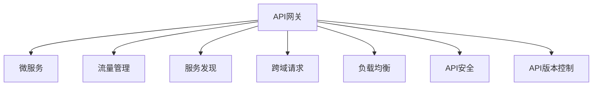
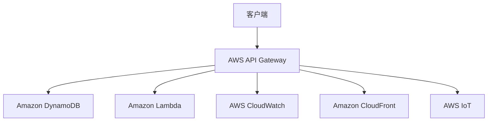

                 

# API网关设计：微服务架构的流量入口

> 关键词：API网关,微服务,流量管理,服务发现,跨域请求,负载均衡,API安全,API版本控制

## 1. 背景介绍

在现代软件架构中，微服务（Microservices）架构以其灵活性、可扩展性及高可靠性等优势，成为企业架构演进的重要趋势。随着微服务架构的普及，API网关作为微服务架构中不可或缺的组件，其作用愈发关键。API网关不仅承担了服务的聚合与路由功能，还需处理跨域请求、负载均衡、API安全、API版本控制等复杂任务，是微服务架构的流量入口。本文将从核心概念入手，深入探讨API网关的设计原理及操作步骤，通过具体案例分析，揭示API网关在微服务架构中的实际应用及未来趋势。

## 2. 核心概念与联系

### 2.1 核心概念概述

**API网关**：作为微服务架构中的中心组件，API网关负责接收所有客户端请求，并将其路由至对应的后端服务。除了路由，API网关还可以进行身份验证、负载均衡、缓存、限流等操作，是实现微服务通信、管理及安全的重要入口。

**微服务**：一种将应用程序分解为多个小型独立服务的架构风格，每个服务可以独立部署、运行和扩展。微服务架构通过组合服务实现复杂应用场景，能够更好地满足快速变化的市场需求。

**流量管理**：通过API网关实现的服务请求的负载均衡、限流、缓存等策略，确保服务稳定、高效、可靠。

**服务发现**：通过API网关实现服务的自动发现与注册，使得微服务能够快速响应请求。

**跨域请求**：在微服务架构中，不同服务之间的通信常需通过API网关进行，解决不同服务之间域名、协议的差异，使服务调用变得无缝。

**负载均衡**：将客户端请求均匀分配到多个服务实例上，避免单点瓶颈，提升系统可用性和扩展性。

**API安全**：通过API网关实现身份验证、授权、数据加密等操作，保护API不受未经授权的访问，确保数据安全。

**API版本控制**：通过API网关实现不同版本的API管理，避免API服务的客户端与后端之间的兼容性问题。

这些核心概念之间的关系可以用以下Mermaid流程图表示：



此图展示了API网关与微服务之间的联系及功能：

1. **服务聚合与路由**：将客户端请求路由至具体服务实例，是微服务通信的核心。
2. **流量管理**：确保服务稳定，避免单点故障。
3. **服务发现**：使微服务快速响应请求。
4. **跨域请求**：解决不同服务之间的域名、协议差异。
5. **负载均衡**：提升系统可用性和扩展性。
6. **API安全**：保障API不受未经授权的访问。
7. **API版本控制**：管理不同版本的API。

### 2.2 核心概念原理和架构的 Mermaid 流程图

以下是一个简单的API网关的微架构图，展示了API网关各个组件的通信和功能实现：



此图展示了API网关的具体架构：

1. **客户端**：发送HTTP请求至AWS API Gateway。
2. **API Gateway**：接收并处理请求，通过Amazon DynamoDB获取服务列表。
3. **Amazon DynamoDB**：存储服务注册信息。
4. **Amazon Lambda**：根据服务路由处理请求，并将其转发至目标服务。
5. **Amazon CloudWatch**：监控API请求和响应，确保API的稳定运行。
6. **Amazon CloudFront**：实现动态内容分发，提升访问速度。
7. **Amazon IoT**：用于API的认证和授权。

## 3. 核心算法原理 & 具体操作步骤

### 3.1 算法原理概述

API网关的核心算法原理基于RESTful架构风格及微服务架构的设计原则。其主要职责包括：

1. **路由与负载均衡**：将客户端请求路由至对应服务实例，并实现请求的负载均衡。
2. **跨域请求处理**：解决不同服务之间的域名、协议差异。
3. **API版本管理**：管理不同版本的API，确保客户端与后端兼容。
4. **API安全**：通过身份验证、授权、数据加密等操作，保障API不受未经授权的访问。

### 3.2 算法步骤详解

以下是API网关设计的主要步骤：

**Step 1: 需求分析**

- 确定API网关的服务数量和功能需求。
- 明确API网关需要处理的服务类型和请求类型。
- 评估API网关的性能指标和安全性需求。

**Step 2: 架构设计**

- 设计API网关的拓扑结构，包括各个组件的部署方式和通信关系。
- 设计API网关的数据存储架构，包括服务的注册、路由、缓存等。
- 设计API网关的监控、告警机制，确保API的稳定运行。

**Step 3: 功能实现**

- 实现API网关的路由算法，根据请求信息选择并路由至目标服务。
- 实现API网关的负载均衡策略，将请求均匀分配到各个服务实例。
- 实现API网关的跨域请求处理，解决不同服务之间的域名、协议差异。
- 实现API网关的API安全功能，通过身份验证、授权、数据加密等操作保障API安全。
- 实现API网关的API版本控制，管理不同版本的API并处理兼容性问题。

**Step 4: 性能优化**

- 优化API网关的路由算法，提升路由效率。
- 优化API网关的负载均衡策略，确保服务稳定。
- 优化API网关的跨域请求处理，减少跨域请求的开销。
- 优化API网关的API安全机制，减少身份验证和授权的开销。
- 优化API网关的API版本控制，减少兼容性和版本管理的复杂性。

**Step 5: 测试部署**

- 对API网关进行功能测试，确保其各项功能正常工作。
- 对API网关进行性能测试，确保其在高负载情况下能够稳定运行。
- 部署API网关到生产环境，并进行监控和调优。

### 3.3 算法优缺点

**优点：**

- 集中管理API请求，简化服务调用逻辑。
- 提供统一的服务入口，方便服务治理。
- 实现负载均衡、限流、缓存等流量管理策略。
- 提供API安全、身份验证、授权等安全功能。
- 实现API版本控制，避免兼容性问题。

**缺点：**

- 增加了API网关处理的复杂度，导致额外的开销。
- 需要维护大量的路由规则和配置信息。
- 对API网关的处理能力要求较高，否则可能成为系统瓶颈。

### 3.4 算法应用领域

API网关在微服务架构中的应用领域广泛，包括但不限于以下方面：

- **金融服务**：金融服务需要处理大量的交易请求，API网关可以实现请求的路由、负载均衡、跨域请求处理、API安全等操作。
- **电商平台**：电商平台需要处理复杂的交易流程和物流信息，API网关可以实现请求的路由、负载均衡、API版本控制等操作。
- **在线教育**：在线教育平台需要处理大量的课程和学员数据，API网关可以实现请求的路由、API版本控制、API安全等操作。
- **医疗健康**：医疗健康领域需要处理大量的患者信息和诊疗记录，API网关可以实现请求的路由、负载均衡、跨域请求处理等操作。

## 4. 数学模型和公式 & 详细讲解

### 4.1 数学模型构建

API网关的数学模型主要基于以下几个假设：

1. **假定**：API请求服从泊松分布，即每个服务实例在单位时间内接收的请求数量服从泊松分布。
2. **假定**：请求到达时间和服务响应时间独立。
3. **假定**：服务实例的响应时间服从负指数分布。

基于以上假设，API网关的数学模型可以构建为：

**Step 1: 泊松分布模型**

设每个服务实例在单位时间内接收的请求数量服从泊松分布，其参数为 $\lambda$，则每个时间间隔 $t$ 内接收的请求数量 $N(t)$ 的概率分布为：

$$
P(N(t)=k) = \frac{e^{-\lambda t}\lambda^k t^k}{k!}
$$

**Step 2: 负指数分布模型**

设服务实例的响应时间服从负指数分布，其参数为 $\mu$，则服务实例的响应时间 $T$ 的概率密度函数为：

$$
f(T) = \lambda e^{-\lambda T}
$$

### 4.2 公式推导过程

**泊松分布模型的求解**

设API网关的请求速率 $\lambda = 1000$，则每个时间间隔 $t=1s$ 内接收的请求数量 $N(1)$ 的概率分布为：

$$
P(N(1)=k) = \frac{e^{-1000 \cdot 1}1000^k 1^{k}}{k!}
$$

将 $k=0$ 代入上式，可以得到 $P(N(1)=0)=e^{-1000}$，表示在每个时间间隔内请求为零的概率，通常将其视为不可靠服务。

**负指数分布模型的求解**

设API网关的服务响应时间服从负指数分布，其参数为 $\mu=5s$，则服务实例的响应时间 $T$ 的概率密度函数为：

$$
f(T) = \lambda e^{-\lambda T}
$$

将 $\mu=5s$ 代入上式，可以得到 $f(T) = 1000 \cdot e^{-1000 \cdot T}$。

### 4.3 案例分析与讲解

**案例1: 银行交易系统的API网关设计**

在银行交易系统中，每个交易请求都需要严格校验和授权。API网关需要设计以下功能：

1. **路由**：根据交易类型选择目标服务。
2. **负载均衡**：将请求均匀分配到各个服务实例。
3. **API安全**：通过身份验证和授权，保障API安全。
4. **API版本控制**：管理不同版本的API并处理兼容性问题。

通过设计合适的路由算法、负载均衡策略、身份验证和授权机制，确保API网关的高可用性和安全性。

**案例2: 电商平台订单系统的API网关设计**

在电商平台订单系统中，API网关需要处理复杂的订单生成和物流信息处理。API网关需要设计以下功能：

1. **路由**：根据订单状态选择目标服务。
2. **负载均衡**：将请求均匀分配到各个服务实例。
3. **API版本控制**：管理不同版本的API并处理兼容性问题。
4. **跨域请求处理**：解决不同服务之间的域名、协议差异。

通过设计合适的路由算法、负载均衡策略、API版本控制和跨域请求处理机制，确保API网关的高效性和灵活性。

## 5. 项目实践：代码实例和详细解释说明

### 5.1 开发环境搭建

开发API网关需要以下工具和环境：

- **Python**：用于编写API网关的逻辑。
- **Flask**：用于搭建API网关的服务。
- **PostgreSQL**：用于存储服务的注册信息。
- **Redis**：用于缓存服务路由信息。
- **Gunicorn**：用于进程管理。
- **Nginx**：用于负载均衡和反向代理。

**安装步骤**：

```bash
# 安装Python
sudo apt-get install python3 python3-pip

# 安装Flask
pip install Flask

# 安装PostgreSQL
sudo apt-get install postgresql postgresql-client

# 安装Redis
sudo apt-get install redis-server

# 安装Gunicorn
pip install gunicorn

# 安装Nginx
sudo apt-get install nginx

# 启动PostgreSQL和Redis服务
sudo systemctl start postgresql postgresql
sudo systemctl start redis-server
```

### 5.2 源代码详细实现

**代码实现1: API网关路由实现**

```python
from flask import Flask, request

app = Flask(__name__)

@app.route('/api/<service_name>', methods=['GET'])
def service(service_name):
    if service_name in services:
        return services[service_name].get(service_name)
    else:
        return {'error': 'Service not found'}, 404

if __name__ == '__main__':
    app.run(debug=True)
```

**代码实现2: 服务注册实现**

```python
from redis import Redis

redis = Redis(host='localhost', port=6379)

def register_service(service_name, service_addr):
    redis.set(service_name, service_addr)
```

**代码实现3: 服务调用实现**

```python
def get_service(service_name):
    return redis.get(service_name)
```

### 5.3 代码解读与分析

**代码实现1: 路由实现**

- **Flask框架**：使用Flask框架搭建API网关的服务，实现路由功能。
- **路由设计**：使用`@app.route`装饰器定义路由，将请求转发至指定服务实例。

**代码实现2: 服务注册实现**

- **Redis**：使用Redis存储服务的注册信息，实现服务的自动发现。
- **服务注册**：使用`redis.set`将服务名称和服务地址存储到Redis中。

**代码实现3: 服务调用实现**

- **Redis**：从Redis中获取服务注册信息，实现服务的自动发现和调用。

### 5.4 运行结果展示

通过以上代码实现，可以在浏览器中访问API网关，并进行服务调用。以下是运行结果示例：

**访问示例**：

```bash
curl http://localhost:5000/api/bank
```

**服务调用示例**：

```python
def service(service_name):
    service_addr = get_service(service_name)
    if service_addr:
        response = requests.get(service_addr + '/api/transaction')
        return response.json()
    else:
        return {'error': 'Service not found'}, 404
```

## 6. 实际应用场景

### 6.1 金融服务

金融服务需要处理大量的交易请求，API网关可以实现请求的路由、负载均衡、跨域请求处理、API安全等操作。例如，在银行系统中，API网关可以处理用户的交易请求，并将其转发至相应的交易处理服务。通过API网关实现跨域请求处理，使得不同服务之间的通信变得无缝。同时，API网关还可以实现请求的负载均衡，提升系统的可用性和扩展性。

### 6.2 电商平台

电商平台需要处理复杂的交易流程和物流信息，API网关可以实现请求的路由、负载均衡、API版本控制等操作。例如，在电商平台中，API网关可以处理订单生成、支付、物流查询等请求，并将其转发至相应的订单处理、支付处理和物流服务。通过API网关实现API版本控制，确保不同版本的API能够兼容，方便客户端使用。

### 6.3 在线教育

在线教育平台需要处理大量的课程和学员数据，API网关可以实现请求的路由、API版本控制等操作。例如，在线教育平台可以通过API网关处理课程查询、学员信息查询等请求，并将其转发至相应的课程服务和学员服务。通过API网关实现API版本控制，确保不同版本的API能够兼容，方便客户端使用。

### 6.4 医疗健康

医疗健康领域需要处理大量的患者信息和诊疗记录，API网关可以实现请求的路由、负载均衡等操作。例如，在医疗健康系统中，API网关可以处理患者的预约、诊疗、药品查询等请求，并将其转发至相应的预约服务、诊疗服务和药品服务。通过API网关实现负载均衡，确保系统的高可用性。

## 7. 工具和资源推荐

### 7.1 学习资源推荐

为了帮助开发者系统掌握API网关的设计和实现，以下是一些优质的学习资源：

1. **《API网关设计》一书**：介绍了API网关的架构设计、路由算法、负载均衡、API安全等核心内容。
2. **AWS API Gateway官方文档**：详细介绍了AWS API Gateway的使用方法和API网关的设计原理。
3. **Nginx官方文档**：详细介绍了Nginx的使用方法和API网关的设计原理。
4. **Kubernetes官方文档**：详细介绍了Kubernetes的使用方法和API网关的设计原理。
5. **Docker官方文档**：详细介绍了Docker的使用方法和API网关的设计原理。

通过对这些资源的学习实践，相信你一定能够快速掌握API网关的设计和实现，并用于解决实际的API网关问题。

### 7.2 开发工具推荐

API网关的开发和部署需要以下工具：

1. **Postman**：用于测试API网关的路由、负载均衡、API安全等功能。
2. **Swagger**：用于设计和文档化API网关的接口，方便开发和测试。
3. **JIRA**：用于管理和跟踪API网关的故障和修复。
4. **Prometheus**：用于监控API网关的请求和响应时间。
5. **Grafana**：用于可视化和展示API网关的监控数据。

### 7.3 相关论文推荐

以下是几篇关于API网关设计的经典论文，推荐阅读：

1. **《Principles of Building an API Gateway》**：介绍了API网关的设计原则和最佳实践。
2. **《Building and Managing Microservices with API Gateway》**：介绍了API网关的架构设计和实现方法。
3. **《Designing and Implementing Microservices》**：介绍了微服务架构的设计和实现方法，包含API网关的实现。
4. **《API Gateway: The Future of Cloud Architecture》**：介绍了API网关在云架构中的重要性和应用。

这些论文代表了大规模API网关设计的最新进展，通过对这些论文的学习和实践，可以帮助研究者把握学科前进方向，激发更多的创新灵感。

## 8. 总结：未来发展趋势与挑战

### 8.1 总结

本文从API网关的核心概念入手，深入探讨了API网关的设计原理及操作步骤。通过具体案例分析，揭示了API网关在微服务架构中的实际应用及未来趋势。API网关作为微服务架构的流量入口，其设计需要兼顾路由、负载均衡、跨域请求处理、API安全、API版本控制等复杂任务，具有重要的理论和实际意义。

### 8.2 未来发展趋势

未来API网关的发展趋势主要体现在以下几个方面：

1. **自动化设计**：随着自动机器学习、AI技术的发展，API网关的设计将更加智能化，能够自动生成路由规则和负载均衡策略。
2. **自适应负载均衡**：基于AI技术，API网关能够自适应地调整负载均衡策略，以应对流量波动和故障情况。
3. **跨域请求优化**：通过AI技术，API网关能够自动优化跨域请求处理，减少延迟和开销。
4. **API安全强化**：基于AI技术，API网关能够自动检测和防御API攻击，保障API安全。
5. **API版本动态管理**：通过AI技术，API网关能够自动管理不同版本的API，并处理兼容性问题。

### 8.3 面临的挑战

虽然API网关设计在微服务架构中发挥了重要作用，但在应用过程中也面临诸多挑战：

1. **复杂度增加**：API网关的设计和实现涉及多个组件和策略，增加了系统的复杂度。
2. **性能瓶颈**：API网关的处理能力有限，可能成为系统瓶颈。
3. **安全风险**：API网关需要进行身份验证和授权，存在安全风险。
4. **兼容性问题**：不同版本的API需要协同工作，可能存在兼容性问题。
5. **跨域请求处理**：跨域请求处理可能存在延迟和开销。

### 8.4 研究展望

面对API网关设计面临的诸多挑战，未来的研究需要在以下几个方面寻求新的突破：

1. **自动化设计**：通过自动机器学习、AI技术，实现API网关的自动化设计和优化。
2. **自适应负载均衡**：基于AI技术，实现API网关的自适应负载均衡，提升系统可用性和扩展性。
3. **跨域请求优化**：通过AI技术，优化跨域请求处理，减少延迟和开销。
4. **API安全强化**：基于AI技术，强化API网关的安全防护，保障API安全。
5. **API版本动态管理**：通过AI技术，实现API版本的动态管理，避免兼容性问题。

总之，API网关作为微服务架构的流量入口，其设计和实现需要不断优化和改进。通过自动化、智能化技术，API网关将更好地满足微服务架构的需求，为构建高效、可靠、安全的微服务系统提供重要保障。

## 9. 附录：常见问题与解答

**Q1: API网关是否必须使用Flask框架？**

A: 不是必须的。除了Flask框架，还有其他的框架如Django、FastAPI等，都可以用于API网关的设计和实现。选择合适的框架需要根据项目的具体需求和团队的技术栈来决定。

**Q2: API网关与微服务架构是什么关系？**

A: API网关是微服务架构中的核心组件，负责将所有客户端请求路由至相应的服务实例，并提供统一的入口。API网关简化了微服务之间的通信逻辑，提升了系统的可扩展性和稳定性。

**Q3: API网关的负载均衡策略有哪些？**

A: API网关的负载均衡策略包括但不限于以下几种：

1. 轮询算法（Round Robin）：将请求按照轮询的顺序分配到各个服务实例。
2. 最少连接数算法（Least Connections）：将请求分配到连接数最少的服务实例。
3. 随机算法（Random）：随机分配请求到各个服务实例。
4. IP哈希算法（IP Hash）：根据客户端IP地址进行哈希，将请求分配到对应的服务实例。

**Q4: API网关的安全性有哪些保障措施？**

A: API网关的安全性保障措施包括但不限于以下几种：

1. 身份验证：通过OAuth2、JWT等方式进行身份验证。
2. 授权：通过RBAC、ABAC等方式进行授权。
3. 数据加密：使用SSL/TLS协议对数据进行加密传输。
4. API密钥：使用API密钥进行访问控制。

**Q5: API网关与负载均衡器有什么区别？**

A: API网关与负载均衡器虽然有相似之处，但主要区别在于：

1. 功能不同：API网关不仅负责路由和负载均衡，还负责API的安全、版本控制、跨域请求处理等功能。负载均衡器仅负责请求的负载均衡。
2. 部署方式不同：API网关通常部署在入口层，对所有请求进行处理。负载均衡器通常部署在网络层，仅负责请求的负载均衡。

总之，API网关作为微服务架构的核心组件，其设计和实现需要兼顾路由、负载均衡、跨域请求处理、API安全、API版本控制等复杂任务，具有重要的理论和实际意义。未来API网关的发展将更加自动化、智能化，更好地满足微服务架构的需求。

