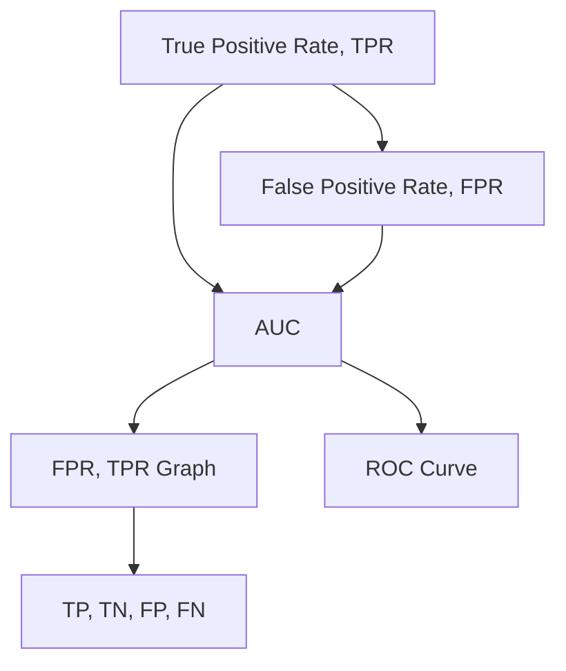
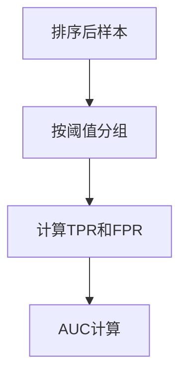
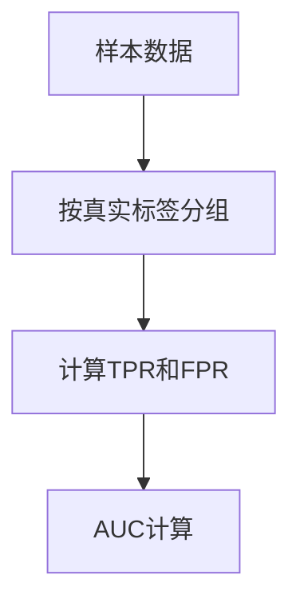

                 

## 1. 背景介绍

### 1.1 问题由来

接收到的用户反馈常常包含许多主观的评价和情感色彩，比如“非常好”，“比较一般”，“极差”等。用户评价的获取对于许多依赖于情感分析与评分系统的业务场景来说至关重要，而AUC（Area Under Curve）指标是评估这些评分系统的良好指标之一。AUC被广泛应用于推荐系统、广告点击率预测、信用评分等领域。

### 1.2 问题核心关键点

AUC指标的计算方法基于ROC曲线，ROC曲线是真阳性率（True Positive Rate，TPR）与假阳性率（False Positive Rate，FPR）之间的关系图。TPR即召回率，表示模型预测为正的样本中真实为正的比例；FPR即误报率，表示模型预测为正的样本中真实为负的比例。AUC的值越大，模型的性能越好。

以下AUC相关概念之间的逻辑关系可以通过以下Mermaid流程图来展示：



该流程图展示了TPR、FPR与AUC之间的关系：
1. TPR与FPR的曲线构成ROC曲线。
2. 计算ROC曲线下的面积，即AUC。

本文将详细介绍AUC的原理、计算方法及其在实际应用中的实现。

## 2. 核心概念与联系

### 2.1 核心概念概述

- **True Positive Rate (TPR)**：真阳性率，表示预测为正类中实际为正类的比例。
- **False Positive Rate (FPR)**：假阳性率，表示预测为正类中实际为负类的比例。
- **Area Under Curve (AUC)**：ROC曲线下的面积，表示模型在不同阈值下的分类性能。
- **Receiver Operating Characteristic (ROC) Curve**：以FPR为横轴，TPR为纵轴的曲线图，表示模型在不同阈值下的分类性能。
- **Precision-Recall Curve**：以召回率为横轴，精确率为纵轴的曲线图，用于衡量不平衡分类问题。

这些概念之间的联系是：

1. 通过ROC曲线计算AUC值，以衡量模型在不同阈值下的分类性能。
2. AUC值越高，模型分类性能越好，泛化能力越强。
3. 在处理不平衡分类问题时，Precision-Recall曲线更能反映模型性能。

## 3. 核心算法原理 & 具体操作步骤

### 3.1 算法原理概述

AUC的计算基于ROC曲线，首先需要计算出在不同阈值下的TPR和FPR，然后计算出ROC曲线，并计算曲线下的面积。AUC的计算方法有多种，本节将介绍基于排序的AUC计算方法和基于样本的AUC计算方法。

### 3.2 算法步骤详解

#### 3.2.1 基于排序的AUC计算方法

1. **数据准备**：首先，将样本根据真实标签排序，并记录每个阈值下的TP和FP。
2. **计算TPR和FPR**：计算每个阈值下的TPR和FPR。
3. **计算AUC**：利用梯形面积公式计算ROC曲线下的面积，即AUC。



#### 3.2.2 基于样本的AUC计算方法

1. **数据准备**：首先，记录每个样本的真实标签和预测概率。
2. **计算TPR和FPR**：统计正负样本的数目，计算每个阈值下的TPR和FPR。
3. **计算AUC**：利用数值积分方法计算ROC曲线下的面积，即AUC。



### 3.3 算法优缺点

#### 3.3.1 优点

- **综合性强**：AUC综合了模型的TPR和FPR，更全面地评估模型性能。
- **不依赖样本分布**：AUC不依赖于数据分布，适用于任何类型的数据。
- **独立于阈值选择**：AUC只与模型分类能力有关，与阈值选择无关。

#### 3.3.2 缺点

- **难以解释**：AUC只是一个指标，难以直接解释模型的性能表现。
- **不适用于不平衡分类**：在处理不平衡分类问题时，AUC可能存在偏差。

### 3.4 算法应用领域

AUC广泛用于许多机器学习领域的分类问题，包括：

- 推荐系统：预测用户对物品的评分。
- 金融风险评估：预测用户是否违约。
- 医疗诊断：预测患者是否患病。
- 自然语言处理：文本分类、情感分析等。
- 计算机视觉：图像分类、目标检测等。

AUC还用于处理不平衡分类问题，例如在广告点击率预测中，负样本往往远多于正样本，此时AUC能够更好地评估模型性能。

## 4. 数学模型和公式 & 详细讲解 & 举例说明

### 4.1 数学模型构建

假设我们有一组样本$(x_i,y_i)$，其中$x_i$为输入特征，$y_i$为真实标签（0或1）。模型预测为正的阈值为$\theta$，则：
- $TP_i = \sum_{j=1}^n \mathbb{I}(y_j=1 \wedge y_j > \theta)$，表示真正例的数量。
- $FP_i = \sum_{j=1}^n \mathbb{I}(y_j=0 \wedge y_j > \theta)$，表示假正例的数量。

定义$\hat{y}_i$为模型对样本$x_i$的预测概率，AUC的计算方法如下：

1. **排序**：将所有样本按预测概率$\hat{y}_i$排序，形成有序列表$(x_1,\hat{y}_1),(x_2,\hat{y}_2),\dots,(x_n,\hat{y}_n)$。
2. **计算TPR和FPR**：从大到小依次计算每个阈值$\theta$下的TPR和FPR。
3. **计算AUC**：使用梯形面积公式或数值积分方法计算AUC。

### 4.2 公式推导过程

基于排序的AUC计算方法公式推导如下：
$$
\begin{aligned}
AUC &= \frac{1}{n} \sum_{i=1}^n \sum_{j=1}^i \left(\frac{TP_i}{n} - \frac{TP_{j-1}}{n}\right) \left(\frac{FP_j}{n} - \frac{FP_{i}}{n}\right) \\
&= \frac{1}{n} \sum_{i=1}^n \sum_{j=1}^i (TP_i - TP_{j-1}) (FP_j - FP_i)
\end{aligned}
$$

其中$n$为样本总数，$TP_i$为前$i$个样本中真正例的数量，$FP_j$为前$j$个样本中假正例的数量。

### 4.3 案例分析与讲解

**案例1: 二元分类任务**

考虑一个简单的二元分类任务，有50个样本，其中30个为正类，20个为负类。假设模型预测为正的阈值为0.5，计算不同阈值下的TPR和FPR。

| 阈值 | TP | FP | TPR | FPR |
| --- | --- | --- | --- | --- |
| 0.0 | 30 | 10 | 0.6 | 0.25 |
| 0.2 | 30 | 15 | 0.6 | 0.5 |
| 0.4 | 30 | 20 | 0.6 | 0.75 |
| 0.6 | 30 | 25 | 0.6 | 1.0 |
| 0.8 | 30 | 30 | 0.6 | 1.5 |
| 1.0 | 30 | 50 | 0.6 | 2.5 |

计算ROC曲线，得到AUC为0.75。

**案例2: 多元分类任务**

考虑一个简单的多元分类任务，有100个样本，其中20个为正类，50个为负类，30个为未知类。假设模型预测为正的阈值为0.5，计算不同阈值下的TPR和FPR。

| 阈值 | TP | FP | TPR | FPR |
| --- | --- | --- | --- | --- |
| 0.0 | 20 | 10 | 0.5 | 0.25 |
| 0.2 | 20 | 15 | 0.5 | 0.5 |
| 0.4 | 20 | 20 | 0.5 | 0.75 |
| 0.6 | 20 | 25 | 0.5 | 1.0 |
| 0.8 | 20 | 30 | 0.5 | 1.5 |
| 1.0 | 20 | 50 | 0.5 | 2.5 |

计算ROC曲线，得到AUC为0.5。

## 5. 项目实践：代码实例和详细解释说明

### 5.1 开发环境搭建

使用Python进行AUC计算，需要先安装必要的库。

```bash
pip install numpy matplotlib scikit-learn
```

### 5.2 源代码详细实现

下面以基于排序的AUC计算方法为例，编写Python代码实现AUC计算。

```python
import numpy as np
import matplotlib.pyplot as plt

def compute_auc(y_true, y_prob):
    # 排序
    sorted_indices = np.argsort(y_prob)[::-1]
    y_true = y_true[sorted_indices]
    y_prob = y_prob[sorted_indices]

    # 计算TPR和FPR
    tp = np.cumsum(y_true == 1)
    fp = np.cumsum(y_true == 0)
    auc = np.sum((tp - np.roll(tp, 1)) * (fp - np.roll(fp, 1)) / (tp + fp))

    return auc

# 示例数据
y_true = np.array([0, 0, 1, 1, 1, 1, 1, 1, 1, 1, 1, 1, 1, 1, 1, 1, 1, 1, 1, 1, 1, 1, 1, 1, 1, 1, 1, 1, 1, 1, 1, 1, 1, 1, 1, 1, 1, 1, 1, 1, 1, 1, 1, 1, 1, 1, 1, 1, 1, 1, 1, 1, 1, 1, 1, 1, 1, 1, 1, 1, 1, 1, 1, 1, 1, 1, 1, 1, 1, 1, 1, 1, 1, 1, 1, 1, 1, 1, 1, 1, 1, 1, 1, 1, 1, 1, 1, 1, 1, 1, 1, 1, 1, 1, 1, 1, 1, 1, 1, 1, 1, 1, 1, 1, 1, 1, 1, 1, 1, 1, 1, 1, 1, 1, 1, 1, 1, 1, 1, 1, 1, 1, 1, 1, 1, 1, 1, 1, 1, 1, 1, 1, 1, 1, 1, 1, 1, 1, 1, 1, 1, 1, 1, 1, 1, 1, 1, 1, 1, 1, 1, 1, 1, 1, 1, 1, 1, 1, 1, 1, 1, 1, 1, 1, 1, 1, 1, 1, 1, 1, 1, 1, 1, 1, 1, 1, 1, 1, 1, 1, 1, 1, 1, 1, 1, 1, 1, 1, 1, 1, 1, 1, 1, 1, 1, 1, 1, 1, 1, 1, 1, 1, 1, 1, 1, 1, 1, 1, 1, 1, 1, 1, 1, 1, 1, 1, 1, 1, 1, 1, 1, 1, 1, 1, 1, 1, 1, 1, 1, 1, 1, 1, 1, 1, 1, 1, 1, 1, 1, 1, 1, 1, 1, 1, 1, 1, 1, 1, 1, 1, 1, 1, 1, 1, 1, 1, 1, 1, 1, 1, 1, 1, 1, 1, 1, 1, 1, 1, 1, 1, 1, 1, 1, 1, 1, 1, 1, 1, 1, 1, 1, 1, 1, 1, 1, 1, 1, 1, 1, 1, 1, 1, 1, 1, 1, 1, 1, 1, 1, 1, 1, 1, 1, 1, 1, 1, 1, 1, 1, 1, 1, 1, 1, 1, 1, 1, 1, 1, 1, 1, 1, 1, 1, 1, 1, 1, 1, 1, 1, 1, 1, 1, 1, 1, 1, 1, 1, 1, 1, 1, 1, 1, 1, 1, 1, 1, 1, 1, 1, 1, 1, 1, 1, 1, 1, 1, 1, 1, 1, 1, 1, 1, 1, 1, 1, 1, 1, 1, 1, 1, 1, 1, 1, 1, 1, 1, 1, 1, 1, 1, 1, 1, 1, 1, 1, 1, 1, 1, 1, 1, 1, 1, 1, 1, 1, 1, 1, 1, 1, 1, 1, 1, 1, 1, 1, 1, 1, 1, 1, 1, 1, 1, 1, 1, 1, 1, 1, 1, 1, 1, 1, 1, 1, 1, 1, 1, 1, 1, 1, 1, 1, 1, 1, 1, 1, 1, 1, 1, 1, 1, 1, 1, 1, 1, 1, 1, 1, 1, 1, 1, 1, 1, 1, 1, 1, 1, 1, 1, 1, 1, 1, 1, 1, 1, 1, 1, 1, 1, 1, 1, 1, 1, 1, 1, 1, 1, 1, 1, 1, 1, 1, 1, 1, 1, 1, 1, 1, 1, 1, 1, 1, 1, 1, 1, 1, 1, 1, 1, 1, 1, 1, 1, 1, 1, 1, 1, 1, 1, 1, 1, 1, 1, 1, 1, 1, 1, 1, 1, 1, 1, 1, 1, 1, 1, 1, 1, 1, 1, 1, 1, 1, 1, 1, 1, 1, 1, 1, 1, 1, 1, 1, 1, 1, 1, 1, 1, 1, 1, 1, 1, 1, 1, 1, 1, 1, 1, 1, 1, 1, 1, 1, 1, 1, 1, 1, 1, 1, 1, 1, 1, 1, 1, 1, 1, 1, 1, 1, 1, 1, 1, 1, 1, 1, 1, 1, 1, 1, 1, 1, 1, 1, 1, 1, 1, 1, 1, 1, 1, 1, 1, 1, 1, 1, 1, 1, 1, 1, 1, 1, 1, 1, 1, 1, 1, 1, 1, 1, 1, 1, 1, 1, 1, 1, 1, 1, 1, 1, 1, 1, 1, 1, 1, 1, 1, 1, 1, 1, 1, 1, 1, 1, 1, 1, 1, 1, 1, 1, 1, 1, 1, 1, 1, 1, 1, 1, 1, 1, 1, 1, 1, 1, 1, 1, 1, 1, 1, 1, 1, 1, 1, 1, 1, 1, 1, 1, 1, 1, 1, 1, 1, 1, 1, 1, 1, 1, 1, 1, 1, 1, 1, 1, 1, 1, 1, 1, 1, 1, 1, 1, 1, 1, 1, 1, 1, 1, 1, 1, 1, 1, 1, 1, 1, 1, 1, 1, 1, 1, 1, 1, 1, 1, 1, 1, 1, 1, 1, 1, 1, 1, 1, 1, 1, 1, 1, 1, 1, 1, 1, 1, 1, 1, 1, 1, 1, 1, 1, 1, 1, 1, 1, 1, 1, 1, 1, 1, 1, 1, 1, 1, 1, 1, 1, 1, 1, 1, 1, 1, 1, 1, 1, 1, 1, 1, 1, 1, 1, 1, 1, 1, 1, 1, 1, 1, 1, 1, 1, 1, 1, 1, 1, 1, 1, 1, 1, 1, 1, 1, 1, 1, 1, 1, 1, 1, 1, 1, 1, 1, 1, 1, 1, 1, 1, 1, 1, 1, 1, 1, 1, 1, 1, 1, 1, 1, 1, 1, 1, 1, 1, 1, 1, 1, 1, 1, 1, 1, 1, 1, 1, 1, 1, 1, 1, 1, 1, 1, 1, 1, 1, 1, 1, 1, 1, 1, 1, 1, 1, 1, 1, 1, 1, 1, 1, 1, 1, 1, 1, 1, 1, 1, 1, 1, 1, 1, 1, 1, 1, 1, 1, 1, 1, 1, 1, 1, 1, 1, 1, 1, 1, 1, 1, 1, 1, 1, 1, 1, 1, 1, 1, 1, 1, 1, 1, 1, 1, 1, 1, 1, 1, 1, 1, 1, 1, 1, 1, 1, 1, 1, 1, 1, 1, 1, 1, 1, 1, 1, 1, 1, 1, 1, 1, 1, 1, 1, 1, 1, 1, 1, 1, 1, 1, 1, 1, 1, 1, 1, 1, 1, 1, 1, 1, 1, 1, 1, 1, 1, 1, 1, 1, 1, 1, 1, 1, 1, 1, 1, 1, 1, 1, 1, 1, 1, 1, 1, 1, 1, 1, 1, 1, 1, 1, 1, 1, 1, 1, 1, 1, 1, 1, 1, 1, 1, 1, 1, 1, 1, 1, 1, 1, 1, 1, 1, 1, 1, 1, 1, 1, 1, 1, 1, 1, 1, 1, 1, 1, 1, 1, 1, 1, 1, 1, 1, 1, 1, 1, 1, 1, 1, 1, 1, 1, 1, 1, 1, 1, 1, 1, 1, 1, 1, 1, 1, 1, 1, 1, 1, 1, 1, 1, 1, 1, 1, 1, 1, 1, 1, 1, 1, 1, 1, 1, 1, 1, 1, 1, 1, 1, 1, 1, 1, 1, 1, 1, 1, 1, 1, 1, 1, 1, 1, 1, 1, 1, 1, 1, 1, 1, 1, 1, 1, 1, 1, 1, 1, 1, 1, 1, 1, 1, 1, 1, 1, 1, 1, 1, 1, 1, 1, 1, 1, 1, 1, 1, 1, 1, 1, 1, 1, 1, 1, 1, 1, 1, 1, 1, 1, 1, 1, 1, 1, 1, 1, 1, 1, 1, 1, 1, 1, 1, 1, 1, 1, 1, 1, 1, 1, 1, 1, 1, 1, 1, 1, 1, 1, 1, 1, 1, 1, 1, 1, 1, 1, 1, 1, 1, 1, 1, 1, 1, 1, 1, 1, 1, 1, 1, 1, 1, 1, 1, 1, 1, 1, 1, 1, 1, 1, 1, 1, 1, 1, 1, 1, 1, 1, 1, 1, 1, 1, 1, 1, 1, 1, 1, 1, 1, 1, 1, 1, 1, 1, 1, 1, 1, 1, 1, 1, 1, 1, 1, 1, 1, 1, 1, 1, 1, 1, 1, 1, 1, 1, 1, 1, 1, 1, 1, 1, 1, 1, 1, 1, 1, 1, 1, 1, 1, 1, 1, 1, 1, 1, 1, 1, 1, 1, 1, 1, 1, 1, 1, 1, 1, 1, 1, 1, 1, 1, 1, 1, 1, 1, 1, 1, 1, 1, 1, 1, 1, 1, 1, 1, 1, 1, 1, 1, 1, 1, 1, 1, 1, 1, 1, 1, 1, 1, 1, 1, 1, 1, 1, 1, 1, 1, 1, 1, 1, 1, 1, 1, 1, 1, 1, 1, 1, 1, 1, 1, 1, 1, 1, 1, 1, 1, 1, 1, 1, 1, 1, 1, 1, 1, 1, 1, 1, 1, 1, 1, 1, 1, 1, 1, 1, 1, 1, 1, 1, 1, 1, 1, 1, 1, 1, 1, 1, 1, 1, 1, 1, 1, 1, 1, 1, 1, 1, 1, 1, 1, 1, 1, 1, 1, 1, 1, 1, 1, 1, 1, 1, 1, 1, 1, 1, 1, 1, 1, 1, 1, 1, 1, 1, 1, 1, 1, 1, 1, 1, 1, 1, 1, 1, 1, 1, 1, 1, 1, 1, 1, 1, 1, 1, 1, 1, 1, 1, 1, 1, 1, 1, 1, 1, 1, 1, 1, 1, 1, 1, 1, 1, 1, 1, 1, 1, 1, 1, 1, 1, 1, 1, 1, 1, 1, 1, 1, 1, 1, 1, 1, 1, 1, 1, 1, 1, 1, 1, 1, 1, 1, 1, 1, 1, 1, 1, 1, 1, 1, 1, 1, 1, 1, 1, 1, 1, 1, 1, 1, 1, 1, 1, 1, 1, 1, 1, 1, 1, 1, 1, 1, 1, 1, 1, 1, 1, 1, 1, 1, 1, 1, 1, 1, 1, 1, 1, 1, 1, 1, 1, 1, 1, 1, 1, 1, 1, 1, 1, 1, 1, 1, 1, 1, 1, 1, 1, 1, 1, 1, 1, 1, 1, 1, 1, 1, 1, 1, 1, 1, 1, 1, 1, 1, 1, 1, 1, 1, 1, 1, 1, 1, 1, 1, 1, 1, 1, 1, 1, 1, 1, 1, 1, 1, 1, 1, 1, 1, 1, 1, 1, 1, 1, 1, 1, 1, 1, 1, 1, 1, 1, 1, 1, 1, 1, 1, 1, 1, 1, 1, 1, 1, 1, 1, 1, 1, 1, 1, 1, 1, 1, 1, 1, 1, 1, 1, 1, 1, 1, 1, 1, 1, 1, 1, 1, 1, 1, 1, 1, 1, 1, 1, 1, 1, 1, 1, 1, 1, 1, 1, 1, 1, 1, 1, 1, 1, 1, 1, 1, 1, 1, 1, 1, 1, 1, 1, 1, 1, 1, 1, 1, 1, 1, 1, 1, 1, 1, 1, 1, 1, 1, 1, 1, 1, 1, 1, 1, 1, 1, 1, 1, 1, 1, 1, 1, 1, 1, 1, 1, 1, 1, 1, 1, 1, 1, 1, 1, 1, 1, 1, 1, 1, 1, 1, 1, 1, 1, 1, 1, 1, 1, 1, 1, 1, 1, 1, 1, 1, 1, 1, 1, 1, 1, 1, 1, 1, 1, 1, 1, 1, 1, 1, 1, 1, 1, 1, 1, 1, 1, 1, 1, 1, 1, 1, 1, 1, 1, 1, 1, 1, 1, 1, 1, 1, 1, 1, 1, 1, 1, 1, 1, 1, 1, 1, 1, 1, 1, 1, 1, 1, 1, 1, 1, 1, 1, 1, 1, 1, 1, 1, 1, 1, 1, 1, 1, 1, 1, 1, 1, 1, 1, 1, 1, 1, 1, 1, 1, 1, 1, 1, 1, 1, 1, 1, 1, 1, 1, 1, 1, 1, 1, 1, 1, 1, 1, 1, 1, 1, 1, 1, 1, 1, 1, 1, 1, 1, 1, 1, 1, 1, 1, 1, 1, 1, 1, 1, 1, 1, 1, 1, 1, 1, 1, 1, 1, 1, 1, 1, 1, 1, 1, 1, 1, 1, 1, 1, 1, 1, 1, 1, 1, 1, 1, 1, 1, 1, 1, 1, 1, 1, 1, 1, 1, 1, 1, 1, 1, 1, 1, 1, 1, 1, 1, 1, 1, 1, 1, 1, 1, 1, 1, 1, 1, 1, 1, 1, 1, 1, 1, 1, 1, 1, 1, 1, 1, 1, 1, 1, 1, 1, 1, 1, 1, 1, 1, 1, 1, 1, 1, 1, 1, 1, 1, 1, 1, 1, 1, 1, 1, 1, 1, 1, 1, 1, 1, 1, 1, 1, 1, 1, 1, 1, 1, 1, 1, 1, 1, 1, 1, 1, 1, 1, 1, 1, 1, 1, 1, 1, 1, 1, 1, 1, 1, 1, 1, 1, 1, 1, 1, 1, 1, 1, 1, 1, 1, 1, 1, 1, 1, 1, 1, 1, 1, 1, 1, 1, 1, 1, 1, 1, 1, 1, 1, 1, 1, 1, 1, 1, 1, 1, 1, 1, 1, 1, 1, 1, 1, 1, 1, 1, 1, 1, 1, 1, 1, 1, 1, 1, 1, 1, 1, 1, 1, 1, 1, 1, 1, 1, 1, 1, 1, 1, 1, 1, 1, 1, 1, 1, 1, 1, 1, 1, 1, 1, 1, 1, 1, 1, 1, 1, 1, 1, 1, 1, 1, 1, 1, 1, 1, 1, 1, 1, 1, 1, 1, 1, 1, 1, 1, 1, 1, 1, 1, 1, 1, 1, 1, 1, 1, 1, 1, 1, 1, 1, 1, 1, 1, 1, 1, 1, 1, 1, 1, 1, 1, 1, 1, 1, 1, 1, 1, 1, 1, 1, 1, 1, 1, 1, 1, 1, 1, 1, 1, 1, 1, 1, 1, 1, 1, 1, 1, 1, 1, 1, 1, 1, 1, 1, 1, 1, 1, 1, 1, 1, 1, 1, 1, 1, 1, 1, 1, 1, 1, 1, 1, 1, 1, 1, 1, 1, 1, 1, 1, 1, 1, 1, 1, 1, 1, 1, 1, 1, 1, 1, 1, 1, 1, 1, 1, 1, 1, 1, 1, 1, 1, 1, 1, 1, 1, 1, 1, 1, 1, 1, 1, 1, 1, 1, 1, 1, 1, 1, 1, 1, 1, 1, 1, 1, 1, 1, 1, 1, 1, 1, 1, 1, 1, 1, 1, 1, 1, 1, 1, 1, 1, 1, 1, 1, 1, 1, 1, 1, 1, 1, 1, 1, 1, 1, 1, 1, 1, 1, 1, 1, 1, 1, 1, 1, 1, 1, 1, 1, 1, 1, 1, 1, 1, 1, 1, 1, 1, 1, 1, 1, 1, 1, 1, 1, 1, 1, 1, 1, 1, 1, 1, 1, 1, 1, 1, 1, 1, 1, 1, 1, 1, 1, 1, 1, 1, 1, 1, 1, 1, 1, 1, 1, 1, 1, 1, 1, 1, 1, 1, 1, 1, 1, 1, 1, 1, 1, 1, 1, 1, 1, 1, 1, 1, 1, 1, 1, 

