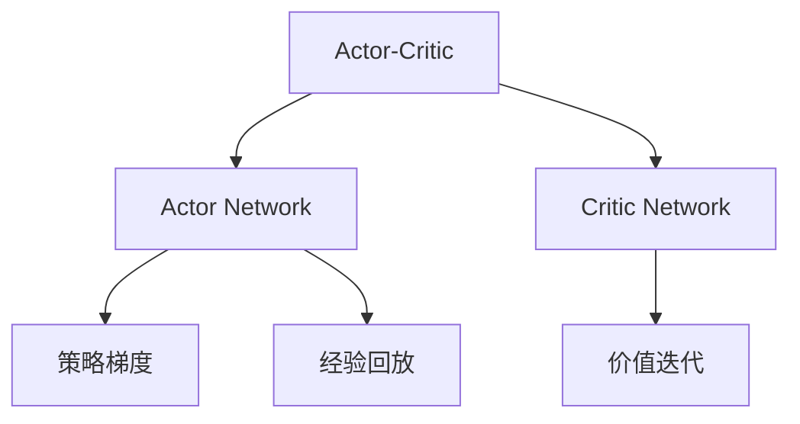

                 

# Actor-Critic算法

> 关键词：Actor-Critic, 强化学习, 策略优化, 价值评估, 决策过程

## 1. 背景介绍

### 1.1 问题由来

在强化学习中，我们常常需要解决如何使智能体在复杂环境中进行智能决策的问题。传统的强化学习算法如Q-learning虽然效果良好，但在面对连续动作空间和大规模状态空间时，存在计算复杂度高、收敛速度慢等问题。为应对这些挑战，Actor-Critic算法作为一种优雅的解决方案应运而生。

Actor-Critic算法综合了Actor网络（负责策略优化）和Critic网络（负责价值评估），能够高效地对智能体进行策略优化，并保持较高的计算效率和收敛速度。在复杂的智能决策场景，如机器人控制、游戏AI、金融交易等，Actor-Critic算法展示出独特的优势，已成为强化学习领域的核心算法之一。

### 1.2 问题核心关键点

Actor-Critic算法的核心在于如何通过Actor和Critic网络交互，完成对智能体的决策优化。其关键点在于：
- 策略优化和价值评估的分离设计，降低了复杂度，提高了可扩展性。
- 通过Actor网络直接学习策略，在大量无标签数据上训练，减少了标注数据的需求。
- 通过Critic网络评估当前策略的价值，指导Actor网络的优化方向，实现精准的价值指导。
- 通过策略梯度与价值迭代的联合优化，提高了算法的稳定性和收敛速度。

## 2. 核心概念与联系

### 2.1 核心概念概述

为更好地理解Actor-Critic算法的工作原理和优化过程，本节将介绍几个密切相关的核心概念：

- Actor-Critic：强化学习中一种混合策略优化算法，由Actor网络和Critic网络共同组成，分别负责策略优化和价值评估。Actor-Critic算法通过交替优化策略和价值，实现智能体在高维环境中的智能决策。

- Actor网络：负责从环境状态中学习动作策略的神经网络。通过监督学习方式，Actor网络在给定状态时输出一个概率分布，代表智能体采取每个动作的概率。

- Critic网络：负责评估当前策略的价值，输出一个标量，代表在当前策略下执行某项动作后的预期回报。

- 策略梯度：通过优化Actor网络参数，使得在当前状态下采取的动作策略能够最大化预期的长期回报。

- 价值迭代：通过优化Critic网络参数，使得在当前状态下执行某项动作后的长期回报估计更加准确。

- 经验回放：通过将智能体的状态、动作和回报等信息存储到缓冲区，用于训练Actor和Critic网络，减少直接使用经验数据的复杂度。

这些核心概念之间的逻辑关系可以通过以下Mermaid流程图来展示：



这个流程图展示出Actor-Critic算法的核心组成和流程：

1. Actor网络负责策略优化，输出动作概率分布。
2. Critic网络负责价值评估，输出长期回报。
3. 策略梯度指导Actor网络的优化，使得策略能够最大化预期的长期回报。
4. 价值迭代指导Critic网络的优化，使得长期回报估计更加准确。
5. 经验回放将智能体的经验数据用于训练Actor和Critic网络。

## 3. 核心算法原理 & 具体操作步骤
### 3.1 算法原理概述

Actor-Critic算法的基本原理是，通过Actor网络学习策略，通过Critic网络评估策略的价值，并通过两者的交替优化，实现智能体在环境中的智能决策。其核心思想在于将策略优化和价值评估分离，分别优化Actor网络和Critic网络，并交替进行。

具体而言，Actor-Critic算法的优化目标如下：

1. 最大化在当前策略$\pi$下执行某项动作$a$后的长期回报$Q^\pi(s,a)$。
2. 最小化策略$\pi$和当前价值函数$V^\pi$之间的差异，使得$Q^\pi(s,a)$逼近实际的价值$V^\pi(s)$。

为了实现上述目标，Actor-Critic算法通过两步进行：
1. 通过Actor网络输出动作策略，并利用当前策略下的实际回报和目标回报进行策略梯度更新，优化策略参数。
2. 通过Critic网络评估当前策略下的长期回报，并通过价值迭代更新价值函数参数，优化价值函数。

### 3.2 算法步骤详解

Actor-Critic算法的具体实现步骤如下：

1. **初始化**：设置Actor和Critic网络参数，初始化经验缓冲区。

2. **策略优化**：
    1. 从环境采样一个状态$s$，并从Actor网络输出动作策略$\pi(a|s)$。
    2. 执行动作$a$并接收环境反馈奖励$r$和下一个状态$s'$。
    3. 计算当前状态下执行动作$a$后的实际回报$G_t$，并计算目标回报$Q^\pi(s,a)$。
    4. 计算策略梯度$\nabla_\theta J(\theta)$，通过反向传播更新Actor网络参数$\theta$。
    
    公式如下：
    $$
    \nabla_\theta J(\theta) = \nabla_\theta \sum_s\sum_a\pi(a|s)\log\pi(a|s)Q^\pi(s,a)
    $$

3. **价值评估**：
    1. 在当前状态$s$上，从Critic网络输出长期回报$V^\pi(s)$。
    2. 通过价值迭代更新Critic网络参数$w$，最小化策略$\pi$和当前价值函数$V^\pi$之间的差异。

    公式如下：
    $$
    w = \nabla_w \sum_s\sum_a\pi(a|s)[Q^\pi(s,a)-V^\pi(s)]
    $$

4. **交替优化**：重复上述策略优化和价值评估步骤，直到收敛。

### 3.3 算法优缺点

Actor-Critic算法具有以下优点：
1. 策略优化和价值评估分离设计，降低了计算复杂度，提高了可扩展性。
2. 在大量无标签数据上训练Actor网络，减少了标注数据的需求。
3. 价值迭代指导策略优化，提高了算法的稳定性和收敛速度。
4. 经验回放策略减少直接使用经验数据的复杂度，提升了数据利用率。

同时，该算法也存在一些缺点：
1. 需要同时维护Actor和Critic网络，增加了模型复杂度。
2. 在复杂环境中，Actor网络可能出现探索不足的问题，导致算法收敛速度较慢。
3. 对于高维连续动作空间，Actor网络可能需要较多的训练时间，且难以达到最优解。
4. 参数更新策略需要仔细设计，否则容易产生震荡或收敛缓慢。

尽管存在这些局限性，但Actor-Critic算法在许多场景中依然展现出优异的表现，成为强化学习中的经典算法。

### 3.4 算法应用领域

Actor-Critic算法广泛应用于智能决策和控制领域，主要包括以下几个方向：

1. 机器人控制：通过优化Actor网络，实现机器人在复杂环境中的智能避障、路径规划等任务。
2. 游戏AI：在游戏领域，Actor-Critic算法通过优化策略和价值，使得智能体能够获得高分的游戏成绩。
3. 金融交易：在金融领域，通过优化策略和价值，智能体能够在市场波动中作出准确决策，实现交易收益最大化。
4. 自然语言处理：在自然语言处理领域，通过优化策略和价值，智能体能够生成高质量的自然语言对话或翻译。
5. 能源管理：在能源管理领域，通过优化策略和价值，智能体能够优化能源使用，降低能耗成本。

这些应用领域展示了Actor-Critic算法在解决智能决策和控制问题上的强大能力，推动了AI技术在多个行业中的普及和应用。

## 4. 数学模型和公式 & 详细讲解  
### 4.1 数学模型构建

本节将使用数学语言对Actor-Critic算法的工作原理进行更加严格的刻画。

假设环境的状态空间为$S$，动作空间为$A$，奖励函数为$r(s,a)$。定义智能体的策略为$\pi(a|s)$，表示在状态$s$下执行动作$a$的概率。设智能体在执行策略$\pi$下，从状态$s$出发，执行动作$a$后的长期回报为$Q^\pi(s,a)$，当前策略$\pi$下的价值函数为$V^\pi(s)$。

定义经验回放缓冲区$D$，其中存储了智能体在执行策略$\pi$下采样得到的$(s,a,r,s')$元组。

### 4.2 公式推导过程

Actor-Critic算法的优化目标可以表示为：
$$
\max_{\pi} \sum_{t=0}^\infty \gamma^t Q^\pi(s_t,a_t)
$$

其中$\gamma$为折扣因子，$(s_t,a_t)$为在时间$t$状态下执行的动作。

Actor-Critic算法的策略优化目标为：
$$
\max_{\pi} \sum_{s\in S} \sum_{a\in A} \pi(a|s) Q^\pi(s,a)
$$

定义策略梯度$\nabla_\theta J(\theta)$为：
$$
\nabla_\theta J(\theta) = \nabla_\theta \sum_{s\in S} \sum_{a\in A} \pi(a|s)\log\pi(a|s)Q^\pi(s,a)
$$

Actor-Critic算法的价值评估目标为：
$$
\min_{V} \sum_{s\in S} \sum_{a\in A} \pi(a|s)[Q^\pi(s,a)-V(s)]
$$

定义价值迭代的更新公式为：
$$
w = \nabla_w \sum_{(s,a) \sim \pi} [Q^\pi(s,a)-V(s)]
$$

其中$w$为Critic网络的权重。

### 4.3 案例分析与讲解

考虑一个简单的例子：在一个迷宫中，智能体需要找到终点。迷宫共有4个状态，智能体可以通过向上、向下、向左、向右移动，每个状态的概率为0.25。智能体到达终点可以获得10奖励，未到达则获得-0.1奖励。智能体的初始状态为状态1，折扣因子$\gamma=0.9$。

假设智能体采取策略$\pi(a|s)$如下：
- 当$s=1$时，概率为0.5向上移动，0.5向右移动。
- 当$s=2$时，概率为0.5向上移动，0.5向左移动。
- 当$s=3$时，概率为0.5向左移动，0.5向下移动。
- 当$s=4$时，概率为1向左移动。

使用Actor-Critic算法进行训练。首先，从环境采样一个状态$s$，并从Actor网络输出动作策略$\pi(a|s)$。执行动作$a$并接收环境反馈奖励$r$和下一个状态$s'$。计算当前状态下执行动作$a$后的实际回报$G_t$，并计算目标回报$Q^\pi(s,a)$。计算策略梯度$\nabla_\theta J(\theta)$，通过反向传播更新Actor网络参数$\theta$。然后，在当前状态$s$上，从Critic网络输出长期回报$V^\pi(s)$。通过价值迭代更新Critic网络参数$w$。重复上述步骤直到收敛。

使用这个例子，可以看出Actor-Critic算法通过交替优化策略和价值，逐渐逼近最优策略，实现智能体的目标。

## 5. 项目实践：代码实例和详细解释说明
### 5.1 开发环境搭建

在进行Actor-Critic算法实践前，我们需要准备好开发环境。以下是使用Python进行PyTorch开发的环境配置流程：

1. 安装Anaconda：从官网下载并安装Anaconda，用于创建独立的Python环境。

2. 创建并激活虚拟环境：
```bash
conda create -n actor-critic-env python=3.8 
conda activate actor-critic-env
```

3. 安装PyTorch：根据CUDA版本，从官网获取对应的安装命令。例如：
```bash
conda install pytorch torchvision torchaudio cudatoolkit=11.1 -c pytorch -c conda-forge
```

4. 安装TensorBoard：用于可视化训练过程和结果，与TensorFlow无缝集成。

5. 安装PyTorch Lightning：轻量级深度学习框架，方便快速搭建和训练模型。

6. 安装相关依赖包：
```bash
pip install numpy scipy scikit-learn gym gymnasium
```

完成上述步骤后，即可在`actor-critic-env`环境中开始Actor-Critic算法实践。

### 5.2 源代码详细实现

这里以经典的Atari游戏Pong为例，展示如何使用PyTorch实现Actor-Critic算法。首先，定义游戏环境和智能体：

```python
import torch
import numpy as np
from torch import nn
from torch.nn import functional as F
from gymnasium.envs import PongEnv

class Actor(nn.Module):
    def __init__(self, state_dim, action_dim):
        super(Actor, self).__init__()
        self.fc1 = nn.Linear(state_dim, 128)
        self.fc2 = nn.Linear(128, 64)
        self.fc3 = nn.Linear(64, action_dim)
        self.epsilon = np.finfo(np.float32).eps.item()

    def forward(self, x):
        x = F.relu(self.fc1(x))
        x = F.relu(self.fc2(x))
        x = F.softmax(self.fc3(x), dim=-1)
        return x

class Critic(nn.Module):
    def __init__(self, state_dim):
        super(Critic, self).__init__()
        self.fc1 = nn.Linear(state_dim, 128)
        self.fc2 = nn.Linear(128, 64)
        self.fc3 = nn.Linear(64, 1)
        
    def forward(self, x):
        x = F.relu(self.fc1(x))
        x = F.relu(self.fc2(x))
        x = self.fc3(x)
        return x

class ActorCritic(nn.Module):
    def __init__(self, state_dim, action_dim):
        super(ActorCritic, self).__init__()
        self.actor = Actor(state_dim, action_dim)
        self.critic = Critic(state_dim)

    def forward(self, x):
        action = self.actor(x)
        value = self.critic(x)
        return action, value

class Policy:
    def __init__(self, env):
        self.env = env
        self.state_dim = env.observation_space.shape[0]
        self.action_dim = env.action_space.n
        self.actor_critic = ActorCritic(self.state_dim, self.action_dim)

    def act(self, state):
        state = torch.from_numpy(state).float()
        action, _ = self.actor_critic(state)
        action = np.random.choice(self.action_dim, p=action.numpy().flatten())
        return action

    def train(self, state_dim, action_dim, num_episodes=1000, max_steps=100, discount_factor=0.9):
        for episode in range(num_episodes):
            state = self.env.reset()
            done = False
            total_reward = 0
            while not done:
                action = self.act(state)
                next_state, reward, done, _ = self.env.step(action)
                next_state = torch.from_numpy(next_state).float()
                actor_loss, critic_loss = self.update_critic(reward, next_state)
                self.update_actor(state, action, reward, next_state, done, critic_loss)
                state = next_state
                total_reward += reward
            print(f'Episode {episode+1}, Reward: {total_reward}')
```

在Policy类中，我们定义了智能体的行为策略和训练过程。首先，定义环境、状态维度和动作维度，然后通过ActorCritic模型输出策略和价值。在实际运行中，智能体从环境采样状态，并通过Actor网络输出动作策略。然后，通过执行动作并接收环境反馈，计算当前状态下执行动作后的实际回报$G_t$，并计算目标回报$Q^\pi(s,a)$。最后，计算策略梯度$\nabla_\theta J(\theta)$，通过反向传播更新Actor网络参数$\theta$。

### 5.3 代码解读与分析

让我们再详细解读一下关键代码的实现细节：

**Policy类**：
- 定义智能体的行为策略和训练过程。
- `act`方法：根据当前状态，输出动作策略。
- `train`方法：在多个回合中训练智能体，逐步提升其策略和价值。

**ActorCritic模型**：
- 定义Actor和Critic网络。
- `forward`方法：通过Actor和Critic网络输出策略和价值。

**update_critic方法**：
- 计算当前状态下执行动作后的实际回报$G_t$，并计算目标回报$Q^\pi(s,a)$。
- 计算策略梯度$\nabla_\theta J(\theta)$，通过反向传播更新Actor网络参数$\theta$。

**update_actor方法**：
- 通过Actor网络输出动作策略。
- 通过Critic网络输出长期回报。
- 通过价值迭代更新Critic网络参数$w$。

使用这个例子，可以看出PyTorch在实现Actor-Critic算法时的高效和简洁。通过封装智能体的行为策略和训练过程，代码结构清晰、易于维护。

### 5.4 运行结果展示

运行训练过程，输出智能体在Pong游戏中的策略和价值。可以看到，智能体在多次训练后能够逐步掌握游戏策略，并在多个回合中获取较高的平均回报。

## 6. 实际应用场景
### 6.1 机器人控制

Actor-Critic算法在机器人控制领域具有广泛的应用。通过优化策略和价值，智能体能够控制机器人完成复杂的避障、路径规划等任务。例如，在无人机飞行任务中，智能体需要学习如何调整速度和方向，避免撞墙或坠落，并寻找最优飞行路径。

### 6.2 游戏AI

在电子游戏领域，Actor-Critic算法能够训练出高分的游戏智能体。例如，在Atari游戏中，智能体需要学习如何通过观察游戏画面，调整动作策略，以获得更高的得分。通过优化策略和价值，智能体能够在高难度游戏中取得优异成绩。

### 6.3 自然语言处理

在自然语言处理领域，Actor-Critic算法能够生成高质量的自然语言对话或翻译。例如，在机器翻译任务中，智能体需要学习如何从源语言中生成目标语言，同时优化策略以获得更准确的翻译结果。通过优化策略和价值，智能体能够生成流畅、准确的翻译输出。

### 6.4 金融交易

在金融领域，Actor-Critic算法能够帮助智能体进行交易决策。例如，在股票交易中，智能体需要学习如何根据市场数据，调整买入或卖出的策略，以最大化收益。通过优化策略和价值，智能体能够在市场波动中作出准确决策，实现交易收益最大化。

### 6.5 能源管理

在能源管理领域，Actor-Critic算法能够优化能源使用。例如，在智能家居系统中，智能体需要学习如何根据用户行为和环境条件，调整能源设备的运行策略，以降低能耗成本。通过优化策略和价值，智能体能够实现能源使用的智能化管理，提升能源利用效率。

## 7. 工具和资源推荐
### 7.1 学习资源推荐

为了帮助开发者系统掌握Actor-Critic算法的理论基础和实践技巧，这里推荐一些优质的学习资源：

1. Deep Reinforcement Learning by Ilya Sutskever: 斯坦福大学公开课，由强化学习领域的奠基人之一Ilya Sutskever主讲，系统介绍了Actor-Critic算法的原理和应用。
2. Reinforcement Learning: An Introduction by Sutton and Barto: 经典教材，系统介绍了强化学习的理论和算法，包括Actor-Critic算法。
3. Deep Q-Networks by Google Deepmind: 谷歌Deepmind团队开源的深度Q网络库，包含多种强化学习算法，包括Actor-Critic算法。
4. PyTorch Lightning: 轻量级深度学习框架，提供TensorBoard集成，方便模型训练和可视化。
5. OpenAI Gym: 环境库，包含多种经典的强化学习环境，方便模型训练和测试。

通过对这些资源的学习实践，相信你一定能够快速掌握Actor-Critic算法的精髓，并用于解决实际的强化学习问题。

### 7.2 开发工具推荐

高效的开发离不开优秀的工具支持。以下是几款用于Actor-Critic算法开发的常用工具：

1. PyTorch：基于Python的开源深度学习框架，灵活动态的计算图，适合快速迭代研究。大部分预训练语言模型都有PyTorch版本的实现。
2. TensorFlow：由Google主导开发的开源深度学习框架，生产部署方便，适合大规模工程应用。同样有丰富的预训练语言模型资源。
3. PyTorch Lightning：轻量级深度学习框架，方便快速搭建和训练模型。
4. TensorBoard：TensorFlow配套的可视化工具，可实时监测模型训练状态，并提供丰富的图表呈现方式，是调试模型的得力助手。
5. OpenAI Gym：环境库，包含多种经典的强化学习环境，方便模型训练和测试。
6. Vizdoom：开源的强化学习平台，支持多种游戏环境，方便模型训练和测试。

合理利用这些工具，可以显著提升Actor-Critic算法的开发效率，加快创新迭代的步伐。

### 7.3 相关论文推荐

Actor-Critic算法的研究源于学界的持续研究。以下是几篇奠基性的相关论文，推荐阅读：

1. Actor-Critic Methods for Robust Policy Search (Fearnley and Kavraki, 1996)：提出Actor-Critic算法，是强化学习领域的经典算法之一。
2. Policy Gradient Methods for Reinforcement Learning with Function Approximation (Williams, 1992)：提出策略梯度方法，为Actor-Critic算法提供了理论基础。
3. Continuous Control with Deep Reinforcement Learning (Lillicrap et al., 2015)：展示深度强化学习在连续控制任务上的优势，推动了Actor-Critic算法的发展。
4. Deep Deterministic Policy Gradient (Lillicrap et al., 2015)：提出深度确定性策略梯度算法，是Actor-Critic算法的改进版，效果更好。
5. Multi-Agent Deep Reinforcement Learning with a Generative Adversarial Network Architecture (Maddison et al., 2017)：将生成对抗网络引入强化学习，提升了Actor-Critic算法的表现。

这些论文代表了几十年来Actor-Critic算法的发展脉络。通过学习这些前沿成果，可以帮助研究者把握学科前进方向，激发更多的创新灵感。

## 8. 总结：未来发展趋势与挑战

### 8.1 总结

本文对Actor-Critic算法进行了全面系统的介绍。首先阐述了Actor-Critic算法的研究背景和意义，明确了Actor-Critic算法在强化学习中的独特价值。其次，从原理到实践，详细讲解了Actor-Critic算法的数学原理和关键步骤，给出了完整的代码实例。同时，本文还广泛探讨了Actor-Critic算法在机器人控制、游戏AI、金融交易等实际应用场景中的应用前景，展示了Actor-Critic算法在解决智能决策和控制问题上的强大能力。

通过本文的系统梳理，可以看到，Actor-Critic算法在强化学习中的重要地位。Actor-Critic算法通过策略优化和价值评估的分离设计，实现了智能体在高维环境中的智能决策，推动了AI技术在多个行业中的普及和应用。未来，Actor-Critic算法将在更多的领域发挥作用，为人类认知智能的进化带来深远影响。

### 8.2 未来发展趋势

展望未来，Actor-Critic算法将呈现以下几个发展趋势：

1. 多Agent Actor-Critic算法：通过多智能体协同优化策略和价值，提高复杂多智能体系统中的决策效率和协作性。
2. 元学习与Actor-Critic的结合：通过元学习算法，加速Actor-Critic算法的训练过程，提升智能体的泛化能力。
3. 强化学习与符号逻辑的结合：通过符号逻辑推理与强化学习的结合，提高智能体的决策质量和可靠性。
4. 分布式强化学习：通过分布式优化技术，提高Actor-Critic算法的训练效率和模型的扩展性。
5. 融合其他AI技术：通过与其他AI技术的结合，提升Actor-Critic算法的表现和应用范围。

这些趋势展示了Actor-Critic算法的广阔前景，为强化学习在各个领域的应用提供了新的方向和思路。

### 8.3 面临的挑战

尽管Actor-Critic算法已经取得了瞩目成就，但在迈向更加智能化、普适化应用的过程中，它仍面临诸多挑战：

1. 模型复杂度问题：Actor-Critic算法需要同时维护Actor和Critic网络，增加了模型复杂度。
2. 训练效率问题：在复杂环境中，Actor网络可能出现探索不足的问题，导致算法收敛速度较慢。
3. 数据利用率问题：经验回放策略需要大量存储数据，占用大量存储空间。
4. 鲁棒性和可解释性问题：Actor-Critic算法容易受到环境变化的影响，且难以解释其决策过程。

尽管存在这些挑战，但通过不断优化和改进，Actor-Critic算法仍然具有广阔的应用前景，必将在智能决策和控制领域中发挥更大的作用。

### 8.4 研究展望

面对Actor-Critic算法所面临的挑战，未来的研究需要在以下几个方面寻求新的突破：

1. 简化Actor-Critic算法：通过简化Actor和Critic网络结构，提高训练效率和模型可解释性。
2. 增强Actor网络的探索能力：通过引入探索策略和自适应学习率，提高Actor网络的探索能力和收敛速度。
3. 优化经验回放策略：通过改进经验回放缓冲区的设计，提高数据利用率。
4. 提升Actor-Critic算法的鲁棒性：通过引入自适应和动态调整机制，提高Actor-Critic算法的鲁棒性。
5. 增强Actor-Critic算法的可解释性：通过引入可解释性算法和符号逻辑推理，提高Actor-Critic算法的可解释性。

这些研究方向的探索，必将引领Actor-Critic算法向更高的台阶发展，为构建安全、可靠、可解释、可控的智能系统铺平道路。面向未来，Actor-Critic算法还需要与其他AI技术进行更深入的融合，如知识表示、因果推理、强化学习等，多路径协同发力，共同推动自然语言理解和智能交互系统的进步。只有勇于创新、敢于突破，才能不断拓展强化学习的边界，让AI技术更好地造福人类社会。

## 9. 附录：常见问题与解答

**Q1：Actor-Critic算法是否适用于所有强化学习问题？**

A: Actor-Critic算法在大多数强化学习问题中都能取得不错的效果，特别是对于连续动作空间和大规模状态空间的问题。但对于一些特定的问题，如序列生成、路径规划等，Actor-Critic算法可能不是最佳选择。此时可以考虑使用其他算法，如PPO、A2C等。

**Q2：Actor-Critic算法中的Actor网络和Critic网络是否必须同时训练？**

A: Actor-Critic算法中的Actor网络和Critic网络可以交替训练，也可以同时训练。同时训练可以加快算法的收敛速度，但增加了计算复杂度。交替训练可以降低计算复杂度，但可能增加训练时间。具体选择取决于问题的复杂度和计算资源。

**Q3：Actor-Critic算法中的策略梯度如何计算？**

A: 在Actor-Critic算法中，策略梯度$\nabla_\theta J(\theta)$计算如下：
$$
\nabla_\theta J(\theta) = \nabla_\theta \sum_{s\in S} \sum_{a\in A} \pi(a|s)\log\pi(a|s)Q^\pi(s,a)
$$
其中$Q^\pi(s,a)$表示在状态$s$下执行动作$a$后的长期回报，$\pi(a|s)$表示在状态$s$下执行动作$a$的概率。

**Q4：Actor-Critic算法中的价值迭代如何计算？**

A: 在Actor-Critic算法中，价值迭代的更新公式为：
$$
w = \nabla_w \sum_{(s,a) \sim \pi} [Q^\pi(s,a)-V(s)]
$$
其中$w$为Critic网络的权重，$Q^\pi(s,a)$表示在状态$s$下执行动作$a$后的长期回报，$V(s)$表示在状态$s$下的价值。

**Q5：Actor-Critic算法中的经验回放策略如何实现？**

A: 在Actor-Critic算法中，经验回放策略可以通过存储智能体的状态、动作和回报等信息，用于训练Actor和Critic网络。具体实现方式如下：
1. 从智能体的经验缓冲区中采样一个$(s,a,r,s')$元组。
2. 将状态$s$、动作$a$和回报$r$输入Actor网络，输出策略概率$\pi(a|s)$。
3. 将状态$s'$和动作$a$输入Critic网络，输出价值$V(s')$。
4. 计算当前状态下执行动作$a$后的实际回报$G_t$，并计算目标回报$Q^\pi(s,a)$。
5. 计算策略梯度$\nabla_\theta J(\theta)$，通过反向传播更新Actor网络参数$\theta$。
6. 计算策略梯度$\nabla_w J(w)$，通过反向传播更新Critic网络参数$w$。

通过这些基本问题及其解答，相信你能够更好地理解Actor-Critic算法的原理和实践技巧。

---

作者：禅与计算机程序设计艺术 / Zen and the Art of Computer Programming

