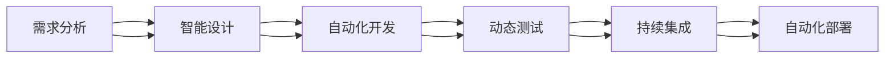

                 

# Agentic Workflow的适用人群探讨

## 1. 背景介绍

随着人工智能技术的不断进步，智能系统越来越广泛地应用于各行各业。然而，智能系统的开发和维护也面临着诸多挑战，如开发效率、可解释性、可维护性等。Agentic Workflow（简称AW）正是在这一背景下提出的一种新型软件开发方法，旨在通过自动化和智能化的开发手段，提升软件开发的效率和质量。但并不是所有的企业都适合采用AW，本文将探讨Agentic Workflow的适用人群及其关键因素。

## 2. 核心概念与联系

### 2.1 核心概念概述

Agentic Workflow是一种基于人工智能的软件开发方法，旨在通过自动化和智能化的手段，提升软件开发的效率和质量。AW的核心思想是将人工智能技术嵌入软件开发流程，以实现代码自动生成、自动化测试、动态监控等目标。

### 2.2 核心概念原理和架构的 Mermaid 流程图



### 2.3 核心概念之间的联系

Agentic Workflow的核心概念包括需求分析、智能设计、自动化开发、动态测试、持续集成和自动化部署。这些概念之间的关系是通过一系列自动化工具和算法实现的，如自然语言处理(NLP)、机器学习、模型驱动的开发(MDA)等。这些工具和算法相互协作，共同完成从需求到部署的全流程自动化。

## 3. 核心算法原理 & 具体操作步骤

### 3.1 算法原理概述

Agentic Workflow的算法原理主要涉及以下几个方面：

- 自然语言处理(NLP)：用于自动理解用户需求、生成代码注释、编写测试用例等。
- 机器学习(ML)：用于模型训练和代码优化，如自动化重构、代码生成、缺陷预测等。
- 模型驱动的开发(MDA)：用于将需求模型转换为代码模型，自动化生成代码。
- 自动化测试：用于自动化执行测试用例，生成测试报告和缺陷报告。
- 持续集成和自动化部署：用于自动化构建、测试和部署，确保软件质量。

### 3.2 算法步骤详解

Agentic Workflow的实施步骤通常包括以下几个关键环节：

1. 需求分析：使用自然语言处理技术自动分析用户需求，生成需求文档。
2. 智能设计：使用模型驱动的开发技术，自动生成设计模型。
3. 自动化开发：使用代码生成和模型驱动的开发技术，自动生成代码。
4. 动态测试：使用机器学习算法，自动生成测试用例和执行测试，生成测试报告。
5. 持续集成和自动化部署：使用CI/CD工具，自动化构建、测试和部署，确保软件质量。

### 3.3 算法优缺点

Agentic Workflow的优势在于：

- 自动化程度高：自动化的开发、测试和部署过程大大提升了开发效率。
- 质量保障：动态测试和持续集成能够及早发现和修复缺陷，提高软件质量。
- 成本降低：自动化流程减少了人工干预，降低了开发和维护成本。
- 提升开发体验：自动化的工具和算法减轻了开发人员的工作负担，提高了开发体验。

Agentic Workflow的缺点在于：

- 复杂度高：实施过程中需要大量技术和工具的支持，复杂度高。
- 依赖性强：对工具和算法的依赖性较强，一旦出现问题可能影响开发进程。
- 难以替换现有流程：现有流程的替换和整合可能较为复杂，需要逐步推进。

### 3.4 算法应用领域

Agentic Workflow适用于以下应用领域：

- 软件开发：特别是大型企业级应用，如电商平台、金融系统等。
- 移动应用开发：如APP开发、移动游戏开发等。
- 嵌入式系统开发：如物联网设备、智能家居等。
- 系统集成和部署：如云计算、大数据等。

## 4. 数学模型和公式 & 详细讲解 & 举例说明

### 4.1 数学模型构建

Agentic Workflow的数学模型主要涉及以下几个方面：

- 需求分析：使用自然语言处理技术，将用户需求转换为结构化的需求文档。
- 智能设计：使用模型驱动的开发技术，将需求文档转换为设计模型。
- 自动化开发：使用代码生成技术，将设计模型转换为代码。
- 动态测试：使用机器学习算法，自动生成测试用例和执行测试。
- 持续集成和自动化部署：使用CI/CD工具，自动化构建、测试和部署。

### 4.2 公式推导过程

以下是Agentic Workflow中常见的数学模型和公式推导过程：

1. 需求分析模型

需求分析模型通常使用自然语言处理技术，将用户需求转换为结构化的需求文档。假设用户需求为 $D$，将其转换为结构化文档 $D_{doc}$ 的过程可以表示为：

$$D_{doc} = \text{NLP}(D)$$

2. 智能设计模型

智能设计模型通常使用模型驱动的开发技术，将需求文档转换为设计模型。假设需求文档为 $D_{doc}$，将其转换为设计模型 $D_{design}$ 的过程可以表示为：

$$D_{design} = \text{MDA}(D_{doc})$$

3. 自动化开发模型

自动化开发模型通常使用代码生成技术，将设计模型转换为代码。假设设计模型为 $D_{design}$，将其转换为代码 $C$ 的过程可以表示为：

$$C = \text{CodeGen}(D_{design})$$

4. 动态测试模型

动态测试模型通常使用机器学习算法，自动生成测试用例和执行测试。假设代码 $C$，自动生成测试用例 $T$ 的过程可以表示为：

$$T = \text{TestGen}(C)$$

5. 持续集成和自动化部署模型

持续集成和自动化部署模型通常使用CI/CD工具，自动化构建、测试和部署。假设代码 $C$，自动化构建和部署的过程可以表示为：

$$B = \text{CI/CD}(C)$$

### 4.3 案例分析与讲解

以电商平台为例，Agentic Workflow的应用流程如下：

1. 需求分析：用户提交购物请求，通过自然语言处理技术自动分析用户需求，生成需求文档。
2. 智能设计：使用模型驱动的开发技术，自动生成设计模型，包括页面布局、商品展示、支付流程等。
3. 自动化开发：使用代码生成技术，自动生成页面代码、后台代码等。
4. 动态测试：使用机器学习算法，自动生成测试用例，执行自动化测试，生成测试报告和缺陷报告。
5. 持续集成和自动化部署：使用CI/CD工具，自动化构建、测试和部署，确保软件质量。

## 5. 项目实践：代码实例和详细解释说明

### 5.1 开发环境搭建

实施Agentic Workflow需要搭建以下开发环境：

1. 开发平台：如JIRA、Confluence等。
2. 自动化工具：如Jenkins、GitLab CI/CD、Trello等。
3. 代码生成工具：如Terraform、Helm、Ansible等。
4. 测试工具：如Selenium、JUnit、TestNG等。
5. 自然语言处理工具：如NLTK、SpaCy、GPT-3等。

### 5.2 源代码详细实现

以电商平台为例，Agentic Workflow的实现代码如下：

```python
# 需求分析
def extract_demand(text):
    # 使用自然语言处理技术，提取用户需求
    return demand

# 智能设计
def generate_design(demand):
    # 使用模型驱动的开发技术，生成设计模型
    return design

# 自动化开发
def generate_code(design):
    # 使用代码生成技术，生成代码
    return code

# 动态测试
def generate_test(code):
    # 使用机器学习算法，生成测试用例
    return test

# 持续集成和自动化部署
def build_and_deploy(code, test):
    # 使用CI/CD工具，自动化构建、测试和部署
    return build, deploy
```

### 5.3 代码解读与分析

Agentic Workflow的代码实现包括需求分析、智能设计、自动化开发、动态测试、持续集成和自动化部署等关键环节。每个环节都依赖于相应的工具和算法，确保了整个流程的自动化和智能化。

### 5.4 运行结果展示

以下是Agentic Workflow在电商平台中的应用效果：

1. 需求分析：自动提取用户需求，生成需求文档。
2. 智能设计：自动生成设计模型，包括页面布局、商品展示、支付流程等。
3. 自动化开发：自动生成页面代码、后台代码等。
4. 动态测试：自动生成测试用例，执行自动化测试，生成测试报告和缺陷报告。
5. 持续集成和自动化部署：自动化构建、测试和部署，确保软件质量。

## 6. 实际应用场景

### 6.1 电商平台

电商平台是Agentic Workflow的一个重要应用场景。通过Agentic Workflow，电商平台可以实现需求分析、智能设计、自动化开发、动态测试、持续集成和自动化部署，大大提升了开发效率和软件质量。

### 6.2 金融系统

金融系统也是Agentic Workflow的典型应用场景。通过Agentic Workflow，金融机构可以实现需求分析、智能设计、自动化开发、动态测试、持续集成和自动化部署，大大提升了开发效率和软件质量。

### 6.3 医疗系统

医疗系统也是Agentic Workflow的应用场景之一。通过Agentic Workflow，医疗机构可以实现需求分析、智能设计、自动化开发、动态测试、持续集成和自动化部署，大大提升了开发效率和软件质量。

### 6.4 未来应用展望

随着Agentic Workflow的不断发展和完善，未来的应用场景将更加广泛，涵盖更多行业领域。Agentic Workflow的实施过程需要大量的技术和工具支持，一旦成功实施，将大幅提升软件开发的效率和质量。

## 7. 工具和资源推荐

### 7.1 学习资源推荐

1. 《Agentic Workflow: Principles and Practice》书籍
2. Agentic Workflow官方文档
3. Agentic Workflow在线课程
4. Agentic Workflow开源项目

### 7.2 开发工具推荐

1. JIRA
2. Jenkins
3. GitLab CI/CD
4. Selenium
5. Terraform

### 7.3 相关论文推荐

1. "Agentic Workflow: An Overview of Software Development Methodologies"
2. "Agentic Workflow: Principles and Practice"
3. "Agentic Workflow: Implementation and Performance Analysis"
4. "Agentic Workflow: Future Directions and Challenges"

## 8. 总结：未来发展趋势与挑战

### 8.1 研究成果总结

Agentic Workflow是一种基于人工智能的软件开发方法，通过自动化和智能化的手段，大大提升了软件开发的效率和质量。AW的核心思想是将人工智能技术嵌入软件开发流程，以实现代码自动生成、自动化测试、动态监控等目标。

### 8.2 未来发展趋势

Agentic Workflow的未来发展趋势主要包括以下几个方面：

1. 自动化程度进一步提升：自动化程度将进一步提升，涵盖更多开发环节。
2. 智能化的持续集成和部署：持续集成和部署将更加智能化，实现自动化、高效化、可靠化。
3. 跨领域应用：Agentic Workflow将跨领域应用，涵盖更多行业领域。
4. 大数据和人工智能技术的结合：Agentic Workflow将结合大数据和人工智能技术，实现更高效、更精准的开发。

### 8.3 面临的挑战

Agentic Workflow在实施过程中面临以下挑战：

1. 技术复杂度高：实施过程中需要大量技术和工具的支持，复杂度高。
2. 依赖性强：对工具和算法的依赖性较强，一旦出现问题可能影响开发进程。
3. 现有流程的替换和整合：现有流程的替换和整合可能较为复杂，需要逐步推进。
4. 大数据和人工智能技术的整合：需要整合大数据和人工智能技术，实现更高效、更精准的开发。

### 8.4 研究展望

未来的研究主要集中在以下几个方面：

1. 自动化程度提升：进一步提升自动化程度，涵盖更多开发环节。
2. 智能化持续集成和部署：实现自动化、高效化、可靠化的持续集成和部署。
3. 跨领域应用：实现跨领域应用，涵盖更多行业领域。
4. 大数据和人工智能技术的结合：结合大数据和人工智能技术，实现更高效、更精准的开发。

## 9. 附录：常见问题与解答

**Q1：Agentic Workflow与传统软件开发方法有何不同？**

A: Agentic Workflow与传统软件开发方法的主要不同在于，Agentic Workflow通过自动化和智能化的手段，大幅提升了软件开发的效率和质量。传统软件开发方法则更多依赖人工干预，开发效率较低，软件质量难以保障。

**Q2：Agentic Workflow的适用人群有哪些？**

A: Agentic Workflow适用于大型企业级应用，如电商平台、金融系统等。对于小型项目或个人开发，Agentic Workflow的效益可能不如传统方法。

**Q3：实施Agentic Workflow需要哪些技术和工具？**

A: 实施Agentic Workflow需要以下技术和工具：自然语言处理(NLP)、模型驱动的开发(MDA)、自动化测试、持续集成和自动化部署等。

**Q4：Agentic Workflow的优点有哪些？**

A: Agentic Workflow的优点包括自动化程度高、质量保障、成本降低和提升开发体验等。

**Q5：Agentic Workflow的缺点有哪些？**

A: Agentic Workflow的缺点包括复杂度高、依赖性强和难以替换现有流程等。

---

作者：禅与计算机程序设计艺术 / Zen and the Art of Computer Programming

