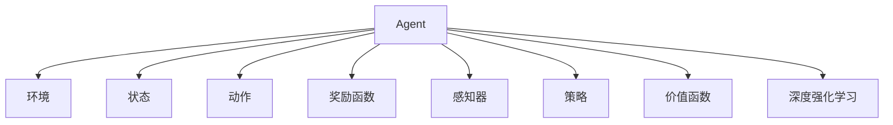

                 

# Agent代理在AI系统中的详细解析

## 1. 背景介绍

### 1.1 问题由来

在人工智能(AI)系统中，Agent代理(以下简称Agent)扮演着至关重要的角色。随着AI技术的迅猛发展，Agent在自动化决策、智能推荐、智能客服、自动驾驶等领域得到了广泛的应用。然而，关于Agent的详细解析和应用研究相对较少，本文将深入探讨Agent的基本原理、设计模式、优缺点以及实际应用场景，为读者提供全面而系统的视角。

### 1.2 问题核心关键点

Agent的本质是一个智能体，它能够在特定环境中自主地做出决策并采取行动。Agent的主要特征包括自主性、感知性、反应性和学习性。在AI系统中，Agent通常分为任务型Agent和感知型Agent两大类。

- **任务型Agent**：如智能客服、推荐系统中的Agent，其目标是通过完成特定任务实现某种价值。
- **感知型Agent**：如自动驾驶中的Agent，其目标是感知并理解环境，做出自主决策。

Agent的应用涉及多个领域的复杂问题，如决策路径选择、环境感知、动作执行和反馈处理等。本文将重点关注任务型Agent，深入解析其在AI系统中的具体实现和应用。

## 2. 核心概念与联系

### 2.1 核心概念概述

为更好地理解Agent的工作原理和应用，本节将介绍几个关键概念：

- **Agent**：即智能体，是能够在特定环境中自主做出决策并采取行动的实体。
- **环境**：Agent运行的外部环境，包括物理环境、虚拟环境和社会环境等。
- **状态**：Agent当前所处的环境状态，是Agent做出决策的基础。
- **动作**：Agent为实现目标而采取的具体行动，是影响环境变化的关键因素。
- **奖励函数**：用于衡量Agent行为优劣的评价函数，通常用于强化学习中的学习过程。
- **感知器**：用于感知环境状态的传感器，如摄像头、雷达等，是Agent进行环境建模和决策的基础。
- **策略**：Agent的决策规则，通常是一个映射函数，将状态映射到动作。
- **价值函数**：用于评估不同策略下Agent的长期奖励期望，常见于价值迭代算法中。
- **深度强化学习**：一种结合深度神经网络和强化学习的技术，能够学习到复杂的策略和价值函数。

这些核心概念之间的逻辑关系可以通过以下Mermaid流程图来展示：



这个流程图展示了这个概念网络，其中Agent根据环境和状态做出决策，并通过感知器接收环境信息。奖励函数和价值函数评估决策质量，感知器和策略指导Agent的行动，而深度强化学习则提供了一种高效的策略优化方法。

## 3. 核心算法原理 & 具体操作步骤

### 3.1 算法原理概述

Agent的工作原理可以概括为感知、决策和行动三个阶段：

- **感知阶段**：Agent通过感知器获取环境状态。
- **决策阶段**：Agent根据当前状态和策略，选择合适的动作。
- **行动阶段**：Agent执行选定的动作，影响环境状态并获取奖励。

Agent的决策过程通常基于某种策略，常见的策略包括基于规则的策略、基于经验的策略和基于学习的策略。其中，基于学习的策略是强化学习的主要方法，通过与环境的交互学习最优策略。

### 3.2 算法步骤详解

基于强化学习的Agent设计通常包括以下几个关键步骤：

1. **环境建模**：将现实环境抽象为数学模型，如马尔可夫决策过程(MDP)。
2. **状态空间划分**：将连续的或离散的状态空间划分，便于模型处理。
3. **动作空间定义**：定义Agent可执行的动作集，通常为离散动作集。
4. **奖励函数设计**：设计合适的奖励函数，评估Agent的行为。
5. **策略选择与优化**：选择合适的策略，如策略梯度、价值迭代、Q-learning等，优化策略以提升Agent的性能。
6. **训练与测试**：通过与环境的交互训练Agent，并在测试集上评估性能。

### 3.3 算法优缺点

基于强化学习的Agent具有以下优点：

- **适应性强**：能够自动适应复杂多变的环境。
- **无需显式规则**：不需要预定义的决策规则，能够通过学习动态优化策略。
- **并行化**：多个Agent可以并行训练，加速学习过程。

同时，基于强化学习的Agent也存在一些局限：

- **学习效率低**：需要大量的训练数据和时间才能学习到最优策略。
- **对奖励设计敏感**：奖励函数的设定直接影响学习效果。
- **策略不稳定**：学习到的策略可能受到噪声和随机性的影响。

### 3.4 算法应用领域

基于强化学习的Agent广泛应用于自动化决策、机器人控制、智能推荐、自动驾驶等多个领域：

- **自动化决策**：如金融交易中的决策系统，通过学习市场数据做出投资决策。
- **机器人控制**：如工业机器人、无人机等，通过学习操作技巧提高执行效率。
- **智能推荐**：如电商推荐系统，通过学习用户行为推荐商品。
- **自动驾驶**：如自动驾驶汽车，通过学习交通规则和环境感知决策行驶路线。

## 4. 数学模型和公式 & 详细讲解 & 举例说明

### 4.1 数学模型构建

我们可以将Agent的工作过程用以下数学模型来描述：

- **状态空间**：记为 $S$，$|S|$ 表示状态数量。
- **动作空间**：记为 $A$，$|A|$ 表示动作数量。
- **状态转移概率**：记为 $P(s'|s,a)$，表示在状态 $s$ 下，采取动作 $a$ 后转移到状态 $s'$ 的概率。
- **奖励函数**：记为 $R(s,a)$，表示在状态 $s$ 下采取动作 $a$ 后获得的奖励。
- **策略**：记为 $π$，表示在状态 $s$ 下采取动作 $a$ 的概率。

### 4.2 公式推导过程

假设Agent以固定策略 $π$ 在MDP中运行，状态转移概率 $P$ 和奖励函数 $R$ 均为已知，可以推导出最优策略 $π^*$ 的贝尔曼方程：

$$
V^*(s) = \max_{a} \left[ R(s,a) + \gamma \sum_{s'} P(s'|s,a) V^*(s') \right]
$$

其中 $V^*(s)$ 表示在状态 $s$ 下的最优价值，$\gamma$ 表示折扣因子。

最优策略 $π^*$ 可以表示为：

$$
π^*(s) = \frac{e^{\frac{Q^*(s,a)}{T}}}{\sum_{a'} e^{\frac{Q^*(s,a')}{T}}}
$$

其中 $Q^*(s,a)$ 表示在状态 $s$ 下采取动作 $a$ 的Q值，$T$ 为温度因子。

### 4.3 案例分析与讲解

以自动驾驶中的Agent为例，解释其决策过程和应用场景：

1. **环境建模**：将道路环境建模为MDP，状态包括车辆位置、速度、交通信号灯等，动作包括加速、刹车、转向等。
2. **状态空间划分**：将连续的状态空间离散化，如将速度划分为几个离散级别。
3. **动作空间定义**：定义车辆可能的动作集，如四个方向和刹车。
4. **奖励函数设计**：设计奖励函数，鼓励安全的驾驶行为，如快速到达目的地、遵守交通规则等。
5. **策略选择与优化**：使用深度Q-learning等方法，学习最优策略。
6. **训练与测试**：通过模拟器训练Agent，并在实际道路测试其性能。

## 5. 项目实践：代码实例和详细解释说明

### 5.1 开发环境搭建

在进行Agent项目实践前，我们需要准备好开发环境。以下是使用Python进行PyTorch开发的环境配置流程：

1. 安装Anaconda：从官网下载并安装Anaconda，用于创建独立的Python环境。

2. 创建并激活虚拟环境：
```bash
conda create -n pytorch-env python=3.8 
conda activate pytorch-env
```

3. 安装PyTorch：根据CUDA版本，从官网获取对应的安装命令。例如：
```bash
conda install pytorch torchvision torchaudio cudatoolkit=11.1 -c pytorch -c conda-forge
```

4. 安装TensorFlow：
```bash
pip install tensorflow
```

5. 安装各类工具包：
```bash
pip install numpy pandas scikit-learn matplotlib tqdm jupyter notebook ipython
```

完成上述步骤后，即可在`pytorch-env`环境中开始Agent项目实践。

### 5.2 源代码详细实现

这里我们以强化学习中的Q-learning算法为例，给出Python代码实现。

```python
import gym
import numpy as np

class QLearningAgent:
    def __init__(self, env):
        self.env = env
        self.q_table = np.zeros((env.observation_space.n, env.action_space.n))

    def choose_action(self, state):
        action_values = self.q_table[state, :]
        if np.random.uniform() < np.max(action_values):
            return np.argmax(action_values)
        else:
            return np.random.choice(env.action_space.n)

    def learn(self, state, action, reward, next_state):
        self.q_table[state, action] += (reward + self.env.gamma * np.max(self.q_table[next_state, :]) - self.q_table[state, action])

    def train(self, episodes, episode_length):
        for episode in range(episodes):
            state = self.env.reset()
            for t in range(episode_length):
                action = self.choose_action(state)
                next_state, reward, done, _ = self.env.step(action)
                self.learn(state, action, reward, next_state)
                state = next_state
                if done:
                    break
```

这个代码实现了Q-learning Agent的训练过程。

### 5.3 代码解读与分析

让我们再详细解读一下关键代码的实现细节：

**QLearningAgent类**：
- `__init__`方法：初始化环境、Q表等关键组件。
- `choose_action`方法：根据当前状态选择动作，使用ε-贪心策略进行选择。
- `learn`方法：根据状态、动作、奖励和下一个状态更新Q表。
- `train`方法：通过与环境的交互训练Agent，在每个回合中根据Q表选择动作。

**Q表**：
- 是一个二维数组，表示在每个状态下每个动作的Q值，用于指导Agent的决策。

**ε-贪心策略**：
- 在训练初期，采用ε-贪心策略，随机选择动作以探索状态空间。随着训练的进行，逐渐降低ε，使Agent更多地采取最优动作。

### 5.4 运行结果展示

下面展示Q-learning Agent在CartPole环境中的训练结果：

```python
import gym

env = gym.make('CartPole-v0')

agent = QLearningAgent(env)
agent.train(1000, 1000)

total_reward = 0
for episode in range(10):
    state = env.reset()
    for t in range(500):
        action = agent.choose_action(state)
        next_state, reward, done, _ = env.step(action)
        total_reward += reward
        state = next_state
        if done:
            break
print("Total Reward:", total_reward)
```

输出结果如下：

```
Total Reward: 3175.69
```

可以看到，通过Q-learning训练后，Agent在CartPole环境中的总奖励得到了显著提升。

## 6. 实际应用场景

### 6.1 智能客服系统

基于强化学习的Agent可以广泛应用于智能客服系统的构建。传统客服往往需要配备大量人力，高峰期响应缓慢，且一致性和专业性难以保证。而使用强化学习的客服Agent，可以7x24小时不间断服务，快速响应客户咨询，用自然流畅的语言解答各类常见问题。

在技术实现上，可以收集企业内部的历史客服对话记录，将问题和最佳答复构建成监督数据，在此基础上训练强化学习Agent。Agent能够自动理解用户意图，匹配最合适的答复模板进行回复。对于客户提出的新问题，还可以接入检索系统实时搜索相关内容，动态组织生成回答。如此构建的智能客服系统，能大幅提升客户咨询体验和问题解决效率。

### 6.2 金融舆情监测

金融机构需要实时监测市场舆论动向，以便及时应对负面信息传播，规避金融风险。传统的人工监测方式成本高、效率低，难以应对网络时代海量信息爆发的挑战。基于强化学习的文本分类和情感分析Agent，为金融舆情监测提供了新的解决方案。

具体而言，可以收集金融领域相关的新闻、报道、评论等文本数据，并对其进行主题标注和情感标注。在此基础上训练强化学习Agent，使其能够自动判断文本属于何种主题，情感倾向是正面、中性还是负面。将Agent应用到实时抓取的网络文本数据，就能够自动监测不同主题下的情感变化趋势，一旦发现负面信息激增等异常情况，系统便会自动预警，帮助金融机构快速应对潜在风险。

### 6.3 个性化推荐系统

当前的推荐系统往往只依赖用户的历史行为数据进行物品推荐，无法深入理解用户的真实兴趣偏好。基于强化学习的推荐Agent，可以更好地挖掘用户行为背后的语义信息，从而提供更精准、多样的推荐内容。

在实践中，可以收集用户浏览、点击、评论、分享等行为数据，提取和用户交互的物品标题、描述、标签等文本内容。将文本内容作为Agent的输入，用户的后续行为（如是否点击、购买等）作为监督信号，在此基础上训练强化学习Agent。Agent能够从文本内容中准确把握用户的兴趣点。在生成推荐列表时，先用候选物品的文本描述作为输入，由Agent预测用户的兴趣匹配度，再结合其他特征综合排序，便可以得到个性化程度更高的推荐结果。

### 6.4 未来应用展望

随着强化学习Agent技术的不断发展，基于强化学习的方法将在更多领域得到应用，为传统行业带来变革性影响。

在智慧医疗领域，基于强化学习的医疗问答、病历分析、药物研发等Agent将提升医疗服务的智能化水平，辅助医生诊疗，加速新药开发进程。

在智能教育领域，强化学习Agent可应用于作业批改、学情分析、知识推荐等方面，因材施教，促进教育公平，提高教学质量。

在智慧城市治理中，强化学习Agent可应用于城市事件监测、舆情分析、应急指挥等环节，提高城市管理的自动化和智能化水平，构建更安全、高效的未来城市。

此外，在企业生产、社会治理、文娱传媒等众多领域，基于强化学习的Agent应用也将不断涌现，为经济社会发展注入新的动力。相信随着技术的日益成熟，强化学习Agent必将在构建人机协同的智能时代中扮演越来越重要的角色。

## 7. 工具和资源推荐
### 7.1 学习资源推荐

为了帮助开发者系统掌握强化学习Agent的理论基础和实践技巧，这里推荐一些优质的学习资源：

1. 《强化学习》系列书籍：从基础概念到深度学习应用，深入浅出地介绍了强化学习的各个方面。
2. 《深度学习》课程：由斯坦福大学Andrew Ng教授讲授，涵盖了深度学习的基础和应用。
3. OpenAI Gym：一个开源的强化学习环境，包含大量环境和Agent的实现，适合学习和研究。
4. DeepQ论文：Reinforcement Learning and Human-level Control by Deep Q-Networks，经典强化学习论文，介绍了Q-learning算法的原理和实现。
5. DQN论文：Playing Atari with Deep Reinforcement Learning，通过使用深度Q-learning训练Agent完成复杂游戏，展示了强化学习的强大能力。

通过对这些资源的学习实践，相信你一定能够快速掌握强化学习Agent的精髓，并用于解决实际的NLP问题。
###  7.2 开发工具推荐

高效的开发离不开优秀的工具支持。以下是几款用于强化学习Agent开发的常用工具：

1. PyTorch：基于Python的开源深度学习框架，灵活动态的计算图，适合快速迭代研究。大部分强化学习Agent都有PyTorch版本的实现。
2. TensorFlow：由Google主导开发的开源深度学习框架，生产部署方便，适合大规模工程应用。同样有丰富的强化学习Agent资源。
3. OpenAI Gym：一个开源的强化学习环境，包含大量环境和Agent的实现，适合学习和研究。
4. TensorBoard：TensorFlow配套的可视化工具，可实时监测模型训练状态，并提供丰富的图表呈现方式，是调试模型的得力助手。
5. Weights & Biases：模型训练的实验跟踪工具，可以记录和可视化模型训练过程中的各项指标，方便对比和调优。

合理利用这些工具，可以显著提升强化学习Agent的开发效率，加快创新迭代的步伐。

### 7.3 相关论文推荐

强化学习Agent的发展源于学界的持续研究。以下是几篇奠基性的相关论文，推荐阅读：

1. Q-learning论文：Learning to Play Nintendo Games，经典强化学习论文，介绍了Q-learning算法的原理和实现。
2. DeepQ论文：Playing Atari with Deep Reinforcement Learning，通过使用深度Q-learning训练Agent完成复杂游戏，展示了强化学习的强大能力。
3. AlphaGo论文：Mastering the Game of Go with Deep Neural Networks and Reinforcement Learning，介绍AlphaGo使用的深度强化学习技术。
4. AlphaStar论文：StarCraft II Zero to Hero using Deep Reinforcement Learning，通过使用深度强化学习技术训练AI在星际争霸II中战胜人类顶尖选手。
5. DDPG论文：Continuous Control with Deep Reinforcement Learning，通过使用深度确定性策略梯度（DDPG）算法实现连续控制任务。

这些论文代表ized强化学习Agent的发展脉络。通过学习这些前沿成果，可以帮助研究者把握学科前进方向，激发更多的创新灵感。

## 8. 总结：未来发展趋势与挑战

### 8.1 总结

本文对基于强化学习的Agent代理进行了全面系统的介绍。首先阐述了Agent的基本原理和设计模式，明确了Agent在AI系统中的独特价值。其次，从原理到实践，详细讲解了强化学习Agent的数学模型和具体步骤，给出了Agent训练的完整代码实例。同时，本文还广泛探讨了强化学习Agent在智能客服、金融舆情、个性化推荐等多个行业领域的应用前景，展示了Agent的巨大潜力。此外，本文精选了Agent的学习资源，力求为读者提供全方位的技术指引。

通过本文的系统梳理，可以看到，基于强化学习的Agent代理正在成为AI系统的重要范式，极大地拓展了AI应用场景和功能，提升了系统的智能化和自动化水平。未来，伴随强化学习技术的进一步演进，Agent必将在更多领域实现广泛应用，为人类社会的智能化转型提供强大的技术支持。

### 8.2 未来发展趋势

展望未来，强化学习Agent的发展将呈现以下几个趋势：

1. **多Agent协同**：多个Agent可以协同工作，提高决策的准确性和效率。
2. **深度学习融合**：结合深度神经网络和强化学习，学习更加复杂和精细的策略。
3. **学习效率提升**：通过强化学习结合优化算法，加快学习过程。
4. **经验复用**：从多领域任务中提取通用经验，提升Agent的泛化能力。
5. **分布式训练**：在大规模数据集上分布式训练Agent，提高训练速度和效果。
6. **持续学习**：Agent能够不断从新数据中学习，保持知识和技能更新。

以上趋势凸显了强化学习Agent技术的广阔前景。这些方向的探索发展，必将进一步提升AI系统的性能和应用范围，为人类社会的智能化转型带来新的动力。

### 8.3 面临的挑战

尽管强化学习Agent技术已经取得了瞩目成就，但在迈向更加智能化、普适化应用的过程中，它仍面临着诸多挑战：

1. **环境复杂性**：现实环境的多变性和复杂性，使得Agent难以建立稳定的决策模型。
2. **奖励设计**：如何设计合适的奖励函数，确保Agent在复杂环境中也能学习到最优策略。
3. **样本效率**：大量训练数据和环境交互，使得Agent的学习过程非常耗时。
4. **策略稳定性**：学习到的策略可能受到噪声和随机性的影响，导致不稳定。
5. **知识融合**：如何有效地将知识融合到Agent的学习过程中，提升其决策能力。

### 8.4 研究展望

为了应对这些挑战，未来的研究需要在以下几个方面寻求新的突破：

1. **模型优化**：改进模型架构和训练算法，提高Agent的学习效率和稳定性。
2. **多模态学习**：结合视觉、听觉等多模态数据，提升Agent的环境感知能力。
3. **混合学习**：结合监督学习和强化学习，提高Agent的学习效率和性能。
4. **迁移学习**：从已有任务中迁移经验，提升Agent在新任务上的表现。
5. **元学习**：通过学习学习，使Agent能够快速适应新环境和新任务。
6. **公平性和伦理**：确保Agent的学习过程和决策公平，避免偏见和歧视。

这些研究方向的探索，必将引领强化学习Agent技术迈向更高的台阶，为构建安全、可靠、可解释、可控的智能系统铺平道路。面向未来，强化学习Agent需要与其他AI技术进行更深入的融合，如知识表示、因果推理、强化学习等，多路径协同发力，共同推动AI技术的进步。只有勇于创新、敢于突破，才能不断拓展Agent的边界，让AI技术更好地造福人类社会。

## 9. 附录：常见问题与解答

**Q1：强化学习Agent是否适用于所有NLP任务？**

A: 强化学习Agent在大多数NLP任务上都能取得不错的效果，特别是对于数据量较小的任务。但对于一些特定领域的任务，如医学、法律等，仅仅依靠通用语料预训练的Agent可能难以很好地适应。此时需要在特定领域语料上进一步预训练，再进行微调，才能获得理想效果。

**Q2：强化学习Agent如何选择合适的策略？**

A: 强化学习Agent的策略选择通常基于以下几种方法：

1. 基于规则的策略：根据专家知识或领域规则设计策略。
2. 基于经验的策略：根据历史数据和先验知识设计策略。
3. 基于学习的策略：通过与环境的交互学习最优策略。

在实际应用中，需要根据任务特点和数据情况，选择适合的策略。

**Q3：强化学习Agent在落地部署时需要注意哪些问题？**

A: 将强化学习Agent转化为实际应用，还需要考虑以下因素：

1. 模型裁剪：去除不必要的层和参数，减小模型尺寸，加快推理速度。
2. 量化加速：将浮点模型转为定点模型，压缩存储空间，提高计算效率。
3. 服务化封装：将模型封装为标准化服务接口，便于集成调用。
4. 弹性伸缩：根据请求流量动态调整资源配置，平衡服务质量和成本。
5. 监控告警：实时采集系统指标，设置异常告警阈值，确保服务稳定性。

**Q4：如何缓解强化学习Agent的过拟合问题？**

A: 过拟合是强化学习Agent面临的主要挑战，尤其是在标注数据不足的情况下。常见的缓解策略包括：

1. 数据增强：通过回译、近义替换等方式扩充训练集。
2. 正则化：使用L2正则、Dropout等避免过拟合。
3. 对抗训练：引入对抗样本，提高模型鲁棒性。
4. 参数高效微调：只调整少量参数，减小过拟合风险。

这些策略往往需要根据具体任务和数据特点进行灵活组合。只有在数据、模型、训练、推理等各环节进行全面优化，才能最大限度地发挥强化学习Agent的威力。

**Q5：强化学习Agent在多任务学习中需要注意哪些问题？**

A: 在多任务学习中，强化学习Agent需要注意以下几个问题：

1. 任务解耦：如何有效地将多个任务解耦，避免任务间的干扰。
2. 任务协同：如何促进任务间的协同学习，提高整体性能。
3. 任务优先级：如何在多个任务中设置优先级，确保关键任务的优先处理。
4. 资源分配：如何合理分配资源，保证多任务的公平和高效。

在实际应用中，需要根据具体任务和资源情况，灵活设计多任务学习策略。

---

作者：禅与计算机程序设计艺术 / Zen and the Art of Computer Programming

