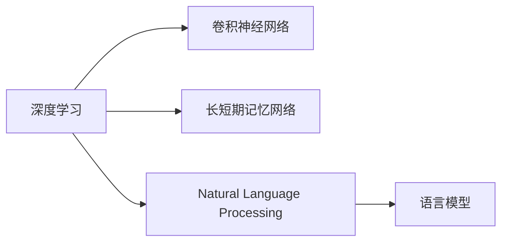
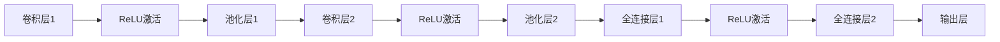

                 

# Andrej Karpathy谈AI发展现状:仍处于模仿阶段

## 1. 背景介绍

在人工智能(AI)迅猛发展的当下，深度学习(DL)成为了热门技术，尤其是在视觉、语音、自然语言处理(NLP)等领域取得了显著的进步。然而，AI技术的总体水平如何？是否已经达到自创新能力？这些问题一直备受关注。在这篇文章中，我们将通过深度学习领域的著名专家Andrej Karpathy的视角，深入探讨AI发展现状，探讨其在算法原理、实际操作、应用领域和未来发展趋势等方面的现状和前景。

## 2. 核心概念与联系

### 2.1 核心概念概述

- **深度学习(Deep Learning)**：一种通过构建深层神经网络来逼近复杂非线性函数的学习范式，通常应用于图像、语音、自然语言处理等任务。
- **卷积神经网络(CNN)**：一种特殊类型的深度神经网络，主要用于处理具有网格结构的数据，如图像和音频。
- **长短期记忆网络(LSTM)**：一种特殊的循环神经网络，适用于处理序列数据，如自然语言和时间序列数据。
- **自然语言处理(NLP)**：计算机科学和人工智能领域的一个分支，涉及计算机与人类语言之间的交互。
- **语言模型**：用于预测文本序列的概率模型，如循环神经网络语言模型(RNNLM)和Transformer模型。

这些概念之间的联系可以通过以下Mermaid流程图来展示：



## 3. 核心算法原理 & 具体操作步骤

### 3.1 算法原理概述

深度学习算法通过大量数据训练神经网络，使其能够自动提取特征，并在特定任务上表现出卓越的性能。以图像识别任务为例，CNN通过卷积操作提取图像的局部特征，再通过池化操作减少特征图的大小，并使用全连接层进行分类。对于序列数据，LSTM通过门控机制来处理时间序列的依赖关系。

在自然语言处理领域，Transformer模型因其自注意力机制而成为新的热点。Transformer模型能够高效地处理长距离依赖，适用于机器翻译、文本生成等任务。

### 3.2 算法步骤详解

深度学习算法的训练通常包含以下步骤：

1. **数据准备**：收集和预处理训练数据，确保数据具有代表性。
2. **模型选择**：根据任务选择合适的深度学习模型。
3. **模型初始化**：使用随机初始化方法对模型参数进行初始化。
4. **前向传播**：将输入数据输入模型，计算模型的输出。
5. **损失函数计算**：计算模型输出与真实标签之间的损失函数。
6. **反向传播**：计算损失函数对模型参数的梯度。
7. **参数更新**：使用梯度下降等优化算法更新模型参数。
8. **迭代训练**：重复执行前向传播、损失函数计算、反向传播和参数更新，直至模型收敛。

### 3.3 算法优缺点

深度学习算法的主要优点包括：
- 能够自动提取数据中的复杂特征。
- 在特定任务上表现出卓越的性能。
- 适用于处理高维、非线性数据。

缺点包括：
- 需要大量标注数据进行训练。
- 模型复杂度较高，计算成本高。
- 难以解释模型内部的决策过程。

### 3.4 算法应用领域

深度学习算法在图像识别、语音识别、自然语言处理、推荐系统、游戏AI等领域得到了广泛应用。例如，CNN在图像识别任务中表现优异；LSTM在时间序列预测和自然语言处理中表现突出；Transformer在机器翻译和文本生成中取得了重要进展。

## 4. 数学模型和公式 & 详细讲解 & 举例说明

### 4.1 数学模型构建

以卷积神经网络为例，其基本结构可以表示为：

$$
y = f(W*x + b)
$$

其中，$y$ 表示输出，$x$ 表示输入，$W$ 表示卷积核，$b$ 表示偏置项，$f$ 表示激活函数。

### 4.2 公式推导过程

对于图像分类任务，CNN的卷积操作可以表示为：

$$
y_{c,k} = \sum_{i,j} W_{c,k,i,j} * x_{i,j} + b_{c,k}
$$

其中，$y_{c,k}$ 表示第 $c$ 类在位置 $(k,k)$ 的输出，$W_{c,k,i,j}$ 表示第 $c$ 类的卷积核在位置 $(i,j)$ 的权重，$x_{i,j}$ 表示输入图像在位置 $(i,j)$ 的像素值，$b_{c,k}$ 表示第 $c$ 类的偏置项。

### 4.3 案例分析与讲解

以图像识别任务为例，CNN通过卷积层提取图像的局部特征，再通过池化层减少特征图的大小，最后使用全连接层进行分类。以LeNet-5为例，其结构如下：



其中，卷积层和池化层用于提取图像的局部特征，全连接层用于分类。

## 5. 项目实践：代码实例和详细解释说明

### 5.1 开发环境搭建

在项目开发前，我们需要安装Python、NumPy、TensorFlow等工具。以下是Python和TensorFlow的安装步骤：

1. 安装Python：
```bash
sudo apt-get install python3
```

2. 安装TensorFlow：
```bash
pip install tensorflow
```

3. 安装NumPy：
```bash
pip install numpy
```

### 5.2 源代码详细实现

以下是一个简单的卷积神经网络实现，用于图像分类任务：

```python
import tensorflow as tf
from tensorflow.keras import layers

# 定义模型结构
model = tf.keras.Sequential([
    layers.Conv2D(32, (3,3), activation='relu', input_shape=(28,28,1)),
    layers.MaxPooling2D((2,2)),
    layers.Conv2D(64, (3,3), activation='relu'),
    layers.MaxPooling2D((2,2)),
    layers.Flatten(),
    layers.Dense(10, activation='softmax')
])

# 编译模型
model.compile(optimizer='adam', loss='categorical_crossentropy', metrics=['accuracy'])

# 加载数据集
(x_train, y_train), (x_test, y_test) = tf.keras.datasets.mnist.load_data()

# 数据预处理
x_train = x_train.reshape(-1, 28, 28, 1) / 255.0
x_test = x_test.reshape(-1, 28, 28, 1) / 255.0

# 训练模型
model.fit(x_train, y_train, epochs=10, validation_data=(x_test, y_test))
```

### 5.3 代码解读与分析

上述代码中，我们使用了TensorFlow的Keras API来构建和训练卷积神经网络模型。首先定义了模型结构，包括卷积层、池化层和全连接层。然后编译模型，设置优化器、损失函数和评估指标。接着加载数据集并进行预处理，最后使用`fit`方法训练模型。

### 5.4 运行结果展示

训练完成后，我们可以使用`evaluate`方法评估模型性能：

```python
test_loss, test_acc = model.evaluate(x_test, y_test)
print('Test accuracy:', test_acc)
```

## 6. 实际应用场景

### 6.1 图像识别

卷积神经网络在图像识别任务中表现出色。例如，ImageNet大挑战赛中的Inception模型就使用了多层的卷积和池化操作，取得了显著的性能提升。

### 6.2 自然语言处理

Transformer模型在机器翻译、文本生成等任务中取得了突破性进展。例如，Google的BERT模型在语言理解任务中表现优异，被广泛应用于文本分类、问答系统等场景。

### 6.3 游戏AI

深度学习在电子游戏AI中得到了广泛应用。例如，AlphaGo就使用了深度神经网络进行策略选择，取得了围棋世界冠军。

## 7. 工具和资源推荐

### 7.1 学习资源推荐

- 《深度学习》书籍：Ian Goodfellow等著，介绍了深度学习的基本原理和算法。
- 《Python深度学习》书籍：Francois Chollet等著，介绍了TensorFlow等深度学习框架的使用。
- 《自然语言处理综述》课程：斯坦福大学的自然语言处理课程，涵盖自然语言处理的基本概念和算法。

### 7.2 开发工具推荐

- TensorFlow：由Google开发，支持深度学习模型的构建和训练。
- PyTorch：由Facebook开发，支持深度学习模型的构建和训练，易于使用。
- Keras：基于TensorFlow和Theano的高级深度学习API，易于上手。

### 7.3 相关论文推荐

- AlexNet：2012年ImageNet大挑战赛的冠军模型，引入了卷积层和池化层。
- ResNet：2015年ImageNet大挑战赛的冠军模型，使用了残差连接解决深度网络训练困难。
- BERT：2018年发布的语言模型，使用了Transformer架构，取得了语言理解任务的突破性进展。

## 8. 总结：未来发展趋势与挑战

### 8.1 未来发展趋势

深度学习技术将继续发展，模型复杂度将不断提升，计算效率也将进一步提高。以下是一些可能的未来趋势：

- 模型结构将更加复杂，卷积层和池化层将更深入。
- 新的算法将不断涌现，如对抗训练、自适应学习率等。
- 深度学习将与其他技术结合，如强化学习、因果推理等。

### 8.2 面临的挑战

尽管深度学习技术取得了显著进展，但仍然面临一些挑战：

- 计算资源消耗大，需要高性能硬件支持。
- 模型复杂度高，训练时间长。
- 难以解释模型内部的决策过程。

### 8.3 研究展望

未来，深度学习研究将更加注重模型解释性、可解释性和鲁棒性。以下是一些可能的研究方向：

- 提高模型的解释性和可解释性，使其更容易理解和调试。
- 提高模型的鲁棒性，使其在对抗样本和噪声数据下仍然表现良好。
- 探索新的算法和技术，如对抗训练、自适应学习率等。

## 9. 附录：常见问题与解答

**Q1：深度学习算法的训练过程是如何进行的？**

A: 深度学习算法的训练过程包括数据准备、模型选择、模型初始化、前向传播、损失函数计算、反向传播、参数更新和迭代训练等步骤。其中，前向传播和反向传播是算法的核心。

**Q2：卷积神经网络在图像识别中的应用如何？**

A: 卷积神经网络在图像识别任务中表现出色。通过卷积层和池化层提取图像的局部特征，再使用全连接层进行分类，卷积神经网络能够有效地识别图像中的物体和场景。

**Q3：Transformer模型在自然语言处理中的应用如何？**

A: Transformer模型在机器翻译、文本生成等任务中取得了突破性进展。通过自注意力机制，Transformer模型能够高效地处理长距离依赖，适用于自然语言处理领域。

**Q4：未来深度学习技术的发展方向是什么？**

A: 未来深度学习技术的发展方向包括模型结构更复杂、新的算法不断涌现、与其他技术的结合等。深度学习将继续拓展应用场景，提升计算效率，增强模型解释性。

**Q5：如何提高深度学习模型的解释性和可解释性？**

A: 提高深度学习模型的解释性和可解释性，可以通过使用可解释模型、可视化技术、调试工具等手段实现。例如，使用LIME、SHAP等可解释模型，或使用TensorBoard等可视化工具进行模型调试。

---

作者：禅与计算机程序设计艺术 / Zen and the Art of Computer Programming

