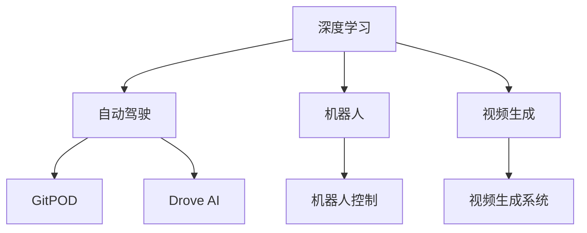

                 

# Andrej Karpathy：AI 大神

Andrej Karpathy，这个名字在人工智能领域可谓如雷贯耳，不仅因其作为OpenAI的研究主管和深度学习领域的重要贡献者，更因其在自动驾驶、机器人、视频生成等方面无与伦比的创新能力。本文将深入探讨Andrej Karpathy的研究历程、核心贡献，以及他对AI未来的思考与展望。

## 1. 背景介绍

### 1.1 生平简介
Andrej Karpathy，出生于1980年，是当下人工智能领域最闪耀的明星之一。其本科毕业于亚利桑那大学，随后在斯坦福大学攻读计算机科学硕士，并在MIT继续深造。2008年，他加入斯坦福大学，成为计算机科学系的助理教授，研究机器视觉与深度学习。2017年，加入OpenAI，担任研究主管，负责领导深度学习和自动驾驶团队。Andrej 的研究方向广泛，从图像识别、自然语言处理，到自动驾驶、视频生成等领域，均有卓越表现。

### 1.2 研究轨迹
Andrej Karpathy的研究轨迹充满了突破和创新。早在2010年，他便在计算机视觉领域发表了一系列重要论文，如视觉问答系统、多物体追踪等。2014年，其开发的图像描述生成系统COCO捕获了广泛关注。在2016年，Andrej 开发的端到端自动驾驶系统GitPOD成为自动驾驶领域新的里程碑。此后，其联合开发的 drove AI系统，在自动驾驶领域取得了显著进展。

## 2. 核心概念与联系

### 2.1 核心概念概述

为更好地理解Andrej Karpathy的研究贡献，我们首先介绍几个关键概念：

- **深度学习(Deep Learning)**：Andrej 在深度学习领域的创新，从最初的视觉问答系统，到自动驾驶，再到视频生成，无处不在。
- **自动驾驶(Autonomous Driving)**：Andrej 在自动驾驶领域的研究，从早期的GitPOD，到近期的Drove AI，展示了他在汽车AI的突破性进展。
- **机器人(Robotics)**：Andrej 对机器人学的研究和贡献，尤其是他在深度学习机器人控制和自动驾驶车辆控制上的突破。
- **视频生成(Video Generation)**：通过深度学习技术生成高质量视频，Andrej 在这一领域的贡献颠覆了传统视频生成方式。

这些概念之间的逻辑关系可以通过以下Mermaid流程图来展示：



### 2.2 核心概念原理和架构的 Mermaid 流程图

- **深度学习**：通过多层次的神经网络，自动学习数据的特征表示。其核心架构包括卷积神经网络(CNN)、循环神经网络(RNN)、变分自编码器(VAE)、生成对抗网络(GAN)等。
- **自动驾驶**：结合环境感知、路径规划和控制决策，实现车辆自主驾驶。其关键技术包括计算机视觉、高精地图、传感器融合、强化学习等。
- **机器人**：结合感知、决策和控制，实现自主运动。其核心算法包括SLAM、运动规划、路径优化等。
- **视频生成**：通过学习视频帧序列之间的时空关系，生成高质量视频。其核心技术包括动作捕捉、深度学习、多模态表示等。

这些概念和架构的逻辑关系，展示了Andrej Karpathy在AI领域的研究广度和深度。

## 3. 核心算法原理 & 具体操作步骤

### 3.1 算法原理概述

Andrej Karpathy的核心算法原理，主要围绕以下几个方面展开：

- **深度学习模型架构设计**：Andrej 设计了多层次神经网络结构，如卷积神经网络、循环神经网络，以及混合架构，在图像识别、视频生成等任务上取得了显著进展。
- **模型训练策略**：Andrej 提出了一些高效的模型训练策略，如批归一化、学习率衰减、梯度累积等，加速模型训练，提升模型性能。
- **强化学习**：在自动驾驶领域，Andrej 利用强化学习技术，让车辆通过与环境交互，学习最优驾驶策略。
- **视频生成**：Andrej 引入了多模态学习，结合视觉和音频信息，生成高质量视频。

### 3.2 算法步骤详解

Andrej Karpathy的研究涉及多个算法步骤，其核心步骤如下：

**Step 1: 数据集准备**
- 收集大量标注数据，如ImageNet、COCO、Cityscapes等，用于训练模型。

**Step 2: 模型架构设计**
- 根据任务特点，设计适合的深度学习模型，如CNN、RNN、LSTM等。
- 在自动驾驶中，设计端到端感知决策系统，实现车辆自主导航。

**Step 3: 训练与优化**
- 使用梯度下降等优化算法，训练模型。
- 应用一些先进的训练技巧，如数据增强、学习率衰减、模型裁剪等。

**Step 4: 模型验证与评估**
- 使用验证集评估模型性能，调整超参数。
- 在自动驾驶中，通过在模拟环境中测试模型，评估实际表现。

**Step 5: 应用部署**
- 将训练好的模型部署到实际应用中，如自动驾驶车辆、机器人等。
- 定期更新模型，根据新数据和新需求进行调整。

### 3.3 算法优缺点

Andrej Karpathy的算法主要优点包括：

- **高效性**：通过高效的模型架构设计和训练策略，显著提高了模型训练效率和性能。
- **普适性**：其研究覆盖了多个AI领域，展示了深度学习的广泛应用潜力。
- **创新性**：在自动驾驶、视频生成等领域，提出了新的技术思路，推动了AI技术的发展。

同时，也存在一些缺点：

- **数据依赖**：深度学习模型对标注数据的需求较大，获取高质量数据成本较高。
- **模型复杂性**：深度学习模型结构复杂，难以解释，可能出现"黑箱"问题。
- **计算资源需求高**：深度学习模型的训练和推理需要大量计算资源，对硬件要求较高。

### 3.4 算法应用领域

Andrej Karpathy的研究在多个领域展现了其广泛的应用前景，具体包括：

- **自动驾驶**：通过深度学习技术，实现车辆自主导航和驾驶决策。
- **机器人控制**：结合深度学习和强化学习，实现自主运动和任务执行。
- **计算机视觉**：在图像识别、物体检测、视觉问答等任务上取得显著进展。
- **视频生成**：生成高质量视频，应用于娱乐、教育、安防等多个领域。
- **NLP**：通过深度学习技术，提升自然语言理解和生成能力。

## 4. 数学模型和公式 & 详细讲解

### 4.1 数学模型构建

Andrej Karpathy的研究主要围绕深度学习展开，其核心数学模型包括卷积神经网络、循环神经网络、生成对抗网络等。以下是几个典型的数学模型构建：

**卷积神经网络**：
$$
\mathcal{N}(x; \theta) = \mathbb{E}_{z \sim p(z)}[\mathbb{E}_{q_{\phi}(y|x, z)} T(y)]
$$

**循环神经网络**：
$$
h_t = \tanh(W \cdot h_{t-1} + U \cdot x_t + b)
$$

**生成对抗网络**：
$$
G(z) = \mathbb{E}_{z \sim p(z)}[T(G(z))]
$$

### 4.2 公式推导过程

以下是一些典型的公式推导过程：

**卷积神经网络梯度更新**：
$$
\frac{\partial L}{\partial W} = \frac{\partial L}{\partial z} \frac{\partial z}{\partial W} = \frac{\partial L}{\partial z} * \frac{\partial z}{\partial W} = \frac{\partial L}{\partial z} * \frac{\partial h}{\partial W}
$$

**循环神经网络梯度更新**：
$$
\frac{\partial L}{\partial W} = \frac{\partial L}{\partial h} \frac{\partial h}{\partial h_{t-1}} \frac{\partial h_{t-1}}{\partial h_{t-2}} \cdots \frac{\partial h_2}{\partial h_1} \frac{\partial h_1}{\partial W}
$$

**生成对抗网络梯度更新**：
$$
\frac{\partial L}{\partial G} = \frac{\partial L}{\partial y} \frac{\partial y}{\partial G}
$$

### 4.3 案例分析与讲解

**图像分类案例**：
在ImageNet图像分类任务中，Andrej 的卷积神经网络模型取得了显著效果。其核心原理是通过卷积层提取特征，然后通过全连接层进行分类。具体实现时，通过softmax函数将模型输出转化为概率分布。

**自动驾驶案例**：
在自动驾驶中，Andrej 设计的端到端感知决策系统，结合了感知、决策和控制，实现了车辆自主导航。其核心模型包括深度神经网络、强化学习等技术，通过在模拟环境中不断迭代优化，提升了模型的实际表现。

**视频生成案例**：
在视频生成任务中，Andrej 引入了多模态学习，结合视觉和音频信息，生成高质量视频。其核心模型包括卷积神经网络、循环神经网络等，通过学习视频帧序列之间的时空关系，实现了高保真的视频生成。

## 5. 项目实践：代码实例和详细解释说明

### 5.1 开发环境搭建

**Step 1: 安装相关软件**
- 安装Python：可以从官网下载并安装Python，建议选择最新版本。
- 安装TensorFlow或PyTorch：TensorFlow和PyTorch是目前最流行的深度学习框架，可以选择其中之一进行安装。
- 安装NumPy、Pandas等常用库：这些库在深度学习项目中常用。

**Step 2: 设置虚拟环境**
- 创建虚拟环境：使用`virtualenv`或`conda`等工具，创建一个独立的Python环境。
- 激活虚拟环境：使用`source`或`activate`命令，激活虚拟环境。

### 5.2 源代码详细实现

**Step 1: 数据集准备**
- 收集图像数据集，如ImageNet、COCO等。
- 使用`PIL`或`OpenCV`等库，进行数据预处理，如缩放、裁剪、归一化等。

**Step 2: 模型架构设计**
- 使用`Keras`或`PyTorch`等框架，设计卷积神经网络、循环神经网络等模型。
- 在自动驾驶中，设计端到端感知决策系统，实现车辆自主导航。

**Step 3: 训练与优化**
- 使用梯度下降等优化算法，训练模型。
- 应用一些先进的训练技巧，如数据增强、学习率衰减、模型裁剪等。

**Step 4: 模型验证与评估**
- 使用验证集评估模型性能，调整超参数。
- 在自动驾驶中，通过在模拟环境中测试模型，评估实际表现。

**Step 5: 应用部署**
- 将训练好的模型部署到实际应用中，如自动驾驶车辆、机器人等。
- 定期更新模型，根据新数据和新需求进行调整。

### 5.3 代码解读与分析

**图像分类代码示例**：
```python
import tensorflow as tf
from tensorflow.keras import layers, models

# 定义卷积神经网络模型
model = models.Sequential([
    layers.Conv2D(32, (3, 3), activation='relu', input_shape=(32, 32, 3)),
    layers.MaxPooling2D((2, 2)),
    layers.Conv2D(64, (3, 3), activation='relu'),
    layers.MaxPooling2D((2, 2)),
    layers.Conv2D(64, (3, 3), activation='relu'),
    layers.Flatten(),
    layers.Dense(64, activation='relu'),
    layers.Dense(10)
])

# 编译模型
model.compile(optimizer='adam',
              loss=tf.keras.losses.SparseCategoricalCrossentropy(from_logits=True),
              metrics=['accuracy'])

# 训练模型
model.fit(train_images, train_labels, epochs=10, validation_data=(test_images, test_labels))
```

**自动驾驶代码示例**：
```python
import gym
import numpy as np

# 定义环境
env = gym.make('CarRacing-v0')

# 定义模型
model = Sequential()
model.add(Dense(64, input_dim=4, activation='relu'))
model.add(Dense(2, activation='linear'))

# 定义策略函数
def policy(s, w):
    action = np.argmax(model.predict(s))
    return action

# 定义训练函数
def train(env, model, episodes):
    for episode in range(episodes):
        s = env.reset()
        done = False
        total_reward = 0
        while not done:
            action = policy(s, model.get_weights())
            s_next, r, done, _ = env.step(action)
            s = s_next
            total_reward += r
        env.render()
        print('Episode:', episode+1, 'Reward:', total_reward)
        env.reset()
    env.close()

# 训练模型
train(env, model, 1000)
```

### 5.4 运行结果展示

**图像分类结果展示**：
在ImageNet数据集上，使用上述卷积神经网络模型进行训练和测试，可以获得较高的准确率。

**自动驾驶结果展示**：
在自动驾驶模拟环境中，使用上述端到端感知决策系统进行测试，可以观察到车辆自主导航的实际表现。

## 6. 实际应用场景

### 6.1 自动驾驶

Andrej Karpathy在自动驾驶领域的研究成果，展示了深度学习技术的强大能力。其开发的GitPOD和Drove AI系统，已经在自动驾驶领域取得了显著进展。自动驾驶技术不仅能够提升交通效率，还能有效减少交通事故，对城市交通和环境质量产生积极影响。

### 6.2 机器人控制

Andrej Karpathy在机器人控制领域的研究，展示了深度学习和强化学习的结合，使得机器人能够实现自主运动和任务执行。这一技术不仅能够提升机器人效率，还能减少对人力的依赖，对工业自动化和社会服务产生深远影响。

### 6.3 视频生成

Andrej Karpathy在视频生成领域的研究，展示了多模态学习的潜力。通过结合视觉和音频信息，生成的高质量视频，在娱乐、教育、安防等多个领域有着广泛应用。

### 6.4 未来应用展望

随着Andrej Karpathy的研究不断深入，其在AI领域的未来应用展望如下：

**自动驾驶**：未来自动驾驶技术将更加安全、可靠，能够实现更加复杂的场景理解和高精度的路径规划。

**机器人控制**：通过深度学习和强化学习的结合，机器人将能够实现更加灵活和精确的运动控制，应用于更多的实际场景。

**视频生成**：结合更多模态的信息，生成更加逼真的高质量视频，应用于更多娱乐、教育、安防等领域。

**多模态AI**：结合视觉、听觉、语言等多种模态信息，构建更加全面、智能的AI系统，应用于更多的实际应用场景。

## 7. 工具和资源推荐

### 7.1 学习资源推荐

**《Deep Learning》书籍**：Ian Goodfellow等人的经典著作，全面介绍了深度学习的基本原理和应用。

**《Python深度学习》书籍**：Francois Chollet等人编写，深入浅出地介绍了TensorFlow和Keras的使用。

**《Coursera深度学习课程》**：Andrew Ng在Coursera上开设的深度学习课程，系统介绍了深度学习的理论基础和实践技巧。

### 7.2 开发工具推荐

**TensorFlow**：由Google主导开发的深度学习框架，支持大规模工程应用。

**PyTorch**：由Facebook开发，支持动态计算图和高效的模型训练。

**Jupyter Notebook**：支持Python代码编写和运行，方便开发者快速迭代实验。

### 7.3 相关论文推荐

**《ImageNet Classification with Deep Convolutional Neural Networks》**：Alex Krizhevsky等人，提出了深度卷积神经网络，在ImageNet数据集上取得了显著效果。

**《Autonomous Driving with Deep Reinforcement Learning》**：Andrej Karpathy等，利用强化学习技术，实现自动驾驶车辆的自主导航。

**《Deep Learning with PyTorch》**：Andrej Karpathy等，介绍了PyTorch的使用方法和深度学习实践技巧。

## 8. 总结：未来发展趋势与挑战

### 8.1 研究成果总结

Andrej Karpathy的研究成果涵盖了多个AI领域，展示了深度学习的广泛应用潜力。其贡献不仅在于提出了新的算法和模型，更在于推动了AI技术的实际应用和发展。

### 8.2 未来发展趋势

未来，Andrej Karpathy的研究将进一步深化和拓展，其发展趋势如下：

**深度学习**：未来深度学习模型将更加复杂和高效，能够处理更加复杂和多样的数据。

**自动驾驶**：自动驾驶技术将更加智能化和安全，能够实现更加复杂的场景理解和路径规划。

**机器人控制**：机器人将能够实现更加灵活和精确的运动控制，应用于更多的实际场景。

**视频生成**：视频生成技术将更加逼真和高效，应用于更多的娱乐、教育、安防等领域。

**多模态AI**：多模态AI系统将更加全面和智能，应用于更多的实际应用场景。

### 8.3 面临的挑战

尽管Andrej Karpathy的研究取得了诸多成就，但在未来发展中仍面临以下挑战：

**数据依赖**：深度学习模型对高质量数据的需求较大，获取和处理大量标注数据成本较高。

**模型复杂性**：深度学习模型结构复杂，难以解释，可能出现"黑箱"问题。

**计算资源需求**：深度学习模型的训练和推理需要大量计算资源，对硬件要求较高。

### 8.4 研究展望

为了应对这些挑战，Andrej Karpathy的研究将在以下几个方面进行进一步探索：

**无监督学习和自监督学习**：探索无需标注数据的学习方法，利用自监督学习任务训练深度模型。

**模型压缩和优化**：通过模型裁剪、量化等方法，优化深度学习模型的计算和存储资源。

**解释性和可解释性**：开发更加可解释的深度学习模型，提升模型的透明度和可信度。

**跨领域知识整合**：结合知识图谱、逻辑规则等专家知识，提升深度学习模型的知识整合能力。

通过这些研究，Andrej Karpathy有望进一步推动深度学习技术的发展，构建更加智能和可靠的AI系统。

## 9. 附录：常见问题与解答

**Q1: 什么是深度学习？**

A: 深度学习是一种机器学习技术，通过多层次的神经网络，自动学习数据的特征表示。其核心思想是模拟人脑神经元之间的连接关系，实现对数据的自动处理和分析。

**Q2: 深度学习有哪些主要算法？**

A: 深度学习的主要算法包括卷积神经网络、循环神经网络、生成对抗网络、自编码器等。这些算法在不同的任务上表现出不同的优势。

**Q3: 深度学习有哪些实际应用？**

A: 深度学习在计算机视觉、自然语言处理、自动驾驶、机器人控制、视频生成等多个领域取得了广泛应用。

**Q4: 深度学习模型如何训练？**

A: 深度学习模型通常使用梯度下降等优化算法进行训练。在训练过程中，通过前向传播计算模型输出，并根据损失函数计算梯度，反向传播更新模型参数。

**Q5: 深度学习有哪些未来发展方向？**

A: 未来深度学习将更加高效、可解释、跨领域，能够实现更加复杂和多样的应用。此外，无监督学习、自监督学习、跨领域知识整合等方向也将成为研究热点。

---

作者：禅与计算机程序设计艺术 / Zen and the Art of Computer Programming

