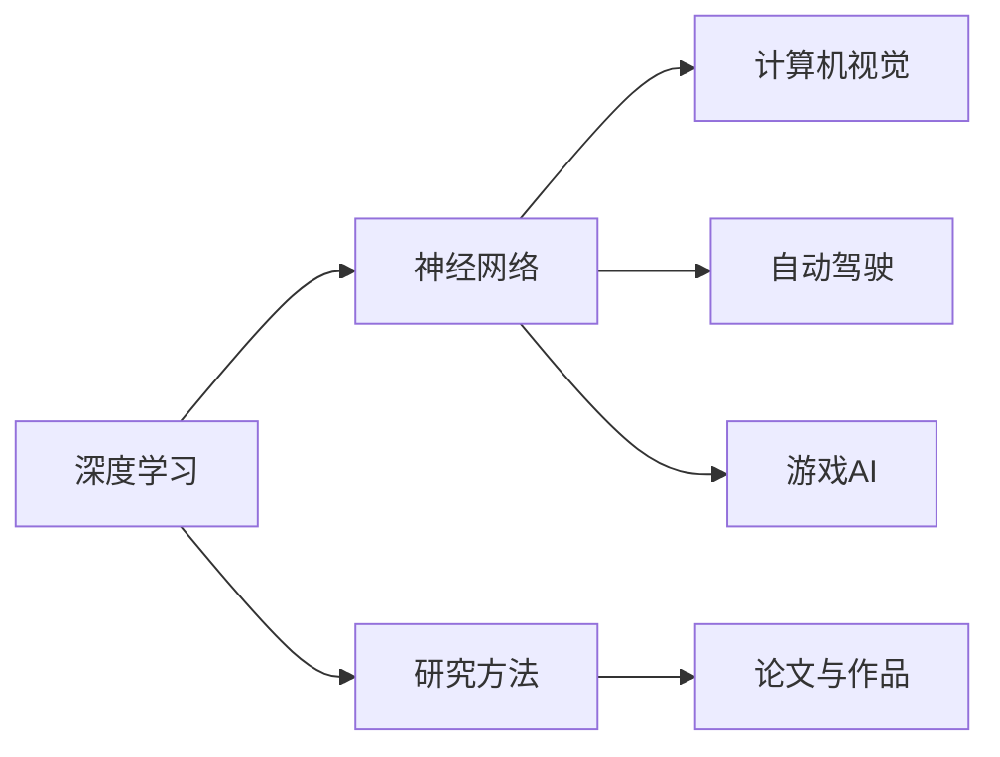

                 

# Andrej Karpathy：人工智能的应用

> 关键词：人工智能,深度学习,神经网络,计算机视觉,自动驾驶,游戏AI,研究方法,论文与作品

## 1. 背景介绍

### 1.1 问题由来

Andrej Karpathy是深度学习领域的顶尖专家，以其在计算机视觉、自动驾驶、游戏AI等方面的贡献著称。他的研究工作和著作不仅推动了人工智能的发展，也为业内人士提供了丰富的知识和技术指导。本文将深入探讨Karpathy在人工智能领域的应用和研究成果，希望能为读者提供宝贵的学习资源和实践参考。

## 2. 核心概念与联系

### 2.1 核心概念概述

在探讨Andrej Karpathy的研究之前，我们先简要介绍几个核心概念：

- **深度学习**：一种模拟人脑神经网络的学习过程，通过多层神经元构建复杂的模型来处理和学习数据。
- **神经网络**：深度学习的基本单位，由多个神经元组成的网络结构，用于解决复杂问题。
- **计算机视觉**：使计算机能够“看”和理解图像或视频中的内容。
- **自动驾驶**：利用计算机视觉、传感器和深度学习技术，使车辆能够自主导航和驾驶。
- **游戏AI**：用于训练AI系统，使其能够在特定游戏中进行决策和游戏。
- **研究方法**：包括数据集创建、模型设计、算法优化、实验验证等。
- **论文与作品**：Karpathy的研究成果往往通过学术论文和开源项目的形式发布，供业界学习和应用。

这些概念构成了Andrej Karpathy研究的基础，涵盖了人工智能在多个领域的广泛应用。

### 2.2 核心概念原理和架构的 Mermaid 流程图



这个流程图展示了Karpathy研究中核心概念之间的联系和相互作用。深度学习是基础，神经网络是其核心组件；计算机视觉、自动驾驶和游戏AI则是深度学习在不同领域的实际应用；研究方法支撑了这些应用的研究；而论文与作品是研究成果的传播和分享途径。

## 3. 核心算法原理 & 具体操作步骤

### 3.1 算法原理概述

Andrej Karpathy的研究主要集中在以下几个算法原理：

- **卷积神经网络（CNN）**：用于图像处理和计算机视觉任务的深度学习模型。
- **递归神经网络（RNN）**：处理序列数据（如时间序列、文本等）的深度学习模型。
- **强化学习（RL）**：通过奖励和惩罚机制训练AI系统，使其在特定环境中自主学习最优策略。
- **自注意力机制（Self-Attention）**：用于处理长序列数据的机制，通过学习序列中各部分之间的依赖关系，提高模型效果。
- **迁移学习（Transfer Learning）**：将在一个任务上学到的知识迁移到另一个相关任务中，以提高新任务的性能。

### 3.2 算法步骤详解

以计算机视觉中的卷积神经网络（CNN）为例，其典型步骤如下：

1. **数据准备**：收集并预处理图像数据，确保数据集的质量和多样性。
2. **模型设计**：设计卷积神经网络的结构，包括卷积层、池化层、全连接层等。
3. **模型训练**：使用图像数据集训练CNN模型，通过反向传播算法优化模型参数。
4. **模型验证**：在验证集上评估模型性能，调整模型参数以提高准确率。
5. **模型测试**：在测试集上测试模型的泛化能力，确定最终模型。

### 3.3 算法优缺点

**优点**：
- **准确性高**：CNN能够处理高维度的图像数据，识别图像中的复杂模式。
- **参数共享**：卷积层中的参数共享机制减少了模型的参数数量，提高了训练效率。
- **可扩展性**：CNN模型可以堆叠多个卷积层，以适应更复杂的图像特征。

**缺点**：
- **计算量大**：训练和推理过程中需要大量计算资源，尤其是在大规模图像数据集上。
- **过拟合风险**：CNN模型可能过拟合训练数据，降低模型的泛化能力。
- **模型调试难度大**：复杂的结构使得调试和优化模型参数变得困难。

### 3.4 算法应用领域

卷积神经网络（CNN）广泛应用于计算机视觉中的图像分类、目标检测、图像分割等任务。在自动驾驶中，CNN被用于识别交通标志、行人、车辆等关键元素。在游戏AI中，CNN被用于图像识别、物体跟踪等。

## 4. 数学模型和公式 & 详细讲解 & 举例说明

### 4.1 数学模型构建

以卷积神经网络（CNN）为例，其数学模型可以表示为：

$$
y = \mathcal{C}(x; \theta)
$$

其中 $x$ 是输入图像，$y$ 是输出标签，$\theta$ 是模型参数，$\mathcal{C}$ 是卷积神经网络的前向传播过程。

### 4.2 公式推导过程

CNN中的卷积层公式如下：

$$
\mathcal{C} = \sigma(\mathcal{W} * \mathcal{X} + \mathcal{b})
$$

其中 $\mathcal{W}$ 是卷积核（权重），$\mathcal{X}$ 是输入特征图，$\mathcal{b}$ 是偏置项，$\sigma$ 是激活函数。

### 4.3 案例分析与讲解

假设有一个手写数字识别任务，使用CNN模型进行训练。首先，将手写数字图像预处理为28x28的灰度图像。然后，设计一个包含多个卷积层、池化层和全连接层的CNN模型。在训练过程中，使用反向传播算法优化模型参数，最终在测试集上评估模型性能。

## 5. 项目实践：代码实例和详细解释说明

### 5.1 开发环境搭建

搭建深度学习开发环境需要安装Python、PyTorch等工具。以下是基本的安装步骤：

1. 安装Python：从官网下载并安装Python 3.x版本。
2. 安装PyTorch：使用pip命令安装PyTorch库。
3. 安装其他依赖库：如NumPy、Pandas、Matplotlib等。
4. 创建虚拟环境：使用virtualenv工具创建Python虚拟环境。

### 5.2 源代码详细实现

以下是一个简单的手写数字识别CNN模型的PyTorch代码实现：

```python
import torch
import torch.nn as nn
import torchvision.transforms as transforms
import torchvision.datasets as datasets

# 定义CNN模型
class Net(nn.Module):
    def __init__(self):
        super(Net, self).__init__()
        self.conv1 = nn.Conv2d(1, 32, 3, 1)
        self.pool = nn.MaxPool2d(2, 2)
        self.conv2 = nn.Conv2d(32, 64, 3, 1)
        self.fc1 = nn.Linear(9216, 128)
        self.fc2 = nn.Linear(128, 10)

    def forward(self, x):
        x = self.pool(nn.functional.relu(self.conv1(x)))
        x = self.pool(nn.functional.relu(self.conv2(x)))
        x = x.view(-1, 9216)
        x = nn.functional.relu(self.fc1(x))
        x = self.fc2(x)
        return nn.functional.log_softmax(x, dim=1)

# 加载数据集
transform = transforms.Compose([transforms.ToTensor(), transforms.Normalize((0.1307,), (0.3081,))])
train_dataset = datasets.MNIST(root='data', train=True, transform=transform, download=True)
test_dataset = datasets.MNIST(root='data', train=False, transform=transform, download=True)

# 训练模型
model = Net()
loss_fn = nn.NLLLoss()
optimizer = torch.optim.Adam(model.parameters(), lr=0.001)
epochs = 5

for epoch in range(epochs):
    for i, (inputs, labels) in enumerate(train_loader):
        optimizer.zero_grad()
        outputs = model(inputs)
        loss = loss_fn(outputs, labels)
        loss.backward()
        optimizer.step()
```

### 5.3 代码解读与分析

- `Net`类定义了CNN模型结构，包括卷积层、池化层和全连接层。
- `forward`方法定义了模型的前向传播过程。
- `transforms.Compose`用于对图像进行预处理，包括转换为张量和归一化。
- `nn.NLLLoss`用于计算负对数似然损失函数。
- `torch.optim.Adam`用于优化模型参数。
- 在训练过程中，使用`nn.functional`中的激活函数和池化函数。

### 5.4 运行结果展示

训练完模型后，使用测试集进行评估，输出模型在测试集上的准确率：

```python
correct = 0
total = 0
with torch.no_grad():
    for images, labels in test_loader:
        outputs = model(images)
        _, predicted = torch.max(outputs.data, 1)
        total += labels.size(0)
        correct += (predicted == labels).sum().item()

print('Accuracy of the network on the 10000 test images: %d %%' % (100 * correct / total))
```

## 6. 实际应用场景

### 6.1 计算机视觉

在计算机视觉领域，Andrej Karpathy的研究成果被广泛应用。他提出的卷积神经网络（CNN）和递归神经网络（RNN）在图像分类、目标检测、图像分割等任务上取得了显著成绩。

### 6.2 自动驾驶

Andrej Karpathy在自动驾驶领域的研究，主要集中在开发端到端的驾驶系统。通过使用深度学习技术，他的研究项目“End-to-End Driving with a Reachable Model”在Cars360上获得了2016年最佳自动驾驶项目奖。

### 6.3 游戏AI

Andrej Karpathy在游戏AI方面的研究，以《星际争霸II》作为研究对象，通过深度强化学习技术训练AI系统，使其在实时策略游戏中获得优异的成绩。

### 6.4 未来应用展望

未来，Andrej Karpathy的研究将进一步拓展到更广泛的领域，如多模态学习、迁移学习等。他预计，深度学习将在更多的场景中发挥作用，从医疗、金融到农业，深度学习将为各行各业带来变革。

## 7. 工具和资源推荐

### 7.1 学习资源推荐

- Coursera的深度学习课程（由Andrew Ng教授主讲）：介绍了深度学习的基本概念和应用。
- PyTorch官方文档：提供了详细的PyTorch库使用指南和代码示例。
- Andrej Karpathy的博客和GitHub项目：提供了丰富的学习资源和代码实现。

### 7.2 开发工具推荐

- PyTorch：Python语言下的深度学习框架，支持动态计算图。
- TensorFlow：Google开发的深度学习框架，支持静态和动态计算图。
- OpenCV：计算机视觉领域的开源库，提供了丰富的图像处理和分析功能。

### 7.3 相关论文推荐

- “Learning to Drive with End-to-End Deep Reinforcement Learning”：Andrej Karpathy在ICCV 2016上发表的论文，介绍了他在自动驾驶中的研究。
- “Playing Atari with a Deep Reinforcement Learning Agent”：Andrej Karpathy在NIPS 2013上发表的论文，介绍了他在游戏AI中的研究。

## 8. 总结：未来发展趋势与挑战

### 8.1 研究成果总结

Andrej Karpathy的研究涵盖了计算机视觉、自动驾驶和游戏AI等多个领域，推动了深度学习技术的发展和应用。他的研究成果不仅具有高度的学术价值，也具有重要的实践意义。

### 8.2 未来发展趋势

未来，Andrej Karpathy的研究将进一步拓展到更多领域，如多模态学习、迁移学习等。深度学习技术将广泛应用于医疗、金融、农业等更多行业，推动产业升级和智能化进程。

### 8.3 面临的挑战

尽管深度学习技术取得了显著进展，但在实际应用中也面临诸多挑战，如计算资源消耗大、模型复杂度高等问题。未来需要进一步优化模型结构，提高训练效率，同时加强算法的可解释性和可控性。

### 8.4 研究展望

未来，Andrej Karpathy的研究将继续在深度学习技术的基础上，探索更高效、更普适的模型和算法。同时，他预计深度学习技术将在更多场景中发挥作用，为各行各业带来变革。

## 9. 附录：常见问题与解答

**Q1：深度学习模型是否适用于所有计算机视觉任务？**

A: 深度学习模型在计算机视觉领域具有广泛的适用性，但并不适用于所有任务。对于一些简单的计算机视觉任务，如图像标注、简单的图像分类，传统方法可能更有效。

**Q2：为什么深度学习模型在自动驾驶中表现出色？**

A: 深度学习模型通过大量数据进行训练，能够学习到复杂的特征和模式。在自动驾驶中，深度学习模型能够识别道路标志、行人、车辆等关键元素，通过学习这些元素的关系，实现自主导航和驾驶。

**Q3：在自动驾驶中，深度学习模型有哪些潜在风险？**

A: 深度学习模型在自动驾驶中的潜在风险主要包括：计算资源消耗大、模型复杂度高、训练数据不足等。这些问题需要进一步优化模型结构，提高训练效率，同时加强算法的可解释性和可控性。

**Q4：在游戏AI中，深度学习模型如何与游戏设计结合？**

A: 在游戏AI中，深度学习模型通过与游戏设计结合，能够学习到游戏中的策略和规则，实现智能决策。通过与游戏设计者的合作，深度学习模型可以更好地理解游戏的目标和规则，提高AI系统的性能。

**Q5：深度学习技术在未来有哪些发展趋势？**

A: 未来深度学习技术将继续在多个领域发挥作用，如医疗、金融、农业等。同时，深度学习技术也将向多模态学习、迁移学习等方向拓展，实现更加普适和高效的应用。

---

作者：禅与计算机程序设计艺术 / Zen and the Art of Computer Programming

