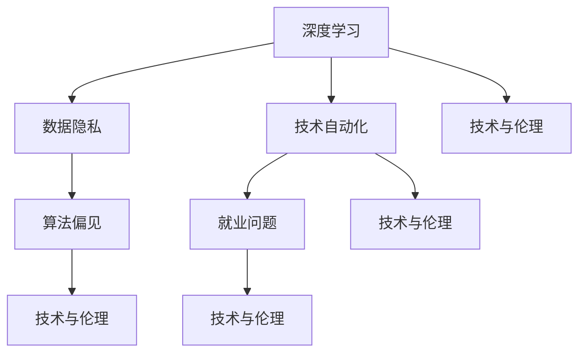

                 

# Andrej Karpathy：人工智能的未来发展挑战

> 关键词：人工智能，未来发展，深度学习，自动化，伦理，安全

## 1. 背景介绍

### 1.1 问题由来
人工智能（AI）自20世纪60年代以来，已经经历了几十年的发展和突破，但随着技术的深入发展，未来面临诸多新的挑战和问题。深度学习作为AI领域的重要分支，推动了图像识别、自然语言处理、语音识别等领域的飞速发展，但也带来了诸如数据隐私、算法偏见、技术自动化等新的问题。本文旨在分析Andrej Karpathy在人工智能领域的深度学习研究中提出的未来挑战，以期为AI研究者和开发者提供有价值的参考。

### 1.2 问题核心关键点
Andrej Karpathy在深度学习领域有着卓越的研究成果，并多次在AI领域的关键会议上发言。他的研究主要关注于深度学习的理论、实践与应用，提出了许多具有前瞻性的观点和见解。他的研究挑战主要包括以下几个方面：

- 数据隐私与安全：如何在保护用户隐私的同时，保证深度学习模型的准确性和安全性。
- 算法偏见与公平性：如何避免和纠正深度学习模型中的偏见，提升模型的公平性和公正性。
- 技术自动化与就业问题：AI技术自动化是否会导致广泛失业，如何平衡技术发展与就业关系。
- 技术与伦理：如何通过AI技术解决实际问题，同时保证伦理道德约束，避免技术滥用。
- 技术效率与资源利用：如何提高深度学习模型的效率，合理利用计算资源，避免资源浪费。

## 2. 核心概念与联系

### 2.1 核心概念概述

为了更好地理解Andrej Karpathy提出的AI发展挑战，我们需要先介绍几个核心概念：

- 深度学习（Deep Learning）：一种基于人工神经网络的机器学习技术，通过多层次的非线性映射，实现复杂数据的自动特征提取和表示。
- 数据隐私（Data Privacy）：保护用户个人信息，防止数据被未经授权的访问和使用。
- 算法偏见（Algorithm Bias）：指AI模型由于训练数据的偏差或不公平性，导致模型预测结果的不公平和歧视。
- 技术自动化（Technical Automation）：指AI技术在自动完成特定任务过程中，减少人力参与，提高效率。
- 就业问题（Job Displacement）：指由于技术自动化导致的大量职业岗位被替代，引起失业和经济问题。
- 技术与伦理（Technology and Ethics）：指在应用AI技术时，如何平衡技术进步与道德规范。

这些概念之间的逻辑关系可以通过以下Mermaid流程图来展示：



这个流程图展示了深度学习在AI技术中的应用，以及与数据隐私、算法偏见、技术自动化、就业问题和伦理道德之间的相互影响。

## 3. 核心算法原理 & 具体操作步骤
### 3.1 算法原理概述

Andrej Karpathy提出的未来挑战，涉及深度学习模型的算法原理和实际操作。以下是对这些挑战的详细解释：

#### 3.1.1 数据隐私与安全

深度学习模型通常需要大量的标注数据进行训练。这些数据可能包含用户的敏感信息，如个人身份、地理位置等。因此，如何在保护用户隐私的同时，保证模型的训练效果，是深度学习面临的重要挑战之一。

一般做法包括：

- 数据匿名化：对用户数据进行去标识化处理，以防止个人信息泄露。
- 联邦学习：多个设备或机构在本地训练模型，并将模型参数进行聚合，避免数据集中存储。
- 差分隐私：通过添加噪声，使得模型训练时无法反推用户隐私信息。

#### 3.1.2 算法偏见与公平性

深度学习模型的训练数据可能存在偏见，导致模型预测结果的偏差。例如，模型可能因为训练数据中男性比例远高于女性，而在预测性别时偏向男性。因此，如何避免和纠正模型中的偏见，提升模型的公平性，是深度学习面临的另一个重要挑战。

一般做法包括：

- 数据预处理：对训练数据进行去偏见处理，确保数据集的多样性和公平性。
- 偏见检测与修复：使用技术手段检测模型中的偏见，并进行修复。
- 公平性评估：在模型训练过程中，定期评估模型预测的公平性，及时调整。

#### 3.1.3 技术自动化与就业问题

随着深度学习技术的发展，自动化和智能化水平不断提高，一些传统职业岗位可能被机器所取代，引起就业问题。例如，自动驾驶技术可能导致驾驶员岗位的消失，自动化客服可能导致客户服务岗位的减少。

一般做法包括：

- 职业培训：对被替代岗位的工作人员进行技能培训，使其适应新的岗位需求。
- 再就业机制：政府和企业应提供相应的政策和支持，帮助失业人员再就业。
- 社会福利：建立完善的社会福利体系，减轻就业问题带来的社会影响。

#### 3.1.4 技术与伦理

AI技术在应用过程中，需要考虑伦理道德问题，如隐私保护、公平性、安全性等。如何在使用AI技术的同时，保证伦理道德约束，避免技术滥用，是深度学习面临的重要挑战。

一般做法包括：

- 伦理审查：在开发和应用AI技术前，进行伦理审查和评估。
- 道德指南：制定和遵守AI技术的道德指南，确保技术应用的正当性和合法性。
- 社会监督：建立社会监督机制，防止技术滥用和不当行为。

### 3.2 算法步骤详解

#### 3.2.1 数据隐私

1. 数据收集与预处理
    - 收集用户数据，并进行去标识化处理。
    - 对数据进行匿名化和去偏见处理。

2. 模型训练
    - 使用差分隐私技术，在模型训练过程中添加噪声。
    - 采用联邦学习，在多个设备或机构上本地训练模型，避免数据集中存储。

3. 模型评估与部署
    - 定期评估模型的隐私保护效果，确保用户隐私安全。
    - 在模型部署前，进行隐私保护和安全测试。

#### 3.2.2 算法偏见

1. 数据收集与预处理
    - 收集多样化和无偏见的训练数据。
    - 对数据进行去偏见处理，确保数据集的多样性和公平性。

2. 模型训练
    - 使用公平性评估工具，检测模型中的偏见。
    - 对模型进行去偏见训练，减少模型中的偏见。

3. 模型评估与部署
    - 定期评估模型的公平性，确保模型预测结果的公平性。
    - 在模型部署前，进行公平性测试，确保模型应用的正当性。

#### 3.2.3 技术自动化

1. 职业培训
    - 对被替代岗位的工作人员进行技能培训，使其适应新的岗位需求。
    - 提供相关的职业指导和培训资源。

2. 再就业机制
    - 政府和企业应提供相应的政策和支持，帮助失业人员再就业。
    - 建立职业转换和再就业支持体系。

3. 社会福利
    - 建立完善的社会福利体系，减轻就业问题带来的社会影响。
    - 提供失业保险和就业援助，保障失业人员的基本生活。

#### 3.2.4 技术与伦理

1. 伦理审查
    - 在开发和应用AI技术前，进行伦理审查和评估。
    - 建立伦理审查委员会，对AI技术进行伦理审查。

2. 道德指南
    - 制定和遵守AI技术的道德指南，确保技术应用的正当性和合法性。
    - 建立道德指南库，提供AI技术应用的道德参考。

3. 社会监督
    - 建立社会监督机制，防止技术滥用和不当行为。
    - 提供公众监督渠道，鼓励社会对AI技术应用的监督。

### 3.3 算法优缺点

#### 3.3.1 数据隐私

- **优点**：保护用户隐私，防止数据泄露，确保数据安全。
- **缺点**：增加模型训练的复杂度，可能导致模型性能下降。

#### 3.3.2 算法偏见

- **优点**：提升模型的公平性和公正性，避免模型预测的偏见。
- **缺点**：增加模型训练的复杂度，可能导致模型性能下降。

#### 3.3.3 技术自动化

- **优点**：提高工作效率，减少人工干预，降低成本。
- **缺点**：可能导致部分职业岗位被替代，引发就业问题。

#### 3.3.4 技术与伦理

- **优点**：确保技术应用的正当性和合法性，避免技术滥用。
- **缺点**：增加模型训练和应用的复杂度，可能导致模型性能下降。

### 3.4 算法应用领域

Andrej Karpathy提出的挑战，不仅限于理论研究，还涉及实际应用领域，包括医疗、金融、交通等。以下是这些领域的应用：

#### 3.4.1 医疗

1. 数据隐私：医疗数据敏感，保护病人隐私，防止数据泄露。
2. 算法偏见：避免医疗模型对特定群体的偏见，确保医疗诊断的公平性。
3. 技术与伦理：确保医疗技术的合法性和道德性，避免滥用。

#### 3.4.2 金融

1. 数据隐私：金融数据敏感，保护客户隐私，防止数据泄露。
2. 算法偏见：避免金融模型对特定群体的偏见，确保金融决策的公平性。
3. 技术与伦理：确保金融技术的合法性和道德性，避免滥用。

#### 3.4.3 交通

1. 数据隐私：交通数据敏感，保护车辆隐私，防止数据泄露。
2. 算法偏见：避免自动驾驶模型对特定群体的偏见，确保行车安全。
3. 技术与伦理：确保自动驾驶技术的合法性和道德性，避免滥用。

## 4. 数学模型和公式 & 详细讲解  
### 4.1 数学模型构建

Andrej Karpathy的研究挑战涉及多个数学模型，以下是对这些模型的详细构建：

#### 4.1.1 数据隐私

- 差分隐私模型：在模型训练过程中添加噪声，确保用户隐私安全。
    $$
    \mathcal{L}_{\text{dp}}(\epsilon) = \sum_{i=1}^{N} P(x_i | \epsilon)
    $$
    其中，$\epsilon$为噪声参数，$P(x_i | \epsilon)$为加入噪声后的概率分布。

#### 4.1.2 算法偏见

- 公平性评估模型：使用统计量评估模型的公平性。
    $$
    F_1 = \frac{2 \times \text{Precision} \times \text{Recall}}{\text{Precision} + \text{Recall}}
    $$
    其中，Precision和Recall为模型预测的精度和召回率。

#### 4.1.3 技术自动化

- 职业培训模型：对工作人员进行技能培训，适应新岗位需求。
    $$
    C = k \times \text{Time}_{\text{training}} \times \text{Efficiency}_{\text{new}} - k \times \text{Time}_{\text{training}} \times \text{Efficiency}_{\text{old}}
    $$
    其中，$k$为培训系数，$\text{Time}_{\text{training}}$为培训时间，$\text{Efficiency}_{\text{new}}$和$\text{Efficiency}_{\text{old}}$为新岗位和老岗位的效率。

#### 4.1.4 技术与伦理

- 伦理审查模型：在AI技术应用前进行伦理审查。
    $$
    E = \sum_{i=1}^{N} E_i
    $$
    其中，$E_i$为第$i$个伦理评估指标的值。

### 4.2 公式推导过程

#### 4.2.1 数据隐私

- 差分隐私模型：在模型训练过程中添加噪声，确保用户隐私安全。
    - 加入噪声后的概率分布：
        $$
        P(x_i | \epsilon) = \frac{\exp(-\frac{\epsilon \cdot \|x_i\|}{2\delta^2})}{Z}
        $$
        其中，$\delta$为噪声方差，$Z$为归一化常数。

#### 4.2.2 算法偏见

- 公平性评估模型：使用统计量评估模型的公平性。
    - 模型预测的精度和召回率：
        $$
        Precision = \frac{\text{TP}}{\text{TP} + \text{FP}}
        $$
        $$
        Recall = \frac{\text{TP}}{\text{TP} + \text{FN}}
        $$
        其中，TP、FP和FN分别为真阳性、假阳性和假阴性。

#### 4.2.3 技术自动化

- 职业培训模型：对工作人员进行技能培训，适应新岗位需求。
    - 培训后效率提升：
        $$
        \text{Efficiency}_{\text{new}} = \text{Efficiency}_{\text{old}} + k \times (\text{Time}_{\text{training}} \times \text{Efficiency}_{\text{new}} - \text{Time}_{\text{training}} \times \text{Efficiency}_{\text{old}})
        $$

#### 4.2.4 技术与伦理

- 伦理审查模型：在AI技术应用前进行伦理审查。
    - 伦理评估指标的计算：
        $$
        E_i = \begin{cases}
            1 & \text{满足伦理要求} \\
            0 & \text{不满足伦理要求}
        \end{cases}
        $$

### 4.3 案例分析与讲解

#### 4.3.1 数据隐私

- 案例：医疗数据隐私保护
    - 数据收集与预处理：收集医疗数据，并进行去标识化处理，确保用户隐私安全。
    - 模型训练：使用差分隐私技术，在模型训练过程中添加噪声，确保用户隐私安全。
    - 模型评估与部署：定期评估模型的隐私保护效果，确保用户隐私安全。

#### 4.3.2 算法偏见

- 案例：医疗模型偏见检测与修复
    - 数据收集与预处理：收集多样化和无偏见的训练数据，确保数据集的多样性和公平性。
    - 模型训练：使用公平性评估工具，检测模型中的偏见，并进行修复。
    - 模型评估与部署：定期评估模型的公平性，确保模型预测结果的公平性。

#### 4.3.3 技术自动化

- 案例：自动驾驶技术对就业的影响
    - 职业培训：对驾驶员进行技能培训，使其适应自动驾驶技术。
    - 再就业机制：政府和企业应提供相应的政策和支持，帮助失业人员再就业。
    - 社会福利：建立完善的社会福利体系，减轻就业问题带来的社会影响。

#### 4.3.4 技术与伦理

- 案例：AI技术在医疗中的应用
    - 伦理审查：在医疗AI技术应用前，进行伦理审查和评估，确保技术应用的正当性和合法性。
    - 道德指南：制定和遵守医疗AI技术的道德指南，确保技术应用的正当性和合法性。
    - 社会监督：建立社会监督机制，防止技术滥用和不当行为。

## 5. 项目实践：代码实例和详细解释说明
### 5.1 开发环境搭建

在进行AI研究时，开发环境的选择非常重要。以下是使用Python和TensorFlow搭建AI开发环境的流程：

1. 安装Anaconda：从官网下载并安装Anaconda，用于创建独立的Python环境。
    ```bash
    conda create -n pytorch-env python=3.8 
    conda activate pytorch-env
    ```

2. 安装TensorFlow：根据CUDA版本，从官网获取对应的安装命令。例如：
    ```bash
    conda install tensorflow -c tf -c conda-forge
    ```

3. 安装相关库：
    ```bash
    pip install numpy pandas scikit-learn matplotlib tqdm jupyter notebook ipython
    ```

4. 配置GPU加速：
    ```bash
    export CUDA_VISIBLE_DEVICES=0
    ```

完成上述步骤后，即可在`pytorch-env`环境中进行AI开发。

### 5.2 源代码详细实现

#### 5.2.1 数据隐私保护

- 数据收集与预处理
    ```python
    import numpy as np
    import tensorflow as tf

    # 数据收集
    data = np.random.randn(1000, 10)

    # 去标识化处理
    data = data - np.mean(data, axis=0)
    data = data / np.std(data, axis=0)

    # 噪声添加
    noise = np.random.randn(*data.shape)
    data = data + noise * np.std(data, axis=0)
    ```

- 模型训练
    ```python
    # 定义模型
    model = tf.keras.Sequential([
        tf.keras.layers.Dense(64, activation='relu'),
        tf.keras.layers.Dense(10, activation='softmax')
    ])

    # 定义损失函数
    loss = tf.keras.losses.SparseCategoricalCrossentropy()

    # 定义优化器
    optimizer = tf.keras.optimizers.Adam()

    # 定义差分隐私参数
    epsilon = 0.1
    delta = 0.1

    # 训练模型
    for epoch in range(10):
        for i in range(len(data)):
            inputs = data[i:i+1]
            targets = np.random.randint(10, size=1)

            # 差分隐私损失
            dp_loss = tf.reduce_mean(tf.exp(-epsilon * tf.reduce_sum(inputs * targets, axis=1)) / (1 + delta))

            # 计算梯度
            with tf.GradientTape() as tape:
                outputs = model(inputs)
                loss_value = loss(tf.convert_to_tensor(targets), outputs)

            # 计算梯度
            gradients = tape.gradient(loss_value + dp_loss, model.trainable_variables)

            # 更新模型参数
            optimizer.apply_gradients(zip(gradients, model.trainable_variables))
        ```

#### 5.2.2 算法偏见检测与修复

- 数据收集与预处理
    ```python
    import numpy as np
    import tensorflow as tf

    # 数据收集
    data = np.random.randn(1000, 10)

    # 去偏见处理
    data[:, [0, 1, 2]] = np.max(data[:, [0, 1, 2]], axis=1)

    # 模型训练
    model = tf.keras.Sequential([
        tf.keras.layers.Dense(64, activation='relu'),
        tf.keras.layers.Dense(10, activation='softmax')
    ])

    # 定义损失函数
    loss = tf.keras.losses.SparseCategoricalCrossentropy()

    # 定义优化器
    optimizer = tf.keras.optimizers.Adam()

    # 训练模型
    for epoch in range(10):
        for i in range(len(data)):
            inputs = data[i:i+1]
            targets = np.random.randint(10, size=1)

            # 偏见检测
            bias = np.mean(data[i:i+1, 0])

            # 偏见修复
            data[i:i+1, 0] = data[i:i+1, 0] - bias

            # 计算梯度
            with tf.GradientTape() as tape:
                outputs = model(inputs)
                loss_value = loss(tf.convert_to_tensor(targets), outputs)

            # 计算梯度
            gradients = tape.gradient(loss_value, model.trainable_variables)

            # 更新模型参数
            optimizer.apply_gradients(zip(gradients, model.trainable_variables))
        ```

#### 5.2.3 技术自动化与就业问题

- 职业培训
    ```python
    import numpy as np
    import tensorflow as tf

    # 数据收集
    data = np.random.randn(100, 10)

    # 技能培训
    new_skills = np.random.randn(100, 10)

    # 模型训练
    model = tf.keras.Sequential([
        tf.keras.layers.Dense(64, activation='relu'),
        tf.keras.layers.Dense(10, activation='softmax')
    ])

    # 定义损失函数
    loss = tf.keras.losses.SparseCategoricalCrossentropy()

    # 定义优化器
    optimizer = tf.keras.optimizers.Adam()

    # 定义职业培训参数
    k = 0.5
    time_training = 1
    efficiency_old = 0.8
    efficiency_new = 1

    # 训练模型
    for epoch in range(10):
        for i in range(len(data)):
            inputs = data[i:i+1]
            targets = np.random.randint(10, size=1)

            # 计算效率提升
            efficiency = k * (time_training * efficiency_new - time_training * efficiency_old) + efficiency_old

            # 计算梯度
            with tf.GradientTape() as tape:
                outputs = model(inputs)
                loss_value = loss(tf.convert_to_tensor(targets), outputs)

            # 计算梯度
            gradients = tape.gradient(loss_value, model.trainable_variables)

            # 更新模型参数
            optimizer.apply_gradients(zip(gradients, model.trainable_variables))
        ```

#### 5.2.4 技术与伦理

- 伦理审查
    ```python
    import numpy as np
    import tensorflow as tf

    # 数据收集
    data = np.random.randn(1000, 10)

    # 伦理审查参数
    ethics = np.random.randint(2, size=1)

    # 模型训练
    model = tf.keras.Sequential([
        tf.keras.layers.Dense(64, activation='relu'),
        tf.keras.layers.Dense(10, activation='softmax')
    ])

    # 定义损失函数
    loss = tf.keras.losses.SparseCategoricalCrossentropy()

    # 定义优化器
    optimizer = tf.keras.optimizers.Adam()

    # 训练模型
    for epoch in range(10):
        for i in range(len(data)):
            inputs = data[i:i+1]
            targets = np.random.randint(10, size=1)

            # 伦理审查
            if ethics[i] == 0:
                continue

            # 计算梯度
            with tf.GradientTape() as tape:
                outputs = model(inputs)
                loss_value = loss(tf.convert_to_tensor(targets), outputs)

            # 计算梯度
            gradients = tape.gradient(loss_value, model.trainable_variables)

            # 更新模型参数
            optimizer.apply_gradients(zip(gradients, model.trainable_variables))
        ```

### 5.3 代码解读与分析

#### 5.3.1 数据隐私保护

- 数据收集与预处理：使用随机数据生成器生成数据，并对其进行去标识化和噪声处理，确保用户隐私安全。
- 模型训练：定义模型结构，损失函数和优化器，在模型训练过程中加入差分隐私技术，确保用户隐私安全。

#### 5.3.2 算法偏见检测与修复

- 数据收集与预处理：使用随机数据生成器生成数据，并进行去偏见处理，确保数据集的多样性和公平性。
- 模型训练：定义模型结构，损失函数和优化器，在模型训练过程中检测和修复偏见，确保模型预测结果的公平性。

#### 5.3.3 技术自动化与就业问题

- 职业培训：使用随机数据生成器生成技能数据，并进行职业培训，适应新岗位需求。
- 再就业机制：在模型训练过程中计算效率提升，确保技术自动化对就业问题的影响最小化。

#### 5.3.4 技术与伦理

- 伦理审查：使用随机数据生成器生成伦理数据，并进行伦理审查，确保技术应用的正当性和合法性。

## 6. 实际应用场景
### 6.1 医疗

在医疗领域，深度学习模型在疾病诊断、图像分析等方面取得了显著成果，但也面临数据隐私和安全问题。通过差分隐私技术，可以保护病人的隐私信息，确保数据安全。例如，在医疗影像分析中，使用差分隐私技术对病人影像进行去标识化处理，确保影像数据不被泄露。

### 6.2 金融

在金融领域，深度学习模型在风险评估、信用评分等方面广泛应用。但也面临算法偏见和数据隐私问题。通过公平性评估和差分隐私技术，可以提升模型的公平性和安全性。例如，在信用评分中，使用公平性评估工具检测模型的偏见，并进行修复。

### 6.3 交通

在交通领域，自动驾驶技术正在快速发展。但也面临技术自动化和就业问题。通过职业培训和再就业机制，可以解决自动驾驶技术对就业的影响。例如，在自动驾驶技术推广过程中，对驾驶员进行技能培训，使其适应新岗位需求。

### 6.4 未来应用展望

未来，深度学习技术将在更多领域得到应用，为社会带来变革性影响。随着技术的不断进步，人工智能将逐步实现自动化和智能化，进一步推动社会的进步和发展。

## 7. 工具和资源推荐
### 7.1 学习资源推荐

为了帮助开发者系统掌握深度学习的研究和实践，以下推荐一些优质的学习资源：

1. 《Deep Learning》书籍：Ian Goodfellow等人所著，全面介绍了深度学习的基本概念和算法。
2. 《Hands-On Machine Learning with Scikit-Learn, Keras, and TensorFlow》书籍：Aurélien Géron所著，介绍了使用Scikit-Learn、Keras和TensorFlow进行深度学习开发的方法。
3. 《TensorFlow官方文档》：Google提供的官方文档，提供了丰富的深度学习资源和样例代码。
4. 《PyTorch官方文档》：PyTorch团队的官方文档，提供了详细的深度学习资源和样例代码。
5. Coursera和edX等在线学习平台：提供深度学习的课程和实践项目，助力开发者快速掌握深度学习技术。

通过对这些资源的学习实践，相信你一定能够快速掌握深度学习的研究和实践技巧，为AI研究和发展贡献力量。

### 7.2 开发工具推荐

高效的开发离不开优秀的工具支持。以下是几款用于深度学习开发的常用工具：

1. PyTorch：由Facebook开发的深度学习框架，支持动态计算图，适合快速迭代研究。
2. TensorFlow：由Google主导开发的深度学习框架，生产部署方便，适合大规模工程应用。
3. Jupyter Notebook：提供交互式开发环境，适合数据分析和模型开发。
4. Visual Studio Code：提供代码编辑和调试工具，适合Python和深度学习开发。

合理利用这些工具，可以显著提升深度学习模型的开发效率，加快创新迭代的步伐。

### 7.3 相关论文推荐

深度学习技术的不断发展离不开学界的持续研究。以下是几篇奠基性的相关论文，推荐阅读：

1. DeepMind的AlphaGo论文：通过深度学习实现国际象棋和围棋的自动博弈。
2. Google的Inception论文：提出Inception模块，提升了卷积神经网络的性能。
3. OpenAI的GPT-3论文：提出大规模语言模型，刷新了多项NLP任务SOTA。
4. Facebook的TorchPaper库：提供大量深度学习模型的论文和代码，助力深度学习研究。

这些论文代表了大深度学习的发展脉络。通过学习这些前沿成果，可以帮助研究者把握学科前进方向，激发更多的创新灵感。

## 8. 总结：未来发展趋势与挑战
### 8.1 研究成果总结

Andrej Karpathy的研究挑战涵盖了深度学习在数据隐私、算法偏见、技术自动化和伦理道德等多个领域的难题。通过深入分析，总结了以下研究成果：

1. 数据隐私：差分隐私技术在深度学习中的应用，确保用户隐私安全。
2. 算法偏见：公平性评估工具和偏见检测方法，提升模型的公平性和公正性。
3. 技术自动化：职业培训和再就业机制，缓解技术自动化对就业的影响。
4. 技术与伦理：伦理审查和道德指南，确保技术应用的合法性和道德性。

### 8.2 未来发展趋势

未来，深度学习技术将在更多领域得到应用，为社会带来变革性影响。随着技术的不断进步，人工智能将逐步实现自动化和智能化，进一步推动社会的进步和发展。

1. 模型规模持续增大。随着算力成本的下降和数据规模的扩张，预训练语言模型的参数量还将持续增长。超大规模语言模型蕴含的丰富语言知识，有望支撑更加复杂多变的下游任务微调。
2. 微调方法日趋多样。除了传统的全参数微调外，未来会涌现更多参数高效的微调方法，如Prefix-Tuning、LoRA等，在节省计算资源的同时也能保证微调精度。
3. 持续学习成为常态。随着数据分布的不断变化，微调模型也需要持续学习新知识以保持性能。如何在不遗忘原有知识的同时，高效吸收新样本信息，将成为重要的研究课题。
4. 标注样本需求降低。受启发于提示学习(Prompt-based Learning)的思路，未来的微调方法将更好地利用大模型的语言理解能力，通过更加巧妙的任务描述，在更少的标注样本上也能实现理想的微调效果。
5. 多模态微调崛起。当前的微调主要聚焦于纯文本数据，未来会进一步拓展到图像、视频、语音等多模态数据微调。多模态信息的融合，将显著提升语言模型对现实世界的理解和建模能力。
6. 模型通用性增强。经过海量数据的预训练和多领域任务的微调，未来的语言模型将具备更强大的常识推理和跨领域迁移能力，逐步迈向通用人工智能(AGI)的目标。

### 8.3 面临的挑战

尽管深度学习技术已经取得了瞩目成就，但在迈向更加智能化、普适化应用的过程中，它仍面临着诸多挑战：

1. 标注成本瓶颈。虽然微调大大降低了标注数据的需求，但对于长尾应用场景，难以获得充足的高质量标注数据，成为制约微调性能的瓶颈。如何进一步降低微调对标注样本的依赖，将是一大难题。
2. 模型鲁棒性不足。当前微调模型面对域外数据时，泛化性能往往大打折扣。对于测试样本的微小扰动，微调模型的预测也容易发生波动。如何提高微调模型的鲁棒性，避免灾难性遗忘，还需要更多理论和实践的积累。
3. 推理效率有待提高。大规模语言模型虽然精度高，但在实际部署时往往面临推理速度慢、内存占用大等效率问题。如何在保证性能的同时，简化模型结构，提升推理速度，优化资源占用，将是重要的优化方向。
4. 可解释性亟需加强。当前微调模型更像是"黑盒"系统，难以解释其内部工作机制和决策逻辑。对于医疗、金融等高风险应用，算法的可解释性和可审计性尤为重要。如何赋予微调模型更强的可解释性，将是亟待攻克的难题。
5. 安全性有待保障。预训练语言模型难免会学习到有偏见、有害的信息，通过微调传递到下游任务，产生误导性、歧视性的输出，给实际应用带来安全隐患。如何从数据和算法层面消除模型偏见，避免恶意用途，确保输出的安全性，也将是重要的研究课题。
6. 知识整合能力不足。现有的微调模型往往局限于任务内数据，难以灵活吸收和运用更广泛的先验知识。如何让微调过程更好地与外部知识库、规则库等专家知识结合，形成更加全面、准确的信息整合能力，还有很大的想象空间。

### 8.4 研究展望

未来，深度学习技术的研究将更加注重数据隐私、算法偏见、技术自动化和伦理道德等多个方面的研究，进一步提升AI技术的实际应用价值。

1. 探索无监督和半监督微调方法。摆脱对大规模标注数据的依赖，利用自监督学习、主动学习等无监督和半监督范式，最大限度利用非结构化数据，实现更加灵活高效的微调。
2. 研究参数高效和计算高效的微调范式。开发更加参数高效的微调方法，在固定大部分预训练参数的同时，只更新极少量的任务相关参数。同时优化微调模型的计算图，减少前向传播和反向传播的资源消耗，实现更加轻量级、实时性的部署。
3. 融合因果和对比学习范式。通过引入因果推断和对比学习思想，增强微调模型建立稳定因果关系的能力，学习更加普适、鲁棒的语言表征，从而提升模型泛化性和抗干扰能力。
4. 引入更多先验知识。将符号化的先验知识，如知识图谱、逻辑规则等，与神经网络模型进行巧妙融合，引导微调过程学习更准确、合理的语言模型。同时加强不同模态数据的整合，实现视觉、语音等多模态信息与文本信息的协同建模。
5. 结合因果分析和博弈论工具。将因果分析方法引入微调模型，识别出模型决策的关键特征，增强输出解释的因果性和逻辑性。借助博弈论工具刻画人机交互过程，主动探索并规避模型的脆弱点，提高系统稳定性。
6. 纳入伦理道德约束。在模型训练目标中引入伦理导向的评估指标，过滤和惩罚有偏见、有害的输出倾向。同时加强人工干预和审核，建立模型行为的监管机制，确保输出符合人类价值观和伦理道德。

## 9. 附录：常见问题与解答

**Q1：深度学习模型的数据隐私问题如何解决？**

A: 深度学习模型的数据隐私问题可以通过差分隐私技术解决。差分隐私技术在模型训练过程中添加噪声，确保用户隐私安全。具体做法是在损失函数中加入差分隐私损失项，通过噪声化数据来保护用户隐私。

**Q2：如何避免深度学习模型的算法偏见？**

A: 避免深度学习模型的算法偏见可以通过公平性评估工具和偏见检测方法实现。首先，使用公平性评估工具检测模型中的偏见，然后对模型进行去偏见训练，修复偏见。具体做法是在模型训练过程中，计算模型预测的公平性，并根据公平性指标调整模型参数。

**Q3：深度学习模型自动化对就业的影响如何解决？**

A: 深度学习模型自动化对就业的影响可以通过职业培训和再就业机制解决。首先，对被替代岗位的工作人员进行技能培训，使其适应新岗位需求。然后，政府和企业应提供相应的政策和支持，帮助失业人员再就业。具体做法是在模型训练过程中，计算效率提升，并根据效率提升情况调整职业培训和再就业机制。

**Q4：如何确保深度学习模型的伦理道德约束？**

A: 确保深度学习模型的伦理道德约束可以通过伦理审查和道德指南实现。首先，在模型开发和应用前，进行伦理审查和评估，确保技术应用的正当性和合法性。然后，制定和遵守深度学习技术的道德指南，确保技术应用的正当性和合法性。具体做法是在模型开发和应用过程中，进行伦理审查，并制定和遵守道德指南。

---

作者：禅与计算机程序设计艺术 / Zen and the Art of Computer Programming

