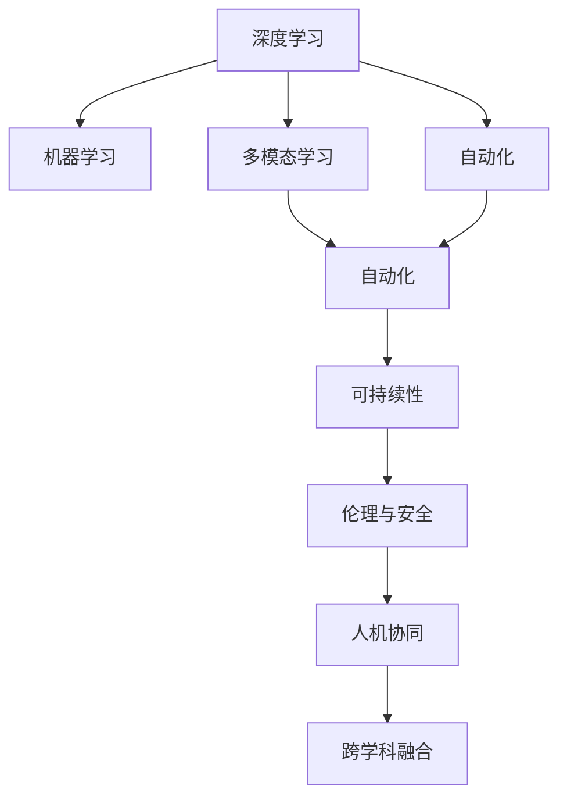

                 

## 1. 背景介绍

### 1.1 问题由来
Andrej Karpathy，这位世界级的人工智能专家、深度学习领域的重要人物，在机器学习和计算机视觉领域有着丰富的研究经历和卓越的贡献。他在深度学习领域开创性地引入了卷积神经网络（Convolutional Neural Network, CNN），并对自动驾驶、图像生成等前沿领域做出了深远影响。本文将深入探讨Andrej Karpathy对人工智能未来的发展机遇与前景的见解。

### 1.2 问题核心关键点
人工智能(Artificial Intelligence, AI)正以前所未有的速度发展，但其发展机遇与挑战并存。Andrej Karpathy认为，未来AI的发展将依赖于以下几个关键点：

1. **深度学习与机器学习的结合**：深度学习以其强大的表征学习能力，已成为AI的核心技术。未来AI的发展将更多地依赖于深度学习算法。

2. **多模态学习**：将视觉、听觉、语言等多模态信息融合，提升AI系统的感知与理解能力。

3. **自动化**：自动化技术将推动AI向更广泛的领域和应用场景拓展，从自动驾驶、工业机器人到医疗诊断、智能客服。

4. **可持续性**：AI的发展应注重环保与可持续发展，避免技术滥用带来的负面影响。

5. **伦理与安全**：AI应用需遵守伦理规范，保障数据隐私与算法公平，避免有害的行为与结果。

6. **人机协同**：未来AI将更多地与人类协作，提升人类工作效率，共同解决复杂问题。

7. **跨学科融合**：AI需与心理学、社会学、医学等多个学科深度融合，实现更全面的人文关怀。

这些关键点不仅揭示了AI未来的发展方向，也提出了实际应用中需要面对的挑战。Andrej Karpathy的这些见解，为AI未来的发展提供了宝贵的方向指引。

## 2. 核心概念与联系

### 2.1 核心概念概述

为更好地理解Andrej Karpathy对AI未来发展的观点，本节将介绍几个与AI密切相关的核心概念：

- **深度学习**：一种基于多层神经网络的机器学习方法，通过堆叠多个层次，自动学习输入数据的表示，广泛应用于图像识别、语音识别、自然语言处理等领域。
- **机器学习**：通过数据训练模型，让机器自动从经验中学习，提升模型性能。深度学习是机器学习的一个重要分支。
- **多模态学习**：指同时处理和分析来自不同传感器和源的多类型数据，如视觉、听觉、语言等，提升AI系统的综合感知能力。
- **自动化**：使用AI技术自动完成各种任务，包括自动化驾驶、机器人操作、医疗诊断等，提升效率和精度。
- **可持续性**：AI应采用绿色算法，减少计算资源消耗，并采用可再生能源，保护环境。
- **伦理与安全**：AI应用需遵循伦理规范，保护数据隐私，避免偏见和歧视，确保安全性。
- **人机协同**：AI系统与人类合作，提升决策效率，共同解决复杂问题，如智能客服、智能推荐系统等。
- **跨学科融合**：AI技术与心理学、社会学、医学等学科深度结合，实现更全面、更智能的应用。

这些核心概念之间的逻辑关系可以通过以下Mermaid流程图来展示：



这个流程图展示了大语言模型的核心概念及其之间的关系：

1. 深度学习是机器学习的重要分支，通过多层神经网络提升模型性能。
2. 多模态学习通过融合多种信息提升感知能力。
3. 自动化提升效率和精度，但需遵循伦理和安全规范。
4. 可持续性关注环保与绿色算法。
5. 人机协同提升决策效率。
6. 跨学科融合带来更多应用场景。

这些概念共同构成了AI的学习和应用框架，使得AI系统能够实现更加智能和高效的应用。通过理解这些核心概念，我们可以更好地把握AI技术的发展趋势和应用方向。

## 3. 核心算法原理 & 具体操作步骤
### 3.1 算法原理概述

深度学习与机器学习的结合是AI未来发展的核心。Andrej Karpathy认为，未来AI将更多地依赖于深度学习算法，主要体现在以下几个方面：

1. **神经网络结构**：多层神经网络通过堆叠多个层次，自动学习数据的表示，提升模型的表示能力。
2. **数据驱动**：通过大量标注数据进行训练，让模型从经验中学习，提升模型的泛化能力。
3. **端到端学习**：通过端到端框架，直接从原始数据训练模型，减少中间步骤，提升效率。
4. **迁移学习**：通过预训练模型，在不同任务间迁移知识，提升模型的泛化能力。
5. **自监督学习**：利用无标签数据进行训练，提升模型的泛化能力。

### 3.2 算法步骤详解

基于深度学习的AI算法，其核心步骤包括：

1. **数据准备**：收集和预处理数据，将原始数据转化为模型可用的格式。
2. **模型构建**：选择合适的神经网络结构，如卷积神经网络（CNN）、循环神经网络（RNN）、长短期记忆网络（LSTM）等。
3. **模型训练**：使用大量标注数据对模型进行训练，优化模型参数，提升模型的性能。
4. **模型评估**：使用验证集对模型进行评估，选择最优模型进行测试。
5. **模型应用**：将训练好的模型应用于实际任务，解决实际问题。

### 3.3 算法优缺点

深度学习的优势在于其强大的表征学习能力，能够处理复杂的多层次数据，提升模型的性能。缺点主要体现在以下几个方面：

1. **数据依赖性高**：深度学习模型需要大量的标注数据进行训练，标注成本较高。
2. **计算资源需求高**：深度学习模型需要高性能计算资源，训练时间较长。
3. **模型解释性差**：深度学习模型难以解释其内部工作机制，存在"黑箱"问题。
4. **过拟合风险高**：深度学习模型在训练过程中容易过拟合，需要结合正则化技术进行优化。
5. **可扩展性差**：深度学习模型结构复杂，难以在大规模数据集上进行扩展。

### 3.4 算法应用领域

深度学习技术已经在多个领域得到了广泛应用，以下是一些典型的应用场景：

- **计算机视觉**：用于图像识别、物体检测、图像分割等任务，如AlphaGo。
- **自然语言处理**：用于机器翻译、文本分类、情感分析等任务，如BERT、GPT。
- **语音识别**：用于语音识别、说话人识别、情感识别等任务，如Google的Speech-to-Text。
- **自动驾驶**：用于自动驾驶车辆的视觉识别、路径规划等任务，如Tesla的Autopilot。
- **推荐系统**：用于个性化推荐、广告投放等任务，如Amazon的推荐系统。

此外，深度学习技术还被应用于医疗诊断、金融分析、智能客服等领域，推动了各行业的智能化进程。

## 4. 数学模型和公式 & 详细讲解  
### 4.1 数学模型构建

深度学习模型的数学模型通常包括两个部分：前向传播和反向传播。

前向传播通过多层神经网络对输入数据进行处理，得到模型的预测结果。反向传播通过计算梯度，更新模型参数，优化模型性能。

以卷积神经网络（CNN）为例，其数学模型如下：

$$
\mathbf{y} = \sigma(\mathbf{W}_1 \mathbf{x} + \mathbf{b}_1 + \mathbf{W}_2 \sigma(\mathbf{W}_3 \mathbf{x} + \mathbf{b}_3) + \mathbf{b}_2)
$$

其中，$\mathbf{y}$表示模型的输出，$\mathbf{x}$表示输入数据，$\sigma$表示激活函数，$\mathbf{W}$和$\mathbf{b}$表示模型的权重和偏置项。

### 4.2 公式推导过程

以卷积神经网络（CNN）为例，其反向传播公式如下：

$$
\frac{\partial \mathcal{L}}{\partial \mathbf{W}} = \frac{\partial \mathcal{L}}{\partial \mathbf{y}} \frac{\partial \mathbf{y}}{\partial \mathbf{W}} + \frac{\partial \mathcal{L}}{\partial \mathbf{W}_2} \frac{\partial \mathbf{W}_2}{\partial \mathbf{W}_1}
$$

其中，$\mathcal{L}$表示损失函数，$\frac{\partial \mathbf{y}}{\partial \mathbf{W}}$表示激活函数对权重$\mathbf{W}$的导数，$\frac{\partial \mathbf{W}_2}{\partial \mathbf{W}_1}$表示链式法则的展开。

### 4.3 案例分析与讲解

以图像分类任务为例，假设模型是一个简单的卷积神经网络，其输入为一张图像，输出为该图像属于各个类别的概率。以下是其训练过程的数学推导：

1. 前向传播：将输入图像通过卷积层、池化层、全连接层等进行处理，得到模型的输出。
2. 计算损失：使用交叉熵损失函数，计算模型输出与真实标签之间的差异。
3. 反向传播：通过反向传播算法，计算损失函数对模型参数的梯度，更新模型参数。

## 5. 项目实践：代码实例和详细解释说明
### 5.1 开发环境搭建

在进行深度学习项目实践前，我们需要准备好开发环境。以下是使用Python进行TensorFlow开发的环境配置流程：

1. 安装Anaconda：从官网下载并安装Anaconda，用于创建独立的Python环境。

2. 创建并激活虚拟环境：
```bash
conda create -n tf-env python=3.8 
conda activate tf-env
```

3. 安装TensorFlow：根据CUDA版本，从官网获取对应的安装命令。例如：
```bash
conda install tensorflow -c conda-forge -c pytorch -c pypi
```

4. 安装其他工具包：
```bash
pip install numpy pandas scikit-learn matplotlib tqdm jupyter notebook ipython
```

完成上述步骤后，即可在`tf-env`环境中开始深度学习项目实践。

### 5.2 源代码详细实现

下面以图像分类任务为例，给出使用TensorFlow对卷积神经网络进行训练的PyTorch代码实现。

首先，定义图像分类任务的数据处理函数：

```python
import tensorflow as tf
from tensorflow.keras.datasets import mnist
from tensorflow.keras.utils import to_categorical

(train_images, train_labels), (test_images, test_labels) = mnist.load_data()
train_images = train_images / 255.0
test_images = test_images / 255.0
train_labels = to_categorical(train_labels)
test_labels = to_categorical(test_labels)
```

然后，定义模型和优化器：

```python
from tensorflow.keras.models import Sequential
from tensorflow.keras.layers import Conv2D, MaxPooling2D, Flatten, Dense

model = Sequential([
    Conv2D(32, (3, 3), activation='relu', input_shape=(28, 28, 1)),
    MaxPooling2D((2, 2)),
    Flatten(),
    Dense(10, activation='softmax')
])

optimizer = tf.keras.optimizers.Adam(learning_rate=0.001)
```

接着，定义训练和评估函数：

```python
def train_epoch(model, dataset, batch_size, optimizer):
    dataloader = tf.data.Dataset.from_tensor_slices(dataset).shuffle(buffer_size=10000).batch(batch_size).prefetch(buffer_size=1)
    model.compile(optimizer=optimizer, loss='categorical_crossentropy', metrics=['accuracy'])
    model.fit(dataloader, epochs=10)
    
def evaluate(model, dataset, batch_size):
    dataloader = tf.data.Dataset.from_tensor_slices(dataset).batch(batch_size).prefetch(buffer_size=1)
    model.evaluate(dataloader)
```

最后，启动训练流程并在测试集上评估：

```python
train_epoch(model, train_images, 64, optimizer)
evaluate(model, test_images, 64)
```

以上就是使用TensorFlow对卷积神经网络进行图像分类任务训练的完整代码实现。可以看到，得益于TensorFlow的强大封装，我们可以用相对简洁的代码完成卷积神经网络的训练。

### 5.3 代码解读与分析

让我们再详细解读一下关键代码的实现细节：

**train_epoch函数**：
- 定义数据集，并进行预处理，包括归一化、one-hot编码等。
- 构建模型，并编译损失函数和优化器。
- 使用训练数据集进行模型训练，定义训练轮数。

**evaluate函数**：
- 定义数据集，并进行预处理，包括one-hot编码。
- 使用测试数据集进行模型评估，返回模型在测试集上的性能指标。

**训练流程**：
- 定义训练轮数和批次大小，开始循环迭代
- 每个epoch内，先在训练集上训练，输出训练损失和精度
- 在测试集上评估，输出测试精度

可以看到，TensorFlow使得深度学习模型的开发变得简洁高效。开发者可以将更多精力放在模型设计、数据处理等高层逻辑上，而不必过多关注底层的实现细节。

当然，工业级的系统实现还需考虑更多因素，如模型的保存和部署、超参数的自动搜索、更灵活的任务适配层等。但核心的深度学习范式基本与此类似。

## 6. 实际应用场景
### 6.1 计算机视觉

卷积神经网络（CNN）在计算机视觉领域已经得到了广泛应用，如图像识别、物体检测、图像分割等。

以图像分类任务为例，卷积神经网络能够从输入图像中自动学习特征表示，将输入图像分类到不同的类别中。

### 6.2 自然语言处理

自然语言处理领域也广泛应用了深度学习技术，如机器翻译、文本分类、情感分析等。

以机器翻译为例，Transformer模型通过自注意力机制，能够自动学习不同语言之间的语义映射，提升翻译质量。

### 6.3 语音识别

语音识别领域也广泛应用了深度学习技术，如自动语音识别（ASR）、说话人识别等。

以自动语音识别为例，卷积神经网络和循环神经网络的结合，能够有效处理语音信号，实现高精度的语音识别。

### 6.4 自动驾驶

自动驾驶领域也广泛应用了深度学习技术，如自动驾驶车辆的视觉识别、路径规划等。

以自动驾驶车辆的视觉识别为例，卷积神经网络能够自动学习车辆周围环境的特征表示，实现高精度的物体检测和分类。

### 6.5 未来应用展望

随着深度学习技术的不断发展，未来深度学习技术将更多地应用于智能制造、智能交通、智慧城市等领域，推动各行业的智能化进程。

1. **智能制造**：通过深度学习技术，提升生产线的自动化程度，实现智能制造。
2. **智能交通**：通过深度学习技术，提升交通系统的自动化程度，实现智能交通。
3. **智慧城市**：通过深度学习技术，提升城市管理的自动化程度，实现智慧城市。

此外，深度学习技术还被应用于金融分析、医疗诊断、智能客服等领域，推动了各行业的智能化进程。

## 7. 工具和资源推荐
### 7.1 学习资源推荐

为了帮助开发者系统掌握深度学习技术，这里推荐一些优质的学习资源：

1. **《深度学习》书籍**：Ian Goodfellow等所著的深度学习经典教材，全面介绍了深度学习的基本原理和算法。
2. **CS231n《卷积神经网络》课程**：斯坦福大学开设的深度学习课程，讲解了卷积神经网络的基本原理和应用。
3. **Deep Learning Specialization**：Andrew Ng等在Coursera上开设的深度学习专项课程，从基础到进阶，全面讲解深度学习技术。
4. **Kaggle竞赛平台**：全球知名的数据科学竞赛平台，提供了大量深度学习竞赛数据集，帮助开发者实践深度学习技术。
5. **GitHub**：全球最大的代码托管平台，提供了大量深度学习项目和代码，帮助开发者学习深度学习技术。

通过对这些资源的学习实践，相信你一定能够快速掌握深度学习技术的精髓，并用于解决实际的AI问题。
### 7.2 开发工具推荐

高效的开发离不开优秀的工具支持。以下是几款用于深度学习项目开发的常用工具：

1. **TensorFlow**：由Google主导开发的开源深度学习框架，生产部署方便，适合大规模工程应用。
2. **PyTorch**：由Facebook主导开发的开源深度学习框架，灵活高效，适合研究与实验。
3. **Keras**：高层深度学习框架，提供简单易用的API，适合快速开发和实验。
4. **Jupyter Notebook**：用于数据科学和机器学习研究的标准工具，支持交互式代码编写和数据可视化。
5. **Anaconda**：Python环境管理工具，支持创建和管理多个Python环境，方便项目开发。

合理利用这些工具，可以显著提升深度学习项目开发的效率，加快创新迭代的步伐。

### 7.3 相关论文推荐

深度学习技术的发展离不开学界的持续研究。以下是几篇奠基性的相关论文，推荐阅读：

1. **ImageNet Large Scale Visual Recognition Challenge**：Alex Krizhevsky等提出的ImageNet大规模视觉识别挑战，推动了深度学习技术的发展。
2. **Deep Residual Learning for Image Recognition**：Kaiming He等提出的深度残差网络，推动了深度学习技术的发展。
3. **Attention is All You Need**：Yang Zhang等提出的Transformer模型，推动了自然语言处理技术的发展。
4. **BERT: Pre-training of Deep Bidirectional Transformers for Language Understanding**：Jacob Devlin等提出的BERT模型，推动了自然语言处理技术的发展。
5. **AlphaGo Zero**：David Silver等提出的AlphaGo Zero，推动了计算机视觉和游戏AI技术的发展。

这些论文代表了大深度学习技术的发展脉络。通过学习这些前沿成果，可以帮助研究者把握学科前进方向，激发更多的创新灵感。

## 8. 总结：未来发展趋势与挑战

### 8.1 总结

本文对Andrej Karpathy对人工智能未来发展的观点进行了全面系统的介绍。首先阐述了深度学习与机器学习的结合是AI未来发展的核心，具体介绍了卷积神经网络、多模态学习等关键技术。其次，从原理到实践，详细讲解了深度学习的数学模型和算法步骤，给出了深度学习任务开发的完整代码实例。同时，本文还探讨了深度学习技术在计算机视觉、自然语言处理、语音识别、自动驾驶等领域的广泛应用，展示了深度学习技术的强大潜力。此外，本文还精选了深度学习技术的各类学习资源，力求为开发者提供全方位的技术指引。

通过本文的系统梳理，可以看到，深度学习技术正在成为AI的核心技术，极大地推动了各行业的智能化进程。未来深度学习技术还将更多地应用于智能制造、智能交通、智慧城市等领域，带来更多的发展机遇和挑战。

### 8.2 未来发展趋势

展望未来，深度学习技术将呈现以下几个发展趋势：

1. **深度学习与AI的结合**：深度学习技术将成为AI的核心，广泛应用于各领域，推动AI技术的发展。
2. **多模态学习**：将视觉、听觉、语言等多模态信息融合，提升AI系统的感知与理解能力。
3. **自动化**：自动化技术将推动AI向更广泛的领域和应用场景拓展，从自动驾驶、工业机器人到医疗诊断、智能客服。
4. **可持续性**：AI应采用绿色算法，减少计算资源消耗，并采用可再生能源，保护环境。
5. **伦理与安全**：AI应用需遵循伦理规范，保护数据隐私，避免偏见和歧视，确保安全性。
6. **人机协同**：AI系统与人类合作，提升决策效率，共同解决复杂问题。
7. **跨学科融合**：AI技术与心理学、社会学、医学等学科深度结合，实现更全面、更智能的应用。

以上趋势凸显了深度学习技术的广阔前景。这些方向的探索发展，将进一步提升AI系统的性能和应用范围，为人类社会带来更广泛的智能化变革。

### 8.3 面临的挑战

尽管深度学习技术已经取得了瞩目成就，但在迈向更加智能化、普适化应用的过程中，它仍面临着诸多挑战：

1. **数据依赖性高**：深度学习模型需要大量的标注数据进行训练，标注成本较高。
2. **计算资源需求高**：深度学习模型需要高性能计算资源，训练时间较长。
3. **模型解释性差**：深度学习模型难以解释其内部工作机制，存在"黑箱"问题。
4. **过拟合风险高**：深度学习模型在训练过程中容易过拟合，需要结合正则化技术进行优化。
5. **可扩展性差**：深度学习模型结构复杂，难以在大规模数据集上进行扩展。
6. **伦理与安全**：深度学习应用需遵循伦理规范，保护数据隐私，避免偏见和歧视，确保安全性。
7. **环境影响**：深度学习模型的训练和推理需要大量的计算资源，对环境影响较大。

这些挑战需要各方的共同努力，才能在深度学习技术的实际应用中得到有效解决。

### 8.4 研究展望

未来的研究需要在以下几个方面寻求新的突破：

1. **无监督学习**：摆脱对大规模标注数据的依赖，利用自监督学习、主动学习等无监督范式，最大限度利用非结构化数据，实现更加灵活高效的深度学习。
2. **迁移学习**：通过预训练模型，在不同任务间迁移知识，提升模型的泛化能力。
3. **自动化优化**：开发更加高效的优化算法，减少计算资源消耗，提高训练效率。
4. **模型压缩**：使用模型压缩技术，减小模型大小，提升推理效率。
5. **多模态融合**：将视觉、听觉、语言等多模态信息融合，提升AI系统的感知与理解能力。
6. **跨学科融合**：AI技术与心理学、社会学、医学等学科深度结合，实现更全面、更智能的应用。

这些研究方向将进一步提升深度学习技术的发展水平，推动AI技术的实际应用。

## 9. 附录：常见问题与解答

**Q1：深度学习与机器学习的结合是AI未来发展的核心吗？**

A: 是的，深度学习是机器学习的重要分支，其强大的表征学习能力使其成为AI的核心技术。未来AI的发展将更多地依赖于深度学习算法，推动AI技术的不断进步。

**Q2：深度学习在计算机视觉、自然语言处理、语音识别等领域有哪些应用？**

A: 深度学习在计算机视觉领域用于图像识别、物体检测、图像分割等任务，如AlphaGo；在自然语言处理领域用于机器翻译、文本分类、情感分析等任务，如BERT、GPT；在语音识别领域用于自动语音识别、说话人识别等任务，如Google的Speech-to-Text。

**Q3：深度学习技术在实际应用中面临哪些挑战？**

A: 深度学习技术在实际应用中面临数据依赖性高、计算资源需求高、模型解释性差、过拟合风险高等挑战，需要在数据准备、模型优化、模型压缩等方面进行深入研究。

**Q4：未来深度学习技术将如何发展？**

A: 未来深度学习技术将更多地应用于智能制造、智能交通、智慧城市等领域，推动各行业的智能化进程。同时，将重点发展无监督学习、迁移学习、多模态融合等技术，提升AI系统的性能和应用范围。

**Q5：深度学习技术在应用过程中应遵循哪些伦理规范？**

A: 深度学习技术在应用过程中应遵循数据隐私保护、算法公平性、安全性等伦理规范，避免有害的行为和结果，确保AI技术的应用符合人类价值观和伦理道德。

