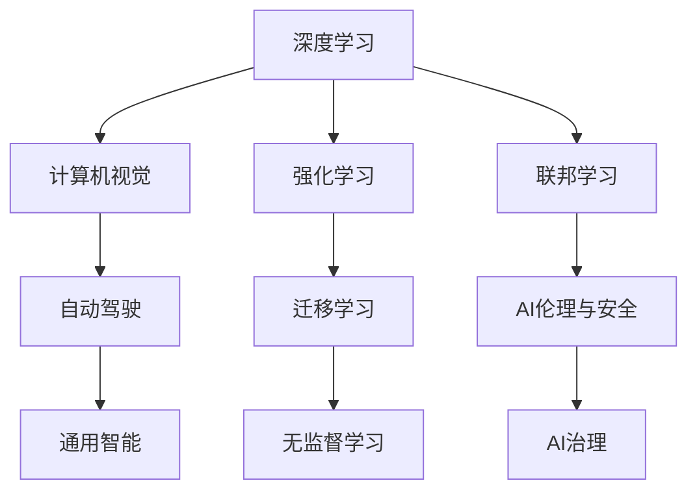

                 

# Andrej Karpathy：人工智能的未来发展目标

在人工智能领域，Andrej Karpathy是一位深具影响力的专家，以其在深度学习、计算机视觉及自动驾驶等领域的开创性贡献而闻名。他的工作不仅推动了技术的边界，还为学术界和产业界树立了新的发展目标。本文将深入探讨Karpathy对AI未来的展望，及其对计算机视觉和自动驾驶的影响，同时分析这些目标对AI技术的挑战和机遇。

## 1. 背景介绍

Andrej Karpathy是人工智能和计算机视觉领域的先驱之一。他在斯坦福大学获得计算机科学博士学位，并曾在Facebook AI Research担任主任。他的研究领域包括深度学习、视觉推理、自动驾驶等。Karpathy在公开演讲和学术文章中多次提及AI的未来发展方向，并提出了一系列具有前瞻性的目标。

## 2. 核心概念与联系

### 2.1 核心概念概述

在探讨Karpathy的AI未来目标之前，我们需要理解几个核心概念：

- **深度学习**：一种模拟人脑神经网络结构和功能的机器学习方法，通过多层神经网络进行特征提取和模式识别。
- **计算机视觉**：使计算机能够“看”并理解图像、视频中的内容，常应用于图像分类、目标检测、语义分割等领域。
- **自动驾驶**：通过计算机视觉、深度学习、传感器融合等技术，使汽车能够自主导航，避免交通事故，提高道路安全性。

Karpathy的研究跨越了这些概念，旨在构建更加智能、安全的AI系统。

### 2.2 核心概念原理和架构的 Mermaid 流程图



这个流程图展示了深度学习与AI的其他子领域之间的联系：

1. 深度学习为计算机视觉和自动驾驶提供了基础。
2. 强化学习用于训练自动驾驶系统，使其能够自主决策。
3. 迁移学习使模型能够跨领域迁移，提高通用性。
4. 无监督学习用于预训练模型，增强泛化能力。
5. 联邦学习用于分布式数据训练，保护隐私。
6. AI伦理与安全关注模型公平性、安全性等。
7. AI治理确保模型符合法律法规和社会价值观。

## 3. 核心算法原理 & 具体操作步骤

### 3.1 算法原理概述

Karpathy的AI未来目标主要集中在以下几个方面：

- **通用智能**：构建能够适应多种任务的AI系统。
- **高精度感知**：通过计算机视觉和深度学习提高AI系统的感知能力。
- **自主决策**：使AI系统具备自主决策能力，应用于自动驾驶、机器人等场景。
- **鲁棒性和可靠性**：确保AI系统在面对新情况时依然可靠。
- **隐私保护**：通过联邦学习等技术保护数据隐私。

### 3.2 算法步骤详解

Karpathy在实施这些目标时，遵循以下步骤：

1. **数据收集与预处理**：收集大量数据，并进行清洗和标注。
2. **模型训练**：使用深度学习模型进行预训练和微调。
3. **性能评估**：在测试集上评估模型性能，如准确率、召回率、F1-score等。
4. **部署与应用**：将模型部署到实际场景中，进行实时推理和决策。
5. **反馈与迭代**：根据实际应用中的反馈，不断调整和优化模型。

### 3.3 算法优缺点

Karpathy提出的AI未来目标具有以下优点：

- **广泛适用性**：通用智能系统可以应用于多个领域，提升整体技术水平。
- **高精度感知**：通过深度学习提升感知能力，使AI系统更接近人类水平。
- **自主决策**：自主决策系统减少对人工干预的依赖，提高操作效率。
- **隐私保护**：联邦学习等技术保护数据隐私，符合法规要求。

同时，也存在一些缺点：

- **计算资源需求高**：深度学习模型训练和推理需要大量计算资源，成本较高。
- **模型复杂度**：模型结构复杂，难以解释，不利于理论研究。
- **数据依赖性强**：模型性能依赖于大量高质量数据，获取数据成本高。
- **伦理挑战**：AI系统的决策过程透明性差，可能引发伦理问题。

### 3.4 算法应用领域

Karpathy的AI未来目标在多个领域得到应用，包括：

- **自动驾驶**：在自动驾驶汽车中，使用深度学习进行视觉感知和决策。
- **计算机视觉**：在图像分类、目标检测、语义分割等任务中，使用深度学习提升性能。
- **医疗诊断**：通过计算机视觉技术，帮助医生进行疾病诊断和图像分析。
- **机器人导航**：在机器人导航和操作中，使用计算机视觉和深度学习进行环境感知和动作规划。

## 4. 数学模型和公式 & 详细讲解 & 举例说明

### 4.1 数学模型构建

在计算机视觉和自动驾驶中，深度学习模型通常采用卷积神经网络（CNN）。以自动驾驶为例，其数学模型可表示为：

$$
\hat{y} = \sigma(Wx + b)
$$

其中，$\hat{y}$ 为模型输出，$x$ 为输入图像，$W$ 和 $b$ 为模型参数，$\sigma$ 为激活函数。

### 4.2 公式推导过程

以自动驾驶中的目标检测为例，其数学模型推导过程如下：

1. **数据预处理**：将图像归一化，应用卷积层提取特征。
2. **目标检测**：使用区域建议网络（RPN）生成候选框，再使用分类器和回归器对候选框进行分类和位置微调。
3. **目标跟踪**：对检测到的目标进行轨迹预测和跟踪。

### 4.3 案例分析与讲解

以Karpathy在自动驾驶中的工作为例，他在AutoDriving课程中详细讲解了深度学习在目标检测中的应用。该课程通过实际项目，展示了如何利用深度学习进行车辆检测、行人检测、车道线检测等任务。

## 5. 项目实践：代码实例和详细解释说明

### 5.1 开发环境搭建

Karpathy使用PyTorch进行深度学习模型的开发。安装PyTorch环境的方法如下：

1. 使用pip安装PyTorch：
```
pip install torch torchvision torchaudio
```

2. 安装相关依赖：
```
pip install numpy matplotlib scikit-image
```

### 5.2 源代码详细实现

以下是一个简单的目标检测代码实现：

```python
import torch
import torchvision.transforms as transforms
from torchvision.models.detection import FastRCNNPredictor

# 加载模型
model = FastRCNNPredictor(in_features=2048, num_classes=10)

# 加载数据
transform = transforms.Compose([
    transforms.ToTensor(),
    transforms.Normalize([0.485, 0.456, 0.406], [0.229, 0.224, 0.225])
])
img = transforms.ToPILImage()(image)
img = transform(img)

# 进行预测
with torch.no_grad():
    output = model(img)

print(output)
```

### 5.3 代码解读与分析

这段代码实现了FastRCNNPredictor模型在图像上的目标检测。关键步骤包括：

1. 加载模型和数据预处理。
2. 加载数据并进行预处理。
3. 对图像进行预测，输出检测结果。

### 5.4 运行结果展示

运行代码后，模型会对图像进行目标检测，输出每个目标的类别和位置。

## 6. 实际应用场景

Karpathy对AI未来的展望涵盖了多个应用场景，包括：

### 6.1 自动驾驶

自动驾驶是Karpathy关注的重点之一。他强调，未来的自动驾驶系统需要具备高精度感知、自主决策和鲁棒性。通过深度学习和强化学习，Karpathy提出了多个技术方案，包括：

- **环境感知**：使用深度学习模型进行多模态数据融合，提高感知精度。
- **路径规划**：使用强化学习模型进行路径规划和决策。
- **鲁棒性增强**：通过数据增强和模型融合，提高系统的鲁棒性。

### 6.2 计算机视觉

Karpathy认为，计算机视觉的未来在于构建更加智能和鲁棒的视觉系统。他提出以下技术方向：

- **高精度分割**：使用语义分割和实例分割技术，提高图像识别的准确性。
- **动态行为分析**：通过视频分析，理解场景中的动态行为。
- **跨模态融合**：将视觉、语音等多模态数据融合，提升系统的感知能力。

### 6.3 医疗诊断

在医疗诊断领域，Karpathy提出使用深度学习进行医学影像分析和诊断。通过大规模医疗影像数据预训练，模型可以自动提取和分析医学图像，辅助医生进行诊断。

## 7. 工具和资源推荐

### 7.1 学习资源推荐

1. **《Deep Learning Specialization》**：由Andrew Ng教授主讲的深度学习课程，涵盖深度学习的基础和进阶内容。
2. **《计算机视觉：算法与应用》**：斯坦福大学计算机视觉课程，讲解计算机视觉的原理和应用。
3. **AutoDriving课程**：Andrej Karpathy在Coursera上开设的自动驾驶课程，涵盖自动驾驶的多个方面。

### 7.2 开发工具推荐

1. **PyTorch**：深度学习框架，支持动态计算图和GPU加速。
2. **TensorFlow**：另一个流行的深度学习框架，支持分布式计算和自动微分。
3. **OpenCV**：计算机视觉库，提供了丰富的图像处理和视觉分析工具。

### 7.3 相关论文推荐

1. **《CS231n: Convolutional Neural Networks for Visual Recognition》**：斯坦福大学计算机视觉课程讲义，详细介绍了卷积神经网络在图像识别中的应用。
2. **《End-to-End Training of a Scene Understanding Model》**：Andrej Karpathy等人发表的自动驾驶论文，展示了深度学习在环境感知和路径规划中的应用。

## 8. 总结：未来发展趋势与挑战

### 8.1 研究成果总结

Karpathy的AI未来目标涵盖了多个领域，推动了深度学习、计算机视觉和自动驾驶技术的进步。他的研究不仅在学术界产生了深远影响，还在产业界得到了广泛应用。

### 8.2 未来发展趋势

Karpathy认为，未来的AI将朝着以下几个方向发展：

- **跨领域融合**：AI系统将更加通用，能够应用于多个领域。
- **模型透明性**：提高模型的可解释性，增强透明度。
- **隐私保护**：通过联邦学习等技术保护数据隐私。
- **伦理规范**：制定AI伦理规范，确保模型公平性和安全性。

### 8.3 面临的挑战

Karpathy在AI未来目标的实现过程中，面临以下挑战：

- **计算资源需求高**：深度学习模型训练和推理需要大量计算资源。
- **数据质量问题**：数据质量和标注准确性对模型性能有重大影响。
- **伦理和安全问题**：AI系统的决策过程透明性差，可能引发伦理问题。

### 8.4 研究展望

未来的研究需要在以下几个方面进行突破：

- **高效模型设计**：开发更加高效、轻量级的深度学习模型。
- **数据增强**：利用数据增强技术提高模型的泛化能力。
- **公平性研究**：研究AI系统的公平性和偏见问题，确保模型决策透明。

## 9. 附录：常见问题与解答

**Q1: 为什么Karpathy认为计算机视觉的未来在于构建更加智能和鲁棒的视觉系统？**

A: 计算机视觉技术在许多领域具有广泛的应用前景，如自动驾驶、医疗诊断、安防监控等。构建更加智能和鲁棒的视觉系统，能够提高系统的感知能力和决策精度，从而提升整体应用水平。

**Q2: Karpathy提出的AI未来目标中，通用智能系统有何优势？**

A: 通用智能系统可以应用于多个领域，提高整体技术水平。它能够跨领域迁移知识，解决不同领域的问题，具有广泛的适用性和灵活性。

**Q3: 在自动驾驶中，Karpathy如何通过深度学习提高感知精度？**

A: 使用深度学习模型进行多模态数据融合，提高环境感知能力。通过卷积神经网络（CNN）和递归神经网络（RNN）等模型，提取和分析车辆、行人、车道线等信息，提高决策的准确性。

**Q4: Karpathy提出的AI伦理和安全问题如何解决？**

A: 制定AI伦理规范，确保模型决策透明，避免伦理问题。通过联邦学习等技术保护数据隐私，确保数据安全。

作者：禅与计算机程序设计艺术 / Zen and the Art of Computer Programming

