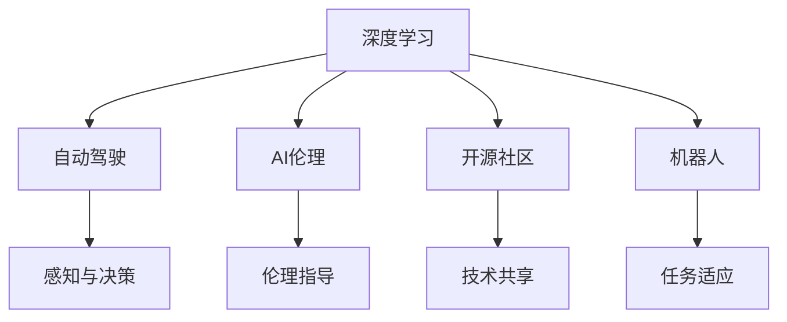

                 

# Andrej Karpathy：人工智能的未来发展策略

> 关键词：深度学习，自动驾驶，AI伦理，开源社区，机器人

## 1. 背景介绍

### 1.1 问题由来

Andrej Karpathy，现任Meta AI的首席AI科学家，NVIDIA首席AI科学家，其在深度学习和计算机视觉领域有深厚的积累，是自动驾驶领域的先驱者和领导者之一。Karpathy教授对人工智能的未来发展策略有着自己独到的见解，他通过在学术界和工业界的广泛实践，对AI技术在实际应用中的挑战和机遇有着深刻的理解。本文将详细阐述Karpathy教授关于人工智能未来发展的策略，旨在为业界提供有价值的参考。

### 1.2 问题核心关键点

Andrej Karpathy的未来发展策略主要围绕以下几个核心关键点展开：

- **深度学习技术的演进**：如何持续推进深度学习技术的发展，提升模型性能和效率。
- **自动驾驶技术的突破**：自动驾驶技术在实际应用中的挑战和解决方案。
- **AI伦理和安全性**：如何在AI技术发展中平衡技术进步与伦理考量，确保AI系统的安全性。
- **开源社区的建设**：如何通过开源社区推动AI技术的普及和应用。
- **机器人技术的发展**：机器人技术在AI驱动下将如何演进，以及未来可能的应用场景。

Karpathy教授认为，AI技术的未来发展需要在以上几个方面进行系统的规划和布局，才能实现可持续的创新和突破。

## 2. 核心概念与联系

### 2.1 核心概念概述

为了更好地理解Andrej Karpathy的未来发展策略，我们首先介绍几个核心概念：

- **深度学习(Deep Learning)**：一种基于神经网络的技术，通过多层非线性变换，实现对复杂数据的自动特征提取和模式识别。
- **自动驾驶(Autonomous Driving)**：一种基于AI技术的车辆驾驶方式，通过传感器、计算机视觉和深度学习等技术实现车辆的自主导航和决策。
- **AI伦理(AI Ethics)**：在AI技术发展中需要考虑的伦理问题，包括隐私保护、算法偏见、安全性和透明度等。
- **开源社区(Open Source Community)**：由开发者贡献代码、资源和知识，共建共享的开源生态系统。
- **机器人(Robotics)**：结合传感器、控制器和AI技术，实现自主决策和操作的机器人系统。

这些核心概念之间的逻辑关系可以通过以下Mermaid流程图来展示：



这个流程图展示了深度学习、自动驾驶、AI伦理、开源社区和机器人技术之间的联系和相互影响。

## 3. 核心算法原理 & 具体操作步骤
### 3.1 算法原理概述

Andrej Karpathy的未来发展策略中，深度学习技术的演进是核心之一。他强调，深度学习技术的发展需要持续推进，特别是在模型架构、优化算法、数据利用等方面。

- **模型架构**：Karpathy认为，深度学习的模型架构需要不断创新，例如引入注意力机制、残差连接等技术，提升模型的表达能力和泛化能力。
- **优化算法**：深度学习的优化算法需要不断改进，例如自适应学习率、梯度裁剪等技术，以提升训练效率和模型性能。
- **数据利用**：数据的多样性和质量是深度学习成功的关键。Karpathy强调，需要在大规模无标签数据上进行预训练，同时在特定任务上进行微调，以提升模型的泛化能力。

### 3.2 算法步骤详解

基于上述算法原理，深度学习的未来发展可以按照以下步骤进行：

1. **数据准备**：收集大规模无标签数据，进行预处理和标注。
2. **模型设计**：选择合适的模型架构，如ResNet、Inception等，并设计合理的损失函数和优化器。
3. **预训练**：在无标签数据上进行预训练，学习通用的语言表示。
4. **微调**：在特定任务上使用少量标注数据进行微调，优化模型在该任务上的性能。
5. **模型评估**：使用验证集和测试集评估模型性能，进行参数调优。

### 3.3 算法优缺点

深度学习技术的演进带来了模型性能的显著提升，但同时也存在以下缺点：

- **资源消耗大**：深度学习模型通常需要大量的计算资源，包括高性能GPU和TPU等。
- **可解释性不足**：深度学习模型的决策过程缺乏可解释性，难以理解和调试。
- **数据依赖性强**：深度学习模型需要大量的标注数据，而高质量标注数据获取成本高昂。

### 3.4 算法应用领域

深度学习技术在多个领域得到了广泛应用，例如：

- **计算机视觉**：如图像分类、目标检测、图像生成等。
- **自然语言处理**：如机器翻译、文本生成、情感分析等。
- **自动驾驶**：如视觉感知、路径规划、行为决策等。
- **机器人**：如智能导航、对象识别、人机交互等。

## 4. 数学模型和公式 & 详细讲解 & 举例说明

### 4.1 数学模型构建

在深度学习模型中，常见的数学模型包括：

- **卷积神经网络(CNN)**：用于图像识别、分类等任务。
- **循环神经网络(RNN)**：用于序列数据的建模，如语音识别、文本生成等。
- **自编码器(Autoencoder)**：用于数据压缩和特征提取。

### 4.2 公式推导过程

以卷积神经网络为例，其基本结构包括卷积层、池化层和全连接层。卷积层的公式为：

$$
y = \sigma(W * x + b)
$$

其中 $W$ 为卷积核，$x$ 为输入数据，$b$ 为偏置项，$\sigma$ 为激活函数。

### 4.3 案例分析与讲解

以ImageNet大规模视觉识别挑战为例，Karpathy教授带领的团队通过引入ResNet结构，提升了模型的性能。他们通过实验证明了ResNet结构在深度网络中能够避免梯度消失问题，从而提升模型的训练效率和性能。

## 5. 项目实践：代码实例和详细解释说明

### 5.1 开发环境搭建

在进行深度学习项目开发时，需要准备以下开发环境：

- **Python**：深度学习框架如TensorFlow、PyTorch等通常使用Python语言实现。
- **GPU/TPU**：高性能计算资源，支持深度学习模型的训练和推理。
- **开发工具**：如Jupyter Notebook、Git等。

### 5.2 源代码详细实现

以ImageNet识别任务为例，使用PyTorch框架的源代码实现如下：

```python
import torch
import torch.nn as nn
import torch.optim as optim
from torchvision import datasets, transforms

# 定义卷积神经网络模型
class ResNet(nn.Module):
    def __init__(self):
        super(ResNet, self).__init__()
        self.conv1 = nn.Conv2d(3, 64, kernel_size=7, stride=2, padding=3, bias=False)
        self.bn1 = nn.BatchNorm2d(64)
        self.relu = nn.ReLU(inplace=True)
        self.maxpool = nn.MaxPool2d(kernel_size=3, stride=2, padding=1)
        self.layer1 = nn.Sequential(
            nn.Conv2d(64, 64, kernel_size=3, stride=1, padding=1, bias=False),
            nn.BatchNorm2d(64),
            nn.ReLU(inplace=True),
            nn.Conv2d(64, 64, kernel_size=3, stride=1, padding=1, bias=False),
            nn.BatchNorm2d(64),
            nn.ReLU(inplace=True)
        )
        # 继续构建后续的卷积层和全连接层...

# 加载数据集
train_dataset = datasets.ImageFolder(root='train', transform=transforms.Compose([
    transforms.RandomHorizontalFlip(),
    transforms.RandomCrop(224),
    transforms.ToTensor(),
    transforms.Normalize(mean=[0.485, 0.456, 0.406], std=[0.229, 0.224, 0.225])
]))

test_dataset = datasets.ImageFolder(root='test', transform=transforms.Compose([
    transforms.RandomHorizontalFlip(),
    transforms.RandomCrop(224),
    transforms.ToTensor(),
    transforms.Normalize(mean=[0.485, 0.456, 0.406], std=[0.229, 0.224, 0.225])
]))

# 定义训练过程
model = ResNet()
optimizer = optim.SGD(model.parameters(), lr=0.01, momentum=0.9, weight_decay=1e-4)
criterion = nn.CrossEntropyLoss()
device = torch.device('cuda' if torch.cuda.is_available() else 'cpu')
model.to(device)
for epoch in range(10):
    for idx, (inputs, labels) in enumerate(train_loader):
        inputs, labels = inputs.to(device), labels.to(device)
        optimizer.zero_grad()
        outputs = model(inputs)
        loss = criterion(outputs, labels)
        loss.backward()
        optimizer.step()
        if idx % 100 == 0:
            print(f'Epoch {epoch+1}, Step {idx+1}/{len(train_loader)}, Loss: {loss.item()}')
```

### 5.3 代码解读与分析

- **数据加载**：使用PyTorch的`ImageFolder`加载ImageNet数据集，并进行数据预处理，包括随机翻转、裁剪、归一化等操作。
- **模型定义**：定义ResNet结构，包括卷积层、批标准化、激活函数等。
- **优化器定义**：使用SGD优化器，并设置学习率、动量和权重衰减等超参数。
- **训练过程**：在每个epoch内，对数据集进行迭代训练，计算损失并更新模型参数。

### 5.4 运行结果展示

训练过程中，可以使用TensorBoard等工具可视化损失函数和模型参数的更新情况，以确保训练过程的正常进行。

## 6. 实际应用场景

### 6.1 自动驾驶技术

Andrej Karpathy是自动驾驶领域的先驱，他领导的NVIDIA团队开发了自动驾驶汽车的关键技术，如自动驾驶算法、视觉感知、行为决策等。在自动驾驶技术中，深度学习的应用包括：

- **视觉感知**：通过深度学习模型，实现对车辆周围环境的实时感知和理解。
- **行为决策**：使用深度学习模型，对车辆行为进行预测和决策。
- **路径规划**：通过深度学习模型，优化路径规划算法，确保车辆行驶的安全和高效。

### 6.2 AI伦理和安全

在AI技术的发展过程中，伦理和安全问题日益受到重视。Karpathy教授强调，AI技术的开发和应用需要遵循伦理和法律规范，保障数据隐私和安全性。

- **数据隐私保护**：确保用户数据的安全，避免数据泄露和滥用。
- **算法偏见**：避免算法偏见，确保AI系统的公平性和公正性。
- **安全性和鲁棒性**：确保AI系统的鲁棒性和安全性，避免恶意攻击和滥用。

### 6.3 开源社区的建设

开源社区的建设是AI技术发展的关键推动力之一。Karpathy教授积极参与开源社区的建设，推动AI技术的普及和应用。

- **贡献代码**：通过GitHub等平台贡献代码和资源，促进技术交流和共享。
- **组织活动**：组织和参与AI技术会议、研讨会，推动技术的传播和应用。
- **教育和培训**：通过在线课程和文档，普及AI技术知识，培养更多AI开发者和用户。

### 6.4 机器人技术

随着AI技术的进步，机器人技术在多个领域得到了广泛应用。Karpathy教授认为，未来的机器人技术将在以下几个方面进行突破：

- **智能导航**：通过深度学习模型，实现机器人的自主导航和路径规划。
- **对象识别**：使用深度学习模型，实现对环境的感知和对象识别。
- **人机交互**：通过深度学习模型，提升机器人的理解和交互能力。

## 7. 工具和资源推荐

### 7.1 学习资源推荐

为了帮助开发者系统掌握深度学习技术，推荐以下学习资源：

- **Deep Learning Specialization**：由Coursera提供的深度学习专业课程，涵盖深度学习基础、卷积神经网络、循环神经网络等内容。
- **TensorFlow官方文档**：提供了TensorFlow框架的详细文档和示例代码，帮助开发者快速上手。
- **PyTorch官方文档**：提供了PyTorch框架的详细文档和示例代码，帮助开发者快速上手。
- **OpenAI Gym**：提供了AI领域的模拟环境，方便开发者进行实验和调试。

### 7.2 开发工具推荐

为了提高深度学习项目的开发效率，推荐以下开发工具：

- **Jupyter Notebook**：支持Python代码的交互式编程，方便调试和分享代码。
- **Git**：版本控制工具，帮助团队协作开发和管理代码。
- **TensorBoard**：可视化工具，用于实时监控和调试模型训练过程。
- **ModelScope**：提供了AI模型的在线服务平台，方便开发者快速部署和测试模型。

### 7.3 相关论文推荐

为了深入理解深度学习技术的发展和应用，推荐以下相关论文：

- **Deep Residual Learning for Image Recognition**：提出了ResNet结构，提升了深度学习模型的性能。
- **Attention is All You Need**：提出了Transformer结构，实现了序列数据的高效建模。
- **GANs Trained by a Two Time-Scale Update Rule Converge to the Semi-Equilibrium**：提出了GANs模型，推动了生成对抗网络的理论研究。
- **Exploring the Limits of Transfer Learning with a Unified Text-to-Text Transformer**：提出了统一文本到文本的Transformer模型，推动了自然语言处理技术的进步。

## 8. 总结：未来发展趋势与挑战

### 8.1 总结

Andrej Karpathy教授的未来发展策略为AI技术的未来发展提供了重要的指导。他强调，深度学习技术的演进、自动驾驶技术的突破、AI伦理和安全性、开源社区的建设以及机器人技术的发展，是AI技术未来发展的关键方向。这些策略不仅有助于推动AI技术的进步，还能在实际应用中带来显著的效益。

### 8.2 未来发展趋势

未来，深度学习技术将在以下几个方面进行深入发展：

- **模型架构的创新**：继续探索和创新深度学习模型架构，提升模型的表达能力和泛化能力。
- **优化算法的改进**：优化深度学习的训练过程，提升模型的训练效率和性能。
- **数据的多样性和质量**：在大规模无标签数据上进行预训练，提升模型的泛化能力。
- **计算资源的优化**：优化深度学习模型的计算图，提升模型的推理速度和效率。

### 8.3 面临的挑战

尽管深度学习技术在多个领域取得了显著进展，但仍面临以下挑战：

- **资源消耗**：深度学习模型需要大量的计算资源，需要进一步优化资源消耗。
- **可解释性**：深度学习模型的决策过程缺乏可解释性，需要提升模型的可解释性。
- **数据依赖性**：深度学习模型需要大量的标注数据，需要进一步降低对标注数据的依赖。
- **伦理和安全**：AI技术的开发和应用需要遵循伦理和法律规范，确保数据隐私和安全性。

### 8.4 研究展望

未来的研究需要关注以下几个方面：

- **多模态学习**：结合视觉、听觉、触觉等多模态数据，提升模型的感知和理解能力。
- **联邦学习**：通过分布式计算，提升模型的训练效率和隐私保护。
- **自监督学习**：通过自监督学习，降低对标注数据的依赖，提升模型的泛化能力。
- **生成对抗网络**：通过生成对抗网络，提升模型的生成能力和鲁棒性。

## 9. 附录：常见问题与解答

**Q1：深度学习技术在实际应用中存在哪些挑战？**

A: 深度学习技术在实际应用中面临以下挑战：

- **资源消耗大**：深度学习模型通常需要大量的计算资源，包括高性能GPU和TPU等。
- **可解释性不足**：深度学习模型的决策过程缺乏可解释性，难以理解和调试。
- **数据依赖性强**：深度学习模型需要大量的标注数据，而高质量标注数据获取成本高昂。

**Q2：如何提升深度学习模型的训练效率？**

A: 提升深度学习模型的训练效率，可以从以下几个方面入手：

- **优化算法**：使用自适应学习率、梯度裁剪等技术，提升训练效率和模型性能。
- **数据增强**：通过数据增强技术，扩充训练集，提升模型的泛化能力。
- **分布式训练**：通过分布式计算，提升模型的训练效率。
- **模型压缩**：通过模型压缩技术，减小模型尺寸，提升推理速度。

**Q3：如何在AI技术发展中平衡技术进步与伦理考量？**

A: 在AI技术发展中，平衡技术进步与伦理考量需要从以下几个方面入手：

- **数据隐私保护**：确保用户数据的安全，避免数据泄露和滥用。
- **算法偏见**：避免算法偏见，确保AI系统的公平性和公正性。
- **安全性和鲁棒性**：确保AI系统的鲁棒性和安全性，避免恶意攻击和滥用。
- **伦理教育**：加强AI技术的伦理教育，提升公众对AI技术的理解和信任。

---

作者：禅与计算机程序设计艺术 / Zen and the Art of Computer Programming

