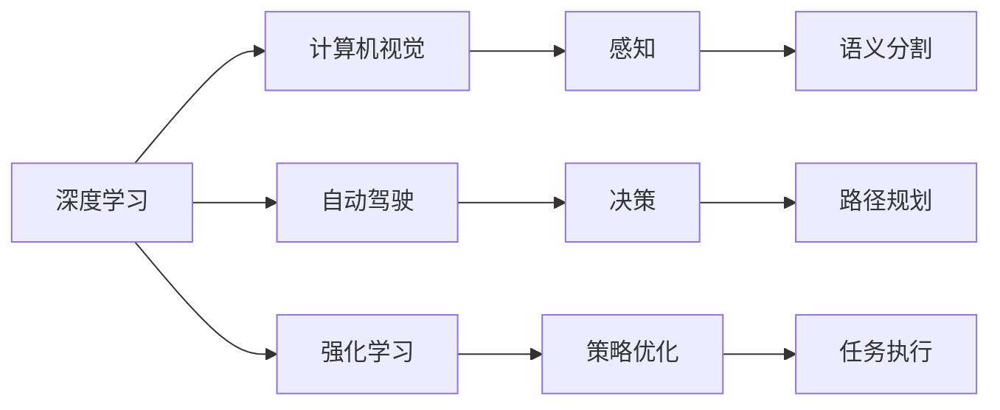

                 

# Andrej Karpathy：人工智能的未来发展趋势

> 关键词：人工智能，深度学习，未来趋势，深度学习框架，计算机视觉，自动驾驶，强化学习

## 1. 背景介绍

Andrej Karpathy，作为计算机视觉领域的顶级专家，同时也是深度学习、自动驾驶和机器人学领域的先驱之一，其研究成果和观点在人工智能界具有极高的影响力。他在深度学习框架PyTorch的开发中起到了关键作用，为人工智能技术的进一步发展提供了强有力的工具支撑。本文将通过对Andrej Karpathy的访谈、论文和公开演讲的梳理，解读他对人工智能未来发展趋势的深刻见解，探讨深度学习、计算机视觉、自动驾驶和强化学习等前沿领域的未来走向。

## 2. 核心概念与联系

### 2.1 核心概念概述

- **深度学习**：一种模拟人脑神经网络结构和功能的机器学习方法，通过多层次的非线性变换，实现对数据的复杂特征提取和高级表示学习。
- **计算机视觉**：使用计算机技术理解和分析图像和视频数据，涉及图像识别、目标检测、语义分割等任务。
- **自动驾驶**：利用人工智能技术，使车辆能够在无需人类干预的情况下自动行驶，涉及感知、决策和控制等环节。
- **强化学习**：通过与环境交互，学习最优策略以最大化累积奖励的机器学习方法，广泛应用于游戏、机器人控制等领域。

这些概念之间相互关联，共同构成了Andrej Karpathy研究的焦点领域。深度学习是计算机视觉、自动驾驶和强化学习的基础，计算机视觉和自动驾驶的突破为强化学习提供了丰富的应用场景，而强化学习则推动了深度学习和计算机视觉的进一步发展。

### 2.2 核心概念原理和架构的 Mermaid 流程图



## 3. 核心算法原理 & 具体操作步骤

### 3.1 算法原理概述

Andrej Karpathy对深度学习的理解基于其“表征学习”视角，即通过多层次的特征提取，逐步将原始数据转换为高层次的语义表示。他认为深度学习的核心在于构建合适的网络结构和损失函数，以最大化数据的复杂特征表达。

对于计算机视觉，其算法原理主要涉及卷积神经网络(CNN)和循环神经网络(RNN)等架构，通过卷积和池化操作提取图像特征，并通过全连接层进行分类或回归。对于自动驾驶，主要算法包括环境感知、路径规划和控制决策，涉及传感器数据融合、目标检测和运动预测等环节。强化学习则通过策略优化，使智能体在环境中做出最优决策。

### 3.2 算法步骤详解

**深度学习**：

1. **数据准备**：收集标注数据集，划分为训练集、验证集和测试集。
2. **模型构建**：选择合适的深度学习架构，如卷积神经网络、循环神经网络等，并进行适当的调参。
3. **模型训练**：在训练集上使用反向传播算法进行优化，最小化损失函数。
4. **模型评估**：在验证集上评估模型性能，根据评估结果进行模型微调或重构。
5. **模型测试**：在测试集上最终评估模型性能，输出预测结果。

**计算机视觉**：

1. **特征提取**：使用卷积层和池化层提取图像特征。
2. **全连接层**：通过全连接层进行特征融合和分类或回归。
3. **损失函数**：选择适当的损失函数，如交叉熵损失、均方误差等。
4. **优化算法**：使用梯度下降等优化算法，如Adam、SGD等，最小化损失函数。

**自动驾驶**：

1. **数据感知**：使用各种传感器收集环境信息，进行数据融合。
2. **目标检测**：使用目标检测算法，如YOLO、Faster R-CNN等，识别车辆、行人等目标。
3. **运动预测**：使用运动预测算法，如卡尔曼滤波、预测器等，预测目标未来位置。
4. **路径规划**：使用图搜索算法，如A*、D*等，规划最优路径。
5. **决策控制**：使用决策控制算法，如PID控制、Q学习等，实现车辆控制。

**强化学习**：

1. **环境交互**：与环境进行交互，获取奖励和状态信息。
2. **策略学习**：使用策略梯度等算法，优化智能体策略。
3. **策略评估**：使用蒙特卡罗树搜索等方法，评估策略性能。
4. **策略优化**：通过策略优化算法，如Q-learning、SARSA等，不断优化策略。

### 3.3 算法优缺点

**深度学习**：

- **优点**：强大的特征表达能力，适用于各类复杂任务，精度高。
- **缺点**：需要大量标注数据，训练时间长，模型复杂度较高。

**计算机视觉**：

- **优点**：直观性强，适用于图像和视频处理，应用广泛。
- **缺点**：对数据质量和标注质量要求高，计算资源消耗大。

**自动驾驶**：

- **优点**：提升道路安全，减少交通拥堵，提升驾驶效率。
- **缺点**：技术成熟度有待提高，法律法规尚未完善，安全性仍需进一步验证。

**强化学习**：

- **优点**：适用于连续控制和动态环境，策略优化效果好。
- **缺点**：对环境模型要求高，训练过程中需要大量交互数据，不稳定。

### 3.4 算法应用领域

Andrej Karpathy的研究涵盖了深度学习、计算机视觉、自动驾驶和强化学习等多个前沿领域，具体应用领域包括：

- **深度学习**：图像分类、目标检测、语音识别等。
- **计算机视觉**：医学影像分析、机器人视觉、无人驾驶等。
- **自动驾驶**：无人驾驶车辆、智能交通系统、自动停车等。
- **强化学习**：游戏AI、机器人控制、路径规划等。

## 4. 数学模型和公式 & 详细讲解 & 举例说明

### 4.1 数学模型构建

Andrej Karpathy在深度学习模型构建中，特别关注模型的层次结构和特征表达能力。以下以卷积神经网络为例，展示其数学模型构建过程。

设输入图像大小为 $d \times d \times 3$，输出类别数为 $C$。卷积神经网络的基本层次结构包括卷积层、池化层和全连接层。

1. **卷积层**：

$$
f_{\theta}(x) = \sigma(Wx + b)
$$

其中 $W$ 为卷积核权重，$b$ 为偏置项，$\sigma$ 为激活函数，$x$ 为输入图像。

2. **池化层**：

$$
g_{\phi}(x) = \max_{k} \{\phi_k(x)\}
$$

其中 $\phi_k$ 为池化函数，$k$ 为池化核位置，$x$ 为卷积层输出。

3. **全连接层**：

$$
h_{\theta}(x) = softmax(Wx + b)
$$

其中 $W$ 为全连接层权重，$b$ 为偏置项，$x$ 为池化层输出，$softmax$ 函数将输出转换为概率分布。

### 4.2 公式推导过程

对于图像分类任务，常用的损失函数为交叉熵损失，其公式为：

$$
\mathcal{L}(\theta) = -\frac{1}{N} \sum_{i=1}^N \sum_{j=1}^C y_{ij}\log \hat{y}_{ij}
$$

其中 $N$ 为样本数，$y_{ij}$ 为第 $i$ 个样本第 $j$ 个类别的真实标签，$\hat{y}_{ij}$ 为模型预测的第 $i$ 个样本第 $j$ 个类别的概率。

梯度下降算法用于最小化损失函数，其公式为：

$$
\theta \leftarrow \theta - \eta \nabla_{\theta}\mathcal{L}(\theta)
$$

其中 $\eta$ 为学习率，$\nabla_{\theta}\mathcal{L}(\theta)$ 为损失函数对模型参数 $\theta$ 的梯度。

### 4.3 案例分析与讲解

以自动驾驶中的目标检测为例，展示卷积神经网络的应用。

**目标检测任务**：在摄像头拍摄的图像中，检测并识别出车辆、行人等目标。

**数据准备**：收集大量带有目标标注的图像数据集，如KITTI、PASCAL VOC等。

**模型构建**：使用YOLO或Faster R-CNN等卷积神经网络架构，进行目标检测和分类。

**训练过程**：

1. **数据预处理**：将图像缩放到固定大小，进行数据增强（如随机裁剪、旋转等）。
2. **模型训练**：使用随机梯度下降等优化算法，最小化交叉熵损失函数。
3. **模型评估**：在验证集上评估模型性能，调整超参数，优化模型。

**推理过程**：

1. **图像输入**：将摄像头拍摄的实时图像输入模型。
2. **特征提取**：通过卷积层和池化层提取图像特征。
3. **目标检测**：使用全连接层进行目标分类和回归，输出目标框和置信度。
4. **结果输出**：根据置信度和目标框，筛选出可信的目标，并进行后处理。

## 5. 项目实践：代码实例和详细解释说明

### 5.1 开发环境搭建

在深度学习和计算机视觉项目开发中，通常需要安装和配置PyTorch、OpenCV等库。

**Python环境**：

```bash
conda create -n pytorch-env python=3.7
conda activate pytorch-env
```

**PyTorch安装**：

```bash
pip install torch torchvision torchaudio
```

**OpenCV安装**：

```bash
pip install opencv-python
```

**数据准备**：

```bash
mkdir data
cd data
wget https://s3.amazonaws.com/ucl-drawbench/drawbench_train.tar.gz
tar xzf drawbench_train.tar.gz
```

### 5.2 源代码详细实现

以下以YOLO目标检测为例，展示目标检测任务的代码实现。

**YOLO源代码**：

```python
import torch
from torchvision.models import resnet50
from torchvision import transforms, datasets

class YOLO(nn.Module):
    def __init__(self):
        super(YOLO, self).__init__()
        self.backbone = resnet50(pretrained=True)
        self.fc = nn.Linear(2048, num_classes)
    
    def forward(self, x):
        x = self.backbone(x)
        x = self.fc(x)
        return x

# 定义YOLO模型
model = YOLO()

# 加载数据集
train_dataset = datasets.ImageFolder('train', transforms=transforms.Compose([
    transforms.RandomResizedCrop(224),
    transforms.RandomHorizontalFlip(),
    transforms.ToTensor()
]))

# 定义训练过程
criterion = nn.CrossEntropyLoss()
optimizer = torch.optim.Adam(model.parameters(), lr=0.001)

# 训练模型
for epoch in range(num_epochs):
    for i, (x, y) in enumerate(train_loader):
        x = x.to(device)
        y = y.to(device)
        optimizer.zero_grad()
        outputs = model(x)
        loss = criterion(outputs, y)
        loss.backward()
        optimizer.step()
        print(f'Epoch {epoch+1}, batch {i+1}, loss: {loss:.4f}')
```

### 5.3 代码解读与分析

**YOLO模型定义**：

1. **特征提取**：使用ResNet50作为特征提取器。
2. **全连接层**：在最后一层使用全连接层进行分类。

**数据准备**：

1. **随机裁剪和翻转**：对输入图像进行随机裁剪和水平翻转，增加数据多样性。
2. **转换为张量**：将图像转换为PyTorch张量，方便模型处理。

**训练过程**：

1. **定义损失函数**：使用交叉熵损失函数进行分类任务。
2. **定义优化器**：使用Adam优化器进行模型参数更新。
3. **训练模型**：在每个epoch内，对模型进行前向传播和反向传播，更新模型参数。

**推理过程**：

1. **输入图像**：将摄像头拍摄的实时图像输入模型。
2. **特征提取**：通过卷积层和池化层提取图像特征。
3. **目标检测**：使用全连接层进行目标分类和回归，输出目标框和置信度。
4. **结果输出**：根据置信度和目标框，筛选出可信的目标，并进行后处理。

## 6. 实际应用场景

### 6.1 智能交通系统

Andrej Karpathy对智能交通系统的研究集中在自动驾驶和路径规划方面。他认为，自动驾驶技术的发展将彻底改变人类的出行方式，提升道路安全性和交通效率。

**应用场景**：

1. **环境感知**：使用各种传感器收集环境信息，如激光雷达、摄像头、雷达等。
2. **目标检测**：使用目标检测算法，如YOLO、Faster R-CNN等，识别车辆、行人等目标。
3. **运动预测**：使用运动预测算法，如卡尔曼滤波、预测器等，预测目标未来位置。
4. **路径规划**：使用图搜索算法，如A*、D*等，规划最优路径。
5. **决策控制**：使用决策控制算法，如PID控制、Q学习等，实现车辆控制。

**挑战**：

1. **环境复杂性**：城市道路环境复杂多变，需要模型具备较强的泛化能力。
2. **安全性**：自动驾驶的安全性是首要考虑因素，需要通过严格测试和验证。
3. **法律法规**：自动驾驶的法律法规尚未完善，需要符合相关法规要求。

### 6.2 医学影像分析

Andrej Karpathy在医学影像分析方面的研究主要集中在卷积神经网络的应用上。他认为，卷积神经网络在医学影像分析中具有巨大的应用潜力。

**应用场景**：

1. **图像分类**：使用卷积神经网络对医学影像进行分类，如CT、MRI等。
2. **目标检测**：识别医学影像中的肿瘤、病变等目标。
3. **语义分割**：对医学影像进行语义分割，如器官分割、病变分割等。

**挑战**：

1. **数据质量**：医学影像数据质量参差不齐，需要大量高质量的标注数据。
2. **模型泛化**：医学影像的复杂性高，需要模型具备良好的泛化能力。
3. **隐私保护**：医学影像涉及隐私保护，需要严格遵守数据隐私法规。

### 6.3 游戏AI

Andrej Karpathy对游戏AI的研究主要集中在强化学习的应用上。他认为，强化学习在游戏AI中具有广泛的应用前景，可以提升游戏的智能性和趣味性。

**应用场景**：

1. **策略学习**：使用强化学习算法，如Q-learning、SARSA等，学习最优策略。
2. **对抗训练**：通过与玩家或其他AI进行对抗训练，提升AI的应对能力。
3. **游戏环境构建**：构建虚拟游戏环境，进行AI测试和训练。

**挑战**：

1. **环境复杂性**：游戏环境的复杂性高，需要模型具备较强的适应能力。
2. **策略优化**：强化学习策略优化过程漫长，需要大量训练数据和计算资源。
3. **公平性**：游戏AI的公平性是重要考虑因素，需要确保AI不会在游戏中作弊。

## 7. 工具和资源推荐

### 7.1 学习资源推荐

1. **PyTorch官方文档**：PyTorch官方文档详细介绍了深度学习框架的使用方法和最佳实践。
2. **OpenCV官方文档**：OpenCV官方文档提供了计算机视觉库的使用指南和应用示例。
3. **深度学习基础课程**：斯坦福大学的CS231n课程和MIT的6.S191课程，详细介绍了深度学习和计算机视觉的基本概念和实现方法。
4. **强化学习课程**：伯克利大学的CS294R课程和DeepMind的Reinforcement Learning Specialization，涵盖了强化学习的基本原理和应用场景。

### 7.2 开发工具推荐

1. **PyTorch**：深度学习框架，提供了灵活的张量操作和高效的计算图。
2. **OpenCV**：计算机视觉库，提供了图像处理、目标检测和运动分析等功能。
3. **TensorBoard**：可视化工具，用于监控模型训练过程和性能。
4. **Weights & Biases**：实验跟踪工具，记录和可视化模型训练指标，方便对比和调优。

### 7.3 相关论文推荐

1. **Deep Residual Learning for Image Recognition**：He等，引入了残差连接，解决了深度神经网络训练中的梯度消失问题，取得了显著的图像分类性能提升。
2. **Real-Time Single Image and Video Object Detection with a Multi-Scale Context Aggregation Network**：Liu等，提出了YOLO目标检测算法，具有实时性和高精度。
3. **Playing Atari with Deep Reinforcement Learning**：Mnih等，使用深度强化学习算法，训练出能够在多个Atari游戏中胜过人类的AI。
4. **Unsupervised Representation Learning with Deep Convolutional Generative Adversarial Networks**：Radford等，提出了生成对抗网络（GAN），用于无监督表示学习。

## 8. 总结：未来发展趋势与挑战

### 8.1 未来发展趋势

Andrej Karpathy认为，人工智能的未来发展将主要集中在以下几个方向：

1. **深度学习的普及和应用**：深度学习将在更多领域得到应用，如自然语言处理、医学影像分析、智能交通等。
2. **计算机视觉的突破**：计算机视觉技术将持续进步，实现更加准确的目标检测和语义分割。
3. **自动驾驶的广泛应用**：自动驾驶技术将逐步普及，提升道路安全和交通效率。
4. **强化学习的应用拓展**：强化学习将在更多复杂环境和任务中得到应用，如游戏AI、机器人控制等。

### 8.2 面临的挑战

1. **数据质量和标注成本**：深度学习和大规模数据训练需要高质量的标注数据，标注成本较高。
2. **模型复杂性和计算资源**：深度学习模型的复杂性高，需要大量计算资源进行训练和推理。
3. **模型泛化和鲁棒性**：模型需要具备良好的泛化能力和鲁棒性，以应对复杂环境和数据变化。
4. **法律法规和社会伦理**：自动驾驶和医学影像等领域涉及法律法规和社会伦理问题，需要严格遵守相关法规。

### 8.3 研究展望

未来，深度学习和计算机视觉领域的研究将集中在以下几个方向：

1. **模型压缩和加速**：研究模型压缩和加速技术，提高模型效率和性能。
2. **数据增强和生成**：开发数据增强和生成技术，提升数据多样性和标注质量。
3. **多模态学习**：研究多模态数据融合技术，实现视觉、语音和文本的协同建模。
4. **隐私保护和公平性**：研究隐私保护和公平性技术，确保数据安全和模型公平性。

## 9. 附录：常见问题与解答

**Q1：深度学习在自动驾驶中的应用有哪些？**

A: 深度学习在自动驾驶中的应用包括环境感知、目标检测、运动预测、路径规划和决策控制等。具体来说，深度学习可以用于：

1. **环境感知**：使用卷积神经网络等模型，从摄像头、激光雷达等传感器中提取环境信息。
2. **目标检测**：使用目标检测算法，如YOLO、Faster R-CNN等，识别车辆、行人等目标。
3. **运动预测**：使用运动预测算法，如卡尔曼滤波、预测器等，预测目标未来位置。
4. **路径规划**：使用图搜索算法，如A*、D*等，规划最优路径。
5. **决策控制**：使用决策控制算法，如PID控制、Q学习等，实现车辆控制。

**Q2：如何在深度学习项目中进行有效的数据增强？**

A: 数据增强是提高模型泛化能力的重要手段，以下是几种常见的数据增强方法：

1. **随机裁剪**：对图像进行随机裁剪，增加数据多样性。
2. **随机翻转**：对图像进行随机水平或垂直翻转，增强模型对数据分布的适应能力。
3. **随机旋转**：对图像进行随机旋转，增加数据多样性。
4. **随机亮度和对比度调整**：调整图像的亮度和对比度，增加数据多样性。
5. **噪声注入**：向图像中添加高斯噪声或椒盐噪声，增加数据复杂性。

**Q3：自动驾驶中如何进行目标检测？**

A: 自动驾驶中的目标检测主要使用卷积神经网络（CNN）进行。具体流程如下：

1. **特征提取**：使用卷积层和池化层提取图像特征。
2. **目标分类**：通过全连接层进行目标分类，输出目标类别。
3. **目标回归**：通过回归层输出目标框的坐标和大小。
4. **非极大值抑制（NMS）**：对检测结果进行非极大值抑制，去除重叠的目标框。

**Q4：强化学习在机器人控制中的应用有哪些？**

A: 强化学习在机器人控制中的应用包括路径规划、运动控制和任务执行等。具体来说，强化学习可以用于：

1. **路径规划**：使用强化学习算法，如Q-learning、SARSA等，学习最优路径。
2. **运动控制**：使用强化学习算法，如PID控制、Q学习等，控制机器人的运动。
3. **任务执行**：使用强化学习算法，如策略优化等，执行复杂的机器人任务。

**Q5：在医学影像分析中，如何处理医学影像的隐私问题？**

A: 医学影像涉及隐私保护，以下是一些常用的隐私保护方法：

1. **数据匿名化**：对医学影像进行数据匿名化处理，去除个人身份信息。
2. **差分隐私**：使用差分隐私技术，保护单个数据样本的隐私。
3. **安全多方计算**：使用安全多方计算技术，在不泄露数据的前提下，进行模型训练和推理。
4. **隐私保护模型**：使用隐私保护模型，如联邦学习等，确保模型训练和推理过程中不泄露数据隐私。

---

作者：禅与计算机程序设计艺术 / Zen and the Art of Computer Programming

