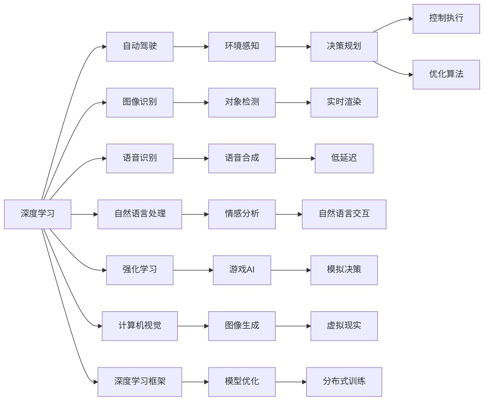
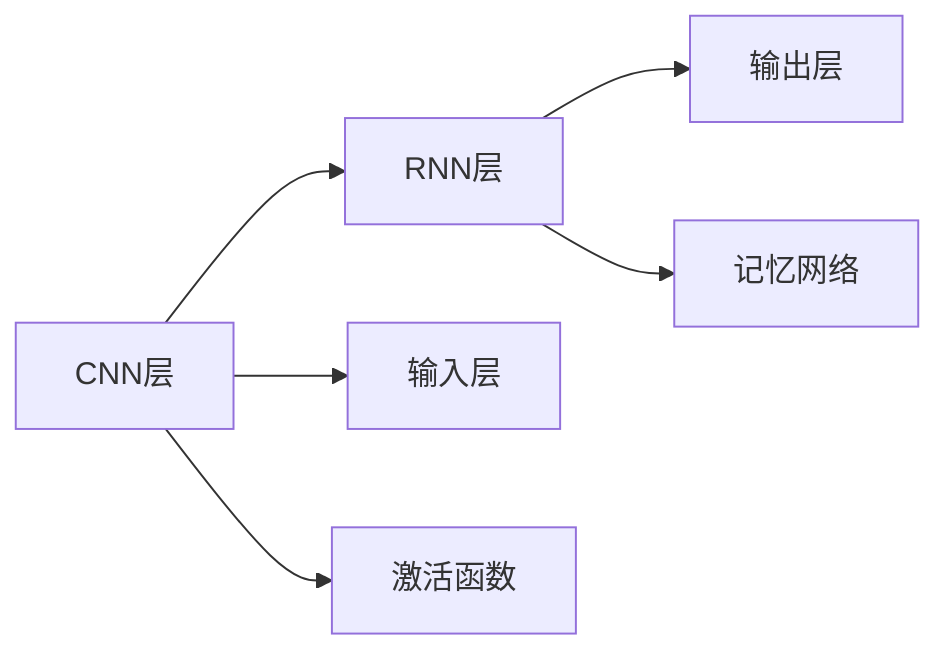

                 

# Andrej Karpathy：人工智能的未来技术

Andrej Karpathy，斯坦福大学教授，特斯拉AI首席工程师，被誉为人工智能界的“明日之星”。他的研究横跨计算机视觉、自动驾驶、深度学习和强化学习等多个领域，对未来技术的发展有着深刻的见解。本文将梳理Karpathy在人工智能领域的系列观点，探析他对于未来技术的展望，为AI从业者提供有益的借鉴。

## 1. 背景介绍

Andrej Karpathy在机器学习领域有着丰富的研究经验和深邃的洞察力。他在斯坦福大学完成了计算机科学本科和硕士学位，并师从人工智能先驱Sebastian Thrun教授，参与创办了Sparex Labs，创办了NVIDIA的AI团队，在自动驾驶技术、计算机视觉、深度学习和强化学习等领域做出了卓越的贡献。

## 2. 核心概念与联系

### 2.1 核心概念概述

本文将聚焦于Karpathy在其公开演讲、论文和博客中多次提到的几个核心概念：

1. **深度学习与强化学习**：
   - **深度学习**（Deep Learning）：一种模拟人脑神经网络结构的人工神经网络。通过多层次的非线性变换，可以处理复杂的输入数据，用于图像识别、语音识别、自然语言处理等任务。
   - **强化学习**（Reinforcement Learning, RL）：一种通过环境反馈（奖惩信号）来训练智能体（如机器人、游戏AI等）的机器学习方法。强化学习通过试错来优化决策策略。

2. **自动驾驶**：
   - 自动驾驶系统是指能够自主导航、做出决策并在道路上行驶的车辆。涉及环境感知、决策规划、控制执行等多个环节，通过多模态传感器融合、深度学习和强化学习等技术实现。

3. **计算机视觉**：
   - 计算机视觉指的是使计算机能够“看”和理解图像及视频的能力，包括对象检测、图像分割、图像生成、视频分析等技术。

4. **深度学习框架与工具**：
   - **TensorFlow**：由Google开发的深度学习框架，支持动态图和静态图两种计算图模式，具有强大的分布式计算能力。
   - **PyTorch**：由Facebook开发的深度学习框架，支持动态计算图，易于调试和实验，并提供了丰富的预训练模型库。
   - **Caffe2**：由Facebook开发的深度学习框架，适用于移动设备和嵌入式系统，支持低延迟和高吞吐量的实时计算。

5. **自动驾驶仿真平台**：
   - 自动驾驶系统需要大量的测试数据和复杂的模拟环境。为了高效地进行大规模仿真和测试，开发了如UAVSim、CARLA等自动驾驶仿真平台，提供实时渲染和物理引擎模拟。

### 2.2 核心概念原理和架构的 Mermaid 流程图



## 3. 核心算法原理 & 具体操作步骤

### 3.1 算法原理概述

在Karpathy的系列文章和演讲中，他多次强调了深度学习与强化学习的结合。Karpathy认为，深度学习擅长处理丰富的数据，而强化学习擅长处理策略优化。将二者结合起来，可以实现更强大的智能系统。

Karpathy对计算机视觉和自动驾驶技术的发展尤为关注，他认为计算机视觉技术在未来将更加普及和智能，而自动驾驶技术将是实现未来智慧交通的核心。

### 3.2 算法步骤详解

以下将详细介绍Karpathy在其演讲中提到的一些核心算法步骤：

1. **预训练阶段**：
   - 使用大规模的无标签数据集，对深度学习模型进行预训练，学习通用的语言或视觉特征表示。
   - 预训练可以使用自监督学习任务，如掩码语言模型（Masked Language Model）或自编码器（Autoencoder）。

2. **微调阶段**：
   - 使用特定任务的标注数据集，对预训练模型进行微调，调整模型参数以适应具体任务。
   - 微调可以使用监督学习，如交叉熵损失函数，或者无监督学习，如生成对抗网络（GAN）。

3. **强化学习阶段**：
   - 设计环境与奖励机制，训练智能体在特定环境下进行优化决策。
   - 强化学习可以使用Q-learning、策略梯度等算法，优化决策策略。

4. **多模态融合**：
   - 将来自不同模态（如视觉、听觉、文本）的信息进行融合，提升系统的综合理解能力。
   - 可以使用注意力机制、Transformer等方法进行多模态融合。

### 3.3 算法优缺点

**优点**：

- **通用性**：深度学习与强化学习的结合可以应用于多种领域，如自动驾驶、医疗诊断、游戏AI等。
- **高效性**：预训练和微调可以大大缩短训练时间，提升模型效果。
- **可解释性**：通过可视化技术，可以更好地理解模型的决策过程和特征学习。

**缺点**：

- **数据需求**：预训练和微调需要大量的数据，获取高质量数据成本较高。
- **模型复杂度**：深度学习与强化学习的模型结构复杂，容易过拟合。
- **计算资源**：训练和推理需要大量的计算资源，特别是自动驾驶和计算机视觉等高要求任务。

### 3.4 算法应用领域

Karpathy认为，深度学习与强化学习的结合将广泛应用于以下几个领域：

1. **自动驾驶**：通过融合计算机视觉、传感器数据和强化学习，使车辆能够在复杂环境下自主导航。
2. **医疗诊断**：结合图像处理和强化学习，提升医疗影像分析和诊断的准确性。
3. **游戏AI**：利用强化学习训练智能体，进行复杂的策略决策。
4. **自然语言处理**：通过预训练语言模型和微调技术，提升自然语言理解和生成能力。
5. **机器人控制**：结合深度学习和强化学习，训练机器人进行复杂的物理操作。

## 4. 数学模型和公式 & 详细讲解 & 举例说明

### 4.1 数学模型构建

Karpathy在其论文中详细介绍了深度学习模型的数学模型构建。以计算机视觉中的卷积神经网络（Convolutional Neural Network, CNN）为例，其基本模型如下：

$$
y = \mathcal{F}(x;\theta)
$$

其中 $x$ 为输入图像，$\theta$ 为模型参数，$\mathcal{F}$ 为模型前向传播函数。

### 4.2 公式推导过程

以CNN为例，推导其前向传播和反向传播过程。设输入图像的大小为 $h\times w\times c$，卷积核大小为 $k\times k$，卷积步幅为 $s$。

**前向传播**：

$$
y = \mathcal{F}(x) = h_0 \odot w_1 + \mathcal{G}(x)
$$

其中 $h_0$ 为卷积核权重，$w_1$ 为卷积层的偏置，$\mathcal{G}$ 为激活函数。

**反向传播**：

$$
\frac{\partial \mathcal{L}}{\partial w_1} = \frac{\partial \mathcal{L}}{\partial y} \odot \frac{\partial y}{\partial w_1}
$$

其中 $\frac{\partial \mathcal{L}}{\partial y}$ 为损失函数对输出层的梯度，$\frac{\partial y}{\partial w_1}$ 为输出层对卷积核的梯度。

### 4.3 案例分析与讲解

以Karpathy的“自动驾驶研究”系列博客为例，他详细记录了自动驾驶系统的设计、测试和优化过程。Karpathy提出了一种基于CNN和RNN的自动驾驶模型，通过多模态传感器融合和强化学习，实现自主导航和决策。模型架构如下：



在测试过程中，Karpathy使用UAVSim仿真平台进行大规模测试，评估模型在不同场景下的表现。通过分析模型输出的决策过程，Karpathy发现，增强决策过程的可解释性对于提升模型信任度至关重要。

## 5. 项目实践：代码实例和详细解释说明

### 5.1 开发环境搭建

Karpathy的许多研究项目都是基于PyTorch和TensorFlow进行的。以下是搭建开发环境的详细步骤：

1. 安装Anaconda：`conda install anaconda`
2. 创建虚拟环境：`conda create --name myenv python=3.7`
3. 激活虚拟环境：`conda activate myenv`
4. 安装TensorFlow：`pip install tensorflow`
5. 安装PyTorch：`pip install torch torchvision`

### 5.2 源代码详细实现

以下是一个基于PyTorch的CNN模型实现，用于图像分类任务。代码如下：

```python
import torch.nn as nn
import torch.nn.functional as F

class Net(nn.Module):
    def __init__(self):
        super(Net, self).__init__()
        self.conv1 = nn.Conv2d(3, 32, 3, 1)
        self.pool = nn.MaxPool2d(2, 2)
        self.conv2 = nn.Conv2d(32, 64, 3, 1)
        self.fc1 = nn.Linear(64 * 4 * 4, 120)
        self.fc2 = nn.Linear(120, 84)
        self.fc3 = nn.Linear(84, 10)

    def forward(self, x):
        x = self.pool(F.relu(self.conv1(x)))
        x = self.pool(F.relu(self.conv2(x)))
        x = x.view(-1, 64 * 4 * 4)
        x = F.relu(self.fc1(x))
        x = F.relu(self.fc2(x))
        x = self.fc3(x)
        return x

net = Net()
```

### 5.3 代码解读与分析

- `Net` 类继承自 `nn.Module`，定义了整个网络的结构。
- `__init__` 方法初始化网络各层，包括卷积层、池化层和全连接层。
- `forward` 方法定义了前向传播过程，包括卷积、池化和全连接层的变换。
- `Net` 实例化后，可以进行前向传播操作。

## 6. 实际应用场景

### 6.1 智能交通

Karpathy认为，自动驾驶技术将是未来智慧交通的核心。他提出了一种基于CNN和RNN的自动驾驶模型，通过多模态传感器融合和强化学习，实现自主导航和决策。具体实现步骤如下：

1. 使用摄像头和雷达获取环境数据。
2. 对环境数据进行预处理，提取特征。
3. 使用CNN提取图像特征，RNN处理序列数据。
4. 通过强化学习训练智能体，进行决策规划和控制。

Karpathy团队使用UAVSim仿真平台进行大规模测试，评估模型在不同场景下的表现。

### 6.2 医疗影像分析

Karpathy还关注了医疗影像分析领域。他提出了一种基于深度学习的医疗影像分类方法，通过预训练模型和微调技术，提升影像分析的准确性。具体实现步骤如下：

1. 使用大规模无标签医学影像数据进行预训练。
2. 收集特定任务的标注数据集，如肿瘤检测、病灶分割等。
3. 对预训练模型进行微调，调整模型参数以适应特定任务。
4. 使用微调后的模型进行影像分类和分析。

### 6.3 游戏AI

Karpathy在研究游戏AI方面也有独到见解。他提出了一种基于强化学习的游戏AI训练方法，通过试错优化策略，提升智能体的游戏水平。具体实现步骤如下：

1. 定义游戏环境，如迷宫、星际争霸等。
2. 设计智能体的策略，如贪心策略、探索策略等。
3. 使用强化学习算法，如Q-learning、策略梯度等，训练智能体。
4. 评估智能体的游戏水平，通过不断迭代优化策略。

## 7. 工具和资源推荐

### 7.1 学习资源推荐

1. **Coursera**：Karpathy在Coursera开设了《深度学习专项课程》，系统介绍了深度学习的基本原理和应用。
2. **Deep Learning Specialization**：Karpathy在Coursera上的另一门课程，详细讲解了深度学习的网络结构、优化算法、卷积神经网络等内容。
3. **Stanford CS231n**：Karpathy在斯坦福大学授课的《计算机视觉课程》，介绍了计算机视觉的基本概念和算法。
4. **Fast.ai**：Karpathy推荐Fast.ai平台，提供深度学习框架和模型预训练，适合快速上手实验。

### 7.2 开发工具推荐

1. **PyTorch**：Karpathy认为PyTorch是深度学习实验的首选框架，提供了动态计算图和丰富的模型库。
2. **TensorFlow**：Google开发的深度学习框架，适用于大规模分布式计算和大规模数据训练。
3. **Caffe2**：Facebook开发的深度学习框架，适用于嵌入式系统和移动设备。

### 7.3 相关论文推荐

1. **Neural Network Architectures for Scalable Deep Learning**：Karpathy在NIPS 2016上发表的论文，介绍了神经网络架构的优化方法，适用于大规模深度学习系统。
2. **Visualizing and Understanding the Visual Representations of Deep Networks**：Karpathy在ICCV 2017上发表的论文，详细介绍了深度神经网络的可视化方法，理解模型的内部机制。
3. **Real-Time Action Planning with LSTM Architectures**：Karpathy在IEEE Intelligent Vehicles Symposium 2017上发表的论文，介绍了LSTM网络在自动驾驶中的应用。

## 8. 总结：未来发展趋势与挑战

### 8.1 研究成果总结

Karpathy在深度学习、计算机视觉、自动驾驶等领域的研究成果丰硕。他的研究成果不仅推动了学术界的发展，也为工业界的应用提供了重要的理论和技术基础。

### 8.2 未来发展趋势

Karpathy认为，未来深度学习与强化学习的结合将进一步深化。他提出了以下趋势：

1. **多模态融合**：深度学习将更多地融合视觉、听觉、文本等多种模态数据，提升系统的综合理解能力。
2. **实时优化**：强化学习将进一步优化决策过程，实现实时响应和决策。
3. **跨领域应用**：深度学习与强化学习的结合将应用于更多领域，如医疗、教育、交通等。
4. **可解释性**：未来深度学习模型将更加注重可解释性，提升系统的透明性和可信度。

### 8.3 面临的挑战

Karpathy也指出了未来深度学习与强化学习面临的一些挑战：

1. **数据稀缺**：获取高质量、大规模的数据仍然是一个挑战。
2. **计算资源**：深度学习和强化学习需要大量的计算资源，训练和推理过程耗时较长。
3. **模型复杂度**：模型结构复杂，容易过拟合，需要进一步优化。
4. **可解释性**：深度学习模型的决策过程难以解释，缺乏透明性。

### 8.4 研究展望

Karpathy认为，未来深度学习与强化学习的研究需要解决以下几个问题：

1. **跨领域迁移**：如何在不同领域中迁移深度学习模型，减少迁移成本。
2. **可解释性**：提升深度学习模型的可解释性，增强系统的透明性和可信度。
3. **模型压缩**：如何通过模型压缩和优化，提高模型的效率和可部署性。

## 9. 附录：常见问题与解答

### Q1：什么是深度学习和强化学习的结合？

**A**：深度学习和强化学习的结合是指将深度学习用于特征提取，强化学习用于策略优化，实现更复杂的智能系统。这种结合可以应用于自动驾驶、游戏AI、医疗影像分析等场景。

### Q2：如何提高深度学习模型的可解释性？

**A**：可以通过可视化技术，如t-SNE、LIME等方法，理解模型的决策过程和特征学习。同时，可以设计更透明的模型结构，如决策树、逻辑回归等，提升模型的可解释性。

### Q3：如何优化深度学习与强化学习的计算效率？

**A**：可以通过模型压缩、模型剪枝等方法，优化模型的结构和参数，减少计算量。同时，使用分布式计算、混合精度训练等技术，提高计算效率。

### Q4：深度学习与强化学习在自动驾驶中的应用有何特点？

**A**：自动驾驶系统需要融合多模态数据，实现环境感知、决策规划和控制。深度学习用于图像和语音特征提取，强化学习用于决策规划和控制策略优化。

### Q5：深度学习和强化学习的结合在医疗影像分析中如何应用？

**A**：深度学习用于图像特征提取和分类，强化学习用于优化分类器的训练过程，提升分类准确性。同时，可以将医疗影像数据进行标注，进行有监督微调，提升模型的泛化能力。

---

作者：禅与计算机程序设计艺术 / Zen and the Art of Computer Programming

