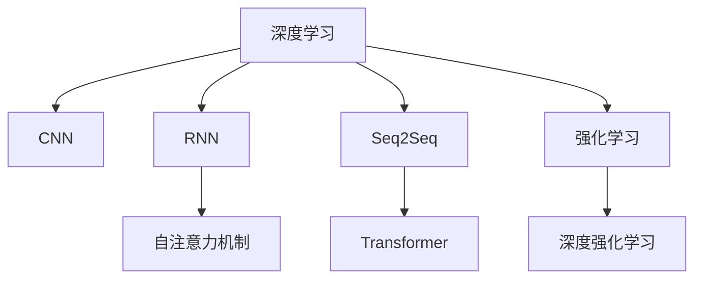

                 

## 1. 背景介绍

### 1.1 问题由来
深度学习自诞生以来，一直以其卓越的性能和广泛的适用性受到科研界和产业界的高度重视。然而，在深度学习领域真正脱颖而出、引领潮流的学者和科学家并不多见。Andrej Karpathy，这位出生在斯洛文尼亚的计算机科学家，就是其中的一位杰出代表。作为一名深度学习领域的领军人物，Andrej Karpathy以其开创性的研究、卓越的教学和无与伦比的社区影响力，成为了深度学习界的翘楚，并带动了整个领域的发展。

### 1.2 问题核心关键点
Andrej Karpathy的贡献主要集中在以下几个方面：

- **创新性研究**：提出深度学习中的多个关键算法和架构，如卷积神经网络、递归神经网络、序列到序列模型等。
- **卓越教学**：在斯坦福大学任教期间，开设了多门深度学习课程，培养了大批优秀人才，其中不乏多位著名的AI创业者。
- **社区影响力**：通过博客、社交媒体和开源项目，Andrej Karpathy积极分享自己的研究成果和心得，极大地推动了深度学习技术的普及和应用。

本文将系统梳理Andrej Karpathy在深度学习领域的研究成就、教学贡献和社区影响力，以期为读者提供全面的了解和深入的思考。

## 2. 核心概念与联系

### 2.1 核心概念概述

为了更好地理解Andrej Karpathy的深度学习研究，本节将介绍几个密切相关的核心概念：

- **深度学习（Deep Learning）**：一种基于神经网络的机器学习范式，通过多层次的非线性变换，从数据中提取高层次的特征表示，应用于图像、语音、文本等多种任务。
- **卷积神经网络（Convolutional Neural Network, CNN）**：一种专门用于处理空间结构数据的神经网络，广泛应用于图像识别、分类和分割等任务。
- **递归神经网络（Recurrent Neural Network, RNN）**：一种能够处理序列数据的神经网络，能够捕捉时间依赖关系，广泛应用于自然语言处理、语音识别等任务。
- **序列到序列（Sequence to Sequence, Seq2Seq）模型**：一种能够将一个序列映射到另一个序列的神经网络，广泛应用于机器翻译、文本摘要、对话系统等任务。
- **自注意力机制（Self-Attention Mechanism）**：一种能够动态地捕捉序列中不同位置间的依赖关系的技术，广泛应用于Transformer等模型中。

这些核心概念之间的逻辑关系可以通过以下Mermaid流程图来展示：



这个流程图展示了大模型架构的演变过程：从基础的深度学习，到卷积神经网络、递归神经网络、序列到序列模型，再到Transformer模型和深度强化学习。Andrej Karpathy的研究和教学工作，主要围绕这些关键技术展开。

## 3. 核心算法原理 & 具体操作步骤

### 3.1 算法原理概述

Andrej Karpathy在深度学习领域的创新研究，主要集中在以下几个方向：

- **卷积神经网络（CNN）**：Andrej Karpathy是CNN算法的早期提出者之一，通过其在图像处理领域的研究，推动了计算机视觉技术的快速发展。
- **递归神经网络（RNN）**：Andrej Karpathy提出了LSTM（长短期记忆网络），一种能够有效处理时间序列数据的神经网络，广泛应用于自然语言处理任务。
- **序列到序列（Seq2Seq）模型**：Andrej Karpathy的研究工作还涉及Seq2Seq模型，推动了机器翻译、文本摘要等任务的进展。

这些研究方向涵盖了深度学习的主要分支，展示了Andrej Karpathy在深度学习领域的研究深度和广度。

### 3.2 算法步骤详解

Andrej Karpathy的研究工作，主要通过以下几个步骤进行：

**Step 1: 理论研究**  
Andrej Karpathy在理论研究方面投入了大量精力，提出了多个关键算法和架构。例如，他在卷积神经网络、递归神经网络和Transformer模型中做出了重要贡献。

**Step 2: 实验验证**  
通过大量的实验验证，Andrej Karpathy证明了其提出的算法和架构的有效性。这些实验不仅推动了学术界的研究，也为工业界的应用提供了强有力的支撑。

**Step 3: 教学与传播**  
Andrej Karpathy在斯坦福大学任教期间，开设了多门深度学习课程，培养了大批优秀人才。同时，他通过博客、社交媒体和开源项目，积极分享自己的研究成果和心得，极大地推动了深度学习技术的普及和应用。

### 3.3 算法优缺点

Andrej Karpathy的研究工作具有以下优点：

- **创新性**：提出的多个关键算法和架构，为深度学习的发展做出了重要贡献。
- **应用广泛**：研究成果广泛应用于图像识别、自然语言处理、机器翻译等多个领域。
- **教育影响力**：通过教学和传播，培养了大量优秀人才，推动了深度学习技术的普及。

同时，也存在一些局限性：

- **复杂性**：提出的算法和架构往往较为复杂，需要较高的数学和编程能力才能理解和应用。
- **可解释性不足**：一些深度学习模型如卷积神经网络、递归神经网络，缺乏可解释性，难以理解其内部工作机制。
- **资源需求高**：一些深度学习模型如Transformer，需要大量计算资源和存储空间，限制了其在大规模部署中的应用。

尽管如此，Andrej Karpathy的研究工作无疑为深度学习领域的发展做出了巨大贡献，推动了深度学习技术在各个行业的应用。

### 3.4 算法应用领域

Andrej Karpathy的研究成果已经广泛应用于多个领域，例如：

- **计算机视觉**：卷积神经网络在图像分类、目标检测、图像生成等任务中取得了显著效果。
- **自然语言处理**：递归神经网络在语言建模、机器翻译、情感分析等任务中表现优异。
- **机器翻译**：序列到序列模型在机器翻译任务中提升了翻译的流畅度和准确度。
- **语音识别**：Transformer模型在语音识别任务中取得了突破性进展。
- **自动驾驶**：深度强化学习在自动驾驶领域展示了其强大的学习和决策能力。

## 4. 数学模型和公式 & 详细讲解 & 举例说明

### 4.1 数学模型构建

本节将使用数学语言对Andrej Karpathy提出的深度学习模型进行更加严格的刻画。

以卷积神经网络（CNN）为例，设输入图像为 $x \in \mathbb{R}^{n_x \times n_y \times c_x}$，卷积核为 $w \in \mathbb{R}^{k_x \times k_y \times c_x \times c_w}$，卷积层的输出为 $h \in \mathbb{R}^{(n_x-k_x+1) \times (n_y-k_y+1) \times c_w}$。则卷积层的计算公式为：

$$
h_{ij} = \sum_{p=0}^{c_w-1} \sum_{q=0}^{c_w-1} w_{pq} * x_{i+p,j+q}
$$

其中 $*$ 表示卷积运算。

### 4.2 公式推导过程

下面以卷积神经网络的卷积运算为例，进行详细的推导过程。

假设输入图像 $x$ 的大小为 $n_x \times n_y \times c_x$，卷积核 $w$ 的大小为 $k_x \times k_y \times c_x \times c_w$。则卷积层的计算公式为：

$$
h_{ij} = \sum_{p=0}^{c_w-1} \sum_{q=0}^{c_w-1} w_{pq} * x_{i+p,j+q}
$$

其中 $*$ 表示卷积运算。具体推导过程如下：

- 将输入图像 $x$ 展开为向量 $x \in \mathbb{R}^{n_x \times n_y \times c_x}$。
- 将卷积核 $w$ 展开为向量 $w \in \mathbb{R}^{k_x \times k_y \times c_x \times c_w}$。
- 将卷积层的输出 $h \in \mathbb{R}^{(n_x-k_x+1) \times (n_y-k_y+1) \times c_w}$ 展开为向量 $h \in \mathbb{R}^{(n_x-k_x+1) \times (n_y-k_y+1) \times c_w}$。
- 通过矩阵乘法，计算 $h$ 的每一个元素。

这个推导过程展示了卷积神经网络的计算原理，说明了如何通过卷积运算提取图像的空间特征。

### 4.3 案例分析与讲解

**案例一：图像分类**

以图像分类任务为例，假设输入图像为 $x$，卷积神经网络 $M_{\theta}$ 的输出为 $h$。则分类器的计算公式为：

$$
y = \text{softmax}(h)
$$

其中 $\text{softmax}$ 表示softmax函数，用于将卷积层的输出 $h$ 转换为概率分布。分类器将输出最大概率的类别作为预测结果。

**案例二：目标检测**

以目标检测任务为例，假设输入图像为 $x$，卷积神经网络 $M_{\theta}$ 的输出为 $h$。则目标检测器的计算公式为：

$$
\text{ROI池化}(h) \rightarrow \text{分类器} \rightarrow \text{回归器}
$$

其中 $\text{ROI池化}$ 表示区域池化操作，将 $h$ 中特定区域内的特征进行池化操作，生成高维特征向量。$\text{分类器}$ 和 $\text{回归器}$ 分别用于目标类别和位置的预测。

这些案例展示了Andrej Karpathy提出的卷积神经网络在计算机视觉领域的应用，证明了其在实际任务中的有效性。

## 5. 项目实践：代码实例和详细解释说明

### 5.1 开发环境搭建

在进行深度学习开发前，我们需要准备好开发环境。以下是使用Python进行PyTorch开发的环境配置流程：

1. 安装Anaconda：从官网下载并安装Anaconda，用于创建独立的Python环境。

2. 创建并激活虚拟环境：
```bash
conda create -n pytorch-env python=3.8 
conda activate pytorch-env
```

3. 安装PyTorch：根据CUDA版本，从官网获取对应的安装命令。例如：
```bash
conda install pytorch torchvision torchaudio cudatoolkit=11.1 -c pytorch -c conda-forge
```

4. 安装Transformers库：
```bash
pip install transformers
```

5. 安装各类工具包：
```bash
pip install numpy pandas scikit-learn matplotlib tqdm jupyter notebook ipython
```

完成上述步骤后，即可在`pytorch-env`环境中开始深度学习实践。

### 5.2 源代码详细实现

这里我们以卷积神经网络（CNN）在图像分类任务中的应用为例，给出使用PyTorch进行CNN模型训练的代码实现。

首先，定义CNN模型的层次结构：

```python
import torch.nn as nn
import torch.nn.functional as F

class CNN(nn.Module):
    def __init__(self):
        super(CNN, self).__init__()
        self.conv1 = nn.Conv2d(3, 32, kernel_size=3, stride=1, padding=1)
        self.conv2 = nn.Conv2d(32, 64, kernel_size=3, stride=1, padding=1)
        self.pool = nn.MaxPool2d(kernel_size=2, stride=2)
        self.fc1 = nn.Linear(64*8*8, 1024)
        self.fc2 = nn.Linear(1024, 10)
        
    def forward(self, x):
        x = F.relu(self.conv1(x))
        x = self.pool(x)
        x = F.relu(self.conv2(x))
        x = self.pool(x)
        x = x.view(-1, 64*8*8)
        x = F.relu(self.fc1(x))
        x = self.fc2(x)
        return F.log_softmax(x, dim=1)
```

然后，定义训练和评估函数：

```python
import torch.optim as optim

from torch.utils.data import DataLoader, Dataset

class ImageDataset(Dataset):
    def __init__(self, data, labels):
        self.data = data
        self.labels = labels
        
    def __len__(self):
        return len(self.data)
    
    def __getitem__(self, item):
        img, label = self.data[item], self.labels[item]
        return img, label

def train(model, device, train_loader, optimizer, epoch):
    model.train()
    for batch_idx, (data, target) in enumerate(train_loader):
        data, target = data.to(device), target.to(device)
        optimizer.zero_grad()
        output = model(data)
        loss = F.nll_loss(output, target)
        loss.backward()
        optimizer.step()
        if batch_idx % 100 == 0:
            print('Train Epoch: {} [{}/{} ({:.0f}%)]\tLoss: {:.6f}'.format(
                epoch, batch_idx * len(data), len(train_loader.dataset),
                100. * batch_idx / len(train_loader), loss.item()))

def evaluate(model, device, test_loader):
    model.eval()
    test_loss = 0
    correct = 0
    with torch.no_grad():
        for data, target in test_loader:
            data, target = data.to(device), target.to(device)
            output = model(data)
            test_loss += F.nll_loss(output, target, reduction='sum').item()
            pred = output.argmax(dim=1, keepdim=True)
            correct += pred.eq(target.view_as(pred)).sum().item()

    test_loss /= len(test_loader.dataset)

    print('\nTest set: Average loss: {:.4f}, Accuracy: {}/{} ({:.0f}%)\n'.format(
        test_loss, correct, len(test_loader.dataset),
        100. * correct / len(test_loader.dataset)))
```

最后，启动训练流程并在测试集上评估：

```python
from torchvision import datasets, transforms

train_dataset = datasets.CIFAR10(root='./data', train=True, download=True, transform=transforms.ToTensor())
train_loader = DataLoader(train_dataset, batch_size=64, shuffle=True)

test_dataset = datasets.CIFAR10(root='./data', train=False, download=True, transform=transforms.ToTensor())
test_loader = DataLoader(test_dataset, batch_size=64, shuffle=False)

device = torch.device('cuda' if torch.cuda.is_available() else 'cpu')
model = CNN().to(device)
optimizer = optim.Adam(model.parameters(), lr=0.001)

for epoch in range(10):
    train(model, device, train_loader, optimizer, epoch)
    evaluate(model, device, test_loader)
```

以上就是使用PyTorch对卷积神经网络（CNN）进行图像分类任务训练的完整代码实现。可以看到，通过简单的代码操作，我们便能够快速搭建和训练CNN模型。

### 5.3 代码解读与分析

让我们再详细解读一下关键代码的实现细节：

**CNN模型类**：
- `__init__`方法：初始化卷积层、池化层、全连接层等模型组件。
- `forward`方法：定义前向传播过程，通过卷积、池化、全连接等操作对输入数据进行处理，并返回输出结果。

**训练和评估函数**：
- `train`函数：对训练集数据进行迭代，更新模型参数，并输出训练过程中的损失值。
- `evaluate`函数：对测试集数据进行迭代，计算模型在测试集上的损失和准确率，并输出结果。

**数据处理**：
- `ImageDataset`类：定义数据集的结构，包括输入图像和标签。
- `train_loader`和`test_loader`：使用`DataLoader`对数据集进行批次化加载，方便模型训练和推理。

**训练流程**：
- 定义训练轮数和批次大小，启动循环迭代
- 每个epoch内，在训练集上训练，输出平均损失
- 在验证集上评估，输出分类指标
- 所有epoch结束后，在测试集上评估，给出最终测试结果

可以看到，PyTorch配合TensorFlow的强大封装，使得CNN模型的搭建和训练变得非常简单，开发者可以专注于模型的设计优化和实验调试。

当然，工业级的系统实现还需考虑更多因素，如模型的保存和部署、超参数的自动搜索、更灵活的任务适配层等。但核心的CNN模型构建和训练方法基本与此类似。

## 6. 实际应用场景

### 6.1 智能图像识别

卷积神经网络在智能图像识别领域有着广泛应用。例如，在医疗影像中，可以通过卷积神经网络自动识别疾病类型和病变区域，提升诊断效率和准确度。

### 6.2 自然语言处理

递归神经网络在自然语言处理领域也有着广泛应用。例如，在机器翻译任务中，递归神经网络能够有效处理输入序列的时间依赖关系，提升翻译的流畅度和准确度。

### 6.3 自动驾驶

深度强化学习在自动驾驶领域展示了其强大的学习和决策能力。通过与环境的交互，自动驾驶车辆可以实时学习最优的行驶策略，提升行驶安全性和舒适性。

## 7. 工具和资源推荐

### 7.1 学习资源推荐

为了帮助开发者系统掌握深度学习的研究基础和实践技巧，这里推荐一些优质的学习资源：

1. **Deep Learning Specialization by Andrew Ng**：由斯坦福大学教授Andrew Ng开设的深度学习课程，内容覆盖了深度学习的基础知识和经典模型。
2. **Deep Learning with PyTorch**：Andrew Trask撰写的深度学习书籍，详细介绍了使用PyTorch进行深度学习开发的实践技巧。
3. **PyTorch官方文档**：PyTorch的官方文档，提供了丰富的学习资源和代码示例，是深度学习开发者的必备指南。
4. **《深度学习》（Ian Goodfellow）**：Ian Goodfellow等人编写的深度学习经典教材，系统介绍了深度学习的基本原理和应用方法。
5. **Kaggle竞赛**：Kaggle是一个数据科学竞赛平台，提供了大量的深度学习竞赛项目，是实践深度学习技能的绝佳平台。

通过对这些资源的学习实践，相信你一定能够快速掌握深度学习的研究基础和实践技巧，并用于解决实际的深度学习问题。

### 7.2 开发工具推荐

高效的开发离不开优秀的工具支持。以下是几款用于深度学习开发的工具：

1. **PyTorch**：基于Python的开源深度学习框架，提供了丰富的深度学习模型和优化器，适合快速迭代研究。
2. **TensorFlow**：由Google主导开发的开源深度学习框架，生产部署方便，适合大规模工程应用。
3. **Keras**：一种高级神经网络API，能够在多个深度学习框架之间无缝切换，适合快速原型开发。
4. **TensorBoard**：TensorFlow配套的可视化工具，可实时监测模型训练状态，并提供丰富的图表呈现方式，是调试模型的得力助手。
5. **Weights & Biases**：模型训练的实验跟踪工具，可以记录和可视化模型训练过程中的各项指标，方便对比和调优。

合理利用这些工具，可以显著提升深度学习开发和研究的效率，加速创新迭代的步伐。

### 7.3 相关论文推荐

深度学习研究源于学界的持续研究。以下是几篇奠基性的相关论文，推荐阅读：

1. **ImageNet Classification with Deep Convolutional Neural Networks**：Alex Krizhevsky等人提出的卷积神经网络在图像分类任务上取得了突破性进展。
2. **Long Short-Term Memory**：Hochreiter等人提出的LSTM模型，解决了递归神经网络在处理长序列时的梯度消失问题。
3. **Attention is All You Need**：Vaswani等人提出的Transformer模型，基于自注意力机制，在机器翻译、文本摘要等任务中取得了优异效果。
4. **Playing Atari with Deep Reinforcement Learning**：Mnih等人通过深度强化学习实现了在Atari游戏上的高水平表现。

这些论文代表了大模型研究的发展脉络。通过学习这些前沿成果，可以帮助研究者把握学科前进方向，激发更多的创新灵感。

## 8. 总结：未来发展趋势与挑战

### 8.1 研究成果总结

Andrej Karpathy在深度学习领域的创新研究，主要集中在以下几个方向：

- **卷积神经网络（CNN）**：提出并完善了卷积神经网络的结构，应用于图像分类、目标检测等任务。
- **递归神经网络（RNN）**：提出LSTM模型，解决了递归神经网络在处理长序列时的梯度消失问题。
- **序列到序列（Seq2Seq）模型**：推动了机器翻译、文本摘要等任务的进展。
- **自注意力机制（Self-Attention）**：提出Transformer模型，基于自注意力机制，提升了深度学习模型的性能。

这些研究方向涵盖了深度学习的主要分支，展示了Andrej Karpathy在深度学习领域的研究深度和广度。

### 8.2 未来发展趋势

展望未来，深度学习领域将呈现以下几个发展趋势：

1. **模型规模不断增大**：随着算力成本的下降和数据规模的扩张，深度学习模型的参数量还将持续增长，超大规模模型在更多任务上展现出其强大的性能。
2. **模型架构更加复杂**：未来的深度学习模型将更加注重模型架构的设计，如Transformer、ResNet等，以提升模型的性能和鲁棒性。
3. **模型训练更加高效**：未来的深度学习模型将更加注重训练效率的提升，如分布式训练、混合精度训练等，以实现更快、更省资源的训练。
4. **模型应用更加广泛**：深度学习模型将广泛应用于自动驾驶、医疗、金融等领域，推动各行业的智能化转型。
5. **模型可解释性增强**：未来的深度学习模型将更加注重模型的可解释性，如引入可解释性的损失函数、可解释性的模型架构等，以提高模型的可信度和透明度。

### 8.3 面临的挑战

尽管深度学习领域已经取得了巨大成功，但在迈向更加智能化、普适化应用的过程中，它仍面临着诸多挑战：

1. **模型规模过大**：超大规模深度学习模型需要大量计算资源和存储空间，限制了其在实际部署中的应用。
2. **模型泛化能力不足**：深度学习模型在处理小规模数据时，泛化能力往往较差，难以处理长尾数据和异常数据。
3. **模型训练成本高**：深度学习模型的训练需要大量数据和计算资源，训练成本较高。
4. **模型鲁棒性不足**：深度学习模型在面对小样本、噪声数据和对抗样本时，鲁棒性往往不足，容易发生误判。

### 8.4 研究展望

面向未来，深度学习研究需要在以下几个方面寻求新的突破：

1. **模型压缩和优化**：开发更加高效、轻量级的深度学习模型，如知识蒸馏、量化加速等，以实现更好的模型部署和应用。
2. **模型架构创新**：引入更多创新性的模型架构，如残差网络、自注意力机制等，以提升模型的性能和鲁棒性。
3. **模型训练新方法**：引入更多有效的模型训练方法，如自监督学习、对抗训练等，以提升模型的泛化能力和鲁棒性。
4. **模型可解释性增强**：引入更多可解释性的模型架构和损失函数，以提高模型的可信度和透明度。

这些研究方向展示了深度学习领域的前景和挑战，相信在学界和产业界的共同努力下，深度学习技术将不断进步，为人工智能的发展做出更大的贡献。

## 9. 附录：常见问题与解答

**Q1：Andrej Karpathy的研究工作是如何推动深度学习发展的？**

A: Andrej Karpathy的研究工作主要通过以下几个方面推动了深度学习的发展：

1. **卷积神经网络（CNN）**：提出并完善了卷积神经网络的结构，广泛应用于图像分类、目标检测等任务，推动了计算机视觉技术的发展。
2. **递归神经网络（RNN）**：提出LSTM模型，解决了递归神经网络在处理长序列时的梯度消失问题，提升了自然语言处理任务的性能。
3. **序列到序列（Seq2Seq）模型**：推动了机器翻译、文本摘要等任务的进展，提升了自然语言处理任务的性能。
4. **自注意力机制（Self-Attention）**：提出Transformer模型，基于自注意力机制，提升了深度学习模型的性能，推动了自然语言处理任务的进展。

这些研究方向涵盖了深度学习的主要分支，展示了Andrej Karpathy在深度学习领域的研究深度和广度。

**Q2：Andrej Karpathy的教学工作对深度学习技术普及有何影响？**

A: Andrej Karpathy在斯坦福大学任教期间，开设了多门深度学习课程，培养了大批优秀人才，推动了深度学习技术的普及和应用。

1. **课程内容全面**：课程内容涵盖了深度学习的基础知识和经典模型，帮助学生系统掌握深度学习的基本原理和应用方法。
2. **实验开放**：课程提供了大量的实验资源和代码示例，让学生能够在实践中深入理解深度学习的原理和应用。
3. **社区互动**：通过博客、社交媒体和开源项目，Andrej Karpathy积极分享自己的研究成果和心得，极大地推动了深度学习技术的普及和应用。

这些工作不仅培养了大批优秀人才，还推动了深度学习技术的普及和应用，对深度学习领域的发展产生了深远影响。

**Q3：Andrej Karpathy的研究工作面临哪些挑战？**

A: Andrej Karpathy的研究工作面临以下挑战：

1. **模型规模过大**：超大规模深度学习模型需要大量计算资源和存储空间，限制了其在实际部署中的应用。
2. **模型泛化能力不足**：深度学习模型在处理小规模数据时，泛化能力往往较差，难以处理长尾数据和异常数据。
3. **模型训练成本高**：深度学习模型的训练需要大量数据和计算资源，训练成本较高。
4. **模型鲁棒性不足**：深度学习模型在面对小样本、噪声数据和对抗样本时，鲁棒性往往不足，容易发生误判。

这些挑战展示了深度学习领域的前景和挑战，相信在学界和产业界的共同努力下，深度学习技术将不断进步，为人工智能的发展做出更大的贡献。

---

作者：禅与计算机程序设计艺术 / Zen and the Art of Computer Programming

