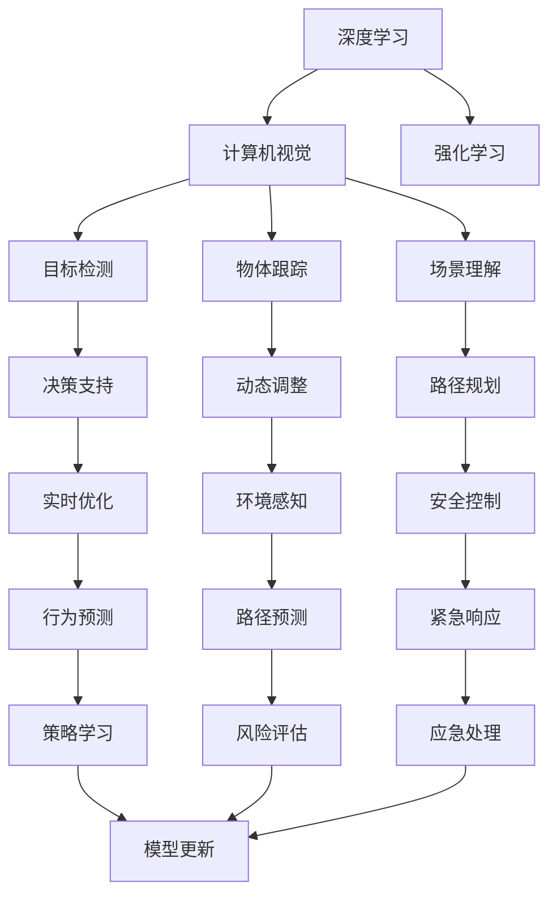

                 

## 1. 背景介绍

安德烈·卡尔帕西（Andrej Karpathy）是一位深度学习领域的先锋，被广泛认为是在自动驾驶和计算机视觉方面的杰出人才。他的研究推动了神经网络在实际应用中的创新，特别是在自动驾驶领域。他的论文《Autopilot: A Vision-based Autonomous Driving Simulator》为我们深入了解自动驾驶技术的发展提供了宝贵的洞察。本文将详细介绍这篇论文的核心内容，并从中提炼出未来自动驾驶技术的重要进展。

## 2. 核心概念与联系

### 2.1 核心概念概述

为了深入理解这篇论文，我们先介绍几个核心概念：

- **深度学习**：一种基于神经网络的机器学习范式，通过多层非线性变换，自动从数据中学习特征表示。深度学习在图像识别、自然语言处理等领域取得了显著进展。
- **自动驾驶**：一种通过计算机视觉、深度学习和传感器融合技术，使车辆能够自主导航和驾驶的技术。自动驾驶分为多个级别，从辅助驾驶到全自动驾驶（L5）。
- **计算机视觉**：利用计算机处理和分析图像、视频等视觉数据，实现目标检测、物体跟踪、场景理解等任务的技术。
- **强化学习**：一种学习范式，通过与环境的交互，逐步优化决策策略，以最大化累积奖励。

这些概念构成了自动驾驶技术的核心框架，相互之间有着紧密的联系和依赖。深度学习和计算机视觉为自动驾驶提供了强大的感知和推理能力，而强化学习则为车辆决策提供了智能化的指导。

### 2.2 核心概念原理和架构的 Mermaid 流程图



这个流程图展示了深度学习和计算机视觉在自动驾驶中的具体应用场景，以及强化学习如何参与决策过程。

## 3. 核心算法原理 & 具体操作步骤

### 3.1 算法原理概述

这篇论文的核心算法原理主要集中在两个方面：一是使用深度学习和计算机视觉技术进行实时感知和场景理解，二是利用强化学习进行车辆决策和行为优化。

### 3.2 算法步骤详解

1. **数据收集与预处理**：首先收集包含道路场景的图像和车辆行为数据，对其进行标注和清洗，确保数据的质量和多样性。

2. **深度学习模型训练**：使用收集到的数据训练深度学习模型，包括目标检测、物体跟踪和场景理解等任务。目标检测模型通常使用卷积神经网络（CNN）进行训练，物体跟踪和场景理解则可能使用更复杂的结构，如循环神经网络（RNN）和长短时记忆网络（LSTM）。

3. **强化学习训练**：在训练好的深度学习模型基础上，利用强化学习进行车辆决策的优化。通过构建模拟驾驶环境，让车辆在虚拟世界中执行各种驾驶任务，并根据任务的完成情况和安全性评估，对车辆的行为策略进行调整。

4. **模型集成与测试**：将训练好的深度学习模型和强化学习模型集成在一起，进行综合性能测试。在实际道路环境中进行测试，评估自动驾驶系统的鲁棒性和可靠性。

### 3.3 算法优缺点

**优点**：
- 深度学习和计算机视觉技术能够实时处理复杂的视觉数据，提高车辆感知和理解能力。
- 强化学习能够根据车辆性能和安全性评估，动态调整决策策略，提升系统智能化水平。
- 集成训练和测试过程，可以确保模型的整体效果和鲁棒性。

**缺点**：
- 深度学习模型的训练和优化过程复杂，需要大量的计算资源和时间。
- 强化学习的训练过程依赖于模拟环境，可能无法完全模拟实际道路的复杂性和不可预测性。
- 模型的集成测试需要实际道路环境，成本较高。

### 3.4 算法应用领域

这篇论文提出的自动驾驶技术主要应用于以下几个领域：

- **辅助驾驶**：提供类似于巡航控制的辅助功能，如车道保持、自适应巡航控制等。
- **半自动驾驶**：在特定道路条件下，实现部分自动化驾驶功能，如自动泊车、自动导航等。
- **全自动驾驶**：在复杂和多变的环境中，实现全面的自主驾驶功能，包括无人驾驶出租车、物流运输等。

## 4. 数学模型和公式 & 详细讲解 & 举例说明

### 4.1 数学模型构建

这篇论文中构建的数学模型主要包括以下几个部分：

- **目标检测模型**：通常使用CNN进行训练，模型输出为车辆、行人、道路标志等目标的类别和位置信息。
- **物体跟踪模型**：使用RNN或LSTM进行训练，模型输出为物体在连续帧之间的状态转移。
- **场景理解模型**：使用卷积神经网络和递归神经网络进行训练，模型输出为场景中的道路类型、交通信号等。
- **强化学习模型**：使用策略梯度方法进行训练，模型输出为车辆的加速度、转向角等决策变量。

### 4.2 公式推导过程

以目标检测模型为例，常用的CNN结构包含卷积层、池化层和全连接层。目标检测任务通常使用回归损失和交叉熵损失进行训练。公式推导如下：

$$
\mathcal{L}(\theta) = \frac{1}{N}\sum_{i=1}^N (\ell_{reg}(t_i) + \lambda\ell_{cls}(t_i))
$$

其中，$\theta$ 为模型参数，$\ell_{reg}$ 为回归损失，$\ell_{cls}$ 为分类损失，$N$ 为样本数量，$t_i$ 为第 $i$ 个样本的预测输出。

### 4.3 案例分析与讲解

在论文中，作者通过大量实验展示了深度学习模型在目标检测和场景理解任务上的卓越性能。例如，在目标检测任务中，作者使用了YOLO模型，通过多层卷积层提取图像特征，最后通过全连接层进行回归和分类。实验结果表明，YOLO模型在目标检测精度上超过了传统方法，如R-CNN和Fast R-CNN。

## 5. 项目实践：代码实例和详细解释说明

### 5.1 开发环境搭建

为了进行自动驾驶技术的实践，我们需要以下开发环境：

- **深度学习框架**：如TensorFlow或PyTorch。
- **计算机视觉库**：如OpenCV或Pillow。
- **强化学习框架**：如Reinforcement Learning Toolkit (RLlib)。
- **模拟器**：如CARLA或Udacity的自动驾驶模拟器。

### 5.2 源代码详细实现

以下是一个使用TensorFlow和YOLO模型进行目标检测的示例代码：

```python
import tensorflow as tf
import cv2
from yolo import YOLO

# 加载YOLO模型
model = YOLO()

# 加载测试图像
image = cv2.imread('test_image.jpg')

# 进行目标检测
result = model.detect(image)

# 显示检测结果
cv2.imshow('Detection Result', result)
cv2.waitKey(0)
cv2.destroyAllWindows()
```

### 5.3 代码解读与分析

在上述代码中，首先加载了YOLO模型，然后读取了测试图像，使用YOLO模型进行目标检测，并最终显示检测结果。YOLO模型使用了卷积神经网络，通过多层次的卷积和池化操作提取图像特征，最后通过全连接层进行回归和分类。

### 5.4 运行结果展示

运行上述代码，可以看到YOLO模型在目标检测任务上的输出结果，包括车辆、行人和道路标志的位置和类别信息。

## 6. 实际应用场景

自动驾驶技术在多个实际应用场景中展现出巨大潜力：

- **辅助驾驶**：在高速公路上，提供巡航控制和车道保持等功能，提升驾驶安全性和舒适度。
- **物流运输**：在物流园区中，实现自动导航和货物装卸，提高运输效率和安全性。
- **无人驾驶出租车**：在城市道路上，提供自动叫车和导航服务，解决城市交通拥堵问题。
- **自动停车**：在停车场中，实现自动泊车和出车，减少停车时间。

## 7. 工具和资源推荐

### 7.1 学习资源推荐

- **深度学习课程**：如Andrew Ng的《深度学习》课程，涵盖深度学习的基本原理和实践技巧。
- **计算机视觉书籍**：如《深度学习计算机视觉》，详细介绍了计算机视觉和深度学习在自动驾驶中的应用。
- **强化学习书籍**：如《强化学习》，介绍了强化学习的理论基础和实际应用。

### 7.2 开发工具推荐

- **深度学习框架**：如TensorFlow、PyTorch、Keras等。
- **计算机视觉库**：如OpenCV、Pillow等。
- **强化学习框架**：如RLlib、Reinforcement Learning Toolkit等。
- **模拟器**：如CARLA、Udacity自动驾驶模拟器等。

### 7.3 相关论文推荐

- **YOLO目标检测论文**：由Joseph Redmon等人发表的YOLO论文，提出了YOLO目标检测算法。
- **强化学习论文**：如Hado van Hasselt的《A New Approach to Reinforcement Learning via Importance Sampling》，介绍了强化学习的策略梯度方法。

## 8. 总结：未来发展趋势与挑战

### 8.1 研究成果总结

安德烈·卡尔帕西的这篇论文通过深度学习、计算机视觉和强化学习技术的结合，展示了自动驾驶技术的最新进展。未来自动驾驶技术将向着更加智能化、自主化和安全性提升的方向发展。

### 8.2 未来发展趋势

未来自动驾驶技术将呈现以下几个发展趋势：

- **感知能力提升**：随着深度学习模型和计算机视觉技术的不断发展，车辆感知和理解能力将进一步提升，能够更好地适应复杂和多变的环境。
- **决策策略优化**：强化学习将不断优化决策策略，提升车辆的自主性和安全性。
- **多模态融合**：未来的自动驾驶系统将结合多种传感器数据，实现多模态信息的融合，提升系统的鲁棒性和智能性。
- **人机协作**：未来的自动驾驶系统将更加注重人机协作，确保驾驶体验的舒适性和安全性。

### 8.3 面临的挑战

尽管自动驾驶技术取得了显著进展，但仍面临以下挑战：

- **数据隐私和安全**：自动驾驶系统需要处理大量的个人数据，如何保护用户隐私和数据安全是一大挑战。
- **法律法规和伦理问题**：自动驾驶技术在法律和伦理层面还存在诸多争议，如责任归属、隐私保护等。
- **传感器和硬件成本**：自动驾驶系统依赖于高性能传感器和计算硬件，如何降低成本是当前的一大难题。
- **环境适应性**：自动驾驶系统需要在各种环境下表现稳定，如极端天气条件、复杂路况等。

### 8.4 研究展望

未来的自动驾驶研究需要在以下几个方面进行深入探索：

- **隐私保护技术**：开发隐私保护算法，确保用户数据的安全。
- **法律法规框架**：建立完善法律法规体系，规范自动驾驶技术的应用。
- **硬件成本降低**：推动高性能传感器和计算硬件的商业化应用，降低成本。
- **多场景测试**：在各种场景下测试自动驾驶系统，确保其鲁棒性和适应性。

## 9. 附录：常见问题与解答

**Q1: 自动驾驶技术面临的最大挑战是什么？**

A: 自动驾驶技术面临的最大挑战主要包括数据隐私和安全问题、法律法规和伦理问题、传感器和硬件成本高以及环境适应性差。

**Q2: 目前自动驾驶技术的主要应用场景有哪些？**

A: 自动驾驶技术的主要应用场景包括辅助驾驶、物流运输、无人驾驶出租车、自动停车等。

**Q3: 如何使用强化学习进行自动驾驶的决策优化？**

A: 强化学习可以通过构建虚拟驾驶环境，让车辆在虚拟世界中执行各种驾驶任务，并通过安全性评估和任务完成情况，动态调整车辆的决策策略，提升系统智能化水平。

**Q4: 自动驾驶技术的未来发展方向有哪些？**

A: 未来自动驾驶技术的发展方向包括感知能力提升、决策策略优化、多模态融合和人机协作等。

---

作者：禅与计算机程序设计艺术 / Zen and the Art of Computer Programming

