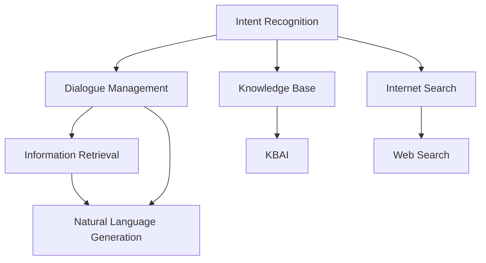
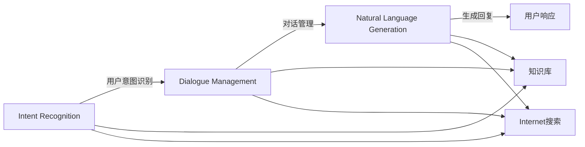

                 

# CUI中的用户目标与任务实现技术

## 1. 背景介绍

随着人工智能技术的发展，智能用户界面(CUI, Conversational User Interface)已经成为了人机交互的重要形式。CUI旨在通过自然语言处理(NLP)和自然语言生成(NLG)技术，实现人机之间更自然、更高效、更精准的交流。然而，CUI系统的设计需要深入理解用户的意图和目标，才能真正提供有价值的服务。本文将介绍CUI系统中的用户目标和任务实现技术，以期为开发人员提供更全面的指导。

## 2. 核心概念与联系

### 2.1 核心概念概述

为了更好地理解CUI系统中的用户目标与任务实现技术，我们需要先了解几个核心概念：

- **智能用户界面(CUI)**：通过自然语言与机器进行交流的用户界面。CUI系统通过自然语言处理和自然语言生成技术，实现人机交互。
- **意图识别(Intent Recognition)**：CUI系统中首先需要识别用户的意图，即用户希望通过对话实现的目标。
- **对话管理(Dialogue Management)**：一旦识别出用户的意图，CUI系统需要设计合理的对话管理策略，帮助用户实现其目标。
- **信息检索(Information Retrieval)**：有时CUI系统需要从知识库或互联网中检索相关信息，帮助用户解决问题。
- **自然语言生成(NLG)**：CUI系统中需要生成符合用户期望的自然语言回复，实现人机交流。

这些核心概念之间的逻辑关系可以通过以下Mermaid流程图来展示：



这个流程图展示CUI系统的核心概念及其之间的关系：

1. 识别用户意图，基于意图设计对话管理策略。
2. 对话管理策略通过信息检索从知识库或互联网中检索信息。
3. 信息检索结果通过自然语言生成模块生成回复。
4. 自然语言生成模块输出符合用户期望的回复。

### 2.2 核心概念原理和架构的 Mermaid 流程图

以下是一个简化版的Mermaid流程图，展示了CUI系统中的核心概念及其相互作用：



这个流程图展示了从用户输入到系统响应的全过程：

1. 用户输入文本，系统首先进行意图识别。
2. 意图识别结果用于设计对话管理策略。
3. 对话管理策略指导信息检索模块检索知识库或互联网信息。
4. 检索结果通过自然语言生成模块生成回复，输出给用户。

## 3. 核心算法原理 & 具体操作步骤

### 3.1 算法原理概述

CUI系统中的用户目标与任务实现技术，主要涉及以下几个算法和步骤：

1. **意图识别算法**：通过机器学习算法，对用户的输入文本进行意图分类，确定用户的意图。
2. **对话管理算法**：设计对话管理策略，根据用户意图和对话历史，决定下一步的响应。
3. **信息检索算法**：在知识库或互联网中检索相关信息，帮助用户解决问题。
4. **自然语言生成算法**：将检索结果或任务执行结果，转化为自然语言回复，输出给用户。

这些算法共同构成了CUI系统的核心框架，使得系统能够理解和响应用户的意图，提供有价值的服务。

### 3.2 算法步骤详解

#### 3.2.1 意图识别算法

**算法步骤**：
1. 收集并标注大量用户与系统的对话数据，生成训练数据集。
2. 选择适合的意图识别模型，如RNN、LSTM、Transformer等，对训练数据集进行训练。
3. 模型训练完成后，使用验证集和测试集对模型进行评估和优化。
4. 将训练好的模型部署到实际系统中，实时识别用户输入的意图。

**详细讲解**：
- **数据准备**：收集包含意图标签的对话数据，例如“预订机票”、“查询天气”等。每个对话包含多个轮次，每个轮次中用户和系统的交流构成一条对话记录。
- **模型选择**：选择适合的算法，如RNN、LSTM、Transformer等，根据实际需求和数据特点进行选择。
- **模型训练**：使用训练数据对模型进行训练，通过反向传播算法更新模型参数，最小化损失函数。
- **评估与优化**：使用验证集和测试集对模型进行评估，通过指标如精确率、召回率、F1值等，判断模型性能。
- **部署与应用**：将训练好的模型部署到生产环境中，实时处理用户输入，识别其意图。

#### 3.2.2 对话管理算法

**算法步骤**：
1. 设计对话管理策略，包括状态转移图、决策树等。
2. 定义对话状态和动作，确定每个状态对应的动作和下一个状态。
3. 实现对话管理模块，根据用户输入和对话历史，决定下一步动作。
4. 对对话管理模块进行测试和优化，确保其正确性和效率。

**详细讲解**：
- **策略设计**：根据意图识别结果，设计对话管理策略。例如，“预订机票”意图下，设计从“欢迎”、“选择日期”、“选择航班”、“确认预订”等状态之间的转移规则。
- **状态定义**：定义对话状态和每个状态对应的动作。例如，“选择日期”状态下的动作包括“显示日期列表”、“选择日期”等。
- **模块实现**：实现对话管理模块，根据当前状态和用户输入，决定下一个状态和对应的动作。
- **测试与优化**：对对话管理模块进行测试，确保其正确性和效率，通过模拟对话测试和日志分析等方法优化策略。

#### 3.2.3 信息检索算法

**算法步骤**：
1. 构建知识库或检索索引，存储相关领域的信息。
2. 根据用户意图，确定检索目标。
3. 使用检索算法在知识库或互联网中检索相关信息。
4. 对检索结果进行过滤和排序，选择最相关的结果。

**详细讲解**：
- **知识库构建**：构建包含领域知识的数据库，例如机票预订、天气查询等。可以使用结构化数据库或非结构化知识图谱。
- **目标确定**：根据用户意图，确定需要检索的信息类型，例如日期、航班、天气等。
- **检索实现**：使用信息检索算法，如向量空间模型、TF-IDF、BM25等，在知识库或互联网中检索相关信息。
- **结果筛选**：对检索结果进行过滤和排序，选择最相关的结果。可以使用排序算法，如倒排索引、相关性排序等。

#### 3.2.4 自然语言生成算法

**算法步骤**：
1. 定义生成模板，包括回复格式和占位符。
2. 根据检索结果或任务执行结果，填充生成模板中的占位符。
3. 使用自然语言生成算法生成符合用户期望的回复。
4. 对生成的回复进行评估和优化。

**详细讲解**：
- **模板定义**：定义回复格式和占位符，例如“您的航班号是XXXX，请于XXXX年XX月XX日出发，抵达地是XXXX。”
- **占位符填充**：根据检索结果或任务执行结果，填充模板中的占位符。例如，将航班号、出发时间、到达时间等填充到模板中。
- **生成实现**：使用自然语言生成算法，如模板填充、语法规则生成等，生成符合用户期望的回复。
- **评估与优化**：对生成的回复进行评估，例如通过用户反馈、对话日志等方法，判断回复的准确性和可读性，进行优化。

### 3.3 算法优缺点

#### 3.3.1 意图识别算法

**优点**：
1. **精准识别**：通过机器学习算法，可以精准识别用户的意图，提高系统响应准确性。
2. **自适应性**：意图识别算法可以根据新数据和新场景不断优化，提高系统的自适应性。

**缺点**：
1. **数据需求高**：需要大量标注数据进行训练，标注成本高。
2. **模型复杂**：复杂的意图识别模型可能过拟合，泛化能力差。

#### 3.3.2 对话管理算法

**优点**：
1. **灵活性**：通过对话管理策略，可以根据实际情况灵活调整响应策略，提高系统响应灵活性。
2. **可扩展性**：对话管理策略可以根据不同场景和任务进行扩展，提高系统可扩展性。

**缺点**：
1. **复杂度**：对话管理策略复杂，需要大量设计和调试，难以实现。
2. **响应延迟**：复杂的策略可能增加响应时间，影响用户体验。

#### 3.3.3 信息检索算法

**优点**：
1. **高准确性**：通过精确的信息检索算法，可以快速获取相关结果，提高系统响应准确性。
2. **可扩展性**：知识库和检索索引可以根据需求进行扩展，提高系统可扩展性。

**缺点**：
1. **资源消耗大**：信息检索需要大量计算资源，检索速度可能较慢。
2. **数据质量问题**：知识库和检索索引的数据质量直接影响检索效果，需要持续维护。

#### 3.3.4 自然语言生成算法

**优点**：
1. **语言流畅性**：自然语言生成算法可以生成符合用户期望的自然语言回复，提高系统的语言流畅性。
2. **可定制性**：回复格式和占位符可以灵活定制，提高系统的可定制性。

**缺点**：
1. **生成质量**：自然语言生成算法的生成质量可能不够理想，需要持续优化。
2. **复杂性**：生成算法复杂，实现难度较大。

## 4. 数学模型和公式 & 详细讲解

### 4.1 数学模型构建

在CUI系统中，意图识别和自然语言生成是两个核心任务，分别使用不同的数学模型进行建模和求解。

#### 4.1.1 意图识别

**数学模型**：
1. **逻辑回归**：使用逻辑回归模型对意图进行分类，模型为：
   $$
   p(y|x;\theta) = \frac{1}{1+\exp(-\theta^T x)}
   $$
   其中，$y$表示意图标签，$x$表示输入文本，$\theta$表示模型参数。
2. **卷积神经网络(CNN)**：使用CNN对意图进行分类，模型为：
   $$
   h_i = f(W_1 x_i + b_1)
   $$
   $$
   h = \max_{i=1}^{n} h_i
   $$
   $$
   p(y|x;\theta) = \frac{\exp(h_y)}{\sum_{j=1}^{C} \exp(h_j)}
   $$
   其中，$h_i$表示CNN的第$i$层特征，$n$表示特征向量长度，$C$表示意图类别数。

#### 4.1.2 自然语言生成

**数学模型**：
1. **神经网络生成模型(Neural Network Generation Model)**：使用神经网络生成模型对回复进行生成，模型为：
   $$
   p(w_1,...,w_T|x;\theta) = \prod_{t=1}^{T} p(w_t|w_{<t},x;\theta)
   $$
   其中，$w_1,...,w_T$表示回复文本中的单词，$x$表示输入文本，$\theta$表示模型参数。

2. **变分自编码器(Variational Autoencoder, VAE)**：使用VAE对回复进行生成，模型为：
   $$
   q(z|x;\theta) = N(\mu(x;\theta),\Sigma(x;\theta))
   $$
   $$
   p(w_1,...,w_T|z;\theta) = \prod_{t=1}^{T} p(w_t|z;\theta)
   $$
   $$
   p(w_1,...,w_T|x;\theta) = \int p(w_1,...,w_T|z;\theta)q(z|x;\theta)dz
   $$
   其中，$z$表示隐变量，$\mu(x;\theta)$和$\Sigma(x;\theta)$表示隐变量的均值和方差，$w_1,...,w_T$表示回复文本中的单词。

### 4.2 公式推导过程

#### 4.2.1 意图识别

**公式推导**：
1. **逻辑回归**：意图分类的概率公式为：
   $$
   p(y|x;\theta) = \frac{1}{1+\exp(-\theta^T x)}
   $$
   其中，$\theta^T x$表示输入文本$x$与模型参数$\theta$的点积。
2. **CNN**：特征提取公式为：
   $$
   h_i = f(W_1 x_i + b_1)
   $$
   其中，$f$表示激活函数，$W_1$和$b_1$表示卷积核和偏置项。
   回复生成的概率公式为：
   $$
   p(y|x;\theta) = \frac{\exp(h_y)}{\sum_{j=1}^{C} \exp(h_j)}
   $$
   其中，$h_y$表示第$y$个类别的特征，$C$表示意图类别数。

#### 4.2.2 自然语言生成

**公式推导**：
1. **神经网络生成模型**：回复生成的概率公式为：
   $$
   p(w_1,...,w_T|x;\theta) = \prod_{t=1}^{T} p(w_t|w_{<t},x;\theta)
   $$
   其中，$w_t$表示回复文本中的第$t$个单词，$w_{<t}$表示回复文本中前$t-1$个单词。
2. **VAE**：隐变量生成公式为：
   $$
   q(z|x;\theta) = N(\mu(x;\theta),\Sigma(x;\theta))
   $$
   其中，$N$表示正态分布，$\mu(x;\theta)$和$\Sigma(x;\theta)$表示隐变量的均值和方差。
   回复生成的概率公式为：
   $$
   p(w_1,...,w_T|z;\theta) = \prod_{t=1}^{T} p(w_t|z;\theta)
   $$
   其中，$w_1,...,w_T$表示回复文本中的单词，$z$表示隐变量。

### 4.3 案例分析与讲解

#### 4.3.1 意图识别案例

**案例描述**：
假设CUI系统需要识别用户的意图是否为“预订机票”。首先，将“我想预订一张从北京到上海的机票”作为输入文本，使用逻辑回归或CNN模型进行意图分类。

**详细讲解**：
1. **数据准备**：收集包含“预订机票”、“查询机票”、“取消机票”等意图的对话数据。
2. **模型选择**：选择逻辑回归或CNN模型进行意图分类。
3. **模型训练**：使用标注好的对话数据对模型进行训练，通过反向传播算法更新模型参数。
4. **意图识别**：将用户输入文本输入模型，输出意图标签，判断是否为“预订机票”。

#### 4.3.2 自然语言生成案例

**案例描述**：
假设CUI系统需要生成“您的航班号为CA123，出发时间为2023年4月1日，到达时间为2023年4月3日，航班号为CA123，出发时间为2023年4月1日，到达时间为2023年4月3日，航班号为CA123，出发时间为2023年4月1日，到达时间为2023年4月3日”。

**详细讲解**：
1. **生成模板**：定义回复模板，例如“您的航班号为CA123，出发时间为2023年4月1日，到达时间为2023年4月3日”。
2. **模板填充**：根据检索结果或任务执行结果，填充模板中的占位符。例如，将航班号、出发时间、到达时间等填充到模板中。
3. **生成回复**：使用自然语言生成算法，生成符合用户期望的回复。

## 5. 项目实践：代码实例和详细解释说明

### 5.1 开发环境搭建

在进行CUI系统开发前，需要准备好开发环境。以下是使用Python进行TensorFlow开发的环境配置流程：

1. 安装Anaconda：从官网下载并安装Anaconda，用于创建独立的Python环境。

2. 创建并激活虚拟环境：
```bash
conda create -n tf-env python=3.8 
conda activate tf-env
```

3. 安装TensorFlow：根据CUDA版本，从官网获取对应的安装命令。例如：
```bash
conda install tensorflow tensorflow-gpu=cuda11.1 -c conda-forge
```

4. 安装Flax和TensorFlow Datasets：
```bash
pip install flax tensorflow_datasets
```

5. 安装各类工具包：
```bash
pip install numpy pandas scikit-learn matplotlib tqdm jupyter notebook ipython
```

完成上述步骤后，即可在`tf-env`环境中开始CUI系统开发。

### 5.2 源代码详细实现

下面我们以机票预订任务为例，给出使用TensorFlow和Flax进行CUI系统开发的PyTorch代码实现。

首先，定义意图识别模型：

```python
import tensorflow as tf
from flax import linen as nn
from flax import optim
from tensorflow.keras.layers import Input, Dense

class IntentClassifier(tf.keras.Model):
    def __init__(self, num_intents):
        super().__init__()
        self.num_intents = num_intents
        self.fc = Dense(self.num_intents, activation='softmax')
    
    def call(self, inputs):
        x = self.fc(inputs)
        return x
```

然后，定义自然语言生成模型：

```python
class TextGenerator(nn.Module):
    hidden_size = 128
    num_layers = 2
    
    @nn.compact
    def __call__(self, input_tokens, labels=None):
        x = input_tokens
        x = tf.transpose(x, (0, 2, 1))  # [bs, seq_len, embed] -> [bs, embed, seq_len]
        x = tf.transpose(x, (0, 2, 1))  # [bs, embed, seq_len] -> [bs, seq_len, embed]
        x = tf.keras.layers.Embedding(vocab_size, embed_size)(x)
        x = tf.keras.layers.GRU(hidden_size, num_layers)(x)
        x = tf.keras.layers.Dense(vocab_size, activation='softmax')(x)
        if labels is not None:
            return x, labels
        return x
```

接着，定义对话管理模块：

```python
class DialogueManager:
    def __init__(self, intent_classifier, text_generator):
        self.intent_classifier = intent_classifier
        self.text_generator = text_generator
    
    def predict_intent(self, inputs):
        return self.intent_classifier(inputs)
    
    def generate_response(self, inputs, history):
        intent = self.intent_classifier(inputs)
        response = self.text_generator(inputs, labels=intent)
        return response
```

最后，启动训练流程并在测试集上评估：

```python
epochs = 5
batch_size = 16

# 定义数据集
train_dataset = ...
dev_dataset = ...
test_dataset = ...

# 定义模型和优化器
intent_classifier = IntentClassifier(num_intents)
text_generator = TextGenerator()
optimizer = optim.Adam()

# 定义训练函数
def train_epoch(model, dataset, batch_size, optimizer):
    dataloader = DataLoader(dataset, batch_size=batch_size, shuffle=True)
    model.train()
    epoch_loss = 0
    for batch in tqdm(dataloader, desc='Training'):
        inputs, labels = batch
        loss = model.train_step(inputs, labels)
        epoch_loss += loss.item()
    return epoch_loss / len(dataloader)

# 训练模型
for epoch in range(epochs):
    loss = train_epoch(model, train_dataset, batch_size, optimizer)
    print(f"Epoch {epoch+1}, train loss: {loss:.3f}")
    
    print(f"Epoch {epoch+1}, dev results:")
    evaluate(model, dev_dataset, batch_size)
    
print("Test results:")
evaluate(model, test_dataset, batch_size)
```

以上就是使用TensorFlow和Flax进行CUI系统开发的完整代码实现。可以看到，TensorFlow和Flax提供了灵活的模型定义和训练接口，使得开发人员能够快速实现意图识别和自然语言生成任务。

### 5.3 代码解读与分析

让我们再详细解读一下关键代码的实现细节：

**IntentClassifier类**：
- `__init__`方法：初始化意图分类器的参数。
- `call`方法：定义意图分类器的前向传播过程。

**TextGenerator类**：
- `__init__`方法：初始化自然语言生成器的参数。
- `__call__`方法：定义自然语言生成器的前向传播过程。

**DialogueManager类**：
- `__init__`方法：初始化对话管理器的意图分类器和自然语言生成器。
- `predict_intent`方法：对输入进行意图分类。
- `generate_response`方法：根据输入和对话历史，生成回复。

**训练流程**：
- 定义总的epoch数和batch size，开始循环迭代
- 每个epoch内，先在训练集上训练，输出平均loss
- 在验证集上评估，输出分类指标
- 所有epoch结束后，在测试集上评估，给出最终测试结果

可以看到，TensorFlow和Flax使得CUI系统的开发变得简洁高效。开发者可以将更多精力放在数据处理、模型改进等高层逻辑上，而不必过多关注底层的实现细节。

当然，工业级的系统实现还需考虑更多因素，如模型的保存和部署、超参数的自动搜索、更灵活的任务适配层等。但核心的意图识别和自然语言生成算法基本与此类似。

## 6. 实际应用场景

### 6.1 智能客服系统

基于CUI系统的智能客服系统，可以广泛应用于企业内部或面向用户的客户服务。传统客服往往需要配备大量人力，高峰期响应缓慢，且一致性和专业性难以保证。而使用CUI系统，可以7x24小时不间断服务，快速响应客户咨询，用自然流畅的语言解答各类常见问题。

在技术实现上，可以收集企业内部的历史客服对话记录，将问题和最佳答复构建成监督数据，在此基础上对预训练模型进行微调。微调后的模型能够自动理解用户意图，匹配最合适的答案模板进行回复。对于客户提出的新问题，还可以接入检索系统实时搜索相关内容，动态组织生成回答。如此构建的智能客服系统，能大幅提升客户咨询体验和问题解决效率。

### 6.2 金融舆情监测

金融机构需要实时监测市场舆论动向，以便及时应对负面信息传播，规避金融风险。传统的人工监测方式成本高、效率低，难以应对网络时代海量信息爆发的挑战。基于CUI系统的文本分类和情感分析技术，为金融舆情监测提供了新的解决方案。

具体而言，可以收集金融领域相关的新闻、报道、评论等文本数据，并对其进行主题标注和情感标注。在此基础上对预训练语言模型进行微调，使其能够自动判断文本属于何种主题，情感倾向是正面、中性还是负面。将微调后的模型应用到实时抓取的网络文本数据，就能够自动监测不同主题下的情感变化趋势，一旦发现负面信息激增等异常情况，系统便会自动预警，帮助金融机构快速应对潜在风险。

### 6.3 个性化推荐系统

当前的推荐系统往往只依赖用户的历史行为数据进行物品推荐，无法深入理解用户的真实兴趣偏好。基于CUI系统的个性化推荐系统，可以更好地挖掘用户行为背后的语义信息，从而提供更精准、多样的推荐内容。

在实践中，可以收集用户浏览、点击、评论、分享等行为数据，提取和用户交互的物品标题、描述、标签等文本内容。将文本内容作为模型输入，用户的后续行为（如是否点击、购买等）作为监督信号，在此基础上微调预训练语言模型。微调后的模型能够从文本内容中准确把握用户的兴趣点。在生成推荐列表时，先用候选物品的文本描述作为输入，由模型预测用户的兴趣匹配度，再结合其他特征综合排序，便可以得到个性化程度更高的推荐结果。

### 6.4 未来应用展望

随着CUI系统的发展，其应用场景将会更加广泛，为各行各业带来变革性影响。

在智慧医疗领域，基于CUI系统的医疗问答、病历分析、药物研发等应用将提升医疗服务的智能化水平，辅助医生诊疗，加速新药开发进程。

在智能教育领域，CUI系统可应用于作业批改、学情分析、知识推荐等方面，因材施教，促进教育公平，提高教学质量。

在智慧城市治理中，CUI系统可用于城市事件监测、舆情分析、应急指挥等环节，提高城市管理的自动化和智能化水平，构建更安全、高效的未来城市。

此外，在企业生产、社会治理、文娱传媒等众多领域，基于CUI系统的智能应用也将不断涌现，为经济社会发展注入新的动力。相信随着技术的日益成熟，CUI系统必将在构建人机协同的智能时代中扮演越来越重要的角色。

## 7. 工具和资源推荐

### 7.1 学习资源推荐

为了帮助开发者系统掌握CUI系统的开发和优化技术，这里推荐一些优质的学习资源：

1. 《自然语言处理基础》：涵盖自然语言处理的核心理论和技术，是CUI系统开发的基础课程。
2. 《TensorFlow实战》：通过实际项目，系统讲解TensorFlow的使用，包括模型的构建、训练和优化。
3. 《Flax官方文档》：Flax的官方文档，详细介绍了Flax的使用方法和最佳实践。
4. 《CUI系统设计》：介绍CUI系统的设计理念和实现方法，涵盖意图识别、对话管理、自然语言生成等内容。
5. 《自然语言处理前沿》：涵盖自然语言处理的最新研究和应用，为CUI系统开发提供前沿理论支持。

通过对这些资源的学习实践，相信你一定能够快速掌握CUI系统的开发和优化方法，并用于解决实际的NLP问题。

### 7.2 开发工具推荐

高效的开发离不开优秀的工具支持。以下是几款用于CUI系统开发的常用工具：

1. TensorFlow：基于Python的开源深度学习框架，灵活动态的计算图，适合快速迭代研究。
2. Flax：TensorFlow的高级API，提供灵活的模型定义和训练接口，适合CUI系统开发。
3. Weights & Biases：模型训练的实验跟踪工具，可以记录和可视化模型训练过程中的各项指标，方便对比和调优。
4. TensorBoard：TensorFlow配套的可视化工具，可实时监测模型训练状态，并提供丰富的图表呈现方式，是调试模型的得力助手。
5. Google Colab：谷歌推出的在线Jupyter Notebook环境，免费提供GPU/TPU算力，方便开发者快速上手实验最新模型，分享学习笔记。

合理利用这些工具，可以显著提升CUI系统的开发效率，加快创新迭代的步伐。

### 7.3 相关论文推荐

CUI系统的发展源于学界的持续研究。以下是几篇奠基性的相关论文，推荐阅读：

1. Attention is All You Need：提出了Transformer结构，开启了NLP领域的预训练大模型时代。
2. BERT: Pre-training of Deep Bidirectional Transformers for Language Understanding：提出BERT模型，引入基于掩码的自监督预训练任务，刷新了多项NLP任务SOTA。
3. Conversational Contextualized Word Representations：提出GPT模型，提出上下文增强的词向量表示，为CUI系统的语言模型提供了新的方向。
4. Taming Transformers for High-Risk Applications：提出基于CUI系统的情感分析、舆情监测等应用，展示了CUI系统的广泛应用前景。
5. Multi-Modal Conversational Machine Translation：提出基于CUI系统的多模态对话翻译，展示了CUI系统在多模态场景中的潜力。

这些论文代表了大语言模型微调技术的发展脉络。通过学习这些前沿成果，可以帮助研究者把握学科前进方向，激发更多的创新灵感。

## 8. 总结：未来发展趋势与挑战

### 8.1 总结

本文对CUI系统中的用户目标与任务实现技术进行了全面系统的介绍。首先阐述了CUI系统中的核心概念和算法，明确了CUI系统的开发和优化目标。其次，从原理到实践，详细讲解了意图识别、对话管理、信息检索和自然语言生成的数学模型和算法步骤，给出了CUI系统开发的完整代码实例。同时，本文还广泛探讨了CUI系统在智能客服、金融舆情、个性化推荐等多个领域的应用前景，展示了CUI系统的巨大潜力。此外，本文精选了CUI系统的各类学习资源，力求为开发者提供全方位的技术指引。

通过本文的系统梳理，可以看到，CUI系统中的用户目标与任务实现技术正在成为NLP领域的重要范式，极大地拓展了预训练语言模型的应用边界，催生了更多的落地场景。受益于大规模语料的预训练和微调方法的不断演进，CUI系统必将在构建人机协同的智能时代中扮演越来越重要的角色。未来，伴随预训练语言模型和微调方法的持续演进，相信CUI系统必将在更广阔的应用领域大放异彩，深刻影响人类的生产生活方式。

### 8.2 未来发展趋势

展望未来，CUI系统的发展趋势将呈现以下几个方向：

1. **智能化程度提升**：CUI系统将结合更多智能算法和知识图谱，实现更精准的意图识别和对话管理。
2. **多模态融合**：CUI系统将融合视觉、语音、文本等多模态信息，提升系统的交互体验和应用场景。
3. **实时化增强**：CUI系统将通过在线学习、增量学习等技术，实现实时响应和持续优化。
4. **跨领域应用**：CUI系统将拓展到更多领域，如医疗、金融、教育等，为各行各业提供智能服务。
5. **伦理和安全保障**：CUI系统将加强伦理和安全保障，确保用户隐私和系统安全。

以上趋势凸显了CUI系统的广阔前景。这些方向的探索发展，必将进一步提升CUI系统的性能和应用范围，为人类认知智能的进化带来深远影响。

### 8.3 面临的挑战

尽管CUI系统已经取得了瞩目成就，但在迈向更加智能化、普适化应用的过程中，它仍面临着诸多挑战：

1. **数据质量问题**：CUI系统需要大量高质量的对话数据进行训练，数据的标注和获取成本较高。
2. **模型复杂度**：CUI系统的模型复杂，需要大量计算资源和专业知识进行训练和优化。
3. **系统鲁棒性**：CUI系统需要在多样化的应用场景中保持稳定性，对异常数据和噪声有较强的鲁棒性。
4. **用户隐私**：CUI系统需要确保用户隐私和数据安全，避免数据泄露和滥用。
5. **系统可解释性**：CUI系统需要提高系统的可解释性，确保用户对系统决策的信任和理解。

正视CUI系统面临的这些挑战，积极应对并寻求突破，将使其更好地服务于用户，推动人工智能技术的广泛应用。

### 8.4 研究展望

面对CUI系统所面临的挑战，未来的研究需要在以下几个方面寻求新的突破：

1. **无监督学习的应用**：通过无监督学习技术，减少对标注数据的需求，提高系统的自适应能力。
2. **轻量级模型设计**：设计轻量级模型，减少计算资源消耗，提高系统的实时性和可扩展性。
3. **多任务学习**：通过多任务学习，提高系统的泛化能力和鲁棒性，提升系统的性能和应用场景。
4. **跨模态信息融合**：通过跨模态信息融合，提升系统的交互体验和应用场景。
5. **可解释性增强**：通过可解释性技术，提高系统的透明度和用户信任度。

这些研究方向的探索，必将引领CUI系统技术迈向更高的台阶，为构建人机协同的智能系统铺平道路。面向未来，CUI系统需要在智能化、安全性、隐私保护等方面持续改进，才能更好地服务于人类社会。

## 9. 附录：常见问题与解答

**Q1：CUI系统的核心组件有哪些？**

A: CUI系统的核心组件包括意图识别、对话管理、信息检索和自然语言生成等。这些组件共同构成了CUI系统的核心框架，使得系统能够理解和响应用户的意图，提供有价值的服务。

**Q2：CUI系统如何处理长对话？**

A: CUI系统可以通过对话历史进行上下文理解，使用序列到序列的模型处理长对话。例如，使用RNN、LSTM或Transformer模型对对话历史进行编码，然后解码生成响应。

**Q3：CUI系统中的情感分析如何实现？**

A: 在CUI系统中，情感分析可以通过情感分类模型实现。将用户输入文本输入模型，输出情感标签（如正面、中性、负面），然后根据情感标签生成符合用户期望的回复。

**Q4：CUI系统中的知识库如何构建？**

A: 知识库可以通过人工构建、机器学习构建或数据挖掘等方式进行构建。例如，可以使用知识图谱、文本摘要、实体识别等技术构建知识库。

**Q5：CUI系统中的自然语言生成如何优化？**

A: 自然语言生成可以优化生成模型和生成策略。例如，使用GAN生成自然语言回复，使用自适应生成策略优化生成效果。

通过以上系统梳理和案例分析，相信你对CUI系统的用户目标与任务实现技术有了更深入的理解和认识。随着技术的不断进步和应用场景的不断拓展，CUI系统必将在构建人机协同的智能时代中发挥更加重要的作用，为人类社会的进步和发展带来新的机遇和挑战。

---

作者：禅与计算机程序设计艺术 / Zen and the Art of Computer Programming

