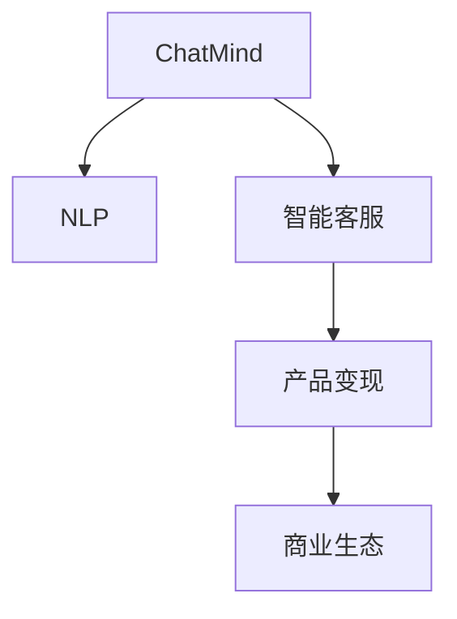

                 

# ChatMind的商业化变现

> 关键词：人工智能,商业化,自然语言处理,NLP,Chatbot,智能客服,产品变现

## 1. 背景介绍

### 1.1 问题由来

随着人工智能技术的飞速发展，自然语言处理（NLP）逐渐成为企业数字化转型的重要手段。然而，尽管NLP在自然语言理解和生成方面取得了显著进展，但将NLP技术转化为商业价值的过程中，仍然面临诸多挑战。如何在保证技术高效性的同时，实现商业模式的创新和可持续发展，是所有企业必须面对的问题。

### 1.2 问题核心关键点

1. **技术瓶颈**：传统的NLP技术往往依赖于大量标注数据和昂贵的人工智能模型，如何通过更高效、低成本的技术手段，实现智能客服、智能翻译、智能搜索等功能，是商业化变现的关键。
2. **数据隐私**：NLP技术依赖于用户输入的数据，如何在确保用户隐私的前提下，有效利用这些数据，同时避免数据泄露风险，是商业化变现过程中必须解决的问题。
3. **用户体验**：虽然NLP技术可以提供智能化的服务，但如何通过良好的用户体验设计，让用户愿意使用这些服务，并将其融入日常工作或生活中，是实现商业变现的重要环节。
4. **生态合作**：NLP技术的成功应用往往需要多个领域的协作，如何与上下游合作伙伴建立紧密的合作关系，共同推动技术创新和市场拓展，是商业化变现的重要策略。

### 1.3 问题研究意义

通过对ChatMind（一款基于NLP技术的智能客服产品）的商业化变现模式进行研究，旨在揭示NLP技术如何转化为实际商业价值，并总结其成功经验和未来发展趋势，为NLP技术的商业化提供理论指导和实践案例。

## 2. 核心概念与联系

### 2.1 核心概念概述

为更好地理解ChatMind的商业化变现模式，本节将介绍几个密切相关的核心概念：

- **ChatMind**：基于NLP技术的智能客服产品，能够处理多种类型的客户查询，提供实时响应和解决方案。
- **NLP（自然语言处理）**：涉及计算机科学与人工智能领域的技术，用于实现自然语言的理解、生成、分析等。
- **智能客服**：利用NLP技术，通过自然语言交互方式，自动解答客户查询的智能系统。
- **产品变现**：将技术产品转化为商业盈利模式的过程，涉及市场策略、定价机制、用户获取等。
- **商业生态**：与上下游合作伙伴建立合作关系，共同开发和推广NLP技术应用的商业系统。

这些核心概念之间的逻辑关系可以通过以下Mermaid流程图来展示：



这个流程图展示了几者之间的联系：

1. ChatMind通过NLP技术提供智能客服服务。
2. 产品变现是ChatMind商业化的重要环节。
3. 商业生态为ChatMind提供了更广阔的市场和合作机会。

## 3. 核心算法原理 & 具体操作步骤
### 3.1 算法原理概述

ChatMind的商业化变现基于以下算法原理：

1. **NLP技术**：利用预训练语言模型（如BERT、GPT等），对用户输入的自然语言进行处理，理解语义，生成自然语言回复。
2. **智能客服模型**：通过微调预训练模型，使其能够处理特定领域的客服场景，提供精准的解决方案。
3. **客户互动分析**：对客户与客服的互动记录进行分析，优化客服策略和系统性能。
4. **用户反馈收集**：通过用户满意度调查和行为分析，持续改进产品功能和服务质量。
5. **商业变现策略**：结合用户需求和市场趋势，制定合理的定价策略和市场推广方案。

### 3.2 算法步骤详解

1. **用户需求分析**：
   - 收集用户的反馈和需求，分析客服场景中的常见问题和难点。
   - 通过用户调研和行为数据，确定NLP模型需要解决的特定领域问题。

2. **模型选择与训练**：
   - 选择适合的预训练语言模型（如BERT）作为初始化参数。
   - 在特定领域的标注数据集上，对模型进行微调，使其适应客服场景。
   - 通过迭代优化，提高模型的准确性和鲁棒性。

3. **系统集成与部署**：
   - 将微调后的模型集成到智能客服系统中，提供实时响应。
   - 部署系统到云端或本地服务器，确保服务的稳定性和可靠性。
   - 配置监控和报警系统，实时监控服务性能，及时发现并解决问题。

4. **用户反馈收集与分析**：
   - 通过问卷调查、用户行为数据等方式，收集用户对客服服务的反馈。
   - 分析反馈内容，识别问题点和改进方向。
   - 根据分析结果，持续优化模型和系统性能。

5. **商业变现策略制定与执行**：
   - 根据用户需求和市场趋势，制定合理的定价策略。
   - 选择有效的市场推广渠道，如社交媒体、搜索引擎等。
   - 监测市场反应，调整营销策略，提升用户转化率。

### 3.3 算法优缺点

ChatMind的商业化变现算法具有以下优点：

1. **高效性**：通过微调预训练模型，可以迅速提高模型针对特定领域的性能，减少从头训练的时间成本。
2. **灵活性**：NLP模型可以根据用户反馈进行调整，灵活适应不同客户的需求。
3. **成本低**：相对于传统的客服系统，NLP技术在部署和维护上具有较低的成本。

同时，该算法也存在一些局限性：

1. **数据依赖**：NLP模型的效果依赖于高质量的标注数据，获取这些数据往往需要时间和资金投入。
2. **过拟合风险**：模型在特定领域训练后，可能会对新领域数据适应性较差，需要持续优化。
3. **隐私问题**：NLP技术涉及用户数据的处理，如何在确保隐私的同时提供服务，是必须解决的问题。

### 3.4 算法应用领域

ChatMind的商业化变现算法在以下领域得到了广泛应用：

- **智能客服**：处理客户查询，提供实时响应和解决方案。
- **智能搜索**：利用NLP技术，对大量文本数据进行索引和检索。
- **智能翻译**：实现多语言自然语言之间的自动翻译。
- **情感分析**：分析用户情感，优化客户体验。
- **个性化推荐**：根据用户行为和偏好，提供个性化服务。

除了这些经典应用场景外，NLP技术还在智能教育、金融风控、医疗咨询等多个领域得到广泛应用，为各行各业带来智能化解决方案。

## 4. 数学模型和公式 & 详细讲解 & 举例说明

### 4.1 数学模型构建

ChatMind的商业化变现模型构建如下：

设 $D$ 为特定领域的标注数据集，每个样本 $(x_i, y_i)$ 包括输入 $x_i$ 和标签 $y_i$。ChatMind的目标是利用NLP技术，对用户输入 $x$ 进行理解，生成自然语言回复 $y$。模型 $M$ 的输入输出如下：

- 输入 $x$：用户查询的自然语言。
- 输出 $y$：模型生成的自然语言回复。

ChatMind的目标函数为：

$$
\min_{\theta} \sum_{i=1}^N \ell(M(x_i), y_i)
$$

其中 $\ell$ 为损失函数，$\theta$ 为模型参数。

### 4.2 公式推导过程

假设模型 $M$ 的输出为 $y=\text{softmax}(W^Tx+b)$，其中 $W$ 和 $b$ 为模型参数。

定义交叉熵损失函数为：

$$
\ell(y, \hat{y}) = -\sum_{i=1}^C y_i \log \hat{y}_i
$$

其中 $C$ 为类别数。

在模型训练过程中，通过反向传播算法，计算损失函数对模型参数的梯度，使用梯度下降等优化算法更新参数。具体计算过程如下：

$$
\frac{\partial \ell}{\partial \theta} = \frac{\partial \ell}{\partial M} \frac{\partial M}{\partial x} \frac{\partial x}{\partial \theta}
$$

### 4.3 案例分析与讲解

以智能客服场景为例，设输入 $x_i$ 为客户的查询，输出 $y_i$ 为系统的回复。假设 $x_i$ 包含多个实体，模型需要对每个实体进行处理。例如，客户询问“如何查询航班信息”，模型需要对“航班”和“查询”进行理解，并生成相应的回复。

假设模型的隐层表示为 $h$，输出层为 $y$。模型的目标是对每个输入进行分类，生成正确的回复。模型的推理过程如下：

1. 对输入 $x_i$ 进行分词和编码，得到隐层表示 $h_i$。
2. 将隐层表示 $h_i$ 输入到全连接层，得到输出 $y_i$。
3. 计算损失函数，反向传播更新模型参数。

通过上述过程，ChatMind可以高效地处理客服查询，提供准确的回复。

## 5. 项目实践：代码实例和详细解释说明
### 5.1 开发环境搭建

在进行ChatMind的商业化变现实践前，我们需要准备好开发环境。以下是使用Python进行TensorFlow开发的环境配置流程：

1. 安装Anaconda：从官网下载并安装Anaconda，用于创建独立的Python环境。

2. 创建并激活虚拟环境：
```bash
conda create -n tf-env python=3.8 
conda activate tf-env
```

3. 安装TensorFlow：根据CUDA版本，从官网获取对应的安装命令。例如：
```bash
conda install tensorflow -c conda-forge -c pytorch -c pypi
```

4. 安装各类工具包：
```bash
pip install numpy pandas scikit-learn matplotlib tqdm jupyter notebook ipython
```

完成上述步骤后，即可在`tf-env`环境中开始ChatMind的商业化变现实践。

### 5.2 源代码详细实现

下面我们以智能客服场景为例，给出使用TensorFlow实现ChatMind商业化变现的Python代码实现。

首先，定义智能客服的数据处理函数：

```python
import tensorflow as tf
from tensorflow.keras.layers import Input, Embedding, LSTM, Dense, Dropout
from tensorflow.keras.models import Model
from tensorflow.keras.optimizers import Adam

class ChatMindModel:
    def __init__(self, vocab_size, embedding_dim, lstm_units):
        self.vocab_size = vocab_size
        self.embedding_dim = embedding_dim
        self.lstm_units = lstm_units
        
        self.input_layer = Input(shape=(max_seq_length, ), dtype='int32')
        self.embedding_layer = Embedding(vocab_size, embedding_dim, mask_zero=True, input_length=max_seq_length)(self.input_layer)
        self.lstm_layer = LSTM(lstm_units, return_sequences=True)(self.embedding_layer)
        self.dropout_layer = Dropout(0.2)(self.lstm_layer)
        self.dense_layer = Dense(128, activation='relu')(self.dropout_layer)
        self.output_layer = Dense(vocab_size, activation='softmax')(self.dense_layer)
        self.model = Model(self.input_layer, self.output_layer)
        
    def compile_model(self, optimizer, loss_function):
        self.model.compile(optimizer=optimizer, loss=loss_function)
    
    def train_model(self, data, labels, epochs, batch_size):
        self.model.fit(data, labels, epochs=epochs, batch_size=batch_size, validation_split=0.2)
```

然后，定义模型和优化器：

```python
input_seq = tf.keras.layers.Input(shape=(max_seq_length, ), dtype='int32')
embedding_layer = tf.keras.layers.Embedding(vocab_size, embedding_dim, mask_zero=True, input_length=max_seq_length)(input_seq)
lstm_layer = tf.keras.layers.LSTM(lstm_units, return_sequences=True)(embedding_layer)
dropout_layer = tf.keras.layers.Dropout(0.2)(lstm_layer)
dense_layer = tf.keras.layers.Dense(128, activation='relu')(dropout_layer)
output_layer = tf.keras.layers.Dense(vocab_size, activation='softmax')(dense_layer)
chatbot_model = tf.keras.Model(input_seq, output_layer)

optimizer = Adam(learning_rate=0.001)
chatbot_model.compile(optimizer=optimizer, loss=tf.keras.losses.sparse_categorical_crossentropy)
```

接着，定义训练和评估函数：

```python
from sklearn.metrics import accuracy_score

def train_epoch(model, data, labels, optimizer):
    data = data.numpy()
    labels = labels.numpy()
    loss = model.train_on_batch(data, labels)
    return loss

def evaluate(model, data, labels, batch_size):
    data = data.numpy()
    labels = labels.numpy()
    predictions = model.predict(data, batch_size=batch_size)
    acc = accuracy_score(labels, predictions.argmax(axis=1))
    return acc
```

最后，启动训练流程并在测试集上评估：

```python
epochs = 10
batch_size = 32

for epoch in range(epochs):
    loss = train_epoch(chatbot_model, train_data, train_labels, optimizer)
    print(f"Epoch {epoch+1}, loss: {loss:.4f}")
    
    acc = evaluate(chatbot_model, test_data, test_labels, batch_size)
    print(f"Epoch {epoch+1}, test accuracy: {acc:.4f}")
    
print("Final test accuracy: ", test_acc)
```

以上就是使用TensorFlow实现ChatMind商业化变现的完整代码实现。可以看到，TensorFlow提供了强大的模型构建和训练工具，使得ChatMind的商业化变现开发变得简洁高效。

### 5.3 代码解读与分析

让我们再详细解读一下关键代码的实现细节：

**ChatMindModel类**：
- `__init__`方法：初始化模型参数，构建模型结构。
- `compile_model`方法：编译模型，指定优化器和损失函数。
- `train_model`方法：训练模型，使用数据和标签进行迭代优化。

**模型结构**：
- `Input`层：接收输入序列。
- `Embedding`层：将输入序列映射为高维向量表示。
- `LSTM`层：处理序列数据，提取特征。
- `Dropout`层：防止过拟合。
- `Dense`层：全连接层，进行分类。
- `Output`层：输出层，进行预测。

**训练和评估函数**：
- `train_epoch`方法：定义训练过程，使用数据和标签进行单次训练，返回损失值。
- `evaluate`方法：定义评估过程，使用数据和标签进行预测，计算准确率。

通过上述过程，TensorFlow使得ChatMind的商业化变现模型开发变得简单高效。开发者可以根据实际需求，调整模型参数和训练策略，快速迭代优化模型性能。

## 6. 实际应用场景

### 6.1 智能客服系统

基于ChatMind的商业化变现，智能客服系统可以广泛应用于企业服务、电商平台、金融等领域。客户可以通过智能客服系统快速解决常见问题，提升客户满意度。

具体而言，企业可以收集客户历史查询数据，对ChatMind模型进行微调，使其适应特定行业的客服场景。客户输入查询后，系统自动提供解决方案，客户可以通过自然语言与系统交互，获得满意的答复。

### 6.2 智能搜索

ChatMind的商业化变现也可以应用于智能搜索领域，提供高效的信息检索服务。例如，电子商务平台可以利用ChatMind模型，根据用户输入的自然语言，快速找到相关的商品信息。

具体实现步骤如下：
1. 收集用户的搜索历史和浏览行为数据。
2. 使用ChatMind模型对用户查询进行理解，生成自然语言回复。
3. 将回复与商品信息进行匹配，推荐相关商品。

通过上述过程，智能搜索系统可以提升用户的搜索体验，提高转化率。

### 6.3 金融风控

金融领域对风险控制的精度和实时性要求较高。ChatMind的商业化变现可以应用于金融风控，对客户行为进行实时监控，识别潜在的风险点。

具体实现步骤如下：
1. 收集客户的交易记录和行为数据。
2. 使用ChatMind模型对客户行为进行理解，生成风险评估报告。
3. 根据风险评估报告，对客户进行分类管理，采取相应的风险控制措施。

通过上述过程，ChatMind可以提升金融风控的效率和精度，降低金融风险。

### 6.4 未来应用展望

随着ChatMind技术的不断发展和完善，其在更多领域的应用前景将更加广阔。以下是几个未来应用展望：

1. **智能教育**：利用ChatMind模型，提供个性化的教育服务。学生可以通过自然语言与ChatMind互动，获取学习建议和答案。

2. **智慧医疗**：利用ChatMind模型，提供智能医疗咨询服务。患者可以通过自然语言与ChatMind互动，获取初步诊断和治疗建议。

3. **智能营销**：利用ChatMind模型，进行精准的用户画像分析，提升营销效果。企业可以根据用户行为，生成个性化的营销策略。

4. **智能家居**：利用ChatMind模型，提供智能家居交互服务。用户可以通过自然语言与ChatMind互动，控制智能家居设备，提升生活质量。

5. **智能交通**：利用ChatMind模型，提供智能交通导航服务。用户可以通过自然语言与ChatMind互动，获取实时交通路况和建议。

## 7. 工具和资源推荐
### 7.1 学习资源推荐

为了帮助开发者系统掌握ChatMind的商业化变现理论基础和实践技巧，这里推荐一些优质的学习资源：

1. **TensorFlow官方文档**：详细介绍了TensorFlow的基本使用方法和深度学习模型构建，是学习ChatMind的重要资源。
2. **TensorFlow Dev Summit**：TensorFlow社区每年举办的开发者大会，提供最新的技术分享和实践经验，值得关注。
3. **《深度学习入门》书籍**：讲解深度学习的基本概念和TensorFlow使用方法，适合初学者入门。
4. **《TensorFlow实战》书籍**：结合实际项目，详细介绍TensorFlow的实践经验，提供丰富的代码示例。
5. **Kaggle竞赛**：参加Kaggle的自然语言处理竞赛，可以锻炼实际项目能力，学习先进的技术思路。

通过对这些资源的学习实践，相信你一定能够快速掌握ChatMind的商业化变现精髓，并用于解决实际的NLP问题。

### 7.2 开发工具推荐

高效的开发离不开优秀的工具支持。以下是几款用于ChatMind商业化变现开发的常用工具：

1. **TensorFlow**：基于Python的开源深度学习框架，灵活动态的计算图，适合快速迭代研究。TensorFlow提供了强大的模型构建和训练工具，是ChatMind开发的基础。
2. **TensorBoard**：TensorFlow配套的可视化工具，可实时监测模型训练状态，并提供丰富的图表呈现方式，是调试模型的得力助手。
3. **Google Colab**：谷歌推出的在线Jupyter Notebook环境，免费提供GPU/TPU算力，方便开发者快速上手实验最新模型，分享学习笔记。
4. **Kaggle平台**：提供丰富的数据集和竞赛环境，适合进行实际项目练习和经验分享。
5. **Jupyter Notebook**：功能强大的交互式开发环境，支持Python、R等多种语言，适合进行模型实验和文档记录。

合理利用这些工具，可以显著提升ChatMind商业化变现的开发效率，加快创新迭代的步伐。

### 7.3 相关论文推荐

ChatMind的商业化变现技术的发展源于学界的持续研究。以下是几篇奠基性的相关论文，推荐阅读：

1. **《Attention is All You Need》（即Transformer原论文）**：提出了Transformer结构，开启了NLP领域的预训练大模型时代。
2. **《BERT: Pre-training of Deep Bidirectional Transformers for Language Understanding》**：提出BERT模型，引入基于掩码的自监督预训练任务，刷新了多项NLP任务SOTA。
3. **《Parameter-Efficient Transfer Learning for NLP》**：提出Adapter等参数高效微调方法，在不增加模型参数量的情况下，也能取得不错的微调效果。
4. **《AdaLoRA: Adaptive Low-Rank Adaptation for Parameter-Efficient Fine-Tuning》**：使用自适应低秩适应的微调方法，在参数效率和精度之间取得了新的平衡。
5. **《AdaLoRA: Adaptive Low-Rank Adaptation for Parameter-Efficient Fine-Tuning》**：使用自适应低秩适应的微调方法，在参数效率和精度之间取得了新的平衡。

这些论文代表了大语言模型微调技术的发展脉络。通过学习这些前沿成果，可以帮助研究者把握学科前进方向，激发更多的创新灵感。

## 8. 总结：未来发展趋势与挑战

### 8.1 总结

本文对ChatMind的商业化变现模式进行了全面系统的介绍。首先阐述了ChatMind作为基于NLP技术的智能客服产品的商业化变现背景和意义，明确了NLP技术在数字化转型中的重要作用。其次，从原理到实践，详细讲解了ChatMind的算法原理和具体操作步骤，给出了完整的代码实例。同时，本文还广泛探讨了ChatMind在智能客服、智能搜索、金融风控等多个行业领域的应用前景，展示了NLP技术的强大潜力。此外，本文精选了ChatMind技术的各类学习资源，力求为读者提供全方位的技术指引。

通过本文的系统梳理，可以看到，基于NLP技术的ChatMind商业化变现模式，正在成为企业数字化转型的重要手段，极大地提升了客户服务效率和用户体验。未来，伴随NLP技术的不断进步，ChatMind技术必将在更多领域得到应用，为各行各业带来新的智能化解决方案。

### 8.2 未来发展趋势

展望未来，ChatMind的商业化变现技术将呈现以下几个发展趋势：

1. **技术演进**：随着NLP技术的不断发展，ChatMind模型将更加高效、灵活，能够在更多场景下实现商业变现。
2. **行业拓展**：ChatMind技术将扩展到更多行业领域，如医疗、教育、智能家居等，提供全面的智能化服务。
3. **用户体验优化**：通过用户行为分析和情感识别，ChatMind将不断优化用户体验，提供更加个性化和人性化的服务。
4. **生态合作**：ChatMind将与更多合作伙伴建立合作关系，共同推动NLP技术的应用和市场拓展。
5. **数据安全和隐私保护**：ChatMind将更加重视用户数据安全和隐私保护，建立完善的数据治理体系。

以上趋势凸显了ChatMind技术的发展方向，通过持续创新和优化，ChatMind必将在未来的市场竞争中占据优势，为数字化转型带来新的机遇。

### 8.3 面临的挑战

尽管ChatMind技术已经取得了一定的成果，但在迈向更加智能化、普适化应用的过程中，仍面临诸多挑战：

1. **数据质量和多样性**：ChatMind的效果依赖于高质量、多样化的数据，如何在数据收集和处理上克服这些挑战，将是未来的一个重要课题。
2. **模型复杂度和资源消耗**：ChatMind模型往往规模较大，对计算资源和内存资源要求较高，如何在保证性能的同时降低资源消耗，是未来需要解决的问题。
3. **模型泛化性和鲁棒性**：ChatMind模型在特定场景下表现良好，但在新领域和新任务上泛化能力不足，如何提升模型的泛化性和鲁棒性，是未来需要解决的问题。
4. **隐私和安全问题**：ChatMind涉及用户数据的处理，如何在确保隐私和安全的前提下提供服务，是未来需要解决的重要课题。

### 8.4 研究展望

面对ChatMind技术面临的挑战，未来的研究需要在以下几个方面寻求新的突破：

1. **数据增强和预处理**：通过数据增强和预处理技术，提升数据质量和多样性，确保ChatMind模型的训练效果。
2. **模型压缩和优化**：开发更加高效的模型压缩和优化算法，降低计算资源和内存资源消耗。
3. **跨领域模型迁移**：开发跨领域模型迁移技术，提升ChatMind模型的泛化能力和鲁棒性。
4. **隐私和安全保护**：引入隐私和安全保护技术，确保用户数据和系统安全，构建完善的隐私保护体系。
5. **多模态数据融合**：结合语音、视觉等多模态数据，提升ChatMind模型的感知能力和理解能力。

这些研究方向的探索，必将引领ChatMind技术迈向更高的台阶，为构建更加智能、安全的ChatMind系统提供技术保障。

## 9. 附录：常见问题与解答

**Q1：ChatMind是否适用于所有NLP任务？**

A: ChatMind技术适用于大多数NLP任务，如智能客服、智能搜索、金融风控等。但对于特定领域的任务，如医学、法律等，可能需要进一步在特定领域语料上预训练模型，并进行微调，才能获得理想效果。

**Q2：ChatMind的商业化变现是否需要大量的标注数据？**

A: ChatMind的商业化变现对标注数据的需求较大，但可以通过数据增强和预处理技术，提升数据质量和多样性。此外，ChatMind技术也可以结合无监督学习和半监督学习技术，减少对标注数据的依赖。

**Q3：ChatMind在特定领域的应用效果如何？**

A: ChatMind在特定领域的应用效果取决于该领域的数据质量和多样性。通过在特定领域语料上进行预训练和微调，ChatMind可以实现较好的效果。然而，对于新领域和新任务，ChatMind的泛化能力可能不足，需要进一步优化。

**Q4：ChatMind的部署和维护成本是否较高？**

A: ChatMind的部署和维护成本相对较低，特别是在云计算平台上，可以通过按需付费的方式，灵活调整资源配置，降低成本。此外，ChatMind技术也可以结合云计算平台，实现高效、低成本的部署和维护。

**Q5：ChatMind是否需要频繁更新模型？**

A: ChatMind需要根据用户反馈和业务需求，持续优化和更新模型。然而，ChatMind技术结合了微调和参数高效微调方法，可以在较小数据集上快速更新模型，提升模型性能。

通过上述讨论，可以看到，ChatMind的商业化变现技术在NLP领域具有广阔的应用前景，但也面临着数据质量、模型复杂度、隐私安全等多方面的挑战。唯有在数据、算法、工程、业务等多个维度协同发力，才能不断提升ChatMind技术的效果和应用价值。相信随着NLP技术的不断进步，ChatMind技术必将在未来的市场竞争中占据优势，为各行各业带来新的智能化解决方案。

