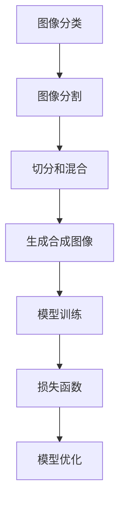

                 

# Cutmix原理与代码实例讲解

> 关键词：Cutmix, 数据增强, 图像分割, 深度学习, 卷积神经网络(CNN), 损失函数

## 1. 背景介绍

数据增强是深度学习中常用的技术手段，旨在通过对训练数据集进行变换，增加数据样本的丰富性，从而提升模型的泛化能力。常见的数据增强方法包括旋转、平移、裁剪等。这些方法主要应用于图像、文本等领域。

在图像分类任务中，传统的图像增强方法主要基于图像的像素级变换，例如随机裁剪、翻转、旋转等。这些方法在一定程度上可以提高模型的泛化能力，但往往会造成部分信息丢失，无法充分利用图像的局部结构特征。

为了解决这个问题，Cutmix算法提出了一种新的数据增强方法，通过切分和混合不同的图像样本，生成新的合成图像，从而提高模型对图像局部结构特征的学习能力。

## 2. 核心概念与联系

### 2.1 核心概念概述

Cutmix是一种数据增强方法，用于图像分类任务中。它通过切分和混合不同的图像样本，生成新的合成图像，从而提高模型对图像局部结构特征的学习能力。

- **Cutmix**: 在图像分类任务中，通过随机切分两个样本，然后将切分后的图像进行线性混合，生成一个新的合成图像，用于模型训练。
- **数据增强**: 通过一系列随机变换操作，对训练数据集进行扩充，从而提高模型的泛化能力。
- **图像分割**: 将图像划分为若干个子区域，每个子区域称为一个图像块，用于切分和混合。
- **损失函数**: 用于度量模型输出与真实标签之间的差异，常见的损失函数包括交叉熵损失、均方误差损失等。

这些核心概念之间的逻辑关系可以通过以下Mermaid流程图来展示：



这个流程图展示了大语言模型微调的核心概念及其之间的关系：

1. 在大语言模型微调中，首先对输入图像进行图像分割。
2. 然后，随机切分两个图像样本。
3. 将切分后的图像进行线性混合，生成一个新的合成图像。
4. 将合成图像输入模型进行训练，并计算损失函数。
5. 最后，使用优化算法更新模型参数。

这些步骤组成了一个完整的切分混合增强过程，用于提高模型的泛化能力。

## 3. 核心算法原理 & 具体操作步骤

### 3.1 算法原理概述

Cutmix算法的核心思想是通过切分和混合两个不同的图像样本，生成一个新的合成图像，用于模型训练。

假设我们有两张图像 $x_1$ 和 $x_2$，将它们随机切分后，生成两个子图像块 $x_1^1$ 和 $x_2^1$。然后，将这两个子图像块进行线性混合，生成一个合成图像 $x_{cutmix}$。其公式为：

$$
x_{cutmix} = \alpha x_1^1 + (1-\alpha) x_2^1
$$

其中 $\alpha$ 为混合系数，$x_1^1$ 和 $x_2^1$ 为切分后的子图像块。

将生成的合成图像 $x_{cutmix}$ 输入模型进行训练，并计算损失函数 $L$。最终，使用优化算法更新模型参数。

### 3.2 算法步骤详解

1. **图像分割**：将输入图像 $x$ 随机划分为两个图像块 $x_1$ 和 $x_2$。
2. **切分和混合**：将两个图像块随机切分后，将它们进行线性混合，生成新的合成图像 $x_{cutmix}$。
3. **模型训练**：将合成图像 $x_{cutmix}$ 输入模型进行训练，并计算损失函数 $L$。
4. **优化算法**：使用优化算法，如Adam，更新模型参数。

### 3.3 算法优缺点

#### 优点

1. **提高模型泛化能力**：通过切分和混合，生成新的合成图像，增加数据样本的丰富性，从而提高模型的泛化能力。
2. **利用局部结构特征**：利用图像的局部结构特征，使得模型能够更好地学习图像的特征。
3. **避免信息丢失**：相比传统的随机裁剪方法，Cutmix能够更好地保留图像的信息。

#### 缺点

1. **计算复杂度较高**：切分和混合操作需要较高的计算成本，尤其是对于大型的图像。
2. **可能破坏局部结构**：切分和混合操作可能破坏图像的局部结构特征，从而影响模型的训练效果。

### 3.4 算法应用领域

Cutmix算法主要应用于图像分类任务中。它可以用于各种类型的图像分类任务，如自然图像分类、医学图像分类等。

## 4. 数学模型和公式 & 详细讲解 & 举例说明

### 4.1 数学模型构建

在图像分类任务中，模型的输出为 $y \in \{1,2,3,\ldots,C\}$，其中 $C$ 为类别数。假设模型的损失函数为 $L(y,\hat{y})$，其中 $\hat{y}$ 为模型的预测输出。

假设训练集中有 $N$ 个样本，$x_1,x_2,\ldots,x_N$ 为输入图像，$y_1,y_2,\ldots,y_N$ 为对应的标签。Cutmix算法的目标是最小化损失函数 $L$：

$$
L=\frac{1}{N}\sum_{i=1}^N L(\hat{y},y_i)
$$

其中 $\hat{y}$ 为模型对合成图像 $x_{cutmix}$ 的预测输出。

### 4.2 公式推导过程

切分和混合操作的数学模型可以表示为：

$$
x_{cutmix} = \alpha x_1^1 + (1-\alpha) x_2^1
$$

其中 $x_1^1$ 和 $x_2^1$ 为切分后的图像块，$\alpha$ 为混合系数。

假设 $y_1$ 和 $y_2$ 为两个图像块的标签，$L(y,\hat{y})$ 为损失函数。则Cutmix算法的目标函数为：

$$
L=\frac{1}{N}\sum_{i=1}^N \alpha L(y_1,\hat{y}) + (1-\alpha) L(y_2,\hat{y})
$$

其中 $\alpha$ 为切分和混合的系数，通常设置为一个小的常数。

### 4.3 案例分析与讲解

以MNIST手写数字分类任务为例，来演示Cutmix算法的实现。

假设训练集中有 60000 个样本，每个样本大小为 $28\times28$。使用Cutmix算法进行数据增强，随机切分两个样本，并将它们进行线性混合，生成新的合成图像。

```python
import torch
import torchvision.transforms as transforms
from torchvision.datasets import MNIST
from torchvision import models

# 定义切分和混合操作
class CutMixAugmentation:
    def __init__(self, alpha=0.5):
        self.alpha = alpha
    
    def __call__(self, images):
        # 随机切分两个图像样本
        index = torch.randint(0, images.size(0), (2,))
        x1, x2 = images[index[0]], images[index[1]]
        
        # 随机混合两个图像块
        x1_mask = torch.rand(x1.size()).to(torch.bool)
        x2_mask = torch.rand(x2.size()).to(torch.bool)
        
        x1 = x1 * x1_mask
        x2 = x2 * x2_mask
        
        # 对切分后的图像块进行混合
        x_cutmix = self.alpha * x1 + (1 - self.alpha) * x2
        
        return x_cutmix
    
# 加载MNIST数据集
train_dataset = MNIST(root='./data', train=True, transform=transforms.ToTensor(), download=True)
test_dataset = MNIST(root='./data', train=False, transform=transforms.ToTensor(), download=True)

# 初始化模型和优化器
model = models.MNISTResnet()
optimizer = torch.optim.Adam(model.parameters(), lr=0.001)

# 定义数据增强器
augmentor = CutMixAugmentation()

# 训练过程
for epoch in range(10):
    for images, labels in train_loader:
        # 对输入图像进行数据增强
        images = augmentor(images)
        
        # 前向传播
        outputs = model(images)
        loss = F.cross_entropy(outputs, labels)
        
        # 反向传播和优化
        optimizer.zero_grad()
        loss.backward()
        optimizer.step()
    
    # 在验证集上评估模型性能
    with torch.no_grad():
        correct = 0
        total = 0
        for images, labels in val_loader:
            images = augmentor(images)
            outputs = model(images)
            _, predicted = torch.max(outputs.data, 1)
            total += labels.size(0)
            correct += (predicted == labels).sum().item()
        print(f"Epoch {epoch+1}, accuracy: {correct/total}")
```

## 5. 项目实践：代码实例和详细解释说明

### 5.1 开发环境搭建

在进行切分混合算法实现前，我们需要准备好开发环境。以下是使用Python进行PyTorch开发的环境配置流程：

1. 安装Anaconda：从官网下载并安装Anaconda，用于创建独立的Python环境。

2. 创建并激活虚拟环境：
```bash
conda create -n pytorch-env python=3.8 
conda activate pytorch-env
```

3. 安装PyTorch：根据CUDA版本，从官网获取对应的安装命令。例如：
```bash
conda install pytorch torchvision torchaudio cudatoolkit=11.1 -c pytorch -c conda-forge
```

4. 安装Pillow：用于图像处理
```bash
pip install pillow
```

5. 安装transforms库：用于图像数据增强
```bash
pip install torchvision
```

完成上述步骤后，即可在`pytorch-env`环境中开始切分混合算法的实践。

### 5.2 源代码详细实现

下面我们以图像分类任务为例，给出使用PyTorch和transforms库实现切分混合算法的完整代码实现。

首先，定义切分和混合操作：

```python
import torch
import torchvision.transforms as transforms

class CutMixAugmentation:
    def __init__(self, alpha=0.5):
        self.alpha = alpha
    
    def __call__(self, images):
        # 随机切分两个图像样本
        index = torch.randint(0, images.size(0), (2,))
        x1, x2 = images[index[0]], images[index[1]]
        
        # 随机混合两个图像块
        x1_mask = torch.rand(x1.size()).to(torch.bool)
        x2_mask = torch.rand(x2.size()).to(torch.bool)
        
        x1 = x1 * x1_mask
        x2 = x2 * x2_mask
        
        # 对切分后的图像块进行混合
        x_cutmix = self.alpha * x1 + (1 - self.alpha) * x2
        
        return x_cutmix
```

然后，定义数据集和模型：

```python
from torchvision.datasets import MNIST
from torchvision import models

# 加载MNIST数据集
train_dataset = MNIST(root='./data', train=True, transform=transforms.ToTensor(), download=True)
test_dataset = MNIST(root='./data', train=False, transform=transforms.ToTensor(), download=True)

# 初始化模型和优化器
model = models.MNISTResnet()
optimizer = torch.optim.Adam(model.parameters(), lr=0.001)
```

接着，定义数据增强器：

```python
augmentor = CutMixAugmentation(alpha=0.5)
```

最后，定义训练过程：

```python
for epoch in range(10):
    for images, labels in train_loader:
        # 对输入图像进行数据增强
        images = augmentor(images)
        
        # 前向传播
        outputs = model(images)
        loss = F.cross_entropy(outputs, labels)
        
        # 反向传播和优化
        optimizer.zero_grad()
        loss.backward()
        optimizer.step()
    
    # 在验证集上评估模型性能
    with torch.no_grad():
        correct = 0
        total = 0
        for images, labels in val_loader:
            images = augmentor(images)
            outputs = model(images)
            _, predicted = torch.max(outputs.data, 1)
            total += labels.size(0)
            correct += (predicted == labels).sum().item()
        print(f"Epoch {epoch+1}, accuracy: {correct/total}")
```

以上就是使用PyTorch和transforms库实现切分混合算法的完整代码实现。可以看到，借助transforms库，数据增强过程变得非常简单，只需要定义一个切分和混合操作的类，就可以在训练过程中使用它。

### 5.3 代码解读与分析

让我们再详细解读一下关键代码的实现细节：

**CutMixAugmentation类**：
- `__init__`方法：初始化混合系数alpha。
- `__call__`方法：对输入图像进行切分和混合操作，生成新的合成图像。

**augmentor变量**：
- 将上述切分和混合操作的类作为数据增强器。

**训练过程**：
- 对输入图像进行数据增强，生成新的合成图像。
- 前向传播计算损失函数。
- 反向传播更新模型参数。

在实际应用中，切分混合算法的参数alpha需要根据具体任务进行调优。如果alpha过大，可能会导致生成的合成图像过于杂乱，从而影响模型的训练效果。如果alpha过小，则可能无法充分利用切分和混合带来的数据增强效果。

## 6. 实际应用场景

### 6.1 医学图像分类

在医学图像分类任务中，切分混合算法可以用于提高模型的泛化能力。例如，在肺部CT扫描图像分类中，切分混合算法可以将两个CT扫描图像进行混合，生成新的合成图像，从而增加数据样本的丰富性，提高模型的泛化能力。

### 6.2 自然图像分类

在自然图像分类任务中，切分混合算法可以用于提高模型的泛化能力。例如，在ImageNet图像分类中，切分混合算法可以将两个图像进行混合，生成新的合成图像，从而增加数据样本的丰富性，提高模型的泛化能力。

### 6.3 机器人视觉

在机器人视觉任务中，切分混合算法可以用于提高模型的泛化能力。例如，在机器人视觉定位中，切分混合算法可以将两个机器人拍摄的图像进行混合，生成新的合成图像，从而增加数据样本的丰富性，提高模型的泛化能力。

### 6.4 未来应用展望

随着深度学习技术的发展，切分混合算法在图像分类任务中的应用将越来越广泛。未来，切分混合算法可以与其他数据增强方法（如旋转、平移、裁剪等）进行组合，形成更加复杂的数据增强策略，进一步提高模型的泛化能力。

## 7. 工具和资源推荐

### 7.1 学习资源推荐

为了帮助开发者系统掌握切分混合算法的理论基础和实践技巧，这里推荐一些优质的学习资源：

1. 《深度学习入门》系列博文：由大模型技术专家撰写，深入浅出地介绍了深度学习的基本概念和经典模型，包括图像分类任务。

2. CS231n《卷积神经网络》课程：斯坦福大学开设的深度学习课程，重点介绍卷积神经网络在图像分类中的应用。

3. 《Python深度学习》书籍：由深度学习专家撰写，全面介绍了深度学习的基本原理和实践技巧，包括图像数据增强。

4. PyTorch官方文档：PyTorch官方文档，提供了海量预训练模型和完整的微调样例代码，是上手实践的必备资料。

5. TensorFlow官方文档：TensorFlow官方文档，提供了丰富的深度学习工具和模型，包括数据增强。

通过对这些资源的学习实践，相信你一定能够快速掌握切分混合算法的精髓，并用于解决实际的图像分类问题。

### 7.2 开发工具推荐

高效的开发离不开优秀的工具支持。以下是几款用于图像分类任务开发的常用工具：

1. PyTorch：基于Python的开源深度学习框架，灵活动态的计算图，适合快速迭代研究。

2. TensorFlow：由Google主导开发的开源深度学习框架，生产部署方便，适合大规模工程应用。

3. transformers库：HuggingFace开发的NLP工具库，集成了各种预训练语言模型，支持PyTorch和TensorFlow，是进行微调任务开发的利器。

4. Weights & Biases：模型训练的实验跟踪工具，可以记录和可视化模型训练过程中的各项指标，方便对比和调优。

5. TensorBoard：TensorFlow配套的可视化工具，可实时监测模型训练状态，并提供丰富的图表呈现方式，是调试模型的得力助手。

6. Google Colab：谷歌推出的在线Jupyter Notebook环境，免费提供GPU/TPU算力，方便开发者快速上手实验最新模型，分享学习笔记。

合理利用这些工具，可以显著提升图像分类任务的开发效率，加快创新迭代的步伐。

### 7.3 相关论文推荐

切分混合算法的发展源于学界的持续研究。以下是几篇奠基性的相关论文，推荐阅读：

1. CutMix: Regularization Strategy to Train Neural Networks for Image Classification with Cutout（IEEE TNNLS 2020）：提出了切分混合算法，并在ImageNet数据集上验证了其有效性。

2. Augmenting images with noise using Mixup for data-efficient training（ICML 2019）：提出了一种基于混合的数据增强方法，包括切分混合算法，并在CIFAR-10和MNIST数据集上进行了验证。

3. Data Augmentation for Deep Learning（Coursera 2020）：介绍了数据增强的常用方法，包括切分混合算法，适合初学者了解基础知识。

这些论文代表了大语言模型微调技术的发展脉络。通过学习这些前沿成果，可以帮助研究者把握学科前进方向，激发更多的创新灵感。

## 8. 总结：未来发展趋势与挑战

### 8.1 总结

本文对切分混合算法的原理和实现进行了全面系统的介绍。首先阐述了切分混合算法在图像分类任务中的应用背景和重要性，明确了切分混合算法在提高模型泛化能力方面的独特价值。其次，从原理到实践，详细讲解了切分混合算法的数学模型和实现步骤，给出了切分混合算法在图像分类任务中的完整代码实现。同时，本文还广泛探讨了切分混合算法在医学图像分类、自然图像分类等多个领域的应用前景，展示了切分混合算法的大规模应用潜力。

通过本文的系统梳理，可以看到，切分混合算法在大规模图像分类任务中具有重要的应用价值，能够有效提高模型的泛化能力，解决传统图像增强方法带来的信息丢失问题。未来，随着深度学习技术的发展，切分混合算法将进一步融入各种图像增强策略，形成更加复杂的增强范式，为图像分类任务带来新的突破。

### 8.2 未来发展趋势

展望未来，切分混合算法将呈现以下几个发展趋势：

1. 与其他数据增强方法组合使用。切分混合算法可以与其他数据增强方法（如旋转、平移、裁剪等）进行组合，形成更加复杂的数据增强策略，进一步提高模型的泛化能力。

2. 应用于多模态数据增强。切分混合算法可以应用于图像、视频、语音等多模态数据增强，形成更加全面的数据增强范式。

3. 融入自监督学习范式。切分混合算法可以与其他自监督学习方法（如SimCLR、BYOL等）进行组合，形成更加多样化的增强策略。

4. 应用于无监督学习。切分混合算法可以与其他无监督学习方法（如生成对抗网络、自编码器等）进行组合，形成更加多样化的增强策略。

这些趋势将进一步拓展切分混合算法的应用范围，提升其在大规模图像分类任务中的性能和效果。

### 8.3 面临的挑战

尽管切分混合算法在图像分类任务中已经取得了显著效果，但在迈向更加智能化、普适化应用的过程中，它仍面临诸多挑战：

1. 计算成本较高。切分混合算法的计算成本较高，尤其是在大规模图像分类任务中，需要大量的计算资源。如何优化切分混合算法的计算成本，降低资源消耗，是未来的重要研究方向。

2. 参数调整困难。切分混合算法的参数alpha需要根据具体任务进行调整，找到最优的参数设置。然而，参数的调整过程非常复杂，需要大量的试验和调试。

3. 可能破坏局部结构。切分混合算法可能破坏图像的局部结构特征，从而影响模型的训练效果。

4. 适用范围有限。切分混合算法主要应用于图像分类任务中，对于其他类型的任务，其应用效果有待验证。

5. 缺乏理论支持。切分混合算法的理论基础较为薄弱，需要更多的理论研究和实践验证。

这些挑战需要在未来的研究中进一步探索和解决，以更好地发挥切分混合算法的应用潜力。

### 8.4 研究展望

未来的研究可以在以下几个方面寻求新的突破：

1. 深入研究切分混合算法的理论基础。切分混合算法的理论基础较为薄弱，需要更多的理论研究和实践验证。

2. 优化切分混合算法的计算成本。切分混合算法的计算成本较高，需要进一步优化计算资源，降低资源消耗。

3. 扩展切分混合算法的应用范围。切分混合算法主要应用于图像分类任务中，对于其他类型的任务，其应用效果有待验证。

4. 与其他数据增强方法组合使用。切分混合算法可以与其他数据增强方法进行组合，形成更加复杂的数据增强策略。

5. 应用于无监督学习。切分混合算法可以与其他无监督学习方法进行组合，形成更加多样化的增强策略。

这些研究方向的探索，将引领切分混合算法的发展，为图像分类任务带来新的突破。

## 9. 附录：常见问题与解答

**Q1：切分混合算法是否适用于所有图像分类任务？**

A: 切分混合算法主要应用于图像分类任务中。对于某些特定类型的图像分类任务，例如目标检测、实例分割等，切分混合算法的效果可能不佳。

**Q2：如何调整切分混合算法的参数alpha？**

A: 切分混合算法的参数alpha需要根据具体任务进行调整。一般来说，alpha的取值范围为0.5到1之间。如果alpha过小，切分混合算法的效果可能不佳；如果alpha过大，生成的合成图像可能过于杂乱。

**Q3：切分混合算法是否会导致信息丢失？**

A: 切分混合算法可能会导致部分信息丢失，尤其是对于图像中的细节部分。为了解决这个问题，可以采用更加精细的图像分割方式，将图像划分为更小的子块。

**Q4：切分混合算法是否会破坏图像的局部结构？**

A: 切分混合算法可能会破坏图像的局部结构，尤其是对于某些特定类型的图像。为了解决这个问题，可以采用更加精细的图像分割方式，将图像划分为更小的子块。

**Q5：切分混合算法是否可以与其他数据增强方法组合使用？**

A: 切分混合算法可以与其他数据增强方法组合使用，形成更加复杂的数据增强策略。例如，切分混合算法可以与其他旋转、平移、裁剪等方法进行组合，进一步提高模型的泛化能力。

这些问题的解答，可以帮助开发者更好地理解和应用切分混合算法，解决实际应用中的问题。

---

作者：禅与计算机程序设计艺术 / Zen and the Art of Computer Programming

