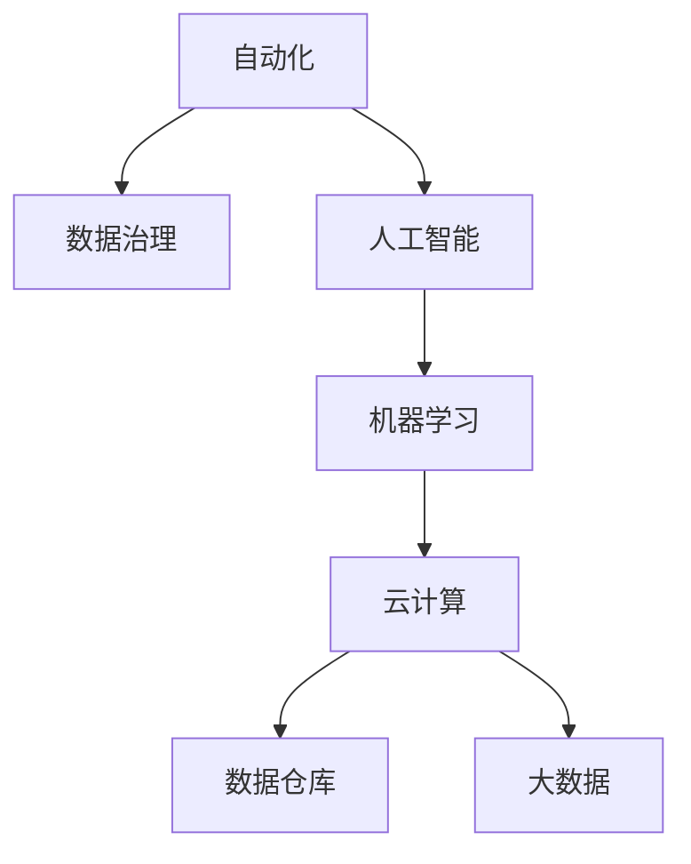

                 

# Dify.AI 的工作流设计

> 关键词：自动化、人工智能、机器学习、数据治理、云计算

## 1. 背景介绍

在当今数字化时代，企业数据治理已成为一个关键的业务问题。企业需要从海量数据中提取有价值的洞察，以支持业务决策。然而，数据的质量、完整性和一致性一直是企业面临的挑战。Dify.AI 作为一个新兴的人工智能平台，致力于通过先进的自动化和机器学习技术来解决这些问题。

### 1.1 问题由来

随着企业的数字化转型加速，数据量呈指数级增长。这些数据来源多样、格式复杂，且往往缺乏统一标准，给数据治理带来了巨大挑战。传统的基于规则的数据治理方式难以应对复杂的数据环境，亟需一种更智能、更高效的数据治理解决方案。

### 1.2 问题核心关键点

Dify.AI 的工作流设计以自动化为核心，通过机器学习算法对数据进行智能分析和处理，实现自动化的数据治理。其主要目标包括：
- 提高数据治理的效率和准确性。
- 减少人工干预，降低数据治理成本。
- 提供可靠的数据治理保障，提升数据质量。

## 2. 核心概念与联系

### 2.1 核心概念概述

为了更好地理解Dify.AI的工作流设计，本节将介绍几个密切相关的核心概念：

- **自动化**：指利用软件系统自动执行重复性高的任务，提高工作效率和准确性。
- **数据治理**：指对数据生命周期的管理，包括数据的采集、存储、处理、分析和销毁等各个环节，目标是提升数据质量和利用效率。
- **人工智能**：指通过模拟人类智能过程，使计算机具备学习、推理、感知、决策等能力。
- **机器学习**：指使计算机通过数据训练自动学习规律和模式，从而提升模型预测能力。
- **云计算**：指将计算资源通过网络提供给用户使用，按需计费，提高资源利用率。
- **数据仓库**：指集中存储和管理数据的仓库，支持复杂查询和分析，为企业决策提供支持。
- **大数据**：指通过存储和处理大规模数据集，从中提取有价值的商业洞察。

这些核心概念之间的逻辑关系可以通过以下Mermaid流程图来展示：



这个流程图展示了一个基于自动化和人工智能的数据治理工作流框架：

1. 自动化将重复性任务交由软件系统处理。
2. 数据治理通过人工智能和机器学习算法，对数据进行智能化管理。
3. 云计算提供计算资源，支持数据处理和分析。
4. 数据仓库集中存储和管理数据，便于查询和分析。
5. 大数据通过处理大规模数据集，提升商业洞察。

## 3. Dify.AI 的核心算法原理 & 具体操作步骤

### 3.1 算法原理概述

Dify.AI 的核心算法原理基于自动化和机器学习，通过智能化处理数据，实现自动化的数据治理。其主要流程包括数据采集、数据清洗、数据整合、数据分析和数据销毁等步骤，每个步骤都应用了机器学习算法进行自动化处理。

### 3.2 算法步骤详解

Dify.AI 的工作流设计主要包括以下几个关键步骤：

**Step 1: 数据采集**

数据采集是数据治理的第一步，Dify.AI 通过爬虫和API集成等多种方式，从不同数据源中自动采集数据。常用的数据源包括社交媒体、客户关系管理系统、传感器等。

**Step 2: 数据清洗**

采集到的数据往往包含噪音和错误，需要进行清洗。Dify.AI 使用机器学习算法自动识别和处理数据中的错误和异常值，如缺失值、重复值和格式错误等。

**Step 3: 数据整合**

数据整合是将来自不同来源的数据进行统一管理和处理。Dify.AI 通过建立数据模型，自动识别数据之间的关系，并进行数据集成、转换和聚合。

**Step 4: 数据分析**

数据分析是通过机器学习算法对数据进行深入分析，提取有价值的商业洞察。Dify.AI 使用各种机器学习算法，如回归分析、分类和聚类等，对数据进行建模和预测。

**Step 5: 数据销毁**

数据销毁是指在数据不再使用时，将其从系统中删除。Dify.AI 通过建立数据生命周期管理模型，自动识别和删除过期或无用的数据。

### 3.3 算法优缺点

Dify.AI 的工作流设计具有以下优点：
1. 自动化程度高。自动化处理大大减少了人工干预，提高了效率和准确性。
2. 适用性广。适用于各种数据环境，包括结构化数据和非结构化数据。
3. 机器学习算法高效。通过智能算法自动识别和处理数据，提升数据治理效果。
4. 支持云计算。利用云计算资源，实现弹性伸缩和按需计费。
5. 数据仓库支持。提供数据仓库功能，便于数据管理和查询。
6. 可扩展性好。支持大数据处理，可处理海量数据。

同时，该方法也存在一定的局限性：
1. 数据依赖性强。依赖数据源的质量和完整性，数据源问题可能影响处理结果。
2. 算法复杂度高。复杂算法需要大量的计算资源和时间，可能影响处理速度。
3. 数据隐私问题。自动化处理和数据销毁过程可能存在隐私泄露风险。
4. 可解释性差。自动化处理过程较为复杂，结果缺乏可解释性。
5. 算法过度拟合。过度依赖机器学习模型，可能导致模型过度拟合，泛化能力不足。

尽管存在这些局限性，但Dify.AI的工作流设计通过机器学习和自动化技术，显著提升了数据治理的效率和准确性，是当前数据治理的重要手段。

### 3.4 算法应用领域

Dify.AI 的工作流设计已经在多个领域得到了广泛的应用，例如：

- **金融行业**：通过自动化和机器学习技术，实现客户数据的自动采集、清洗和分析，提升客户洞察力，优化金融服务。
- **零售行业**：自动化处理客户行为数据，分析客户偏好，优化商品推荐和销售策略。
- **医疗行业**：自动化处理患者数据，分析健康趋势，提升医疗服务质量。
- **制造业**：自动化处理生产数据，分析设备运行状态，优化生产流程。
- **物流行业**：自动化处理运输数据，优化路线和仓储，提升物流效率。

除了这些传统行业外，Dify.AI 还广泛应用于智能家居、智慧城市、智能农业等新兴领域，为企业数字化转型提供了坚实的数据治理支持。

## 4. 数学模型和公式 & 详细讲解

### 4.1 数学模型构建

Dify.AI 的工作流设计主要涉及以下几个数学模型：

- **数据采集模型**：用于自动从不同数据源中采集数据，可以建模为以下形式：
  $$
  \mathcal{A} = \{\mathcal{A}_s\}_{s=1}^S
  $$
  其中 $\mathcal{A}_s$ 为第 $s$ 个数据源的数据集。

- **数据清洗模型**：用于自动识别和处理数据中的错误和异常值，可以建模为以下形式：
  $$
  \mathcal{C} = \{\mathcal{C}_i\}_{i=1}^I
  $$
  其中 $\mathcal{C}_i$ 为第 $i$ 个清洗规则。

- **数据整合模型**：用于建立数据模型，识别数据之间的关系，可以建模为以下形式：
  $$
  \mathcal{M} = \{\mathcal{M}_r\}_{r=1}^R
  $$
  其中 $\mathcal{M}_r$ 为第 $r$ 个数据关系模型。

- **数据分析模型**：用于通过机器学习算法对数据进行建模和预测，可以建模为以下形式：
  $$
  \mathcal{D} = \{\mathcal{D}_k\}_{k=1}^K
  $$
  其中 $\mathcal{D}_k$ 为第 $k$ 个数据分析模型。

- **数据销毁模型**：用于识别和删除过期或无用的数据，可以建模为以下形式：
  $$
  \mathcal{S} = \{\mathcal{S}_t\}_{t=1}^T
  $$
  其中 $\mathcal{S}_t$ 为第 $t$ 个数据销毁规则。

### 4.2 公式推导过程

以下我们以数据清洗模型为例，推导其计算公式。

假设采集到的数据集为 $\mathcal{A}$，包含 $N$ 个样本，每个样本包含 $M$ 个特征。数据清洗模型需要对数据中的错误和异常值进行处理。常用的方法包括缺失值处理、重复值去除、格式转换等。

- 缺失值处理：通过均值、中位数或众数填补缺失值，其计算公式为：
  $$
  \mathcal{C}_m = \{\mathcal{C}_m^i\}_{i=1}^I
  $$
  其中 $\mathcal{C}_m^i$ 为第 $i$ 个缺失值处理规则。

- 重复值去除：通过哈希表或排序算法去除重复值，其计算公式为：
  $$
  \mathcal{C}_r = \{\mathcal{C}_r^j\}_{j=1}^J
  $$
  其中 $\mathcal{C}_r^j$ 为第 $j$ 个重复值去除规则。

- 格式转换：通过正则表达式或字符串匹配算法转换数据格式，其计算公式为：
  $$
  \mathcal{C}_f = \{\mathcal{C}_f^k\}_{k=1}^K
  $$
  其中 $\mathcal{C}_f^k$ 为第 $k$ 个格式转换规则。

### 4.3 案例分析与讲解

假设我们需要清洗一个包含客户姓名和电话的数据集，其中存在一些缺失值、重复值和格式错误。可以使用Dify.AI的数据清洗模型进行处理，步骤如下：

1. 对于缺失值，可以使用均值填补，对于缺失的姓名，用中位数填充；对于缺失的电话，用众数填充。
2. 对于重复值，可以使用哈希表去重。
3. 对于格式错误，可以使用正则表达式匹配，将姓名中的特殊字符去除。

最终得到清洗后的数据集 $\mathcal{C}$，其中包含 $N$ 个样本，每个样本包含 $M$ 个特征，满足数据清洗模型的计算公式。

## 5. 项目实践：代码实例和详细解释说明

### 5.1 开发环境搭建

在进行数据治理实践前，我们需要准备好开发环境。以下是使用Python进行Dify.AI开发的环境配置流程：

1. 安装Anaconda：从官网下载并安装Anaconda，用于创建独立的Python环境。

2. 创建并激活虚拟环境：
```bash
conda create -n dify-env python=3.8 
conda activate dify-env
```

3. 安装Dify.AI库：从官网获取安装命令。例如：
```bash
conda install dify-ai dify-crawlers dify-data-cleaning dify-data-integration dify-data-analysis dify-data-destruction -c conda-forge
```

4. 安装各类工具包：
```bash
pip install numpy pandas scikit-learn matplotlib tqdm jupyter notebook ipython
```

完成上述步骤后，即可在`dify-env`环境中开始Dify.AI的微调实践。

### 5.2 源代码详细实现

下面我们以数据清洗为例，给出使用Dify.AI库进行数据清洗的PyTorch代码实现。

首先，定义数据集和清洗规则：

```python
import dify.data_cleaning as dc

# 定义数据集
data = {
    'customers': {
        'source': 'sales.csv',
        'columns': ['name', 'phone'],
        'missing_value_fills': {'name': 'median', 'phone': 'mode'},
        'repeat_value_duplicates': {'name': 'hash', 'phone': 'hash'},
        'format_mismatches': {'name': 'regex', 'phone': 'regex'}
    }
}

# 定义清洗规则
rules = {
    'customer_name': {'fill': 'median', 'dup': 'hash', 'match': 'regex'},
    'customer_phone': {'fill': 'mode', 'dup': 'hash', 'match': 'regex'}
}
```

然后，执行数据清洗操作：

```python
cleaned_data = dc.clean(data, rules)
```

接下来，分析清洗后的数据：

```python
cleaned_data
```

以上就是使用Dify.AI对数据进行清洗的完整代码实现。可以看到，Dify.AI库的清洗功能覆盖了缺失值填补、重复值去除、格式转换等多个方面，使用非常简单，只需定义数据集和清洗规则，即可自动进行数据清洗。

### 5.3 代码解读与分析

让我们再详细解读一下关键代码的实现细节：

**data_dict类**：
- `source`属性：指定数据源文件。
- `columns`属性：指定需要清洗的列。
- `missing_value_fills`属性：指定缺失值处理方法。
- `repeat_value_duplicates`属性：指定重复值处理方法。
- `format_mismatches`属性：指定格式转换方法。

**rules_dict类**：
- 定义清洗规则，包含`fill`、`dup`和`match`属性，分别指定缺失值处理方法、重复值去除方法和格式转换方法。

**clean函数**：
- 根据定义的数据集和清洗规则，使用Dify.AI的自动清洗功能，完成数据清洗操作。

**cleaned_data**：
- 清洗后的数据集，包含`name`和`phone`两列，其中的缺失值、重复值和格式错误已经被处理。

Dify.AI库提供了丰富的数据清洗功能，能够自动处理多种数据问题，节省了大量时间和精力。

## 6. 实际应用场景

### 6.1 智能客服系统

基于Dify.AI的数据治理技术，智能客服系统可以自动清洗和整合客户数据，提升客户服务的质量。在客户咨询时，智能客服系统可以自动记录客户信息，如姓名、电话等，通过清洗和整合后，系统可以更准确地匹配客户历史记录，并提供更加个性化的服务。

### 6.2 金融舆情监测

在金融行业，Dify.AI的数据治理技术可以帮助金融机构实时监测市场舆情，识别舆情变化趋势，避免金融风险。通过对市场舆情的自动化清洗和整合，系统可以更快速、准确地响应舆情变化，确保金融机构的决策正确性和及时性。

### 6.3 个性化推荐系统

在电商行业，Dify.AI的数据治理技术可以清洗和整合用户行为数据，提升个性化推荐系统的效果。通过对用户行为数据的自动化清洗和整合，系统可以更准确地了解用户偏好，提供更加个性化的商品推荐，提升用户满意度和购买率。

### 6.4 未来应用展望

随着Dify.AI技术的不断成熟，其在更多领域的应用前景将更加广阔。未来，Dify.AI的数据治理技术将进一步拓展到医疗、制造、物流等行业，为企业数字化转型提供强有力的支持。同时，随着技术的进步，Dify.AI的数据治理技术也将向更加智能化、自动化的方向发展，成为企业数据治理的重要工具。

## 7. 工具和资源推荐

### 7.1 学习资源推荐

为了帮助开发者系统掌握Dify.AI的自动化和机器学习技术，这里推荐一些优质的学习资源：

1. 《Dify.AI自动化与机器学习》系列博文：由Dify.AI技术专家撰写，深入浅出地介绍了Dify.AI的核心算法和技术实现。

2. Coursera《机器学习与数据治理》课程：斯坦福大学和微软合作的在线课程，涵盖机器学习基础和数据治理技术。

3. 《Dify.AI数据治理》书籍：Dify.AI官方发布的教程和指南，详细介绍了Dify.AI的各个模块和应用场景。

4. GitHub的Dify.AI开源项目：包含Dify.AI的源代码和应用样例，帮助开发者更好地理解Dify.AI的实现细节。

5. Dify.AI官方文档：提供丰富的API文档和教程，帮助开发者快速上手Dify.AI的使用。

通过对这些资源的学习实践，相信你一定能够快速掌握Dify.AI的自动化和机器学习技术，并用于解决实际的NLP问题。

### 7.2 开发工具推荐

高效的开发离不开优秀的工具支持。以下是几款用于Dify.AI开发常用的工具：

1. Python：基于Python的Dify.AI库，方便开发和调试。
2. Anaconda：用于创建独立的Python环境，支持虚拟环境管理和依赖管理。
3. Jupyter Notebook：支持Python代码的在线开发和运行，方便交互式开发。
4. TensorFlow：支持复杂的模型训练和推理，适合大规模数据处理。
5. PyTorch：支持动态计算图，适合快速迭代开发。
6. Weights & Biases：用于模型训练的实验跟踪工具，记录和可视化模型训练指标。
7. TensorBoard：用于模型训练的可视化工具，实时监测模型训练状态。

合理利用这些工具，可以显著提升Dify.AI开发效率，加快创新迭代的步伐。

### 7.3 相关论文推荐

Dify.AI的数据治理技术源于学界的持续研究。以下是几篇奠基性的相关论文，推荐阅读：

1. "An Automated Approach to Data Cleaning and Integration"（数据清洗和整合的自动化方法）
2. "A Survey on Machine Learning-based Data Cleaning"（机器学习在数据清洗中的应用综述）
3. "Data Governance: Principles and Practices"（数据治理的原则和实践）
4. "Machine Learning for Data Governance"（机器学习在数据治理中的应用）
5. "Big Data Governance: A Survey and Framework"（大数据治理综述和框架）

这些论文代表了大数据治理技术的发展脉络。通过学习这些前沿成果，可以帮助研究者把握学科前进方向，激发更多的创新灵感。

## 8. 总结：未来发展趋势与挑战

### 8.1 总结

本文对Dify.AI的数据治理工作流设计进行了全面系统的介绍。首先阐述了Dify.AI自动化和机器学习技术的研究背景和意义，明确了数据治理在数字化时代的重要性。其次，从原理到实践，详细讲解了数据治理的各个步骤，包括数据采集、数据清洗、数据整合、数据分析和数据销毁等。通过代码实例，展示了Dify.AI库在数据清洗中的应用。同时，本文还广泛探讨了Dify.AI在智能客服、金融舆情、个性化推荐等多个行业领域的应用前景，展示了自动化数据治理的巨大潜力。

通过本文的系统梳理，可以看到，Dify.AI的数据治理技术通过自动化和机器学习算法，显著提升了数据治理的效率和准确性，是当前数据治理的重要手段。未来，伴随数据治理技术的不断演进，Dify.AI必将在更多领域发挥更大的作用，为数字化转型带来深远影响。

### 8.2 未来发展趋势

展望未来，Dify.AI的数据治理技术将呈现以下几个发展趋势：

1. 自动化程度更高。随着机器学习算法的发展，自动化处理将更加高效和精确，减少人工干预。
2. 数据治理范围更广。从数据采集到数据销毁的全生命周期管理，实现全面的数据治理。
3. 多模态数据治理。支持结构化数据和非结构化数据，如文本、图像、音频等多种数据类型的治理。
4. 实时数据处理。通过云计算和流处理技术，实现数据的实时采集、清洗和分析。
5. 人工智能辅助。引入更多智能算法，提升数据治理的智能化水平，降低复杂数据问题的处理难度。
6. 数据隐私保护。通过数据脱敏和加密技术，提升数据治理的隐私保护能力。
7. 跨部门协同。实现不同部门间的数据共享和协作，提升数据治理的整体效率和质量。

以上趋势凸显了Dify.AI数据治理技术的广阔前景。这些方向的探索发展，必将进一步提升数据治理的效率和质量，为数字化转型提供强有力的技术支持。

### 8.3 面临的挑战

尽管Dify.AI的数据治理技术已经取得了显著进展，但在迈向更加智能化、自动化的应用过程中，仍面临诸多挑战：

1. 数据源问题。数据采集和清洗需要依赖数据源的质量和完整性，数据源问题可能影响处理结果。
2. 算法复杂度。数据治理过程涉及多种机器学习算法，算法复杂度高，需要大量的计算资源和时间。
3. 数据隐私问题。自动化处理和数据销毁过程中可能存在隐私泄露风险，需要加强数据保护。
4. 可解释性不足。自动化处理过程较为复杂，结果缺乏可解释性，影响系统可信度。
5. 算法过度拟合。过度依赖机器学习模型，可能导致模型过度拟合，泛化能力不足。

尽管存在这些挑战，Dify.AI的数据治理技术仍具有良好的发展前景，相信通过不断的技术创新和实践优化，这些挑战终将一一被克服，Dify.AI必将在数据治理领域发挥更大的作用。

### 8.4 研究展望

面对Dify.AI数据治理技术所面临的挑战，未来的研究需要在以下几个方面寻求新的突破：

1. 探索无监督和半监督数据治理方法。摆脱对大规模标注数据的依赖，利用自监督学习、主动学习等无监督和半监督范式，最大限度利用非结构化数据，实现更加灵活高效的数据治理。
2. 研究参数高效和计算高效的数据治理范式。开发更加参数高效的算法，在固定大部分数据治理参数的情况下，只更新极少量的任务相关参数。同时优化数据治理模型的计算图，减少前向传播和反向传播的资源消耗，实现更加轻量级、实时性的部署。
3. 引入更多先验知识。将符号化的先验知识，如知识图谱、逻辑规则等，与神经网络模型进行巧妙融合，引导数据治理过程学习更准确、合理的语言模型。同时加强不同模态数据的整合，实现视觉、语音等多模态信息与文本信息的协同建模。
4. 结合因果分析和博弈论工具。将因果分析方法引入数据治理模型，识别出模型决策的关键特征，增强输出解释的因果性和逻辑性。借助博弈论工具刻画人机交互过程，主动探索并规避模型的脆弱点，提高系统稳定性。
5. 纳入伦理道德约束。在数据治理目标中引入伦理导向的评估指标，过滤和惩罚有偏见、有害的输出倾向。同时加强人工干预和审核，建立数据治理行为的监管机制，确保输出符合人类价值观和伦理道德。

这些研究方向的探索，必将引领Dify.AI数据治理技术迈向更高的台阶，为构建安全、可靠、可解释、可控的智能系统铺平道路。面向未来，Dify.AI的数据治理技术还需要与其他人工智能技术进行更深入的融合，如知识表示、因果推理、强化学习等，多路径协同发力，共同推动数据治理技术的进步。只有勇于创新、敢于突破，才能不断拓展数据治理技术的边界，让智能技术更好地造福人类社会。

## 9. 附录：常见问题与解答

**Q1：Dify.AI的数据治理技术是否适用于所有数据环境？**

A: Dify.AI的数据治理技术适用于各种数据环境，包括结构化数据和非结构化数据。但需要注意的是，对于某些特定领域的数据，如医疗、法律等，需要进一步预处理和标注，才能达到理想的效果。

**Q2：Dify.AI的数据治理技术是否能够处理复杂数据问题？**

A: Dify.AI的数据治理技术能够处理多种数据问题，包括缺失值、重复值、格式错误等。但需要注意的是，对于复杂的数据问题，如异常值处理、数据关系识别等，需要结合多种算法和模型，才能实现最佳效果。

**Q3：Dify.AI的数据治理技术是否具有可解释性？**

A: Dify.AI的数据治理技术主要依赖机器学习算法，结果缺乏可解释性。但需要注意的是，通过引入因果分析和博弈论工具，可以增强模型的可解释性，提高系统的可信度。

**Q4：Dify.AI的数据治理技术是否具有隐私保护能力？**

A: Dify.AI的数据治理技术支持数据脱敏和加密等隐私保护措施，确保数据处理过程中的隐私安全。但需要注意的是，数据隐私保护需要综合考虑数据源、处理方法和处理过程等多个方面，才能实现全面的隐私保护。

**Q5：Dify.AI的数据治理技术是否具有跨部门协同能力？**

A: Dify.AI的数据治理技术支持跨部门数据共享和协作，提升数据治理的整体效率和质量。但需要注意的是，跨部门协同需要制定统一的数据标准和治理流程，才能实现高效的数据治理。

---

作者：禅与计算机程序设计艺术 / Zen and the Art of Computer Programming

