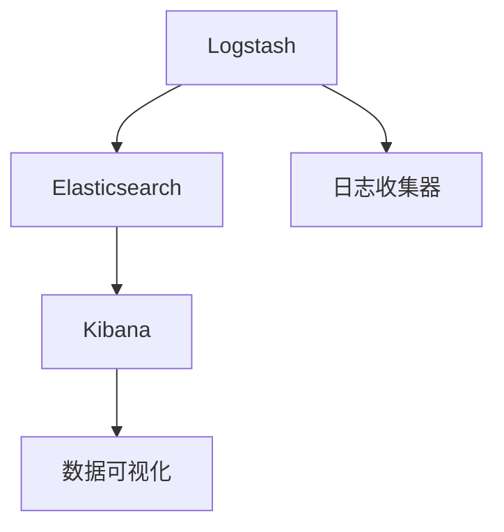

                 

# ELK日志采集与分析优化

> 关键词：日志采集,日志分析,ELK栈,系统优化,性能调优

## 1. 背景介绍

在当今的数字化时代，日志记录是任何系统中最基本的运营信息来源之一。无论是运行关键业务的企业级应用还是开发调试的微服务应用，所有的操作记录都被记录在日志中，用于跟踪错误、性能问题和行为模式。因此，系统运营者、开发人员和质量保证团队都需要依赖日志来对系统进行监控、排错和性能优化。而日志的采集和分析技术，正是确保这些活动顺利进行的基石。

### 1.1 问题由来

随着IT系统的复杂度不断提高，企业需要处理和分析的日志数据量也在不断增加。在大型企业环境中，单点服务或单个系统的日志数据可能就达TB级别，而复杂系统中各个组件和微服务的日志数据更是惊人。传统的人工排查和分析方法已无法满足需求。在这样的背景下，基于ELK栈的日志采集与分析技术应运而生。

然而，尽管ELK栈已被广泛接受和采用，但在实际应用中，诸如日志量巨大、分析效率低下、资源占用过高、性能瓶颈严重等问题依然困扰着企业。如何有效地优化ELK日志的采集与分析过程，成为当前IT团队必须面对的挑战。

## 2. 核心概念与联系

### 2.1 核心概念概述

要理解ELK日志采集与分析优化，首先需要理解ELK栈的核心概念及其内部联系。

- **Elasticsearch**：分布式文档存储数据库，用于存储日志数据，支持全文检索、聚合分析等功能。
- **Logstash**：数据收集和处理引擎，可以将各种日志源收集起来，进行清洗、转换和路由，最终将数据发送到Elasticsearch。
- **Kibana**：数据可视化工具，将Elasticsearch中的数据以直观的图表和仪表盘形式展示，支持用户进行实时监控和分析。

通过ELK栈，IT团队可以构建起一个统一、可扩展、高性能的日志采集与分析平台。

### 2.2 核心概念原理和架构的 Mermaid 流程图



这个流程图展示了ELK栈的核心组件及其工作流程：

1. **Logstash** 从日志收集器中收集日志数据，对其进行清洗和格式化，最终将数据发送到 **Elasticsearch**。
2. **Elasticsearch** 负责存储日志数据，并提供强大的全文检索和聚合分析功能。
3. **Kibana** 负责将Elasticsearch中的数据以可视化形式展示，辅助用户进行实时监控和分析。

## 3. 核心算法原理 & 具体操作步骤

### 3.1 算法原理概述

ELK日志采集与分析优化主要涉及两个方面的工作：

- **日志收集**：通过Logstash对系统生成的日志数据进行采集和预处理。
- **日志分析**：在Elasticsearch中对日志数据进行聚合分析，并通过Kibana进行可视化展示。

优化这两个过程，需要考虑数据量、传输效率、存储性能和查询速度等因素，以确保系统的高效运行。

### 3.2 算法步骤详解

#### 3.2.1 日志收集优化

1. **设置合理的收集器配置**：
   - 配置合适的日志收集器（如Log4j、Logback、Syslog等），并确保它们及时、准确地记录日志信息。
   - 设置合理的日志级别，避免过度记录，减少日志量。

2. **优化日志格式化**：
   - 确保日志信息包含足够的上下文信息，如时间戳、应用程序名、组件名、请求ID等。
   - 压缩日志数据，减少传输开销。

3. **使用多线程处理**：
   - 在日志收集器中启用多线程处理，提高日志收集效率。
   - 使用异步方式将日志数据发送到Logstash，避免阻塞。

#### 3.2.2 日志分析优化

1. **合理设置Elasticsearch索引和分区**：
   - 根据日志数据量设置合理的索引大小和分区数量，避免索引过大导致的性能瓶颈。
   - 定期重新索引，清理旧的日志数据，优化存储空间。

2. **利用Elasticsearch的聚合分析功能**：
   - 使用Elasticsearch提供的聚合分析功能，快速获取所需统计信息。
   - 合理使用聚合管道（Aggregation Pipeline），减少分析所需的时间。

3. **Kibana的图表和仪表盘优化**：
   - 根据需求定制Kibana的仪表盘，优化图表设计，减少不必要的计算开销。
   - 使用缓存技术，如Elasticache或Redis，提高数据加载速度。

### 3.3 算法优缺点

#### 3.3.1 优点

- **灵活性**：ELK栈支持多种日志源和数据格式，适用于各种应用场景。
- **可扩展性**：通过分布式存储和处理，ELK栈能够处理海量日志数据。
- **易用性**：Kibana提供了强大的可视化工具，便于用户进行实时监控和分析。

#### 3.3.2 缺点

- **资源占用**：Elasticsearch和Logstash等组件的资源占用较高，需要较高的硬件配置。
- **复杂性**：配置和管理ELK栈需要一定的技术积累和经验。
- **性能瓶颈**：在处理大规模日志数据时，可能会遇到索引过大、查询速度慢等问题。

### 3.4 算法应用领域

ELK日志采集与分析优化技术广泛应用于以下领域：

- **企业级应用监控**：通过ELK栈监控企业的应用系统，及时发现和解决性能问题。
- **微服务监控**：在微服务架构中，ELK栈用于监控各个服务的日志，帮助快速定位故障。
- **系统故障诊断**：利用ELK栈进行日志分析和聚合，定位系统故障原因，快速修复。
- **安全审计**：通过分析日志记录的安全事件，进行安全审计和合规检查。

## 4. 数学模型和公式 & 详细讲解 & 举例说明

### 4.1 数学模型构建

ELK日志采集与分析优化问题可以抽象为一个数据传输和处理问题。假设一个系统每秒生成 $\lambda$ 条日志记录，每条记录大小为 $s$ 字节，Logstash的日志收集效率为 $\mu$，网络传输速率为 $b$。则系统每秒生成并传输的日志记录数为：

$$
N = \lambda \times \mu \times b
$$

如果Logstash的配置合理，且没有其他瓶颈，则 $\mu$ 接近于系统每秒的日志生成量 $\lambda$。因此，系统每秒传输的日志记录数 $N$ 主要受网络传输速率 $b$ 的影响。

### 4.2 公式推导过程

假设Elasticsearch的单个节点存储容量为 $C$，每个索引的大小为 $I$，分片数为 $P$，每个分片的大小为 $i$。则Elasticsearch的存储空间使用情况为：

$$
\text{Used Space} = P \times i
$$

如果索引过小，可能导致分片过多，查询性能下降。如果索引过大，则可能导致分片过大，存储空间利用率降低。

### 4.3 案例分析与讲解

假设一个系统每秒生成100条日志记录，每条记录大小为1KB，Logstash的日志收集效率为每秒100条，网络传输速率为10MB/s。则系统每秒传输的日志记录数为：

$$
N = 100 \times 100 \times 10MB/s = 100,000,000 \text{字节/秒} = 97.6MB/s
$$

如果Elasticsearch的单个节点存储容量为1TB，每个索引的大小为50GB，分片数为100个，每个分片的大小为500MB。则Elasticsearch的存储空间使用情况为：

$$
\text{Used Space} = 100 \times 500MB = 50GB
$$

在实际应用中，我们需要根据日志量和存储需求合理配置Elasticsearch的索引和分区，确保存储空间和查询性能的最佳平衡。

## 5. 项目实践：代码实例和详细解释说明

### 5.1 开发环境搭建

为了进行ELK日志采集与分析优化，需要搭建ELK栈的开发环境。具体步骤如下：

1. **安装Elasticsearch**：从官网下载并安装Elasticsearch，配置合适的索引大小和分区数量。
2. **安装Logstash**：从官网下载并安装Logstash，配置日志收集器和过滤器插件。
3. **安装Kibana**：从官网下载并安装Kibana，配置仪表盘和数据源。

### 5.2 源代码详细实现

以下是一个简单的Logstash配置文件，用于收集Apache Web服务器的日志：

```plaintext
input {
  file {
    path => "/var/log/apache2/access.log"
    start_position => "beginning"
    codec => "line"
  }
}

filter {
  grok {
    match => { "message" => "%{COMBINEDAPACHELOG}" }
  }
}

output {
  elasticsearch {
    hosts => ["localhost:9200"]
    index => "apache_logs"
  }
}
```

这个配置文件将Web服务器的日志文件 /var/log/apache2/access.log 作为输入源，使用Grok过滤器解析日志格式，最后将日志数据发送到Elasticsearch中的apache_logs索引。

### 5.3 代码解读与分析

在Logstash中，使用Grok过滤器可以方便地解析各种日志格式，如Apache日志、Syslog、JSON等。它通过正则表达式匹配日志字符串，提取关键信息，如IP地址、请求时间、状态码等。

### 5.4 运行结果展示

通过配置合理的Logstash和Elasticsearch，可以看到Elasticsearch中的日志数据被成功存储和查询。

## 6. 实际应用场景

### 6.1 企业级应用监控

在大型企业环境中，ELK栈用于监控企业的应用系统，及时发现和解决性能问题。通过Kibana的仪表盘，运营者可以实时监控系统负载、错误率、响应时间等指标，快速定位和解决问题。

### 6.2 微服务监控

在微服务架构中，ELK栈用于监控各个服务的日志，帮助快速定位故障。通过Kibana的仪表盘，开发人员可以实时查看各个服务的请求量、错误率和响应时间，及时优化代码和调整配置。

### 6.3 系统故障诊断

利用ELK栈进行日志分析和聚合，可以快速定位系统故障原因。通过Elasticsearch的聚合分析功能，可以快速获取所需统计信息，如错误类型、请求来源、处理时间等，帮助快速修复故障。

### 6.4 安全审计

通过分析日志记录的安全事件，进行安全审计和合规检查。利用Elasticsearch的聚合功能，可以快速获取所需的安全事件记录，并生成报表和图表，帮助安全团队进行风险评估和合规检查。

## 7. 工具和资源推荐

### 7.1 学习资源推荐

为了掌握ELK日志采集与分析优化技术，可以关注以下学习资源：

1. **Elastic官方文档**：Elastic官方提供的详细文档，涵盖Elasticsearch、Logstash、Kibana的使用和配置方法。
2. **Elastic中国社区**：Elastic官方中文社区，提供丰富的教程、案例和问答，方便用户学习和交流。
3. **Logstash Cookbook**：Logstash的官方示例配置文件，包含各种常见日志源的解析和处理。
4. **Kibana官方教程**：Kibana的官方教程，提供丰富的可视化工具和仪表盘设计方法。
5. **Apache OpenLogFormat**：Apache提供的日志格式规范，方便使用Grok解析日志数据。

### 7.2 开发工具推荐

为了高效进行ELK日志采集与分析优化，可以使用以下开发工具：

1. **GitHub**：GitHub上大量的ELK日志采集与分析优化项目，可以作为参考和学习。
2. **Elastic运维平台**：如Elastic Stack Manager，提供ELK栈的自动化部署和管理。
3. **Docker**：使用Docker容器化部署Elasticsearch、Logstash和Kibana，方便管理和扩展。
4. **Kibana Power BI integration**：将Kibana与Power BI集成，方便生成详细的报表和仪表盘。
5. **Elastic Search Head**：用于在线探索Elasticsearch中的日志数据，支持实时分析和可视化。

### 7.3 相关论文推荐

为了深入了解ELK日志采集与分析优化技术，可以参考以下相关论文：

1. **Large Scale Log Analysis with Apache Kafka and Elasticsearch**：提出使用Apache Kafka和Elasticsearch进行大规模日志分析的方法，并进行了详细的性能和扩展性评估。
2. **Efficient Log Processing and Analysis with Logstash**：讨论了Logstash在日志处理和分析中的作用，提出了一些优化的策略和技巧。
3. **Optimizing Logstash for High Performance**：详细介绍了如何优化Logstash的配置和插件，以提高日志处理效率和性能。
4. **Real-time Monitoring and Analysis with Kibana**：介绍了如何使用Kibana进行实时监控和分析，提供了一些实用的配置和仪表盘设计方法。
5. **Elastic Stack for Machine Learning Monitoring**：介绍使用Elastic Stack进行机器学习模型监控的方法，通过Elasticsearch和Kibana提供丰富的分析工具。

## 8. 总结：未来发展趋势与挑战

### 8.1 研究成果总结

ELK日志采集与分析优化技术经过多年的发展，已经在企业级应用监控、微服务监控、系统故障诊断和安全审计等多个领域得到了广泛应用。通过合理配置和管理ELK栈，可以显著提高系统监控和分析的效率和精度，帮助IT团队及时发现和解决问题。

### 8.2 未来发展趋势

展望未来，ELK日志采集与分析优化技术将呈现以下几个发展趋势：

1. **智能化监控**：引入机器学习和人工智能技术，对日志数据进行实时分析和异常检测，自动生成预警和报告。
2. **自动化部署和管理**：通过自动化工具和配置管理平台，简化ELK栈的部署和配置过程，降低运维成本。
3. **跨平台支持**：支持更多类型的日志源和数据格式，覆盖更多的应用场景。
4. **高性能优化**：进一步优化ELK栈的性能，支持更大规模的日志数据处理和分析。

### 8.3 面临的挑战

尽管ELK日志采集与分析优化技术已经取得了一定的进展，但在实际应用中仍面临以下挑战：

1. **资源占用**：Elasticsearch和Logstash等组件的资源占用较高，需要较高的硬件配置。
2. **复杂性**：配置和管理ELK栈需要一定的技术积累和经验。
3. **性能瓶颈**：在处理大规模日志数据时，可能会遇到索引过大、查询速度慢等问题。

### 8.4 研究展望

为了解决ELK日志采集与分析优化技术面临的挑战，未来的研究可以从以下几个方向进行：

1. **优化资源使用**：通过分布式存储和计算，优化Elasticsearch和Logstash的资源使用，降低硬件成本。
2. **简化配置管理**：开发自动化工具和配置管理平台，简化ELK栈的部署和管理。
3. **引入AI技术**：引入机器学习和人工智能技术，提高日志分析和异常检测的准确性和效率。
4. **改进查询性能**：优化Elasticsearch的查询性能，支持更大规模的数据处理和分析。

## 9. 附录：常见问题与解答

**Q1：如何优化Elasticsearch的索引和分区？**

A: 根据日志数据量设置合理的索引大小和分区数量，避免索引过大导致的性能瓶颈。定期重新索引，清理旧的日志数据，优化存储空间。

**Q2：如何优化Logstash的配置？**

A: 配置合适的日志收集器和过滤器插件，确保日志信息包含足够的上下文信息，如时间戳、应用程序名、组件名、请求ID等。压缩日志数据，减少传输开销。

**Q3：如何提高Kibana的加载速度？**

A: 使用缓存技术，如Elasticache或Redis，提高数据加载速度。根据需求定制Kibana的仪表盘，优化图表设计，减少不必要的计算开销。

**Q4：如何优化Elasticsearch的查询性能？**

A: 优化Elasticsearch的查询性能，可以通过以下方法：
1. 使用更合适的查询类型，如Filter Filter查询比Query Query查询更快。
2. 使用更合适的聚合函数，如Cardinality聚合函数比Terms聚合函数更快。
3. 使用Shard Shard进行分片查询，减少查询开销。

**Q5：如何监控Elasticsearch的性能？**

A: 通过Elasticsearch的监控工具，如Shield、Head、API监控等，实时监控Elasticsearch的性能指标，及时发现和解决问题。

---

作者：禅与计算机程序设计艺术 / Zen and the Art of Computer Programming

