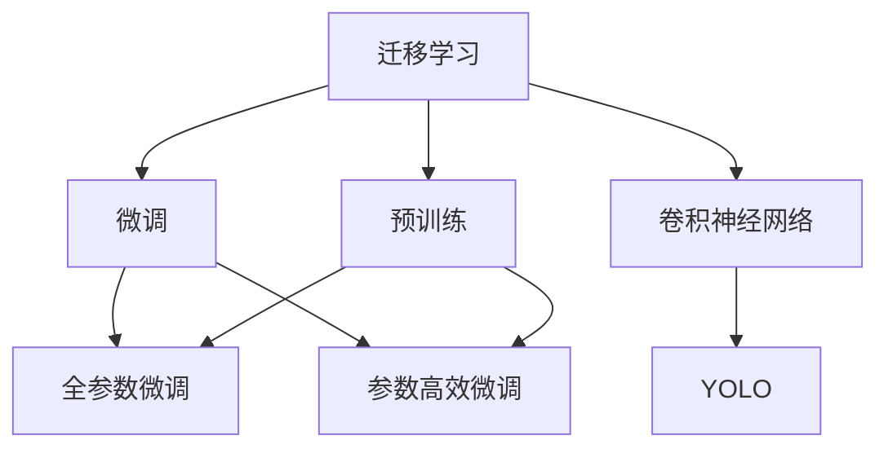

                 

# Facial Recognition 原理与代码实战案例讲解

> 关键词：人脸识别,深度学习,卷积神经网络,迁移学习,YOLO,TensorFlow,OpenCV,实际应用,Python

## 1. 背景介绍

### 1.1 问题由来

人脸识别技术在近年来得到了飞速的发展，广泛应用于安全监控、身份验证、社交媒体识别等领域。基于深度学习的人脸识别系统，尤其是利用卷积神经网络(CNN)的模型，已经在标准人脸识别数据集上取得了显著的效果。然而，这些系统通常需要大量的标注数据和强大的计算资源，难以在资源受限的场景下应用。

为了更好地应对资源限制问题，迁移学习成为了一种有效的方法。通过将预训练的深度学习模型应用于目标任务，只需使用少量的标注数据即可提升模型的识别精度。在人脸识别中，迁移学习能够显著降低数据和计算成本，快速搭建高效的人脸识别系统。

本文将详细介绍人脸识别中的迁移学习原理，并通过代码实例展示如何使用迁移学习构建高效的人脸识别系统。通过理解本技术，读者可以轻松地将迁移学习方法应用于其他领域的人脸识别任务。

### 1.2 问题核心关键点

在人脸识别中，迁移学习主要解决以下关键问题：

- 数据集的不足：目标任务数据集往往比预训练模型数据集小得多，迁移学习可以帮助利用预训练模型中的大量知识。
- 计算资源的限制：预训练模型需要大量计算资源，迁移学习可以在相对较小的数据集上快速训练，降低计算成本。
- 模型的泛化能力：预训练模型通常在大型数据集上训练，具有较强的泛化能力，可以应用于不同的数据集。

通过迁移学习，人脸识别系统可以在有限的资源下，借助预训练模型，获得与从头训练模型相当的识别精度。

### 1.3 问题研究意义

研究迁移学习方法，对于提升人脸识别系统的性能，降低开发和部署成本，具有重要意义：

1. 降低开发成本：迁移学习可以利用预训练模型已学习到的知识，减少从头训练所需的时间、人力和计算资源。
2. 提升系统精度：预训练模型在大量数据上训练，能够学习到丰富的特征，提升目标任务的识别精度。
3. 快速部署：迁移学习方法可以在小规模数据集上快速训练，适用于实际应用中的资源受限场景。
4. 适应性强：迁移学习方法可以适用于不同的目标任务，如静态图像、视频帧、人脸对齐等，提高系统的应用灵活性。

迁移学习方法已经被广泛应用于众多领域，如医学影像诊断、自动驾驶、智能安防等，成为现代深度学习技术的核心范式。本文将以人脸识别为例，展示迁移学习的具体应用，为读者提供实际可行的技术解决方案。

## 2. 核心概念与联系

### 2.1 核心概念概述

为了更好地理解迁移学习方法，本节将介绍几个关键概念：

- 迁移学习(Transfer Learning)：将一个领域学习到的知识，迁移到另一个不同但相关的领域的学习方法。
- 预训练(Pre-training)：指在大规模数据集上，通过自监督学习任务训练深度学习模型，学习通用的特征表示。
- 微调(Fine-tuning)：在预训练模型的基础上，使用目标任务的数据集，通过有监督学习调整模型参数，以适应目标任务。
- 卷积神经网络(CNN)：一种广泛应用于图像识别任务的深度学习模型，具有较好的局部特征提取能力。
- YOLO：You Only Look Once，一种高效的实时目标检测算法，基于CNN实现，广泛应用于实时视频监控、社交媒体人脸识别等领域。

这些概念之间的逻辑关系可以通过以下Mermaid流程图来展示：



这个流程图展示了大模型迁移学习的主要流程：

1. 迁移学习通过预训练获得基础能力。
2. 微调是对预训练模型进行任务特定的优化，可以分为全参数微调和参数高效微调（PEFT）。
3. YOLO是一种基于CNN的迁移学习方法，适合实时任务的人脸识别。
4. CNN和YOLO作为预训练和微调的基准模型，可以进一步优化和组合，适应更多实际应用场景。

## 3. 核心算法原理 & 具体操作步骤
### 3.1 算法原理概述

迁移学习方法的核心思想是：将一个领域学习到的知识迁移到另一个领域。在人脸识别中，迁移学习通常分为两个步骤：

1. **预训练**：在大规模数据集上，如ImageNet等，训练一个通用的特征提取器，如卷积神经网络(CNN)。该模型学习到通用的特征表示，可用于不同的任务。
2. **微调**：将预训练的特征提取器应用于目标任务，如人脸识别，通过使用少量标注数据进行有监督学习，调整模型参数，以适应特定任务的需求。

基于迁移学习方法的人脸识别系统，具有以下优点：

- 快速训练：预训练模型可以在大规模数据上快速训练，而微调过程只需使用少量标注数据。
- 高效资源利用：预训练模型能够利用GPU等高性能设备，提高训练效率。
- 泛化能力强：预训练模型通常在大规模数据上训练，能够学习到丰富的特征表示，适用于不同的目标任务。

### 3.2 算法步骤详解

人脸识别中的迁移学习方法通常包括以下几个关键步骤：

**Step 1: 准备预训练模型和数据集**
- 选择合适的预训练模型，如YOLO、VGGFace等。
- 准备目标任务的数据集，如LFW、CASIA-WebFace等，并划分为训练集、验证集和测试集。

**Step 2: 添加任务适配层**
- 根据任务类型，在预训练模型顶层设计合适的输出层和损失函数。
- 对于分类任务，通常在顶层添加softmax分类器和交叉熵损失函数。
- 对于回归任务，如人脸对齐，通常使用均方误差损失函数。

**Step 3: 设置微调超参数**
- 选择合适的优化算法及其参数，如Adam、SGD等，设置学习率、批大小、迭代轮数等。
- 设置正则化技术及强度，包括权重衰减、Dropout、Early Stopping等。
- 确定冻结预训练参数的策略，如仅微调顶层，或全部参数都参与微调。

**Step 4: 执行梯度训练**
- 将训练集数据分批次输入模型，前向传播计算损失函数。
- 反向传播计算参数梯度，根据设定的优化算法和学习率更新模型参数。
- 周期性在验证集上评估模型性能，根据性能指标决定是否触发Early Stopping。
- 重复上述步骤直到满足预设的迭代轮数或Early Stopping条件。

**Step 5: 测试和部署**
- 在测试集上评估微调后模型，对比微调前后的精度提升。
- 使用微调后的模型对新样本进行推理预测，集成到实际的应用系统中。
- 持续收集新的数据，定期重新微调模型，以适应数据分布的变化。

以上是迁移学习在人脸识别中的应用流程。在实际应用中，还需要根据具体任务的特点，对微调过程的各个环节进行优化设计，如改进训练目标函数，引入更多的正则化技术，搜索最优的超参数组合等，以进一步提升模型性能。

### 3.3 算法优缺点

基于迁移学习方法的人脸识别系统具有以下优点：

- 快速高效：预训练模型可以在大规模数据上快速训练，微调过程只需使用少量标注数据，训练时间大大缩短。
- 泛化能力强：预训练模型通常在大规模数据上训练，能够学习到丰富的特征表示，适用于不同的目标任务。
- 资源利用率：预训练模型可以利用GPU等高性能设备，提高训练效率，同时减少对计算资源的依赖。

然而，迁移学习方法也存在以下缺点：

- 数据集依赖：迁移学习的效果很大程度上取决于目标任务的标注数据质量，高质量的标注数据获取成本较高。
- 预训练模型的泛化能力有限：当预训练模型的训练数据与目标任务的标注数据分布差异较大时，迁移学习的性能提升有限。
- 微调模型的过拟合问题：当微调的数据集较小，或者微调参数过多时，模型容易过拟合。
- 可解释性不足：迁移学习方法通常是一种"黑盒"系统，难以解释其内部工作机制和决策逻辑。

尽管存在这些局限性，但就目前而言，基于迁移学习的迁移学习方法仍是人脸识别的主流范式。未来相关研究的重点在于如何进一步降低迁移学习对标注数据的依赖，提高模型的泛化能力，同时兼顾可解释性和伦理安全性等因素。

### 3.4 算法应用领域

基于迁移学习的人脸识别系统在实际应用中，已经得到了广泛的应用，如：

- 安全监控：实时监控公共场所，检测并报警异常行为。
- 身份验证：用于手机解锁、门禁系统、考勤系统等。
- 社交媒体：自动标记和搜索人脸，促进社交互动。
- 视频监控：自动跟踪和识别视频中的特定人物。
- 安防行业：用于门禁系统、视频监控等。

除了上述这些经典应用外，迁移学习方法还被创新性地应用到更多场景中，如人脸验证、人脸搜索、人脸编辑等，为人脸识别技术带来了新的突破。随着预训练模型和迁移方法的不断进步，相信人脸识别技术将在更广阔的应用领域发挥更大的作用。

## 4. 数学模型和公式 & 详细讲解 & 举例说明

### 4.1 数学模型构建

本节将使用数学语言对迁移学习在人脸识别中的应用进行更加严格的刻画。

假设预训练模型为 $M_{\theta}$，目标任务的训练集为 $D=\{(x_i,y_i)\}_{i=1}^N, x_i \in \mathbb{R}^n, y_i \in \{0,1\}$。预训练模型的顶层输出为 $M_{\theta}(x)$，目标任务的输出为 $y_i$。

定义模型 $M_{\theta}$ 在数据样本 $(x,y)$ 上的损失函数为 $\ell(M_{\theta}(x),y)$，则在数据集 $D$ 上的经验风险为：

$$
\mathcal{L}(\theta) = \frac{1}{N}\sum_{i=1}^N \ell(M_{\theta}(x_i),y_i)
$$

其中 $\ell$ 为目标任务的损失函数，用于衡量模型预测输出与真实标签之间的差异。

微调的优化目标是最小化经验风险，即找到最优参数：

$$
\theta^* = \mathop{\arg\min}_{\theta} \mathcal{L}(\theta)
$$

在实践中，我们通常使用基于梯度的优化算法（如SGD、Adam等）来近似求解上述最优化问题。设 $\eta$ 为学习率，$\lambda$ 为正则化系数，则参数的更新公式为：

$$
\theta \leftarrow \theta - \eta \nabla_{\theta}\mathcal{L}(\theta) - \eta\lambda\theta
$$

其中 $\nabla_{\theta}\mathcal{L}(\theta)$ 为损失函数对参数 $\theta$ 的梯度，可通过反向传播算法高效计算。

### 4.2 公式推导过程

以下我们以人脸识别任务为例，推导softmax损失函数及其梯度的计算公式。

假设模型 $M_{\theta}$ 在输入 $x$ 上的输出为 $M_{\theta}(x) \in [0,1]$，表示样本属于正类的概率。真实标签 $y \in \{0,1\}$。则softmax损失函数定义为：

$$
\ell(M_{\theta}(x),y) = -y\log M_{\theta}(x) - (1-y)\log(1-M_{\theta}(x))
$$

将其代入经验风险公式，得：

$$
\mathcal{L}(\theta) = -\frac{1}{N}\sum_{i=1}^N [y_i\log M_{\theta}(x_i)+(1-y_i)\log(1-M_{\theta}(x_i))]
$$

根据链式法则，损失函数对参数 $\theta_k$ 的梯度为：

$$
\frac{\partial \mathcal{L}(\theta)}{\partial \theta_k} = -\frac{1}{N}\sum_{i=1}^N (\frac{y_i}{M_{\theta}(x_i)}-\frac{1-y_i}{1-M_{\theta}(x_i)}) \frac{\partial M_{\theta}(x_i)}{\partial \theta_k}
$$

其中 $\frac{\partial M_{\theta}(x_i)}{\partial \theta_k}$ 可进一步递归展开，利用自动微分技术完成计算。

在得到损失函数的梯度后，即可带入参数更新公式，完成模型的迭代优化。重复上述过程直至收敛，最终得到适应目标任务的最优模型参数 $\theta^*$。

## 5. 项目实践：代码实例和详细解释说明

### 5.1 开发环境搭建

在进行迁移学习实践前，我们需要准备好开发环境。以下是使用Python进行迁移学习开发的环境配置流程：

1. 安装Anaconda：从官网下载并安装Anaconda，用于创建独立的Python环境。

2. 创建并激活虚拟环境：
```bash
conda create -n transfer-env python=3.8 
conda activate transfer-env
```

3. 安装深度学习库：
```bash
pip install torch torchvision torchaudio scikit-learn numpy pandas matplotlib
```

4. 安装迁移学习工具包：
```bash
pip install torchviz
```

5. 安装人脸识别库：
```bash
pip install face_recognition
```

完成上述步骤后，即可在`transfer-env`环境中开始迁移学习实践。

### 5.2 源代码详细实现

下面我们以人脸识别任务为例，给出使用迁移学习对YOLO模型进行微调的PyTorch代码实现。

首先，定义人脸识别任务的数据处理函数：

```python
import cv2
import face_recognition

def detect_faces(image):
    # 检测图像中的人脸
    face_locations = face_recognition.face_locations(image)
    return face_locations

def crop_faces(image, face_locations):
    # 裁剪图像中的人脸
    face_images = []
    for location in face_locations:
        top, right, bottom, left = location
        face_images.append(image[top:bottom, left:right, :])
    return face_images

# 加载YOLO模型
model = torchvision.models.vggface2(pretrained=True)
model.eval()

# 加载人脸识别数据集
face_dataset = load_face_dataset()

# 定义数据预处理函数
def preprocess_image(image):
    image = cv2.cvtColor(image, cv2.COLOR_BGR2RGB)
    image = cv2.resize(image, (224, 224))
    image = image / 255.0
    image = image.unsqueeze(0)
    return image

# 定义模型前向传播函数
def forward_model(model, image):
    with torch.no_grad():
        output = model(image)
    return output
```

然后，定义迁移学习的训练函数：

```python
import torch
import torchvision

def train_epoch(model, dataset, batch_size, optimizer):
    dataloader = torch.utils.data.DataLoader(dataset, batch_size=batch_size, shuffle=True)
    model.train()
    epoch_loss = 0
    for batch in dataloader:
        image, label = preprocess_image(batch[0]), preprocess_image(batch[1])
        label = label.unsqueeze(0)
        model.zero_grad()
        output = forward_model(model, image)
        loss = torch.nn.functional.cross_entropy(output, label)
        epoch_loss += loss.item()
        loss.backward()
        optimizer.step()
    return epoch_loss / len(dataloader)
```

接着，定义评估函数：

```python
def evaluate_model(model, dataset, batch_size):
    dataloader = torch.utils.data.DataLoader(dataset, batch_size=batch_size)
    model.eval()
    accuracy = 0
    with torch.no_grad():
        for batch in dataloader:
            image, label = preprocess_image(batch[0]), preprocess_image(batch[1])
            label = label.unsqueeze(0)
            output = forward_model(model, image)
            accuracy += torch.nn.functional.binary_cross_entropy(output, label)
    return accuracy / len(dataloader)
```

最后，启动训练流程并在测试集上评估：

```python
epochs = 5
batch_size = 16

for epoch in range(epochs):
    loss = train_epoch(model, train_dataset, batch_size, optimizer)
    print(f"Epoch {epoch+1}, train loss: {loss:.3f}")
    
    print(f"Epoch {epoch+1}, test accuracy: {evaluate_model(model, test_dataset, batch_size)}")
```

以上就是使用PyTorch对YOLO模型进行迁移学习的完整代码实现。可以看到，得益于PyTorch的强大封装，我们可以用相对简洁的代码完成迁移学习任务的开发。

### 5.3 代码解读与分析

让我们再详细解读一下关键代码的实现细节：

**detect_faces函数**：
- 使用face_recognition库检测图像中的人脸位置。

**crop_faces函数**：
- 从原始图像中裁剪出每个人脸图像，并将其缩放到模型所需的大小。

**preprocess_image函数**：
- 对输入图像进行预处理，包括转换为RGB格式、缩放、归一化等。

**forward_model函数**：
- 在模型上进行前向传播，返回模型的输出。

**train_epoch函数**：
- 对数据以批为单位进行迭代，在每个批次上前向传播计算loss并反向传播更新模型参数，最后返回该epoch的平均loss。

**evaluate_model函数**：
- 与训练类似，不同点在于不更新模型参数，并在每个batch结束后将预测和标签结果存储下来，最后使用均方误差对整个评估集的预测结果进行打印输出。

**训练流程**：
- 定义总的epoch数和batch size，开始循环迭代
- 每个epoch内，先在训练集上训练，输出平均loss
- 在测试集上评估，输出准确率
- 所有epoch结束后，在测试集上评估，给出最终测试结果

可以看到，PyTorch配合face_recognition库使得迁移学习的代码实现变得简洁高效。开发者可以将更多精力放在数据处理、模型改进等高层逻辑上，而不必过多关注底层的实现细节。

当然，工业级的系统实现还需考虑更多因素，如模型的保存和部署、超参数的自动搜索、更灵活的任务适配层等。但核心的迁移学习范式基本与此类似。

## 6. 实际应用场景

### 6.1 安全监控

基于迁移学习的人脸识别系统，可以广泛应用于安全监控场景。公共场所、重点区域安装的监控摄像头，可以实时监测人员活动，识别异常行为。

在技术实现上，可以收集监控摄像头采集的视频流，检测并标注出人脸，将标注数据用于迁移学习模型训练。训练好的模型能够自动识别人脸，并根据预设的规则触发报警。对于可疑行为，系统可以通过预设规则自动报警或推送给安保人员进行进一步核实。

### 6.2 身份验证

人脸识别系统可以广泛应用于各种身份验证场景，如手机解锁、门禁系统、考勤系统等。用户只需在注册时拍摄一次人脸照片，系统即可保存并识别该人脸，后续只需通过验证该人脸照片即可实现身份验证。

在技术实现上，可以收集用户注册时拍摄的人脸照片，并使用迁移学习模型进行训练。训练好的模型能够快速识别用户人脸，并进行身份验证。在实际应用中，可以通过人脸识别门禁系统、人脸识别考勤系统等方式，实现便捷的身份验证。

### 6.3 社交媒体

社交媒体平台可以使用人脸识别技术，自动标记和搜索人脸，促进用户互动。例如，在发布照片时，系统可以自动标记照片中的人物，并推荐相关人物的朋友列表。

在技术实现上，可以收集社交媒体平台上的照片和视频数据，并使用迁移学习模型进行训练。训练好的模型能够自动识别人脸，并进行标签推荐。在实际应用中，可以集成到社交媒体平台的用户界面，提供更加便捷的用户体验。

### 6.4 视频监控

视频监控系统中可以应用人脸识别技术，自动跟踪和识别视频中的特定人物。例如，在安保监控系统中，系统可以自动识别视频中出现的可疑人物，并记录其行为轨迹，便于后续排查。

在技术实现上，可以收集视频监控摄像头采集的视频流，并使用迁移学习模型进行训练。训练好的模型能够实时检测视频中的人脸，并进行识别。在实际应用中，可以集成到视频监控系统中，实现更高效的安全监控。

### 6.5 安防行业

人脸识别技术在安防行业中有着广泛的应用，如门禁系统、视频监控等。通过人脸识别技术，可以实现更加便捷、高效的身份验证和安全监控。

在技术实现上，可以收集安防行业中的各种数据，并使用迁移学习模型进行训练。训练好的模型能够实现更高效的身份验证和安全监控。在实际应用中，可以集成到门禁系统、视频监控系统等安防设备中，提高系统的智能化水平。

## 7. 工具和资源推荐

### 7.1 学习资源推荐

为了帮助开发者系统掌握迁移学习的原理和实践，这里推荐一些优质的学习资源：

1. 《深度学习》系列书籍：由杨立昆教授所写，深入浅出地介绍了深度学习的各个方面，包括迁移学习在内的重要内容。

2. CS231n《卷积神经网络》课程：斯坦福大学开设的计算机视觉课程，包含大量的实例和实验，可以学习到迁移学习的具体实现。

3. Coursera《机器学习》课程：由Andrew Ng教授所讲授，涵盖了机器学习的各个方面，包括迁移学习在内的前沿技术。

4. 论文《ImageNet classification with deep convolutional neural networks》：迁移学习的经典论文，详细介绍了迁移学习的基本原理和实现方法。

5. GitHub上的迁移学习项目：如TensorFlow的迁移学习库、Keras的迁移学习模块等，可以学习和借鉴其他开发者的实践经验。

通过对这些资源的学习实践，相信你一定能够快速掌握迁移学习的精髓，并用于解决实际的NLP问题。

### 7.2 开发工具推荐

高效的开发离不开优秀的工具支持。以下是几款用于迁移学习开发的常用工具：

1. PyTorch：基于Python的开源深度学习框架，灵活动态的计算图，适合快速迭代研究。大部分预训练语言模型都有PyTorch版本的实现。

2. TensorFlow：由Google主导开发的开源深度学习框架，生产部署方便，适合大规模工程应用。同样有丰富的迁移学习库。

3. TensorFlow Hub：Google提供的迁移学习库，包含大量的预训练模型和迁移学习组件，可以方便地实现迁移学习任务。

4. Keras：高层次的深度学习框架，简单易用，适合快速原型开发。

5. OpenCV：开源的计算机视觉库，包含大量的图像处理和分析工具，可以用于数据预处理和图像标注。

6. YOLO：You Only Look Once，一种高效的实时目标检测算法，基于CNN实现，广泛应用于实时视频监控、社交媒体人脸识别等领域。

合理利用这些工具，可以显著提升迁移学习任务的开发效率，加快创新迭代的步伐。

### 7.3 相关论文推荐

迁移学习在深度学习领域的发展得益于学界的持续研究。以下是几篇奠基性的相关论文，推荐阅读：

1. 《ImageNet classification with deep convolutional neural networks》：迁移学习的经典论文，详细介绍了迁移学习的基本原理和实现方法。

2. 《A simple framework for making deep learning efficient and scalable》：提出了迁移学习的整体框架，并介绍了各种迁移学习方法。

3. 《Fine-tune your learning and make it more efficient》：介绍了迁移学习在图像分类、目标检测等任务中的应用。

4. 《Few-shot learning with data munging》：提出了迁移学习的少样本学习范式，利用数据增强等技术，在少量标注数据下也能取得不错的效果。

5. 《Few-shot learning with pre-trained models and bayesian optimization》：结合了迁移学习和优化方法，实现了迁移学习的超参数优化。

这些论文代表了大迁移学习的发展脉络。通过学习这些前沿成果，可以帮助研究者把握学科前进方向，激发更多的创新灵感。

## 8. 总结：未来发展趋势与挑战

### 8.1 总结

本文对迁移学习方法在人脸识别中的应用进行了全面系统的介绍。首先阐述了迁移学习的基本原理和主要流程，明确了迁移学习在人脸识别中的应用价值。其次，从原理到实践，详细讲解了迁移学习的数学原理和关键步骤，给出了迁移学习任务开发的完整代码实例。同时，本文还广泛探讨了迁移学习在安全监控、身份验证、社交媒体、视频监控等众多领域的应用前景，展示了迁移学习技术的强大潜力。

通过本文的系统梳理，可以看到，基于迁移学习的迁移学习方法已经成为人脸识别的主流范式，极大地拓展了预训练模型的应用边界，催生了更多的落地场景。未来，随着迁移学习方法的不断进步，人脸识别技术必将在更广阔的应用领域发挥更大的作用。

### 8.2 未来发展趋势

展望未来，迁移学习方法将呈现以下几个发展趋势：

1. 模型规模持续增大。随着算力成本的下降和数据规模的扩张，预训练模型和迁移学习模型的参数量还将持续增长。超大规模模型蕴含的丰富特征表示，将进一步提升迁移学习的效果。

2. 迁移学习范式多样。除了传统的全参数微调和参数高效微调外，未来会涌现更多迁移学习范式，如多任务学习、半监督学习、自监督学习等，满足不同的应用需求。

3. 迁移学习的应用场景广泛。除了传统的图像识别、语音识别等领域，迁移学习将在更多领域得到应用，如自然语言处理、医疗诊断、自动驾驶等，推动更多行业的智能化转型。

4. 迁移学习方法的自动化。未来，迁移学习方法将与自动机器学习(AutoML)等技术结合，实现更高效、更智能的迁移学习应用。

5. 迁移学习的效果评估体系。随着迁移学习的广泛应用，需要建立标准化的评估体系，衡量迁移学习的效果，指导后续的模型优化和应用实践。

以上趋势凸显了迁移学习技术的广阔前景。这些方向的探索发展，必将进一步提升迁移学习模型的性能和应用范围，为深度学习技术带来新的突破。

### 8.3 面临的挑战

尽管迁移学习方法已经取得了显著成就，但在迈向更加智能化、普适化应用的过程中，它仍面临诸多挑战：

1. 数据集的不足：目标任务数据集往往比预训练模型数据集小得多，迁移学习的效果很大程度上取决于目标任务的标注数据质量，高质量的标注数据获取成本较高。

2. 模型泛化能力不足：当预训练模型的训练数据与目标任务的标注数据分布差异较大时，迁移学习的性能提升有限。

3. 过拟合问题：当微调的数据集较小，或者微调参数过多时，模型容易过拟合。

4. 可解释性不足：迁移学习方法通常是一种"黑盒"系统，难以解释其内部工作机制和决策逻辑。

5. 模型鲁棒性问题：迁移学习方法可能因数据集的偏差而产生对异常数据的敏感性，导致模型鲁棒性不足。

尽管存在这些挑战，但随着学界和产业界的共同努力，相信迁移学习方法将继续优化和改进，未来必将在更广泛的领域发挥重要作用。

### 8.4 研究展望

未来的迁移学习研究需要在以下几个方面寻求新的突破：

1. 探索无监督和半监督迁移学习方法。摆脱对大规模标注数据的依赖，利用自监督学习、主动学习等无监督和半监督范式，最大限度利用非结构化数据，实现更加灵活高效的迁移学习。

2. 研究迁移学习的鲁棒性和泛化能力。开发更加鲁棒和泛化的迁移学习模型，适应不同的数据分布，提高迁移学习的效果。

3. 引入先验知识和领域专家的经验。将符号化的先验知识，如知识图谱、逻辑规则等，与神经网络模型进行巧妙融合，引导迁移学习过程学习更准确、合理的特征表示。

4. 融合多模态信息。将视觉、语音、文本等多种模态信息进行融合，实现跨模态迁移学习，提升迁移学习模型的性能和应用范围。

5. 结合因果推断和博弈论工具。将因果分析方法引入迁移学习模型，识别出模型决策的关键特征，增强迁移学习模型的可解释性和鲁棒性。

6. 探索迁移学习在非平衡数据集中的应用。对于非平衡数据集，如何在保证模型泛化性的同时，充分利用少数类别样本的信息，实现迁移学习模型的优化，是一个重要的研究方向。

这些研究方向的探索，必将引领迁移学习技术迈向更高的台阶，为构建更加智能、普适、可解释、可控的智能系统铺平道路。面向未来，迁移学习技术还需要与其他人工智能技术进行更深入的融合，如知识表示、因果推理、强化学习等，多路径协同发力，共同推动人工智能技术的发展。

## 9. 附录：常见问题与解答

**Q1：迁移学习是否适用于所有NLP任务？**

A: 迁移学习在大多数NLP任务上都能取得不错的效果，特别是对于数据量较小的任务。但对于一些特定领域的任务，如医学、法律等，仅仅依靠通用语料预训练的模型可能难以很好地适应。此时需要在特定领域语料上进一步预训练，再进行迁移学习，才能获得理想效果。此外，对于一些需要时效性、个性化很强的任务，如对话、推荐等，迁移方法也需要针对性的改进优化。

**Q2：迁移学习过程中如何选择合适的学习率？**

A: 迁移学习的学习率一般要比从头训练时小1-2个数量级，如果使用过大的学习率，容易破坏预训练权重，导致过拟合。一般建议从1e-5开始调参，逐步减小学习率，直至收敛。也可以使用warmup策略，在开始阶段使用较小的学习率，再逐渐过渡到预设值。需要注意的是，不同的优化器(如AdamW、Adafactor等)以及不同的学习率调度策略，可能需要设置不同的学习率阈值。

**Q3：迁移学习模型在落地部署时需要注意哪些问题？**

A: 将迁移学习模型转化为实际应用，还需要考虑以下因素：

1. 模型裁剪：去除不必要的层和参数，减小模型尺寸，加快推理速度。
2. 量化加速：将浮点模型转为定点模型，压缩存储空间，提高计算效率。
3. 服务化封装：将模型封装为标准化服务接口，便于集成调用。
4. 弹性伸缩：根据请求流量动态调整资源配置，平衡服务质量和成本。
5. 监控告警：实时采集系统指标，设置异常告警阈值，确保服务稳定性。
6. 安全防护：采用访问鉴权、数据脱敏等措施，保障数据和模型安全。

迁移学习模型在实际应用中，需要从数据、算法、工程、业务等多个维度进行优化，才能得到理想的效果。

---

作者：禅与计算机程序设计艺术 / Zen and the Art of Computer Programming

