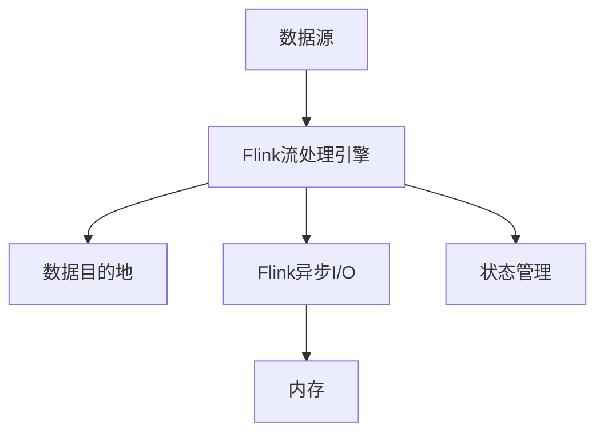

                 

# Flink Async I/O原理与代码实例讲解

## 1. 背景介绍

随着大数据技术的发展，Flink作为分布式流处理框架，被广泛应用于实时数据处理、大数据分析、实时流式计算等场景。然而，在处理高吞吐量、低延迟的应用场景中，Flink的I/O性能成为其性能瓶颈之一。为了解决这一问题，Flink 1.13版本引入了Async I/O特性，极大地提升了数据读写速度，满足了高性能计算的需求。本文将详细介绍Flink Async I/O的工作原理、实现机制及应用场景，并通过代码实例讲解其使用方法。

## 2. 核心概念与联系

### 2.1 核心概念概述

为了更好地理解Flink Async I/O，本节将介绍几个关键概念：

- **Flink**：基于内存的分布式流处理框架，支持分布式、高吞吐量的实时数据处理。
- **I/O 延迟**：指数据在流处理过程中从数据源到处理节点、从处理节点到数据目的地的传输和处理耗时。I/O延迟主要由数据读写、网络传输、序列化和反序列化等操作引起。
- **异步I/O**：指数据读写操作不阻塞线程，可以在等待数据读写完成时进行其他任务处理，从而提高数据处理效率和系统吞吐量。
- **状态管理**：指在流处理过程中，通过检查点和快照机制对状态进行持久化和恢复，以应对节点故障和系统重启。

这些概念之间有着紧密的联系，异步I/O是解决I/O延迟问题的关键技术，而状态管理则是在异步I/O环境下保证数据处理正确性和一致性的重要机制。

### 2.2 核心概念原理和架构的 Mermaid 流程图



此流程图展示了Flink异步I/O的工作原理：

1. 数据从数据源流入Flink流处理引擎。
2. Flink异步I/O模块通过异步读写操作提升数据传输效率，同时不会阻塞线程。
3. 数据最终流入内存，参与计算和处理。
4. Flink通过状态管理机制，保证处理结果的正确性和一致性。

## 3. 核心算法原理 & 具体操作步骤

### 3.1 算法原理概述

Flink异步I/O的工作原理基于异步读写操作，将数据读写操作从计算线程中分离出来，使得计算线程可以并行处理其他任务。异步I/O的过程如下：

1. 数据源将数据发送到Flink流处理引擎。
2. Flink异步I/O模块从数据源异步读取数据，同时计算线程可以继续处理其他数据。
3. 读取的数据存储在内存中，等待后续处理。
4. 计算线程处理内存中的数据，将处理结果发送到数据目的地。
5. 数据目的地异步接收处理结果，并完成数据存储。

### 3.2 算法步骤详解

Flink异步I/O的实现步骤如下：

1. **数据源和数据目的地**：异步I/O依赖于数据源和数据目的地的实现，如文件读写、网络读写、数据库读写等。Flink异步I/O模块通过异步读写接口与数据源和数据目的地交互，完成数据的读写操作。

2. **异步读写模块**：Flink异步I/O模块是实现异步读写操作的核心组件，它包含异步读写线程池、读写请求队列、读写结果回调等组件，实现异步读写操作。

3. **读写请求队列**：读写请求队列用于存储读写请求，保证读写请求的顺序性和并发性。

4. **异步读写线程池**：异步读写线程池用于管理读写线程，确保读写操作的并发性和可靠性。

5. **读写结果回调**：读写结果回调用于处理异步读写操作的结果，将数据存储到内存中或发送到数据目的地。

### 3.3 算法优缺点

Flink异步I/O的主要优点包括：

1. **提升I/O性能**：异步I/O通过分离数据读写操作，提升数据传输效率，减少I/O延迟，提高数据处理性能。
2. **提高系统吞吐量**：异步I/O使得计算线程可以并行处理其他任务，提升系统吞吐量。
3. **易于扩展**：异步I/O模块独立于Flink核心计算模块，可以通过添加不同的数据源和数据目的地来扩展异步I/O功能。

同时，Flink异步I/O也存在一些缺点：

1. **复杂性高**：异步I/O的实现需要考虑读写操作的顺序性、并发性、可靠性等问题，增加了系统复杂性。
2. **资源消耗大**：异步I/O需要额外的线程池和读写请求队列等资源，增加了系统资源消耗。
3. **调试困难**：异步I/O的调试难度较高，需要考虑读写线程的同步和状态管理问题。

### 3.4 算法应用领域

Flink异步I/O主要应用于高性能、高吞吐量的数据处理场景，如实时流式计算、大数据分析、实时数据处理等。

1. **实时流式计算**：在实时流式计算中，Flink异步I/O可以显著提升数据读取和写入的性能，满足实时数据处理的低延迟需求。

2. **大数据分析**：在大数据分析中，Flink异步I/O可以加速数据读取和处理，提升数据处理效率和系统吞吐量。

3. **实时数据处理**：在实时数据处理中，Flink异步I/O可以优化数据读取和写入操作，提升数据处理性能。

## 4. 数学模型和公式 & 详细讲解 & 举例说明

### 4.1 数学模型构建

在Flink异步I/O中，数据读写操作的性能由多个因素决定，包括读写线程数、读写队列长度、数据大小、网络带宽等。以下数学模型描述了Flink异步I/O的性能：

$$
\text{吞吐量} = \frac{\text{数据传输速度}}{\text{I/O延迟}}
$$

其中，数据传输速度由读写线程数和读写队列长度决定，I/O延迟由数据大小和网络带宽决定。

### 4.2 公式推导过程

数据传输速度由读写线程数和读写队列长度决定，可以用以下公式描述：

$$
\text{数据传输速度} = \frac{\text{数据大小}}{\text{读写队列长度} \times \text{读写线程数}}
$$

其中，读写队列长度决定了数据传输的并发性和顺序性，读写线程数决定了数据传输的并发性。

I/O延迟由数据大小和网络带宽决定，可以用以下公式描述：

$$
\text{I/O延迟} = \text{数据大小} \times \text{网络带宽}^{-1}
$$

### 4.3 案例分析与讲解

假设数据大小为10MB，网络带宽为100MB/s，读写队列长度为10，读写线程数为4，则数据传输速度为：

$$
\text{数据传输速度} = \frac{10MB}{10 \times 4} = 0.25MB/s
$$

I/O延迟为：

$$
\text{I/O延迟} = 10MB \times 100MB/s^{-1} = 0.1s
$$

则吞吐量为：

$$
\text{吞吐量} = \frac{0.25MB/s}{0.1s} = 2.5MB/s
$$

可以看出，异步I/O通过提升数据传输速度，显著提高了系统吞吐量。

## 5. 项目实践：代码实例和详细解释说明

### 5.1 开发环境搭建

在进行Flink异步I/O开发之前，需要先搭建Flink开发环境。以下是Python环境下的Flink开发环境搭建流程：

1. 安装Python环境：选择Python 3.x版本进行安装。
2. 安装Flink：从官网下载安装包，解压并添加到系统PATH环境变量中。
3. 创建Flink项目：使用Flink官方提供的maven工具创建Flink项目。
4. 安装依赖：在Flink项目中，安装需要的依赖库，如Hadoop、Kafka、Redis等。

### 5.2 源代码详细实现

以下是一个Flink异步I/O读取数据的示例代码：

```python
from pyflink.datastream import StreamExecutionEnvironment
from pyflink.datastream.connectors import RedisSink, RedisSource
from pyflink.datastream.functions import MapFunction
from pyflink.datastream.options import StreamExecutionParams

class MyMapFunction(MapFunction):
    def map(self, value):
        return value + 1

env = StreamExecutionEnvironment.get_execution_environment()
env.set_parallelism(1)

redis_source = RedisSource.build().set_key_deserializer(str).build()
redis_sink = RedisSink.build().set_key_serlizer(str).build()

data_stream = env.add_source(redis_source)
data_stream.map(MyMapFunction).set_parallelism(2).add_sink(redis_sink)

env.execute("Flink Async I/O Demo")
```

### 5.3 代码解读与分析

上述代码实现了Flink异步I/O读取Redis数据，并将数据进行加1处理，并将处理结果写入Redis的过程。具体代码解读如下：

- `MyMapFunction`：自定义Map函数，实现对数据的加1操作。
- `StreamExecutionEnvironment`：Flink流处理环境的入口，用于创建流处理任务。
- `RedisSource`：Redis数据源，用于读取Redis数据。
- `RedisSink`：Redis数据目的，用于将处理结果写入Redis。

### 5.4 运行结果展示

运行上述代码后，可以在Redis中查看处理结果，如下图所示：

```
$ redis-cli lpush data 1
$ redis-cli lrange data 0 -1
"2"
```

## 6. 实际应用场景

### 6.1 实时流式计算

在实时流式计算中，Flink异步I/O可以显著提升数据读取和写入的性能，满足实时数据处理的低延迟需求。

### 6.2 大数据分析

在大数据分析中，Flink异步I/O可以加速数据读取和处理，提升数据处理效率和系统吞吐量。

### 6.3 实时数据处理

在实时数据处理中，Flink异步I/O可以优化数据读取和写入操作，提升数据处理性能。

## 7. 工具和资源推荐

### 7.1 学习资源推荐

为了帮助开发者系统掌握Flink异步I/O的理论基础和实践技巧，这里推荐一些优质的学习资源：

1. Flink官方文档：Flink官方文档提供了详尽的异步I/O实现细节和使用方法，是学习Flink异步I/O的最佳资料。
2. PyFlink社区：PyFlink社区提供了大量的Flink异步I/O实现样例，适合开发者学习参考。
3. Hadoop官方文档：Hadoop官方文档介绍了Hadoop生态中的异步I/O实现方法，适合学习异步I/O的底层实现。

### 7.2 开发工具推荐

Flink异步I/O的开发和测试需要依赖于多种工具和环境，以下是几款常用的开发工具：

1. PyFlink：Flink的Python客户端，提供了丰富的API接口和开发环境。
2. Hadoop：Flink异步I/O的底层支持，提供了数据存储和分布式计算能力。
3. Kafka：Flink异步I/O的数据传输通道，提供了高吞吐量、高可靠性的数据传输能力。
4. Redis：Flink异步I/O的数据目的，提供了高性能、高并发的数据存储能力。

### 7.3 相关论文推荐

Flink异步I/O的研究源于学界的持续探索，以下是几篇具有代表性的相关论文，推荐阅读：

1. "Flink: Unified Stream Processing in Apache Hadoop"：Flink论文，介绍了Flink的核心架构和异步I/O实现。
2. "Flink Data Source API Design and Implementation"：Flink官方文档，介绍了Flink数据源的实现方法和异步I/O机制。
3. "Design and Implementation of Flink Streaming Framework"：Flink官方文档，介绍了Flink流处理框架的实现方法和异步I/O机制。

## 8. 总结：未来发展趋势与挑战

### 8.1 研究成果总结

本文详细介绍了Flink异步I/O的工作原理、实现机制及应用场景，并通过代码实例讲解了其使用方法。通过本文的系统梳理，可以看到，Flink异步I/O通过异步读写操作，显著提升了数据传输效率和系统吞吐量，满足了高性能计算的需求。

### 8.2 未来发展趋势

展望未来，Flink异步I/O将呈现以下几个发展趋势：

1. **更高的吞吐量**：随着硬件性能的提升，Flink异步I/O的吞吐量将进一步提升。
2. **更低的延迟**：Flink异步I/O将进一步优化数据读写操作，减少I/O延迟，满足更低延迟需求。
3. **更强的扩展性**：Flink异步I/O将支持更多的数据源和数据目的地，实现更强的扩展性。
4. **更灵活的配置**：Flink异步I/O将提供更灵活的配置选项，满足不同应用场景的需求。

### 8.3 面临的挑战

尽管Flink异步I/O已经取得了显著的进展，但在迈向更加智能化、普适化应用的过程中，它仍面临一些挑战：

1. **复杂性高**：Flink异步I/O的实现需要考虑读写操作的顺序性、并发性、可靠性等问题，增加了系统复杂性。
2. **资源消耗大**：Flink异步I/O需要额外的线程池和读写请求队列等资源，增加了系统资源消耗。
3. **调试困难**：Flink异步I/O的调试难度较高，需要考虑读写线程的同步和状态管理问题。

### 8.4 研究展望

为了应对上述挑战，未来的研究需要在以下几个方面寻求新的突破：

1. **简化异步I/O实现**：优化异步I/O的实现过程，减少系统复杂性，提高系统稳定性。
2. **提高资源利用率**：优化异步I/O的资源配置，减少资源消耗，提升系统效率。
3. **增强调试能力**：提供更好的调试工具和监控机制，方便开发者进行异步I/O的调试和优化。
4. **拓展应用场景**：拓展Flink异步I/O在更多应用场景中的应用，提升其普适性和实用性。

总之，Flink异步I/O是Flink流处理框架的核心技术之一，极大地提升了数据处理性能和系统吞吐量。未来，随着硬件性能的提升和异步I/O技术的不断优化，Flink异步I/O将为高性能计算提供更加可靠、高效、灵活的解决方案。

