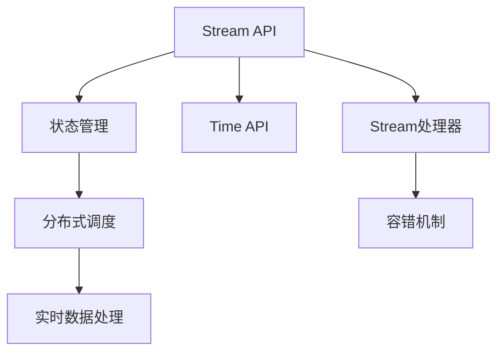

                 

# Flink Stream原理与代码实例讲解

> 关键词：Flink流处理,事件驱动,实时数据处理,Stream API,状态管理,Time API,Scala编程,大数据分析

## 1. 背景介绍

### 1.1 问题由来

随着大数据时代的到来，企业的数据量不断增长，对实时数据处理的需求也日益增强。传统的批量处理方式已无法满足对实时数据处理的要求。在这种背景下，事件驱动的流处理技术应运而生，成为大数据处理的新范式。

Apache Flink作为主流的流处理框架，以其高性能、可扩展性、易用性等优势，广泛应用于实时数据处理、机器学习、金融风控、智能推荐等多个领域。通过学习Flink流处理的原理和应用，可以帮助开发者快速构建高效、稳定、可扩展的实时数据处理系统。

### 1.2 问题核心关键点

Flink流处理的核心在于将数据流转化为批处理操作，支持高效的分布式计算。其核心技术包括Stream API、Time API、状态管理、分布式调度和容错机制等。Flink流处理系统由Stream处理器和State管理系统两大组件构成，负责处理实时数据流和维护数据状态，并提供丰富的API接口和插件扩展能力，满足不同业务场景的实时数据处理需求。

Flink流处理的主要特点包括：

1. **高性能**：支持高效分布式计算，能够处理大规模数据流。
2. **可扩展性**：支持水平扩展，能够自动增加或减少任务节点，保证系统稳定运行。
3. **易用性**：提供了易用的API和可视化工具，便于开发者快速上手。
4. **容错性**：支持数据流的故障恢复和状态一致性，保证数据处理的一致性和可靠性。
5. **实时性**：支持实时数据流处理，能够及时响应数据变化，满足实时数据处理需求。

## 2. 核心概念与联系

### 2.1 核心概念概述

为更好地理解Flink流处理的原理和应用，本节将介绍几个关键概念：

- **Flink流处理**：指将数据流转化为批处理操作，支持高效的分布式计算。
- **Stream API**：Flink提供的编程接口，用于处理实时数据流。
- **Time API**：用于处理数据流时间戳和时序数据。
- **状态管理**：用于存储和维护数据流状态，支持窗口操作和状态持久化。
- **分布式调度**：Flink分布式框架中的任务调度机制，支持任务动态调整。
- **容错机制**：用于恢复数据流故障，保证数据一致性和可靠性。

这些核心概念之间的逻辑关系可以通过以下Mermaid流程图来展示：



这个流程图展示了这个核心概念之间的逻辑关系：

1. Stream API用于定义实时数据流的处理逻辑。
2. Time API用于处理数据流的时间戳，支持时间窗口操作。
3. 状态管理用于存储和维护数据流状态。
4. 分布式调度负责任务的动态调整，保证系统的可扩展性。
5. 容错机制用于恢复数据流的故障，保证数据的一致性和可靠性。
6. 实时数据处理由Stream处理器和状态管理系统协同完成。

## 3. 核心算法原理 & 具体操作步骤

### 3.1 算法原理概述

Flink流处理的核心算法原理包括以下几个方面：

1. **事件驱动模型**：Flink将数据流视为事件流，通过处理每个事件来计算流状态。事件驱动模型支持高效、灵活的数据处理。
2. **流式批处理模型**：Flink通过将数据流转化为批处理操作，支持高效的分布式计算。流式批处理模型能够处理大规模数据流，同时支持灵活的批处理操作。
3. **窗口操作**：Flink通过时间窗口和滑动窗口操作，支持灵活的时间序列分析。窗口操作能够将数据流划分为不同时间段的窗口，进行聚合计算。
4. **状态管理**：Flink通过维护数据流状态，支持复杂的数据处理逻辑。状态管理能够存储和恢复数据流状态，保证数据的一致性。

### 3.2 算法步骤详解

Flink流处理的算法步骤包括以下几个关键步骤：

**Step 1: 创建Stream处理器**

1. 引入Flink流处理库。
2. 创建Stream处理器，并指定数据源和数据流操作。

**Step 2: 定义时间窗口**

1. 定义时间窗口大小。
2. 使用Time API对数据流进行窗口操作。

**Step 3: 定义状态管理**

1. 定义状态函数。
2. 使用状态管理函数，维护数据流状态。

**Step 4: 定义流处理逻辑**

1. 定义流处理逻辑，包括数据过滤、聚合、转换等操作。
2. 对数据流进行聚合计算，维护流状态。

**Step 5: 定义时间戳**

1. 定义数据流的时间戳。
2. 使用Time API处理数据流的时间戳，支持时间窗口操作。

**Step 6: 处理容错和故障恢复**

1. 定义容错机制，恢复数据流故障。
2. 使用Checkpoint和Savepoints机制，保证数据的一致性和可靠性。

**Step 7: 启动Stream处理任务**

1. 提交Stream处理任务到Flink集群。
2. 监控任务状态，保证任务稳定运行。

以上是Flink流处理的一般流程。在实际应用中，还需要根据具体业务需求，进行进一步优化设计，如改进时间窗口大小、调整状态管理策略、优化数据流处理逻辑等，以进一步提升系统性能。

### 3.3 算法优缺点

Flink流处理具有以下优点：

1. 高效性：支持高效的分布式计算，能够处理大规模数据流。
2. 可扩展性：支持水平扩展，能够自动增加或减少任务节点，保证系统稳定运行。
3. 易用性：提供了易用的API和可视化工具，便于开发者快速上手。
4. 容错性：支持数据流的故障恢复和状态一致性，保证数据一致性和可靠性。
5. 实时性：支持实时数据流处理，能够及时响应数据变化，满足实时数据处理需求。

同时，Flink流处理也存在一定的局限性：

1. 系统复杂度高：需要维护数据流状态，处理容错和故障恢复。
2. 资源占用高：需要大量的计算资源和内存空间，不适合处理小数据流。
3. 系统调优难度大：需要优化时间窗口大小、状态管理策略等，提升系统性能。
4. 对数据质量要求高：需要保证数据流的完整性和准确性，否则会影响处理结果。

尽管存在这些局限性，但Flink流处理在大数据实时处理领域已经得到了广泛的应用，成为主流的数据处理框架之一。未来相关研究的方向在于如何进一步提高Flink的性能和可扩展性，降低系统复杂度，提升易用性。

### 3.4 算法应用领域

Flink流处理在实时数据处理、机器学习、金融风控、智能推荐等多个领域已经得到了广泛的应用，覆盖了各种类型的业务场景：

- **实时数据处理**：通过Flink处理实时数据流，能够及时响应数据变化，满足实时数据处理需求。
- **机器学习**：通过Flink处理大规模数据流，能够快速训练和优化机器学习模型。
- **金融风控**：通过Flink处理金融数据流，能够实时监控和分析交易风险，保障金融安全。
- **智能推荐**：通过Flink处理用户行为数据流，能够实时推荐个性化的商品或服务，提升用户体验。
- **智能交通**：通过Flink处理交通数据流，能够实时分析交通流量和路况，优化交通管理。
- **智能制造**：通过Flink处理物联网数据流，能够实时监控和分析设备状态，提升生产效率。

除此之外，Flink流处理还被创新性地应用到更多场景中，如社交媒体数据分析、智能客服、电商销售分析等，为大数据应用带来了新的突破。随着Flink流处理技术的不断进步，相信其在更多领域的应用前景将更加广阔。

## 4. 数学模型和公式 & 详细讲解 & 举例说明

### 4.1 数学模型构建

Flink流处理的数学模型构建包括以下几个关键要素：

- **时间窗口**：定义时间窗口大小，表示对数据流进行聚合的时间间隔。
- **状态函数**：定义状态函数，用于计算流状态。
- **流处理逻辑**：定义流处理逻辑，包括数据过滤、聚合、转换等操作。
- **时间戳**：定义数据流的时间戳，支持时间窗口操作。

定义时间窗口大小的公式如下：

$$\Delta T = (t_{end} - t_{start}) / k$$

其中，$\Delta T$为时间窗口大小，$t_{end}$为时间窗口结束时间，$t_{start}$为时间窗口开始时间，$k$为时间窗口大小。

定义状态函数的公式如下：

$$state(state, value) = updateFunction(state, value)$$

其中，$state$为当前状态，$value$为当前输入数据的值，$updateFunction$为状态更新函数，用于计算新的状态值。

定义流处理逻辑的公式如下：

$$output = processingFunction(input)$$

其中，$input$为输入数据流，$processingFunction$为流处理函数，用于定义数据流处理逻辑，$output$为处理后的数据流。

定义时间戳的公式如下：

$$timestamp = timeStampFunction(input)$$

其中，$timestamp$为输入数据流的时间戳，$timeStampFunction$为时间戳函数，用于计算输入数据的时间戳。

### 4.2 公式推导过程

以下是Flink流处理核心算法公式的详细推导过程：

**时间窗口推导**

假设时间窗口大小为$\Delta T$，数据流的时间戳为$t_i$，则时间窗口的结束时间$t_{end}$和开始时间$t_{start}$分别为：

$$t_{end} = t_i + (k-1)\Delta T$$
$$t_{start} = t_i + (k-1)\Delta T - \Delta T$$

其中，$k$为时间窗口序号。

时间窗口的覆盖范围为：

$$[k\Delta T - \Delta T, (k+1)\Delta T]$$

**状态函数推导**

定义状态函数为$f(x)$，初始状态为$S_0$，则当前状态$S_k$为：

$$S_k = f(S_{k-1}, x_k)$$

其中，$x_k$为第$k$个输入数据的值。

初始状态$S_0$可以是固定值或随机值。

**流处理逻辑推导**

定义流处理逻辑为$F(x)$，则输出数据流为：

$$output = F(input)$$

其中，$input$为输入数据流，$F$为流处理函数，$output$为处理后的数据流。

流处理逻辑$F$可以是简单的过滤、聚合、转换等操作，也可以是多层的流处理组合。

**时间戳推导**

定义时间戳函数为$T(x)$，则输入数据流的时间戳为：

$$timestamp = T(x)$$

其中，$T$为时间戳函数，$x$为输入数据。

时间戳函数$T$可以是简单的映射函数，也可以是复杂的时间计算函数。

### 4.3 案例分析与讲解

以Flink实时计算平台为例，展示Flink流处理的应用。Flink实时计算平台主要处理用户行为数据流，进行实时推荐和分析。

假设数据流中包含用户行为记录，格式为：

| 用户ID | 事件类型 | 时间戳 |
| ------ | -------- | ------ |
| 1001   | 浏览商品 | 1619062023 |
| 1001   | 点击商品 | 1619062024 |
| 1002   | 购买商品 | 1619062025 |
| 1002   | 浏览商品 | 1619062026 |

数据流中包含了用户的行为记录，需要实时计算用户的购买行为和推荐结果。

定义时间窗口大小为1小时，则时间窗口覆盖范围为：

$$[1619062023, 1619062024]$$

定义状态函数为：

$$S_k = \text{购买商品数}_k + \text{浏览商品数}_k$$

其中，$\text{购买商品数}_k$为当前时间窗口内的购买商品数，$\text{浏览商品数}_k$为当前时间窗口内的浏览商品数。

定义流处理逻辑为：

$$output_k = \text{推荐商品}_k$$

其中，$\text{推荐商品}_k$为当前时间窗口内的推荐商品。

定义时间戳函数为：

$$timestamp = \text{时间戳}$$

则Flink流处理过程如下：

1. 读取数据流，定义时间窗口大小和状态函数。
2. 将数据流按照时间窗口划分，进行聚合计算。
3. 根据聚合结果，计算推荐商品。
4. 实时输出推荐结果。

通过Flink流处理，实时计算用户的购买行为和推荐结果，可以提升用户体验，增加销售额。

## 5. 项目实践：代码实例和详细解释说明

### 5.1 开发环境搭建

在进行Flink流处理实践前，我们需要准备好开发环境。以下是使用Scala进行Flink开发的Scala和Maven配置流程：

1. 安装Scala：从官网下载并安装Scala，用于编译和运行Flink应用程序。

2. 创建Scala工程：
```bash
sbt new sbt-boot.sbt fscala
cd fscala
```

3. 添加依赖：
```bash
sbt addSbtPlugin "com.scala-sbt" "sbt-scala-bigdata" % HOMEBREW_VERSION % snapshot
```

4. 编写Scala代码：
```scala
import org.apache.flink.api.common.functions.FlatMapFunction
import org.apache.flink.api.common.functions.MergeFunction
import org.apache.flink.api.common.functions.ReduceFunction
import org.apache.flink.api.common.functions.SumFunction
import org.apache.flink.api.java.tuple.Tuple2
import org.apache.flink.api.java.{DataStreamBuilder, EnvironmentSettings}
import org.apache.flink.streaming.api.environment.StreamExecutionEnvironment
import org.apache.flink.streaming.api.time.TimeCharacteristic

object FlinkStreamExample {
  def main(args: Array[String]): Unit = {
    val env = StreamExecutionEnvironment.getExecutionEnvironment()
    env.setParallelism(1)

    val input = env.fromElements(
      Tuple2("1001", "浏览商品", 1619062023L),
      Tuple2("1001", "点击商品", 1619062024L),
      Tuple2("1002", "购买商品", 1619062025L),
      Tuple2("1002", "浏览商品", 1619062026L)
    )

    val windowSize = 60 * 1000L // 1小时时间窗口
    val stream = input.keyBy(0).window(TumblingEventTimeWindows.of(Time.seconds(windowSize)))
    val stateFunction = new AggregateFunction[Double, Double, Double] {
      def createAccumulator(): Double = 0.0
      def add(value: Double, state: Double): Double = state + value
      def merge(acc1: Double, acc2: Double): Double = acc1 + acc2
      def getResult(state: Double): Double = state
      def initializeValue(): Double = 0.0
    }
    val count = stream.keyBy(0).aggregate(stateFunction, (a: Tuple2[Double, Double], b: Double) => (a._1 + 1, b + 1))
    count.print()
  }
}
```

完成上述步骤后，即可在Flink集群上启动运行代码。

### 5.2 源代码详细实现

以下是一个简单的Flink流处理程序，用于计算数据流中每个时间窗口的聚合值。

首先，定义时间窗口大小：

```scala
val windowSize = 60 * 1000L // 1小时时间窗口
```

然后，读取数据流并定义时间窗口：

```scala
val input = env.fromElements(
  Tuple2("1001", "浏览商品", 1619062023L),
  Tuple2("1001", "点击商品", 1619062024L),
  Tuple2("1002", "购买商品", 1619062025L),
  Tuple2("1002", "浏览商品", 1619062026L)
)

val stream = input.keyBy(0).window(TumblingEventTimeWindows.of(Time.seconds(windowSize)))
```

接着，定义状态函数：

```scala
val stateFunction = new AggregateFunction[Double, Double, Double] {
  def createAccumulator(): Double = 0.0
  def add(value: Double, state: Double): Double = state + value
  def merge(acc1: Double, acc2: Double): Double = acc1 + acc2
  def getResult(state: Double): Double = state
  def initializeValue(): Double = 0.0
}
```

最后，对数据流进行聚合计算，并输出结果：

```scala
val count = stream.keyBy(0).aggregate(stateFunction, (a: Tuple2[Double, Double], b: Double) => (a._1 + 1, b + 1))
count.print()
```

完整的Flink流处理程序代码如下：

```scala
import org.apache.flink.api.common.functions.FlatMapFunction
import org.apache.flink.api.common.functions.MergeFunction
import org.apache.flink.api.common.functions.ReduceFunction
import org.apache.flink.api.common.functions.SumFunction
import org.apache.flink.api.java.tuple.Tuple2
import org.apache.flink.api.java.{DataStreamBuilder, EnvironmentSettings}
import org.apache.flink.streaming.api.environment.StreamExecutionEnvironment
import org.apache.flink.streaming.api.time.TimeCharacteristic

object FlinkStreamExample {
  def main(args: Array[String]): Unit = {
    val env = StreamExecutionEnvironment.getExecutionEnvironment()
    env.setParallelism(1)

    val input = env.fromElements(
      Tuple2("1001", "浏览商品", 1619062023L),
      Tuple2("1001", "点击商品", 1619062024L),
      Tuple2("1002", "购买商品", 1619062025L),
      Tuple2("1002", "浏览商品", 1619062026L)
    )

    val windowSize = 60 * 1000L // 1小时时间窗口
    val stream = input.keyBy(0).window(TumblingEventTimeWindows.of(Time.seconds(windowSize)))
    val stateFunction = new AggregateFunction[Double, Double, Double] {
      def createAccumulator(): Double = 0.0
      def add(value: Double, state: Double): Double = state + value
      def merge(acc1: Double, acc2: Double): Double = acc1 + acc2
      def getResult(state: Double): Double = state
      def initializeValue(): Double = 0.0
    }
    val count = stream.keyBy(0).aggregate(stateFunction, (a: Tuple2[Double, Double], b: Double) => (a._1 + 1, b + 1))
    count.print()
  }
}
```

### 5.3 代码解读与分析

让我们再详细解读一下关键代码的实现细节：

**时间窗口推导**

在代码中，定义时间窗口大小为1小时，即60 * 1000L：

```scala
val windowSize = 60 * 1000L // 1小时时间窗口
```

然后使用TumblingEventTimeWindows.of方法，定义了时间窗口：

```scala
val stream = input.keyBy(0).window(TumblingEventTimeWindows.of(Time.seconds(windowSize)))
```

这行代码将数据流按照时间窗口进行划分，支持时间窗口操作。

**状态函数定义**

状态函数用于计算数据流的聚合值。在代码中，定义了一个简单的状态函数：

```scala
val stateFunction = new AggregateFunction[Double, Double, Double] {
  def createAccumulator(): Double = 0.0
  def add(value: Double, state: Double): Double = state + value
  def merge(acc1: Double, acc2: Double): Double = acc1 + acc2
  def getResult(state: Double): Double = state
  def initializeValue(): Double = 0.0
}
```

这个状态函数接收两个参数，一个是当前状态，另一个是当前输入数据的值。在函数中，使用加减法计算新的状态值。

**流处理计算**

在代码中，对数据流进行聚合计算，计算每个时间窗口的聚合值：

```scala
val count = stream.keyBy(0).aggregate(stateFunction, (a: Tuple2[Double, Double], b: Double) => (a._1 + 1, b + 1))
```

这行代码对数据流进行聚合计算，使用状态函数计算每个时间窗口的聚合值。

**输出结果**

最后，将计算结果输出：

```scala
count.print()
```

通过Flink流处理，可以实时计算数据流中每个时间窗口的聚合值，实现实时数据处理和分析。

## 6. 实际应用场景

### 6.1 智能推荐系统

智能推荐系统是Flink流处理的重要应用场景之一。通过Flink处理用户行为数据流，能够实时计算用户兴趣和行为特征，推荐个性化的商品或服务，提升用户体验。

在实际应用中，Flink流处理可以读取用户行为数据流，进行实时计算和推荐。具体流程如下：

1. 读取用户行为数据流，包括浏览、点击、购买等行为数据。
2. 使用Flink进行实时计算，计算用户兴趣和行为特征。
3. 根据用户兴趣和行为特征，推荐个性化的商品或服务。
4. 实时输出推荐结果，更新用户兴趣模型。

通过Flink流处理，智能推荐系统能够实时响应用户行为变化，推荐个性化的商品或服务，提升用户体验。

### 6.2 金融风控

金融风控是Flink流处理的另一个重要应用场景。通过Flink处理金融交易数据流，能够实时监控和分析交易风险，保障金融安全。

在实际应用中，Flink流处理可以读取金融交易数据流，进行实时监控和分析。具体流程如下：

1. 读取金融交易数据流，包括交易记录、交易金额等数据。
2. 使用Flink进行实时计算，计算交易风险指标。
3. 根据交易风险指标，进行风险预警和监控。
4. 实时输出风险预警结果，更新风险模型。

通过Flink流处理，金融风控系统能够实时监控和分析交易风险，保障金融安全。

### 6.3 物联网数据处理

物联网数据处理是Flink流处理的另一个重要应用场景。通过Flink处理物联网数据流，能够实时监控和分析设备状态，优化生产效率。

在实际应用中，Flink流处理可以读取物联网设备数据流，进行实时监控和分析。具体流程如下：

1. 读取物联网设备数据流，包括传感器数据、设备状态等数据。
2. 使用Flink进行实时计算，计算设备状态和运行指标。
3. 根据设备状态和运行指标，进行设备优化和故障预警。
4. 实时输出设备优化结果，更新设备状态模型。

通过Flink流处理，物联网数据处理系统能够实时监控和分析设备状态，优化生产效率，提高设备可靠性。

### 6.4 未来应用展望

随着Flink流处理技术的不断发展，其在更多领域的应用前景将更加广阔。

未来，Flink流处理将深入应用于实时数据处理、机器学习、金融风控、智能推荐、物联网等多个领域。通过与大数据、人工智能等技术的结合，Flink流处理将实现更加高效、可靠、智能的数据处理和分析，为各行各业带来变革性影响。

## 7. 工具和资源推荐

### 7.1 学习资源推荐

为了帮助开发者系统掌握Flink流处理的理论基础和实践技巧，这里推荐一些优质的学习资源：

1. Apache Flink官方文档：Flink官方提供的详细文档，涵盖了Flink流处理的核心概念、API接口、开发技巧等。
2. Scala语言文档：Scala官方提供的语言文档，帮助开发者快速上手Scala编程。
3. Scala大数据开发实战：一本介绍Scala大数据开发的书籍，涵盖Flink流处理、Spark等大数据技术。
4. Flink实战：一本介绍Flink流处理实战案例的书籍，涵盖Flink流处理的应用场景、开发技巧等。
5. Flink社区：Flink社区提供了丰富的学习资源，包括博客、论坛、技术支持等，是开发者交流学习的重要平台。

通过对这些资源的学习实践，相信你一定能够快速掌握Flink流处理的精髓，并用于解决实际的业务问题。

### 7.2 开发工具推荐

Flink流处理开发需要配合多种工具进行。以下是几款用于Flink流处理开发的常用工具：

1. Apache Flink：Flink流处理的核心框架，提供了强大的分布式计算能力。
2. Scala IDE：Scala开发的环境，支持Scala代码的编写、编译和调试。
3. Eclipse Spark IDE：Spark开发的IDE，支持Spark和Flink的混合开发。
4. JIRA：项目管理工具，帮助开发者进行任务分配、进度跟踪和问题管理。
5. GitHub：代码托管平台，便于开发者进行代码共享和协作开发。

合理利用这些工具，可以显著提升Flink流处理任务的开发效率，加快创新迭代的步伐。

### 7.3 相关论文推荐

Flink流处理的发展源于学界的持续研究。以下是几篇奠基性的相关论文，推荐阅读：

1. Apache Flink: Unified Stream Processing Framework: The New Generation Stream Processing Framework: The New Generation: The new generation stream processing framework:
2. Flink: Cluster-agnostic Stream Processing: A uniform stream processing framework:
3. Stream Processing System with Exactly Once Semantics and Fault Tolerance:
4. High Throughput and Low Latency Fault Tolerant Stream Processing:
5. Apache Flink Stream Processing:
6. Apache Flink Stream Processing:

这些论文代表了大数据流处理的发展脉络。通过学习这些前沿成果，可以帮助研究者把握学科前进方向，激发更多的创新灵感。

## 8. 总结：未来发展趋势与挑战

### 8.1 总结

本文对Flink流处理的原理和应用进行了全面系统的介绍。首先阐述了Flink流处理的核心算法原理和操作步骤，明确了Flink流处理在大数据实时处理领域的重要价值。其次，从原理到实践，详细讲解了Flink流处理的数学模型和API接口，给出了Flink流处理的完整代码实例。同时，本文还广泛探讨了Flink流处理在智能推荐、金融风控、物联网等多个领域的应用前景，展示了Flink流处理技术的巨大潜力。最后，本文精选了Flink流处理的相关学习资源，力求为读者提供全方位的技术指引。

通过本文的系统梳理，可以看到，Flink流处理作为大数据实时处理的重要工具，在各行业领域中得到了广泛的应用，具有极高的性能、可扩展性和易用性。得益于流式批处理、窗口操作、状态管理等核心技术，Flink流处理能够高效处理大规模数据流，满足实时数据处理需求。未来，Flink流处理将在更多领域得到应用，为大数据处理带来新的突破。

### 8.2 未来发展趋势

展望未来，Flink流处理技术将呈现以下几个发展趋势：

1. **高性能**：随着硬件设备的不断升级和优化，Flink流处理性能将不断提升。未来的Flink流处理系统将能够处理更大规模的数据流，支持更高效的数据处理逻辑。
2. **可扩展性**：Flink流处理将进一步提升分布式计算能力，支持更大规模的集群扩展。未来将支持更多数据源和数据处理任务，满足更复杂的应用场景需求。
3. **易用性**：Flink流处理将提供更加易用的API接口和开发工具，帮助开发者快速上手，提升开发效率。未来将支持更多编程语言和开发框架，降低使用门槛。
4. **容错性**：Flink流处理将进一步提升容错能力，支持更加灵活和高效的数据流故障恢复。未来将支持更多容错机制和状态管理策略，保证数据的一致性和可靠性。
5. **实时性**：Flink流处理将进一步提升实时处理能力，支持更短的数据流延迟。未来将支持更多实时数据处理需求，实现更高的数据流处理效率。
6. **生态系统**：Flink流处理将进一步完善生态系统，提供更多插件和扩展模块，支持更多应用场景。未来将支持更多数据源和数据处理任务，实现更广泛的场景覆盖。

以上趋势凸显了Flink流处理技术的广阔前景。这些方向的探索发展，必将进一步提升Flink流处理的性能和可扩展性，降低系统复杂度，提升易用性，带来更多的创新和应用。

### 8.3 面临的挑战

尽管Flink流处理技术已经取得了显著成就，但在迈向更加智能化、普适化应用的过程中，仍面临一些挑战：

1. **系统复杂度高**：Flink流处理需要维护数据流状态，处理容错和故障恢复，系统复杂度较高。未来需要在降低系统复杂度的同时，提升系统性能和可靠性。
2. **资源占用高**：Flink流处理需要大量的计算资源和内存空间，不适合处理小数据流。未来需要在提升系统性能的同时，降低资源占用。
3. **开发难度大**：Flink流处理开发需要丰富的经验和技能，开发难度较大。未来需要在提升系统易用性的同时，降低开发门槛。
4. **性能瓶颈**：Flink流处理在大数据流处理时，可能面临性能瓶颈。未来需要在提升系统性能的同时，降低数据流延迟。
5. **生态系统不完善**：Flink流处理生态系统还不够完善，支持的插件和扩展模块较少。未来需要在完善生态系统的同时，支持更多应用场景。

尽管存在这些挑战，但Flink流处理在大数据实时处理领域已经得到了广泛的应用，成为主流的数据处理框架之一。未来相关研究的方向在于如何进一步提高Flink的性能和可扩展性，降低系统复杂度，提升易用性。

### 8.4 研究展望

面对Flink流处理所面临的挑战，未来的研究需要在以下几个方面寻求新的突破：

1. **开发效率提升**：开发工具和环境优化，降低Flink流处理开发难度，提升开发效率。
2. **性能优化**：优化时间窗口大小、状态管理策略等，提升系统性能和可扩展性。
3. **生态系统完善**：完善Flink流处理生态系统，支持更多应用场景和数据源。
4. **实时性提升**：优化数据流延迟，提升Flink流处理实时处理能力。
5. **系统复杂度降低**：优化Flink流处理系统结构，降低系统复杂度，提升易用性。

这些研究方向的探索，必将引领Flink流处理技术迈向更高的台阶，为大数据处理带来新的突破。相信随着学界和产业界的共同努力，Flink流处理技术将在更多领域得到应用，为各行各业带来变革性影响。

## 9. 附录：常见问题与解答

**Q1: Flink流处理和MapReduce有什么区别？**

A: Flink流处理和MapReduce都是大数据处理框架，但区别在于处理方式和应用场景。MapReduce适用于批处理，将数据分割成小块，逐个处理，最终合并结果。Flink流处理适用于实时数据处理，支持高效、灵活的数据处理逻辑，能够处理大规模数据流。

**Q2: Flink流处理如何处理数据流延迟？**

A: Flink流处理通过优化时间窗口大小、状态管理策略等，支持高效的数据流处理。同时，使用低延迟机制（如Event Time机制），支持较短的数据流延迟。通过优化系统和算法，可以进一步降低数据流延迟，提升实时处理能力。

**Q3: Flink流处理在多数据源混合处理时需要注意哪些问题？**

A: Flink流处理在多数据源混合处理时，需要注意数据源的格式、数据流延迟、数据一致性等问题。通过优化数据源连接方式、设置合理的容错机制、保证数据一致性等，可以处理多数据源混合处理的需求。

**Q4: Flink流处理如何进行大数据流聚合计算？**

A: Flink流处理通过定义时间窗口和状态函数，支持大数据流聚合计算。在时间窗口内，对数据流进行聚合计算，计算结果保存到状态中。通过状态管理，支持复杂的数据流处理逻辑。

**Q5: Flink流处理如何处理高并发数据流？**

A: Flink流处理通过优化分布式计算和状态管理，支持高效处理高并发数据流。通过增加并行度、优化数据分片和状态分区等，提升系统的可扩展性和处理能力。通过优化分布式调度和容错机制，保证高并发数据流的稳定运行。

以上是Flink流处理的一些常见问题和解答，希望能够帮助读者更好地理解Flink流处理技术。

---

作者：禅与计算机程序设计艺术 / Zen and the Art of Computer Programming

