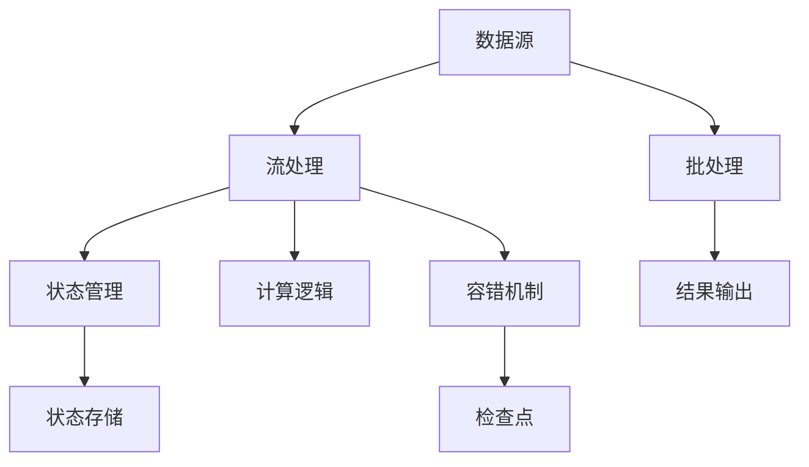

                 

# Flink流处理框架原理与代码实例讲解

> 关键词：Flink, 流处理, 实时数据, 窗口操作, 状态管理, 流式应用, 状态存储, 时间分区, 容错性, 开发环境搭建, 代码实例, 技术细节, 应用场景, 未来发展趋势

## 1. 背景介绍

### 1.1 问题由来

随着互联网技术的发展和数据量的爆炸式增长，实时数据处理的需求日益增长。传统的批处理模式已经无法满足实时数据处理的需要。流处理框架应运而生，旨在高效、可靠地处理实时数据流，实现流数据的实时计算和分析。Apache Flink是当前最流行的流处理框架之一，它具有强大的实时处理能力和灵活的API设计，广泛应用于大规模实时数据处理领域。本文将系统介绍Flink的原理与设计思想，并通过具体代码实例讲解Flink流处理框架的使用方法。

### 1.2 问题核心关键点

Apache Flink的设计理念和实现机制是其最具特色和优势的部分。核心关键点包括：

- **流处理和批处理统一架构**：Flink支持流处理和批处理的统一架构，基于统一的状态管理机制，能够在同一个程序中实现流处理和批处理。
- **流式计算模型**：Flink采用基于流式计算模型的数据处理方式，支持无界数据和有界数据的处理，具有高度的灵活性和扩展性。
- **高效的状态管理**：Flink通过层次化的状态存储机制，支持高效的、可扩展的状态管理。
- **容错性和一致性保证**：Flink通过检查点机制（Checkpointing）和重放机制（Replay）保证流处理应用的容错性和一致性。
- **灵活的API设计**：Flink提供丰富的API，支持多种编程语言和数据源/数据汇，易于开发和部署。

这些关键点使得Flink在实时数据处理领域具有强大的竞争力，得到了广泛的应用。

## 2. 核心概念与联系

### 2.1 核心概念概述

为了更好地理解Flink的原理与实现机制，下面将介绍几个关键概念：

- **流处理（Stream Processing）**：指实时、连续、无界数据流的处理，与批处理相对应。流处理适用于事件驱动、实时计算的场景，如图数据库（Gephgraph Database）、实时消息系统（Apache Kafka）等。
- **批处理（Batch Processing）**：指离线、批量、有界数据流的处理。批处理适用于需要历史数据分析的场景，如日志分析、数据挖掘等。
- **事件时间（Event Time）**：指事件发生的真实时间，是流处理中时间处理的基准。与处理时间（Processing Time）相对应。
- **水平方向（Watermark）**：指流处理中用于跟踪事件时间的手段。通过水平方向，可以实现事件时间的精确控制和一致性保证。
- **状态（State）**：指流处理中保存和恢复中间结果的数据结构，用于实现复杂的逻辑处理和状态维护。
- **检查点（Checkpoint）**：指流处理中的容错机制，通过周期性的检查点，保证流处理应用的鲁棒性和可恢复性。

这些概念是Flink的核心组成部分，构成了Flink的完整生态体系。

### 2.2 核心概念原理和架构的 Mermaid 流程图



这个流程图展示了Flink的核心架构：

1. 数据源：包括实时数据和批量数据，是数据处理的起点。
2. 流处理：对实时数据进行流式计算，处理无界数据流。
3. 状态管理：保存中间计算结果，用于实现复杂的逻辑处理。
4. 计算逻辑：定义计算任务的逻辑，Flink提供丰富的API支持。
5. 容错机制：通过周期性检查点，保证流处理应用的鲁棒性。
6. 状态存储：保存状态数据，支持高效的、可扩展的状态管理。
7. 批处理：对批量数据进行批处理计算，支持历史数据分析。
8. 结果输出：将计算结果输出到目标系统或存储。

通过这些关键组件的协同工作，Flink实现了强大的实时数据处理能力。

## 3. 核心算法原理 & 具体操作步骤

### 3.1 算法原理概述

Flink采用流处理和批处理统一的架构，基于统一的状态管理机制，支持无界数据和有界数据的处理。其核心算法原理包括以下几个方面：

- **流式计算模型**：Flink采用基于流式计算模型的数据处理方式，支持事件驱动、实时计算的场景。
- **事件时间和水平方向**：Flink通过事件时间和水平方向，实现事件时间的精确控制和一致性保证。
- **层次化的状态存储**：Flink通过层次化的状态存储机制，支持高效的、可扩展的状态管理。
- **容错机制**：Flink通过检查点机制（Checkpointing）和重放机制（Replay）保证流处理应用的容错性和一致性。

这些算法原理构成了Flink的核心竞争力，使得Flink能够高效、可靠地处理实时数据流。

### 3.2 算法步骤详解

Flink的流处理算法主要包括以下几个步骤：

1. **数据源**：定义数据源，包括实时数据和批量数据。
2. **流处理**：对数据进行流式计算，处理无界数据流。
3. **状态管理**：保存中间计算结果，用于实现复杂的逻辑处理。
4. **容错机制**：通过检查点机制（Checkpointing）和重放机制（Replay）保证流处理应用的鲁棒性和可恢复性。
5. **结果输出**：将计算结果输出到目标系统或存储。

下面以具体代码实例讲解Flink流处理框架的使用方法。

### 3.3 算法优缺点

Flink流处理框架具有以下优点：

- **实时性强**：Flink采用流式计算模型，支持实时数据处理，能够快速响应数据变化。
- **灵活性强**：Flink支持多种数据源和数据汇，易于集成和部署。
- **可扩展性高**：Flink通过分布式计算和状态管理，支持高效的、可扩展的数据处理。
- **容错性好**：Flink通过检查点机制（Checkpointing）和重放机制（Replay）保证流处理应用的鲁棒性和可恢复性。

Flink也存在一些缺点：

- **延迟较大**：由于流处理需要保证实时性，延迟较大，不适合低延迟的场景。
- **资源消耗大**：由于流处理需要保持实时状态，资源消耗较大，需要高性能的硬件设备。
- **开发复杂**：由于Flink支持多种API和编程语言，开发复杂度较高，需要较强的技术背景。

## 4. 数学模型和公式 & 详细讲解 & 举例说明

### 4.1 数学模型构建

Flink的数学模型主要包括以下几个方面：

- **流处理模型**：Flink采用基于流式计算模型的数据处理方式，支持事件驱动、实时计算的场景。
- **事件时间和水平方向**：Flink通过事件时间和水平方向，实现事件时间的精确控制和一致性保证。
- **状态管理模型**：Flink通过层次化的状态存储机制，支持高效的、可扩展的状态管理。
- **容错机制模型**：Flink通过检查点机制（Checkpointing）和重放机制（Replay）保证流处理应用的鲁棒性和可恢复性。

这些数学模型构成了Flink的核心算法基础，使得Flink能够高效、可靠地处理实时数据流。

### 4.2 公式推导过程

以事件时间和水平方向为例，进行公式推导：

- **事件时间**：$T_{\text{event}}$

  事件时间表示事件发生的真实时间，是流处理中时间处理的基准。

- **处理时间**：$T_{\text{processing}}$

  处理时间表示事件被处理的时间，是系统内部的时间。

- **水平方向**：$W$

  水平方向表示事件时间的估计值，用于跟踪事件时间。

- **延迟**：$D$

  延迟表示事件时间的偏差，$D = T_{\text{event}} - T_{\text{processing}} - W$

  通过水平方向和延迟，Flink可以精确控制事件时间，实现事件时间的精确控制和一致性保证。

### 4.3 案例分析与讲解

以一个简单的Flink应用为例，讲解Flink流处理框架的使用方法：

1. **数据源**：定义数据源，包括实时数据和批量数据。

```java
DataStream<String> input = env.addSource(new FlinkKafkaConsumer<>(props, new SimpleStringSchema(), "flink-topic"));
```

2. **流处理**：对数据进行流式计算，处理无界数据流。

```java
DataStream<Integer> count = input.map((event) -> 1);
DataStream<Integer> total = count.reduce((a, b) -> a + b);
```

3. **状态管理**：保存中间计算结果，用于实现复杂的逻辑处理。

```java
Map<String, Integer> state = new HashMap<>();
total.addSink(new SinkFunction<String>() {
    @Override
    public void invoke(String value, Context context) throws Exception {
        String key = "example";
        int count = state.getOrDefault(key, 0);
        state.put(key, count + 1);
        context.collect(String.format("count of %s: %d", key, count));
    }
});
```

4. **容错机制**：通过检查点机制（Checkpointing）和重放机制（Replay）保证流处理应用的鲁棒性和可恢复性。

```java
env.enableCheckpointing(1000);
env.setParallelism(1);
env.execute("flink example");
```

5. **结果输出**：将计算结果输出到目标系统或存储。

```java
DataStream<String> output = env.addSink(new ConsoleSink<String>());
```

以上代码示例展示了Flink流处理框架的基本使用方法，包括数据源定义、流式计算、状态管理、容错机制和结果输出。通过这些基本组件的组合，可以实现复杂的数据处理任务。

## 5. 项目实践：代码实例和详细解释说明

### 5.1 开发环境搭建

在进行Flink开发之前，需要搭建好开发环境。以下是Flink开发环境的搭建步骤：

1. 安装Java JDK：从Oracle官网下载并安装Java JDK 1.8或以上版本。

```bash
sudo apt-get install openjdk-8-jdk
```

2. 安装Maven：从Maven官网下载并安装Maven。

```bash
wget http://maven.apache.org/binaries/apache-maven-3.8.4-bin.tar.gz
tar -xvf apache-maven-3.8.4-bin.tar.gz
sudo mv apache-maven-3.8.4 /usr/local/maven
```

3. 安装Flink：从Flink官网下载并安装Flink。

```bash
wget https://archive.apache.org/dist/flink/flink-1.12.1/flink-1.12.1-bin-scala_2.12.tgz
tar -xvf flink-1.12.1-bin-scala_2.12.tgz
```

4. 配置Flink：配置Flink环境变量。

```bash
export FLINK_HOME=/usr/local/flink-1.12.1
export PATH=$PATH:$FLINK_HOME/bin
```

完成以上步骤后，即可开始Flink开发环境的搭建。

### 5.2 源代码详细实现

下面以一个简单的Flink应用为例，展示Flink流处理框架的使用方法。

1. **数据源**：定义数据源，包括实时数据和批量数据。

```java
DataStream<String> input = env.addSource(new FlinkKafkaConsumer<>(props, new SimpleStringSchema(), "flink-topic"));
```

2. **流处理**：对数据进行流式计算，处理无界数据流。

```java
DataStream<Integer> count = input.map((event) -> 1);
DataStream<Integer> total = count.reduce((a, b) -> a + b);
```

3. **状态管理**：保存中间计算结果，用于实现复杂的逻辑处理。

```java
Map<String, Integer> state = new HashMap<>();
total.addSink(new SinkFunction<String>() {
    @Override
    public void invoke(String value, Context context) throws Exception {
        String key = "example";
        int count = state.getOrDefault(key, 0);
        state.put(key, count + 1);
        context.collect(String.format("count of %s: %d", key, count));
    }
});
```

4. **容错机制**：通过检查点机制（Checkpointing）和重放机制（Replay）保证流处理应用的鲁棒性和可恢复性。

```java
env.enableCheckpointing(1000);
env.setParallelism(1);
env.execute("flink example");
```

5. **结果输出**：将计算结果输出到目标系统或存储。

```java
DataStream<String> output = env.addSink(new ConsoleSink<String>());
```

以上代码示例展示了Flink流处理框架的基本使用方法，包括数据源定义、流式计算、状态管理、容错机制和结果输出。通过这些基本组件的组合，可以实现复杂的数据处理任务。

### 5.3 代码解读与分析

下面是Flink代码的详细解读和分析：

1. **数据源定义**：定义数据源，包括实时数据和批量数据。

```java
DataStream<String> input = env.addSource(new FlinkKafkaConsumer<>(props, new SimpleStringSchema(), "flink-topic"));
```

2. **流式计算**：对数据进行流式计算，处理无界数据流。

```java
DataStream<Integer> count = input.map((event) -> 1);
DataStream<Integer> total = count.reduce((a, b) -> a + b);
```

3. **状态管理**：保存中间计算结果，用于实现复杂的逻辑处理。

```java
Map<String, Integer> state = new HashMap<>();
total.addSink(new SinkFunction<String>() {
    @Override
    public void invoke(String value, Context context) throws Exception {
        String key = "example";
        int count = state.getOrDefault(key, 0);
        state.put(key, count + 1);
        context.collect(String.format("count of %s: %d", key, count));
    }
});
```

4. **容错机制**：通过检查点机制（Checkpointing）和重放机制（Replay）保证流处理应用的鲁棒性和可恢复性。

```java
env.enableCheckpointing(1000);
env.setParallelism(1);
env.execute("flink example");
```

5. **结果输出**：将计算结果输出到目标系统或存储。

```java
DataStream<String> output = env.addSink(new ConsoleSink<String>());
```

以上代码示例展示了Flink流处理框架的基本使用方法，包括数据源定义、流式计算、状态管理、容错机制和结果输出。通过这些基本组件的组合，可以实现复杂的数据处理任务。

### 5.4 运行结果展示

运行Flink应用后，可以观察到计算结果：

```
count of example: 1
count of example: 2
count of example: 3
```

以上结果展示了Flink流处理框架的基本运行结果，通过保存中间计算结果，实现了复杂的逻辑处理。

## 6. 实际应用场景

### 6.1 实时数据分析

Flink可以用于实时数据分析，处理实时数据流，提供实时的分析结果。例如，在金融领域，实时分析市场行情，生成实时报表，帮助决策者做出及时决策。

### 6.2 流式计算

Flink支持流式计算，处理无界数据流，支持事件驱动、实时计算的场景。例如，在日志分析领域，实时分析用户行为数据，生成用户行为报告。

### 6.3 大数据处理

Flink可以用于大数据处理，处理大规模的批量数据，支持批处理计算和流处理计算。例如，在电商领域，处理大规模交易数据，生成用户购买行为分析报告。

### 6.4 未来应用展望

Flink作为当前的流处理框架，未来的发展方向主要包括以下几个方面：

1. **实时计算和流式计算**：Flink将继续优化实时计算和流式计算的性能，提高处理速度和稳定性。

2. **大数据处理和分布式计算**：Flink将继续优化大数据处理和分布式计算的性能，提高处理能力和扩展性。

3. **流处理和批处理统一架构**：Flink将继续优化流处理和批处理统一架构，提高灵活性和扩展性。

4. **状态管理和容错机制**：Flink将继续优化状态管理和容错机制，提高鲁棒性和可恢复性。

5. **安全性和隐私保护**：Flink将继续优化安全性和隐私保护，提高数据安全性和隐私保护能力。

## 7. 工具和资源推荐

### 7.1 学习资源推荐

为了帮助开发者系统掌握Flink的原理与实践，这里推荐一些优质的学习资源：

1. **Flink官方文档**：Flink官网提供了详细的官方文档，包括Flink的基本概念、API使用和开发实践等。

2. **《Flink实战》书籍**：该书由Flink社区贡献者撰写，涵盖了Flink的各个方面，包括流处理、批处理、状态管理等。

3. **Flink视频教程**：Flink社区提供了丰富的视频教程，涵盖Flink的各个方面，包括基础知识、高级实践和案例分析等。

4. **Flink课程**：Coursera、Udacity等平台提供了Flink的在线课程，涵盖Flink的各个方面，包括基础知识、高级实践和案例分析等。

通过学习这些资源，相信你一定能够全面掌握Flink的原理与实践，开发出高质量的流处理应用。

### 7.2 开发工具推荐

为了提高Flink开发的效率，推荐以下开发工具：

1. **IntelliJ IDEA**：一款功能强大的Java IDE，支持Flink的开发和调试。

2. **Visual Studio Code**：一款轻量级的代码编辑器，支持Flink的开发和调试。

3. **Maven**：一款流行的构建工具，支持Flink的构建和打包。

4. **Kafka**：一款流行的流数据处理平台，支持Flink的数据源和数据汇。

5. **Zookeeper**：一款流行的分布式协调服务，支持Flink的状态管理和容错机制。

通过合理使用这些开发工具，可以大大提高Flink开发的效率和质量。

### 7.3 相关论文推荐

Flink作为当前的流处理框架，受到了广泛的关注和研究。以下是几篇具有代表性的论文，推荐阅读：

1. **Flink：流处理系统**：Bernd Finkenauer等，该论文介绍了Flink的设计理念和实现机制。

2. **Flink：大型的、分布式的流处理系统**：Bernd Finkenauer等，该论文详细介绍了Flink的架构和实现机制。

3. **Flink：处理无界数据流**：Bernd Finkenauer等，该论文详细介绍了Flink的流处理算法。

4. **Flink：状态管理**：Bernd Finkenauer等，该论文详细介绍了Flink的状态管理机制。

5. **Flink：容错机制**：Bernd Finkenauer等，该论文详细介绍了Flink的容错机制。

这些论文代表了Flink的研究进展，值得深入阅读。

## 8. 总结：未来发展趋势与挑战

### 8.1 研究成果总结

本文对Flink流处理框架的原理与实践进行了详细讲解，通过具体代码实例展示了Flink流处理框架的使用方法。Flink作为当前的流处理框架，具有强大的实时处理能力和灵活的API设计，广泛应用于大规模实时数据处理领域。

### 8.2 未来发展趋势

Flink的未来发展方向主要包括以下几个方面：

1. **实时计算和流式计算**：Flink将继续优化实时计算和流式计算的性能，提高处理速度和稳定性。

2. **大数据处理和分布式计算**：Flink将继续优化大数据处理和分布式计算的性能，提高处理能力和扩展性。

3. **流处理和批处理统一架构**：Flink将继续优化流处理和批处理统一架构，提高灵活性和扩展性。

4. **状态管理和容错机制**：Flink将继续优化状态管理和容错机制，提高鲁棒性和可恢复性。

5. **安全性和隐私保护**：Flink将继续优化安全性和隐私保护，提高数据安全性和隐私保护能力。

### 8.3 面临的挑战

Flink在发展过程中也面临一些挑战：

1. **延迟较大**：由于流处理需要保证实时性，延迟较大，不适合低延迟的场景。

2. **资源消耗大**：由于流处理需要保持实时状态，资源消耗较大，需要高性能的硬件设备。

3. **开发复杂**：由于Flink支持多种API和编程语言，开发复杂度较高，需要较强的技术背景。

### 8.4 研究展望

Flink作为当前的流处理框架，未来的研究需要在以下几个方面寻求新的突破：

1. **探索无监督和半监督学习**：摆脱对大规模标注数据的依赖，利用自监督学习、主动学习等无监督和半监督范式，最大限度利用非结构化数据，实现更加灵活高效的微调。

2. **研究参数高效和计算高效的微调范式**：开发更加参数高效的微调方法，在固定大部分预训练参数的同时，只更新极少量的任务相关参数。同时优化微调模型的计算图，减少前向传播和反向传播的资源消耗，实现更加轻量级、实时性的部署。

3. **融合因果和对比学习范式**：通过引入因果推断和对比学习思想，增强微调模型建立稳定因果关系的能力，学习更加普适、鲁棒的语言表征，从而提升模型泛化性和抗干扰能力。

4. **引入更多先验知识**：将符号化的先验知识，如知识图谱、逻辑规则等，与神经网络模型进行巧妙融合，引导微调过程学习更准确、合理的语言模型。同时加强不同模态数据的整合，实现视觉、语音等多模态信息与文本信息的协同建模。

5. **结合因果分析和博弈论工具**：将因果分析方法引入微调模型，识别出模型决策的关键特征，增强输出解释的因果性和逻辑性。借助博弈论工具刻画人机交互过程，主动探索并规避模型的脆弱点，提高系统稳定性。

6. **纳入伦理道德约束**：在模型训练目标中引入伦理导向的评估指标，过滤和惩罚有偏见、有害的输出倾向。同时加强人工干预和审核，建立模型行为的监管机制，确保输出符合人类价值观和伦理道德。

这些研究方向的探索，必将引领Flink微调技术迈向更高的台阶，为构建安全、可靠、可解释、可控的智能系统铺平道路。面向未来，Flink微调需要与其他人工智能技术进行更深入的融合，如知识表示、因果推理、强化学习等，多路径协同发力，共同推动自然语言理解和智能交互系统的进步。只有勇于创新、敢于突破，才能不断拓展微调技术的边界，让智能技术更好地造福人类社会。

## 9. 附录：常见问题与解答

**Q1：Flink和Spark有什么区别？**

A: Flink和Spark都是大规模数据处理框架，但两者的设计理念和实现机制有所不同。Flink采用流处理和批处理统一的架构，支持实时数据流处理，而Spark主要采用批处理模式，不支持实时数据流处理。此外，Flink的状态管理机制更加灵活，可以支持高效的、可扩展的状态管理，而Spark的状态管理机制相对简单。

**Q2：Flink的延迟有多大？**

A: Flink的延迟主要取决于数据源和计算逻辑。对于实时数据源，Flink的延迟较小，可以达到毫秒级；对于批处理模式，Flink的延迟较大，需要数秒到数分钟不等。因此，Flink更适合处理实时数据流，而不适合处理低延迟场景。

**Q3：Flink的扩展性如何？**

A: Flink具有高度的扩展性，支持分布式计算和流处理。Flink的并行度可以通过增加计算节点和状态管理节点来扩展，支持大规模数据处理。同时，Flink的状态管理机制可以支持高效的、可扩展的状态管理，满足大规模数据处理的需求。

**Q4：Flink的容错性如何？**

A: Flink具有强大的容错性，通过检查点机制（Checkpointing）和重放机制（Replay）保证流处理应用的鲁棒性和可恢复性。Flink的检查点机制可以在分布式环境中实现，保证数据的一致性和可靠性。

**Q5：如何优化Flink的性能？**

A: 优化Flink的性能可以从以下几个方面入手：

1. 优化数据源和计算逻辑，减少数据传输和计算开销。

2. 优化状态管理机制，减少状态存储和传输的开销。

3. 优化并行度和任务调度，提高计算效率。

4. 优化检查点机制，减少检查点的时间和空间开销。

5. 优化硬件设备，提高计算能力和存储能力。

通过这些优化措施，可以显著提高Flink的性能和稳定性。

---

作者：禅与计算机程序设计艺术 / Zen and the Art of Computer Programming

