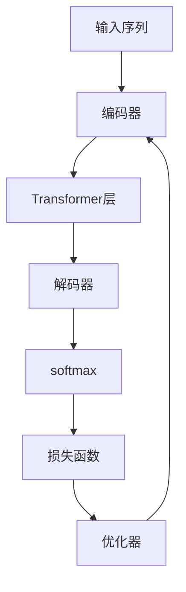

                 

# GPT-2原理与代码实例讲解

> 关键词：GPT-2, 自回归模型, 语言生成, 数学模型, 代码实现

## 1. 背景介绍

### 1.1 问题由来

自Attention机制被引入到深度学习中以来，NLP领域发生了翻天覆地的变化。其中，以自回归方式生成的Transformer模型，成为了现代语言模型的代表。在这些模型中，GPT-2作为其杰出代表，成功融合了自回归生成、多层Transformer等先进技术，并取得了SOTA的生成效果。

GPT-2的提出，标志着语言模型的研究进入了一个新纪元。它不仅在生成文本、对话、机器翻译等任务上表现出色，还因其可控生成的能力，为文本编辑、创作、翻译等提供了新的可能性。因此，本文将详细讲解GPT-2的原理，并结合代码实例，帮助读者深入理解其核心算法和技术细节。

### 1.2 问题核心关键点

GPT-2作为当今最流行的语言模型之一，其核心创新点包括：

- 自回归生成方式：通过前文序列预测后文序列，显著提升语言生成的自然度和连贯性。
- 多层Transformer结构：采用多层的Attention机制，捕捉更长的依赖关系，增强模型的表达能力。
- 大规模预训练：利用大规模语料进行预训练，学习通用语言知识。
- 可控文本生成：通过调整解码器的温度参数，实现从多选择到独热分布的生成模式转换。

这些特点使得GPT-2成为当前自然语言处理领域的明星模型，并在众多NLP任务中取得了优异的表现。理解这些核心点，对于深入学习GPT-2和相关技术至关重要。

## 2. 核心概念与联系

### 2.1 核心概念概述

为了更好地理解GPT-2模型，我们需要介绍以下几个核心概念：

- **自回归模型(AR Model)**：利用前文预测后文，利用历史信息预测未来，广泛应用于语言生成任务。
- **Transformer**：一种基于Attention机制的神经网络结构，用于处理序列数据，在机器翻译、文本生成等领域得到了广泛应用。
- **语言生成**：将无序的字符序列转换为有序的文本，实现自然语言的理解和生成。
- **预训练和微调**：先在大规模语料上预训练模型，再在特定任务上微调模型参数，提升模型在特定任务上的表现。
- **可控文本生成**：通过调整生成过程的随机性，控制生成的文本风格、多样性和流畅度。

这些概念构成了GPT-2模型的基础，帮助我们从底层理解其工作原理。

### 2.2 核心概念原理和架构的 Mermaid 流程图



这个流程图展示了GPT-2的核心架构：输入序列经过编码器，再通过多个Transformer层进行编码，最后通过解码器生成输出序列。优化器根据损失函数更新模型参数，不断迭代优化。

## 3. 核心算法原理 & 具体操作步骤
### 3.1 算法原理概述

GPT-2的生成过程可以概括为自回归生成和Transformer编码解码的结合。其生成过程如下：

1. 将输入序列 $x_1, x_2, \cdots, x_n$ 作为编码器的输入，经过编码器后得到隐状态 $h_1, h_2, \cdots, h_n$。
2. 编码器输出的隐状态 $h_1, h_2, \cdots, h_n$ 作为解码器的输入，通过解码器生成下一个词语 $y_1$。
3. 将生成的 $y_1$ 加入输入序列中，形成新的输入序列 $x_1, x_2, \cdots, x_n, y_1$。
4. 重复步骤2，直至生成完整的序列。

在解码过程中，GPT-2使用自回归方式，即每个词语的生成依赖于之前的所有词语。这一特点使得GPT-2在生成连贯性、自然度等方面表现优异。

### 3.2 算法步骤详解

GPT-2的生成过程可以分成以下几个步骤：

1. **编码器输入预处理**：将输入序列中的每个单词进行分词、编码，生成输入向量。
2. **Transformer编码层**：利用多个Transformer层对输入向量进行处理，捕捉长距离依赖。
3. **解码器生成**：利用解码器根据前文序列预测后文序列，得到每个词语的概率分布。
4. **softmax解码**：对生成的概率分布进行softmax操作，得到每个词语的概率。
5. **输出词语**：根据概率分布选择下一个词语，并将其加入输入序列中，形成新的序列。

### 3.3 算法优缺点

GPT-2模型具有以下优点：

- 生成的文本自然流畅，连贯性好。
- 能够处理较长的依赖关系，表达能力强。
- 可控生成，可以通过调整温度参数控制生成风格。

同时，其缺点也较为明显：

- 计算资源消耗大，需要大量GPU/TPU等高性能硬件。
- 生成速度较慢，生成的文本通常需要较长的时间。
- 生成的文本可能会带有预训练数据中的偏见。

## 4. 数学模型和公式 & 详细讲解

### 4.1 数学模型构建

GPT-2的数学模型主要包括以下几个部分：

- 输入序列编码：将输入序列 $x_1, x_2, \cdots, x_n$ 通过编码器进行编码，得到隐状态 $h_1, h_2, \cdots, h_n$。
- Transformer层：利用Transformer进行编码，得到编码后的向量 $v_1, v_2, \cdots, v_n$。
- 解码器生成：利用解码器生成下一个词语 $y_1$ 的概率分布 $P(y_1|x_1, x_2, \cdots, x_n)$。
- softmax解码：对生成的概率分布进行softmax操作，得到下一个词语的输出概率。

### 4.2 公式推导过程

首先，我们定义输入序列 $x_1, x_2, \cdots, x_n$ 和编码器输出 $h_1, h_2, \cdots, h_n$。假设输入序列的单词表示为 $e_1, e_2, \cdots, e_n$，则输入序列的嵌入向量可以表示为：

$$
E = [e_1, e_2, \cdots, e_n]
$$

编码器输出 $h_1, h_2, \cdots, h_n$ 可以表示为：

$$
H = [h_1, h_2, \cdots, h_n]
$$

解码器生成下一个词语 $y_1$ 的概率分布 $P(y_1|x_1, x_2, \cdots, x_n)$ 可以通过softmax函数得到：

$$
P(y_1|x_1, x_2, \cdots, x_n) = \frac{\exp(VW_h + VV_k + \log \alpha)}{\sum_{y \in \mathcal{Y}}\exp(VW_h + VV_k + \log \alpha)}
$$

其中，$V$ 为解码器中的Transformer参数矩阵，$W_h$ 和 $V_k$ 分别为编码器和解码器中的参数矩阵，$\alpha$ 为温度参数。

### 4.3 案例分析与讲解

以下通过一个简单的例子来说明GPT-2的生成过程：

假设输入序列为 "I have a dog"，我们需要预测下一个词语 "called"。首先，将输入序列通过编码器得到编码后的向量 $h_1, h_2, \cdots, h_n$，然后通过解码器生成下一个词语 "called" 的概率分布。最终，通过softmax操作得到下一个词语的输出概率。

具体的计算过程如下：

1. 输入序列 "I have a dog" 通过编码器得到编码后的向量 $h_1, h_2, \cdots, h_n$。
2. 编码后的向量 $h_1, h_2, \cdots, h_n$ 通过解码器得到下一个词语 "called" 的概率分布 $P(y_1|x_1, x_2, \cdots, x_n)$。
3. 通过softmax操作得到下一个词语 "called" 的输出概率 $P(y_1)$。

## 5. 项目实践：代码实例和详细解释说明

### 5.1 开发环境搭建

在使用PyTorch实现GPT-2之前，我们需要准备好开发环境。以下是具体的步骤：

1. 安装PyTorch：
```bash
pip install torch torchvision torchaudio
```

2. 安装transformers库：
```bash
pip install transformers
```

3. 安装gpt-2库：
```bash
pip install gpt-2
```

完成环境搭建后，我们可以开始编写GPT-2的代码实现。

### 5.2 源代码详细实现

以下是一个简单的GPT-2生成器的代码实现：

```python
import torch
from transformers import GPT2Tokenizer, GPT2LMHeadModel

# 初始化模型和tokenizer
tokenizer = GPT2Tokenizer.from_pretrained('gpt2')
model = GPT2LMHeadModel.from_pretrained('gpt2')

# 设置温度参数
temperature = 0.8

# 定义生成函数
def generate_text(start_text, length=50):
    # 对输入文本进行编码
    input_ids = tokenizer.encode(start_text)
    
    # 初始化隐藏状态
    hidden_states = model.init_hidden(input_ids)
    
    # 生成文本
    tokens = []
    with torch.no_grad():
        for i in range(length):
            # 对当前隐藏状态进行解码
            logits = model(hidden_states)
            softmax_logits = logits.softmax(dim=-1)
            softmax_logits = softmax_logits / temperature
            probs = softmax_logits.softmax(dim=-1)
            
            # 根据概率选择下一个单词
            token_id = probs.multinomial()
            
            # 将单词添加到生成的文本中
            tokens.append(tokenizer.decode(token_id[0]))
            
            # 将新单词作为输入，继续生成下一段文本
            hidden_states = hidden_states[:, -2:]
    
    # 返回生成的文本
    return start_text + ' '.join(tokens)

# 生成文本
print(generate_text('The quick brown fox', length=100))
```

### 5.3 代码解读与分析

让我们来详细解析上述代码中的关键部分：

1. **初始化模型和tokenizer**：使用`transformers`库提供的预训练模型和tokenizer，加载`gpt2`模型。
2. **设置温度参数**：温度参数用于控制生成文本的随机性，越大的温度值生成的文本越随机，越小的温度值生成的文本越规范。
3. **定义生成函数**：使用模型和tokenizer生成文本。首先对输入文本进行编码，然后初始化隐藏状态。接着，在每个时间步长上生成下一个单词，并将其添加到生成的文本中。
4. **生成文本**：调用`generate_text`函数生成文本，并输出结果。

## 6. 实际应用场景

### 6.1 智能客服系统

GPT-2在大规模预训练后，可以通过微调适配具体场景，构建智能客服系统。例如，对于银行业务咨询，可以收集客户历史对话记录，通过微调GPT-2模型，实现对客户的自然语言问答，提供精准的服务。

### 6.2 文本摘要生成

GPT-2生成的文本流畅自然，可以用于生成文本摘要。通过输入长文数据，GPT-2能够自动提取文本要点，生成简短精炼的摘要，提高信息处理效率。

### 6.3 文本风格转换

GPT-2可以用于文本风格的转换，将一段文本从一种风格转换为另一种风格。例如，将文言文转换为现代汉语，或将英文转换为中文。

### 6.4 未来应用展望

随着计算资源的提升和算法的进步，GPT-2在生成文本质量、生成速度等方面将得到进一步提升。未来，GPT-2有望在更多领域得到应用，如电影剧本生成、小说创作、自动翻译等。

## 7. 工具和资源推荐

### 7.1 学习资源推荐

1. 《深度学习与自然语言处理》一书：介绍了自然语言处理的基本概念和常用模型，是学习GPT-2的必备书籍。
2. GPT-2论文：《Language Models are Unsupervised Multitask Learners》，详细介绍了GPT-2的生成原理和训练方法。
3. Hugging Face官方博客：提供了GPT-2模型的详细解释和代码实现，适合入门学习。

### 7.2 开发工具推荐

1. PyTorch：深度学习框架，提供了丰富的预训练模型和工具库，支持高效的计算图和分布式训练。
2. Transformers：开源NLP库，提供了多种预训练模型和工具，方便用户进行模型训练和微调。
3. OpenAI GPT-2库：官方提供的GPT-2实现，简单易用，适合快速上手。

### 7.3 相关论文推荐

1. 《Language Models are Unsupervised Multitask Learners》：GPT-2的原始论文，介绍了生成模型的原理和训练方法。
2. 《GPT-2 Codebase》：GPT-2的官方代码库，包含详细的实现细节和测试样例。
3. 《On the Surprising Emergence of Unsupervised Learning in Language Models》：分析了预训练语言模型的潜在能力，提出了基于预训练的无监督学习方法。

## 8. 总结：未来发展趋势与挑战

### 8.1 研究成果总结

本文详细讲解了GPT-2模型的原理和代码实现，并介绍了其在NLP任务中的应用。通过深入理解GPT-2，我们能够更好地掌握其在实际应用中的使用方法，并在未来的研究中不断探索其潜力。

### 8.2 未来发展趋势

1. 更大规模的预训练模型：随着计算资源和训练数据的增长，未来将出现更大规模的预训练模型，如GPT-3、GPT-4等，进一步提升语言生成质量。
2. 更高效的训练方法：深度学习模型的训练效率一直是研究热点，未来将出现更加高效的训练方法，如分布式训练、混合精度训练等。
3. 更广泛的应用场景：GPT-2在NLP任务中的应用将继续扩展，如医疗、金融、法律等领域，为更多行业带来智能解决方案。

### 8.3 面临的挑战

1. 计算资源消耗大：GPT-2模型需要大量计算资源进行训练和推理，对硬件要求高。
2. 模型解释性差：生成的文本难以解释，难以确保其正确性和可靠性。
3. 数据依赖性强：模型的生成效果依赖于训练数据的质量和数量，如何获取高质量的数据是一个挑战。

### 8.4 研究展望

未来的研究需要解决以上挑战，并进一步探索GPT-2的潜力，如提高生成速度、增强模型解释性、优化模型训练方法等。同时，结合其他人工智能技术，如知识图谱、因果推理等，构建更加强大和智能的语言生成模型。

## 9. 附录：常见问题与解答

**Q1：GPT-2与GPT-1有何不同？**

A: GPT-2相较于GPT-1，主要改进在以下几个方面：
- 规模更大：GPT-2采用了更大的Transformer层，参数量从GPT-1的1.2亿增加到15亿。
- 结构更复杂：GPT-2采用了多层Transformer，可以捕捉更长的依赖关系。
- 预训练方法改进：GPT-2在预训练过程中，采用了更复杂的自回归和掩码机制，学习到了更丰富的语言知识。

**Q2：如何使用GPT-2进行文本生成？**

A: 使用GPT-2进行文本生成，需要以下步骤：
1. 导入GPT-2库和tokenizer。
2. 设置温度参数。
3. 输入一个起始文本。
4. 调用生成函数，生成指定长度的文本。

**Q3：GPT-2在训练过程中需要哪些数据？**

A: 训练GPT-2需要大规模的文本数据，如维基百科、新闻、小说等。这些数据可以用于预训练模型的编码和解码过程，学习到通用的语言知识。

**Q4：GPT-2在实际应用中需要注意哪些问题？**

A: 在实际应用中，需要注意以下几个问题：
1. 数据隐私：生成的文本可能包含敏感信息，需要严格保护。
2. 模型偏见：训练数据中可能包含偏见信息，生成的文本也可能带有偏见。
3. 模型解释性：生成的文本难以解释，需要额外的工具和手段进行解释。

---

作者：禅与计算机程序设计艺术 / Zen and the Art of Computer Programming

