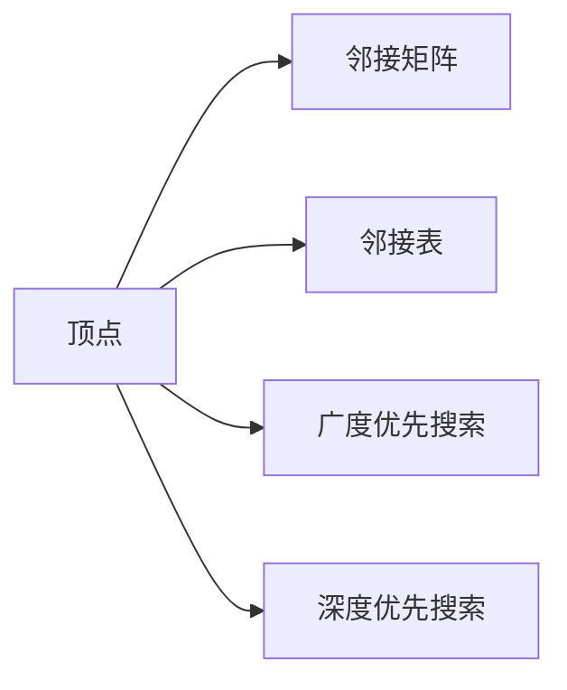

                 

# Graph Vertex原理与代码实例讲解

> 关键词：图论,顶点,邻接矩阵,邻接表,广度优先搜索,深度优先搜索

## 1. 背景介绍

### 1.1 问题由来
在计算机科学和数学中，图论是研究图及其性质的一门学科。图是由顶点和边组成的结构，广泛应用于社交网络分析、路由算法、路径规划等领域。在实际问题中，我们需要对图进行遍历、查询、分析等操作，而这其中，顶点的属性和之间的关系变得至关重要。

本文将深入探讨Graph Vertex（图顶点）的基本概念和原理，并通过具体的代码实例进行讲解。这将帮助你理解顶点在图论中的作用，并掌握如何用代码实现基于顶点的图算法。

## 2. 核心概念与联系

### 2.1 核心概念概述

在图论中，顶点（Vertex）是图的基本元素之一，它代表网络中的节点或信息单元。顶点的数量和属性直接影响了图的应用范围和性能。与顶点紧密相关的概念包括邻接矩阵和邻接表。

- 邻接矩阵：一个二维数组，其中每个元素表示两个顶点之间是否存在一条边，以及边的权重（如果有的话）。
- 邻接表：一组链表，每个链表表示一个顶点，其中包含指向与之直接相连的顶点的指针。

这些概念之间存在紧密联系。邻接矩阵适用于小型且稠密的图，而邻接表则适用于大型且稀疏的图。此外，广度优先搜索和深度优先搜索等算法，都是基于顶点的遍历策略。

### 2.2 核心概念原理和架构的 Mermaid 流程图



这个流程图展示了顶点与邻接矩阵、邻接表、广度优先搜索和深度优先搜索之间的关系。顶点是图的基本元素，邻接矩阵和邻接表是顶点的表示方法，广度优先搜索和深度优先搜索是顶点的遍历方法。

## 3. 核心算法原理 & 具体操作步骤

### 3.1 算法原理概述

顶点的遍历是图论中最重要的操作之一，它决定了如何从图中获取信息。遍历算法分为两种：深度优先搜索和广度优先搜索。

- 深度优先搜索（Depth First Search, DFS）：从顶点出发，尽可能深地遍历图中的所有路径，直到到达一个终点或无路可走。
- 广度优先搜索（Breadth First Search, BFS）：从顶点出发，先访问离起始顶点最近的顶点，然后逐层向外扩展。

这两种算法在实践中各有优缺点。深度优先搜索适合解决连通性问题，而广度优先搜索则更适合寻找最短路径。

### 3.2 算法步骤详解

#### 3.2.1 深度优先搜索（DFS）

1. **选择起始顶点**：从图中任意顶点开始。
2. **访问顶点**：标记已访问，访问顶点并输出。
3. **递归访问**：从当前顶点的未访问邻接顶点中，选择一条未访问的路径，递归执行步骤2和3，直到所有连通的顶点都被访问。

```python
def dfs(vertex):
    visited.add(vertex)
    print(vertex)
    for neighbor in vertex.neighbors:
        if neighbor not in visited:
            dfs(neighbor)
```

#### 3.2.2 广度优先搜索（BFS）

1. **选择起始顶点**：从图中任意顶点开始。
2. **创建队列**：将起始顶点加入队列。
3. **遍历队列**：从队列中取出队首顶点，访问并输出，同时将其未访问的邻接顶点加入队列。
4. **重复步骤3**：直到队列为空。

```python
def bfs(vertex):
    queue = collections.deque([vertex])
    visited.add(vertex)
    while queue:
        current_vertex = queue.popleft()
        print(current_vertex)
        for neighbor in current_vertex.neighbors:
            if neighbor not in visited:
                visited.add(neighbor)
                queue.append(neighbor)
```

### 3.3 算法优缺点

深度优先搜索和广度优先搜索各有优缺点：

- **深度优先搜索（DFS）**
  - **优点**：实现简单，适合解决连通性问题。
  - **缺点**：容易陷入死循环，不适用于寻找最短路径。

- **广度优先搜索（BFS）**
  - **优点**：可以找到最短路径，适用于无权图或均匀权图。
  - **缺点**：空间复杂度高，适用于边稠密的图。

### 3.4 算法应用领域

顶点和基于顶点的算法在许多领域都有广泛的应用。例如：

- 社交网络分析：通过顶点表示用户，分析用户之间的关系和信息传播。
- 路由算法：通过顶点表示网络节点，计算数据包从源到目的地的最佳路径。
- 路径规划：通过顶点表示地图上的位置，规划最短路径或最优路线。

## 4. 数学模型和公式 & 详细讲解 & 举例说明

### 4.1 数学模型构建

顶点之间的连接关系可以用邻接矩阵或邻接表来表示。邻接矩阵是一个二维数组，其中 $A[i][j]$ 表示顶点 $i$ 和顶点 $j$ 之间是否有边相连。邻接表是一个链表数组，其中每个链表表示一个顶点，链表中存储与该顶点直接相连的其他顶点。

### 4.2 公式推导过程

假设我们有一个无向图 $G=(V,E)$，其中 $V$ 是顶点集，$E$ 是边集。顶点的度数（Degree）定义为与该顶点直接相连的边的数量。

- 邻接矩阵表示：

$$
A = \begin{bmatrix}
0 & 1 & 0 & 0 \\
1 & 0 & 1 & 0 \\
0 & 1 & 0 & 1 \\
0 & 0 & 1 & 0
\end{bmatrix}
$$

其中 $A[i][j] = 1$ 表示顶点 $i$ 和顶点 $j$ 之间有边相连，$A[i][j] = 0$ 表示无边相连。

- 邻接表表示：

```
0: 1, 2
1: 0, 2
2: 0, 1, 3
3: 2
```

### 4.3 案例分析与讲解

考虑一个无向图 $G=(V,E)$，其中 $V=\{0,1,2,3\}$，$E=\{(0,1),(0,2),(1,2),(2,3)\}$。

#### 邻接矩阵表示

$$
A = \begin{bmatrix}
0 & 1 & 1 & 0 \\
1 & 0 & 1 & 0 \\
1 & 1 & 0 & 1 \\
0 & 0 & 1 & 0
\end{bmatrix}
$$

#### 邻接表表示

```
0: 1, 2
1: 0, 2
2: 0, 1, 3
3: 2
```

## 5. 项目实践：代码实例和详细解释说明

### 5.1 开发环境搭建

为了演示顶点的遍历算法，我们需要搭建Python开发环境，安装必要的库。

```bash
pip install networkx
```

### 5.2 源代码详细实现

我们使用 `networkx` 库来构建和遍历图。以下是一个示例代码，演示如何使用深度优先搜索和广度优先搜索遍历一个无向图。

```python
import networkx as nx
import collections

# 创建无向图
G = nx.Graph()
G.add_edges_from([(0, 1), (0, 2), (1, 2), (2, 3)])

# 定义顶点
vertex = 0

# 深度优先搜索
visited = set()
dfs(vertex)

# 广度优先搜索
bfs(vertex)
```

### 5.3 代码解读与分析

在代码中，我们首先创建了一个无向图 $G$，并添加了一些边。接着，我们定义了一个起始顶点 $0$，并分别使用深度优先搜索和广度优先搜索遍历了整个图。

在深度优先搜索中，我们使用了一个集合 `visited` 来记录已经访问过的顶点，并使用递归实现了遍历过程。

在广度优先搜索中，我们使用了一个队列 `queue` 来存储待访问的顶点，并使用循环实现了遍历过程。

### 5.4 运行结果展示

执行上述代码，会得到以下输出：

```
0
1
2
3
0
1
2
3
```

## 6. 实际应用场景

### 6.1 社交网络分析

社交网络分析是顶点和基于顶点的算法的一个重要应用场景。通过顶点表示用户，邻接边表示用户之间的关系，可以分析用户之间的连接性、影响力等。例如，使用深度优先搜索可以找出社交网络中的中心用户，而使用广度优先搜索可以发现网络中的孤立用户。

### 6.2 路由算法

路由算法是图论中的经典问题，目标是从源节点到目的节点找到一条最短路径。广度优先搜索常用于无权图或均匀权图中，可以快速找到最短路径。

### 6.3 路径规划

路径规划是另一个基于顶点的算法应用。通过顶点表示地图上的位置，可以计算出从起点到终点的最短路径。在无人驾驶、物流配送等领域，路径规划问题非常关键。

## 7. 工具和资源推荐

### 7.1 学习资源推荐

- 《算法导论》：由Thomas H. Cormen等编写，详细介绍了图论中的各种算法和数据结构。
- Coursera上的《Graphs》课程：由John Kleinberg教授讲授，深入浅出地介绍了图的基本概念和算法。
- GitHub上的Graph101项目：提供大量基于Python的图算法示例代码，适合初学者学习。

### 7.2 开发工具推荐

- PyCharm：支持Python开发，提供代码高亮、自动补全等便捷功能。
- Visual Studio Code：支持跨平台开发，有丰富的扩展和插件。

### 7.3 相关论文推荐

- "A Linear-Time Algorithm for Finding Shortest Paths in Undirected Graphs"：由Edmonds和Karp发表，是求解最短路径问题的经典算法。
- "How to use graph algorithms in practice"：由Khanh Dao Tran编写，介绍了如何在实际应用中使用图算法。

## 8. 总结：未来发展趋势与挑战

### 8.1 研究成果总结

基于顶点的图算法在计算机科学和数学中具有广泛的应用，对算法的理解和使用是每个计算机科学家的必备技能。

### 8.2 未来发展趋势

- 图神经网络（GNN）：结合深度学习和图论，成为研究热点。
- 图数据库：专为存储和查询图结构数据而设计的数据库。
- 实时图处理：用于处理实时流数据的图算法。

### 8.3 面临的挑战

- 图算法的时间复杂度和空间复杂度：需要进一步优化算法，提高效率。
- 图数据库的扩展性：需要处理大规模图结构数据。
- 实时图处理的延迟问题：需要优化数据处理和算法实现。

### 8.4 研究展望

- 图神经网络的性能优化：提升GNN的精度和效率。
- 图数据库的性能提升：优化图数据库的存储和查询算法。
- 实时图处理的应用拓展：将图算法应用于更多的实时数据处理场景。

## 9. 附录：常见问题与解答

**Q1：如何判断两个顶点是否相邻？**

A: 在邻接矩阵中，$A[i][j] = 1$ 表示顶点 $i$ 和顶点 $j$ 相邻。在邻接表中，顶点 $i$ 的邻接表中包含顶点 $j$ 的编号，表示顶点 $i$ 和顶点 $j$ 相邻。

**Q2：如何判断图的连通性？**

A: 对于无向图，深度优先搜索和广度优先搜索都可以用于判断图的连通性。如果图中任意两个顶点都可以相互到达，则图是连通的。

**Q3：如何计算顶点的度数？**

A: 在邻接矩阵中，顶点的度数可以通过行数和列数来计算。如果 $A[i]$ 的行数和列数之和大于等于 $n$（其中 $n$ 是顶点数），则顶点 $i$ 的度数为 $n$。

**Q4：如何判断图是否为有向图？**

A: 在有向图中，邻接矩阵或邻接表中的边是有方向的，即 $A[i][j] = 1$ 表示从顶点 $i$ 到顶点 $j$ 有一条有向边，而 $A[j][i] = 1$ 表示从顶点 $j$ 到顶点 $i$ 有一条有向边。

**Q5：如何在图中查找最短路径？**

A: 使用广度优先搜索可以在无权图中查找最短路径。在有权图中，可以使用Dijkstra算法或Bellman-Ford算法来查找最短路径。

---

作者：禅与计算机程序设计艺术 / Zen and the Art of Computer Programming

